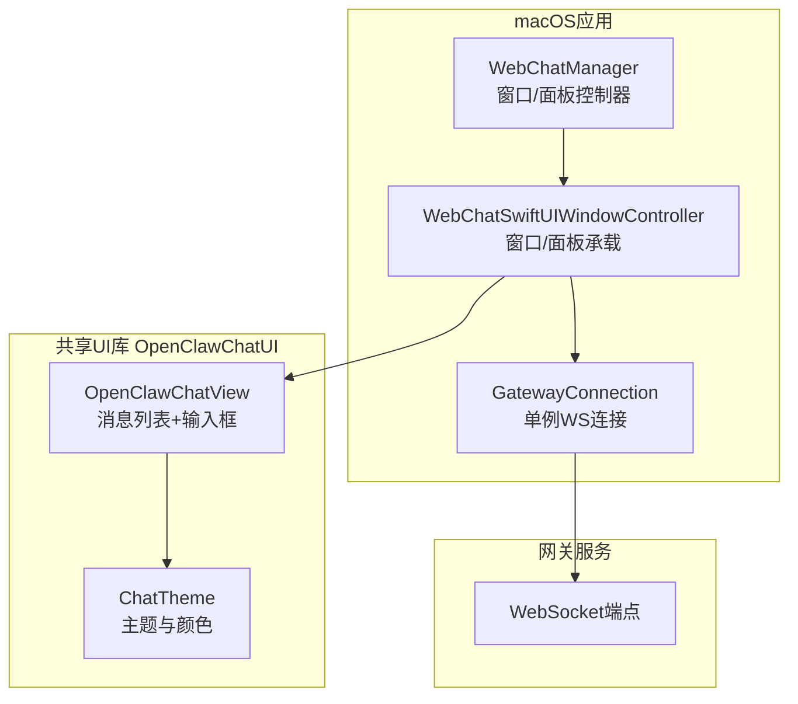
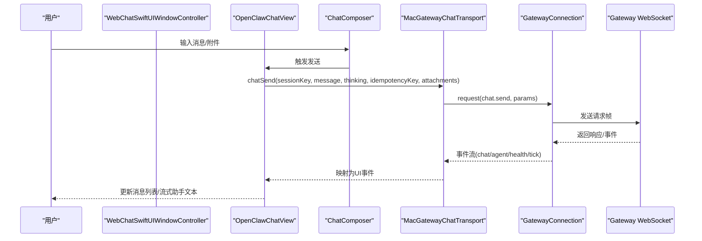
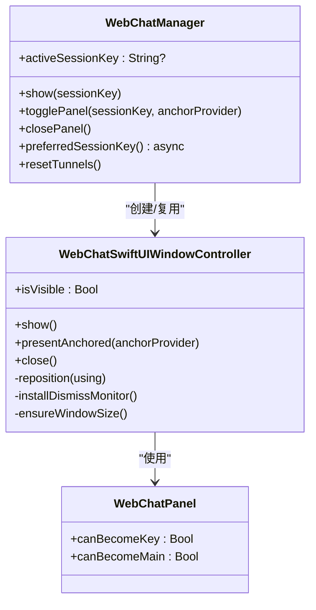
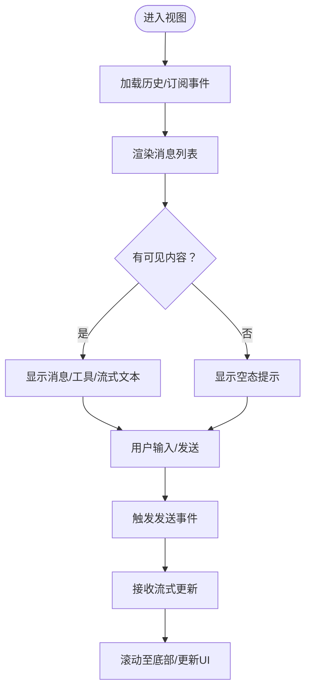
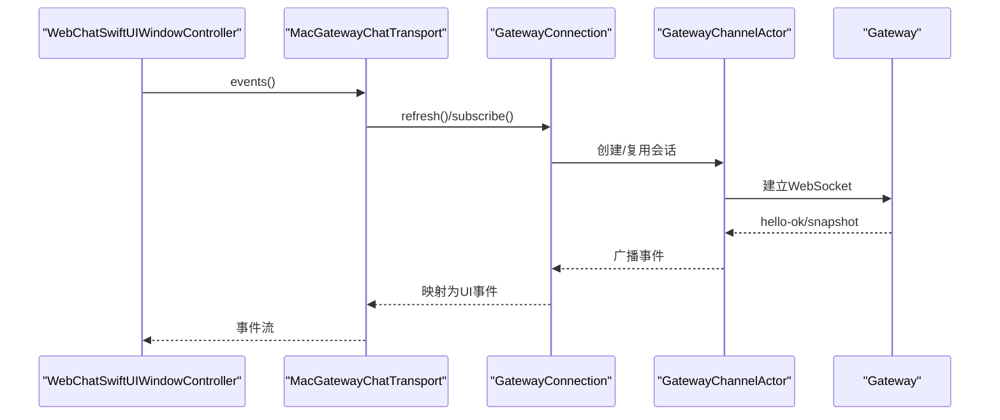
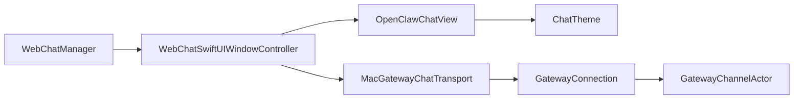

# WebChat界面

<cite>
**本文引用的文件**
- [apps/macos/Sources/OpenClaw/WebChatSwiftUI.swift](file://apps/macos/Sources/OpenClaw/WebChatSwiftUI.swift)
- [apps/macos/Sources/OpenClaw/WebChatManager.swift](file://apps/macos/Sources/OpenClaw/WebChatManager.swift)
- [apps/macos/Sources/OpenClaw/GatewayConnection.swift](file://apps/macos/Sources/OpenClaw/GatewayConnection.swift)
- [apps/shared/OpenClawKit/Sources/OpenClawChatUI/ChatView.swift](file://apps/shared/OpenClawKit/Sources/OpenClawChatUI/ChatView.swift)
- [apps/shared/OpenClawKit/Sources/OpenClawChatUI/ChatComposer.swift](file://apps/shared/OpenClawKit/Sources/OpenClawChatUI/ChatComposer.swift)
- [apps/shared/OpenClawKit/Sources/OpenClawChatUI/ChatTheme.swift](file://apps/shared/OpenClawKit/Sources/OpenClawChatUI/ChatTheme.swift)
- [apps/shared/OpenClawKit/Sources/OpenClawKit/GatewayChannel.swift](file://apps/shared/OpenClawKit/Sources/OpenClawKit/GatewayChannel.swift)
- [docs/web/webchat.md](file://docs/web/webchat.md)
- [docs/zh-CN/platforms/mac/webchat.md](file://docs/zh-CN/platforms/mac/webchat.md)
</cite>

## 目录
1. [简介](#简介)
2. [项目结构](#项目结构)
3. [核心组件](#核心组件)
4. [架构总览](#架构总览)
5. [详细组件分析](#详细组件分析)
6. [依赖关系分析](#依赖关系分析)
7. [性能考虑](#性能考虑)
8. [故障排查指南](#故障排查指南)
9. [结论](#结论)
10. [附录](#附录)

## 简介
本文件面向OpenClaw macOS应用中的WebChat界面，系统化阐述其架构设计、界面布局与交互逻辑，覆盖消息显示、输入处理、附件上传与多媒体支持、与网关服务器的WebSocket通信机制、消息同步策略、自定义配置项（主题、字体、布局）、性能优化与内存管理、以及响应式设计实现。文档同时给出关键流程的时序与类图，帮助开发者快速理解与扩展。

## 项目结构
WebChat在macOS侧由三部分协同构成：
- UI层（SwiftUI）：负责窗口/面板展示、布局与交互，位于OpenClaw应用内。
- 传输层（OpenClawChatUI）：提供跨平台聊天视图、消息列表、输入框、主题等通用UI能力。
- 通信层（GatewayConnection + GatewayChannel）：封装WebSocket连接、请求/订阅、重连与错误恢复。

图表来源
- [apps/macos/Sources/OpenClaw/WebChatManager.swift:26-122](file://apps/macos/Sources/OpenClaw/WebChatManager.swift#L26-L122)
- [apps/macos/Sources/OpenClaw/WebChatSwiftUI.swift:187-436](file://apps/macos/Sources/OpenClaw/WebChatSwiftUI.swift#L187-L436)
- [apps/macos/Sources/OpenClaw/GatewayConnection.swift:51-426](file://apps/macos/Sources/OpenClaw/GatewayConnection.swift#L51-L426)
- [apps/shared/OpenClawKit/Sources/OpenClawChatUI/ChatView.swift:6-593](file://apps/shared/OpenClawKit/Sources/OpenClawChatUI/ChatView.swift#L6-L593)
- [apps/shared/OpenClawKit/Sources/OpenClawChatUI/ChatTheme.swift:17-40](file://apps/shared/OpenClawKit/Sources/OpenClawChatUI/ChatTheme.swift#L17-L40)

章节来源
- [apps/macos/Sources/OpenClaw/WebChatManager.swift:26-122](file://apps/macos/Sources/OpenClaw/WebChatManager.swift#L26-L122)
- [apps/macos/Sources/OpenClaw/WebChatSwiftUI.swift:187-436](file://apps/macos/Sources/OpenClaw/WebChatSwiftUI.swift#L187-L436)
- [apps/macos/Sources/OpenClaw/GatewayConnection.swift:51-426](file://apps/macos/Sources/OpenClaw/GatewayConnection.swift#L51-L426)
- [apps/shared/OpenClawKit/Sources/OpenClawChatUI/ChatView.swift:6-593](file://apps/shared/OpenClawKit/Sources/OpenClawChatUI/ChatView.swift#L6-L593)
- [apps/shared/OpenClawKit/Sources/OpenClawChatUI/ChatTheme.swift:17-40](file://apps/shared/OpenClawKit/Sources/OpenClawChatUI/ChatTheme.swift#L17-L40)

## 核心组件
- WebChatManager：统一入口，负责窗口与面板两种呈现形态的生命周期管理、会话键缓存与可见性回调。
- WebChatSwiftUIWindowController：承载OpenClawChatView，负责窗口尺寸、动画、焦点、全局点击关闭等行为。
- OpenClawChatView：消息列表与输入框组合，含滚动锚定、空态/错误态、工具调用与流式助手文本展示。
- ChatComposer：输入框与发送按钮、会话切换器、健康指示器等。
- ChatTheme：跨平台主题与动态颜色解析。
- GatewayConnection：单例WebSocket客户端，封装方法调用、订阅事件、自动重连与错误恢复。
- GatewayChannel：底层WebSocket会话与帧处理，负责序列号校验、断线重连、心跳检测。

章节来源
- [apps/macos/Sources/OpenClaw/WebChatManager.swift:26-122](file://apps/macos/Sources/OpenClaw/WebChatManager.swift#L26-L122)
- [apps/macos/Sources/OpenClaw/WebChatSwiftUI.swift:187-436](file://apps/macos/Sources/OpenClaw/WebChatSwiftUI.swift#L187-L436)
- [apps/shared/OpenClawKit/Sources/OpenClawChatUI/ChatView.swift:6-593](file://apps/shared/OpenClawKit/Sources/OpenClawChatUI/ChatView.swift#L6-L593)
- [apps/shared/OpenClawKit/Sources/OpenClawChatUI/ChatComposer.swift:242-272](file://apps/shared/OpenClawKit/Sources/OpenClawChatUI/ChatComposer.swift#L242-L272)
- [apps/shared/OpenClawKit/Sources/OpenClawChatUI/ChatTheme.swift:17-40](file://apps/shared/OpenClawKit/Sources/OpenClawChatUI/ChatTheme.swift#L17-L40)
- [apps/macos/Sources/OpenClaw/GatewayConnection.swift:51-426](file://apps/macos/Sources/OpenClaw/GatewayConnection.swift#L51-L426)
- [apps/shared/OpenClawKit/Sources/OpenClawKit/GatewayChannel.swift:573-603](file://apps/shared/OpenClawKit/Sources/OpenClawKit/GatewayChannel.swift#L573-L603)

## 架构总览
WebChat采用“UI层-传输层-网关层”三层协作：
- UI层通过OpenClawChatView驱动消息渲染与输入交互，内部持有ViewModel。
- 传输层由MacGatewayChatTransport实现，桥接GatewayConnection的请求/订阅接口。
- 网关层通过GatewayConnection维护单一WebSocket连接，自动处理认证、重连与事件分发。

图表来源
- [apps/macos/Sources/OpenClaw/WebChatSwiftUI.swift:87-128](file://apps/macos/Sources/OpenClaw/WebChatSwiftUI.swift#L87-L128)
- [apps/macos/Sources/OpenClaw/GatewayConnection.swift:614-671](file://apps/macos/Sources/OpenClaw/GatewayConnection.swift#L614-L671)
- [apps/shared/OpenClawKit/Sources/OpenClawKit/GatewayChannel.swift:573-603](file://apps/shared/OpenClawKit/Sources/OpenClawKit/GatewayChannel.swift#L573-L603)

章节来源
- [apps/macos/Sources/OpenClaw/WebChatSwiftUI.swift:87-128](file://apps/macos/Sources/OpenClaw/WebChatSwiftUI.swift#L87-L128)
- [apps/macos/Sources/OpenClaw/GatewayConnection.swift:614-671](file://apps/macos/Sources/OpenClaw/GatewayConnection.swift#L614-L671)
- [apps/shared/OpenClawKit/Sources/OpenClawKit/GatewayChannel.swift:573-603](file://apps/shared/OpenClawKit/Sources/OpenClawKit/GatewayChannel.swift#L573-L603)

## 详细组件分析

### 窗口与面板管理（WebChatManager / WebChatSwiftUIWindowController）
- 窗口形态：可调整大小、最小尺寸约束、居中显示、透明背景、圆角与阴影。
- 面板形态：无边框、置顶、随鼠标悬停/点击锚定、全局点击外区域自动关闭、动画展开。
- 会话键缓存：优先使用主会话键，支持切换后复用控制器避免重复初始化。
- 可见性回调：统一上报面板显隐状态，便于上层联动。

图表来源
- [apps/macos/Sources/OpenClaw/WebChatManager.swift:26-122](file://apps/macos/Sources/OpenClaw/WebChatManager.swift#L26-L122)
- [apps/macos/Sources/OpenClaw/WebChatSwiftUI.swift:187-436](file://apps/macos/Sources/OpenClaw/WebChatSwiftUI.swift#L187-L436)

章节来源
- [apps/macos/Sources/OpenClaw/WebChatManager.swift:26-122](file://apps/macos/Sources/OpenClaw/WebChatManager.swift#L26-L122)
- [apps/macos/Sources/OpenClaw/WebChatSwiftUI.swift:187-436](file://apps/macos/Sources/OpenClaw/WebChatSwiftUI.swift#L187-L436)

### 消息显示与输入（OpenClawChatView / ChatComposer）
- 消息列表：懒加载堆叠、顶部/水平/底部内边距、滚动锚定至底部、空态/错误态提示。
- 流式助手文本：基于事件流实时更新，支持思维链开关。
- 工具调用：合并工具结果到对应消息，避免重复展示。
- 输入框：占位提示、连接健康指示、会话切换器、发送按钮与快捷键。
- 错误与刷新：根据错误内容映射为断开/超时/一般错误，并提供刷新入口。

图表来源
- [apps/shared/OpenClawKit/Sources/OpenClawChatUI/ChatView.swift:95-494](file://apps/shared/OpenClawKit/Sources/OpenClawChatUI/ChatView.swift#L95-L494)
- [apps/shared/OpenClawKit/Sources/OpenClawChatUI/ChatComposer.swift:242-272](file://apps/shared/OpenClawKit/Sources/OpenClawChatUI/ChatComposer.swift#L242-L272)

章节来源
- [apps/shared/OpenClawKit/Sources/OpenClawChatUI/ChatView.swift:95-494](file://apps/shared/OpenClawKit/Sources/OpenClawChatUI/ChatView.swift#L95-L494)
- [apps/shared/OpenClawKit/Sources/OpenClawChatUI/ChatComposer.swift:242-272](file://apps/shared/OpenClawKit/Sources/OpenClawChatUI/ChatComposer.swift#L242-L272)

### 主题与布局（ChatTheme / ChatView）
- 主题：跨平台动态颜色解析，macOS侧针对浅/深色外观提供不同气泡色。
- 布局：按平台差异化内边距、间距、圆角与阴影，保证一致视觉体验。
- 会话切换器：在窗口形态下可显示，面板形态下隐藏以节省空间。

章节来源
- [apps/shared/OpenClawKit/Sources/OpenClawChatUI/ChatTheme.swift:17-40](file://apps/shared/OpenClawKit/Sources/OpenClawChatUI/ChatTheme.swift#L17-L40)
- [apps/shared/OpenClawKit/Sources/OpenClawChatUI/ChatView.swift:26-46](file://apps/shared/OpenClawKit/Sources/OpenClawChatUI/ChatView.swift#L26-L46)

### 通信机制与消息同步（GatewayConnection / GatewayChannel）
- 单例连接：GatewayConnection为全局唯一，复用同一GatewayChannelActor。
- 方法调用：封装chat.history、chat.send、chat.abort、sessions.list等，统一参数编码与解码。
- 订阅事件：AsyncStream分发health、tick、chat、agent等事件，支持快照与序列号gap检测。
- 自动重连：本地模式自动拉起/等待网关，远程模式重建隧道；异常时多段延迟重试。
- 历史边界：history接口受网关裁剪策略影响，长文本与大负载会被压缩或省略。

图表来源
- [apps/macos/Sources/OpenClaw/WebChatSwiftUI.swift:106-128](file://apps/macos/Sources/OpenClaw/WebChatSwiftUI.swift#L106-L128)
- [apps/macos/Sources/OpenClaw/GatewayConnection.swift:345-376](file://apps/macos/Sources/OpenClaw/GatewayConnection.swift#L345-L376)
- [apps/shared/OpenClawKit/Sources/OpenClawKit/GatewayChannel.swift:573-603](file://apps/shared/OpenClawKit/Sources/OpenClawKit/GatewayChannel.swift#L573-L603)

章节来源
- [apps/macos/Sources/OpenClaw/WebChatSwiftUI.swift:106-128](file://apps/macos/Sources/OpenClaw/WebChatSwiftUI.swift#L106-L128)
- [apps/macos/Sources/OpenClaw/GatewayConnection.swift:345-376](file://apps/macos/Sources/OpenClaw/GatewayConnection.swift#L345-L376)
- [apps/shared/OpenClawKit/Sources/OpenClawKit/GatewayChannel.swift:573-603](file://apps/shared/OpenClawKit/Sources/OpenClawKit/GatewayChannel.swift#L573-L603)

### 附件上传与多媒体支持
- 附件参数：类型、MIME、文件名、内容（base64/二进制），随消息一并发送。
- 渲染策略：文件/附件类型的消息在消息列表中以内联附件形式展示，支持下载/预览。
- 多媒体：Markdown渲染器与消息内容类型共同决定图片/视频/音频等资源的展示方式。

章节来源
- [apps/macos/Sources/OpenClaw/GatewayConnection.swift:634-662](file://apps/macos/Sources/OpenClaw/GatewayConnection.swift#L634-L662)
- [apps/shared/OpenClawKit/Sources/OpenClawChatUI/ChatView.swift:440-449](file://apps/shared/OpenClawKit/Sources/OpenClawChatUI/ChatView.swift#L440-L449)

### 自定义配置与界面定制
- 主题设置：通过用户强调色（userAccent）与动态主题色适配浅/深色外观。
- 字体与布局：平台差异化布局常量，确保在macOS/iOS上一致体验。
- 会话与模型：支持列出会话、切换主会话、设置模型与思考层级（thinking level）。
- 思考层级持久化：用户选择的记忆化存储于UserDefaults，重启后保留。

章节来源
- [apps/macos/Sources/OpenClaw/WebChatSwiftUI.swift:211-215](file://apps/macos/Sources/OpenClaw/WebChatSwiftUI.swift#L211-L215)
- [apps/macos/Sources/OpenClaw/WebChatSwiftUI.swift:309-317](file://apps/macos/Sources/OpenClaw/WebChatSwiftUI.swift#L309-L317)
- [apps/macos/Sources/OpenClaw/WebChatSwiftUI.swift:50-85](file://apps/macos/Sources/OpenClaw/WebChatSwiftUI.swift#L50-L85)

## 依赖关系分析
- WebChatManager依赖WebChatSwiftUIWindowController进行窗口/面板管理。
- WebChatSwiftUIWindowController依赖OpenClawChatView与ChatTheme提供UI能力。
- 传输层（MacGatewayChatTransport）依赖GatewayConnection进行请求/订阅。
- GatewayConnection依赖GatewayChannel进行底层WebSocket会话与帧处理。
- 文档层面：WebChat行为与配置参考官方文档。

图表来源
- [apps/macos/Sources/OpenClaw/WebChatManager.swift:26-122](file://apps/macos/Sources/OpenClaw/WebChatManager.swift#L26-L122)
- [apps/macos/Sources/OpenClaw/WebChatSwiftUI.swift:187-436](file://apps/macos/Sources/OpenClaw/WebChatSwiftUI.swift#L187-L436)
- [apps/shared/OpenClawKit/Sources/OpenClawChatUI/ChatView.swift:6-593](file://apps/shared/OpenClawKit/Sources/OpenClawChatUI/ChatView.swift#L6-L593)
- [apps/shared/OpenClawKit/Sources/OpenClawChatUI/ChatTheme.swift:17-40](file://apps/shared/OpenClawKit/Sources/OpenClawChatUI/ChatTheme.swift#L17-L40)
- [apps/macos/Sources/OpenClaw/WebChatSwiftUI.swift:20-182](file://apps/macos/Sources/OpenClaw/WebChatSwiftUI.swift#L20-L182)
- [apps/macos/Sources/OpenClaw/GatewayConnection.swift:51-426](file://apps/macos/Sources/OpenClaw/GatewayConnection.swift#L51-L426)
- [apps/shared/OpenClawKit/Sources/OpenClawKit/GatewayChannel.swift:573-603](file://apps/shared/OpenClawKit/Sources/OpenClawKit/GatewayChannel.swift#L573-L603)

章节来源
- [apps/macos/Sources/OpenClaw/WebChatManager.swift:26-122](file://apps/macos/Sources/OpenClaw/WebChatManager.swift#L26-L122)
- [apps/macos/Sources/OpenClaw/WebChatSwiftUI.swift:20-182](file://apps/macos/Sources/OpenClaw/WebChatSwiftUI.swift#L20-L182)
- [apps/macos/Sources/OpenClaw/GatewayConnection.swift:51-426](file://apps/macos/Sources/OpenClaw/GatewayConnection.swift#L51-L426)
- [apps/shared/OpenClawKit/Sources/OpenClawKit/GatewayChannel.swift:573-603](file://apps/shared/OpenClawKit/Sources/OpenClawKit/GatewayChannel.swift#L573-L603)

## 性能考虑
- 滚动锚定：使用scrollPosition与bottom锚点，避免ScrollViewReader反复布局导致卡顿。
- 懒加载消息：LazyVStack减少大列表渲染开销。
- 事件流缓冲：AsyncStream缓冲最新事件，避免历史风暴造成UI阻塞。
- 自动重连与降级：本地模式自动拉起网关、远程模式重建隧道，提升可用性。
- 内容裁剪：history接口可能裁剪长文本与大负载，UI侧需兼容“省略”提示。
- 动画与阴影：面板展开使用短时序动画，避免复杂阴影影响低端设备。

[本节为通用性能建议，不直接分析具体文件]

## 故障排查指南
- 断开连接：错误文案包含“未连接/套接字”时，优先检查网关是否启动、端口与认证配置。
- 超时：错误文案包含“超时”时，确认网络状况与远程隧道状态。
- 一般错误：查看日志子系统“bot.molt”，类别“WebChatSwiftUI”定位问题。
- 本地模式无法连接：确认本地网关进程已启动，必要时允许自动重启。
- 远程模式不可达：检查SSH/Tailscale隧道是否建立，必要时重置隧道。

章节来源
- [docs/zh-CN/platforms/mac/webchat.md:29](file://docs/zh-CN/platforms/mac/webchat.md#L29)
- [apps/shared/OpenClawKit/Sources/OpenClawChatUI/ChatView.swift:337-346](file://apps/shared/OpenClawKit/Sources/OpenClawChatUI/ChatView.swift#L337-L346)

## 结论
WebChat通过清晰的三层架构实现了稳定的聊天体验：UI层专注布局与交互，传输层抽象通信细节，网关层提供可靠的数据平面。配合自动重连、事件流与历史裁剪策略，WebChat在macOS上提供了流畅、可定制且具备良好性能表现的聊天界面。

## 附录

### 配置参考（来自文档）
- 端口与绑定：gateway.port、gateway.bind
- 认证：gateway.auth.mode、gateway.auth.token、gateway.auth.password
- 反向代理认证：trusted-proxy
- 远程目标：gateway.remote.url、gateway.remote.token、gateway.remote.password
- 会话：session.*

章节来源
- [docs/web/webchat.md:47-62](file://docs/web/webchat.md#L47-L62)