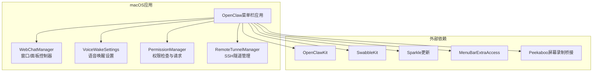
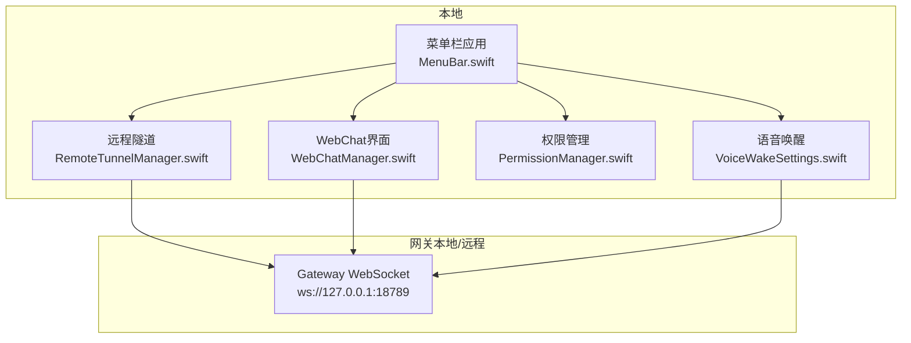
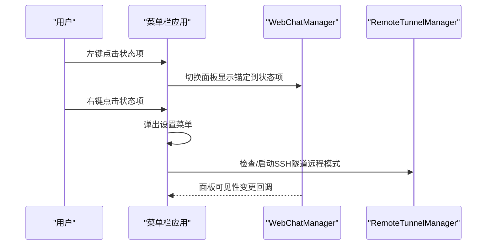
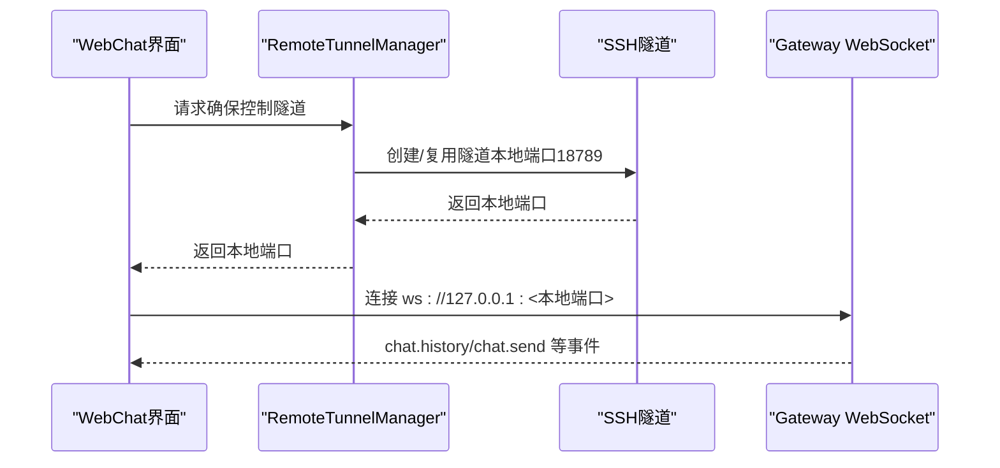
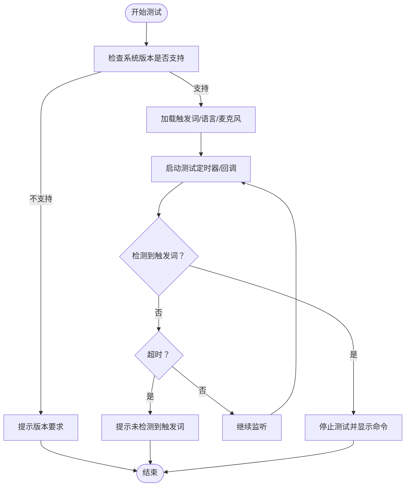
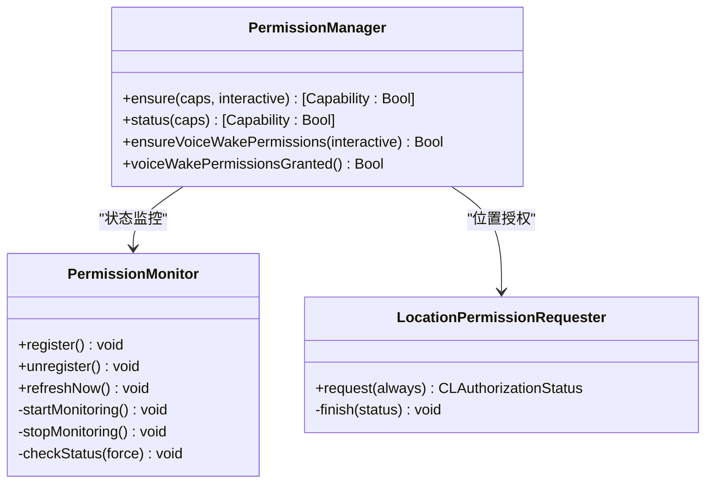
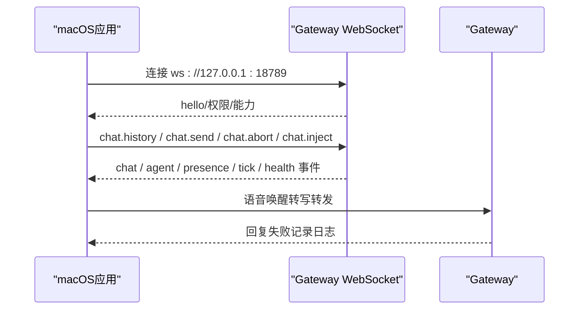
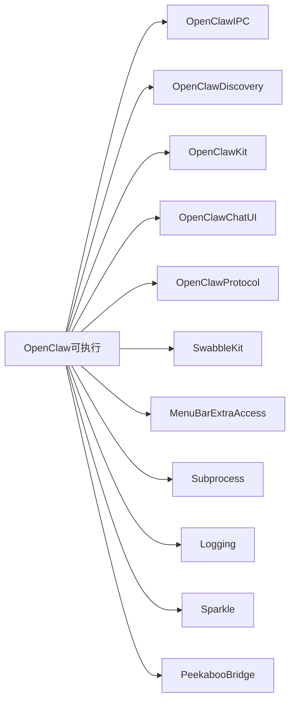

# macOS应用

<cite>
**本文引用的文件**
- [README.md](file://README.md)
- [apps/macos/README.md](file://apps/macos/README.md)
- [apps/macos/Package.swift](file://apps/macos/Package.swift)
- [apps/macos/Sources/OpenClaw/MenuBar.swift](file://apps/macos/Sources/OpenClaw/MenuBar.swift)
- [apps/macos/Sources/OpenClaw/WebChatManager.swift](file://apps/macos/Sources/OpenClaw/WebChatManager.swift)
- [apps/macos/Sources/OpenClaw/VoiceWakeSettings.swift](file://apps/macos/Sources/OpenClaw/VoiceWakeSettings.swift)
- [apps/macos/Sources/OpenClaw/PermissionManager.swift](file://apps/macos/Sources/OpenClaw/PermissionManager.swift)
- [apps/macos/Sources/OpenClaw/RemoteTunnelManager.swift](file://apps/macos/Sources/OpenClaw/RemoteTunnelManager.swift)
- [docs/platforms/mac/webchat.md](file://docs/platforms/mac/webchat.md)
- [docs/web/webchat.md](file://docs/web/webchat.md)
- [docs/platforms/mac/voicewake.md](file://docs/platforms/mac/voicewake.md)
- [docs/gateway/remote.md](file://docs/gateway/remote.md)
- [src/gateway/client.ts](file://src/gateway/client.ts)
</cite>

## 目录
1. [简介](#简介)
2. [项目结构](#项目结构)
3. [核心组件](#核心组件)
4. [架构总览](#架构总览)
5. [详细组件分析](#详细组件分析)
6. [依赖关系分析](#依赖关系分析)
7. [性能考虑](#性能考虑)
8. [故障排除指南](#故障排除指南)
9. [结论](#结论)
10. [附录](#附录)

## 简介
本文件面向OpenClaw的macOS应用（菜单栏控制面板），系统性阐述其核心功能与技术实现，包括：
- 菜单栏控制面板与状态指示
- 语音唤醒（Voice Wake）与“按住说话”（Push-to-Talk）模式
- WebChat界面与远程访问
- 权限管理系统与TCC权限处理
- 屏幕录制权限配置
- 与网关服务器的WebSocket通信、隧道管理与远程访问配置
- 安装配置、调试与常见问题解决

该应用采用SwiftUI构建，通过OpenClawKit与Swabble等模块集成，提供本地与远程两种连接模式，支持SSH隧道转发网关控制端口，确保WebChat与语音功能在远程场景下稳定可用。

## 项目结构
macOS应用位于apps/macos目录，核心由以下部分组成：
- 包定义与产品：OpenClaw（可执行）、OpenClawIPC（库）、OpenClawDiscovery（库）、OpenClawMacCLI（命令行工具）
- 核心运行入口：MenuBar.swift（应用入口与菜单栏交互）
- WebChat集成：WebChatManager.swift（窗口/面板展示与会话管理）
- 语音唤醒：VoiceWakeSettings.swift（触发词、语言、麦克风、音量表）
- 权限管理：PermissionManager.swift（通知、辅助功能、屏幕录制、麦克风、语音识别、相机、位置、AppleScript）
- 远程隧道：RemoteTunnelManager.swift（SSH隧道复用与重启退避）
- 文档参考：docs/platforms/mac/webchat.md、docs/web/webchat.md、docs/platforms/mac/voicewake.md、docs/gateway/remote.md

图表来源
- [apps/macos/Package.swift:26-92](file://apps/macos/Package.swift#L26-L92)
- [apps/macos/Sources/OpenClaw/MenuBar.swift:10-92](file://apps/macos/Sources/OpenClaw/MenuBar.swift#L10-L92)

章节来源
- [apps/macos/Package.swift:1-93](file://apps/macos/Package.swift#L1-L93)
- [apps/macos/README.md:1-65](file://apps/macos/README.md#L1-L65)

## 核心组件
- 菜单栏控制面板与状态指示：MenuBar.swift负责状态项外观、点击行为、悬浮HUD抑制、工作状态与睡眠态判断。
- WebChat界面：WebChatManager.swift负责以窗口或面板形式展示WebChat，支持锚定到菜单栏区域，缓存控制器以便快速重开。
- 语音唤醒：VoiceWakeSettings.swift提供触发词、语言、麦克风选择、实时音量表、测试与提示音播放。
- 权限管理：PermissionManager.swift统一处理通知、辅助功能、屏幕录制、麦克风、语音识别、相机、位置、AppleScript等TCC权限的查询与请求。
- 远程隧道：RemoteTunnelManager.swift负责SSH隧道的创建、复用、监听检测与重启退避策略，确保远程模式下的WS连接稳定。

章节来源
- [apps/macos/Sources/OpenClaw/MenuBar.swift:114-131](file://apps/macos/Sources/OpenClaw/MenuBar.swift#L114-L131)
- [apps/macos/Sources/OpenClaw/WebChatManager.swift:25-122](file://apps/macos/Sources/OpenClaw/WebChatManager.swift#L25-L122)
- [apps/macos/Sources/OpenClaw/VoiceWakeSettings.swift:9-143](file://apps/macos/Sources/OpenClaw/VoiceWakeSettings.swift#L9-L143)
- [apps/macos/Sources/OpenClaw/PermissionManager.swift:12-228](file://apps/macos/Sources/OpenClaw/PermissionManager.swift#L12-L228)
- [apps/macos/Sources/OpenClaw/RemoteTunnelManager.swift:4-123](file://apps/macos/Sources/OpenClaw/RemoteTunnelManager.swift#L4-L123)

## 架构总览
macOS应用与网关的交互遵循“菜单栏控制面板 + WebChat + 语音唤醒”的一体化架构；远程模式通过SSH隧道转发网关控制端口（默认18789），WebChat直接连接该WS端点。

图表来源
- [apps/macos/Sources/OpenClaw/MenuBar.swift:41-92](file://apps/macos/Sources/OpenClaw/MenuBar.swift#L41-L92)
- [apps/macos/Sources/OpenClaw/WebChatManager.swift:25-122](file://apps/macos/Sources/OpenClaw/WebChatManager.swift#L25-L122)
- [apps/macos/Sources/OpenClaw/RemoteTunnelManager.swift:51-78](file://apps/macos/Sources/OpenClaw/RemoteTunnelManager.swift#L51-L78)
- [docs/gateway/remote.md:122-133](file://docs/gateway/remote.md#L122-L133)

章节来源
- [docs/gateway/remote.md:122-133](file://docs/gateway/remote.md#L122-L133)
- [docs/web/webchat.md:1-32](file://docs/web/webchat.md#L1-L32)
- [docs/platforms/mac/webchat.md:1-44](file://docs/platforms/mac/webchat.md#L1-L44)

## 详细组件分析

### 菜单栏控制面板与状态指示
- 状态项外观：根据暂停、睡眠、工作、耳朵增强等状态动态调整高亮与禁用态。
- 鼠标交互：左键切换WebChat面板，右键弹出设置菜单；悬停触发悬浮HUD。
- 会话注入：向菜单项注入会话切换能力，便于在不同会话间切换。
- 连接模式：根据本地/远程模式应用不同的行为（如暂停时本地会停止网关进程）。

图表来源
- [apps/macos/Sources/OpenClaw/MenuBar.swift:134-185](file://apps/macos/Sources/OpenClaw/MenuBar.swift#L134-L185)
- [apps/macos/Sources/OpenClaw/WebChatManager.swift:41-90](file://apps/macos/Sources/OpenClaw/WebChatManager.swift#L41-L90)
- [apps/macos/Sources/OpenClaw/RemoteTunnelManager.swift:51-78](file://apps/macos/Sources/OpenClaw/RemoteTunnelManager.swift#L51-L78)

章节来源
- [apps/macos/Sources/OpenClaw/MenuBar.swift:114-131](file://apps/macos/Sources/OpenClaw/MenuBar.swift#L114-L131)
- [apps/macos/Sources/OpenClaw/MenuBar.swift:134-185](file://apps/macos/Sources/OpenClaw/MenuBar.swift#L134-L185)

### WebChat界面与远程访问
- 本地模式：直接连接本地网关WS（ws://127.0.0.1:18789）。
- 远程模式：通过SSH隧道转发网关控制端口，应用侧复用已存在的隧道或新建隧道，确保WS连接稳定。
- 会话管理：默认主会话（main/global），支持切换；自动缓存首选会话键值，避免重复查询。
- 面板/窗口：支持以面板（锚定到状态项）或独立窗口展示，面板具备键盘焦点以便输入。

图表来源
- [apps/macos/Sources/OpenClaw/WebChatManager.swift:96-101](file://apps/macos/Sources/OpenClaw/WebChatManager.swift#L96-L101)
- [apps/macos/Sources/OpenClaw/RemoteTunnelManager.swift:51-78](file://apps/macos/Sources/OpenClaw/RemoteTunnelManager.swift#L51-L78)
- [docs/gateway/remote.md:122-133](file://docs/gateway/remote.md#L122-L133)

章节来源
- [docs/platforms/mac/webchat.md:1-44](file://docs/platforms/mac/webchat.md#L1-L44)
- [docs/web/webchat.md:1-32](file://docs/web/webchat.md#L1-L32)
- [apps/macos/Sources/OpenClaw/WebChatManager.swift:25-122](file://apps/macos/Sources/OpenClaw/WebChatManager.swift#L25-L122)
- [apps/macos/Sources/OpenClaw/RemoteTunnelManager.swift:14-47](file://apps/macos/Sources/OpenClaw/RemoteTunnelManager.swift#L14-L47)

### 语音唤醒（Voice Wake）与按住说话
- 功能特性：支持设备内语音识别、触发词列表、多语言、麦克风选择、实时音量表、测试与提示音。
- 行为说明：启用后，转写结果可转发至当前活动网关/代理；回复默认发送至上次使用的主渠道（失败时记录日志并在WebChat中可见）。
- 设置界面：提供触发词增删、重置默认、语言与麦克风选择、音量表与测试卡片。

图表来源
- [apps/macos/Sources/OpenClaw/VoiceWakeSettings.swift:242-305](file://apps/macos/Sources/OpenClaw/VoiceWakeSettings.swift#L242-L305)
- [docs/platforms/mac/voicewake.md:55-68](file://docs/platforms/mac/voicewake.md#L55-L68)

章节来源
- [apps/macos/Sources/OpenClaw/VoiceWakeSettings.swift:9-143](file://apps/macos/Sources/OpenClaw/VoiceWakeSettings.swift#L9-L143)
- [docs/platforms/mac/voicewake.md:55-68](file://docs/platforms/mac/voicewake.md#L55-L68)

### 权限管理系统与TCC处理
- 统一接口：PermissionManager提供ensure与status两类API，覆盖通知、AppleScript、辅助功能、屏幕录制、麦克风、语音识别、相机、位置。
- 交互式授权：对于未授权且需要交互的权限，会触发系统TCC对话框或打开系统设置页面。
- 监控与轮询：PermissionMonitor周期性检查权限状态，最小检查间隔0.5秒，避免频繁调用系统API。
- 特殊处理：
  - 屏幕录制：使用CGPreflightScreenCaptureAccess与CGRequestScreenCaptureAccess进行预检与请求。
  - 位置：通过CLLocationManager委托回调与超时机制，确保授权完成或引导用户前往设置。
  - AppleScript：通过发送轻量AppleScript验证自动化权限，必要时打开隐私与安全性中的Automation设置。

图表来源
- [apps/macos/Sources/OpenClaw/PermissionManager.swift:25-228](file://apps/macos/Sources/OpenClaw/PermissionManager.swift#L25-L228)
- [apps/macos/Sources/OpenClaw/PermissionManager.swift:399-466](file://apps/macos/Sources/OpenClaw/PermissionManager.swift#L399-L466)
- [apps/macos/Sources/OpenClaw/PermissionManager.swift:267-349](file://apps/macos/Sources/OpenClaw/PermissionManager.swift#L267-L349)

章节来源
- [apps/macos/Sources/OpenClaw/PermissionManager.swift:12-228](file://apps/macos/Sources/OpenClaw/PermissionManager.swift#L12-L228)
- [apps/macos/Sources/OpenClaw/PermissionManager.swift:399-466](file://apps/macos/Sources/OpenClaw/PermissionManager.swift#L399-L466)

### 屏幕录制权限配置
- 预检与请求：使用CGPreflightScreenCaptureAccess与CGRequestScreenCaptureAccess进行权限预检与请求。
- 与节点能力联动：macOS应用可声明节点能力并通过Gateway协议调用屏幕录制相关操作，需确保屏幕录制权限已授予。
- 开发签名与TCC持久化：开发签名可使TCC权限在重建后仍保持；若使用临时签名，TCC权限不会持久。

章节来源
- [apps/macos/Sources/OpenClaw/PermissionManager.swift:468-483](file://apps/macos/Sources/OpenClaw/PermissionManager.swift#L468-L483)
- [apps/macos/README.md:25-56](file://apps/macos/README.md#L25-L56)

### 网关通信协议与WebSocket连接
- 数据平面：WebChat与语音唤醒均通过Gateway WebSocket方法与事件进行交互（chat.history、chat.send、chat.abort、chat.inject及chat、agent、presence、tick、health等事件）。
- 认证与安全：远程模式仅转发网关控制端口，不暴露额外服务；本地模式默认绑定回环地址，结合认证策略保障安全。
- 客户端选项：GatewayClient支持多种参数（URL、令牌、密码、实例ID、客户端信息、权限映射、TLS指纹等），并提供事件回调与错误处理。

图表来源
- [docs/web/webchat.md:24-32](file://docs/web/webchat.md#L24-L32)
- [src/gateway/client.ts:67-96](file://src/gateway/client.ts#L67-L96)

章节来源
- [docs/web/webchat.md:1-32](file://docs/web/webchat.md#L1-L32)
- [src/gateway/client.ts:43-96](file://src/gateway/client.ts#L43-L96)

## 依赖关系分析
- 包依赖：OpenClaw目标依赖OpenClawIPC、OpenClawDiscovery、OpenClawKit、OpenClawChatUI、OpenClawProtocol、SwabbleKit、MenuBarExtraAccess、Subprocess、Logging、Sparkle、PeekabooBridge等。
- 平台最低版本：macOS 15（Swift Package配置）。
- 外部库作用：
  - MenuBarExtraAccess：菜单栏扩展访问
  - Sparkle：应用更新
  - Peekaboo：屏幕录制桥接
  - SwabbleKit：语音唤醒引擎
  - OpenClawKit：跨平台协议与UI组件

图表来源
- [apps/macos/Package.swift:42-57](file://apps/macos/Package.swift#L42-L57)

章节来源
- [apps/macos/Package.swift:1-93](file://apps/macos/Package.swift#L1-L93)

## 性能考虑
- 隧道复用与退避：RemoteTunnelManager在隧道活跃且监听正常时复用，避免频繁创建；重启有退避策略，降低资源抖动。
- 权限轮询节流：PermissionMonitor最小检查间隔0.5秒，减少系统API调用频率。
- WebChat面板缓存：WebChatManager缓存控制器，避免每次打开都重新初始化。
- 语音唤醒测试：测试启动/停止与超时任务管理，防止长时间占用资源。

章节来源
- [apps/macos/Sources/OpenClaw/RemoteTunnelManager.swift:92-119](file://apps/macos/Sources/OpenClaw/RemoteTunnelManager.swift#L92-L119)
- [apps/macos/Sources/OpenClaw/PermissionManager.swift:429-441](file://apps/macos/Sources/OpenClaw/PermissionManager.swift#L429-L441)
- [apps/macos/Sources/OpenClaw/WebChatManager.swift:117-121](file://apps/macos/Sources/OpenClaw/WebChatManager.swift#L117-L121)
- [apps/macos/Sources/OpenClaw/VoiceWakeSettings.swift:242-305](file://apps/macos/Sources/OpenClaw/VoiceWakeSettings.swift#L242-L305)

## 故障排除指南
- WebChat不可用（远程模式）：
  - 确认SSH隧道已建立并监听；若监听异常，应用会自动重启隧道。
  - 使用日志定位：子系统“ai.openclaw”，类别“WebChatSwiftUI”。
- 语音唤醒无响应：
  - 检查系统版本是否满足要求；确认麦克风与语音识别权限已授权。
  - 使用测试卡片验证触发词与语言设置。
- 权限未生效：
  - 使用权限监控面板查看状态；必要时重新触发系统授权对话。
  - 若为开发签名，权限可能不会持久，需重新授权。
- 远程访问无法连接：
  - 确认远程目标可达与端口转发正确；检查认证方式（令牌/密码）。
  - 参考文档：macOS远程访问与SSH隧道说明。

章节来源
- [apps/macos/Sources/OpenClaw/RemoteTunnelManager.swift:14-47](file://apps/macos/Sources/OpenClaw/RemoteTunnelManager.swift#L14-L47)
- [docs/platforms/mac/webchat.md:27-28](file://docs/platforms/mac/webchat.md#L27-L28)
- [apps/macos/Sources/OpenClaw/VoiceWakeSettings.swift:242-305](file://apps/macos/Sources/OpenClaw/VoiceWakeSettings.swift#L242-L305)
- [apps/macos/Sources/OpenClaw/PermissionManager.swift:429-466](file://apps/macos/Sources/OpenClaw/PermissionManager.swift#L429-L466)
- [apps/macos/README.md:25-56](file://apps/macos/README.md#L25-L56)
- [docs/gateway/remote.md:122-133](file://docs/gateway/remote.md#L122-L133)

## 结论
OpenClaw的macOS应用以菜单栏为核心入口，整合WebChat、语音唤醒与权限管理，提供本地与远程两种稳定的工作模式。通过SSH隧道转发网关控制端口，配合严格的权限检查与监控，确保在远程场景下也能流畅使用WebChat与语音功能。开发签名与TCC权限持久化策略进一步提升用户体验。

## 附录
- 安装与打包：参考apps/macos/README.md中的打包流程与签名行为说明。
- 文档索引：
  - macOS WebChat：docs/platforms/mac/webchat.md
  - WebChat通用说明：docs/web/webchat.md
  - macOS语音唤醒：docs/platforms/mac/voicewake.md
  - 网关远程访问：docs/gateway/remote.md
  - 项目总览与功能概览：README.md

章节来源
- [apps/macos/README.md:1-65](file://apps/macos/README.md#L1-L65)
- [docs/platforms/mac/webchat.md:1-44](file://docs/platforms/mac/webchat.md#L1-L44)
- [docs/web/webchat.md:1-32](file://docs/web/webchat.md#L1-L32)
- [docs/platforms/mac/voicewake.md:55-68](file://docs/platforms/mac/voicewake.md#L55-L68)
- [docs/gateway/remote.md:122-133](file://docs/gateway/remote.md#L122-L133)
- [README.md:289-297](file://README.md#L289-L297)