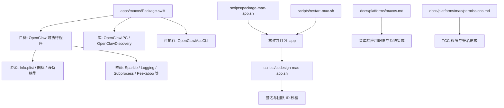
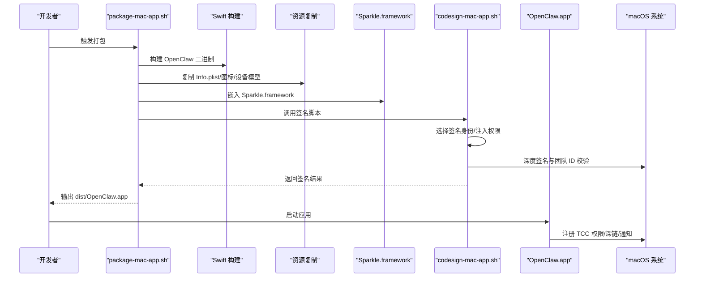
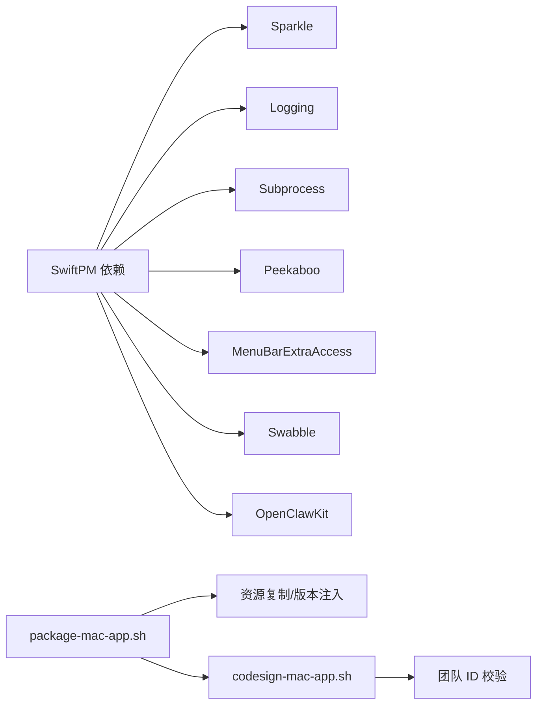

# 安装配置

<cite>
**本文引用的文件**
- [apps/macos/README.md](file://apps/macos/README.md)
- [apps/macos/Package.swift](file://apps/macos/Package.swift)
- [apps/macos/Sources/OpenClaw/Resources/Info.plist](file://apps/macos/Sources/OpenClaw/Resources/Info.plist)
- [scripts/package-mac-app.sh](file://scripts/package-mac-app.sh)
- [scripts/codesign-mac-app.sh](file://scripts/codesign-mac-app.sh)
- [scripts/restart-mac.sh](file://scripts/restart-mac.sh)
- [docs/platforms/macos.md](file://docs/platforms/macos.md)
- [docs/platforms/mac/permissions.md](file://docs/platforms/mac/permissions.md)
- [docs/install/installer.md](file://docs/install/installer.md)
- [docs/install/macos-vm.md](file://docs/install/macos-vm.md)
</cite>

## 目录
1. [简介](#简介)
2. [项目结构](#项目结构)
3. [核心组件](#核心组件)
4. [架构总览](#架构总览)
5. [详细组件分析](#详细组件分析)
6. [依赖分析](#依赖分析)
7. [性能考虑](#性能考虑)
8. [故障排除指南](#故障排除指南)
9. [结论](#结论)
10. [附录](#附录)

## 简介
本指南面向在 macOS 上安装与配置 OpenClaw 的用户，覆盖系统兼容性、前置条件、安装步骤、配置选项、初始设置、签名验证与沙盒限制、系统集成、升级更新、卸载清理与备份恢复等全生命周期操作。内容基于仓库中的 macOS 应用工程、打包脚本与平台文档整理而成，确保可操作性与可追溯性。

## 项目结构
OpenClaw 的 macOS 应用位于 apps/macos 目录，采用 Swift Package Manager 构建，配套多阶段打包与签名脚本，以及平台级文档说明应用行为与系统集成方式。

图表来源
- [apps/macos/Package.swift:1-93](file://apps/macos/Package.swift#L1-L93)
- [scripts/package-mac-app.sh:1-288](file://scripts/package-mac-app.sh#L1-L288)
- [scripts/codesign-mac-app.sh:1-290](file://scripts/codesign-mac-app.sh#L1-L290)
- [scripts/restart-mac.sh:1-270](file://scripts/restart-mac.sh#L1-L270)
- [docs/platforms/macos.md:1-227](file://docs/platforms/macos.md#L1-L227)
- [docs/platforms/mac/permissions.md:1-41](file://docs/platforms/mac/permissions.md#L1-L41)

章节来源
- [apps/macos/Package.swift:1-93](file://apps/macos/Package.swift#L1-L93)
- [scripts/package-mac-app.sh:1-288](file://scripts/package-mac-app.sh#L1-L288)
- [scripts/codesign-mac-app.sh:1-290](file://scripts/codesign-mac-app.sh#L1-L290)
- [scripts/restart-mac.sh:1-270](file://scripts/restart-mac.sh#L1-L270)
- [docs/platforms/macos.md:1-227](file://docs/platforms/macos.md#L1-L227)
- [docs/platforms/mac/permissions.md:1-41](file://docs/platforms/mac/permissions.md#L1-L41)

## 核心组件
- macOS 应用工程与产品
  - 包含可执行程序 OpenClaw、库 OpenClawIPC/OpenClawDiscovery、命令行工具 OpenClawMacCLI。
  - 平台最低版本要求与系统功能声明由 Info.plist 与 Package.swift 共同定义。
- 打包与签名流水线
  - package-mac-app.sh：构建 Swift 产物、复制资源、嵌入 Sparkle、设置版本信息、签名与校验。
  - codesign-mac-app.sh：自动选择签名身份、注入权限项、深度签名 Sparkle、校验团队 ID。
  - restart-mac.sh：一键重置流程（杀进程、重建、打包、启动、验证），支持无签名开发模式。
- 平台与权限文档
  - platforms/macos.md：菜单栏应用职责、LaunchAgent 控制、节点能力、远程连接与隧道、深链等。
  - platforms/mac/permissions.md：TCC 权限持久化与签名要求、恢复步骤。

章节来源
- [apps/macos/Package.swift:1-93](file://apps/macos/Package.swift#L1-L93)
- [apps/macos/Sources/OpenClaw/Resources/Info.plist:1-80](file://apps/macos/Sources/OpenClaw/Resources/Info.plist#L1-L80)
- [scripts/package-mac-app.sh:1-288](file://scripts/package-mac-app.sh#L1-L288)
- [scripts/codesign-mac-app.sh:1-290](file://scripts/codesign-mac-app.sh#L1-L290)
- [scripts/restart-mac.sh:1-270](file://scripts/restart-mac.sh#L1-L270)
- [docs/platforms/macos.md:1-227](file://docs/platforms/macos.md#L1-L227)
- [docs/platforms/mac/permissions.md:1-41](file://docs/platforms/mac/permissions.md#L1-L41)

## 架构总览
下图展示 macOS 应用从构建到运行的关键环节，包括版本注入、资源复制、Sparkle 嵌入、签名与校验、以及应用启动后的系统集成。

图表来源
- [scripts/package-mac-app.sh:154-288](file://scripts/package-mac-app.sh#L154-L288)
- [scripts/codesign-mac-app.sh:250-290](file://scripts/codesign-mac-app.sh#L250-L290)
- [apps/macos/Sources/OpenClaw/Resources/Info.plist:1-80](file://apps/macos/Sources/OpenClaw/Resources/Info.plist#L1-L80)

章节来源
- [scripts/package-mac-app.sh:1-288](file://scripts/package-mac-app.sh#L1-L288)
- [scripts/codesign-mac-app.sh:1-290](file://scripts/codesign-mac-app.sh#L1-L290)
- [apps/macos/Sources/OpenClaw/Resources/Info.plist:1-80](file://apps/macos/Sources/OpenClaw/Resources/Info.plist#L1-L80)

## 详细组件分析

### 系统兼容性与前置条件
- 最低系统版本
  - Info.plist 中 LSMinimumSystemVersion 指定为 15.0；Package.swift 指明平台最低版本为 macOS 15。
- 必需工具
  - 开发与打包：Xcode Command Line Tools、SwiftPM、Node.js（用于 UI 构建）、pnpm。
  - 运行时：已安装的 Sparkle 框架（随打包流程嵌入）。
- 权限与签名
  - 为保证 TCC 权限持久，建议使用真实 Apple Development 或 Developer ID 证书进行签名；否则将采用临时签名，权限不持久。

章节来源
- [apps/macos/Sources/OpenClaw/Resources/Info.plist:34-35](file://apps/macos/Sources/OpenClaw/Resources/Info.plist#L34-L35)
- [apps/macos/Package.swift:8-10](file://apps/macos/Package.swift#L8-L10)
- [docs/platforms/mac/permissions.md:16-25](file://docs/platforms/mac/permissions.md#L16-L25)

### 安装步骤与初始设置
- 使用官方安装器（推荐）
  - macOS/Linux/WSL：通过 install.sh 自动检测环境、安装 Node.js/Git、选择 npm 或 git 安装方式，并可触发 onboarding。
  - Windows：使用 install.ps1 安装 Node.js/Git、选择 npm 或 git 安装方式。
- 本地开发与快速启动
  - 使用 restart-mac.sh 一键重置：停止旧实例、重建、打包、启动并验证；支持 --no-sign 无签名模式（开发最快但权限不持久）。
  - 手动打包：执行 scripts/package-mac-app.sh，输出 dist/OpenClaw.app 并调用签名脚本。
- 初始设置流程
  - 启动 OpenClaw.app，完成 TCC 权限提示（通知、屏幕录制、摄像头、麦克风、语音识别、自动化）。
  - 确认本地模式下 Gateway 正常运行；如需远程模式，配置 SSH 隧道与节点服务。
  - 可选：安装全局 CLI（openclaw），以便在终端使用。

章节来源
- [docs/install/installer.md:67-88](file://docs/install/installer.md#L67-L88)
- [scripts/restart-mac.sh:151-270](file://scripts/restart-mac.sh#L151-L270)
- [scripts/package-mac-app.sh:154-288](file://scripts/package-mac-app.sh#L154-L288)
- [docs/platforms/macos.md:139-145](file://docs/platforms/macos.md#L139-L145)

### 配置选项与系统集成
- 应用清单与系统功能
  - Info.plist 中声明了 CFBundleIdentifier、版本号、最小系统版本、深链 openclaw://、以及各类 TCC 请求描述。
- 菜单栏应用职责
  - 管理 LaunchAgent（ai.openclaw.gateway）、暴露节点能力（Canvas、Camera、Screen、System）、支持远程模式下的 SSH 隧道。
- 深链与远程连接
  - 支持 openclaw://agent 深链触发 Agent 请求；远程模式通过 SSH 隧道复用 Gateway 端口。
- 节点能力与执行审批
  - system.run 受“执行审批”控制，策略存储于本地 ~/.openclaw/exec-approvals.json，支持安全策略、询问策略与白名单。

章节来源
- [apps/macos/Sources/OpenClaw/Resources/Info.plist:23-61](file://apps/macos/Sources/OpenClaw/Resources/Info.plist#L23-L61)
- [docs/platforms/macos.md:35-65](file://docs/platforms/macos.md#L35-L65)
- [docs/platforms/macos.md:112-138](file://docs/platforms/macos.md#L112-L138)
- [docs/platforms/macos.md:171-198](file://docs/platforms/macos.md#L171-L198)
- [docs/platforms/macos.md:75-111](file://docs/platforms/macos.md#L75-L111)

### 签名验证与沙盒限制
- 自动签名身份选择
  - 优先顺序：Developer ID Application > Apple Distribution > Apple Development > 第一个可用身份；若无可用身份且未启用允许临时签名，则报错。
- 权限注入与签名选项
  - 注入 com.apple.security.automation.apple-events、audio-input、camera、location 等权限；runtime 选项仅对非临时签名生效。
- 团队 ID 校验
  - 对应用及其所有 Mach-O 文件进行 Team Identifier 校验，若不一致则失败；可通过 SKIP_TEAM_ID_CHECK=1 跳过审计。
- Sparkle 框架签名
  - 深度签名 Sparkle.framework 及其 Helper、XPC Services、Updater.app 等组件。
- 开发期规避库验证限制
  - DISABLE_LIBRARY_VALIDATION=1 为开发期添加 com.apple.security.cs.disable-library-validation，避免 Sparkle 团队 ID 不匹配导致加载失败。

章节来源
- [scripts/codesign-mac-app.sh:32-86](file://scripts/codesign-mac-app.sh#L32-L86)
- [scripts/codesign-mac-app.sh:138-187](file://scripts/codesign-mac-app.sh#L138-L187)
- [scripts/codesign-mac-app.sh:209-248](file://scripts/codesign-mac-app.sh#L209-L248)
- [scripts/codesign-mac-app.sh:255-274](file://scripts/codesign-mac-app.sh#L255-L274)
- [apps/macos/README.md:25-56](file://apps/macos/README.md#L25-L56)

### 升级更新与卸载清理
- 升级更新
  - 应用内置 Sparkle 更新通道（SUFeedURL/SUPublicEDKey），发布版本自动检查更新；调试版本关闭自动检查。
  - 打包脚本会根据版本推导 Sparkle 构建号（APP_BUILD），并写入 Info.plist。
- 卸载清理
  - 停止并移除 LaunchAgent（ai.openclaw.gateway）；删除应用后，建议清理相关状态目录 ~/.openclaw。
  - 若使用 VM 环境，可直接克隆快照实现“黄金镜像”式恢复。

章节来源
- [scripts/package-mac-app.sh:32-38](file://scripts/package-mac-app.sh#L32-L38)
- [scripts/package-mac-app.sh:177-188](file://scripts/package-mac-app.sh#L177-L188)
- [docs/platforms/macos.md:35-49](file://docs/platforms/macos.md#L35-L49)
- [docs/install/macos-vm.md:230-246](file://docs/install/macos-vm.md#L230-L246)

### 备份恢复与隔离部署
- 状态目录建议
  - 避免将状态目录置于 iCloud 或云同步路径，优先使用本地路径 ~/.openclaw。
- VM 隔离部署
  - 推荐在 macOS VM（如 Lume）中运行，便于 iMessage/BlueBubbles 集成与严格隔离；支持克隆快照实现快速恢复。
- 云端/容器化替代方案
  - 文档还提供了 Docker 沙箱等替代隔离思路，适合不同场景需求。

章节来源
- [docs/platforms/macos.md:146-164](file://docs/platforms/macos.md#L146-L164)
- [docs/install/macos-vm.md:13-19](file://docs/install/macos-vm.md#L13-L19)
- [docs/install/macos-vm.md:230-246](file://docs/install/macos-vm.md#L230-L246)

## 依赖分析
- 构建与运行依赖
  - SwiftPM 依赖：Sparkle、Logging、Subprocess、Peekaboo、MenuBarExtraAccess、Swabble、OpenClawKit。
  - 打包脚本依赖：Node.js（UI 构建）、pnpm（安装依赖）、Xcode 工具链（codesign、lipo、PlistBuddy）。
- 组件耦合关系
  - OpenClaw 可执行程序依赖 IPC/Discovery 库与 UI/协议模块；打包脚本负责资源复制与 Sparkle 嵌入；签名脚本负责深度签名与团队 ID 校验。

图表来源
- [apps/macos/Package.swift:17-25](file://apps/macos/Package.swift#L17-L25)
- [scripts/package-mac-app.sh:220-280](file://scripts/package-mac-app.sh#L220-L280)
- [scripts/codesign-mac-app.sh:209-248](file://scripts/codesign-mac-app.sh#L209-L248)

章节来源
- [apps/macos/Package.swift:17-25](file://apps/macos/Package.swift#L17-L25)
- [scripts/package-mac-app.sh:220-280](file://scripts/package-mac-app.sh#L220-L280)
- [scripts/codesign-mac-app.sh:209-248](file://scripts/codesign-mac-app.sh#L209-L248)

## 性能考虑
- 构建与打包
  - Release 构建默认生成通用二进制（arm64 + x86_64），可减少用户侧切换成本；开发可按需指定架构。
- 启动与运行
  - Sparkle 更新通道在发布版启用自动检查；调试版关闭以减少网络开销。
- 资源与缓存
  - UI 构建与模型目录在打包阶段复制至应用资源，避免运行时动态下载带来的延迟。

章节来源
- [scripts/package-mac-app.sh:27-34](file://scripts/package-mac-app.sh#L27-L34)
- [scripts/package-mac-app.sh:138-150](file://scripts/package-mac-app.sh#L138-L150)
- [scripts/package-mac-app.sh:236-243](file://scripts/package-mac-app.sh#L236-L243)

## 故障排除指南
- 权限提示消失或不弹窗
  - 恢复步骤：退出应用、在系统设置隐私与安全中移除应用条目、从同一路径重新启动并重新授予权限；必要时使用 tccutil 重置相关权限类别。
- 无签名/临时签名导致权限不持久
  - 使用真实 Apple Development 或 Developer ID 证书签名；若坚持临时签名，需理解每次重启后需重新授予权限。
- Sparkle 团队 ID 不匹配导致加载失败
  - 为开发目的可启用 DISABLE_LIBRARY_VALIDATION=1；或统一签名所有嵌入框架。
- VM 环境无法 SSH 或无法扫描二维码
  - 确认 VM 已启用“远程登录”，在 VM 内部而非宿主运行 openclaw channels login。
- 安装器找不到命令或 PATH 问题
  - macOS 安装器会在 Homebrew 场景下要求管理员权限；Windows 需将 npm prefix/bin 加入 PATH。

章节来源
- [docs/platforms/mac/permissions.md:27-41](file://docs/platforms/mac/permissions.md#L27-L41)
- [scripts/codesign-mac-app.sh:73-108](file://scripts/codesign-mac-app.sh#L73-L108)
- [apps/macos/README.md:47-56](file://apps/macos/README.md#L47-L56)
- [docs/install/macos-vm.md:261-269](file://docs/install/macos-vm.md#L261-L269)
- [docs/install/installer.md:362-405](file://docs/install/installer.md#L362-L405)

## 结论
通过本指南，您可以在 macOS 上完成 OpenClaw 的安装与配置，理解签名与权限对系统集成的影响，掌握打包、签名、更新与卸载的完整流程，并在 VM 环境中实现隔离与恢复。建议在生产环境中始终使用正式签名，以确保 TCC 权限持久与系统信任链完整。

## 附录
- 快速参考
  - 开发启动：scripts/restart-mac.sh（支持 --no-sign 快速模式）
  - 打包：scripts/package-mac-app.sh
  - 签名：scripts/codesign-mac-app.sh（自动选择身份、注入权限、校验团队 ID）
  - 平台职责：docs/platforms/macos.md
  - 权限与签名：docs/platforms/mac/permissions.md
  - 安装器：docs/install/installer.md
  - VM 部署：docs/install/macos-vm.md