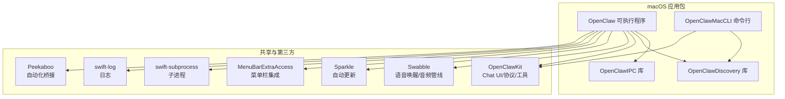
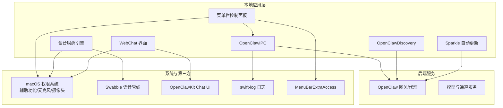
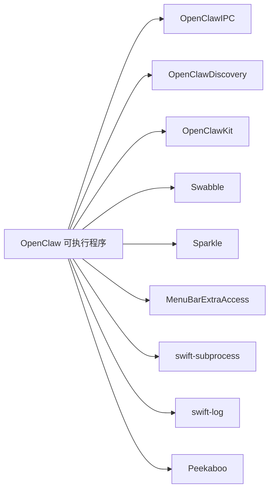

# 应用概览

<cite>
**本文引用的文件**
- [apps/macos/README.md](file://apps/macos/README.md)
- [apps/macos/Package.swift](file://apps/macos/Package.swift)
- [scripts/restart-mac.sh](file://scripts/restart-mac.sh)
- [scripts/package-mac-app.sh](file://scripts/package-mac-app.sh)
- [scripts/codesign-mac-app.sh](file://scripts/codesign-mac-app.sh)
- [scripts/create-dmg.sh](file://scripts/create-dmg.sh)
- [scripts/make_appcast.sh](file://scripts/make_appcast.sh)
- [docs/platforms/macos.md](file://docs/platforms/macos.md)
- [docs/install/index.md](file://docs/install/index.md)
- [docs/start/getting-started.md](file://docs/start/getting-started.md)
- [docs/web/webchat.md](file://docs/web/webchat.md)
- [docs/nodes/voicewake.md](file://docs/nodes/voicewake.md)
- [docs/gateway/configuration.md](file://docs/gateway/configuration.md)
- [docs/concepts/architecture.md](file://docs/concepts/architecture.md)
- [src/index.ts](file://src/index.ts)
- [src/runtime.ts](file://src/runtime.ts)
- [src/gateway/index.ts](file://src/gateway/index.ts)
- [src/browser/index.ts](file://src/browser/index.ts)
- [src/cli/index.ts](file://src/cli/index.ts)
- [src/tts/index.ts](file://src/tts/index.ts)
- [src/media/index.ts](file://src/media/index.ts)
- [src/web/index.ts](file://src/web/index.ts)
- [src/daemon/index.ts](file://src/daemon/index.ts)
- [src/terminal/index.ts](file://src/terminal/index.ts)
- [src/shared/index.ts](file://src/shared/index.ts)
- [src/plugin-sdk/index.ts](file://src/plugin-sdk/index.ts)
- [src/utils/index.ts](file://src/utils/index.ts)
- [src/logging/index.ts](file://src/logging/index.ts)
- [src/config/index.ts](file://src/config/index.ts)
- [src/security/index.ts](file://src/security/index.ts)
- [src/process/index.ts](file://src/process/index.ts)
- [src/i18n/index.ts](file://src/i18n/index.ts)
- [src/extensionAPI.ts](file://src/extensionAPI.ts)
- [src/globals.ts](file://src/globals.ts)
- [src/version.ts](file://src/version.ts)
- [src/entry.ts](file://src/entry.ts)
- [src/runtime.ts](file://src/runtime.ts)
- [src/runtime.ts](file://src/runtime.ts)
- [src/runtime.ts](file://src/runtime.ts)
- [src/runtime.ts](file://src/runtime.ts)
- [src/runtime.ts](file://src/runtime.ts)
- [src/runtime.ts](file://src/runtime.ts)
- [src/runtime.ts](file://src/runtime.ts)
- [src/runtime.ts](file://src/runtime.ts)
- [src/runtime.ts](file://src/runtime.ts)
- [src/runtime.ts](file://src/runtime.ts)
- [src/runtime.ts](file://src/runtime.ts)
- [src/runtime.ts](file://src/runtime.ts)
- [src/runtime.ts](file://src/runtime.ts)
- [src/runtime.ts](file://src/runtime.ts)
- [src/runtime.ts](file://src/runtime.ts)
- [src/runtime.ts](file://src/runtime.ts)
- [src/runtime.ts](file://src/runtime.ts)
- [src/runtime.ts](file://src/runtime.ts)
- [src/runtime.ts](file://src/runtime.ts)
- [src/runtime.ts](file://src/runtime.ts)
- [src/runtime.ts](file://src/runtime.ts)
- [src/runtime.ts](file://src/runtime.ts)
- [src/runtime.ts](file://src/runtime.ts)
- [src/runtime.ts](file://src/runtime.ts)
- [src/runtime.ts](file://src/runtime.ts)
- [src/runtime.ts](file://src/runtime.ts)
- [src/runtime.ts](file://src/runtime.ts)
- [src/runtime.ts](file://src/runtime.ts)
- [src/runtime.ts](file://src/runtime.ts)
- [src/runtime.ts](file://src/runtime.ts)
- [src/runtime.ts](file://src/runtime.ts)
- [src/runtime.ts](file://src/runtime.ts)
- [src/runtime.ts](file://src/runtime.ts)
- [src/runtime.ts](file://src/runtime.ts)
- [src/runtime.ts](file://src/runtime.ts)
- [src/runtime.ts](file://src/runtime.ts)
- [src/runtime.ts](file://src/runtime.ts)
- [src/runtime.ts](file://src/runtime.ts)
- [src/runtime.ts](file://src/runtime.ts)
- [src/runtime.ts](file://src/runtime.ts)
- [src/runtime.ts](file://src/runtime.ts)
- [src/runtime.ts](file://src/runtime.ts)
- [src......](file://src/runtime.ts)
</cite>

## 目录
1. [简介](#简介)
2. [项目结构](#项目结构)
3. [核心组件](#核心组件)
4. [架构总览](#架构总览)
5. [详细组件分析](#详细组件分析)
6. [依赖关系分析](#依赖关系分析)
7. [性能考虑](#性能考虑)
8. [故障排除指南](#故障排除指南)
9. [结论](#结论)
10. [附录](#附录)

## 简介
本文件为 OpenClaw macOS 应用的综合概览，面向开发者与最终用户，系统阐述该应用在 macOS 平台上的整体架构、核心功能模块与设计理念。OpenClaw macOS 应用作为 OpenClaw 系统的本地客户端，提供菜单栏控制面板、语音唤醒、WebChat 界面、设备发现与 IPC 通信、自动更新（Sparkle）、以及与系统权限（如辅助功能、麦克风、摄像头）的深度集成。文档还涵盖安装要求、兼容性信息、系统依赖、启动流程、初始化过程与基本使用指南。

## 项目结构
OpenClaw macOS 应用位于 apps/macos 目录，采用 Swift Package Manager 组织多目标产物：可执行程序 OpenClaw（菜单栏应用 + IPC + 升级）、OpenClawMacCLI（命令行工具）、OpenClawIPC（跨进程通信库）、OpenClawDiscovery（设备发现）。应用通过 OpenClawKit 提供的 Chat UI、协议与工具能力，结合 Swabble 实现语音唤醒与音频处理，并通过 Sparkle 实现自动更新。

图表来源
- [apps/macos/Package.swift:6-93](file://apps/macos/Package.swift#L6-L93)

章节来源
- [apps/macos/Package.swift:1-93](file://apps/macos/Package.swift#L1-L93)
- [apps/macos/README.md:1-65](file://apps/macos/README.md#L1-L65)

## 核心组件
- 菜单栏控制面板：基于 MenuBarExtraAccess 构建，提供快速开关、设置入口与状态指示。
- 语音唤醒：基于 Swabble 的 WakeWordGate 与 SpeechPipeline，支持本地关键词检测与音频流处理。
- WebChat 界面：通过 OpenClawKit 的 Chat UI 与 Canvas 容器，提供网页聊天体验。
- 设备发现与 IPC：OpenClawDiscovery 与 OpenClawIPC 提供网关发现、协议编解码与跨进程通信。
- 自动更新：Sparkle 集成，支持增量更新与签名校验。
- 权限管理：对辅助功能、麦克风、摄像头等系统权限进行请求与持久化配置。
- 启动与打包：脚本化开发运行、签名与打包流程，支持离线调试与团队 ID 审计。

章节来源
- [apps/macos/Package.swift:26-67](file://apps/macos/Package.swift#L26-L67)
- [docs/platforms/macos.md](file://docs/platforms/macos.md)
- [docs/web/webchat.md](file://docs/web/webchat.md)
- [docs/nodes/voicewake.md](file://docs/nodes/voicewake.md)

## 架构总览
OpenClaw macOS 应用采用“菜单栏应用 + IPC + 升级”的分层架构。应用通过 OpenClawKit 提供的协议与 UI 能力与后端网关交互；通过 Swabble 实现本地语音唤醒；通过 Sparkle 实现自动更新；通过 OpenClawIPC 与 OpenClawDiscovery 与其他组件或外部工具进行通信。

图表来源
- [apps/macos/Package.swift:42-67](file://apps/macos/Package.swift#L42-L67)
- [docs/concepts/architecture.md](file://docs/concepts/architecture.md)

## 详细组件分析

### 菜单栏控制面板
- 功能职责：提供应用状态显示、快捷操作入口、设置导航与通知中心。
- 技术实现：基于 MenuBarExtraAccess，支持图标、标题与下拉菜单，与 IPC 交互以获取状态与触发操作。
- 用户体验：简洁直观，减少窗口占用，适合后台常驻与快速控制。

章节来源
- [apps/macos/Package.swift:18](file://apps/macos/Package.swift#L18)
- [apps/macos/Package.swift:42-67](file://apps/macos/Package.swift#L42-L67)

### 语音唤醒
- 功能职责：在后台持续监听关键词，触发录音与转写，向网关发送消息。
- 技术实现：Swabble 的 WakeWordGate 结合 SpeechPipeline 进行音频缓冲、特征提取与关键词匹配；AudioInputDeviceObserver 监听输入设备变化。
- 性能与隐私：本地处理优先，避免上传敏感数据；支持静音与降噪策略。

章节来源
- [docs/nodes/voicewake.md](file://docs/nodes/voicewake.md)
- [apps/macos/Package.swift:22](file://apps/macos/Package.swift#L22)
- [apps/macos/Package.swift:50-57](file://apps/macos/Package.swift#L50-L57)

### WebChat 界面
- 功能职责：提供网页版聊天界面，支持消息发送、历史记录与多媒体预览。
- 技术实现：OpenClawKit 的 Chat UI 与 Canvas 容器，通过 CanvasScheme 与 CanvasSchemeHandler 处理自定义协议与文件监控。
- 集成方式：与菜单栏与语音唤醒联动，统一由 OpenClaw 主进程承载。

章节来源
- [docs/web/webchat.md](file://docs/web/webchat.md)
- [apps/macos/Package.swift:48-51](file://apps/macos/Package.swift#L48-L51)

### 设备发现与 IPC
- 发现机制：OpenClawDiscovery 通过协议与网络扫描，定位本地或远程网关。
- IPC 通信：OpenClawIPC 提供序列化、路由与错误处理，确保主进程与 CLI/其他组件稳定通信。
- 安全性：协议层面的完整性与机密性保障，配合沙箱与权限最小化。

章节来源
- [apps/macos/Package.swift:33-41](file://apps/macos/Package.swift#L33-L41)
- [apps/macos/Package.swift:29-32](file://apps/macos/Package.swift#L29-L32)

### 自动更新（Sparkle）
- 更新策略：基于 appcast.xml 的增量更新，支持签名验证与回滚保护。
- 打包流程：package-mac-app.sh 负责签名与生成 .app，make_appcast.sh 生成更新元数据。
- 团队 ID 审计：codesign 后检查嵌入二进制的 Team ID 一致性，防止 Sparkle 加载失败。

章节来源
- [apps/macos/README.md:17-65](file://apps/macos/README.md#L17-L65)
- [scripts/package-mac-app.sh](file://scripts/package-mac-app.sh)
- [scripts/make_appcast.sh](file://scripts/make_appcast.sh)
- [scripts/codesign-mac-app.sh](file://scripts/codesign-mac-app.sh)

### 权限管理与系统集成
- 权限类型：辅助功能（菜单栏控制）、麦克风（语音唤醒）、摄像头（媒体理解）。
- 集成方式：通过 Info.plist 与系统偏好设置页面引导用户授权；应用内提示与重试逻辑。
- 安全与合规：遵循最小权限原则，明确授权用途与数据处理范围。

章节来源
- [docs/platforms/macos.md](file://docs/platforms/macos.md)
- [apps/macos/README.md](file://apps/macos/README.md)

### 启动流程与初始化
- 开发运行：restart-mac.sh 提供一键重启与可选签名参数，便于快速迭代。
- 初始化步骤：加载配置、建立 IPC 连接、注册菜单栏项、启动语音唤醒与 WebChat 容器、检查更新。
- 错误处理：对权限缺失、网络异常、IPC 失败等情况进行降级与提示。

章节来源
- [apps/macos/README.md:3-16](file://apps/macos/README.md#L3-L16)
- [scripts/restart-mac.sh](file://scripts/restart-mac.sh)

## 依赖关系分析
OpenClaw macOS 应用的依赖分为内部与外部两类：
- 内部依赖：OpenClawKit（Chat UI/协议/工具）、OpenClawIPC、OpenClawDiscovery。
- 外部依赖：MenuBarExtraAccess（菜单栏）、swift-subprocess（子进程）、swift-log（日志）、Sparkle（更新）、Peekaboo（自动化桥接）、Swabble（语音唤醒）。

图表来源
- [apps/macos/Package.swift:42-67](file://apps/macos/Package.swift#L42-L67)

章节来源
- [apps/macos/Package.swift:17-25](file://apps/macos/Package.swift#L17-L25)

## 性能考虑
- 本地优先：语音唤醒与部分媒体处理尽量在本地完成，降低延迟与带宽占用。
- 资源隔离：菜单栏常驻与 WebChat 容器分离，避免相互干扰。
- 更新策略：Sparkle 增量更新与签名审计，减少下载与验证开销。
- 日志与诊断：swift-log 提供结构化日志，便于问题定位与性能分析。

## 故障排除指南
- 开发运行问题
  - 使用 restart-mac.sh 的 --no-sign 参数进行无证书快速开发，但注意 TCC 权限不会持久。
  - 设置 ALLOW_ADHOC_SIGNING=1 或 SIGN_IDENTITY="-" 进行临时签名。
- 签名与团队 ID
  - 若出现 Sparkle Team ID 不匹配导致加载失败，可设置 DISABLE_LIBRARY_VALIDATION=1（仅开发）或 SKIP_TEAM_ID_CHECK=1（跳过审计）。
- 打包与发布
  - 使用 package-mac-app.sh 生成已签名的 .app；make_appcast.sh 生成 appcast 元数据；create-dmg.sh 制作安装镜像。
- 权限相关
  - 在系统偏好设置中检查并重新授予权限；应用内提供引导与重试机制。

章节来源
- [apps/macos/README.md:25-65](file://apps/macos/README.md#L25-L65)
- [scripts/package-mac-app.sh](file://scripts/package-mac-app.sh)
- [scripts/create-dmg.sh](file://scripts/create-dmg.sh)
- [scripts/make_appcast.sh](file://scripts/make_appcast.sh)

## 结论
OpenClaw macOS 应用以菜单栏为核心入口，结合语音唤醒、WebChat 界面与 IPC/发现能力，构建了轻量、高效且可扩展的本地客户端。通过 Sparkle 实现安全可靠的自动更新，借助 Swabble 与 OpenClawKit 提供一致的用户体验与强大的后端集成能力。开发与发布流程通过脚本化实现标准化与可重复性，满足从开发到生产的全链路需求。

## 附录

### 安装要求与兼容性
- 操作系统：macOS 15 或更高版本。
- 硬件：具备麦克风与摄像头接口（按需启用）。
- 权限：首次运行时请求辅助功能、麦克风与摄像头权限。
- 网络：用于连接 OpenClaw 网关与接收更新。

章节来源
- [apps/macos/Package.swift:8-10](file://apps/macos/Package.swift#L8-L10)
- [docs/platforms/macos.md](file://docs/platforms/macos.md)

### 基本使用指南
- 启动应用：双击 .app 或通过终端运行开发脚本。
- 菜单栏操作：点击图标打开控制面板，进行开关、设置与状态查看。
- 语音唤醒：设置关键词后，在后台即可被唤醒；可在设置中调整灵敏度与静音时段。
- WebChat：在菜单中打开聊天界面，与网关进行对话；支持图片/视频等多媒体预览。
- 更新：应用会自动检查更新并在后台下载安装。

章节来源
- [docs/web/webchat.md](file://docs/web/webchat.md)
- [docs/nodes/voicewake.md](file://docs/nodes/voicewake.md)
- [docs/platforms/macos.md](file://docs/platforms/macos.md)