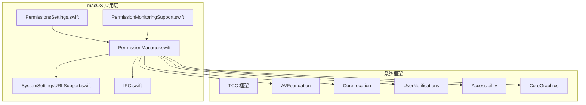
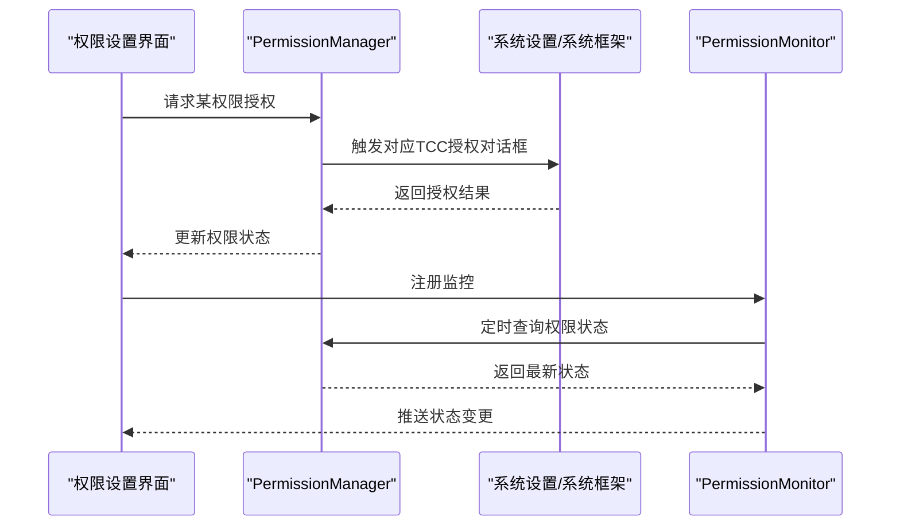
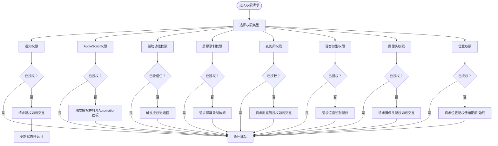
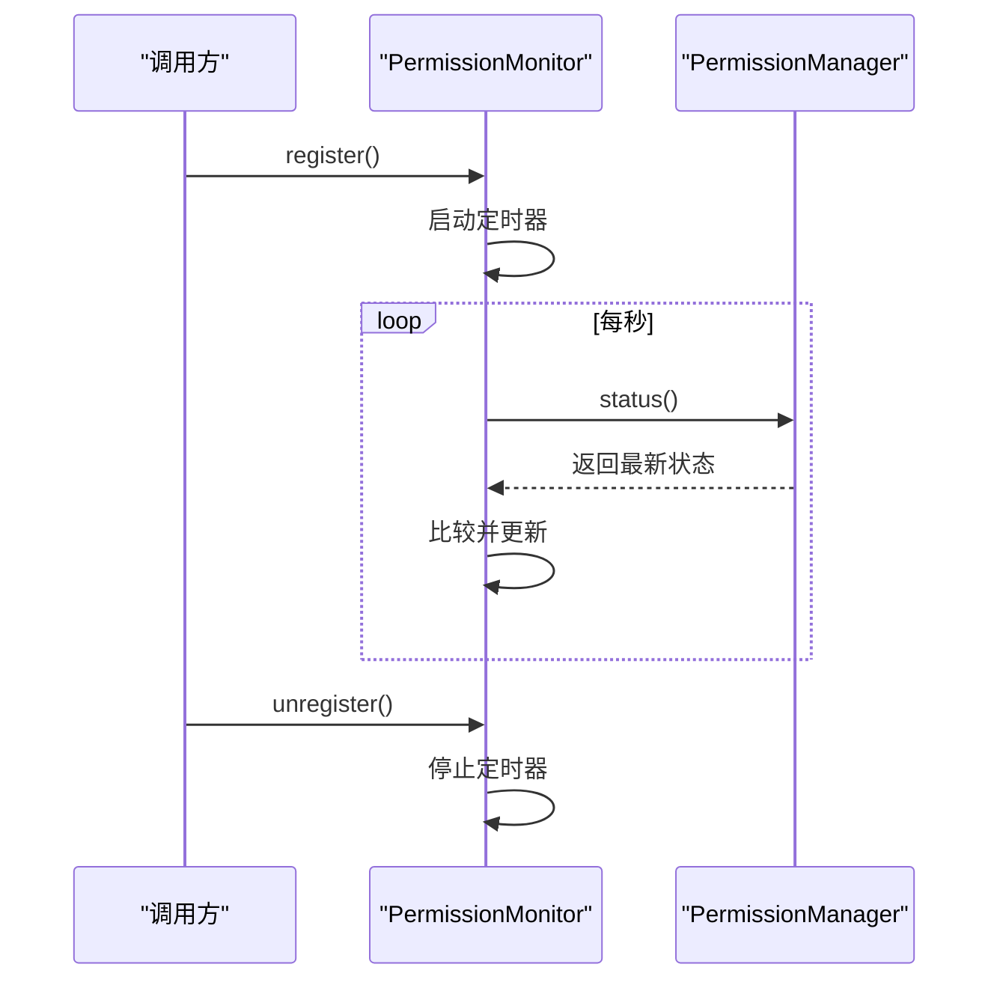
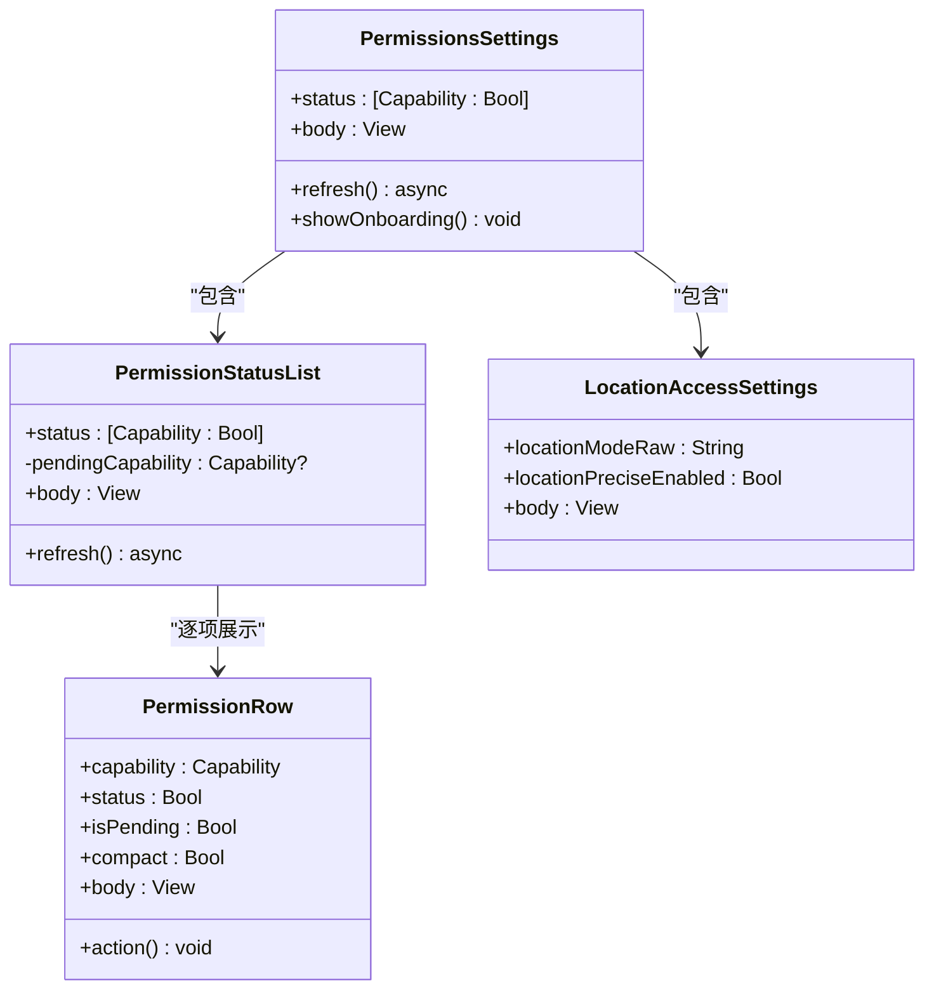
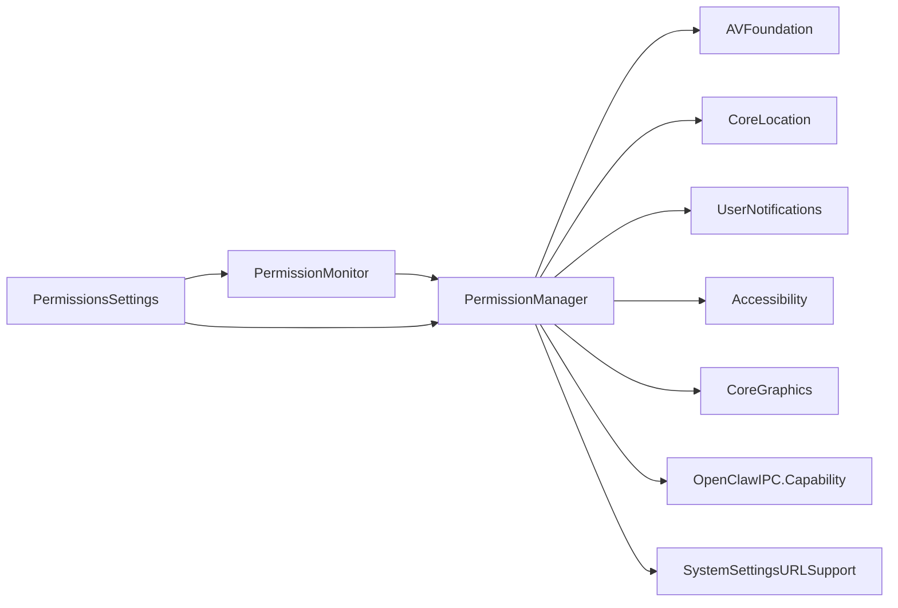

# 权限管理

<cite>
**本文引用的文件**
- [PermissionManager.swift](file://apps/macos/Sources/OpenClaw/PermissionManager.swift)
- [PermissionMonitoringSupport.swift](file://apps/macos/Sources/OpenClaw/PermissionMonitoringSupport.swift)
- [PermissionsSettings.swift](file://apps/macos/Sources/OpenClaw/PermissionsSettings.swift)
- [PermissionManagerTests.swift](file://apps/macos/Tests/OpenClawIPCTests/PermissionManagerTests.swift)
- [PermissionManagerLocationTests.swift](file://apps/macos/Tests/OpenClawIPCTests/PermissionManagerLocationTests.swift)
- [IPC.swift](file://apps/macos/Sources/OpenClawIPC/IPC.swift)
- [SystemSettingsURLSupport.swift](file://apps/macos/Sources/OpenClaw/SystemSettingsURLSupport.swift)
</cite>

## 目录
1. [简介](#简介)
2. [项目结构](#项目结构)
3. [核心组件](#核心组件)
4. [架构总览](#架构总览)
5. [详细组件分析](#详细组件分析)
6. [依赖关系分析](#依赖关系分析)
7. [性能考量](#性能考量)
8. [故障排除指南](#故障排除指南)
9. [结论](#结论)
10. [附录](#附录)

## 简介
本文件面向OpenClaw在macOS平台的权限管理，系统化阐述macOS权限模型与TCC（技术类隐私控制）框架，结合应用内权限请求机制，覆盖通知、AppleScript自动化、辅助功能、屏幕录制、麦克风、语音识别、摄像头与位置等权限。文档从架构、数据流、处理逻辑、集成点、错误处理与性能优化等方面进行深入解析，并提供最佳实践、故障排除与兼容性处理建议，同时强调安全策略与隐私保护。

## 项目结构
OpenClaw macOS端的权限相关代码集中于apps/macos/Sources/OpenClaw目录，主要文件如下：
- PermissionManager.swift：权限请求与状态查询的核心实现，含各类权限的检查与交互式授权流程
- PermissionMonitoringSupport.swift：权限监控注册/注销的辅助工具
- PermissionsSettings.swift：权限设置界面与交互，展示权限状态并支持逐项授权
- PermissionManagerTests.swift / PermissionManagerLocationTests.swift：权限管理的单元测试
- IPC.swift：Capability枚举定义（权限能力类型）
- SystemSettingsURLSupport.swift：打开系统设置特定面板的通用支持

**图表来源**
- [PermissionManager.swift:1-483](file://apps/macos/Sources/OpenClaw/PermissionManager.swift#L1-L483)
- [PermissionMonitoringSupport.swift:1-21](file://apps/macos/Sources/OpenClaw/PermissionMonitoringSupport.swift#L1-L21)
- [PermissionsSettings.swift:1-294](file://apps/macos/Sources/OpenClaw/PermissionsSettings.swift#L1-L294)
- [SystemSettingsURLSupport.swift](file://apps/macos/Sources/OpenClaw/SystemSettingsURLSupport.swift)
- [IPC.swift](file://apps/macos/Sources/OpenClawIPC/IPC.swift)

**章节来源**
- [PermissionManager.swift:1-483](file://apps/macos/Sources/OpenClaw/PermissionManager.swift#L1-L483)
- [PermissionsSettings.swift:1-294](file://apps/macos/Sources/OpenClaw/PermissionsSettings.swift#L1-L294)
- [PermissionMonitoringSupport.swift:1-21](file://apps/macos/Sources/OpenClaw/PermissionMonitoringSupport.swift#L1-L21)
- [IPC.swift](file://apps/macos/Sources/OpenClawIPC/IPC.swift)

## 核心组件
- 权限管理器（PermissionManager）：统一入口，负责权限检查、交互式授权与状态查询；针对不同权限采用相应的系统API与TCC流程
- 权限监控器（PermissionMonitor）：周期性轮询权限状态，支持注册/注销与最小检查间隔控制
- 权限监控支持（PermissionMonitoringSupport）：对监控器的轻量封装，便于视图层或控制器按需启停
- 权限设置界面（PermissionsSettings）：展示各权限状态、提供刷新与逐项授权入口，并支持位置模式与精确度配置
- 能力枚举（Capability）：定义应用支持的权限能力集合，作为权限管理的键值与UI展示依据
- 系统设置跳转（SystemSettingsURLSupport）：通过URL Scheme打开系统设置中对应的隐私面板，辅助用户完成授权

**章节来源**
- [PermissionManager.swift:12-228](file://apps/macos/Sources/OpenClaw/PermissionManager.swift#L12-L228)
- [PermissionManager.swift:399-466](file://apps/macos/Sources/OpenClaw/PermissionManager.swift#L399-L466)
- [PermissionMonitoringSupport.swift:3-20](file://apps/macos/Sources/OpenClaw/PermissionMonitoringSupport.swift#L3-L20)
- [PermissionsSettings.swift:6-35](file://apps/macos/Sources/OpenClaw/PermissionsSettings.swift#L6-L35)
- [IPC.swift](file://apps/macos/Sources/OpenClawIPC/IPC.swift)
- [SystemSettingsURLSupport.swift](file://apps/macos/Sources/OpenClaw/SystemSettingsURLSupport.swift)

## 架构总览
权限管理采用“集中式管理 + 视图驱动 + 周期监控”的架构：
- 集中式管理：PermissionManager封装所有权限的检查与授权逻辑，避免业务层重复实现
- 视图驱动：PermissionsSettings根据权限状态渲染UI，支持逐项授权与批量刷新
- 周期监控：PermissionMonitor在后台定时轮询权限状态，确保UI与实际授权状态一致
- 系统集成：通过系统框架（AVFoundation、CoreLocation、UserNotifications、Accessibility、CoreGraphics等）与TCC交互

**图表来源**
- [PermissionsSettings.swift:103-152](file://apps/macos/Sources/OpenClaw/PermissionsSettings.swift#L103-L152)
- [PermissionManager.swift:25-52](file://apps/macos/Sources/OpenClaw/PermissionManager.swift#L25-L52)
- [PermissionManager.swift:399-466](file://apps/macos/Sources/OpenClaw/PermissionManager.swift#L399-L466)

## 详细组件分析

### 权限管理器（PermissionManager）
职责与特性：
- 统一入口：ensure(...)与ensureCapability(...)按能力类型分派到具体授权流程
- 交互式与非交互式：interactive参数控制是否弹出授权对话框；非交互仅返回当前状态
- 各权限分支：
  - 通知：UNUserNotificationCenter获取授权状态，必要时请求授权
  - AppleScript：通过执行轻量AppleScript探测Automation授权
  - 辅助功能：AXIsProcessTrusted/AXIsProcessTrustedWithOptions检测与触发授权
  - 屏幕录制：CGPreflightScreenCaptureAccess/CaptureAccess请求
  - 麦克风/摄像头：AVCaptureDevice授权状态检查与请求
  - 语音识别：SFSpeechRecognizer授权状态检查与请求
  - 位置：CLLocationManager授权状态检查，支持“使用期间”与“始终”两种模式
- 语音唤醒组合权限：voiceWakePermissionsGranted()与ensureVoiceWakePermissions()用于快速校验与授权

**图表来源**
- [PermissionManager.swift:25-175](file://apps/macos/Sources/OpenClaw/PermissionManager.swift#L25-L175)

**章节来源**
- [PermissionManager.swift:12-228](file://apps/macos/Sources/OpenClaw/PermissionManager.swift#L12-L228)

### 权限监控器（PermissionMonitor）
职责与特性：
- 单例：shared实例全局复用
- 注册/注销：基于引用计数的生命周期管理，避免重复轮询
- 轮询策略：最小检查间隔限制，防止频繁调用系统API
- 状态缓存：仅在状态变化时更新，降低UI抖动
- 测试环境适配：在测试运行时跳过定时器，避免干扰

**图表来源**
- [PermissionManager.swift:399-466](file://apps/macos/Sources/OpenClaw/PermissionManager.swift#L399-L466)
- [PermissionMonitoringSupport.swift:3-20](file://apps/macos/Sources/OpenClaw/PermissionMonitoringSupport.swift#L3-L20)

**章节来源**
- [PermissionManager.swift:399-466](file://apps/macos/Sources/OpenClaw/PermissionManager.swift#L399-L466)
- [PermissionMonitoringSupport.swift:3-20](file://apps/macos/Sources/OpenClaw/PermissionMonitoringSupport.swift#L3-L20)

### 权限设置界面（PermissionsSettings）
职责与特性：
- 展示权限状态列表：逐项显示授权状态与操作按钮
- 刷新机制：支持一键刷新与自动多次延迟刷新，以等待TCC与系统设置稳定
- 位置设置：提供“关闭/使用期间/始终”三种模式，支持精确位置开关
- 用户引导：点击“Grant”触发交互式授权；失败时引导至系统设置对应面板

**图表来源**
- [PermissionsSettings.swift:6-101](file://apps/macos/Sources/OpenClaw/PermissionsSettings.swift#L6-L101)
- [PermissionsSettings.swift:103-152](file://apps/macos/Sources/OpenClaw/PermissionsSettings.swift#L103-L152)
- [PermissionsSettings.swift:154-274](file://apps/macos/Sources/OpenClaw/PermissionsSettings.swift#L154-L274)

**章节来源**
- [PermissionsSettings.swift:6-294](file://apps/macos/Sources/OpenClaw/PermissionsSettings.swift#L6-L294)

### 能力枚举（Capability）
- 定义了应用支持的权限能力集合，作为权限管理的键值与UI展示依据
- 与PermissionManager.ensure/status等方法配合，实现统一的权限管理

**章节来源**
- [IPC.swift](file://apps/macos/Sources/OpenClawIPC/IPC.swift)

### 系统设置跳转（SystemSettingsURLSupport）
- 提供打开系统设置中特定隐私面板的通用能力，用于在权限被拒绝时引导用户前往设置页面
- 支持多种URL Scheme备选，提升兼容性

**章节来源**
- [SystemSettingsURLSupport.swift](file://apps/macos/Sources/OpenClaw/SystemSettingsURLSupport.swift)
- [PermissionManager.swift:230-264](file://apps/macos/Sources/OpenClaw/PermissionManager.swift#L230-L264)

## 依赖关系分析
- PermissionManager依赖系统框架与OpenClawIPC：
  - AVFoundation：麦克风/摄像头/语音识别
  - CoreLocation：位置服务
  - UserNotifications：通知
  - Accessibility：辅助功能
  - CoreGraphics：屏幕录制
  - OpenClawIPC：Capability枚举
- PermissionMonitor依赖PermissionManager进行状态查询
- PermissionsSettings依赖PermissionMonitor与PermissionManager进行状态展示与授权
- SystemSettingsURLSupport被各权限帮助器调用，用于打开系统设置

**图表来源**
- [PermissionManager.swift:1-11](file://apps/macos/Sources/OpenClaw/PermissionManager.swift#L1-L11)
- [PermissionManager.swift:12-228](file://apps/macos/Sources/OpenClaw/PermissionManager.swift#L12-L228)
- [PermissionManager.swift:399-466](file://apps/macos/Sources/OpenClaw/PermissionManager.swift#L399-L466)
- [PermissionsSettings.swift:1-5](file://apps/macos/Sources/OpenClaw/PermissionsSettings.swift#L1-L5)
- [SystemSettingsURLSupport.swift](file://apps/macos/Sources/OpenClaw/SystemSettingsURLSupport.swift)

**章节来源**
- [PermissionManager.swift:1-11](file://apps/macos/Sources/OpenClaw/PermissionManager.swift#L1-L11)
- [PermissionsSettings.swift:1-5](file://apps/macos/Sources/OpenClaw/PermissionsSettings.swift#L1-L5)

## 性能考量
- 轮询频率控制：PermissionMonitor设置最小检查间隔，避免频繁调用系统API导致资源浪费
- 状态缓存：仅在状态变化时更新，减少UI重绘与订阅者通知
- 异步与并发：使用async/await与MainActor保证UI线程安全与响应性
- 测试隔离：在测试环境下禁用定时器，避免影响测试稳定性

**章节来源**
- [PermissionManager.swift:408-465](file://apps/macos/Sources/OpenClaw/PermissionManager.swift#L408-L465)
- [PermissionMonitoringSupport.swift:3-20](file://apps/macos/Sources/OpenClaw/PermissionMonitoringSupport.swift#L3-L20)

## 故障排除指南
常见问题与处理：
- 通知权限未授权
  - 现象：无法接收桌面提醒
  - 处理：调用通知权限请求；若被拒，引导至系统设置的通知面板
  - 参考路径：[PermissionManager.swift:54-75](file://apps/macos/Sources/OpenClaw/PermissionManager.swift#L54-L75)，[NotificationPermissionHelper.openSettings:230-237](file://apps/macos/Sources/OpenClaw/PermissionManager.swift#L230-L237)
- AppleScript自动化被拒
  - 现象：执行自动化动作失败且提示需要用户同意
  - 处理：触发授权对话框；若被拒，打开Automation面板协助用户授权
  - 参考路径：[AppleScriptPermission:351-395](file://apps/macos/Sources/OpenClaw/PermissionManager.swift#L351-L395)
- 辅助功能未受信任
  - 现象：无法控制其他应用UI元素
  - 处理：触发授权对话框；若被拒，引导至系统设置的辅助功能面板
  - 参考路径：[PermissionManager.swift:85-94](file://apps/macos/Sources/OpenClaw/PermissionManager.swift#L85-L94)
- 屏幕录制权限未授权
  - 现象：无法进行屏幕捕获
  - 处理：请求屏幕录制访问；若被拒，引导至系统设置的隐私面板
  - 参考路径：[ScreenRecordingProbe:468-482](file://apps/macos/Sources/OpenClaw/PermissionManager.swift#L468-L482)
- 麦克风/摄像头权限未授权
  - 现象：无法进行录音或拍照
  - 处理：请求授权；若被拒，引导至系统设置的隐私面板
  - 参考路径：[PermissionManager.swift:104-120](file://apps/macos/Sources/OpenClaw/PermissionManager.swift#L104-L120)，[PermissionManager.swift:134-150](file://apps/macos/Sources/OpenClaw/PermissionManager.swift#L134-L150)
- 语音识别权限未授权
  - 现象：无法进行本地语音转写
  - 处理：请求授权；若被拒，引导至系统设置的隐私面板
  - 参考路径：[PermissionManager.swift:122-132](file://apps/macos/Sources/OpenClaw/PermissionManager.swift#L122-L132)
- 位置权限未授权或被拒
  - 现象：无法获取位置信息
  - 处理：请求“使用期间”或“始终”授权；若被拒，引导至系统设置的位置面板；注意“始终”可能需要额外系统设置确认
  - 参考路径：[PermissionManager.swift:152-175](file://apps/macos/Sources/OpenClaw/PermissionManager.swift#L152-L175)，[LocationPermissionRequester:267-349](file://apps/macos/Sources/OpenClaw/PermissionManager.swift#L267-L349)
- 权限状态不一致
  - 现象：UI显示与系统实际状态不符
  - 处理：使用“刷新”按钮或等待PermissionMonitor轮询；界面会在授权对话框关闭后进行多次延迟刷新
  - 参考路径：[PermissionsSettings.swift:132-151](file://apps/macos/Sources/OpenClaw/PermissionsSettings.swift#L132-L151)，[PermissionManager.swift:399-466](file://apps/macos/Sources/OpenClaw/PermissionManager.swift#L399-L466)

**章节来源**
- [PermissionManager.swift:54-175](file://apps/macos/Sources/OpenClaw/PermissionManager.swift#L54-L175)
- [PermissionsSettings.swift:103-151](file://apps/macos/Sources/OpenClaw/PermissionsSettings.swift#L103-L151)
- [PermissionManager.swift:267-349](file://apps/macos/Sources/OpenClaw/PermissionManager.swift#L267-L349)

## 结论
OpenClaw的权限管理以PermissionManager为核心，结合PermissionsSettings与PermissionMonitor，实现了对macOS TCC权限的统一、可控与用户友好的管理。通过明确的权限分类、交互式授权流程、状态监控与系统设置引导，应用能够在保障用户体验的同时满足各项功能所需的最小权限集。建议在新版本迭代中持续关注系统API变更与用户反馈，进一步完善权限提示文案与错误恢复策略。

## 附录

### 权限用途与配置要点
- 通知
  - 用途：向用户推送代理活动状态
  - 配置：通过UNUserNotificationCenter请求授权；被拒时引导至系统设置的通知面板
  - 参考路径：[PermissionManager.swift:54-75](file://apps/macos/Sources/OpenClaw/PermissionManager.swift#L54-L75)，[NotificationPermissionHelper.openSettings:230-237](file://apps/macos/Sources/OpenClaw/PermissionManager.swift#L230-L237)
- AppleScript自动化
  - 用途：控制其他应用（如Terminal）执行自动化任务
  - 配置：通过轻量AppleScript探测授权；被拒时打开Automation面板
  - 参考路径：[AppleScriptPermission:351-395](file://apps/macos/Sources/OpenClaw/PermissionManager.swift#L351-L395)
- 辅助功能
  - 用途：控制UI元素以执行需要的自动化动作
  - 配置：触发授权对话框；被拒时打开系统设置的辅助功能面板
  - 参考路径：[PermissionManager.swift:85-94](file://apps/macos/Sources/OpenClaw/PermissionManager.swift#L85-L94)
- 屏幕录制
  - 用途：捕获屏幕以生成上下文或截图
  - 配置：请求屏幕录制访问；被拒时打开系统设置的隐私面板
  - 参考路径：[ScreenRecordingProbe:468-482](file://apps/macos/Sources/OpenClaw/PermissionManager.swift#L468-L482)
- 麦克风
  - 用途：语音唤醒与音频采集
  - 配置：请求麦克风授权；被拒时打开系统设置的隐私面板
  - 参考路径：[PermissionManager.swift:104-120](file://apps/macos/Sources/OpenClaw/PermissionManager.swift#L104-L120)
- 语音识别
  - 用途：本地转写语音唤醒关键词
  - 配置：请求语音识别授权；被拒时打开系统设置的隐私面板
  - 参考路径：[PermissionManager.swift:122-132](file://apps/macos/Sources/OpenClaw/PermissionManager.swift#L122-L132)
- 摄像头
  - 用途：拍照与视频采集
  - 配置：请求摄像头授权；被拒时打开系统设置的隐私面板
  - 参考路径：[PermissionManager.swift:134-150](file://apps/macos/Sources/OpenClaw/PermissionManager.swift#L134-L150)
- 位置
  - 用途：按代理请求分享位置
  - 配置：请求“使用期间”或“始终”授权；被拒时打开系统设置的位置面板
  - 参考路径：[PermissionManager.swift:152-175](file://apps/macos/Sources/OpenClaw/PermissionManager.swift#L152-L175)，[LocationPermissionRequester:267-349](file://apps/macos/Sources/OpenClaw/PermissionManager.swift#L267-L349)

### 最佳实践
- 优先使用非交互式检查：在不需要弹窗时仅查询状态，避免打断用户
- 明确授权理由：在UI中清晰说明每项权限的用途，提升用户授权意愿
- 及时刷新状态：授权完成后进行多次延迟刷新，确保UI与系统状态一致
- 引导至正确面板：被拒时直接打开系统设置的对应隐私面板，减少用户困惑
- 控制轮询频率：避免过于频繁的状态查询，平衡实时性与性能

### 兼容性处理
- macOS版本差异：屏幕录制在旧版本系统上可能无需显式授权，通过条件编译与降级处理保证兼容
- 系统设置URL：提供多个URL Scheme备选，提升在不同系统版本上的成功率
- 测试隔离：在测试环境中禁用定时器，避免影响测试稳定性

**章节来源**
- [PermissionManager.swift:204-209](file://apps/macos/Sources/OpenClaw/PermissionManager.swift#L204-L209)
- [SystemSettingsURLSupport.swift](file://apps/macos/Sources/OpenClaw/SystemSettingsURLSupport.swift)
- [PermissionMonitoringSupport.swift:432-434](file://apps/macos/Sources/OpenClaw/PermissionMonitoringSupport.swift#L432-L434)

### 安全策略与隐私保护
- 最小权限原则：仅在需要时请求相应权限，避免过度授权
- 透明与可撤销：在设置界面清晰展示权限用途，并允许用户随时撤销
- 错误处理与降级：对授权失败与系统异常进行稳健处理，避免崩溃或泄露状态
- 用户控制：提供一键刷新与系统设置直达，增强用户对权限的掌控感

**章节来源**
- [PermissionsSettings.swift:16-34](file://apps/macos/Sources/OpenClaw/PermissionsSettings.swift#L16-L34)
- [PermissionManager.swift:54-75](file://apps/macos/Sources/OpenClaw/PermissionManager.swift#L54-L75)