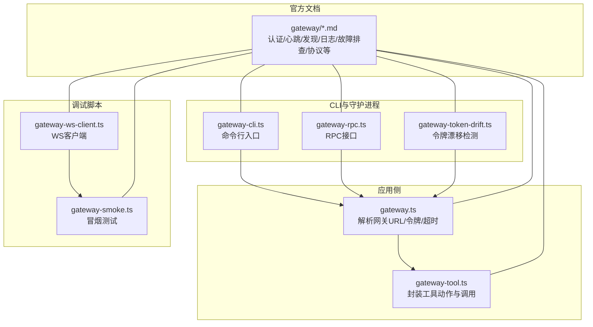
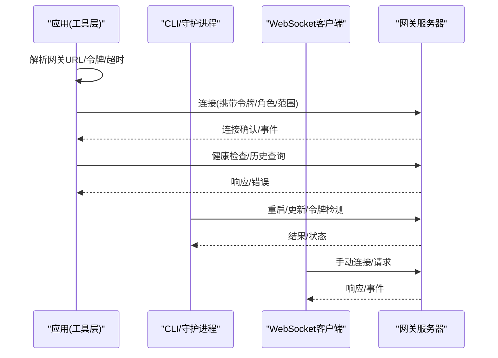
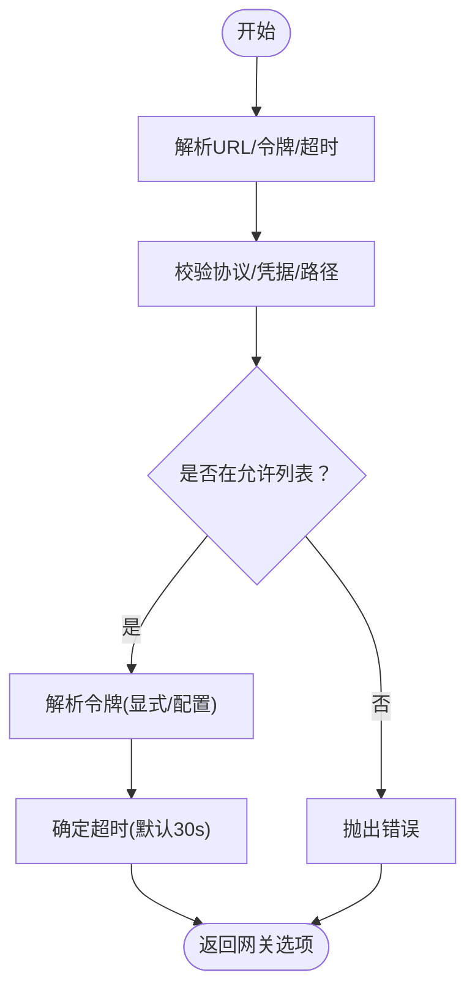
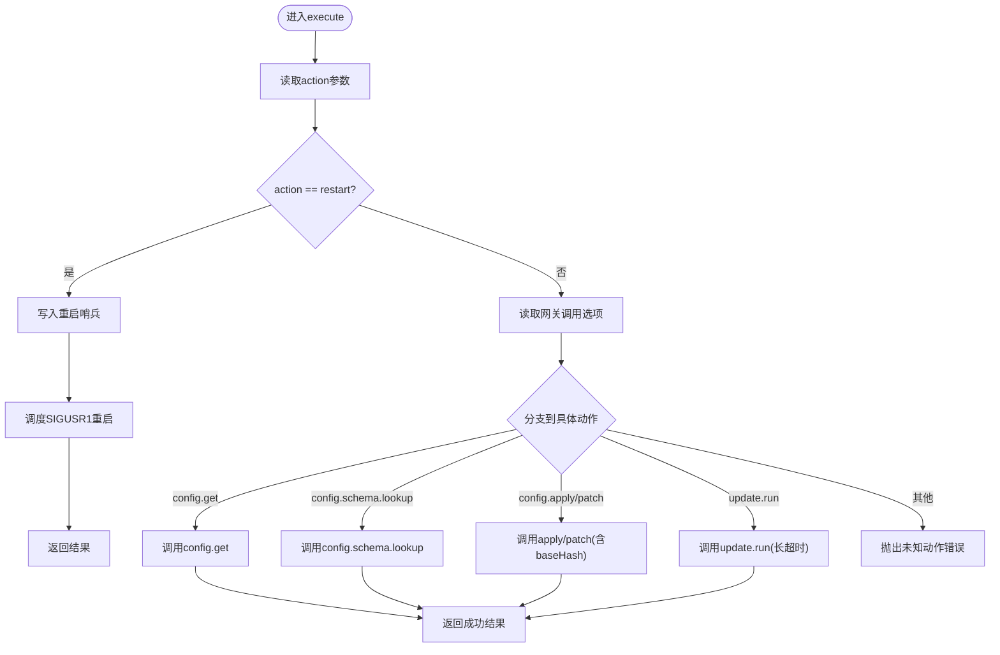
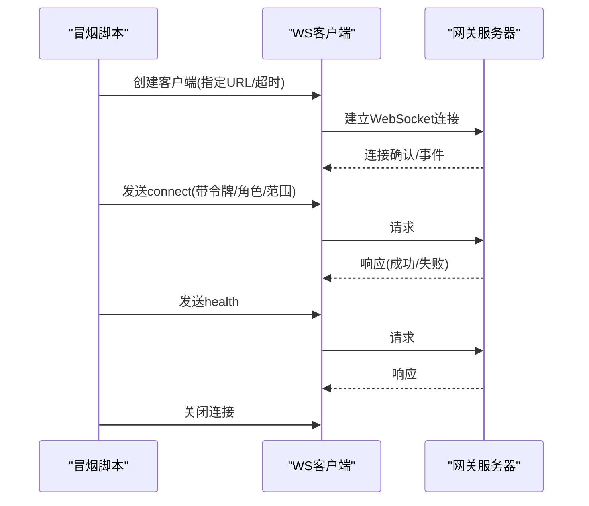
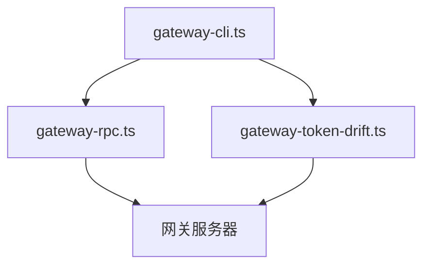
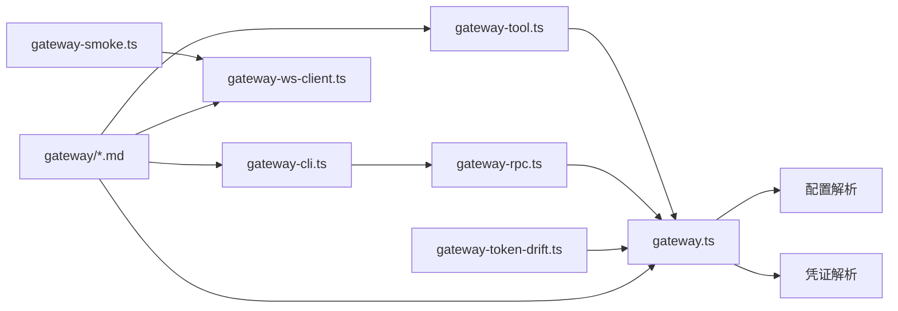

# 网关通信

<cite>
**本文引用的文件**
- [gateway.ts](file://src/agents/tools/gateway.ts)
- [gateway-tool.ts](file://src/agents/tools/gateway-tool.ts)
- [gateway-ws-client.ts](file://scripts/dev/gateway-ws-client.ts)
- [gateway-smoke.ts](file://scripts/dev/gateway-smoke.ts)
- [gateway-cli.ts](file://src/cli/gateway-cli.ts)
- [gateway-rpc.ts](file://src/cli/gateway-rpc.ts)
- [gateway-token-drift.ts](file://src/cli/daemon-cli/gateway-token-drift.ts)
- [gateway.md](file://docs/gateway/index.md)
- [authentication.md](file://docs/gateway/authentication.md)
- [heartbeat.md](file://docs/gateway/heartbeat.md)
- [discovery.md](file://docs/gateway/discovery.md)
- [logging.md](file://docs/gateway/logging.md)
- [troubleshooting.md](file://docs/gateway/troubleshooting.md)
- [protocol.md](file://docs/gateway/protocol.md)
- [multiple-gateways.md](file://docs/gateway/multiple-gateways.md)
- [network-model.md](file://docs/gateway/network-model.md)
- [remote.md](file://docs/gateway/remote.md)
- [background-process.md](file://docs/gateway/background-process.md)
- [cli-backends.md](file://docs/gateway/cli-backends.md)
- [configuration-reference.md](file://docs/gateway/configuration-reference.md)
- [configuration.md](file://docs/gateway/configuration.md)
- [gateway-lock.md](file://docs/gateway/gateway-lock.md)
- [secrets.md](file://docs/gateway/secrets.md)
- [tailscale.md](file://docs/gateway/tailscale.md)
- [trusted-proxy-auth.md](file://docs/gateway/trusted-proxy-auth.md)
- [bonjour.md](file://docs/gateway/bonjour.md)
- [bridge-protocol.md](file://docs/gateway/bridge-protocol.md)
- [openai-http-api.md](file://docs/gateway/openai-http-api.md)
- [openresponses-http-api.md](file://docs/gateway/openresponses-http-api.md)
- [tools-invoke-http-api.md](file://docs/gateway/tools-invoke-http-api.md)
- [sandbox-vs-tool-policy-vs-elevated.md](file://docs/gateway/sandbox-vs-tool-policy-vs-elevated.md)
- [sandinboot.md](file://docs/platforms/mac/sandinboot.md)
- [macos.md](file://docs/platforms/macos.md)
</cite>

## 目录
1. [引言](#引言)
2. [项目结构](#项目结构)
3. [核心组件](#核心组件)
4. [架构总览](#架构总览)
5. [详细组件分析](#详细组件分析)
6. [依赖关系分析](#依赖关系分析)
7. [性能考虑](#性能考虑)
8. [故障排查指南](#故障排查指南)
9. [结论](#结论)
10. [附录](#附录)

## 引言
本文件面向OpenClaw macOS应用的“网关通信”能力，系统性阐述应用与网关服务器之间的通信协议、连接建立与维护机制，包括WebSocket管理、心跳与断线重连策略、远程网关发现与配置、安全认证流程、调试工具与日志记录、错误处理机制，以及性能监控、连接池与网络优化策略。文档以源码与官方文档为依据，辅以图示帮助非专业读者理解。

## 项目结构
围绕“网关通信”的关键代码与文档分布如下：
- 应用侧工具层：封装对网关的调用、参数解析与权限范围计算，负责在macOS等平台上解析本地或远程网关地址、令牌与超时设置，并通过统一的调用入口发起请求。
- CLI与守护进程：提供命令行后端、RPC接口、令牌漂移检测与守护进程重启调度，支撑网关的生命周期管理与运维。
- 调试脚本：提供轻量WS客户端与冒烟测试脚本，便于快速验证连接、健康检查与典型方法调用。
- 官方文档：覆盖认证、心跳、发现、日志、故障排查、协议、多网关、网络模型、远程网关、后台进程、CLI后端、配置参考、锁机制、密钥、Tailscale、可信代理、Bonjour、桥接协议、HTTP API、工具调用HTTP API、沙箱与工具策略等主题。

**图表来源**
- [gateway.ts:1-161](file://src/agents/tools/gateway.ts#L1-L161)
- [gateway-tool.ts:1-229](file://src/agents/tools/gateway-tool.ts#L1-L229)
- [gateway-cli.ts](file://src/cli/gateway-cli.ts)
- [gateway-rpc.ts](file://src/cli/gateway-rpc.ts)
- [gateway-token-drift.ts](file://src/cli/daemon-cli/gateway-token-drift.ts)
- [gateway-ws-client.ts:1-133](file://scripts/dev/gateway-ws-client.ts#L1-L133)
- [gateway-smoke.ts:1-76](file://scripts/dev/gateway-smoke.ts#L1-L76)

**章节来源**
- [gateway.ts:1-161](file://src/agents/tools/gateway.ts#L1-L161)
- [gateway-tool.ts:1-229](file://src/agents/tools/gateway-tool.ts#L1-L229)
- [gateway-ws-client.ts:1-133](file://scripts/dev/gateway-ws-client.ts#L1-L133)
- [gateway-smoke.ts:1-76](file://scripts/dev/gateway-smoke.ts#L1-L76)

## 核心组件
- 网关调用选项解析器：负责从用户输入或配置中解析网关URL（仅允许ws/wss）、令牌、超时；校验URL合法性并限制路径、凭据与查询参数；支持本地回环与远程网关白名单校验。
- 工具动作封装器：定义“重启、读取配置、查找配置模式、应用/补丁配置、执行更新”等动作，统一调用网关方法，自动注入权限范围与客户端元信息。
- WS客户端与冒烟测试：提供最小化WS客户端与冒烟脚本，演示握手、认证、健康检查与典型方法调用。
- CLI与守护进程：提供命令行后端、RPC接口与令牌漂移检测，支撑网关生命周期与运维。

**章节来源**
- [gateway.ts:10-138](file://src/agents/tools/gateway.ts#L10-L138)
- [gateway-tool.ts:34-228](file://src/agents/tools/gateway-tool.ts#L34-L228)
- [gateway-ws-client.ts:52-132](file://scripts/dev/gateway-ws-client.ts#L52-L132)
- [gateway-smoke.ts:16-75](file://scripts/dev/gateway-smoke.ts#L16-L75)

## 架构总览
下图展示macOS应用侧与网关服务器的交互路径：应用侧通过工具层解析配置与令牌，调用统一的网关调用入口；CLI与守护进程提供运维与重启能力；调试脚本用于快速验证。

**图表来源**
- [gateway.ts:116-138](file://src/agents/tools/gateway.ts#L116-L138)
- [gateway-tool.ts:173-223](file://src/agents/tools/gateway-tool.ts#L173-L223)
- [gateway-ws-client.ts:52-132](file://scripts/dev/gateway-ws-client.ts#L52-L132)
- [gateway-smoke.ts:16-75](file://scripts/dev/gateway-smoke.ts#L16-L75)

## 详细组件分析

### 组件A：网关调用选项解析器
职责与行为：
- URL合法性校验：仅允许ws/wss，禁止用户名/密码、查询/哈希、非根路径；生成规范化origin与key用于匹配。
- 本地/远程白名单：允许127.0.0.1、localhost、IPv6回环在指定端口；或与配置中的远程网关key一致。
- 令牌解析：优先显式传入，其次按目标模式从配置解析；支持远程优先/环境回退策略。
- 超时控制：默认30秒，确保健壮性。

**图表来源**
- [gateway.ts:26-97](file://src/agents/tools/gateway.ts#L26-L97)
- [gateway.ts:99-138](file://src/agents/tools/gateway.ts#L99-L138)

**章节来源**
- [gateway.ts:26-138](file://src/agents/tools/gateway.ts#L26-L138)

### 组件B：工具动作封装器
职责与行为：
- 动作集合：restart、config.get、config.schema.lookup、config.apply、config.patch、update.run。
- 权限范围：根据方法动态推导最小权限范围，提升安全性。
- 写入元数据：支持sessionKey、note、restartDelayMs等，用于写入后重启与交付上下文。
- 错误处理：对未知动作与缺失参数进行明确报错；对重启场景写入重启哨兵，便于重启后通知用户。

**图表来源**
- [gateway-tool.ts:81-227](file://src/agents/tools/gateway-tool.ts#L81-L227)

**章节来源**
- [gateway-tool.ts:34-228](file://src/agents/tools/gateway-tool.ts#L34-L228)

### 组件C：WebSocket客户端与冒烟测试
职责与行为：
- 客户端：基于ws库，维护请求ID映射、超时、事件分发；支持握手与打开超时。
- 冒烟测试：演示连接、健康检查与历史查询，便于快速验证网关可用性。

**图表来源**
- [gateway-ws-client.ts:52-132](file://scripts/dev/gateway-ws-client.ts#L52-L132)
- [gateway-smoke.ts:16-75](file://scripts/dev/gateway-smoke.ts#L16-L75)

**章节来源**
- [gateway-ws-client.ts:52-132](file://scripts/dev/gateway-ws-client.ts#L52-L132)
- [gateway-smoke.ts:16-75](file://scripts/dev/gateway-smoke.ts#L16-L75)

### 组件D：CLI与守护进程
职责与行为：
- CLI后端：提供命令行入口，承载网关相关操作。
- RPC接口：提供RPC能力，供上层调用。
- 令牌漂移检测：检测令牌变化，触发相应处理。
- 守护进程：支撑后台运行与重启调度。

**图表来源**
- [gateway-cli.ts](file://src/cli/gateway-cli.ts)
- [gateway-rpc.ts](file://src/cli/gateway-rpc.ts)
- [gateway-token-drift.ts](file://src/cli/daemon-cli/gateway-token-drift.ts)

**章节来源**
- [gateway-cli.ts](file://src/cli/gateway-cli.ts)
- [gateway-rpc.ts](file://src/cli/gateway-rpc.ts)
- [gateway-token-drift.ts](file://src/cli/daemon-cli/gateway-token-drift.ts)

## 依赖关系分析
- 组件耦合与内聚：
  - 工具层依赖配置解析与凭证解析，形成高内聚的调用入口。
  - CLI与守护进程与工具层解耦，通过RPC与命令行后端对接。
- 外部依赖与集成点：
  - ws库用于WebSocket通信。
  - 文档与指南作为规范约束，指导认证、心跳、发现、日志与故障排查。

**图表来源**
- [gateway-tool.ts:14-15](file://src/agents/tools/gateway-tool.ts#L14-L15)
- [gateway.ts:1-6](file://src/agents/tools/gateway.ts#L1-L6)
- [gateway-cli.ts](file://src/cli/gateway-cli.ts)
- [gateway-rpc.ts](file://src/cli/gateway-rpc.ts)
- [gateway-token-drift.ts](file://src/cli/daemon-cli/gateway-token-drift.ts)
- [gateway-smoke.ts:1-1](file://scripts/dev/gateway-smoke.ts#L1-L1)
- [gateway-ws-client.ts:1-2](file://scripts/dev/gateway-ws-client.ts#L1-L2)

**章节来源**
- [gateway-tool.ts:14-15](file://src/agents/tools/gateway-tool.ts#L14-L15)
- [gateway.ts:1-6](file://src/agents/tools/gateway.ts#L1-L6)
- [gateway-cli.ts](file://src/cli/gateway-cli.ts)
- [gateway-rpc.ts](file://src/cli/gateway-rpc.ts)
- [gateway-token-drift.ts](file://src/cli/daemon-cli/gateway-token-drift.ts)
- [gateway-smoke.ts:1-1](file://scripts/dev/gateway-smoke.ts#L1-L1)
- [gateway-ws-client.ts:1-2](file://scripts/dev/gateway-ws-client.ts#L1-L2)

## 性能考虑
- 连接复用：在工具层与CLI之间共享已建立的连接，减少握手开销。
- 超时与背压：合理设置请求超时与队列长度，避免阻塞；对长任务采用长超时策略。
- 心跳与保活：定期发送轻量心跳，维持连接活跃，降低中间设备丢弃风险。
- 断线重连：指数退避+抖动的重连策略，避免雪崩效应；区分可恢复错误与致命错误。
- 日志采样：对高频事件进行采样记录，平衡可观测性与性能。
- 网络优化：启用压缩、批量请求、缓存热点响应，降低带宽占用。

## 故障排查指南
- 认证失败：核对令牌来源与有效期；检查远程/本地模式切换与环境变量。
- 连接超时：检查防火墙、代理与端口可达性；调整握手与打开超时。
- 方法调用错误：确认方法名、参数与权限范围；使用“配置模式查找”定位字段。
- 重启后无反馈：检查重启哨兵与交付上下文；确认守护进程状态。
- 远程网关不可达：验证远程URL、证书与网络连通性；必要时启用Tailscale或可信代理。
- 日志定位：结合子系统日志与事件流，定位问题阶段与原因。

**章节来源**
- [authentication.md](file://docs/gateway/authentication.md)
- [heartbeat.md](file://docs/gateway/heartbeat.md)
- [discovery.md](file://docs/gateway/discovery.md)
- [logging.md](file://docs/gateway/logging.md)
- [troubleshooting.md](file://docs/gateway/troubleshooting.md)
- [tailscale.md](file://docs/gateway/tailscale.md)
- [trusted-proxy-auth.md](file://docs/gateway/trusted-proxy-auth.md)

## 结论
OpenClaw的网关通信在macOS平台通过工具层统一解析与调用、CLI与守护进程提供运维能力、调试脚本保障快速验证，配合官方文档的认证、心跳、发现、日志与故障排查指南，形成了完整且可扩展的通信体系。建议在生产环境中强化断线重连与心跳策略、完善日志采样与性能监控，并持续优化网络路径与连接复用。

## 附录
- 协议与消息格式：参考协议文档，了解请求/响应/事件帧结构与版本协商。
- 多网关与网络模型：支持多网关与复杂网络拓扑，结合网络模型与发现机制选择最优路径。
- 远程网关与后台进程：远程网关需满足安全与可达性要求；后台进程负责稳定运行与重启。
- 配置参考与锁机制：遵循配置参考与锁机制，避免并发写冲突。
- 工具调用HTTP API与沙箱策略：在受限环境下安全地调用工具与HTTP API。

**章节来源**
- [protocol.md](file://docs/gateway/protocol.md)
- [multiple-gateways.md](file://docs/gateway/multiple-gateways.md)
- [network-model.md](file://docs/gateway/network-model.md)
- [remote.md](file://docs/gateway/remote.md)
- [background-process.md](file://docs/gateway/background-process.md)
- [configuration-reference.md](file://docs/gateway/configuration-reference.md)
- [gateway-lock.md](file://docs/gateway/gateway-lock.md)
- [tools-invoke-http-api.md](file://docs/gateway/tools-invoke-http-api.md)
- [sandbox-vs-tool-policy-vs-elevated.md](file://docs/gateway/sandbox-vs-tool-policy-vs-elevated.md)
- [sandinboot.md](file://docs/platforms/mac/sandinboot.md)
- [macos.md](file://docs/platforms/macos.md)