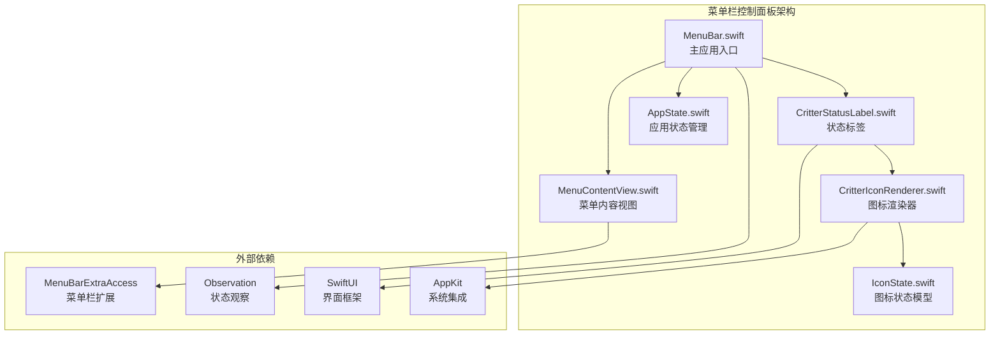
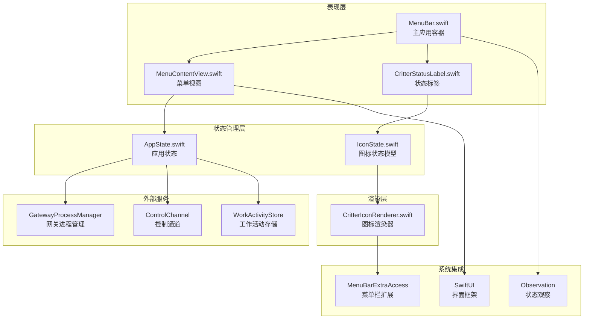
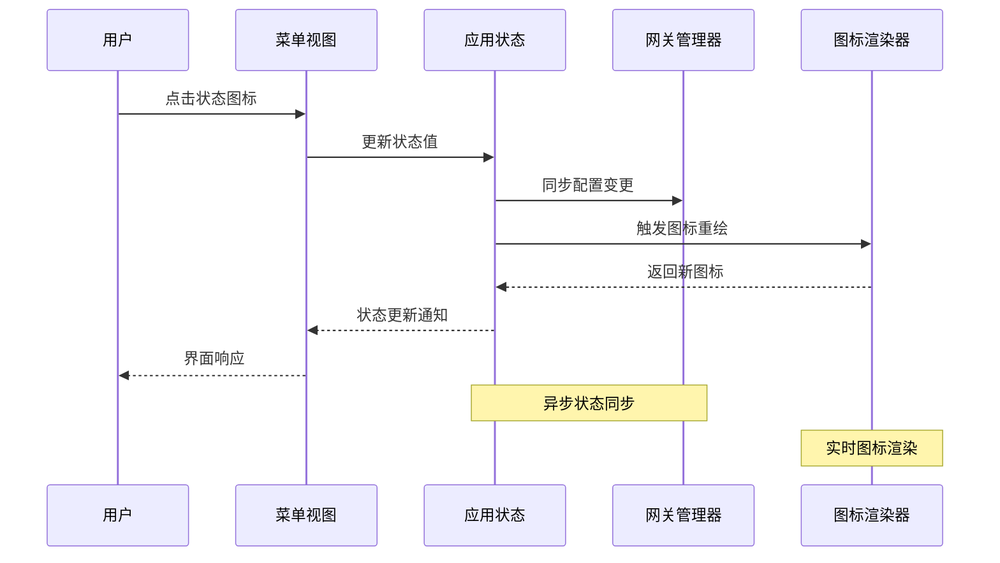
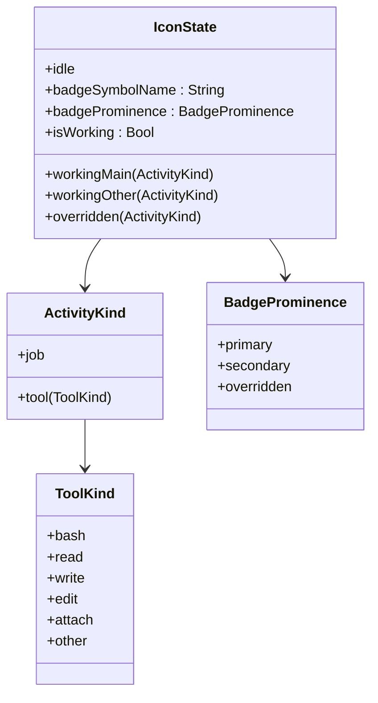
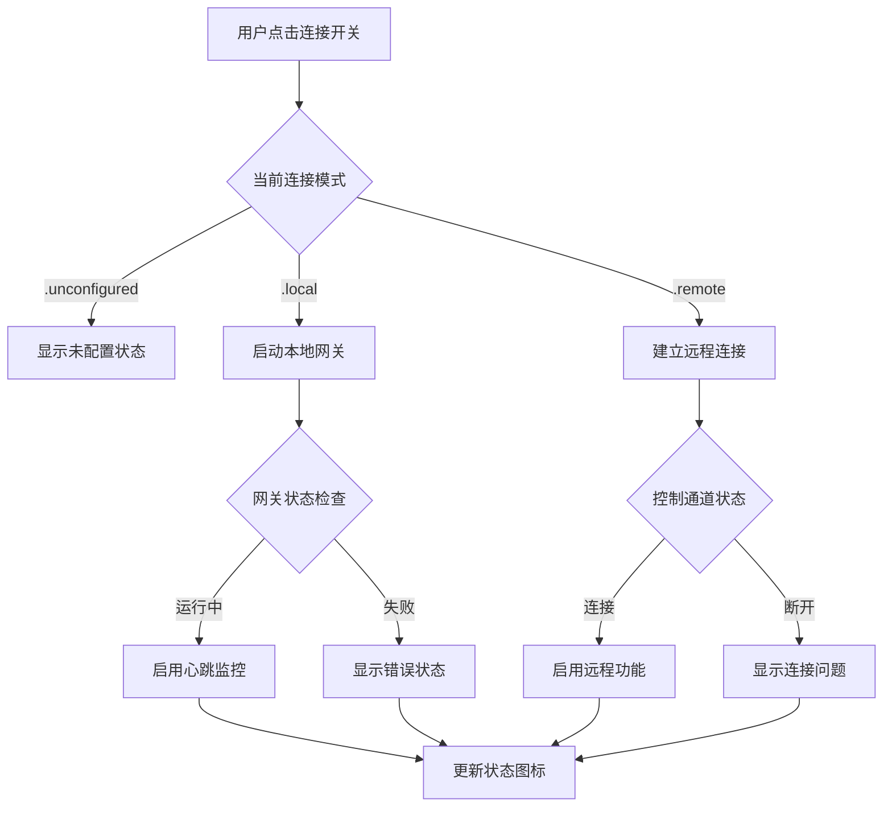
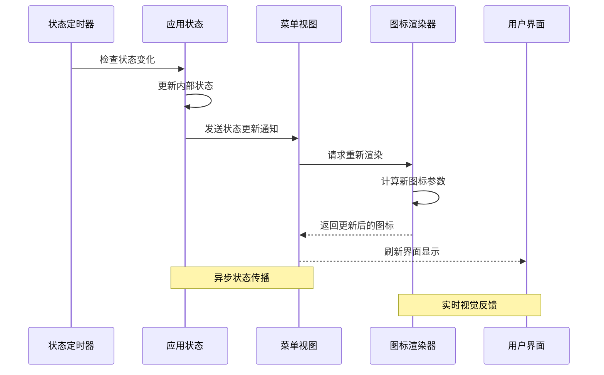
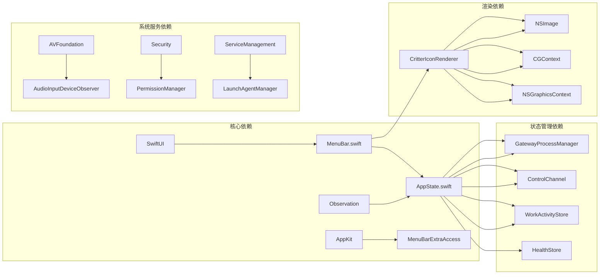
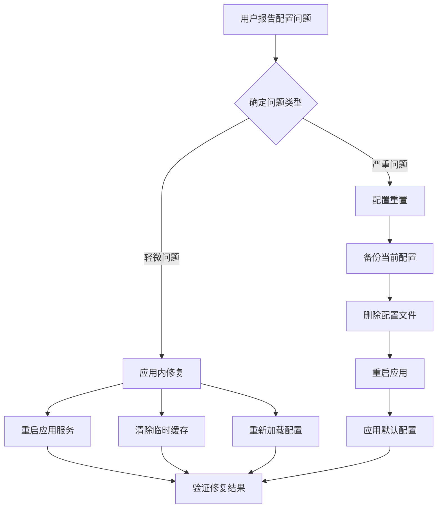

# 菜单栏控制面板

<cite>
**本文档引用的文件**
- [MenuBar.swift](file://apps/macos/Sources/OpenClaw/MenuBar.swift)
- [MenuContentView.swift](file://apps/macos/Sources/OpenClaw/MenuContentView.swift)
- [CritterStatusLabel.swift](file://apps/macos/Sources/OpenClaw/CritterStatusLabel.swift)
- [CritterIconRenderer.swift](file://apps/macos/Sources/OpenClaw/CritterIconRenderer.swift)
- [IconState.swift](file://apps/macos/Sources/OpenClaw/IconState.swift)
- [AppState.swift](file://apps/macos/Sources/OpenClaw/AppState.swift)
</cite>

## 目录
1. [简介](#简介)
2. [项目结构](#项目结构)
3. [核心组件](#核心组件)
4. [架构概览](#架构概览)
5. [详细组件分析](#详细组件分析)
6. [依赖关系分析](#依赖关系分析)
7. [性能考虑](#性能考虑)
8. [故障排除指南](#故障排除指南)
9. [结论](#结论)

## 简介

OpenClaw macOS 应用的菜单栏控制面板是用户与应用进行快速交互的核心界面。该控制面板提供了完整的应用状态可视化、即时操作控制和配置管理功能。通过精心设计的状态指示系统和直观的用户界面，用户可以轻松监控应用运行状态并执行常用操作。

菜单栏控制面板采用现代化的 SwiftUI 架构，集成了丰富的视觉反馈机制，包括动画效果、状态指示器和实时数据更新。该系统支持多种连接模式（本地、远程、未配置），并提供了灵活的配置选项来满足不同用户的需求。

## 项目结构

OpenClaw 菜单栏控制面板主要由以下核心文件组成：

**图表来源**
- [MenuBar.swift:1-465](file://apps/macos/Sources/OpenClaw/MenuBar.swift#L1-L465)
- [MenuContentView.swift:1-571](file://apps/macos/Sources/OpenClaw/MenuContentView.swift#L1-L571)
- [CritterStatusLabel.swift:1-24](file://apps/macos/Sources/OpenClaw/CritterStatusLabel.swift#L1-L24)

**章节来源**
- [MenuBar.swift:10-92](file://apps/macos/Sources/OpenClaw/MenuBar.swift#L10-L92)
- [MenuContentView.swift:7-33](file://apps/macos/Sources/OpenClaw/MenuContentView.swift#L7-L33)

## 核心组件

### 主应用入口 (OpenClawApp)

主应用类负责整个菜单栏控制面板的初始化和生命周期管理。它集成了状态栏项目管理、鼠标事件处理和界面外观控制等功能。

**核心特性：**
- MenuBarExtra 集成，提供原生菜单栏体验
- 动态状态指示器，根据应用状态显示不同图标
- 鼠标交互处理，支持左键点击和右键菜单
- 悬停 HUD 控制，避免干扰用户操作

### 菜单内容视图 (MenuContent)

菜单内容视图是用户交互的主要界面，包含了所有可用的操作选项和状态信息展示。

**主要功能区域：**
- 连接状态控制区
- 健康检查和心跳监控
- 浏览器控制和摄像头权限
- 执行审批模式设置
- Canvas 功能开关
- 语音唤醒和麦克风选择
- 快速操作按钮
- 设置和调试选项

### 状态标签 (CritterStatusLabel)

状态标签负责将复杂的应用状态转换为直观的视觉图标，提供实时的状态反馈。

**状态指示机制：**
- 基于 IconState 的状态分类
- 动画效果增强用户体验
- 实时状态同步和更新
- 自定义图标覆盖支持

**章节来源**
- [MenuBar.swift:11-207](file://apps/macos/Sources/OpenClaw/MenuBar.swift#L11-L207)
- [MenuContentView.swift:8-187](file://apps/macos/Sources/OpenClaw/MenuContentView.swift#L8-L187)
- [CritterStatusLabel.swift:3-23](file://apps/macos/Sources/OpenClaw/CritterStatusLabel.swift#L3-L23)

## 架构概览

OpenClaw 菜单栏控制面板采用了分层架构设计，确保了良好的可维护性和扩展性：

**图表来源**
- [MenuBar.swift:14-18](file://apps/macos/Sources/OpenClaw/MenuBar.swift#L14-L18)
- [AppState.swift:8-9](file://apps/macos/Sources/OpenClaw/AppState.swift#L8-L9)
- [IconState.swift:18-67](file://apps/macos/Sources/OpenClaw/IconState.swift#L18-L67)

### 状态管理系统

应用状态管理系统是整个菜单栏控制面板的核心，负责协调各个组件之间的状态同步：

**图表来源**
- [AppState.swift:168-173](file://apps/macos/Sources/OpenClaw/AppState.swift#L168-L173)
- [MenuBar.swift:76-78](file://apps/macos/Sources/OpenClaw/MenuBar.swift#L76-L78)

**章节来源**
- [AppState.swift:22-32](file://apps/macos/Sources/OpenClaw/AppState.swift#L22-L32)
- [MenuBar.swift:34-40](file://apps/macos/Sources/OpenClaw/MenuBar.swift#L34-L40)

## 详细组件分析

### 图标状态系统

OpenClaw 的图标状态系统是菜单栏控制面板最引人注目的特性之一，它通过精美的动画和视觉效果传达应用的实时状态。

#### 图标状态模型

**图表来源**
- [IconState.swift:18-67](file://apps/macos/Sources/OpenClaw/IconState.swift#L18-L67)

#### 图标渲染器

CritterIconRenderer 负责将抽象的状态模型转换为精美的视觉图标，支持复杂的动画效果和徽章系统。

**渲染特性：**
- 高分辨率位图渲染（36x36像素）
- 几何图形精确计算
- 动态动画参数（眨眼、摆动、耳部动画）
- 可定制的徽章系统

### 菜单交互流程

菜单栏控制面板提供了丰富的交互选项，每个菜单项都有明确的功能定位和用户价值。

#### 连接状态控制

连接状态控制是菜单栏的核心功能，允许用户快速切换应用的工作模式：

**图表来源**
- [MenuContentView.swift:42-63](file://apps/macos/Sources/OpenClaw/MenuContentView.swift#L42-L63)
- [MenuBar.swift:114-131](file://apps/macos/Sources/OpenClaw/MenuBar.swift#L114-L131)

#### 快速操作面板

菜单栏还集成了快速操作面板，提供了一键访问常用功能的能力：

**快捷操作包括：**
- 打开仪表板（快捷键：Command + ,）
- 打开聊天界面
- 切换 Canvas 功能
- 启用/禁用语音唤醒
- 访问设置和关于页面

**章节来源**
- [MenuContentView.swift:109-156](file://apps/macos/Sources/OpenClaw/MenuContentView.swift#L109-L156)
- [MenuBar.swift:150-159](file://apps/macos/Sources/OpenClaw/MenuBar.swift#L150-L159)

### 状态同步机制

OpenClaw 采用了多层次的状态同步机制，确保菜单栏控制面板能够实时反映应用的最新状态。

#### 实时状态更新

**图表来源**
- [AppState.swift:155-158](file://apps/macos/Sources/OpenClaw/AppState.swift#L155-L158)
- [MenuBar.swift:25-27](file://apps/macos/Sources/OpenClaw/MenuBar.swift#L25-L27)

#### 配置同步流程

应用配置的同步采用了智能的增量更新策略，避免不必要的系统调用：

**配置同步步骤：**
1. 检测配置文件变更
2. 解析新的配置参数
3. 验证配置有效性
4. 应用配置到运行时状态
5. 同步到网关进程
6. 更新用户界面显示

**章节来源**
- [AppState.swift:460-468](file://apps/macos/Sources/OpenClaw/AppState.swift#L460-L468)
- [MenuBar.swift:76-78](file://apps/macos/Sources/OpenClaw/MenuBar.swift#L76-L78)

## 依赖关系分析

OpenClaw 菜单栏控制面板的依赖关系体现了清晰的关注点分离和模块化设计。

**图表来源**
- [MenuBar.swift:1-4](file://apps/macos/Sources/OpenClaw/MenuBar.swift#L1-L4)
- [AppState.swift:1-6](file://apps/macos/Sources/OpenClaw/AppState.swift#L1-L6)
- [CritterIconRenderer.swift:1-2](file://apps/macos/Sources/OpenClaw/CritterIconRenderer.swift#L1-L2)

### 外部服务集成

菜单栏控制面板集成了多个外部服务来提供完整功能：

**网关服务集成：**
- GatewayProcessManager：管理本地网关进程
- ControlChannel：处理控制通道通信
- GatewayConnection：维护网关连接状态

**系统服务集成：**
- AVFoundation：音频设备管理和语音唤醒
- Security：权限管理和安全控制
- ServiceManagement：登录启动管理

**章节来源**
- [MenuBar.swift:14-18](file://apps/macos/Sources/OpenClaw/MenuBar.swift#L14-L18)
- [AppState.swift:326-330](file://apps/macos/Sources/OpenClaw/AppState.swift#L326-L330)

## 性能考虑

OpenClaw 菜单栏控制面板在设计时充分考虑了性能优化，确保在各种系统条件下都能提供流畅的用户体验。

### 渲染性能优化

图标渲染采用了多项优化技术来减少 CPU 和内存占用：

**优化策略：**
- 高分辨率缓存（36x36像素位图）
- 几何计算预计算和缓存
- 动画参数的高效更新
- 图形上下文的智能管理

### 内存管理

应用采用了智能的内存管理模式来避免内存泄漏和过度占用：

**内存管理特性：**
- 弱引用避免循环引用
- 及时取消异步任务
- 条件加载和延迟初始化
- 状态观察的自动清理

### 系统资源管理

菜单栏控制面板合理使用系统资源，避免对系统性能造成影响：

**资源管理实践：**
- 最小化的后台任务
- 智能的网络请求调度
- 有限的文件系统访问
- 谨慎的权限请求

## 故障排除指南

### 常见问题诊断

当菜单栏控制面板出现问题时，可以通过以下步骤进行诊断和解决：

**状态图标不更新：**
1. 检查应用是否在前台运行
2. 验证状态观察机制是否正常工作
3. 查看日志输出确认状态同步
4. 重启应用尝试恢复

**菜单项无响应：**
1. 确认应用具有必要的权限
2. 检查网络连接状态
3. 验证配置文件的有效性
4. 尝试重置应用设置

**图标渲染异常：**
1. 清理应用缓存数据
2. 检查系统图形驱动
3. 验证 NSImage 渲染状态
4. 重新安装应用

### 调试工具和方法

OpenClaw 提供了完善的调试工具来帮助用户和开发者诊断问题：

**调试功能包括：**
- 健康检查手动触发
- 日志文件直接访问
- 配置文件验证
- 网络连接状态监控
- 系统权限状态检查

**章节来源**
- [MenuContentView.swift:230-329](file://apps/macos/Sources/OpenClaw/MenuContentView.swift#L230-L329)
- [MenuBar.swift:258-292](file://apps/macos/Sources/OpenClaw/MenuBar.swift#L258-L292)

### 配置重置流程

当遇到严重配置问题时，可以使用以下流程重置应用配置：

**图表来源**
- [AppState.swift:460-468](file://apps/macos/Sources/OpenClaw/AppState.swift#L460-L468)
- [MenuContentView.swift:200-227](file://apps/macos/Sources/OpenClaw/MenuContentView.swift#L200-L227)

## 结论

OpenClaw macOS 应用的菜单栏控制面板代表了现代桌面应用设计的最佳实践。通过精心设计的状态管理系统、直观的用户界面和高效的性能优化，该控制面板为用户提供了无缝的使用体验。

**主要优势：**
- **直观的状态可视化**：通过精美的图标和动画清晰传达应用状态
- **强大的功能集成**：涵盖从基础连接控制到高级配置管理的所有需求
- **优秀的性能表现**：优化的渲染和内存管理确保流畅体验
- **完善的错误处理**：全面的故障排除和恢复机制
- **灵活的扩展性**：模块化设计便于功能扩展和维护

该菜单栏控制面板不仅满足了当前的功能需求，还为未来的功能扩展奠定了坚实的基础。其设计理念和实现方式为其他桌面应用的开发提供了宝贵的参考价值。