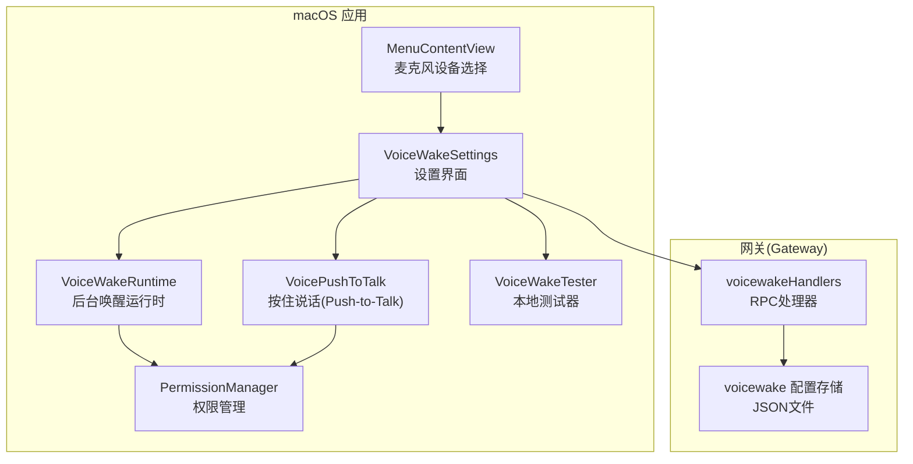
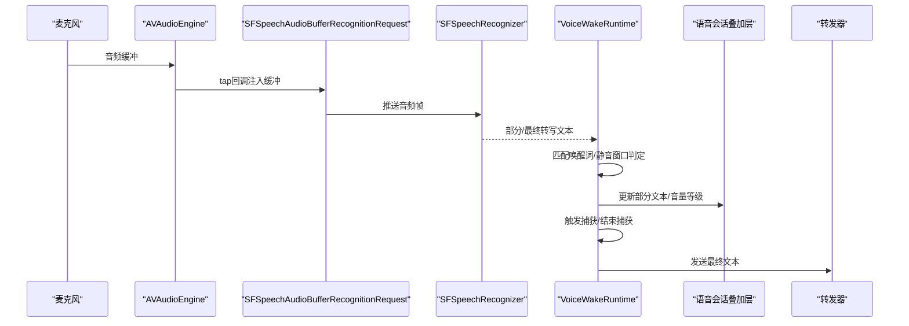
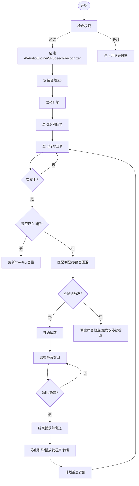
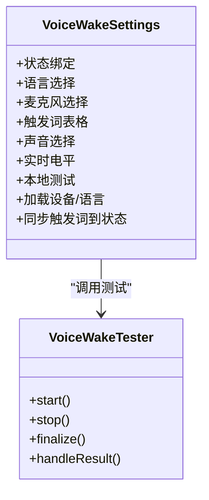
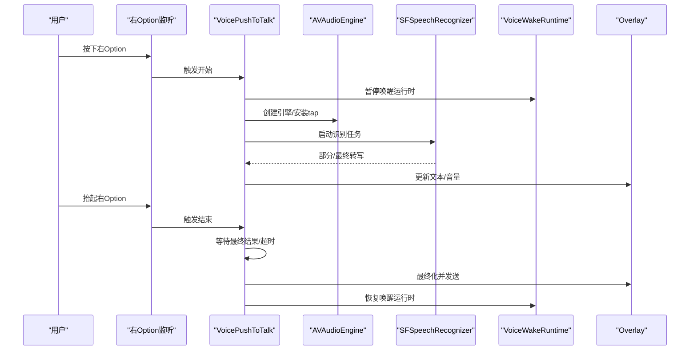
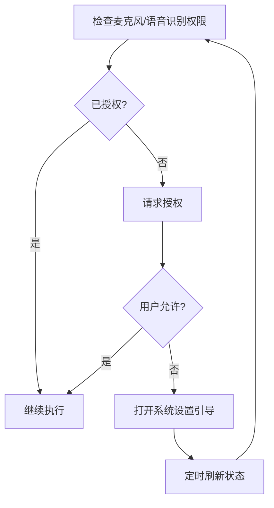
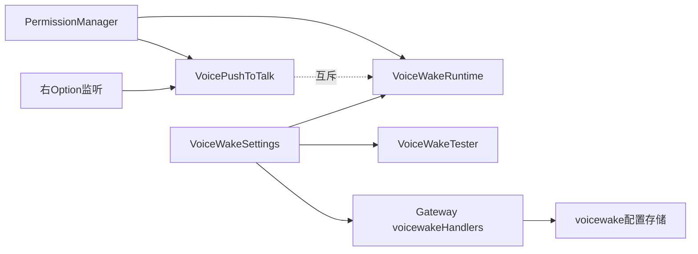

# 语音唤醒功能

<cite>
**本文档引用的文件**
- [VoiceWakeRuntime.swift](file://apps/macos/Sources/OpenClaw/VoiceWakeRuntime.swift)
- [VoiceWakeSettings.swift](file://apps/macos/Sources/OpenClaw/VoiceWakeSettings.swift)
- [VoiceWakeTester.swift](file://apps/macos/Sources/OpenClaw/VoiceWakeTester.swift)
- [VoicePushToTalk.swift](file://apps/macos/Sources/OpenClaw/VoicePushToTalk.swift)
- [PermissionManager.swift](file://apps/macos/Sources/OpenClaw/PermissionManager.swift)
- [PermissionsSettings.swift](file://apps/macos/Sources/OpenClaw/PermissionsSettings.swift)
- [MenuContentView.swift](file://apps/macos/Sources/OpenClaw/MenuContentView.swift)
- [voicewake.ts](file://src/gateway/server-methods/voicewake.ts)
- [voicewake.ts（infra）](file://src/infra/voicewake.ts)
- [voicewake.md（节点文档）](file://docs/nodes/voicewake.md)
- [voicewake.md（mac平台文档）](file://docs/platforms/mac/voicewake.md)
</cite>

## 目录
1. [简介](#简介)
2. [项目结构](#项目结构)
3. [核心组件](#核心组件)
4. [架构总览](#架构总览)
5. [详细组件分析](#详细组件分析)
6. [依赖关系分析](#依赖关系分析)
7. [性能考虑](#性能考虑)
8. [故障排除指南](#故障排除指南)
9. [结论](#结论)
10. [附录](#附录)

## 简介
本文件面向OpenClaw macOS应用的语音唤醒功能，系统性阐述其工作原理、音频处理流程、触发机制与运行时行为，并提供配置选项说明、权限与TCC管理指南、麦克风设备选择策略，以及性能优化、延迟控制与功耗管理建议。文档同时覆盖“按住右Option键”（Push-to-Talk）模式的实现细节，帮助开发者与用户在不同场景下获得稳定可靠的语音交互体验。

## 项目结构
OpenClaw的语音唤醒功能由macOS应用侧的运行时、设置界面、测试器、热键监听与权限管理模块组成；同时通过网关（Gateway）实现全局唤醒词列表的同步与广播。整体采用分层设计：UI设置层负责参数配置与设备选择；运行时层负责后台常驻的唤醒检测与捕获；热键层负责Push-to-Talk的按键监听与即时录音；权限层负责麦克风与语音识别授权检查与引导。

图表来源
- [VoiceWakeSettings.swift](file://apps/macos/Sources/OpenClaw/VoiceWakeSettings.swift)
- [VoiceWakeRuntime.swift](file://apps/macos/Sources/OpenClaw/VoiceWakeRuntime.swift)
- [VoicePushToTalk.swift](file://apps/macos/Sources/OpenClaw/VoicePushToTalk.swift)
- [VoiceWakeTester.swift](file://apps/macos/Sources/OpenClaw/VoiceWakeTester.swift)
- [PermissionManager.swift](file://apps/macos/Sources/OpenClaw/PermissionManager.swift)
- [MenuContentView.swift](file://apps/macos/Sources/OpenClaw/MenuContentView.swift)
- [voicewake.ts](file://src/gateway/server-methods/voicewake.ts)
- [voicewake.ts（infra）](file://src/infra/voicewake.ts)

章节来源
- [VoiceWakeSettings.swift](file://apps/macos/Sources/OpenClaw/VoiceWakeSettings.swift)
- [VoiceWakeRuntime.swift](file://apps/macos/Sources/OpenClaw/VoiceWakeRuntime.swift)
- [VoicePushToTalk.swift](file://apps/macos/Sources/OpenClaw/VoicePushToTalk.swift)
- [VoiceWakeTester.swift](file://apps/macos/Sources/OpenClaw/VoiceWakeTester.swift)
- [PermissionManager.swift](file://apps/macos/Sources/OpenClaw/PermissionManager.swift)
- [MenuContentView.swift](file://apps/macos/Sources/OpenClaw/MenuContentView.swift)
- [voicewake.ts](file://src/gateway/server-methods/voicewake.ts)
- [voicewake.ts（infra）](file://src/infra/voicewake.ts)

## 核心组件
- 唤醒运行时（VoiceWakeRuntime）
  - 负责常驻的唤醒词检测与录音捕获，使用SFSpeechRecognizer与AVAudioEngine进行音频缓冲与转写。
  - 内置静音窗口、触发后静音窗口、硬停止时间、去抖动间隔等参数，确保低误触发与合理结束时机。
  - 支持自适应噪声阈值（RMS-based），动态更新噪声底噪并据此判断语音活动。
- 设置界面（VoiceWakeSettings）
  - 提供启用/禁用、语言与麦克风选择、触发词表、声音提示（触发声/发送声）、实时电平表与本地测试功能。
  - 支持额外语言列表，按顺序尝试识别以提升多语种场景下的鲁棒性。
- 测试器（VoiceWakeTester）
  - 用于本地验证唤醒词识别效果，支持超时、静音回退检测与错误状态反馈。
- 按住说话（VoicePushToTalk）
  - 全局监听右Option键，按下时启动即时录音与部分结果展示，释放时自动发送或超时结束。
  - 与唤醒运行时互斥，避免双通道音频采集冲突。
- 权限管理（PermissionManager）
  - 统一检查与请求麦克风与语音识别权限，提供状态查询与系统设置跳转。
- 麦克风设备选择（MenuContentView）
  - 枚举可用音频输入设备，过滤已断开设备，支持设备变更观察与名称刷新。
- 网关同步（voicewakeHandlers + voicewake配置）
  - Gateway维护全局唤醒词列表，客户端通过RPC获取/设置并接收变更事件，保证跨节点一致性。

章节来源
- [VoiceWakeRuntime.swift](file://apps/macos/Sources/OpenClaw/VoiceWakeRuntime.swift)
- [VoiceWakeSettings.swift](file://apps/macos/Sources/OpenClaw/VoiceWakeSettings.swift)
- [VoiceWakeTester.swift](file://apps/macos/Sources/OpenClaw/VoiceWakeTester.swift)
- [VoicePushToTalk.swift](file://apps/macos/Sources/OpenClaw/VoicePushToTalk.swift)
- [PermissionManager.swift](file://apps/macos/Sources/OpenClaw/PermissionManager.swift)
- [MenuContentView.swift](file://apps/macos/Sources/OpenClaw/MenuContentView.swift)
- [voicewake.ts](file://src/gateway/server-methods/voicewake.ts)
- [voicewake.ts（infra）](file://src/infra/voicewake.ts)

## 架构总览
语音唤醒的整体数据流从麦克风输入开始，经由AVAudioEngine的tap回调注入SFSpeechAudioBufferRecognitionRequest，交由SFSpeechRecognizer进行转写。运行时根据唤醒词匹配策略与静音窗口逻辑决定何时开始捕获、何时结束并发送。Push-to-Talk模式则绕过常驻识别，直接在按键期间进行即时录音与转写。

图表来源
- [VoiceWakeRuntime.swift](file://apps/macos/Sources/OpenClaw/VoiceWakeRuntime.swift)
- [VoiceWakeSettings.swift](file://apps/macos/Sources/OpenClaw/VoiceWakeSettings.swift)
- [VoicePushToTalk.swift](file://apps/macos/Sources/OpenClaw/VoicePushToTalk.swift)

## 详细组件分析

### 唤醒运行时（VoiceWakeRuntime）
- 关键职责
  - 后台常驻监听，按需创建AVAudioEngine与SFSpeechRecognizer，避免应用启动即占用音频资源。
  - 通过音频tap将原始PCM缓冲注入识别请求，结合静音窗口与RMS阈值判断语音活动。
  - 支持触发词匹配（含基于时间戳的片段匹配）与“仅触发无后续内容”的静音回退路径。
  - 控制Overlay显示与音量指示，播放触发声与发送声，结束后清理资源并计划重启。
- 参数与策略
  - 静音窗口：触发后2秒，仅触发时5秒；硬停止120秒防止长时间占用。
  - 去抖动：发送后350毫秒内不响应新触发。
  - RMS阈值：自适应噪声底噪，阈值=噪声×放大系数，动态调整以适配不同环境。
  - 触发暂停窗口：约0.55秒，用于等待触发词后的停顿，作为触发确认信号。
- 生命周期
  - refresh：根据AppState中的开关、触发词、语言、麦克风与声音配置决定是否启动/重启。
  - start：配置音频会话、安装tap、启动引擎与识别任务。
  - stop：取消识别任务、移除tap、停止引擎、关闭Overlay。
  - beginCapture/finalizeCapture：进入捕获阶段、监控静音窗口、播放发送声并转发。
  - restartRecognizer：清理后重新启动识别，保持后台连续监听。

图表来源
- [VoiceWakeRuntime.swift](file://apps/macos/Sources/OpenClaw/VoiceWakeRuntime.swift)

章节来源
- [VoiceWakeRuntime.swift](file://apps/macos/Sources/OpenClaw/VoiceWakeRuntime.swift)

### 设置界面（VoiceWakeSettings）
- 功能要点
  - 开关：启用/禁用唤醒词识别，支持macOS版本限制提示。
  - 语言：主语言与额外语言列表，按顺序尝试识别。
  - 麦克风：系统默认或外部/内置麦克风选择，断开设备提示与自动回退。
  - 触发词：可增删改，支持重置默认值，长度与数量限制由网关侧规范化。
  - 声音：触发声与发送声可选系统声音或自定义音频文件。
  - 实时电平：基于RMS计算的音量条，辅助调试与校准。
  - 本地测试：一键启动测试，支持超时与静音回退检测，失败原因明确。
- 设备与权限
  - 设备枚举与过滤：使用AVCaptureDevice.DiscoverySession发现外部与麦克风设备，结合连接状态与存活UID过滤。
  - 观察与刷新：设备变更时自动刷新列表，保持所选设备名称同步。

图表来源
- [VoiceWakeSettings.swift](file://apps/macos/Sources/OpenClaw/VoiceWakeSettings.swift)
- [VoiceWakeTester.swift](file://apps/macos/Sources/OpenClaw/VoiceWakeTester.swift)

章节来源
- [VoiceWakeSettings.swift](file://apps/macos/Sources/OpenClaw/VoiceWakeSettings.swift)
- [MenuContentView.swift](file://apps/macos/Sources/OpenClaw/MenuContentView.swift)

### Push-to-Talk（按住说话）
- 热键监听
  - 使用NSEvent的global/local监听flagsChanged事件，识别右Option键（keyCode 61）状态变化。
  - 在按下时启动捕获，在抬起时结束并发送。
- 录音与转写
  - 与唤醒运行时类似，但仅在按键期间创建引擎与识别任务，结束后释放资源。
  - 采用会话ID防旧回调，确保并发安全。
- 互斥与恢复
  - 捕获开始前暂停唤醒运行时，避免双通道音频tap冲突；结束后恢复并应用去抖动。

图表来源
- [VoicePushToTalk.swift](file://apps/macos/Sources/OpenClaw/VoicePushToTalk.swift)
- [VoiceWakeRuntime.swift](file://apps/macos/Sources/OpenClaw/VoiceWakeRuntime.swift)

章节来源
- [VoicePushToTalk.swift](file://apps/macos/Sources/OpenClaw/VoicePushToTalk.swift)

### 权限与TCC管理
- 权限类型
  - 麦克风：用于音频输入与语音识别。
  - 语音识别：SFSpeechRecognizer授权，用于本地转写。
- 状态检查与请求
  - 统一通过PermissionManager.status与ensure接口检查与请求授权。
  - 对于未授权情况，提供系统设置跳转与多次刷新以等待授权生效。
- 语音唤醒专用检查
  - voiceWakePermissionsGranted：同时检查麦克风与语音识别授权，作为运行时启动前置条件。

图表来源
- [PermissionManager.swift](file://apps/macos/Sources/OpenClaw/PermissionManager.swift)
- [PermissionsSettings.swift](file://apps/macos/Sources/OpenClaw/PermissionsSettings.swift)

章节来源
- [PermissionManager.swift](file://apps/macos/Sources/OpenClaw/PermissionManager.swift)
- [PermissionsSettings.swift](file://apps/macos/Sources/OpenClaw/PermissionsSettings.swift)

### 网关同步与全局唤醒词
- 数据模型
  - 触发词数组与更新时间戳，支持默认值与空列表回退。
- RPC接口
  - voicewake.get：获取当前触发词列表。
  - voicewake.set：设置触发词列表，返回最新配置并广播变更。
- 客户端行为
  - macOS应用与iOS节点均使用全局列表驱动触发检测，编辑后通过RPC同步并接收广播。

章节来源
- [voicewake.ts](file://src/gateway/server-methods/voicewake.ts)
- [voicewake.ts（infra）](file://src/infra/voicewake.ts)
- [voicewake.md（节点文档）](file://docs/nodes/voicewake.md)
- [voicewake.md（mac平台文档）](file://docs/platforms/mac/voicewake.md)

## 依赖关系分析
- 组件耦合
  - VoiceWakeRuntime与VoiceWakeSettings通过AppState双向绑定，设置变更驱动运行时refresh。
  - VoicePushToTalk与VoiceWakeRuntime存在互斥协作，通过pauseForPushToTalk与applyPushToTalkCooldown协调。
  - VoiceWakeTester独立于运行时，仅用于本地验证，不参与转发。
- 外部依赖
  - AVFoundation（音频引擎与设备）、Speech（识别）、OSLog（诊断日志）。
  - 系统TCC（麦克风/语音识别权限）。
- 广播与同步
  - 网关侧voicewakeHandlers负责持久化与广播，客户端通过WebSocket接收变更事件。

图表来源
- [VoiceWakeSettings.swift](file://apps/macos/Sources/OpenClaw/VoiceWakeSettings.swift)
- [VoiceWakeRuntime.swift](file://apps/macos/Sources/OpenClaw/VoiceWakeRuntime.swift)
- [VoicePushToTalk.swift](file://apps/macos/Sources/OpenClaw/VoicePushToTalk.swift)
- [PermissionManager.swift](file://apps/macos/Sources/OpenClaw/PermissionManager.swift)
- [voicewake.ts](file://src/gateway/server-methods/voicewake.ts)
- [voicewake.ts（infra）](file://src/infra/voicewake.ts)

章节来源
- [VoiceWakeSettings.swift](file://apps/macos/Sources/OpenClaw/VoiceWakeSettings.swift)
- [VoiceWakeRuntime.swift](file://apps/macos/Sources/OpenClaw/VoiceWakeRuntime.swift)
- [VoicePushToTalk.swift](file://apps/macos/Sources/OpenClaw/VoicePushToTalk.swift)
- [PermissionManager.swift](file://apps/macos/Sources/OpenClaw/PermissionManager.swift)
- [voicewake.ts](file://src/gateway/server-methods/voicewake.ts)
- [voicewake.ts（infra）](file://src/infra/voicewake.ts)

## 性能考虑
- 资源占用控制
  - 引擎惰性创建：仅在需要时创建AVAudioEngine，避免应用启动即占用音频资源，降低蓝牙耳机切换至低质量配置的风险。
  - 识别任务与tap在停止时及时移除，释放音频会话与资源。
- 延迟与吞吐
  - tap缓冲大小与回调频率影响延迟，当前使用固定缓冲尺寸，兼顾稳定性与延迟。
  - 部分结果实时更新Overlay，最终结果在静音窗口后发送，平衡用户体验与准确性。
- 功耗管理
  - 识别完成后立即停止引擎与识别任务，避免后台持续占用CPU与电量。
  - 硬停止机制防止长时间占用，避免设备发热与电量消耗。
- 自适应阈值
  - RMS阈值随环境噪声动态调整，减少误触发与漏检，提高在嘈杂环境下的鲁棒性。

## 故障排除指南
- 无法启动识别
  - 检查麦克风与语音识别权限是否已授予；若未授权，使用权限设置页或系统设置手动开启。
  - 确认存在可用音频输入设备；如设备断开，系统默认设备可能不可用。
- 无触发或误触发
  - 调整触发词长度与数量，避免过短导致误触发；适当增加触发后停顿窗口以减少误判。
  - 校准麦克风位置与距离，降低环境噪声；利用实时电平监控评估输入强度。
- 本地测试失败
  - 确保隐私描述字符串已正确配置（mic/speech），否则测试器会拒绝启动。
  - 检查网络与网关状态（如使用远程网关），确保RPC调用可达。
- 设备选择异常
  - 切换麦克风后，若出现“断开提示”，系统会自动回退到默认设备；可在设备恢复后重新选择。

章节来源
- [VoiceWakeTester.swift](file://apps/macos/Sources/OpenClaw/VoiceWakeTester.swift)
- [PermissionManager.swift](file://apps/macos/Sources/OpenClaw/PermissionManager.swift)
- [MenuContentView.swift](file://apps/macos/Sources/OpenClaw/MenuContentView.swift)

## 结论
OpenClaw的语音唤醒功能通过运行时、设置、测试、热键与权限管理的协同，实现了低延迟、低误触、可配置且跨节点一致的语音交互体验。借助网关的全局唤醒词同步与macOS原生的权限体系，用户可以在多种场景下灵活使用“唤醒词模式”与“按住说话模式”。通过合理的参数调优与资源管理策略，可在保证体验的同时有效控制延迟与功耗。

## 附录

### 配置选项速查
- 唤醒词列表：支持多触发词，网关侧统一管理与广播。
- 语言与额外语言：主语言优先，额外语言按顺序尝试。
- 麦克风：系统默认或指定设备；断开时自动回退。
- 声音：触发声与发送声可选系统或自定义音频。
- Push-to-Talk：启用后按住右Option键开始录音，释放后发送。

章节来源
- [VoiceWakeSettings.swift](file://apps/macos/Sources/OpenClaw/VoiceWakeSettings.swift)
- [voicewake.ts](file://src/gateway/server-methods/voicewake.ts)
- [voicewake.ts（infra）](file://src/infra/voicewake.ts)