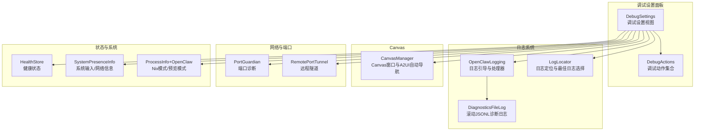
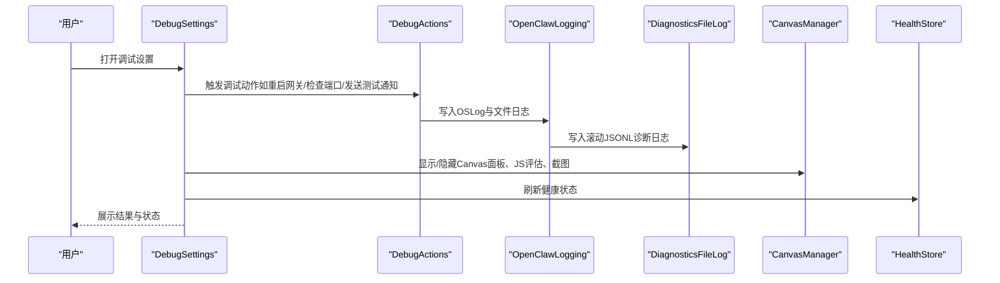
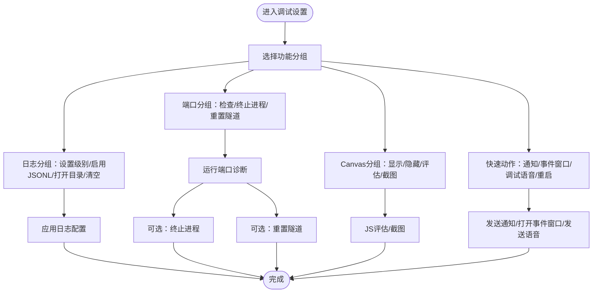
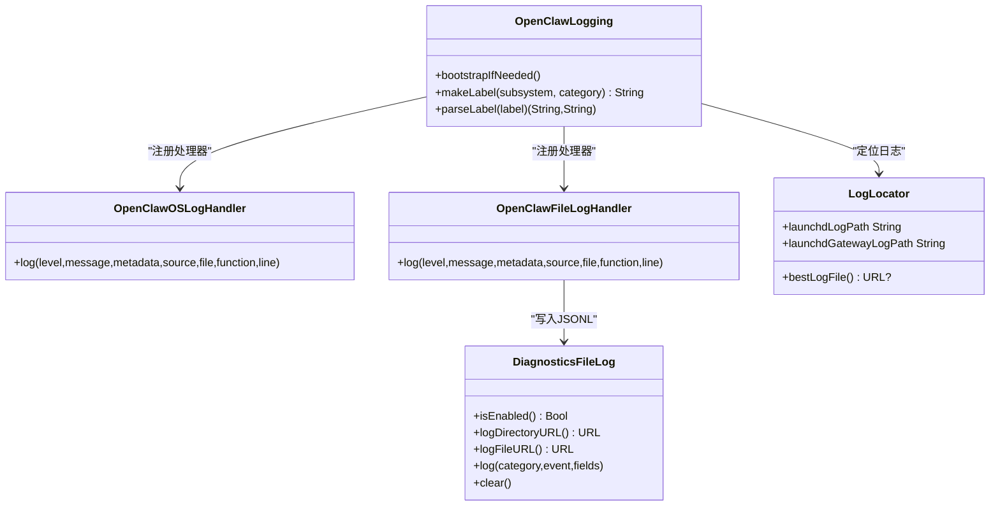
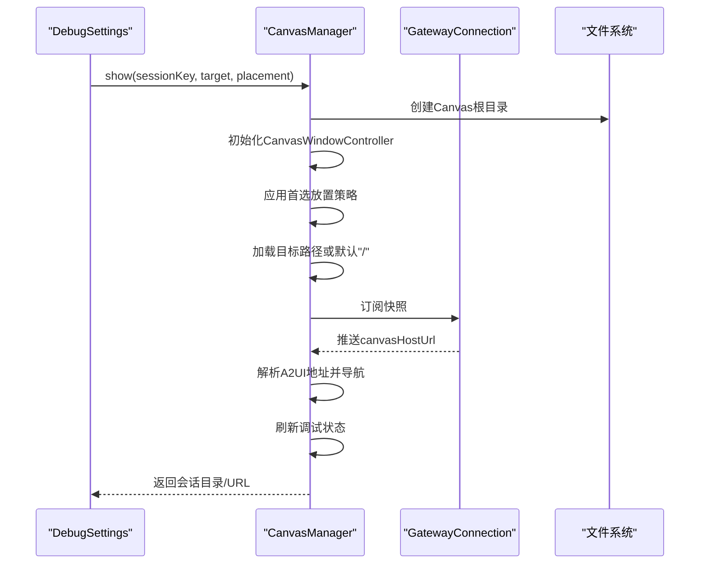
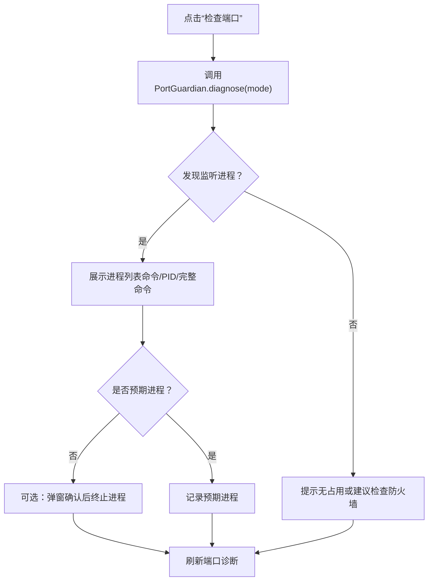
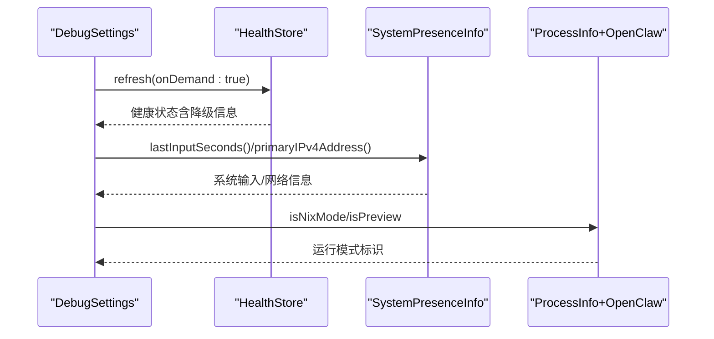
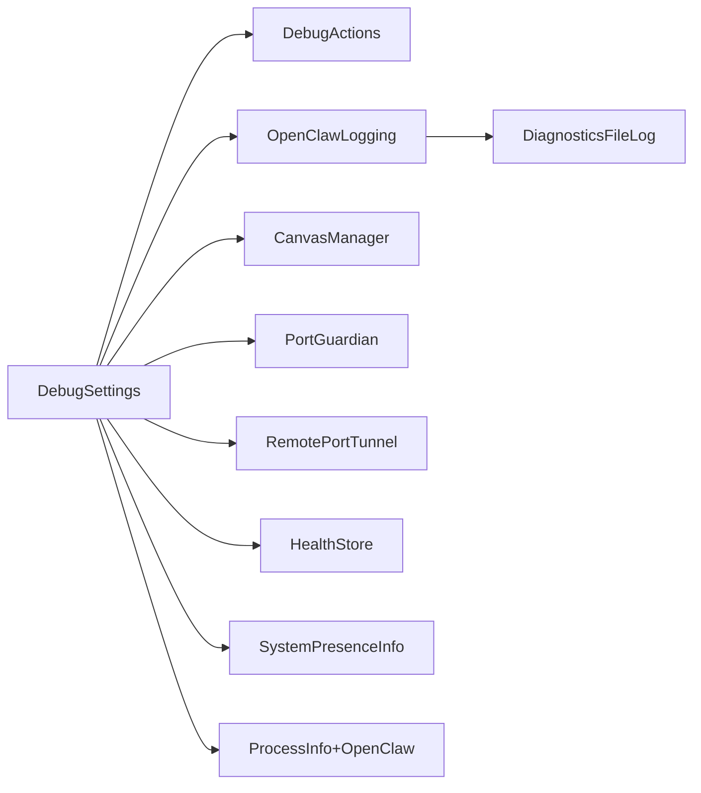

# 调试工具

<cite>
**本文引用的文件**
- [DiagnosticsFileLog.swift](file://apps/macos/Sources/OpenClaw/DiagnosticsFileLog.swift)
- [DebugSettings.swift](file://apps/macos/Sources/OpenClaw/DebugSettings.swift)
- [DebugActions.swift](file://apps/macos/Sources/OpenClaw/DebugActions.swift)
- [CanvasManager.swift](file://apps/macos/Sources/OpenClaw/CanvasManager.swift)
- [OpenClawLogging.swift](file://apps/macos/Sources/OpenClaw/Logging/OpenClawLogging.swift)
- [LogLocator.swift](file://apps/macos/Sources/OpenClaw/LogLocator.swift)
- [VoiceWakeRecognitionDebugSupport.swift](file://apps/macos/Sources/OpenClaw/VoiceWakeRecognitionDebugSupport.swift)
- [HealthStore.swift](file://apps/macos/Sources/OpenClaw/HealthStore.swift)
- [RemotePortTunnel.swift](file://apps/macos/Sources/OpenClaw/RemotePortTunnel.swift)
- [PortGuardian.swift](file://apps/macos/Sources/OpenClaw/PortGuardian.swift)
- [ProcessInfo+OpenClaw.swift](file://apps/macos/Sources/OpenClaw/ProcessInfo+OpenClaw.swift)
- [SystemPresenceInfo.swift](file://apps/macos/Sources/OpenClaw/SystemPresenceInfo.swift)
</cite>

## 目录
1. [简介](#简介)
2. [项目结构](#项目结构)
3. [核心组件](#核心组件)
4. [架构总览](#架构总览)
5. [详细组件分析](#详细组件分析)
6. [依赖关系分析](#依赖关系分析)
7. [性能考量](#性能考量)
8. [故障排查指南](#故障排查指南)
9. [结论](#结论)
10. [附录](#附录)

## 简介
本文件面向OpenClaw macOS应用的调试工具，系统化阐述其功能特性、使用方法与配置项，并覆盖日志查看器、网络监控、性能分析与状态检查等能力。文档同时解释界面设计、数据展示与交互流程，提供使用指南、常见问题诊断与性能优化建议，并介绍高级功能、自定义配置与扩展开发方法。

## 项目结构
OpenClaw macOS调试工具主要由以下模块构成：
- 调试设置面板：集中展示与控制调试相关功能（日志、端口、路径、Canvas、快速动作等）
- 日志子系统：统一OSLog与文件日志输出，支持滚动诊断日志（JSONL）
- Canvas管理器：可视化调试与页面快照、自动导航到A2UI
- 网络与端口诊断：端口占用检测、进程终止、隧道重置
- 健康状态与远程隧道：健康检查、远程隧道管理
- 辅助信息：系统输入时长、主IPv4地址、Nix模式识别

**图表来源**
- [DebugSettings.swift:1-1027](file://apps/macos/Sources/OpenClaw/DebugSettings.swift#L1-L1027)
- [DebugActions.swift:1-266](file://apps/macos/Sources/OpenClaw/DebugActions.swift#L1-L266)
- [OpenClawLogging.swift:1-216](file://apps/macos/Sources/OpenClaw/Logging/OpenClawLogging.swift#L1-L216)
- [DiagnosticsFileLog.swift:1-134](file://apps/macos/Sources/OpenClaw/DiagnosticsFileLog.swift#L1-L134)
- [LogLocator.swift:1-60](file://apps/macos/Sources/OpenClaw/LogLocator.swift#L1-L60)
- [CanvasManager.swift:1-343](file://apps/macos/Sources/OpenClaw/CanvasManager.swift#L1-L343)
- [PortGuardian.swift](file://apps/macos/Sources/OpenClaw/PortGuardian.swift)
- [RemotePortTunnel.swift](file://apps/macos/Sources/OpenClaw/RemotePortTunnel.swift)
- [HealthStore.swift](file://apps/macos/Sources/OpenClaw/HealthStore.swift)
- [SystemPresenceInfo.swift:1-16](file://apps/macos/Sources/OpenClaw/SystemPresenceInfo.swift#L1-L16)
- [ProcessInfo+OpenClaw.swift:1-35](file://apps/macos/Sources/OpenClaw/ProcessInfo+OpenClaw.swift#L1-L35)

**章节来源**
- [DebugSettings.swift:1-1027](file://apps/macos/Sources/OpenClaw/DebugSettings.swift#L1-L1027)
- [OpenClawLogging.swift:1-216](file://apps/macos/Sources/OpenClaw/Logging/OpenClawLogging.swift#L1-L216)
- [DiagnosticsFileLog.swift:1-134](file://apps/macos/Sources/OpenClaw/DiagnosticsFileLog.swift#L1-L134)
- [CanvasManager.swift:1-343](file://apps/macos/Sources/OpenClaw/CanvasManager.swift#L1-L343)
- [PortGuardian.swift](file://apps/macos/Sources/OpenClaw/PortGuardian.swift)
- [RemotePortTunnel.swift](file://apps/macos/Sources/OpenClaw/RemotePortTunnel.swift)
- [HealthStore.swift](file://apps/macos/Sources/OpenClaw/HealthStore.swift)
- [SystemPresenceInfo.swift:1-16](file://apps/macos/Sources/OpenClaw/SystemPresenceInfo.swift#L1-L16)
- [ProcessInfo+OpenClaw.swift:1-35](file://apps/macos/Sources/OpenClaw/ProcessInfo+OpenClaw.swift#L1-L35)

## 核心组件
- 调试设置面板（DebugSettings）：提供“App/Gateway/Logs/Ports/Paths/Quick actions/Canvas/Experiments”等分组，集中配置与执行调试操作。
- 日志系统（OpenClawLogging + DiagnosticsFileLog + LogLocator）：统一OSLog与文件日志；可启用滚动JSONL诊断日志；支持选择最佳日志文件。
- Canvas管理器（CanvasManager）：显示/隐藏Canvas面板，支持JavaScript评估、截图、自动导航至A2UI。
- 网络与端口（PortGuardian + RemotePortTunnel）：诊断端口占用并提供终止进程能力；在远程模式下重置SSH隧道。
- 健康状态（HealthStore）：即时刷新健康状态，辅助诊断连接与服务可用性。
- 系统信息（SystemPresenceInfo + ProcessInfo+OpenClaw）：系统最近输入时间、主IPv4地址、Nix模式识别等。

**章节来源**
- [DebugSettings.swift:1-1027](file://apps/macos/Sources/OpenClaw/DebugSettings.swift#L1-L1027)
- [OpenClawLogging.swift:1-216](file://apps/macos/Sources/OpenClaw/Logging/OpenClawLogging.swift#L1-L216)
- [DiagnosticsFileLog.swift:1-134](file://apps/macos/Sources/OpenClaw/DiagnosticsFileLog.swift#L1-L134)
- [LogLocator.swift:1-60](file://apps/macos/Sources/OpenClaw/LogLocator.swift#L1-L60)
- [CanvasManager.swift:1-343](file://apps/macos/Sources/OpenClaw/CanvasManager.swift#L1-L343)
- [PortGuardian.swift](file://apps/macos/Sources/OpenClaw/PortGuardian.swift)
- [RemotePortTunnel.swift](file://apps/macos/Sources/OpenClaw/RemotePortTunnel.swift)
- [HealthStore.swift](file://apps/macos/Sources/OpenClaw/HealthStore.swift)
- [SystemPresenceInfo.swift:1-16](file://apps/macos/Sources/OpenClaw/SystemPresenceInfo.swift#L1-L16)
- [ProcessInfo+OpenClaw.swift:1-35](file://apps/macos/Sources/OpenClaw/ProcessInfo+OpenClaw.swift#L1-L35)

## 架构总览
调试工具围绕“设置面板—动作—日志—状态—网络”的闭环展开，通过统一日志入口与Canvas可视化能力，形成从问题发现到验证修复的完整链路。

**图表来源**
- [DebugSettings.swift:1-1027](file://apps/macos/Sources/OpenClaw/DebugSettings.swift#L1-L1027)
- [DebugActions.swift:1-266](file://apps/macos/Sources/OpenClaw/DebugActions.swift#L1-L266)
- [OpenClawLogging.swift:1-216](file://apps/macos/Sources/OpenClaw/Logging/OpenClawLogging.swift#L1-L216)
- [DiagnosticsFileLog.swift:1-134](file://apps/macos/Sources/OpenClaw/DiagnosticsFileLog.swift#L1-L134)
- [CanvasManager.swift:1-343](file://apps/macos/Sources/OpenClaw/CanvasManager.swift#L1-L343)
- [HealthStore.swift](file://apps/macos/Sources/OpenClaw/HealthStore.swift)

## 详细组件分析

### 组件A：调试设置面板（DebugSettings）
- 功能分组
  - App/Gateway：显示健康状态、CLI安装位置、PID、二进制路径；查看Gateway日志与重启Gateway。
  - Logs：打开Pino日志、设置应用日志级别、启用滚动诊断日志（JSONL）、打开日志目录、清空诊断日志。
  - Ports：检查端口占用、终止可疑进程、重置SSH隧道（远程模式）。
  - Paths：设置OpenClaw项目根目录、会话存储路径、模型目录（本地回退）。
  - Quick actions：发送测试通知、打开Agent事件窗口、发送调试语音、重启应用/引导流程、在Finder中显示应用。
  - Canvas：显示/隐藏面板、写入示例页面、JS评估、截图、显示会话目录。
  - Experiments：图标覆盖等实验性开关。
- 界面设计
  - 使用GroupBox与Grid布局，左侧标签列宽固定，右侧内容自适应。
  - 大量按钮与交互控件，支持实时状态反馈与错误提示。
- 数据展示
  - Gateway日志滚动区域、端口报告列表、Canvas状态/结果文本、会话存储路径等。
- 交互操作
  - 异步任务触发（如端口检查、隧道重置、Canvas操作），状态机驱动UI更新。

**图表来源**
- [DebugSettings.swift:1-1027](file://apps/macos/Sources/OpenClaw/DebugSettings.swift#L1-L1027)

**章节来源**
- [DebugSettings.swift:1-1027](file://apps/macos/Sources/OpenClaw/DebugSettings.swift#L1-L1027)

### 组件B：日志系统（OpenClawLogging + DiagnosticsFileLog + LogLocator）
- 日志引导与处理器
  - 启动时注册OSLog与文件处理器，按子系统/类别输出。
  - 支持通过AppLogLevel调整日志级别；文件日志仅在启用时写入。
- 滚动诊断日志（JSONL）
  - 单文件最大大小与备份数限制，自动轮转。
  - 记录字段包含时间戳、进程ID、分类、事件与元数据。
- 日志定位
  - 支持环境变量覆盖日志目录；自动选择最新日志文件；提供launchd日志路径。

**图表来源**
- [OpenClawLogging.swift:1-216](file://apps/macos/Sources/OpenClaw/Logging/OpenClawLogging.swift#L1-L216)
- [DiagnosticsFileLog.swift:1-134](file://apps/macos/Sources/OpenClaw/DiagnosticsFileLog.swift#L1-L134)
- [LogLocator.swift:1-60](file://apps/macos/Sources/OpenClaw/LogLocator.swift#L1-L60)

**章节来源**
- [OpenClawLogging.swift:1-216](file://apps/macos/Sources/OpenClaw/Logging/OpenClawLogging.swift#L1-L216)
- [DiagnosticsFileLog.swift:1-134](file://apps/macos/Sources/OpenClaw/DiagnosticsFileLog.swift#L1-L134)
- [LogLocator.swift:1-60](file://apps/macos/Sources/OpenClaw/LogLocator.swift#L1-L60)

### 组件C：Canvas管理器（CanvasManager）
- 功能
  - 显示/隐藏Canvas面板，支持锚定到鼠标或菜单栏状态项。
  - JS评估与截图，便于前端调试与问题复现。
  - 自动导航到A2UI（基于Gateway推送或主动查询）。
  - 更新调试状态（标题/副标题），反映连接模式与状态。
- 数据流
  - 通过GatewayConnection订阅快照，解析A2UI地址并导航。
  - 本地计算目标路由是否为本地文件或目录索引存在性。

**图表来源**
- [CanvasManager.swift:1-343](file://apps/macos/Sources/OpenClaw/CanvasManager.swift#L1-L343)

**章节来源**
- [CanvasManager.swift:1-343](file://apps/macos/Sources/OpenClaw/CanvasManager.swift#L1-L343)

### 组件D：网络与端口诊断（PortGuardian + RemotePortTunnel）
- 端口诊断
  - 检测端口占用者（命令、PID、完整命令行），区分预期/非预期进程。
  - 提供一键终止进程能力，失败时返回错误信息。
- 隧道重置（远程模式）
  - 停止所有隧道与连接，重建控制隧道并重新配置控制通道。
  - 成功后刷新健康状态，失败时降级为降级状态并提示。

**图表来源**
- [DebugActions.swift:227-244](file://apps/macos/Sources/OpenClaw/DebugActions.swift#L227-L244)
- [PortGuardian.swift](file://apps/macos/Sources/OpenClaw/PortGuardian.swift)

**章节来源**
- [DebugActions.swift:1-266](file://apps/macos/Sources/OpenClaw/DebugActions.swift#L1-L266)
- [PortGuardian.swift](file://apps/macos/Sources/OpenClaw/PortGuardian.swift)
- [RemotePortTunnel.swift](file://apps/macos/Sources/OpenClaw/RemotePortTunnel.swift)

### 组件E：健康状态与系统信息（HealthStore + SystemPresenceInfo + ProcessInfo+OpenClaw）
- 健康状态
  - 支持立即刷新健康状态，用于诊断连接、服务可用性与降级原因。
- 系统信息
  - 最近输入秒数、主IPv4地址，辅助判断网络与交互异常。
- 运行模式
  - Nix模式识别与预览模式标记，避免本地测试误判。

**图表来源**
- [HealthStore.swift](file://apps/macos/Sources/OpenClaw/HealthStore.swift)
- [SystemPresenceInfo.swift:1-16](file://apps/macos/Sources/OpenClaw/SystemPresenceInfo.swift#L1-L16)
- [ProcessInfo+OpenClaw.swift:1-35](file://apps/macos/Sources/OpenClaw/ProcessInfo+OpenClaw.swift#L1-L35)

**章节来源**
- [HealthStore.swift](file://apps/macos/Sources/OpenClaw/HealthStore.swift)
- [SystemPresenceInfo.swift:1-16](file://apps/macos/Sources/OpenClaw/SystemPresenceInfo.swift#L1-L16)
- [ProcessInfo+OpenClaw.swift:1-35](file://apps/macos/Sources/OpenClaw/ProcessInfo+OpenClaw.swift#L1-L35)

### 组件F：语音唤醒调试支持（VoiceWakeRecognitionDebugSupport）
- 功能
  - 控制调试日志中转录重复输出频率，避免高频噪声。
  - 文本仅匹配回退逻辑，辅助识别触发词与命令长度。
  - 输出匹配摘要，便于快速判断触发结果。

**章节来源**
- [VoiceWakeRecognitionDebugSupport.swift:1-63](file://apps/macos/Sources/OpenClaw/VoiceWakeRecognitionDebugSupport.swift#L1-L63)

## 依赖关系分析
- 松耦合与高内聚
  - DebugSettings作为协调者，通过DebugActions与各子系统交互；CanvasManager、PortGuardian、RemotePortTunnel等以服务形式被调用。
- 关键依赖链
  - 日志：OpenClawLogging → OpenClawFileLogHandler → DiagnosticsFileLog
  - Canvas：CanvasManager → GatewayConnection → A2UI自动导航
  - 网络：DebugActions → PortGuardian/RemotePortTunnel → ControlChannel/GatewayConnection
  - 状态：DebugActions → HealthStore → UI状态更新

**图表来源**
- [DebugSettings.swift:1-1027](file://apps/macos/Sources/OpenClaw/DebugSettings.swift#L1-L1027)
- [OpenClawLogging.swift:1-216](file://apps/macos/Sources/OpenClaw/Logging/OpenClawLogging.swift#L1-L216)
- [DiagnosticsFileLog.swift:1-134](file://apps/macos/Sources/OpenClaw/DiagnosticsFileLog.swift#L1-L134)
- [CanvasManager.swift:1-343](file://apps/macos/Sources/OpenClaw/CanvasManager.swift#L1-L343)
- [PortGuardian.swift](file://apps/macos/Sources/OpenClaw/PortGuardian.swift)
- [RemotePortTunnel.swift](file://apps/macos/Sources/OpenClaw/RemotePortTunnel.swift)
- [HealthStore.swift](file://apps/macos/Sources/OpenClaw/HealthStore.swift)
- [SystemPresenceInfo.swift:1-16](file://apps/macos/Sources/OpenClaw/SystemPresenceInfo.swift#L1-L16)
- [ProcessInfo+OpenClaw.swift:1-35](file://apps/macos/Sources/OpenClaw/ProcessInfo+OpenClaw.swift#L1-L35)

**章节来源**
- [DebugSettings.swift:1-1027](file://apps/macos/Sources/OpenClaw/DebugSettings.swift#L1-L1027)
- [OpenClawLogging.swift:1-216](file://apps/macos/Sources/OpenClaw/Logging/OpenClawLogging.swift#L1-L216)
- [DiagnosticsFileLog.swift:1-134](file://apps/macos/Sources/OpenClaw/DiagnosticsFileLog.swift#L1-L134)
- [CanvasManager.swift:1-343](file://apps/macos/Sources/OpenClaw/CanvasManager.swift#L1-L343)
- [PortGuardian.swift](file://apps/macos/Sources/OpenClaw/PortGuardian.swift)
- [RemotePortTunnel.swift](file://apps/macos/Sources/OpenClaw/RemotePortTunnel.swift)
- [HealthStore.swift](file://apps/macos/Sources/OpenClaw/HealthStore.swift)
- [SystemPresenceInfo.swift:1-16](file://apps/macos/Sources/OpenClaw/SystemPresenceInfo.swift#L1-L16)
- [ProcessInfo+OpenClaw.swift:1-35](file://apps/macos/Sources/OpenClaw/ProcessInfo+OpenClaw.swift#L1-L35)

## 性能考量
- 日志写入
  - 文件日志采用异步写入与追加，避免阻塞主线程；滚动日志在写前检查大小并轮转，防止磁盘膨胀。
- UI响应
  - 大多数调试操作（端口检查、隧道重置、Canvas操作）在后台任务中执行，UI通过状态变量反馈进度与结果。
- 网络与隧道
  - 隧道重置与连接配置在远程模式下进行，尽量减少对用户交互的影响；失败时降级并刷新健康状态。
- Canvas导航
  - 自动导航仅在必要时触发，避免重复加载；本地路由存在性检查通过文件系统查询，尽量减少无效请求。

[本节为通用指导，无需特定文件来源]

## 故障排查指南
- 无法找到日志文件
  - 使用“打开Pino日志”或“打开日志目录”，若不存在则检查日志目录环境变量或默认路径。
- 端口被占用
  - 使用“检查端口”查看占用者；对于非预期进程可选择终止；远程模式下先“重置SSH隧道”再检查。
- Canvas无法显示或空白
  - 使用“写入示例页面”验证Canvas可用性；通过“JS评估”与“截图”定位前端问题；确认A2UI地址解析正确。
- 健康状态异常
  - 点击“运行健康检查”获取最新状态；关注降级信息与错误提示。
- 语音唤醒日志噪声
  - 调整日志级别为Debug/Trace，利用重复过滤降低噪声；检查触发词与命令长度摘要。

**章节来源**
- [DebugActions.swift:1-266](file://apps/macos/Sources/OpenClaw/DebugActions.swift#L1-L266)
- [LogLocator.swift:1-60](file://apps/macos/Sources/OpenClaw/LogLocator.swift#L1-L60)
- [CanvasManager.swift:1-343](file://apps/macos/Sources/OpenClaw/CanvasManager.swift#L1-L343)
- [HealthStore.swift](file://apps/macos/Sources/OpenClaw/HealthStore.swift)
- [VoiceWakeRecognitionDebugSupport.swift:1-63](file://apps/macos/Sources/OpenClaw/VoiceWakeRecognitionDebugSupport.swift#L1-L63)

## 结论
OpenClaw macOS调试工具以“设置面板+动作+日志+状态+网络”为核心，提供了从日志查看、端口诊断、Canvas可视化到健康状态与远程隧道管理的全栈能力。通过统一的日志入口与直观的UI交互，开发者可以高效定位问题并验证修复效果。建议在调试期间开启滚动诊断日志与适当日志级别，并结合Canvas与端口诊断工具进行端到端验证。

[本节为总结，无需特定文件来源]

## 附录

### 使用指南
- 打开调试设置：在应用菜单中找到“调试”面板。
- 查看日志：在“Logs”分组中打开Pino日志或打开滚动诊断日志目录；根据需要调整日志级别。
- 网络诊断：在“Ports”分组中检查端口占用，必要时终止进程或重置远程隧道。
- Canvas调试：在“Canvas”分组中显示面板、评估JS、截图并保存；用于前端问题定位。
- 快速动作：发送测试通知、打开Agent事件窗口、发送调试语音、重启应用或引导流程。

**章节来源**
- [DebugSettings.swift:1-1027](file://apps/macos/Sources/OpenClaw/DebugSettings.swift#L1-L1027)
- [DebugActions.swift:1-266](file://apps/macos/Sources/OpenClaw/DebugActions.swift#L1-L266)

### 配置选项
- 应用日志级别：在“Logs”分组中选择日志级别。
- 滚动诊断日志：启用“Write rolling diagnostics log (JSONL)”并在目录中查看最新文件。
- 项目根目录与会话存储：在“Paths”分组中设置，影响PATH与会话加载行为。
- Canvas会话与A2UI：在“Canvas”分组中设置会话键，自动导航至A2UI。

**章节来源**
- [OpenClawLogging.swift:1-216](file://apps/macos/Sources/OpenClaw/Logging/OpenClawLogging.swift#L1-L216)
- [DiagnosticsFileLog.swift:1-134](file://apps/macos/Sources/OpenClaw/DiagnosticsFileLog.swift#L1-L134)
- [DebugSettings.swift:1-1027](file://apps/macos/Sources/OpenClaw/DebugSettings.swift#L1-L1027)

### 高级功能与扩展
- 自定义日志处理器：通过OpenClawLogging扩展MultiplexLogHandler，添加新的日志目的地。
- Canvas扩展：利用JS评估与截图能力，结合A2UI进行复杂场景复现与回归测试。
- 端口诊断扩展：在PortGuardian中增加新的诊断规则或外部工具集成。
- 健康状态扩展：在HealthStore中新增健康指标，丰富诊断维度。

**章节来源**
- [OpenClawLogging.swift:1-216](file://apps/macos/Sources/OpenClaw/Logging/OpenClawLogging.swift#L1-L216)
- [CanvasManager.swift:1-343](file://apps/macos/Sources/OpenClaw/CanvasManager.swift#L1-L343)
- [PortGuardian.swift](file://apps/macos/Sources/OpenClaw/PortGuardian.swift)
- [HealthStore.swift](file://apps/macos/Sources/OpenClaw/HealthStore.swift)