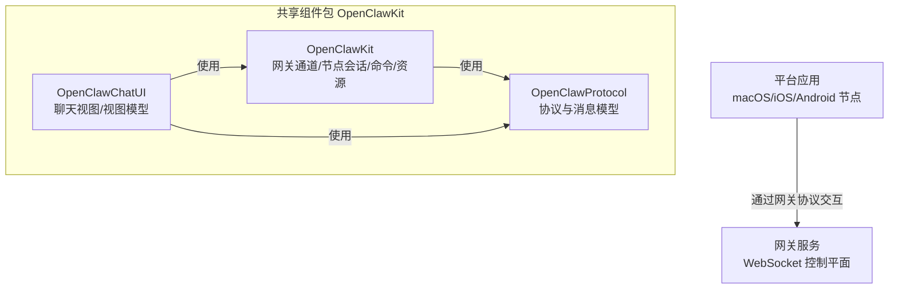
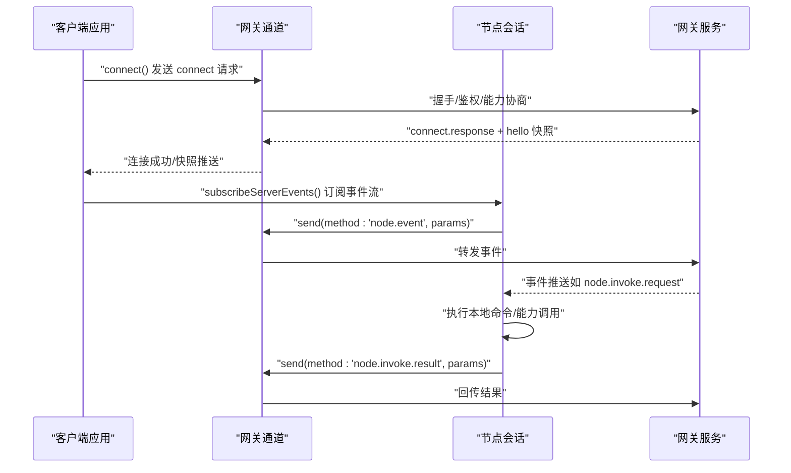
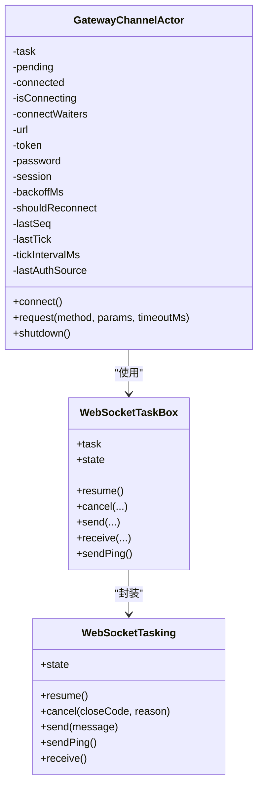
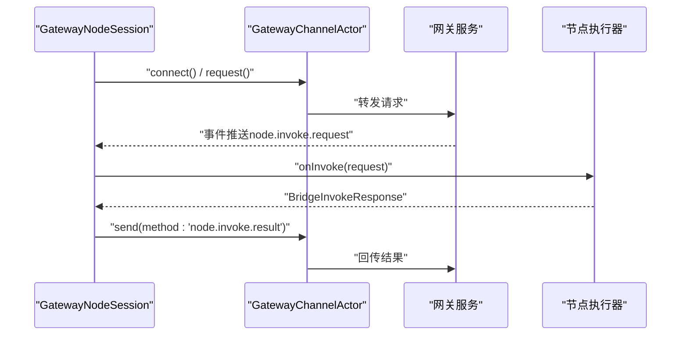
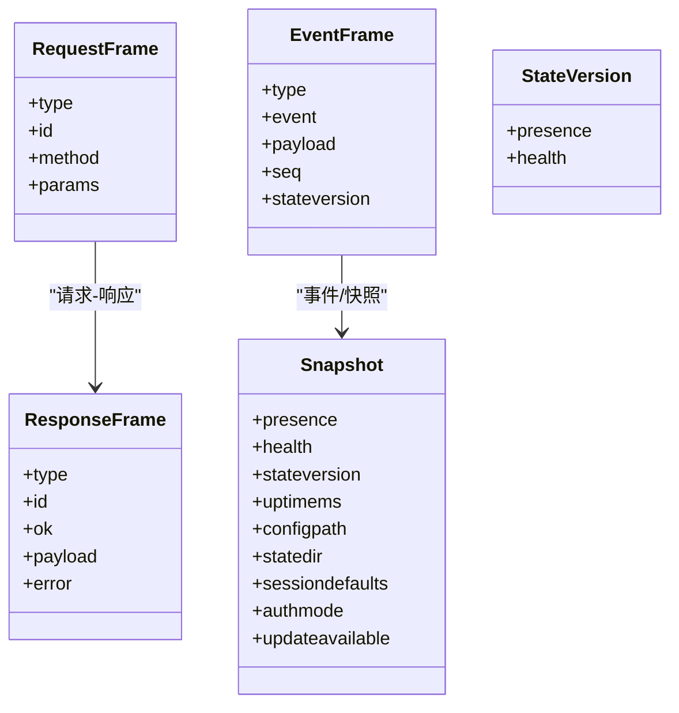
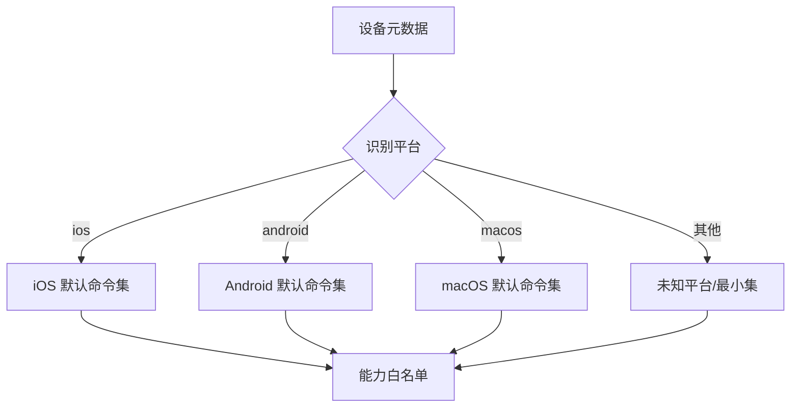
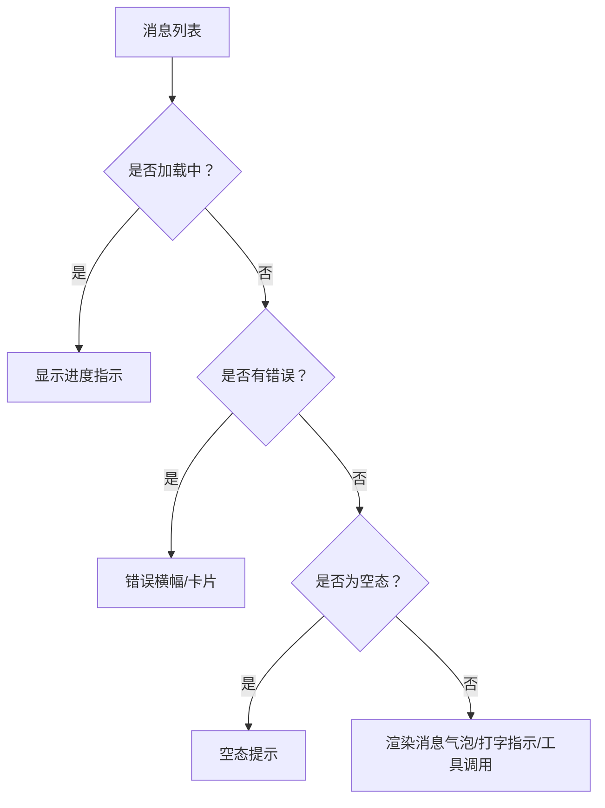
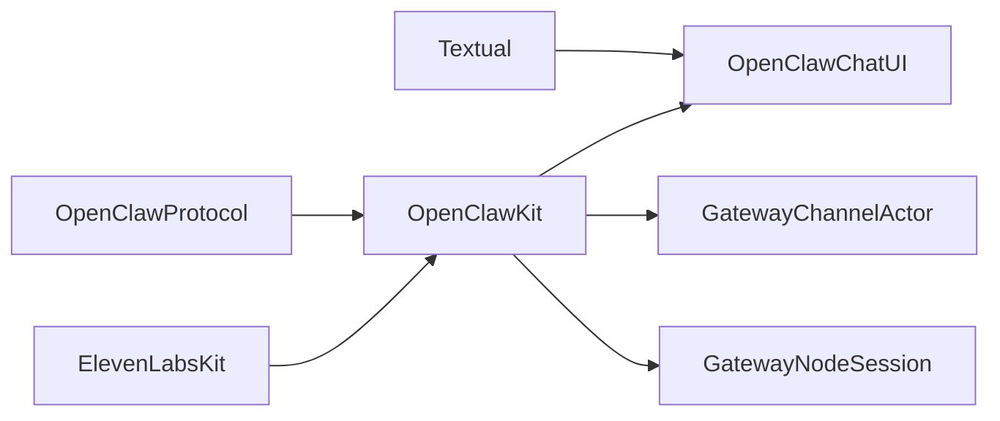

# 共享组件

<cite>
**本文引用的文件**
- [README.md](file://README.md)
- [Package.swift](file://apps/shared/OpenClawKit/Package.swift)
- [GatewayChannel.swift](file://apps/shared/OpenClawKit/Sources/OpenClawKit/GatewayChannel.swift)
- [GatewayNodeSession.swift](file://apps/shared/OpenClawKit/Sources/OpenClawKit/GatewayNodeSession.swift)
- [GatewayModels.swift](file://apps/shared/OpenClawKit/Sources/OpenClawProtocol/GatewayModels.swift)
- [Capabilities.swift](file://apps/shared/OpenClawKit/Sources/OpenClawKit/Capabilities.swift)
- [ChatView.swift](file://apps/shared/OpenClawKit/Sources/OpenClawChatUI/ChatView.swift)
- [node-command-policy.ts](file://src/gateway/node-command-policy.ts)
- [PermissionsSettings.swift](file://apps/macos/Sources/OpenClaw/PermissionsSettings.swift)
- [plugin-sdk.md](file://docs/zh-CN/refactor/plugin-sdk.md)
- [check-no-monolithic-plugin-sdk-entry-imports.ts](file://scripts/check-no-monolithic-plugin-sdk-entry-imports.ts)
</cite>

## 目录
1. [简介](#简介)
2. [项目结构](#项目结构)
3. [核心组件](#核心组件)
4. [架构总览](#架构总览)
5. [详细组件分析](#详细组件分析)
6. [依赖关系分析](#依赖关系分析)
7. [性能考量](#性能考量)
8. [故障排查指南](#故障排查指南)
9. [结论](#结论)
10. [附录](#附录)

## 简介
本技术文档聚焦 OpenClaw 平台的跨平台共享组件，系统阐述其设计架构、组件复用策略与平台适配机制，并深入解析权限管理、网络通信、数据同步与状态管理等通用功能实现。同时提供开发指南、代码规范、测试策略与部署流程，帮助在不同平台上实现一致的用户体验、性能优化与兼容性处理，并给出扩展开发、自定义配置与最佳实践建议。

## 项目结构
OpenClaw 的共享组件主要位于 apps/shared/OpenClawKit，采用 Swift 包组织，包含三个库目标：
- OpenClawProtocol：协议与消息模型（生成的网关协议类型）
- OpenClawKit：核心网关通道、节点会话、设备身份、命令与资源等
- OpenClawChatUI：聊天界面与视图模型（基于 SwiftUI）

图表来源
- [Package.swift:11-15](file://apps/shared/OpenClawKit/Package.swift#L11-L15)
- [GatewayModels.swift:1-10](file://apps/shared/OpenClawKit/Sources/OpenClawProtocol/GatewayModels.swift#L1-L10)

章节来源
- [Package.swift:1-62](file://apps/shared/OpenClawKit/Package.swift#L1-L62)

## 核心组件
- 网关通道（GatewayChannelActor）：负责 WebSocket 连接、鉴权、心跳保活、断线重连、帧收发与事件分发。
- 节点会话（GatewayNodeSession）：封装与网关的节点调用生命周期，订阅服务器事件，处理 node.invoke 请求/响应。
- 协议模型（OpenClawProtocol）：统一的请求/响应/事件帧与快照模型，确保跨平台一致性。
- 能力枚举（Capabilities）：抽象设备/系统能力（如相机、屏幕录制、位置等），用于权限与命令白名单。
- 聊天 UI（OpenClawChatUI）：跨平台聊天界面，支持自动滚动、工具调用合并、错误提示与空态展示。

章节来源
- [GatewayChannel.swift:148-324](file://apps/shared/OpenClawKit/Sources/OpenClawKit/GatewayChannel.swift#L148-L324)
- [GatewayNodeSession.swift:59-253](file://apps/shared/OpenClawKit/Sources/OpenClawKit/GatewayNodeSession.swift#L59-L253)
- [GatewayModels.swift:119-203](file://apps/shared/OpenClawKit/Sources/OpenClawProtocol/GatewayModels.swift#L119-L203)
- [Capabilities.swift:1-18](file://apps/shared/OpenClawKit/Sources/OpenClawKit/Capabilities.swift#L1-L18)
- [ChatView.swift:6-93](file://apps/shared/OpenClawKit/Sources/OpenClawChatUI/ChatView.swift#L6-L93)

## 架构总览
OpenClaw 的共享组件围绕“网关协议”构建，客户端通过 WebSocket 与网关建立长连接，进行鉴权、能力协商、事件订阅与命令调用。节点侧（macOS/iOS/Android）通过节点会话发起 node.invoke 请求，由网关转发至对应节点执行，再回传结果。

图表来源
- [GatewayChannel.swift:270-324](file://apps/shared/OpenClawKit/Sources/OpenClawKit/GatewayChannel.swift#L270-L324)
- [GatewayNodeSession.swift:347-460](file://apps/shared/OpenClawKit/Sources/OpenClawKit/GatewayNodeSession.swift#L347-L460)

## 详细组件分析

### 组件一：网关通道（GatewayChannelActor）
职责与特性
- WebSocket 任务封装与会话管理，支持最大消息尺寸调整、Ping 保活与 NAT/代理穿透。
- 连接超时、挑战-应答、鉴权源识别与失败重试策略。
- 事件监听与帧解析，维护序列号与心跳检测，异常时触发断线与指数退避重连。
- 提供 request/send 方法，统一编码/解码与超时控制。

图表来源
- [GatewayChannel.swift:5-73](file://apps/shared/OpenClawKit/Sources/OpenClawKit/GatewayChannel.swift#L5-L73)
- [GatewayChannel.swift:148-324](file://apps/shared/OpenClawKit/Sources/OpenClawKit/GatewayChannel.swift#L148-L324)

章节来源
- [GatewayChannel.swift:148-773](file://apps/shared/OpenClawKit/Sources/OpenClawKit/GatewayChannel.swift#L148-L773)

### 组件二：节点会话（GatewayNodeSession）
职责与特性
- 将连接参数映射为可比较键值，按需重建通道，确保连接一致性。
- 订阅服务器事件流，接收 node.invoke.request 后委派给 onInvoke 回调，支持超时竞态与结果回传。
- 支持 Canvas 能力刷新与 URL 规范化，维护当前 Canvas Host URL。
- 提供请求方法与事件发送接口，封装错误日志与降级处理。

图表来源
- [GatewayNodeSession.swift:59-253](file://apps/shared/OpenClawKit/Sources/OpenClawKit/GatewayNodeSession.swift#L59-L253)
- [GatewayNodeSession.swift:433-460](file://apps/shared/OpenClawKit/Sources/OpenClawKit/GatewayNodeSession.swift#L433-L460)

章节来源
- [GatewayNodeSession.swift:59-530](file://apps/shared/OpenClawKit/Sources/OpenClawKit/GatewayNodeSession.swift#L59-L530)

### 组件三：协议模型（OpenClawProtocol）
职责与特性
- 定义协议版本常量与统一的帧结构：RequestFrame、ResponseFrame、EventFrame。
- 快照模型 Snapshot 与状态版本 StateVersion，承载网关健康、存在性与会话默认配置。
- 错误形状 ErrorShape 与通用参数结构（如 SendParams、AgentParams）。

图表来源
- [GatewayModels.swift:119-203](file://apps/shared/OpenClawKit/Sources/OpenClawProtocol/GatewayModels.swift#L119-L203)
- [GatewayModels.swift:297-341](file://apps/shared/OpenClawKit/Sources/OpenClawProtocol/GatewayModels.swift#L297-L341)

章节来源
- [GatewayModels.swift:1-800](file://apps/shared/OpenClawKit/Sources/OpenClawProtocol/GatewayModels.swift#L1-L800)

### 组件四：能力与权限（Capabilities 与平台策略）
职责与特性
- 能力枚举抽象设备/系统能力，用于命令白名单与权限声明。
- 平台命令策略根据设备家族/前缀识别平台，提供默认命令集合与安全边界。
- macOS 应用侧提供权限设置 UI，展示与切换能力状态。

图表来源
- [Capabilities.swift:1-18](file://apps/shared/OpenClawKit/Sources/OpenClawKit/Capabilities.swift#L1-L18)
- [node-command-policy.ts:74-160](file://src/gateway/node-command-policy.ts#L74-L160)
- [PermissionsSettings.swift:154-173](file://apps/macos/Sources/OpenClaw/PermissionsSettings.swift#L154-L173)

章节来源
- [Capabilities.swift:1-18](file://apps/shared/OpenClawKit/Sources/OpenClawKit/Capabilities.swift#L1-L18)
- [node-command-policy.ts:74-160](file://src/gateway/node-command-policy.ts#L74-L160)
- [PermissionsSettings.swift:154-173](file://apps/macos/Sources/OpenClaw/PermissionsSettings.swift#L154-L173)

### 组件五：聊天 UI（OpenClawChatUI）
职责与特性
- 跨平台聊天视图，支持标准与引导样式、Markdown 渲染变体、用户强调色与助手追踪显示。
- 自动滚动至底部、输入状态与打字指示、工具调用合并与流式文本渲染。
- 错误提示横幅/卡片、空态占位与刷新动作。

图表来源
- [ChatView.swift:95-335](file://apps/shared/OpenClawKit/Sources/OpenClawChatUI/ChatView.swift#L95-L335)
- [ChatView.swift:348-494](file://apps/shared/OpenClawKit/Sources/OpenClawChatUI/ChatView.swift#L348-L494)

章节来源
- [ChatView.swift:1-593](file://apps/shared/OpenClawKit/Sources/OpenClawChatUI/ChatView.swift#L1-L593)

## 依赖关系分析
- OpenClawKit 依赖 OpenClawProtocol（协议模型）与外部 ElevenLabsKit（语音）、Textual（macOS/iOS 文本渲染）。
- 聊天 UI 依赖 OpenClawKit 与 Textual（仅 macOS/iOS）。
- 节点会话依赖网关通道与协议模型，负责事件订阅与命令执行。

图表来源
- [Package.swift:16-47](file://apps/shared/OpenClawKit/Package.swift#L16-L47)

章节来源
- [Package.swift:1-62](file://apps/shared/OpenClawKit/Package.swift#L1-L62)

## 性能考量
- 连接与保活
  - WebSocket 最大消息尺寸提升至 16MB，避免大快照/历史载荷被截断。
  - 定期 Ping 保持 NAT/代理连接活性，降低无响应重连概率。
- 事件与序列
  - 维护事件序号与心跳时间戳，missed tick 时主动断开并重连，保障事件顺序与一致性。
- 超时与竞态
  - 请求与 invoke 调用均支持超时控制，采用显式闩锁确保超时优先于阻塞回调。
- UI 响应
  - 消息列表使用稳定滚动锚点与动画，避免布局抖动；空态与错误态快速反馈。

章节来源
- [GatewayChannel.swift:61-64](file://apps/shared/OpenClawKit/Sources/OpenClawKit/GatewayChannel.swift#L61-L64)
- [GatewayChannel.swift:334-349](file://apps/shared/OpenClawKit/Sources/OpenClawKit/GatewayChannel.swift#L334-L349)
- [GatewayNodeSession.swift:78-152](file://apps/shared/OpenClawKit/Sources/OpenClawKit/GatewayNodeSession.swift#L78-L152)
- [ChatView.swift:117-186](file://apps/shared/OpenClawKit/Sources/OpenClawChatUI/ChatView.swift#L117-L186)

## 故障排查指南
常见问题与定位要点
- 连接失败
  - 检查鉴权源（设备令牌/共享令牌/密码）、挑战-应答超时与错误详情码。
  - 关注非恢复性鉴权错误与设备令牌不匹配场景下的清理逻辑。
- 断线与重连
  - 观察指数退避与 watchdog 重连节奏；若持续失败，确认网络环境与 NAT/代理策略。
- 事件丢失
  - 检查心跳间隔与 missed tick 判定；序列号 gap 时触发上层通知。
- invoke 超时
  - 核对 onInvoke 执行耗时与超时阈值；必要时在调用侧增加 idempotency key 与幂等处理。

章节来源
- [GatewayChannel.swift:122-146](file://apps/shared/OpenClawKit/Sources/OpenClawKit/GatewayChannel.swift#L122-L146)
- [GatewayChannel.swift:679-701](file://apps/shared/OpenClawKit/Sources/OpenClawKit/GatewayChannel.swift#L679-L701)
- [GatewayNodeSession.swift:132-151](file://apps/shared/OpenClawKit/Sources/OpenClawKit/GatewayNodeSession.swift#L132-L151)

## 结论
OpenClaw 的共享组件以“网关协议”为核心，通过网关通道与节点会话实现跨平台一致的连接、鉴权、事件与命令调用能力；配合能力枚举与平台策略，形成清晰的权限与命令边界；聊天 UI 提供良好的跨平台体验与可观测性。整体设计兼顾安全性、可维护性与性能，适合在多平台扩展与定制。

## 附录

### 开发指南与代码规范
- 插件 SDK 分层
  - 运行时访问通过 OpenClawPluginApi.runtime，禁止直接导入 src/** 内容，确保插件边界清晰。
  - 禁止引入“单体入口”插件 SDK，必须使用细分子路径（如 /core、/channel、/compat）。
- 平台与能力
  - 使用能力枚举统一表达设备/系统能力；平台策略按设备家族/前缀识别默认命令集。
- 日志与错误
  - 统一使用 OSLog 子系统与类别；错误包装与上下文信息记录，便于排障。

章节来源
- [plugin-sdk.md:42-50](file://docs/zh-CN/refactor/plugin-sdk.md#L42-L50)
- [check-no-monolithic-plugin-sdk-entry-imports.ts:73-103](file://scripts/check-no-monolithic-plugin-sdk-entry-imports.ts#L73-L103)
- [Capabilities.swift:1-18](file://apps/shared/OpenClawKit/Sources/OpenClawKit/Capabilities.swift#L1-L18)
- [node-command-policy.ts:74-160](file://src/gateway/node-command-policy.ts#L74-L160)

### 测试策略
- 单元测试
  - OpenClawKitTests：覆盖协议模型、通道与会话的关键分支与边界条件。
- 集成测试
  - 通过 AsyncStream 订阅事件，验证节点会话与网关交互链路。
- 平台差异
  - macOS/iOS/Android 节点分别验证权限与命令执行路径；聊天 UI 在不同平台下验证滚动与渲染行为。

章节来源
- [Package.swift:53-60](file://apps/shared/OpenClawKit/Package.swift#L53-L60)

### 部署流程与兼容性
- 版本与兼容
  - 协议版本常量统一管理，确保客户端与网关兼容性。
- 平台适配
  - 通过平台策略与能力枚举，屏蔽底层差异；聊天 UI 使用平台特定布局与交互。
- 运行时要求
  - Node ≥22（参考根仓库说明），Swift 包在 iOS 18+/macOS 15+ 编译。

章节来源
- [README.md:52-61](file://README.md#L52-L61)
- [GatewayModels.swift:5-5](file://apps/shared/OpenClawKit/Sources/OpenClawProtocol/GatewayModels.swift#L5-L5)
- [Package.swift:7-10](file://apps/shared/OpenClawKit/Package.swift#L7-L10)