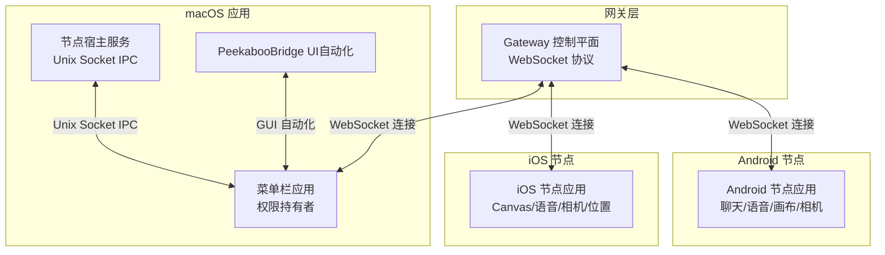
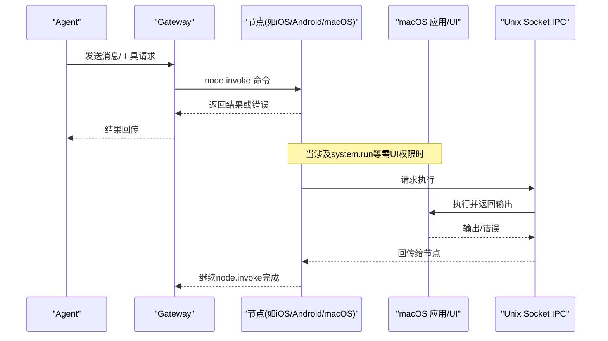
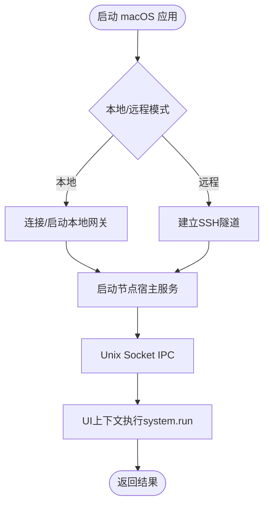
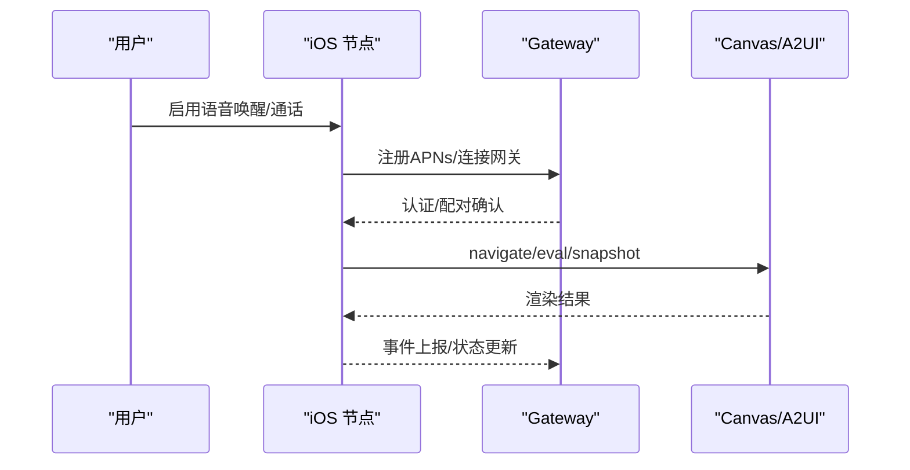
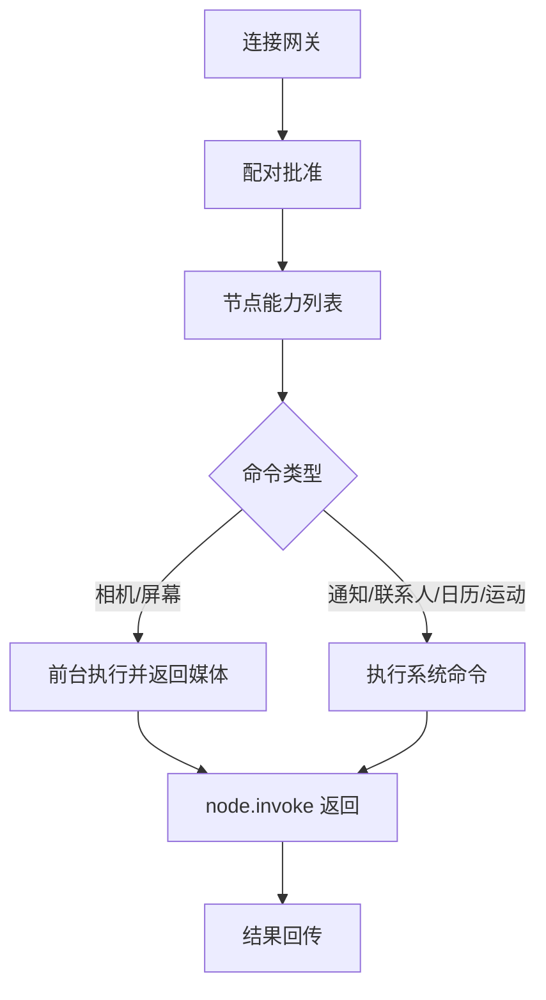
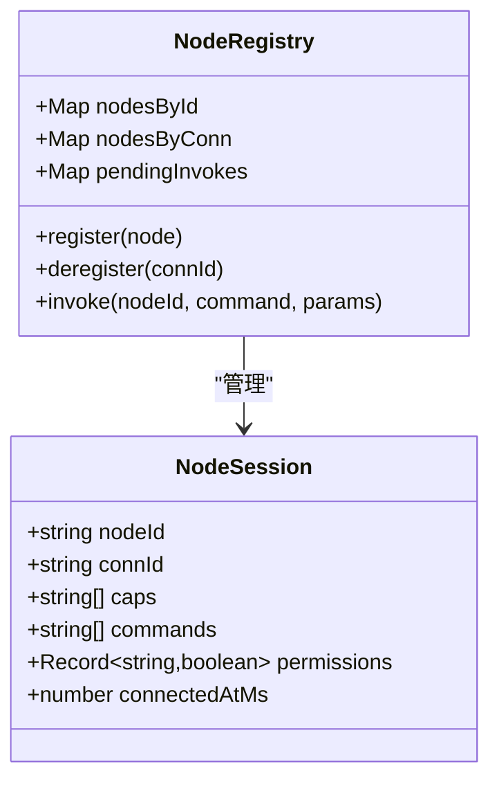
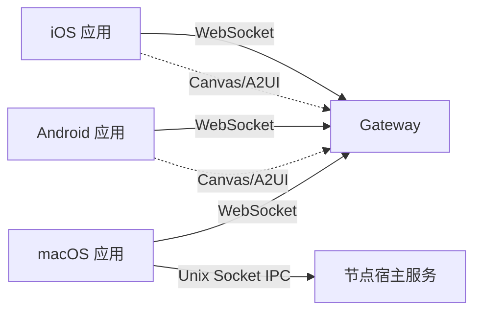

# 平台应用

<cite>
**本文引用的文件**   
- [README.md](file://README.md)
- [apps/macos/README.md](file://apps/macos/README.md)
- [apps/ios/README.md](file://apps/ios/README.md)
- [apps/android/README.md](file://apps/android/README.md)
- [apps/shared/OpenClawKit/Package.swift](file://apps/shared/OpenClawKit/Package.swift)
- [src/gateway/node-registry.ts](file://src/gateway/node-registry.ts)
- [src/gateway/protocol/schema/types.ts](file://src/gateway/protocol/schema/types.ts)
- [src/gateway/protocol/schema/protocol-schemas.ts](file://src/gateway/protocol/schema/protocol-schemas.ts)
- [src/cli/nodes-cli/register.camera.ts](file://src/cli/nodes-cli/register.camera.ts)
- [src/agents/tools/nodes-tool.ts](file://src/agents/tools/nodes-tool.ts)
- [docs/platforms/macos.md](file://docs/platforms/macos.md)
- [docs/platforms/ios.md](file://docs/platforms/ios.md)
- [docs/platforms/android.md](file://docs/platforms/android.md)
- [docs/platforms/mac/permissions.md](file://docs/platforms/mac/permissions.md)
- [docs/platforms/mac/xpc.md](file://docs/platforms/mac/xpc.md)
- [apps/macos/Sources/OpenClaw/TalkModeRuntime.swift](file://apps/macos/Sources/OpenClaw/TalkModeRuntime.swift)
- [apps/macos/Sources/OpenClaw/VoiceWakeSettings.swift](file://apps/macos/Sources/OpenClaw/VoiceWakeSettings.swift)
- [apps/ios/Sources/Voice/VoiceTab.swift](file://apps/ios/Sources/Voice/VoiceTab.swift)
- [apps/android/app/src/main/java/ai/openclaw/app/VoiceWakeMode.kt](file://apps/android/app/src/main/java/ai/openclaw/app/VoiceWakeMode.kt)
- [apps/macos/Sources/OpenClaw/PeekabooBridgeHostCoordinator.swift](file://apps/macos/Sources/OpenClaw/PeekabooBridgeHostCoordinator.swift)
- [apps/macos/Sources/OpenClaw/GatewayEndpointStore.swift](file://apps/macos/Sources/OpenClaw/GatewayEndpointStore.swift)
- [apps/macos/Sources/OpenClaw/GatewayAutostartPolicy.swift](file://apps/macos/Sources/OpenClaw/GatewayAutostartPolicy.swift)
- [docs/nodes/camera.md](file://docs/nodes/camera.md)
- [docs/zh-CN/nodes/camera.md](file://docs/zh-CN/nodes/camera.md)
</cite>

## 目录
1. [简介](#简介)
2. [项目结构](#项目结构)
3. [核心组件](#核心组件)
4. [架构总览](#架构总览)
5. [详细组件分析](#详细组件分析)
6. [依赖关系分析](#依赖关系分析)
7. [性能考虑](#性能考虑)
8. [故障排除指南](#故障排除指南)
9. [结论](#结论)
10. [附录](#附录)

## 简介
本文件面向OpenClaw平台应用的开发者与使用者，系统化阐述macOS菜单栏控制、iOS节点的语音唤醒与通话模式、Android节点的设备控制等核心能力；给出安装配置、功能演示与故障排除方法；解释应用间通信机制、数据同步与状态管理；并提供权限配置、安全设置与性能优化建议，以及扩展与适配新平台的实践指导。

## 项目结构
OpenClaw采用“网关控制平面 + 多端节点”的架构：网关负责会话、通道、工具与事件的统一调度；macOS菜单栏应用作为本地网关代理与权限持有者；iOS/Android节点通过WebSocket连接网关，执行设备侧命令并通过node.invoke进行交互。共享库OpenClawKit在iOS/macOS之间复用协议与UI组件。

图示来源
- [docs/platforms/macos.md:66-73](file://docs/platforms/macos.md#L66-L73)
- [docs/platforms/ios.md:14-18](file://docs/platforms/ios.md#L14-L18)
- [docs/platforms/android.md:24-28](file://docs/platforms/android.md#L24-L28)
- [docs/platforms/mac/xpc.md:31-37](file://docs/platforms/mac/xpc.md#L31-L37)

章节来源
- [README.md:185-212](file://README.md#L185-L212)
- [docs/platforms/macos.md:9-25](file://docs/platforms/macos.md#L9-L25)
- [docs/platforms/ios.md:10-18](file://docs/platforms/ios.md#L10-L18)
- [docs/platforms/android.md:10-18](file://docs/platforms/android.md#L10-L18)

## 核心组件
- macOS菜单栏应用：负责权限管理、本地网关运行/连接、节点宿主服务生命周期、PeekabooBridge UI自动化、深链与远程连接（SSH隧道）。
- iOS节点：通过WebSocket连接网关，支持Canvas、语音唤醒/通话、相机/屏幕录制、位置等命令。
- Android节点：通过WebSocket连接网关，支持聊天、Canvas、相机/屏幕录制、通知/联系人/日历/运动等设备命令。
- 共享库OpenClawKit：在iOS/macOS之间共享协议、UI与资源，降低重复实现成本。
- 网关协议与节点注册：定义帧格式、节点描述与invoke流程，确保跨平台一致的调用契约。

章节来源
- [apps/macos/README.md:1-65](file://apps/macos/README.md#L1-L65)
- [apps/ios/README.md:1-178](file://apps/ios/README.md#L1-L178)
- [apps/android/README.md:1-229](file://apps/android/README.md#L1-L229)
- [apps/shared/OpenClawKit/Package.swift:1-62](file://apps/shared/OpenClawKit/Package.swift#L1-L62)
- [src/gateway/node-registry.ts:1-41](file://src/gateway/node-registry.ts#L1-L41)
- [src/gateway/protocol/schema/types.ts:1-30](file://src/gateway/protocol/schema/types.ts#L1-L30)
- [src/gateway/protocol/schema/protocol-schemas.ts:162-194](file://src/gateway/protocol/schema/protocol-schemas.ts#L162-L194)

## 架构总览
OpenClaw平台围绕“网关控制平面 + 多端节点 + 权限与IPC”展开。macOS应用在本地运行时可作为网关代理与权限持有者；节点通过WebSocket接入网关，节点能力通过node.invoke暴露；macOS应用与节点宿主通过Unix Socket进行轻量级IPC，用于system.run等需要UI上下文的敏感操作。

图示来源
- [docs/platforms/macos.md:61-73](file://docs/platforms/macos.md#L61-L73)
- [docs/platforms/mac/xpc.md:18-37](file://docs/platforms/mac/xpc.md#L18-L37)
- [src/gateway/node-registry.ts:38-41](file://src/gateway/node-registry.ts#L38-L41)

章节来源
- [docs/platforms/macos.md:9-25](file://docs/platforms/macos.md#L9-L25)
- [docs/platforms/mac/xpc.md:8-16](file://docs/platforms/mac/xpc.md#L8-L16)

## 详细组件分析

### macOS 菜单栏控制与权限
- 权限持久化：macOS权限与签名、Bundle ID、路径强绑定，需使用正式签名并固定路径以保持TCC授权稳定。
- 本地/远程模式：本地模式优先连接已有本地网关，否则通过launchd启动；远程模式通过SSH隧道连接远端网关，并在本地启动节点宿主服务以便网关访问。
- IPC与UI自动化：节点宿主通过Unix Socket与macOS应用通信，执行system.run等需要UI上下文的任务；PeekabooBridge用于GUI自动化。
- 深链接与远程连接：支持openclaw://协议触发Agent请求；远程模式下通过SSH隧道将远端网关端口映射到本地。

图示来源
- [docs/platforms/macos.md:26-33](file://docs/platforms/macos.md#L26-L33)
- [docs/platforms/macos.md:200-219](file://docs/platforms/macos.md#L200-L219)
- [docs/platforms/mac/xpc.md:18-37](file://docs/platforms/mac/xpc.md#L18-L37)
- [apps/macos/Sources/OpenClaw/PeekabooBridgeHostCoordinator.swift:40-72](file://apps/macos/Sources/OpenClaw/PeekabooBridgeHostCoordinator.swift#L40-L72)
- [apps/macos/Sources/OpenClaw/GatewayEndpointStore.swift:43-68](file://apps/macos/Sources/OpenClaw/GatewayEndpointStore.swift#L43-L68)
- [apps/macos/Sources/OpenClaw/GatewayAutostartPolicy.swift:1-14](file://apps/macos/Sources/OpenClaw/GatewayAutostartPolicy.swift#L1-L14)

章节来源
- [docs/platforms/mac/permissions.md:10-26](file://docs/platforms/mac/permissions.md#L10-L26)
- [apps/macos/README.md:25-65](file://apps/macos/README.md#L25-L65)
- [docs/platforms/macos.md:112-138](file://docs/platforms/macos.md#L112-L138)

### iOS 节点：语音唤醒与通话模式
- 语音功能：支持语音唤醒与通话模式开关，状态在应用内展示；前台运行时更可靠。
- Canvas/A2UI：节点内置WKWebView渲染Canvas/A2UI，可通过node.invoke导航、评估与截图。
- 连接与配对：通过Bonjour/Tailscale或手动主机端口连接网关；首次配对需在网关批准。

图示来源
- [apps/ios/README.md:89-104](file://apps/ios/README.md#L89-L104)
- [apps/ios/README.md:137-145](file://apps/ios/README.md#L137-L145)
- [apps/ios/Sources/Voice/VoiceTab.swift:1-19](file://apps/ios/Sources/Voice/VoiceTab.swift#L1-L19)
- [docs/platforms/ios.md:67-91](file://docs/platforms/ios.md#L67-L91)

章节来源
- [apps/ios/README.md:98-104](file://apps/ios/README.md#L98-L104)
- [apps/ios/README.md:156-178](file://apps/ios/README.md#L156-L178)
- [apps/ios/Sources/Voice/VoiceTab.swift:1-19](file://apps/ios/Sources/Voice/VoiceTab.swift#L1-L19)
- [docs/platforms/ios.md:92-96](file://docs/platforms/ios.md#L92-L96)

### Android 节点：设备控制与命令面
- 连接与配对：通过mDNS/NSD或手动主机端口连接网关；首次配对需在网关批准。
- 设备命令：支持通知列表/动作、联系人搜索/添加、日历事件/新增、运动活动/计步器等；相机/屏幕录制等需要前台与权限。
- 聊天与历史：支持会话选择、历史拉取、推送更新；Canvas/A2UI通过网关HTTP端口加载。

图示来源
- [apps/android/README.md:143-163](file://apps/android/README.md#L143-L163)
- [docs/platforms/android.md:121-165](file://docs/platforms/android.md#L121-L165)
- [src/agents/tools/nodes-tool.ts:483-577](file://src/agents/tools/nodes-tool.ts#L483-L577)
- [src/cli/nodes-cli/register.camera.ts:126-262](file://src/cli/nodes-cli/register.camera.ts#L126-L262)

章节来源
- [apps/android/README.md:165-170](file://apps/android/README.md#L165-L170)
- [apps/android/README.md:175-224](file://apps/android/README.md#L175-L224)
- [docs/platforms/android.md:142-165](file://docs/platforms/android.md#L142-L165)
- [docs/nodes/camera.md:27-81](file://docs/nodes/camera.md#L27-L81)
- [docs/zh-CN/nodes/camera.md:127-163](file://docs/zh-CN/nodes/camera.md#L127-L163)

### 共享库 OpenClawKit
- iOS/macOS共享协议与UI：通过OpenClawProtocol、OpenClawKit与OpenClawChatUI在两端复用；ElevenLabsKit用于TTS，Textual用于文本渲染。
- Swift并发特性：启用StrictConcurrency，保证线程安全。

章节来源
- [apps/shared/OpenClawKit/Package.swift:1-62](file://apps/shared/OpenClawKit/Package.swift#L1-L62)

### 网关协议与节点注册
- 协议类型：定义ConnectParams、HelloOk、Request/Response/EventFrame、AgentEvent、NodePair/NodeList/NodeInvoke等类型，确保跨端一致性。
- 节点注册：维护节点会话、命令列表、权限映射与待处理invoke队列，支持超时与结果回调。

图示来源
- [src/gateway/node-registry.ts:4-41](file://src/gateway/node-registry.ts#L4-L41)
- [src/gateway/protocol/schema/types.ts:7-30](file://src/gateway/protocol/schema/types.ts#L7-L30)
- [src/gateway/protocol/schema/protocol-schemas.ts:162-194](file://src/gateway/protocol/schema/protocol-schemas.ts#L162-L194)

章节来源
- [src/gateway/node-registry.ts:1-41](file://src/gateway/node-registry.ts#L1-L41)
- [src/gateway/protocol/schema/types.ts:1-30](file://src/gateway/protocol/schema/types.ts#L1-L30)
- [src/gateway/protocol/schema/protocol-schemas.ts:162-194](file://src/gateway/protocol/schema/protocol-schemas.ts#L162-L194)

## 依赖关系分析
- 平台依赖：iOS使用ElevenLabsKit进行TTS；macOS应用依赖AVFoundation/Speech进行语音唤醒与通话；Android使用系统相机/通知/日历等API。
- IPC与网络：macOS应用与节点宿主通过Unix Socket通信；iOS/Android通过WebSocket与网关通信；macOS在远程模式下通过SSH隧道转发端口。
- 协议一致性：OpenClawKit在iOS/macOS共享协议定义，确保跨端调用契约一致。

图示来源
- [apps/shared/OpenClawKit/Package.swift:16-32](file://apps/shared/OpenClawKit/Package.swift#L16-L32)
- [docs/platforms/macos.md:61-73](file://docs/platforms/macos.md#L61-L73)
- [docs/platforms/ios.md:14-18](file://docs/platforms/ios.md#L14-L18)
- [docs/platforms/android.md:24-28](file://docs/platforms/android.md#L24-L28)

章节来源
- [apps/shared/OpenClawKit/Package.swift:16-32](file://apps/shared/OpenClawKit/Package.swift#L16-L32)
- [docs/platforms/macos.md:61-73](file://docs/platforms/macos.md#L61-L73)
- [docs/platforms/ios.md:14-18](file://docs/platforms/ios.md#L14-L18)
- [docs/platforms/android.md:24-28](file://docs/platforms/android.md#L24-L28)

## 性能考虑
- 启动与热区：Android提供冷启动宏基准与热点提取脚本，便于定位启动慢点；iOS/Android均强调前台运行对语音/相机/屏幕录制等命令的重要性。
- 语音与音频：iOS/Android的语音唤醒与通话模式在后台可能受限；macOS的Talk Mode需要合适的麦克风与音频引擎配置。
- 网络与重连：iOS在后台存在死连接风险，需优化唤醒与重连策略；Android通过前台服务维持连接稳定性。
- 资源占用：iOS位置自动化测试强调热耗与电池影响，应避免持续高负载。

章节来源
- [apps/android/README.md:59-92](file://apps/android/README.md#L59-L92)
- [apps/ios/README.md:137-145](file://apps/ios/README.md#L137-L145)
- [apps/macos/Sources/OpenClaw/TalkModeRuntime.swift:79-219](file://apps/macos/Sources/OpenClaw/TalkModeRuntime.swift#L79-L219)

## 故障排除指南
- macOS权限问题：若权限提示消失或失效，按要求清理TCC并从同一路径重新授予权限；使用正式签名与固定路径以保持授权稳定。
- iOS连接与配对：若未出现配对提示，先在网关查看设备列表并批准；若后台无法使用Canvas/相机/屏幕命令，需前台运行。
- Android连接与命令：若配对失败，先在网关批准最新请求；若A2UI不可达，确保网关Canvas主机可用且应用保持前台；若命令返回“后台不可用”，请前台运行。
- 网络与发现：若Bonjour/Tailscale不可用，使用手动主机端口；检查SSH隧道是否正确建立（macOS远程模式）。

章节来源
- [docs/platforms/mac/permissions.md:27-33](file://docs/platforms/mac/permissions.md#L27-L33)
- [apps/ios/README.md:137-145](file://apps/ios/README.md#L137-L145)
- [apps/android/README.md:216-224](file://apps/android/README.md#L216-L224)
- [docs/platforms/macos.md:200-219](file://docs/platforms/macos.md#L200-L219)

## 结论
OpenClaw平台通过统一的网关协议与多端节点，实现了从macOS菜单栏到iOS/Android设备的完整控制闭环。macOS应用承担权限与本地网关职责，iOS/Android节点提供丰富的设备能力；借助Unix Socket IPC与WebSocket协议，系统在安全与性能之间取得平衡。遵循本文的安装配置、功能演示、故障排除与安全建议，可高效构建与运维OpenClaw生态。

## 附录

### 安装与配置速查
- macOS：使用打包脚本生成并签名应用；本地/远程模式切换由应用自动处理；必要时通过launchd管理网关。
- iOS：使用Xcode与xcodegen生成工程；本地/测试版发布流程包含签名与Fastlane上传；前台运行以确保语音/Canvas等功能正常。
- Android：在Android Studio中打开apps/android目录；支持USB调试与adb reverse进行无局域网测试；首次配对需在网关批准。

章节来源
- [apps/macos/README.md:17-23](file://apps/macos/README.md#L17-L23)
- [apps/ios/README.md:18-48](file://apps/ios/README.md#L18-L48)
- [apps/android/README.md:22-33](file://apps/android/README.md#L22-L33)

### 功能演示要点
- macOS：菜单栏显示状态、权限提示、本地/远程连接、PeekabooBridge自动化；深链触发Agent请求。
- iOS：语音唤醒/通话状态展示、Canvas导航/评估/截图；通过网关节点命令驱动Canvas。
- Android：聊天历史与推送、Canvas/A2UI、相机/屏幕录制、通知/联系人/日历/运动等命令。

章节来源
- [docs/platforms/macos.md:11-25](file://docs/platforms/macos.md#L11-L25)
- [apps/ios/Sources/Voice/VoiceTab.swift:1-19](file://apps/ios/Sources/Voice/VoiceTab.swift#L1-L19)
- [docs/platforms/android.md:113-165](file://docs/platforms/android.md#L113-L165)

### 语音唤醒与通话模式（跨平台对比）
- macOS：Talk Mode运行时管理音频引擎与静音监控；Voice Wake设置界面展示状态与设备列表。
- iOS：语音标签页展示唤醒与监听状态；前台运行时更稳定。
- Android：语音开关在语音标签页；前台运行时支持转录与TTS播放。

章节来源
- [apps/macos/Sources/OpenClaw/TalkModeRuntime.swift:79-219](file://apps/macos/Sources/OpenClaw/TalkModeRuntime.swift#L79-L219)
- [apps/macos/Sources/OpenClaw/VoiceWakeSettings.swift:1-44](file://apps/macos/Sources/OpenClaw/VoiceWakeSettings.swift#L1-L44)
- [apps/ios/Sources/Voice/VoiceTab.swift:1-19](file://apps/ios/Sources/Voice/VoiceTab.swift#L1-L19)
- [apps/android/app/src/main/java/ai/openclaw/app/VoiceWakeMode.kt:1-14](file://apps/android/app/src/main/java/ai/openclaw/app/VoiceWakeMode.kt#L1-L14)

### 相机与屏幕录制（跨平台命令）
- iOS/Android：相机快照/视频录制受前台限制；参数包括朝向、时长、质量、是否包含音频等；payload大小有限制。
- macOS：相机快照支持延迟与曝光稳定；屏幕录制需屏幕录制权限。

章节来源
- [docs/nodes/camera.md:27-81](file://docs/nodes/camera.md#L27-L81)
- [docs/zh-CN/nodes/camera.md:127-163](file://docs/zh-CN/nodes/camera.md#L127-L163)
- [src/cli/nodes-cli/register.camera.ts:126-262](file://src/cli/nodes-cli/register.camera.ts#L126-L262)
- [src/agents/tools/nodes-tool.ts:483-577](file://src/agents/tools/nodes-tool.ts#L483-L577)