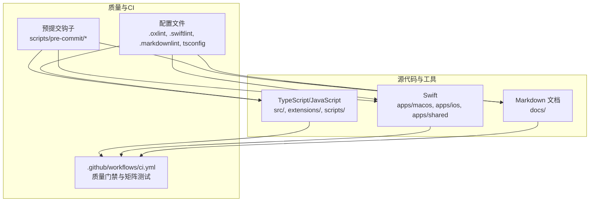
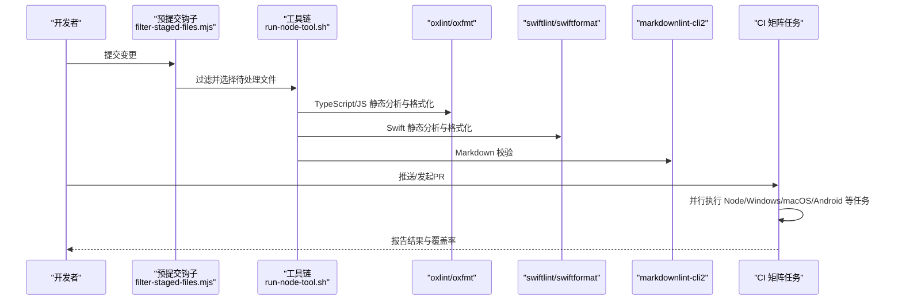
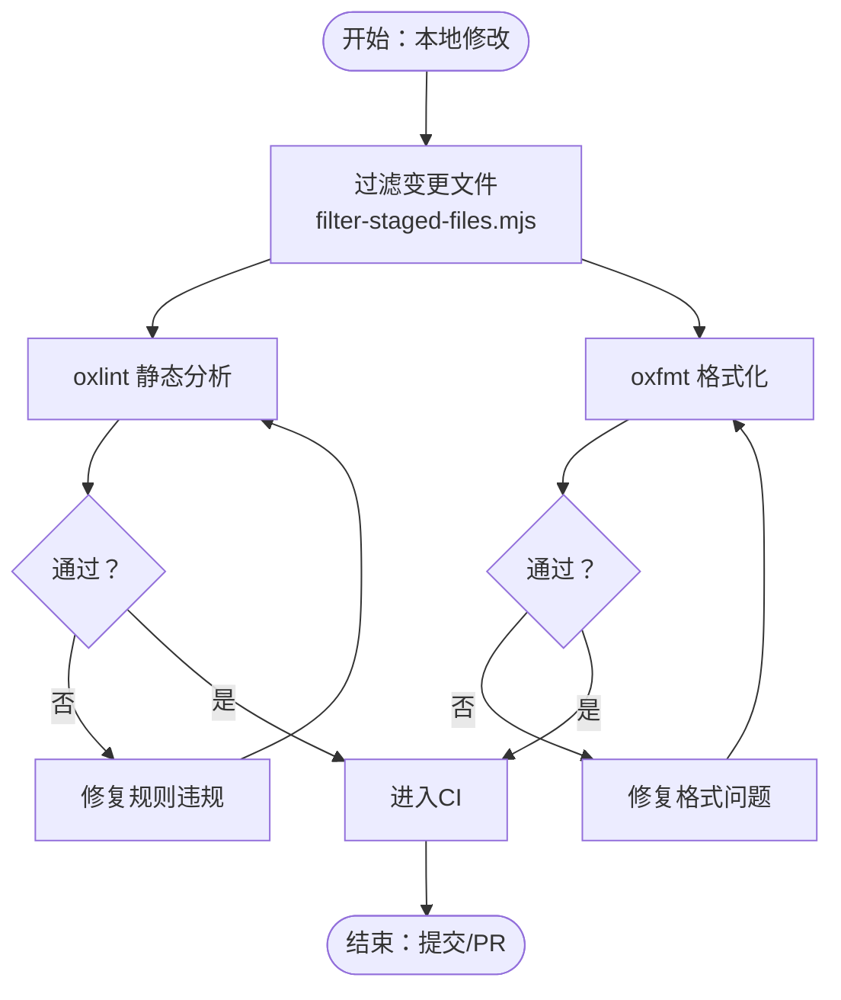
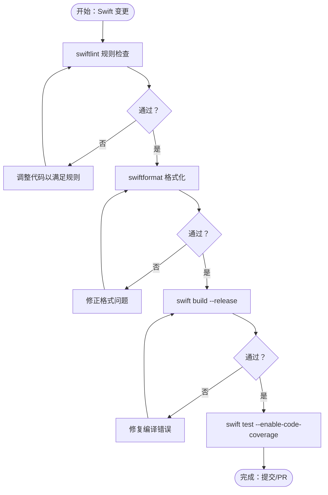

# 代码规范与质量

<cite>
**本文引用的文件**
- [README.md](file://README.md)
- [CONTRIBUTING.md](file://CONTRIBUTING.md)
- [.github/workflows/ci.yml](file://.github/workflows/ci.yml)
- [.github/pull_request_template.md](file://.github/pull_request_template.md)
- [.github/actionlint.yaml](file://.github/actionlint.yaml)
- [.github/dependabot.yml](file://.github/dependabot.yml)
- [.github/labeler.yml](file://.github/labeler.yml)
- [.markdownlint-cli2.jsonc](file://.markdownlint-cli2.jsonc)
- [.oxlintrc.json](file://.oxlintrc.json)
- [.oxfmtrc.jsonc](file://.oxfmtrc.jsonc)
- [.swiftlint.yml](file://.swiftlint.yml)
- [.swiftformat](file://.swiftformat)
- [package.json](file://package.json)
- [tsconfig.json](file://tsconfig.json)
- [scripts/pre-commit/run-node-tool.sh](file://scripts/pre-commit/run-node-tool.sh)
- [scripts/pre-commit/filter-staged-files.mjs](file://scripts/pre-commit/filter-staged-files.mjs)
</cite>

## 目录
1. [简介](#简介)
2. [项目结构](#项目结构)
3. [核心组件](#核心组件)
4. [架构总览](#架构总览)
5. [详细组件分析](#详细组件分析)
6. [依赖分析](#依赖分析)
7. [性能考虑](#性能考虑)
8. [故障排查指南](#故障排查指南)
9. [结论](#结论)
10. [附录](#附录)

## 简介
本指南面向OpenClaw项目的贡献者与维护者，系统阐述代码规范与质量标准，覆盖以下方面：
- TypeScript/JavaScript 编码规范与格式化
- Swift 代码风格与格式化
- Markdown 文档格式与校验
- Git 提交信息规范、分支命名约定与 PR 模板要求
- 代码审查标准、静态分析规则与质量门禁
- 代码重构指导、性能优化建议与安全编码实践
- 自动化质量检查工具的配置与使用方法

OpenClaw是一个多通道AI网关，支持多种平台与渠道集成，因此对代码质量、可维护性与安全性有严格要求。本指南基于仓库现有配置与工作流进行总结，并提供落地的执行步骤与可视化图示。

## 项目结构
OpenClaw采用多语言混合工程：TypeScript/JavaScript作为核心运行时与CLI，Swift用于macOS/iOS应用与工具链，Markdown文档广泛分布于docs目录。CI通过GitHub Actions实现跨平台质量门禁，预提交钩子与本地脚本确保一致性。

图表来源
- [.github/workflows/ci.yml:1-737](file://.github/workflows/ci.yml#L1-L737)
- [scripts/pre-commit/run-node-tool.sh:1-32](file://scripts/pre-commit/run-node-tool.sh#L1-L32)
- [scripts/pre-commit/filter-staged-files.mjs:1-40](file://scripts/pre-commit/filter-staged-files.mjs#L1-L40)
- [.oxlintrc.json:1-40](file://.oxlintrc.json#L1-L40)
- [.swiftlint.yml:1-151](file://.swiftlint.yml#L1-L151)
- [.markdownlint-cli2.jsonc:1-53](file://.markdownlint-cli2.jsonc#L1-L53)
- [tsconfig.json:1-29](file://tsconfig.json#L1-L29)

章节来源
- [.github/workflows/ci.yml:1-737](file://.github/workflows/ci.yml#L1-L737)
- [package.json:217-339](file://package.json#L217-L339)

## 核心组件
- 质量门禁与CI：通过GitHub Actions在PR与push上执行类型检查、单元测试、扩展测试、协议生成校验、文档校验、Python技能脚本检查、密钥与工作流审计等。
- 静态分析与格式化：
  - TypeScript/JavaScript：oxlint（oxc/unicorn/typescript插件）、oxfmt（导入排序、包管理脚本排序、缩进宽度等）
  - Swift：swiftlint（规则集与阈值）、swiftformat（缩进、换行、空格、组织结构）
  - Markdown：markdownlint-cli2（忽略规则、允许元素白名单）
- 预提交工具链：统一在本地通过run-node-tool.sh解析pnpm/bun/npm/npx，结合filter-staged-files.mjs按扩展名筛选待处理文件。
- 构建与脚本：package.json中定义了check、lint、format、test、protocol:check等命令，配合CI矩阵并行执行。

章节来源
- [package.json:217-339](file://package.json#L217-L339)
- [.oxlintrc.json:1-40](file://.oxlintrc.json#L1-L40)
- [.oxfmtrc.jsonc:1-27](file://.oxfmtrc.jsonc#L1-L27)
- [.swiftlint.yml:1-151](file://.swiftlint.yml#L1-L151)
- [.swiftformat:1-52](file://.swiftformat#L1-L52)
- [.markdownlint-cli2.jsonc:1-53](file://.markdownlint-cli2.jsonc#L1-L53)
- [scripts/pre-commit/run-node-tool.sh:1-32](file://scripts/pre-commit/run-node-tool.sh#L1-L32)
- [scripts/pre-commit/filter-staged-files.mjs:1-40](file://scripts/pre-commit/filter-staged-files.mjs#L1-L40)

## 架构总览
下图展示从开发者提交到CI质量门禁的关键流程，包括本地预提交与CI并行矩阵测试。

图表来源
- [scripts/pre-commit/filter-staged-files.mjs:1-40](file://scripts/pre-commit/filter-staged-files.mjs#L1-L40)
- [scripts/pre-commit/run-node-tool.sh:1-32](file://scripts/pre-commit/run-node-tool.sh#L1-L32)
- [.github/workflows/ci.yml:1-737](file://.github/workflows/ci.yml#L1-L737)

章节来源
- [.github/workflows/ci.yml:1-737](file://.github/workflows/ci.yml#L1-L737)

## 详细组件分析

### TypeScript/JavaScript 编码规范与格式化
- 静态分析
  - 使用 oxlint（oxc/unicorn/typescript 插件），分类规则：
    - correctness/perf/suspicious 类别均设为 error，确保语义正确性与性能问题尽早暴露
    - 关闭若干规则以平衡团队偏好与历史代码（如 no-new、no-shadow、map-spread 等）
  - 命令入口：package.json 中的 lint 与 check 脚本
- 格式化
  - 使用 oxfmt，支持导入排序、package.json 脚本排序、缩进宽度等
  - 配置忽略模式覆盖第三方目录、构建产物与特定模板文件
- 项目编译配置
  - tsconfig 启用严格模式、实验装饰器、useDefineForClassFields=false，路径映射至 plugin-sdk
- 本地执行
  - 通过 run-node-tool.sh 统一解析 pnpm/bun/npm/npx，保证不同环境一致的工具链调用

图表来源
- [scripts/pre-commit/filter-staged-files.mjs:1-40](file://scripts/pre-commit/filter-staged-files.mjs#L1-L40)
- [.oxlintrc.json:1-40](file://.oxlintrc.json#L1-L40)
- [.oxfmtrc.jsonc:1-27](file://.oxfmtrc.jsonc#L1-L27)
- [scripts/pre-commit/run-node-tool.sh:1-32](file://scripts/pre-commit/run-node-tool.sh#L1-L32)

章节来源
- [.oxlintrc.json:1-40](file://.oxlintrc.json#L1-L40)
- [.oxfmtrc.jsonc:1-27](file://.oxfmtrc.jsonc#L1-L27)
- [tsconfig.json:1-29](file://tsconfig.json#L1-L29)
- [package.json:217-339](file://package.json#L217-L339)
- [scripts/pre-commit/run-node-tool.sh:1-32](file://scripts/pre-commit/run-node-tool.sh#L1-L32)
- [scripts/pre-commit/filter-staged-files.mjs:1-40](file://scripts/pre-commit/filter-staged-files.mjs#L1-L40)

### Swift 代码风格与格式化
- 规则与阈值
  - analyzer_rules：未使用声明/导入
  - opt_in_rules：数组初始化、闭包间距、first_not_nil、switch对齐、嵌套参数等
  - 禁用规则：由 SwiftFormat 处理的空白类规则（如尾随空格、换行、逗号、缩进等）
  - 关键阈值：函数体长度、参数数量、文件长度、类型体长度、环复杂度、元组大小、嵌套层级、行长等
- 格式化
  - swiftformat：缩进4空格、LF换行、最大行长120、trim whitespace、import分组、组织结构等
  - 配置排除：构建产物、DerivedData、node_modules、dist、coverage、特定生成文件等
- 工具链
  - CI 中 macOS 作业顺序执行：TS 测试、Xcode/Swift 工具安装、swiftlint、swiftformat、swift build、swift test（含覆盖率）

图表来源
- [.swiftlint.yml:1-151](file://.swiftlint.yml#L1-L151)
- [.swiftformat:1-52](file://.swiftformat#L1-L52)
- [.github/workflows/ci.yml:458-530](file://.github/workflows/ci.yml#L458-L530)

章节来源
- [.swiftlint.yml:1-151](file://.swiftlint.yml#L1-L151)
- [.swiftformat:1-52](file://.swiftformat#L1-L52)
- [.github/workflows/ci.yml:458-530](file://.github/workflows/ci.yml#L458-L530)

### Markdown 格式与校验
- 配置范围
  - glob 匹配 docs/**/*.md、docs/**/*.mdx、README.md
  - 忽略 zh-CN、.i18n、reference/templates 与 .local 目录
- 规则策略
  - 默认启用，关闭若干规则（如行长、二级标题、列表序号、内联代码语言、首行标题、代码块语言缺失、代码块对齐等）
  - 允许元素白名单：Note/Info/Tip/Warning/Card/Columns/Steps/Tabs/Accordion/CodeGroup/Callout/Tooltip/Check 等
- 本地执行
  - 通过 package.json 的 lint:docs 与 format:docs:check 实现

章节来源
- [.markdownlint-cli2.jsonc:1-53](file://.markdownlint-cli2.jsonc#L1-L53)
- [package.json:277-278](file://package.json#L277-L278)

### Git 提交信息规范、分支命名约定与 PR 模板
- 提交信息
  - 仓库未内置提交信息规范（如 Conventional Commits）。建议在团队内约定“类型(scope): 概要”格式，配合 CI 的提交审核工具（如 actionlint）进行约束。
- 分支命名
  - 仓库未定义分支命名约定。建议采用 feature/xxx、bugfix/xxx、chore/xxx、docs/xxx 等前缀，便于自动化标签与发布。
- PR 模板
  - PR 模板包含摘要、变更类型、作用域、关联问题/PR、用户可见行为变更、安全影响、复现与验证、证据、人工验证、审查对话、兼容性迁移、故障恢复、风险与缓解等字段，有助于标准化审查流程与可追溯性。

章节来源
- [.github/pull_request_template.md:1-116](file://.github/pull_request_template.md#L1-L116)

### 代码审查标准、静态分析规则与质量门禁
- 审查标准
  - PR 必须描述“做了什么/为什么”，聚焦单一目标；需包含截图（UI/视觉变更）；作者负责处理或回复所有机器人审查对话；AI 辅助 PR 需标注并自行处理审查意见。
- 静态分析与质量门禁
  - CI 门禁包括：check（类型与lint/format）、docs 检查、Node/Windows/macOS/Android 矩阵测试、Python 技能脚本检查、密钥检测、工作流审计、生产依赖审计、协议生成一致性校验等。
  - macOS 作业顺序：TS 测试 → Xcode/Swift 工具 → swiftlint/swiftformat → swift build → swift test（含覆盖率）。
  - Windows 作业采用分片并限制并发，避免 Defender 干扰。
  - 文档仅在变更时检查，减少不必要开销。

章节来源
- [CONTRIBUTING.md:85-106](file://CONTRIBUTING.md#L85-L106)
- [.github/workflows/ci.yml:1-737](file://.github/workflows/ci.yml#L1-L737)

### 代码重构指导、性能优化建议与安全编码实践
- 重构指导
  - 优先消除重复代码（jscpd），定期清理死代码（knip/ts-prune/ts-unused exports），保持模块边界清晰。
  - 遵循 tsconfig 严格模式与路径映射，避免隐式any与不安全类型断言。
- 性能优化
  - CI 中提供性能热点与预算检查脚本；关注函数体长度、参数数量、环复杂度、嵌套层级与行长阈值，避免过度复杂逻辑。
  - Swift 侧关注 build/test 重试机制与覆盖率门限（如 iOS 目标覆盖率不低于43%）。
- 安全编码
  - 严格控制外部URL打开策略（UI相关禁止原始window.open）；禁止在网关层直接读取低级请求体；禁止在配对存储中使用组权限；确保主机环境安全策略生成与校验。
  - 依赖审计与私钥检测：CI 中执行 pnpm audit prod 与 detect-private-key；工作流变更通过 zizmor 审计。

章节来源
- [package.json:234-242](file://package.json#L234-L242)
- [package.json:250-251](file://package.json#L250-L251)
- [package.json:273-287](file://package.json#L273-L287)
- [.github/workflows/ci.yml:262-325](file://.github/workflows/ci.yml#L262-L325)

### 自动化质量检查工具的配置与使用
- 统一工具调用
  - run-node-tool.sh：自动探测 pnpm/bun/npm/npx 并执行工具，确保跨环境一致性。
- 文件筛选
  - filter-staged-files.mjs：按扩展名筛选待处理文件（lint/format），降低预提交成本。
- 命令速查
  - TypeScript/JS：pnpm lint、pnpm check、pnpm format、pnpm lint:fix
  - Swift：pnpm lint:swift、pnpm format:swift
  - Markdown：pnpm lint:docs、pnpm format:docs:check
  - 协议：pnpm protocol:check、pnpm protocol:gen、pnpm protocol:gen:swift
  - 文档：pnpm check:docs、pnpm docs:check-links、pnpm docs:spellcheck
  - 死代码：pnpm deadcode:knip/ts-prune/ts-unused
  - 重复代码：pnpm dup:check/json

章节来源
- [scripts/pre-commit/run-node-tool.sh:1-32](file://scripts/pre-commit/run-node-tool.sh#L1-L32)
- [scripts/pre-commit/filter-staged-files.mjs:1-40](file://scripts/pre-commit/filter-staged-files.mjs#L1-L40)
- [package.json:217-339](file://package.json#L217-L339)

## 依赖分析
- 依赖更新策略
  - Dependabot：每日扫描 npm、GitHub Actions、Swift（macOS app、shared MoltbotKit、Swabble）、Gradle（Android app）、Docker 基础镜像；分组与冷却期控制 PR 数量。
- 依赖审计
  - CI 中执行 pnpm audit prod，防止引入高危依赖。
- 工作流审计
  - 使用 zizmor 对变更的工作流进行安全审计，规避潜在风险。

章节来源
- [.github/dependabot.yml:1-128](file://.github/dependabot.yml#L1-L128)
- [.github/workflows/ci.yml:308-325](file://.github/workflows/ci.yml#L308-L325)

## 性能考虑
- 代码复杂度与可维护性
  - 通过 Swiftlint 的函数体长度、参数数量、文件长度、类型体长度、环复杂度、元组大小、嵌套层级、行长阈值，控制单文件与函数规模。
- 测试并行与资源
  - Windows 作业采用分片与限制并发，避免内存与进程竞争；Node 作业设置最大旧空间大小与并行工人数，减少CI OOM。
- 构建与打包
  - CI 中 macOS 作业顺序执行，先 TS 再 Swift，减少资源争用；Swift build/test 带重试机制，提升稳定性。

章节来源
- [.swiftlint.yml:111-148](file://.swiftlint.yml#L111-L148)
- [.github/workflows/ci.yml:329-453](file://.github/workflows/ci.yml#L329-L453)

## 故障排查指南
- 预提交失败
  - 检查 filter-staged-files.mjs 是否正确筛选文件；确认 run-node-tool.sh 能找到 pnpm/bun/npm/npx；针对 oxlint/swiftlint/swiftformat 的报错逐条修复。
- CI 失败
  - 查看对应作业日志：Node/Windows/macOS/Android 矩阵任务；关注 docs-only 检测是否误判；确认协议生成一致性与覆盖率门限。
- 密钥与工作流审计
  - 若密钥检测或 zizmor 审计失败，检查最近工作流变更与依赖版本；确保凭据令牌正确配置。
- 文档链接与拼写
  - 使用 docs:check-links 与 docs:spellcheck 进行离线校验与修复。

章节来源
- [.github/workflows/ci.yml:1-737](file://.github/workflows/ci.yml#L1-L737)
- [package.json:244-249](file://package.json#L244-L249)
- [package.json:277-278](file://package.json#L277-L278)

## 结论
OpenClaw已建立完善的多语言质量体系：TypeScript/JavaScript 通过 oxlint/oxfmt 保障静态质量与格式一致性；Swift 通过 swiftlint/swiftformat 与CI门禁确保风格与编译稳定性；Markdown 通过 markdownlint-cli2 保证文档一致性。配合 CI 矩阵测试、依赖更新与审计、预提交钩子与统一工具链，形成从本地到远端的闭环质量保障。建议团队进一步完善提交信息规范与分支命名约定，以增强可追溯性与自动化能力。

## 附录
- 常用命令清单（来自 package.json）
  - TypeScript/JS：lint、check、format、lint:fix、lint:docs、format:docs:check
  - Swift：lint:swift、format:swift
  - 协议：protocol:check、protocol:gen、protocol:gen:swift
  - 文档：check:docs、docs:check-links、docs:spellcheck、docs:spellcheck:fix
  - 死代码：deadcode:knip/ts-prune/ts-unused
  - 重复代码：dup:check/json
- CI 作业概览（来自 .github/workflows/ci.yml）
  - docs-scope、changed-scope、build-artifacts、release-check、checks、check、check-docs、skills-python、secrets、checks-windows、macOS、iOS（当前禁用）、Android

章节来源
- [package.json:217-339](file://package.json#L217-L339)
- [.github/workflows/ci.yml:1-737](file://.github/workflows/ci.yml#L1-L737)