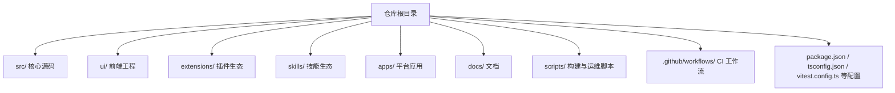
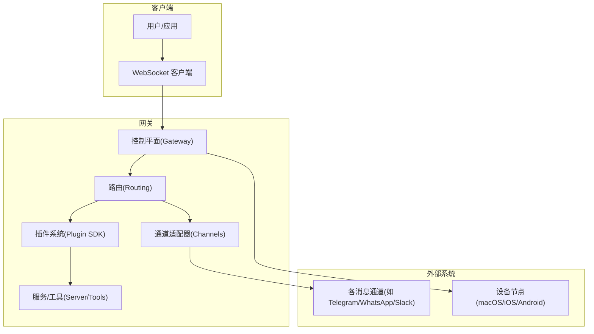
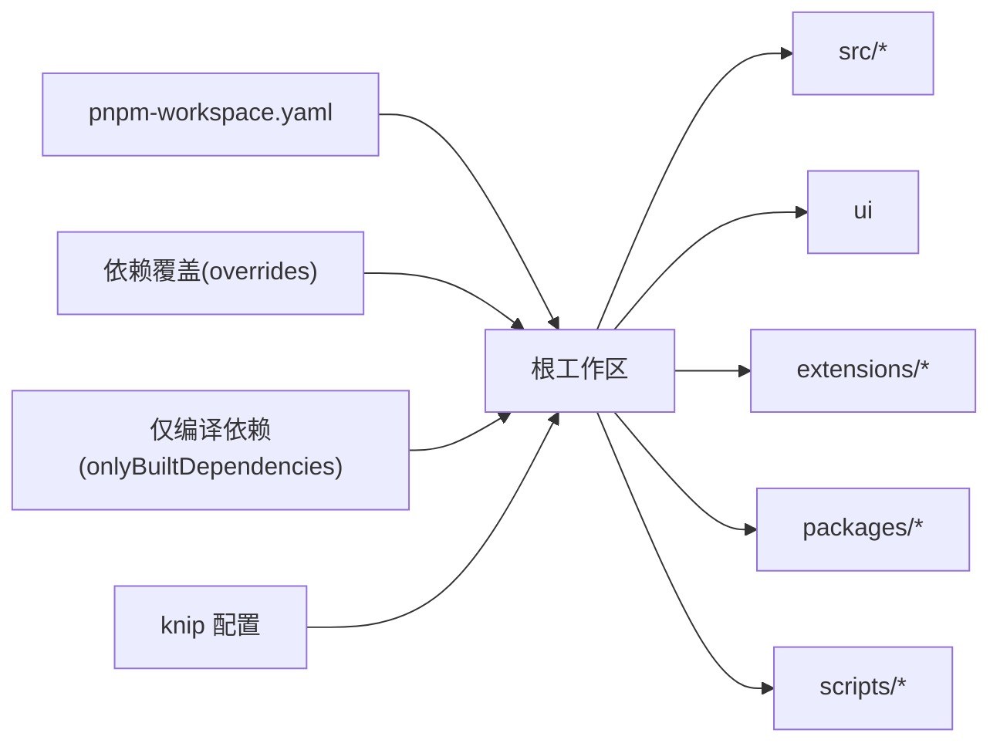

# 开发指南

<cite>
**本文引用的文件**
- [CONTRIBUTING.md](file://CONTRIBUTING.md)
- [README.md](file://README.md)
- [package.json](file://package.json)
- [tsconfig.json](file://tsconfig.json)
- [vitest.config.ts](file://vitest.config.ts)
- [.github/workflows/ci.yml](file://.github/workflows/ci.yml)
- [pnpm-workspace.yaml](file://pnpm-workspace.yaml)
- [knip.config.ts](file://knip.config.ts)
- [.swiftlint.yml](file://.swiftlint.yml)
- [.swiftformat](file://.swiftformat)
- [.markdownlint-cli2.jsonc](file://.markdownlint-cli2.jsonc)
</cite>

## 目录
1. [简介](#简介)
2. [项目结构](#项目结构)
3. [核心组件](#核心组件)
4. [架构总览](#架构总览)
5. [详细组件分析](#详细组件分析)
6. [依赖关系分析](#依赖关系分析)
7. [性能考量](#性能考量)
8. [故障排查指南](#故障排查指南)
9. [结论](#结论)
10. [附录](#附录)

## 简介
本开发指南面向希望参与 OpenClaw 贡献与开发的工程师，覆盖从环境搭建、代码规范、测试策略到 CI 流程、版本控制与发布流程的全流程实践。OpenClaw 是一个在本地设备上运行的个人 AI 助手，支持多通道消息集成、多平台应用（macOS/iOS/Android）、网关控制平面与插件生态。本文档将帮助你快速上手开发、高效协作并保持高质量交付。

## 项目结构
OpenClaw 采用多包工作区（monorepo）组织方式，核心源码位于 src/，配套有 UI、扩展（extensions）、技能（skills）、应用（apps）等子项目；根目录提供统一的构建、测试、格式化、类型检查与 CI 配置。

图示来源
- [package.json:1-465](file://package.json#L1-L465)
- [pnpm-workspace.yaml:1-18](file://pnpm-workspace.yaml#L1-L18)

章节来源
- [README.md:92-111](file://README.md#L92-L111)
- [package.json:217-338](file://package.json#L217-L338)
- [pnpm-workspace.yaml:1-18](file://pnpm-workspace.yaml#L1-L18)

## 核心组件
- 网关与协议：WebSocket 控制平面，承载会话、事件、工具调用与远程控制。
- 多通道适配器：对 WhatsApp、Telegram、Discord、Slack、Google Chat、Signal、iMessage、BlueBubbles、IRC、Teams、Matrix、Feishu、LINE、Mattermost、Nextcloud Talk、Nostr、Synology Chat、Tlon、Twitch、Zalo、Zalo Personal、WebChat 等进行桥接。
- 插件 SDK：提供跨平台、跨渠道的插件能力，涵盖认证、工具、节点、诊断等子模块。
- 应用层：macOS/iOS/Android 节点与桌面应用，提供设备权限、Canvas、语音唤醒、Talk 模式等功能。
- CLI 与 Wizard：命令行入口与向导式安装，便于本地部署与日常运维。
- UI 与 Control UI：WebChat、Dashboard、Control UI 由网关直接提供，支持安全暴露与远程访问。

章节来源
- [README.md:144-176](file://README.md#L144-L176)
- [README.md:204-212](file://README.md#L204-L212)
- [README.md:312-338](file://README.md#L312-L338)

## 架构总览
OpenClaw 的核心是“网关 + 插件生态 + 多平台应用”的分布式控制平面。下图展示典型交互路径：客户端通过 WebSocket 连接到网关，网关根据路由规则将请求分发至对应通道或工具，并通过插件 SDK 执行具体动作。

图示来源
- [README.md:185-202](file://README.md#L185-L202)
- [README.md:144-176](file://README.md#L144-L176)

## 详细组件分析

### 组件一：开发环境与工具链
- 运行时与包管理
  - Node 版本要求：≥22；推荐使用 pnpm（支持工作区与仅编译依赖）。
  - 包管理器：pnpm 10+，启用严格引擎与缓存策略。
- 构建与打包
  - 使用 tsdown 构建 TypeScript 源码，生成 dist/ 输出；同时生成插件 SDK 类型与入口。
  - UI 构建：前端工程独立构建，首次运行自动安装依赖。
- 本地开发
  - 支持热重载与 watch 模式，便于快速迭代。
  - 提供多种脚本：Android/iOS/macOS 构建与测试、协议生成、Canvas A2UI 打包等。

章节来源
- [README.md:92-111](file://README.md#L92-L111)
- [package.json:217-338](file://package.json#L217-L338)
- [package.json:340-465](file://package.json#L340-L465)
- [tsconfig.json:1-29](file://tsconfig.json#L1-L29)

### 组件二：代码规范与静态检查
- TypeScript
  - 编译目标：ES2023；严格模式；装饰器兼容旧版（legacy decorators）。
  - 路径别名：openclaw/plugin-sdk 及其子路径别名，便于插件开发。
- Swift
  - SwiftLint：启用关键规则（未使用声明、强制转换/try 警告等），忽略生成文件与特定目录。
  - SwiftFormat：统一缩进、换行、导入分组与标记风格。
- Markdown
  - markdownlint-cli2：针对 docs 与 README 的规则集，允许部分自定义标签元素。
- 其他
  - 代码去重检测：jscpd；死代码检测：knip/ts-prune/ts-unused。

章节来源
- [tsconfig.json:1-29](file://tsconfig.json#L1-L29)
- [.swiftlint.yml:1-151](file://.swiftlint.yml#L1-L151)
- [.swiftformat:1-52](file://.swiftformat#L1-L52)
- [.markdownlint-cli2.jsonc:1-53](file://.markdownlint-cli2.jsonc#L1-L53)
- [package.json:231-287](file://package.json#L231-L287)
- [knip.config.ts:1-106](file://knip.config.ts#L1-L106)

### 组件三：测试策略与覆盖率
- 单元测试与覆盖率
  - Vitest 配置：按 CPU 核数动态设置并发 worker 数；默认 fork 池，支持 VM 分叉。
  - 覆盖率阈值：行/函数/分支/语句均不低于 55%-70%，仅统计实际被测试覆盖的 src 文件。
  - 排除范围：入口、桥接、UI、集成面、手动验证模块等。
- 测试分类
  - 单元测试：vitest.unit.config.ts
  - 通道测试：vitest.channels.config.ts
  - 网关测试：vitest.gateway.config.ts
  - 扩展测试：vitest.extensions.config.ts
  - E2E 与 Docker 测试：提供多场景脚本与流水线作业。
- 性能与热点
  - 提供性能预算与热点分析脚本，辅助定位瓶颈。

章节来源
- [vitest.config.ts:1-203](file://vitest.config.ts#L1-L203)
- [package.json:303-333](file://package.json#L303-L333)

### 组件四：贡献流程与代码审查
- 贡献前准备
  - 在本地实例中验证变更；执行 pnpm build && pnpm check && pnpm test。
  - 如具备 Codex，建议先本地运行 codex review --base origin/main。
- PR 规范
  - 保持 PR 聚焦单一主题；描述“做了什么/为什么”；回复或解决机器人评论后再申请复审。
  - UI 或视觉变更需附“问题前后对比图”。
- 作者负责
  - 机器人评论需由作者自行跟进处理；若 Codex 未触发，仍需本地运行并遵循输出意见。
- AI/提示类 PR
  - 明确标注 AI 辅助、测试程度、提示词或会话日志、确认理解代码内容等。

章节来源
- [CONTRIBUTING.md:79-136](file://CONTRIBUTING.md#L79-L136)

### 组件五：CI/CD 流程
- 任务拆分
  - 文档变更检测：跳过重型任务；仅当文档变更才运行文档检查。
  - 变更范围检测：按 Node/Windows/macOS/Android/技能 Python 等维度决定是否执行对应作业。
  - 构建产物复用：Node 变更构建一次 dist，下游作业复用。
- 关键作业
  - 构建与校验：构建 dist、检查 npm 发布内容、协议一致性检查。
  - 类型与 Lint：TypeScript 类型检查、oxlint、SwiftLint/SwiftFormat、Markdown 检查。
  - 测试矩阵：Node（含 Bun）、Windows（分片）、macOS（Swift 构建/测试）、Android（Gradle）。
  - 秘密审计：私钥检测、工作流 zizmor 审计、生产依赖审计。
- 并发与资源
  - CI 中根据平台与 CPU 自动调整 worker 数量；Windows 限制并发以稳定执行。

章节来源
- [.github/workflows/ci.yml:1-737](file://.github/workflows/ci.yml#L1-L737)

### 组件六：协议与生成物
- 协议生成
  - 自动生成 TypeScript 与 Swift 模型，确保前后端一致；提供协议一致性检查脚本。
- 主机环境安全策略
  - 生成 Swift 主机环境安全策略文件，避免不安全的外部链接打开行为。

章节来源
- [package.json:297-299](file://package.json#L297-L299)
- [package.json:263-264](file://package.json#L263-L264)

### 组件七：UI 与 Control UI
- Control UI 使用传统装饰器语法（legacy decorators），根 tsconfig 已开启 experimentalDecorators 并关闭 useDefineForClassFields。
- 建议在更新 UI 构建工具链前，评估对装饰器语法的兼容性。

章节来源
- [CONTRIBUTING.md:108-122](file://CONTRIBUTING.md#L108-L122)

### 组件八：文档与国际化
- 文档检查：包括格式、lint、链接审计与拼写检查。
- 国际化：docs/.i18n 下维护术语表与翻译模板，支持多语言文档生成。

章节来源
- [package.json:244-249](file://package.json#L244-L249)
- [README.md:415-431](file://README.md#L415-L431)

## 依赖关系分析
- 工作区与包管理
  - pnpm-workspace.yaml 定义根工作区与子包；onlyBuiltDependencies 列表用于加速原生依赖安装。
- 依赖覆盖与审计
  - overrides 与 onlyBuiltDependencies 降低冲突概率并提升安装效率。
  - knip 配置用于识别未使用导出与依赖，减少冗余。
- 平台与生态
  - 依赖覆盖集中在 Hono、fast-xml-parser、request 系列、minimatch、qs、node-domexception、tar、tough-cookie 等，确保兼容性与安全性。

图示来源
- [pnpm-workspace.yaml:1-18](file://pnpm-workspace.yaml#L1-L18)
- [package.json:426-463](file://package.json#L426-L463)
- [knip.config.ts:1-106](file://knip.config.ts#L1-L106)

章节来源
- [pnpm-workspace.yaml:1-18](file://pnpm-workspace.yaml#L1-L18)
- [package.json:426-463](file://package.json#L426-L463)
- [knip.config.ts:1-106](file://knip.config.ts#L1-L106)

## 性能考量
- 测试性能
  - 使用分片与并发 worker 优化 Windows 测试稳定性；在 CI 中设置最大堆内存参数以避免 OOM。
  - 提供性能预算与热点分析脚本，辅助定位瓶颈。
- 构建性能
  - 仅构建必要区域（docs-only 变更跳过重型任务）；构建产物复用减少重复工作。
- 运行时安全与隔离
  - 非主会话可启用沙箱；工具白名单/黑名单策略降低风险。

章节来源
- [.github/workflows/ci.yml:329-453](file://.github/workflows/ci.yml#L329-L453)
- [package.json:328-329](file://package.json#L328-L329)

## 故障排查指南
- 常见问题定位
  - 文档变更导致 CI 快速失败：确认 docs-only 检测逻辑与变更范围。
  - Windows 测试不稳定：检查分片数量、worker 数与内存上限设置。
  - Swift 构建失败：确认 Xcode 版本、缓存命中与重试机制。
  - 依赖冲突：核对 overrides 与 onlyBuiltDependencies 设置。
- 安全与合规
  - 私钥与工作流审计：使用 pre-commit 与 zizmor；生产依赖审计。
- 本地调试
  - 使用 gateway:watch 与 UI 开发模式；结合 Canvas A2UI 打包与协议生成脚本。

章节来源
- [.github/workflows/ci.yml:262-328](file://.github/workflows/ci.yml#L262-L328)
- [package.json:297-299](file://package.json#L297-L299)

## 结论
OpenClaw 通过严格的开发规范、完善的测试与 CI 流水线、清晰的贡献流程与协议生成机制，确保在多平台、多通道、多生态下的高质量交付。建议贡献者在提交前完成本地验证与静态检查，遵循 PR 规范与 AI/提示类 PR 的透明度要求，并利用 CI 的分层作业与性能工具持续优化开发体验。

## 附录
- 快速开始
  - 安装 pnpm，克隆仓库，执行 pnpm install、pnpm ui:build、pnpm build，再运行 openclaw onboard 完成初始化。
- 常用脚本
  - 构建：pnpm build；测试：pnpm test；检查：pnpm check；格式化：pnpm format；Swift 检查：pnpm lint:swift；UI 测试：pnpm test:ui。
- 版本与发布
  - 通过 release-check 与 npm 发布检查脚本保障发布质量；遵循贡献指南中的发布流程与安全披露流程。

章节来源
- [README.md:92-111](file://README.md#L92-L111)
- [package.json:217-338](file://package.json#L217-L338)
- [CONTRIBUTING.md:169-194](file://CONTRIBUTING.md#L169-L194)