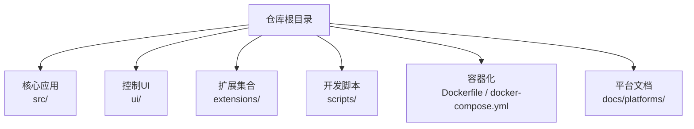
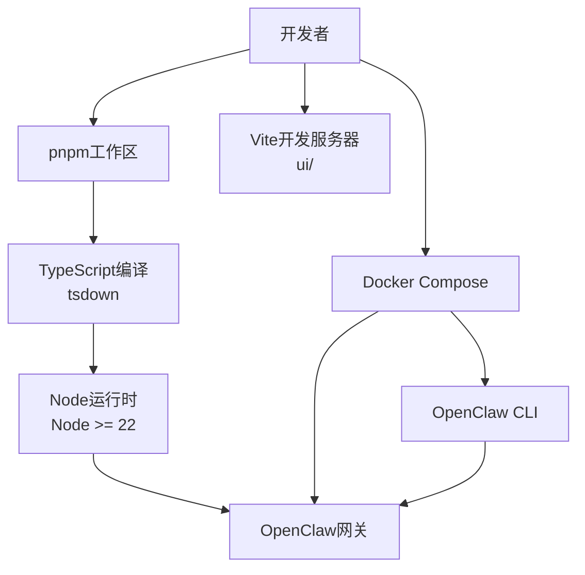
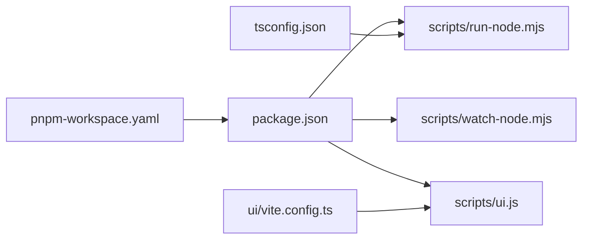

# 开发环境搭建

<cite>
**本文档引用的文件**
- [package.json](file://package.json)
- [pnpm-workspace.yaml](file://pnpm-workspace.yaml)
- [tsconfig.json](file://tsconfig.json)
- [Dockerfile](file://Dockerfile)
- [docker-compose.yml](file://docker-compose.yml)
- [README.md](file://README.md)
- [ui/package.json](file://ui/package.json)
- [ui/vite.config.ts](file://ui/vite.config.ts)
- [scripts/run-node.mjs](file://scripts/run-node.mjs)
- [scripts/watch-node.mjs](file://scripts/watch-node.mjs)
- [scripts/ui.js](file://scripts/ui.js)
- [docs/install/docker.md](file://docs/install/docker.md)
- [docs/platforms/windows.md](file://docs/platforms/windows.md)
- [docs/platforms/macos.md](file://docs/platforms/macos.md)
- [docs/platforms/linux.md](file://docs/platforms/linux.md)
</cite>

## 目录
1. [简介](#简介)
2. [项目结构](#项目结构)
3. [核心组件](#核心组件)
4. [架构总览](#架构总览)
5. [详细组件分析](#详细组件分析)
6. [依赖关系分析](#依赖关系分析)
7. [性能考虑](#性能考虑)
8. [故障排除指南](#故障排除指南)
9. [结论](#结论)
10. [附录](#附录)

## 简介
本指南面向OpenClaw项目的开发者，提供从零到一的完整开发环境搭建流程。内容覆盖以下关键主题：
- Node.js版本要求与运行时选择
- pnpm包管理器与monorepo工作区配置
- TypeScript编译与构建系统
- 开发工具链与IDE推荐设置
- Docker容器化与本地数据库准备
- 第三方服务集成要点
- 开发服务器启动、热重载与调试
- 跨平台（macOS、Windows、Linux）差异与注意事项
- 常见环境问题排查与解决方案

## 项目结构
OpenClaw采用monorepo结构，根目录包含核心应用、UI、扩展、脚本与文档。关键目录与文件如下：
- 根包管理与引擎：package.json（含engines字段声明Node版本）、pnpm-workspace.yaml（工作区定义）
- TypeScript编译：tsconfig.json（严格模式、路径映射、输出目录等）
- UI子项目：ui/（Vite配置、依赖与构建脚本）
- 开发脚本：scripts/（TypeScript运行与监听、UI脚手架）
- 容器化：Dockerfile、docker-compose.yml（镜像构建、Compose编排、健康检查）
- 平台文档：docs/platforms/（Windows、macOS、Linux平台指南）

图表来源
- [package.json](file://package.json)
- [pnpm-workspace.yaml](file://pnpm-workspace.yaml)
- [ui/package.json](file://ui/package.json)
- [Dockerfile](file://Dockerfile)
- [docker-compose.yml](file://docker-compose.yml)

章节来源
- [package.json](file://package.json)
- [pnpm-workspace.yaml](file://pnpm-workspace.yaml)
- [tsconfig.json](file://tsconfig.json)
- [ui/package.json](file://ui/package.json)
- [ui/vite.config.ts](file://ui/vite.config.ts)
- [Dockerfile](file://Dockerfile)
- [docker-compose.yml](file://docker-compose.yml)

## 核心组件
- 包管理与引擎
  - Node版本：>= 22.12.0（engines字段）
  - 包管理器：pnpm（packageManager字段），支持工作区与仅构建依赖
- monorepo工作区
  - 工作区范围：根、ui、packages/*、extensions/*
  - 仅构建依赖：加速安装与减少不必要的二进制构建
- TypeScript编译
  - 目标：ES2023
  - 模块：NodeNext
  - 严格模式：开启
  - 路径映射：openclaw/plugin-sdk相关别名
- UI构建
  - Vite作为打包与开发服务器
  - 输出目录：dist/control-ui
  - 基础路径可由环境变量控制
- 开发脚本
  - 运行与监听：run-node.mjs、watch-node.mjs
  - UI脚手架：scripts/ui.js（自动检测pnpm并执行对应命令）
- 容器化
  - 多阶段构建：提取扩展依赖、构建产物、裁剪运行时
  - 运行时变体：默认与slim
  - 健康检查：/healthz与/readyz端点
  - 可选安装：Chromium、Docker CLI

章节来源
- [package.json](file://package.json)
- [pnpm-workspace.yaml](file://pnpm-workspace.yaml)
- [tsconfig.json](file://tsconfig.json)
- [ui/package.json](file://ui/package.json)
- [ui/vite.config.ts](file://ui/vite.config.ts)
- [scripts/run-node.mjs](file://scripts/run-node.mjs)
- [scripts/watch-node.mjs](file://scripts/watch-node.mjs)
- [scripts/ui.js](file://scripts/ui.js)
- [Dockerfile](file://Dockerfile)
- [docker-compose.yml](file://docker-compose.yml)

## 架构总览
下图展示了开发环境中的关键交互：开发者通过脚本驱动TypeScript编译与运行，UI在独立Vite进程中提供前端体验；容器化场景下，Docker Compose协调网关与CLI服务，并提供健康检查与可选的沙箱能力。

图表来源
- [package.json](file://package.json)
- [tsconfig.json](file://tsconfig.json)
- [ui/vite.config.ts](file://ui/vite.config.ts)
- [Dockerfile](file://Dockerfile)
- [docker-compose.yml](file://docker-compose.yml)

## 详细组件分析

### Node.js与包管理器配置
- Node版本要求
  - engines.node: >= 22.12.0
  - 推荐使用Node 22长期支持版本
- 包管理器
  - packageManager: pnpm@10.23.0
  - 工作区：根、ui、packages/*、extensions/*
  - 仅构建依赖：加速安装与避免不必要的原生模块编译
- 版本兼容性
  - peerDependencies中包含@napi-rs/canvas与node-llama-cpp，需确保与Node 22匹配

章节来源
- [package.json](file://package.json)
- [pnpm-workspace.yaml](file://pnpm-workspace.yaml)

### TypeScript编译配置
- 编译选项
  - target: ES2023
  - module: NodeNext
  - moduleResolution: NodeNext
  - strict: true
  - noEmit: true（开发期不生成JS，由运行脚本编译）
  - lib: DOM、DOM.Iterable、ES2023、ScriptHost
  - paths: openclaw/plugin-sdk相关别名映射
- 包含范围
  - include: src/**/*, ui/**/*, extensions/**/*
- 构建流程
  - 开发：pnpm dev/gateway:watch通过run-node.mjs触发tsdown编译
  - 生产：pnpm build调用多步脚本生成dist与插件SDK类型

章节来源
- [tsconfig.json](file://tsconfig.json)
- [scripts/run-node.mjs](file://scripts/run-node.mjs)
- [package.json](file://package.json)

### 开发工具链与IDE设置
- 推荐IDE
  - VS Code（支持TypeScript、Vite、pnpm工作区）
- 插件建议
  - TypeScript TSServer、ESLint（oxlint）、格式化（oxfmt）
- 调试配置
  - 使用VS Code的Node调试器附加到运行中的Node进程
  - 配置断点于src/与ui/目录，结合热重载提升效率
- 脚本入口
  - pnpm dev/gateway:watch用于开发循环
  - pnpm ui:dev/ui:build分别启动UI开发服务器与构建

章节来源
- [package.json](file://package.json)
- [ui/vite.config.ts](file://ui/vite.config.ts)
- [scripts/run-node.mjs](file://scripts/run-node.mjs)
- [scripts/watch-node.mjs](file://scripts/watch-node.mjs)

### Docker环境配置
- 镜像构建
  - 多阶段构建：分离扩展依赖提取、构建与运行时裁剪
  - 运行时变体：默认与slim（基于node:22-bookworm与node:22-bookworm-slim）
  - 可选安装：Chromium、Docker CLI（通过构建参数）
- Compose编排
  - 服务：openclaw-gateway（网关）、openclaw-cli（CLI）
  - 端口：18789（网关）、18790（桥接）
  - 健康检查：/healthz与/readyz
  - 数据卷：~/.openclaw与~/.openclaw/workspace
- 启动流程
  - 一键脚本：./docker-setup.sh（构建镜像、引导向导、启动服务）
  - 手动流程：docker build -> docker compose run onboard -> docker compose up

章节来源
- [Dockerfile](file://Dockerfile)
- [docker-compose.yml](file://docker-compose.yml)
- [docs/install/docker.md](file://docs/install/docker.md)

### 本地数据库与第三方服务集成
- 本地数据库
  - 默认使用SQLite（通过sqlite-vec与相关依赖）
  - 在容器中可通过额外挂载或环境变量调整存储位置
- 第三方服务
  - 支持多种消息渠道（Telegram、Discord、Slack、WhatsApp等）
  - 通过CLI进行频道登录与配置（例如channels login/add）
  - 文档中提供了各渠道的配置示例与注意事项

章节来源
- [package.json](file://package.json)
- [docs/install/docker.md](file://docs/install/docker.md)

### 开发服务器启动与热重载
- 启动方式
  - 本地开发：pnpm dev 或 pnpm gateway:watch（TypeScript直接运行）
  - UI开发：pnpm ui:dev（Vite服务器，端口5173）
- 热重载机制
  - run-node.mjs监控src、tsconfig.json、package.json变更，必要时重新编译并重启
  - watch-node.mjs封装监听会话，支持SIGINT/SIGTERM优雅退出
- 调试
  - 通过Node调试器附加到运行中的进程
  - UI侧可利用Vite的HMR提升前端迭代速度

章节来源
- [scripts/run-node.mjs](file://scripts/run-node.mjs)
- [scripts/watch-node.mjs](file://scripts/watch-node.mjs)
- [ui/vite.config.ts](file://ui/vite.config.ts)
- [package.json](file://package.json)

### 跨平台注意事项
- macOS
  - 官方配套菜单栏应用，负责权限管理与节点桥接
  - LaunchAgent管理网关生命周期
  - 文档提供了权限、远程连接与调试方法
- Windows（WSL2）
  - 强烈推荐通过WSL2安装与运行（Ubuntu）
  - 支持systemd用户服务与开机自启
  - 提供端口转发以暴露WSL内服务至Windows主机
- Linux
  - 完全支持，推荐systemd用户服务
  - 提供VPS快速上手流程与服务安装指引

章节来源
- [docs/platforms/macos.md](file://docs/platforms/macos.md)
- [docs/platforms/windows.md](file://docs/platforms/windows.md)
- [docs/platforms/linux.md](file://docs/platforms/linux.md)

## 依赖关系分析
- 包管理与工作区
  - pnpm工作区统一管理根、UI与扩展的依赖解析
  - onlyBuiltDependencies减少原生模块安装成本
- TypeScript与运行时
  - tsdown负责TypeScript编译与运行时入口
  - Node 22满足严格的目标与模块策略
- UI与脚本
  - scripts/ui.js自动检测pnpm并代理Vite命令
  - Vite配置支持基础路径与生产构建

图表来源
- [pnpm-workspace.yaml](file://pnpm-workspace.yaml)
- [package.json](file://package.json)
- [tsconfig.json](file://tsconfig.json)
- [scripts/run-node.mjs](file://scripts/run-node.mjs)
- [scripts/watch-node.mjs](file://scripts/watch-node.mjs)
- [scripts/ui.js](file://scripts/ui.js)
- [ui/vite.config.ts](file://ui/vite.config.ts)

章节来源
- [pnpm-workspace.yaml](file://pnpm-workspace.yaml)
- [package.json](file://package.json)
- [tsconfig.json](file://tsconfig.json)
- [scripts/run-node.mjs](file://scripts/run-node.mjs)
- [scripts/watch-node.mjs](file://scripts/watch-node.mjs)
- [scripts/ui.js](file://scripts/ui.js)
- [ui/vite.config.ts](file://ui/vite.config.ts)

## 性能考虑
- 构建优化
  - Docker多阶段构建按需缓存依赖层，减少重复安装
  - UI构建启用sourcemap与较大的chunkSizeWarningLimit以平衡调试与体积
- 运行时优化
  - Node 22的性能与稳定性更佳
  - pnpm的链接安装与工作区解析提升整体安装速度
- 资源限制
  - Docker构建时通过NODE_OPTIONS限制内存，避免低配主机OOM
  - UI构建在生产模式下最小化资源占用

章节来源
- [Dockerfile](file://Dockerfile)
- [ui/vite.config.ts](file://ui/vite.config.ts)
- [package.json](file://package.json)

## 故障排除指南
- Node版本不匹配
  - 症状：pnpm安装失败或运行时报错
  - 解决：升级至Node >= 22.12.0，确保engines一致
- pnpm工作区解析异常
  - 症状：依赖缺失或版本冲突
  - 解决：清理node_modules与store后重新安装；确认pnpm-workspace.yaml范围正确
- TypeScript编译错误
  - 症状：严格模式导致的类型错误
  - 解决：根据tsconfig.json的strict规则修复类型；必要时调整paths映射
- UI构建失败
  - 症状：Vite无法启动或构建报错
  - 解决：确认pnpm可用；通过scripts/ui.js自动安装依赖；检查Vite配置的base路径
- Docker容器健康检查失败
  - 症状：/healthz返回非200
  - 解决：检查网关绑定模式（lan/loopback）、认证令牌与端口映射；查看日志定位问题
- Windows WSL端口转发失效
  - 症状：其他机器无法访问WSL内的服务
  - 解决：刷新netsh portproxy规则；允许防火墙入站规则；确认WSL IP变化后的更新

章节来源
- [package.json](file://package.json)
- [tsconfig.json](file://tsconfig.json)
- [ui/vite.config.ts](file://ui/vite.config.ts)
- [Dockerfile](file://Dockerfile)
- [docker-compose.yml](file://docker-compose.yml)
- [docs/install/docker.md](file://docs/install/docker.md)
- [docs/platforms/windows.md](file://docs/platforms/windows.md)

## 结论
通过以上步骤，开发者可以在macOS、Windows（WSL2）与Linux平台上快速搭建OpenClaw的开发环境。建议优先使用Node 22与pnpm工作区，配合TypeScript严格模式与Vite开发服务器，获得最佳的开发体验。容器化部署适合需要隔离与快速验证的场景，同时注意健康检查与端口配置。遇到问题时，可依据故障排除指南逐项排查。

## 附录
- 快速开始（本地）
  - 安装：git clone + pnpm install
  - UI：pnpm ui:build
  - 构建：pnpm build
  - 向导：pnpm openclaw onboard
  - 开发：pnpm gateway:watch
- 快速开始（Docker）
  - 一键：./docker-setup.sh
  - 手动：docker build -> docker compose run onboard -> docker compose up

章节来源
- [README.md](file://README.md)
- [package.json](file://package.json)
- [docs/install/docker.md](file://docs/install/docker.md)