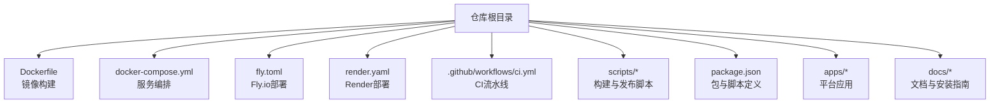
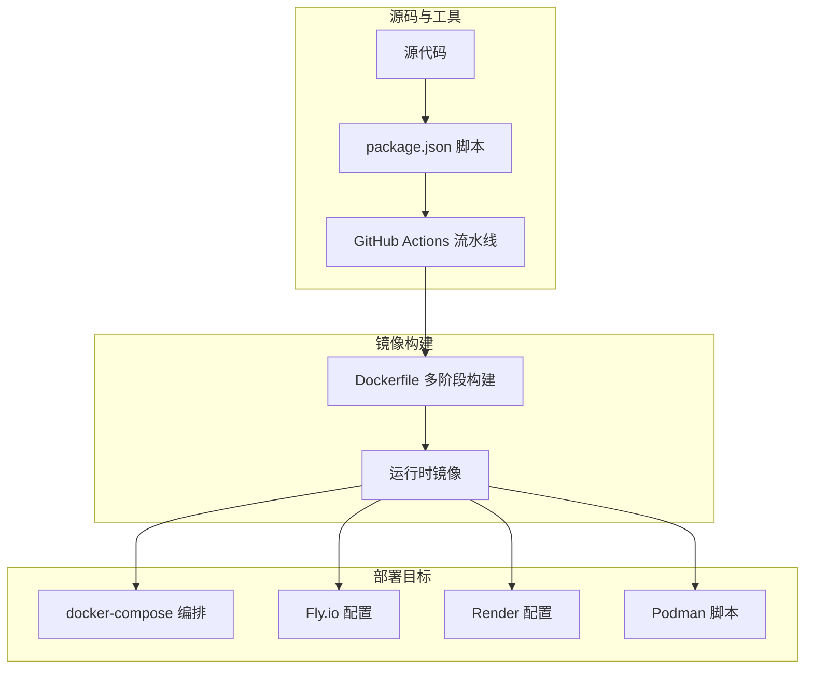
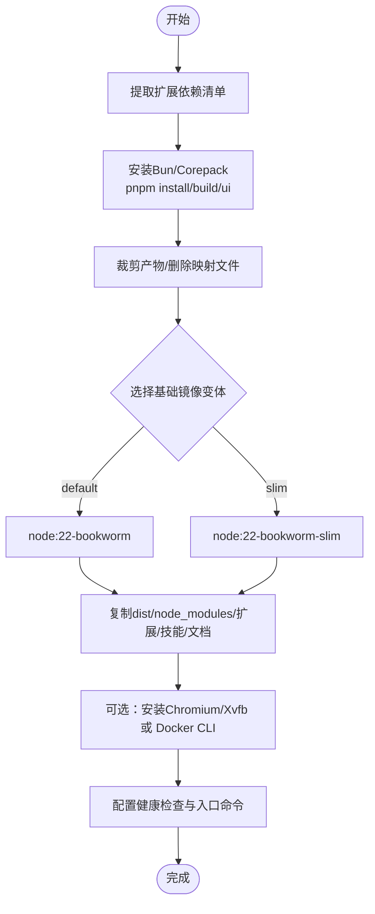
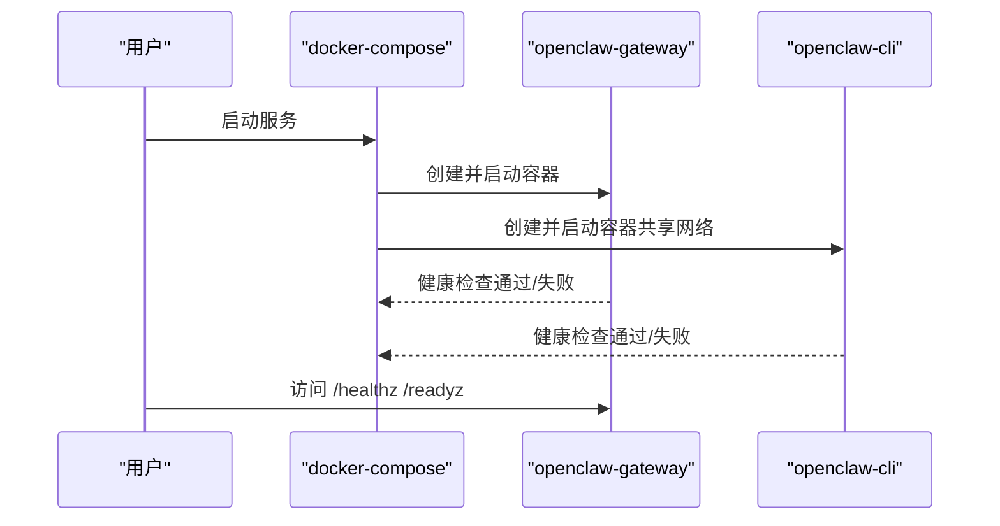
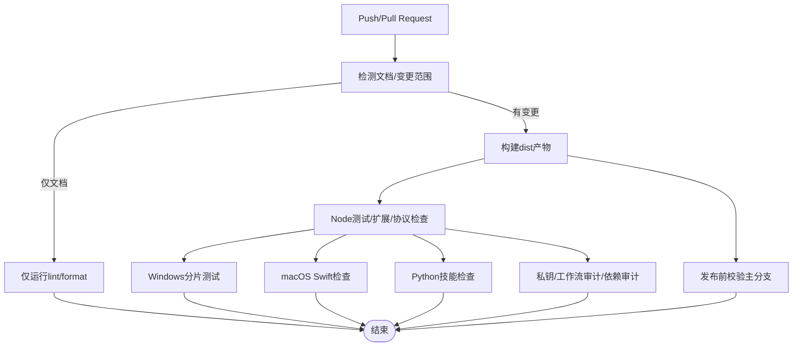
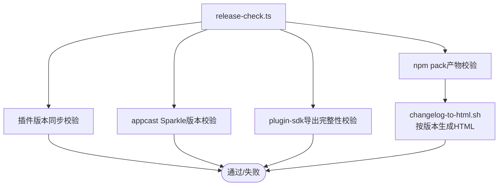
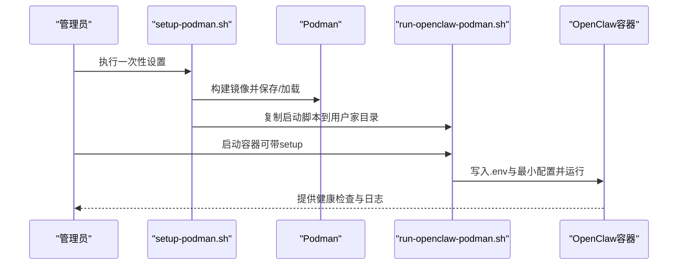
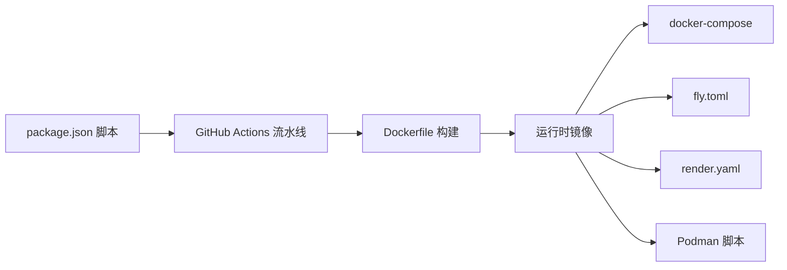

# 构建与部署

<cite>
**本文引用的文件**
- [Dockerfile](file://Dockerfile)
- [docker-compose.yml](file://docker-compose.yml)
- [package.json](file://package.json)
- [fly.toml](file://fly.toml)
- [render.yaml](file://render.yaml)
- [.github/workflows/ci.yml](file://.github/workflows/ci.yml)
- [scripts/changelog-to-html.sh](file://scripts/changelog-to-html.sh)
- [scripts/release-check.ts](file://scripts/release-check.ts)
- [scripts/run-openclaw-podman.sh](file://scripts/run-openclaw-podman.sh)
- [setup-podman.sh](file://setup-podman.sh)
- [scripts/podman/openclaw.container.in](file://scripts/podman/openclaw.container.in)
- [scripts/build-and-run-mac.sh](file://scripts/build-and-run-mac.sh)
</cite>

## 目录
1. [简介](#简介)
2. [项目结构](#项目结构)
3. [核心组件](#核心组件)
4. [架构总览](#架构总览)
5. [详细组件分析](#详细组件分析)
6. [依赖关系分析](#依赖关系分析)
7. [性能考虑](#性能考虑)
8. [故障排查指南](#故障排查指南)
9. [结论](#结论)
10. [附录](#附录)

## 简介
本指南面向OpenClaw项目的构建与部署，覆盖多平台构建流程、Docker镜像构建与容器化部署、CI/CD流水线配置、自动化测试与发布流程、版本发布与变更日志生成、以及不同部署环境（本地开发、测试、生产）的配置差异与运维实践。文档同时提供健康检查与回滚策略建议，帮助团队在不同环境中稳定交付。

## 项目结构
OpenClaw采用多语言混合架构：Node.js作为主运行时，Swift用于macOS/iOS应用，Android使用Gradle构建，前端UI通过独立包管理。根目录提供统一的Dockerfile、docker-compose编排、Fly.io与Render部署配置，以及GitHub Actions流水线与发布校验脚本。

图示来源
- [Dockerfile](file://Dockerfile)
- [docker-compose.yml](file://docker-compose.yml)
- [fly.toml](file://fly.toml)
- [render.yaml](file://render.yaml)
- [.github/workflows/ci.yml](file://.github/workflows/ci.yml)
- [package.json](file://package.json)

章节来源
- [Dockerfile](file://Dockerfile)
- [docker-compose.yml](file://docker-compose.yml)
- [package.json](file://package.json)
- [.github/workflows/ci.yml](file://.github/workflows/ci.yml)

## 核心组件
- 镜像构建：基于Node.js 22-bookworm镜像的多阶段构建，支持Slim变体、可选安装浏览器与Docker CLI，内置健康检查端点。
- 容器编排：docker-compose定义网关与CLI服务，支持挂载配置与工作区卷、健康检查与重启策略。
- 平台应用：apps/macos、apps/ios、apps/android分别提供原生应用与移动应用构建脚本。
- CI/CD：GitHub Actions按变更范围智能分流，执行类型检查、单元测试、扩展测试、协议一致性、Windows分片测试、macOS Swift检查等。
- 发布校验：npm包内容校验、插件版本同步、Sparkle版本门限校验、关键插件SDK导出完整性校验。
- 部署配置：Fly.io与Render提供云原生部署模板；Podman脚本支持本地rootless容器部署与systemd Quadlet自启动。

章节来源
- [Dockerfile](file://Dockerfile)
- [docker-compose.yml](file://docker-compose.yml)
- [package.json](file://package.json)
- [.github/workflows/ci.yml](file://.github/workflows/ci.yml)
- [scripts/release-check.ts](file://scripts/release-check.ts)

## 架构总览
下图展示从源码到容器镜像、再到云平台或本地容器运行的整体流程。

图示来源
- [Dockerfile](file://Dockerfile)
- [docker-compose.yml](file://docker-compose.yml)
- [fly.toml](file://fly.toml)
- [render.yaml](file://render.yaml)
- [.github/workflows/ci.yml](file://.github/workflows/ci.yml)

## 详细组件分析

### Docker镜像构建
- 多阶段构建：第一阶段提取扩展依赖清单，第二阶段安装Bun与Corepack，构建dist与UI，第三阶段裁剪产物并复制至最终基础镜像（默认bookworm或slim）。
- 运行时增强：可选安装Chromium与Xvfb以加速浏览器自动化；可选安装Docker CLI以支持沙箱容器管理；内置健康检查端点。
- 安全与兼容：非root用户运行，固定OCI基础镜像摘要，避免上游标签漂移导致的不可重现构建。

图示来源
- [Dockerfile](file://Dockerfile)

章节来源
- [Dockerfile](file://Dockerfile)

### docker-compose编排
- 服务：openclaw-gateway（网关）、openclaw-cli（CLI），共享配置与工作区卷，支持健康检查与重启策略。
- 端口映射：默认18789/18790，可通过环境变量覆盖。
- 沙箱隔离：注释中提供启用Docker套接字挂载与组加入的示例，需配合镜像中安装Docker CLI。

图示来源
- [docker-compose.yml](file://docker-compose.yml)

章节来源
- [docker-compose.yml](file://docker-compose.yml)

### CI/CD流水线（GitHub Actions）
- 变更范围检测：根据diff结果决定是否跳过重资源任务，文档变更走轻量通道。
- 分流矩阵：Node与Bun双轨测试，Windows分片并行，macOS合并为单作业。
- 质量门禁：类型检查、lint、格式化、扩展测试、协议一致性、Python技能检查、安全审计、发布前校验。
- 文档与发布：仅在主分支执行发布校验，确保npm包内容与版本一致性。

图示来源
- [.github/workflows/ci.yml](file://.github/workflows/ci.yml)

章节来源
- [.github/workflows/ci.yml](file://.github/workflows/ci.yml)

### 发布校验与版本管理
- npm包内容校验：确保dist与plugin-sdk产物齐全，禁止打包特定路径。
- 插件版本同步：所有扩展版本需与根版本保持一致（去后缀与前缀规范化）。
- Sparkle版本门限：校验appcast条目sparkle:version不低于对应日期版本的lane/legacy门限。
- 关键SDK导出：校验dist/plugin-sdk/index.js导出集合包含关键API，防止插件运行时崩溃。
- 变更日志HTML生成：按版本提取Markdown段落并转为HTML，便于公告展示。

图示来源
- [scripts/release-check.ts](file://scripts/release-check.ts)
- [scripts/changelog-to-html.sh](file://scripts/changelog-to-html.sh)

章节来源
- [scripts/release-check.ts](file://scripts/release-check.ts)
- [scripts/changelog-to-html.sh](file://scripts/changelog-to-html.sh)

### Podman本地部署与自启动
- 一次性设置：创建openclaw用户、生成认证令牌、初始化配置与工作区、构建镜像并加载到目标用户Podman存储。
- 运行脚本：支持以openclaw用户身份启动容器，自动写入环境变量文件，生成最小配置；支持“onboard”向导。
- 自启动：可选安装systemd Quadlet，实现用户态服务自启动与重启。

图示来源
- [setup-podman.sh](file://setup-podman.sh)
- [scripts/run-openclaw-podman.sh](file://scripts/run-openclaw-podman.sh)
- [scripts/podman/openclaw.container.in](file://scripts/podman/openclaw.container.in)

章节来源
- [setup-podman.sh](file://setup-podman.sh)
- [scripts/run-openclaw-podman.sh](file://scripts/run-openclaw-podman.sh)
- [scripts/podman/openclaw.container.in](file://scripts/podman/openclaw.container.in)

### 平台应用构建（macOS）
- 本地快速启动：Swift构建debug产物并后台运行，便于本地验证。
- 与CI协同：CI中macOS作业顺序执行TS测试、Swift lint/build/test，确保质量门禁。

章节来源
- [scripts/build-and-run-mac.sh](file://scripts/build-and-run-mac.sh)
- [.github/workflows/ci.yml](file://.github/workflows/ci.yml)

## 依赖关系分析
- 构建链路：package.json中的脚本驱动CI与本地构建；CI根据变更范围调用不同任务；Dockerfile负责最终镜像产出。
- 运行时依赖：Node.js 22+、pnpm、可选Playwright浏览器缓存、可选Docker CLI。
- 平台依赖：macOS使用Swift工具链；Android使用Gradle与Android SDK；Windows测试受内存与分片影响。

图示来源
- [package.json](file://package.json)
- [.github/workflows/ci.yml](file://.github/workflows/ci.yml)
- [Dockerfile](file://Dockerfile)
- [docker-compose.yml](file://docker-compose.yml)
- [fly.toml](file://fly.toml)
- [render.yaml](file://render.yaml)
- [scripts/run-openclaw-podman.sh](file://scripts/run-openclaw-podman.sh)

章节来源
- [package.json](file://package.json)
- [.github/workflows/ci.yml](file://.github/workflows/ci.yml)
- [Dockerfile](file://Dockerfile)

## 性能考虑
- 构建缓存：pnpm store与apt缓存持久化，减少重复安装时间。
- 内存限制：CI中为Windows与Node测试设置最大堆参数，避免OOM。
- 交叉编译：A2UI打包在某些架构下可能失败，CI中按架构原生构建，本地跨架构构建会降级为桩文件。
- 运行时优化：Slim镜像体积更小，但需自行安装必要系统包；可预装浏览器以避免容器启动时下载。

章节来源
- [Dockerfile](file://Dockerfile)
- [.github/workflows/ci.yml](file://.github/workflows/ci.yml)

## 故障排查指南
- 健康检查失败：确认容器内服务监听地址与绑定模式（默认loopback），如需外部访问请改为lan并设置认证。
- 权限问题（Podman）：SELinux环境下挂载需追加Z选项；确保配置目录属主匹配容器UID/GID。
- 端口冲突：修改宿主机端口映射或容器端口配置。
- 插件崩溃：检查plugin-sdk导出完整性与版本同步，确保与根版本一致。
- 发布失败：核对npm pack产物清单、appcast Sparkle版本门限与扩展依赖镜像一致性。

章节来源
- [Dockerfile](file://Dockerfile)
- [docker-compose.yml](file://docker-compose.yml)
- [scripts/release-check.ts](file://scripts/release-check.ts)
- [scripts/run-openclaw-podman.sh](file://scripts/run-openclaw-podman.sh)

## 结论
通过多阶段Docker构建、严格的CI质量门禁、完善的发布校验与灵活的部署方式（容器编排、云平台、Podman），OpenClaw实现了可复现、可观测、可回滚的交付体系。建议在不同环境遵循本文档的配置差异与最佳实践，确保稳定性与安全性。

## 附录

### 多平台构建流程
- Node.js：使用package.json脚本与pnpm进行构建与测试。
- macOS：Swift工具链与XcodeGen，CI中顺序执行TS测试与Swift检查。
- Android：Gradle与Android SDK，CI中执行单元测试与构建。
- Windows：分片并行测试，注意内存与 Defender 排除策略。

章节来源
- [package.json](file://package.json)
- [.github/workflows/ci.yml](file://.github/workflows/ci.yml)

### CI/CD流水线配置要点
- 变更范围检测：减少不必要任务，提升吞吐。
- 并行与分片：Windows分片、macOS合并、Node/Bun双轨。
- 安全与合规：私钥扫描、工作流审计、依赖审计、类型与格式检查。

章节来源
- [.github/workflows/ci.yml](file://.github/workflows/ci.yml)

### 自动化测试与发布流程
- 单元/集成/端到端：通过package.json脚本与Vitest配置组织。
- 发布前校验：release-check.ts确保包内容、版本与导出完整。
- 变更日志：changelog-to-html.sh按版本生成HTML公告。

章节来源
- [package.json](file://package.json)
- [scripts/release-check.ts](file://scripts/release-check.ts)
- [scripts/changelog-to-html.sh](file://scripts/changelog-to-html.sh)

### 不同部署环境的配置差异
- 本地开发（Podman）：使用run-openclaw-podman.sh与setup-podman.sh，支持自启动与最小配置。
- 测试环境（docker-compose）：共享卷与健康检查，便于调试与数据持久化。
- 生产环境（Fly.io/Render）：云平台配置文件，固定端口与状态目录，启用健康检查与自动扩缩容。

章节来源
- [scripts/run-openclaw-podman.sh](file://scripts/run-openclaw-podman.sh)
- [setup-podman.sh](file://setup-podman.sh)
- [docker-compose.yml](file://docker-compose.yml)
- [fly.toml](file://fly.toml)
- [render.yaml](file://render.yaml)

### 环境变量与配置文件处理
- 网关令牌：OPENCLAW_GATEWAY_TOKEN（Podman脚本自动生成并写入.env）。
- 绑定模式：OPENCLAW_GATEWAY_BIND（默认loopback，生产建议lan并设置认证）。
- 状态目录：OPENCLAW_STATE_DIR（Fly.io）、OPENCLAW_WORKSPACE_DIR（Render）。
- 其他：OPENCLAW_PREFER_PNPM、NODE_OPTIONS、PORT等按平台配置。

章节来源
- [scripts/run-openclaw-podman.sh](file://scripts/run-openclaw-podman.sh)
- [openclaw.podman.env](file://openclaw.podman.env)
- [fly.toml](file://fly.toml)
- [render.yaml](file://render.yaml)

### 版本发布流程、标签与变更日志
- 版本号：package.json中version字段。
- 发布校验：release-check.ts执行多维度校验。
- 变更日志：scripts/changelog-to-html.sh按版本提取并生成HTML。

章节来源
- [package.json](file://package.json)
- [scripts/release-check.ts](file://scripts/release-check.ts)
- [scripts/changelog-to-html.sh](file://scripts/changelog-to-html.sh)

### 本地开发、测试、生产部署步骤
- 本地开发（Podman）：执行setup-podman.sh一次性设置，再用run-openclaw-podman.sh启动；可选安装Quadlet实现开机自启。
- 测试环境（docker-compose）：配置环境变量与卷，启动服务并访问健康检查端点。
- 生产环境（Fly.io/Render）：按平台配置文件部署，设置状态盘与环境变量，启用健康检查与自动重启。

章节来源
- [setup-podman.sh](file://setup-podman.sh)
- [scripts/run-openclaw-podman.sh](file://scripts/run-openclaw-podman.sh)
- [docker-compose.yml](file://docker-compose.yml)
- [fly.toml](file://fly.toml)
- [render.yaml](file://render.yaml)

### 部署监控、健康检查与回滚策略
- 健康检查：镜像内置/readyz与/healthz端点，compose与云平台均配置健康检查。
- 监控：结合平台日志与健康检查状态；建议在生产环境开启自动扩缩容与重启策略。
- 回滚：Fly.io/Render支持滚动更新与镜像回滚；容器场景可保留上一版本镜像并切换标签。

章节来源
- [Dockerfile](file://Dockerfile)
- [docker-compose.yml](file://docker-compose.yml)
- [fly.toml](file://fly.toml)
- [render.yaml](file://render.yaml)