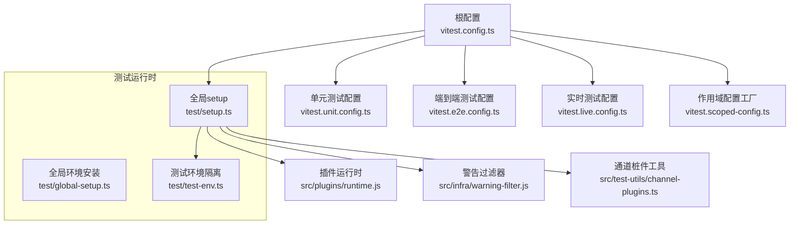
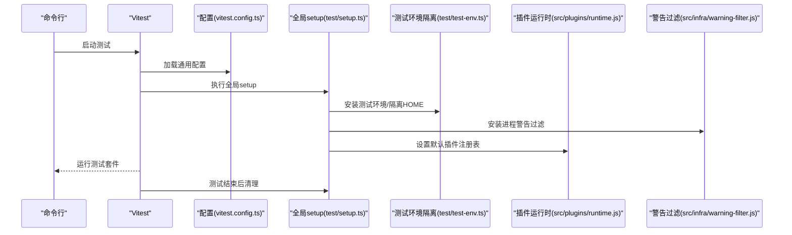
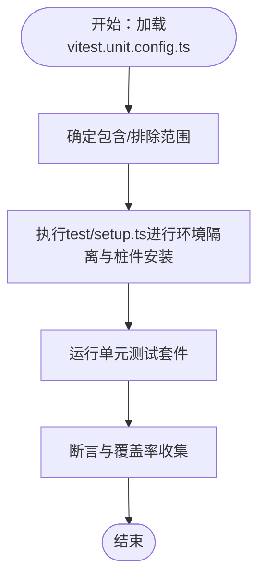
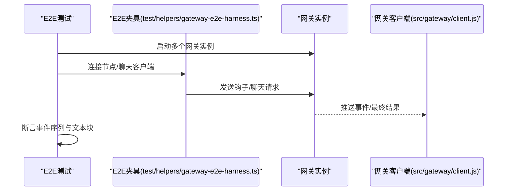
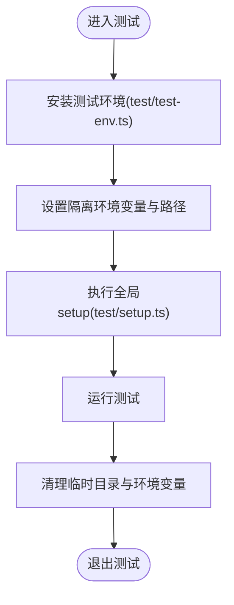
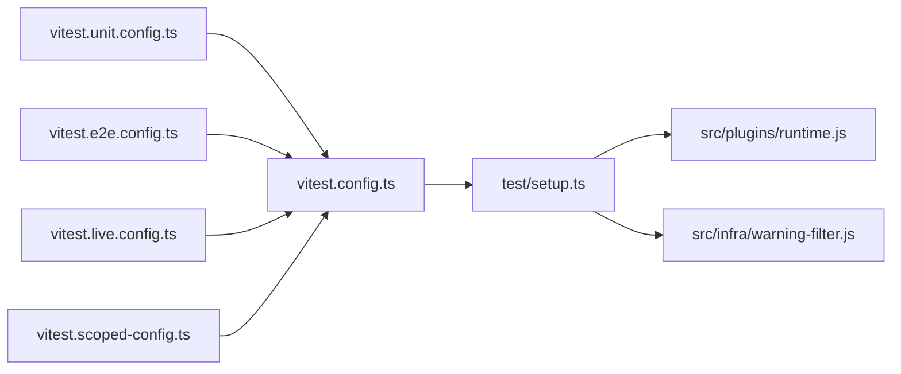

# 测试策略与实践

<cite>
**本文引用的文件**
- [vitest.config.ts](file://vitest.config.ts)
- [vitest.unit.config.ts](file://vitest.unit.config.ts)
- [vitest.e2e.config.ts](file://vitest.e2e.config.ts)
- [vitest.live.config.ts](file://vitest.live.config.ts)
- [vitest.scoped-config.ts](file://vitest.scoped-config.ts)
- [test/setup.ts](file://test/setup.ts)
- [test/global-setup.ts](file://test/global-setup.ts)
- [test/test-env.ts](file://test/test-env.ts)
- [test/appcast.test.ts](file://test/appcast.test.ts)
- [test/cli-json-stdout.e2e.test.ts](file://test/cli-json-stdout.e2e.test.ts)
- [test/gateway.multi.e2e.test.ts](file://test/gateway.multi.e2e.test.ts)
- [test/fixtures/system-run-approval-binding-contract.json](file://test/fixtures/system-run-approval-binding-contract.json)
- [test/helpers/gateway-e2e-harness.ts](file://test/helpers/gateway-e2e-harness.ts)
- [test/helpers/temp-home.ts](file://test/helpers/temp-home.ts)
- [test/scripts/check-channel-agnostic-boundaries.test.ts](file://test/scripts/check-channel-agnostic-boundaries.test.ts)
- [test/scripts/ui.test.ts](file://test/scripts/ui.test.ts)
- [src/test-utils/channel-plugins.ts](file://src/test-utils/channel-plugins.ts)
- [src/infra/warning-filter.js](file://src/infra/warning-filter.js)
- [src/plugins/runtime.js](file://src/plugins/runtime.js)
- [src/gateway/client.js](file://src/gateway/client.js)
- [src/gateway/test-helpers.e2e.js](file://src/gateway/test-helpers.e2e.js)
- [src/utils/message-channel.js](file://src/utils/message-channel.js)
- [scripts/sparkle-build.ts](file://scripts/sparkle-build.ts)
</cite>

## 目录
1. [引言](#引言)
2. [项目结构](#项目结构)
3. [核心组件](#核心组件)
4. [架构总览](#架构总览)
5. [详细组件分析](#详细组件分析)
6. [依赖分析](#依赖分析)
7. [性能考量](#性能考量)
8. [故障排查指南](#故障排查指南)
9. [结论](#结论)
10. [附录](#附录)

## 引言
本文件系统化阐述 OpenClaw 的测试策略与实践，覆盖单元测试、集成测试与端到端测试（E2E）的组织结构、执行方式与最佳实践。重点包括 Vitest 配置、测试环境隔离、模拟对象与桩件的使用、不同层级测试的编写指南、测试数据准备与断言策略、覆盖率门槛与性能测试方法、回归测试流程、调试技巧、CI/CD 中的测试执行以及测试报告分析。同时给出新功能测试的最佳实践与测试用例设计原则。

## 项目结构
OpenClaw 的测试体系以 Vitest 为核心，通过多套配置文件区分不同测试场景：通用配置、单元测试专用配置、端到端测试配置、实时测试配置与可复用的“作用域配置”工厂。测试运行时通过全局/模块级 setup 文件完成环境隔离与插件注册等初始化工作，并在测试目录中按功能域划分测试文件，便于维护与并行执行。

图示来源
- [vitest.config.ts:1-203](file://vitest.config.ts#L1-L203)
- [vitest.unit.config.ts:1-31](file://vitest.unit.config.ts#L1-L31)
- [vitest.e2e.config.ts:1-33](file://vitest.e2e.config.ts#L1-L33)
- [vitest.live.config.ts:1-17](file://vitest.live.config.ts#L1-L17)
- [vitest.scoped-config.ts:1-18](file://vitest.scoped-config.ts#L1-L18)
- [test/setup.ts:1-211](file://test/setup.ts#L1-L211)
- [test/global-setup.ts:1-7](file://test/global-setup.ts#L1-L7)
- [test/test-env.ts:1-148](file://test/test-env.ts#L1-L148)
- [src/plugins/runtime.js](file://src/plugins/runtime.js)
- [src/infra/warning-filter.js](file://src/infra/warning-filter.js)
- [src/test-utils/channel-plugins.ts](file://src/test-utils/channel-plugins.ts)

章节来源
- [vitest.config.ts:1-203](file://vitest.config.ts#L1-L203)
- [vitest.unit.config.ts:1-31](file://vitest.unit.config.ts#L1-L31)
- [vitest.e2e.config.ts:1-33](file://vitest.e2e.config.ts#L1-L33)
- [vitest.live.config.ts:1-17](file://vitest.live.config.ts#L1-L17)
- [vitest.scoped-config.ts:1-18](file://vitest.scoped-config.ts#L1-L18)
- [test/setup.ts:1-211](file://test/setup.ts#L1-L211)
- [test/global-setup.ts:1-7](file://test/global-setup.ts#L1-L7)
- [test/test-env.ts:1-148](file://test/test-env.ts#L1-L148)

## 核心组件
- 通用 Vitest 配置：定义别名映射、超时、池类型、并发度、包含/排除规则、覆盖率阈值与排除路径、全局 setup 等。
- 单元测试配置：在通用配置基础上进一步缩小范围，排除网关、各渠道、Web、浏览器等集成面，聚焦纯逻辑与工具函数。
- 端到端测试配置：强制进程池隔离，控制并发度，仅包含 *.e2e.test.ts 文件，支持显式日志开关。
- 实时测试配置：串行执行，仅包含 *.live.test.ts 文件，用于需要真实外部服务或交互的场景。
- 作用域配置工厂：按需动态生成包含/排除列表的 Vitest 配置，提升灵活性。
- 全局 setup：安装测试环境、隔离 HOME、安装警告过滤、构建默认插件注册表、统一管理假定时器等。
- 测试环境隔离：通过临时 HOME 与 XDG 路径、清理环境变量、避免真实状态污染。
- 桩件与模拟：对第三方库进行模块级 mock；对通道适配器与插件行为进行可控的桩实现。

章节来源
- [vitest.config.ts:57-202](file://vitest.config.ts#L57-L202)
- [vitest.unit.config.ts:11-30](file://vitest.unit.config.ts#L11-L30)
- [vitest.e2e.config.ts:20-32](file://vitest.e2e.config.ts#L20-L32)
- [vitest.live.config.ts:8-16](file://vitest.live.config.ts#L8-L16)
- [vitest.scoped-config.ts:4-17](file://vitest.scoped-config.ts#L4-L17)
- [test/setup.ts:19-211](file://test/setup.ts#L19-L211)
- [test/test-env.ts:54-148](file://test/test-env.ts#L54-L148)

## 架构总览
下图展示测试运行的关键流程：配置加载 → 环境隔离 → 插件注册与桩件安装 → 测试执行 → 清理收尾。

图示来源
- [vitest.config.ts:71-90](file://vitest.config.ts#L71-L90)
- [test/setup.ts:38-211](file://test/setup.ts#L38-L211)
- [test/test-env.ts:54-148](file://test/test-env.ts#L54-L148)
- [src/plugins/runtime.js](file://src/plugins/runtime.js)
- [src/infra/warning-filter.js](file://src/infra/warning-filter.js)

## 详细组件分析

### 单元测试（Unit）
- 目标：验证纯函数、工具函数、业务模型与小规模逻辑单元。
- 范围：通过 vitest.unit.config.ts 排除网关、各渠道、Web、浏览器、自动回复、命令等集成面，确保单元测试聚焦于最小可测单元。
- 断言策略：优先断言输入输出关系、边界条件、异常路径与不变量；对副作用通过桩件与 mock 隔离。
- 数据准备：使用测试夹具与辅助函数，必要时构造最小化输入；避免真实网络与外部服务。
- 模拟对象：对第三方模块进行模块级 mock，确保跨文件隔离与稳定性。

图示来源
- [vitest.unit.config.ts:6-29](file://vitest.unit.config.ts#L6-L29)
- [test/setup.ts:19-211](file://test/setup.ts#L19-L211)

章节来源
- [vitest.unit.config.ts:11-30](file://vitest.unit.config.ts#L11-L30)
- [test/setup.ts:19-211](file://test/setup.ts#L19-L211)

### 集成测试（Integration）
- 目标：验证模块间协作、适配器与外部接口的组合行为。
- 范围：通用配置已将大量集成面排除在单元测试之外，集成测试可在此基础上扩展，关注关键路径与契约。
- 断言策略：验证消息路由、事件分发、错误传播与回退机制；对不可控外部依赖使用桩件。
- 数据准备：使用测试夹具与最小化配置；必要时启动轻量级本地服务或使用内存存储。
- 模拟对象：对外部服务进行 HTTP/WS 桩；对通道适配器进行行为模拟。

章节来源
- [vitest.config.ts:101-199](file://vitest.config.ts#L101-L199)

### 端到端测试（E2E）
- 目标：在接近真实环境的条件下验证完整用户旅程与系统级行为。
- 范围：通过 vitest.e2e.config.ts 仅包含 *.e2e.test.ts 文件，强制进程池隔离，控制并发度，支持显式日志开关。
- 断言策略：验证真实请求响应、WebSocket 事件流、节点连接与配对、最终事件与文本块提取等。
- 数据准备：使用临时 HOME 与隔离配置；必要时启动真实网关实例或使用测试夹具。
- 模拟对象：对真实服务进行桩件；对通道与网关客户端进行可控模拟。

图示来源
- [vitest.e2e.config.ts:20-32](file://vitest.e2e.config.ts#L20-L32)
- [test/gateway.multi.e2e.test.ts:1-126](file://test/gateway.multi.e2e.test.ts#L1-L126)
- [test/helpers/gateway-e2e-harness.ts](file://test/helpers/gateway-e2e-harness.ts)
- [src/gateway/client.js](file://src/gateway/client.js)

章节来源
- [vitest.e2e.config.ts:20-32](file://vitest.e2e.config.ts#L20-L32)
- [test/gateway.multi.e2e.test.ts:1-126](file://test/gateway.multi.e2e.test.ts#L1-L126)

### 实时测试（Live）
- 目标：与真实外部服务交互，验证关键路径与集成契约。
- 范围：通过 vitest.live.config.ts 串行执行，仅包含 *.live.test.ts 文件。
- 断言策略：验证真实令牌、账户配置与服务可用性；对敏感信息进行最小化暴露。
- 数据准备：使用测试环境隔离与受控环境变量；避免泄露真实密钥。
- 模拟对象：在无法真实交互时使用桩件与夹具。

章节来源
- [vitest.live.config.ts:8-16](file://vitest.live.config.ts#L8-L16)

### 作用域配置工厂
- 目标：按需动态生成包含/排除列表的 Vitest 配置，提升灵活性与可维护性。
- 使用建议：在 CI 或本地开发中针对特定目录或文件集快速生成配置，减少重复维护成本。

章节来源
- [vitest.scoped-config.ts:4-17](file://vitest.scoped-config.ts#L4-L17)

### 测试环境与隔离
- 目标：确保测试不污染开发者的实际状态与配置，避免跨测试泄漏。
- 关键措施：临时 HOME 与 XDG 路径、清理敏感环境变量、加载受控端口与开关、Windows 平台下的特殊处理。
- 生命周期：在全局 setup 中安装环境，在 afterAll 中清理；对假定时器进行统一恢复。

图示来源
- [test/test-env.ts:54-148](file://test/test-env.ts#L54-L148)
- [test/setup.ts:38-211](file://test/setup.ts#L38-L211)

章节来源
- [test/test-env.ts:54-148](file://test/test-env.ts#L54-L148)
- [test/setup.ts:38-211](file://test/setup.ts#L38-L211)

### 模拟对象与桩件
- 目标：隔离外部依赖，稳定测试行为，加速执行。
- 常见做法：
  - 对第三方库进行模块级 mock。
  - 对通道适配器与插件行为进行可控桩实现，支持发送文本/媒体、状态查询等。
  - 在全局 setup 中安装默认插件注册表，避免跨文件污染。
- 注意事项：确保在 afterEach 中恢复默认注册表与真实计时器，避免泄漏。

章节来源
- [test/setup.ts:3-17](file://test/setup.ts#L3-L17)
- [test/setup.ts:75-192](file://test/setup.ts#L75-L192)
- [src/test-utils/channel-plugins.ts](file://src/test-utils/channel-plugins.ts)

### 测试数据与夹具
- 目标：提供稳定、可重复的数据与上下文，降低测试脆弱性。
- 建议：
  - 将契约与约束数据放入 test/fixtures。
  - 使用临时 HOME 与隔离路径，避免真实状态影响。
  - 对 CLI 输出进行契约校验（如 JSON 可解析性）。
- 示例：系统运行审批绑定契约夹具、CLI JSON 输出契约测试。

章节来源
- [test/fixtures/system-run-approval-binding-contract.json](file://test/fixtures/system-run-approval-binding-contract.json)
- [test/cli-json-stdout.e2e.test.ts:1-45](file://test/cli-json-stdout.e2e.test.ts#L1-L45)

### 断言策略
- 单元测试：关注输入输出、边界与异常；对副作用进行桩件隔离。
- 集成测试：关注消息路由、事件分发与错误传播；对不可控外部依赖使用桩件。
- E2E：关注真实请求响应、事件流与最终结果；对复杂流程进行步骤化断言。
- 特殊场景：对应用更新契约进行断言（如 Sparkle 构建号一致性）。

章节来源
- [test/appcast.test.ts:1-26](file://test/appcast.test.ts#L1-L26)

## 依赖分析
- 配置耦合：各专用配置均基于通用配置，通过 include/exclude 与 pool/maxWorkers 等参数差异化。
- 运行时依赖：全局 setup 依赖插件运行时与警告过滤器，确保测试稳定性与可诊断性。
- 外部依赖：通过 mock 与桩件隔离，避免真实网络与外部服务成为测试瓶颈。

图示来源
- [vitest.unit.config.ts:2](file://vitest.unit.config.ts#L2)
- [vitest.e2e.config.ts:3](file://vitest.e2e.config.ts#L3)
- [vitest.live.config.ts:2](file://vitest.live.config.ts#L2)
- [vitest.scoped-config.ts:2](file://vitest.scoped-config.ts#L2)
- [vitest.config.ts:71-90](file://vitest.config.ts#L71-L90)
- [test/setup.ts:48-54](file://test/setup.ts#L48-L54)
- [src/plugins/runtime.js](file://src/plugins/runtime.js)
- [src/infra/warning-filter.js](file://src/infra/warning-filter.js)

章节来源
- [vitest.unit.config.ts:1-31](file://vitest.unit.config.ts#L1-L31)
- [vitest.e2e.config.ts:1-33](file://vitest.e2e.config.ts#L1-L33)
- [vitest.live.config.ts:1-17](file://vitest.live.config.ts#L1-L17)
- [vitest.scoped-config.ts:1-18](file://vitest.scoped-config.ts#L1-L18)
- [vitest.config.ts:71-90](file://vitest.config.ts#L71-L90)
- [test/setup.ts:48-54](file://test/setup.ts#L48-L54)

## 性能考量
- 并发与池类型：通用配置默认使用进程池，部分场景（如 E2E）强制 fork 以避免模块状态泄漏；根据 CI/本地 CPU 数动态调整并发度。
- 超时与稳定性：为钩子与测试设置合理超时，避免长时间阻塞；启用 unstubEnvs/unstubGlobals 降低跨文件污染风险。
- 覆盖率门槛：设置行/函数/分支/语句 70%/70%/55%/70% 的门槛，锚定仓库根 src/，并排除大型集成面与入口文件，保持覆盖率稳定增长。
- 工作区包排除：明确排除 extensions、apps、ui、test 等目录，避免非核心代码影响整体覆盖率。

章节来源
- [vitest.config.ts:71-112](file://vitest.config.ts#L71-L112)
- [vitest.config.ts:115-199](file://vitest.config.ts#L115-L199)

## 故障排查指南
- 环境变量泄漏：确认在测试前后恢复环境变量；使用临时 HOME 与 XDG 路径；避免真实令牌与端口泄漏。
- 假定时器泄漏：在 afterEach 中恢复真实计时器；避免跨文件共享假定时器。
- 插件注册表污染：确保默认注册表在 afterEach 中恢复；对覆盖默认注册表的测试进行隔离。
- E2E 日志：通过环境变量开启详细日志，定位事件流与最终结果问题。
- 覆盖率异常：检查 include/exclude 规则与门槛设置；确认未将大型集成面纳入覆盖率统计。

章节来源
- [test/test-env.ts:8-16](file://test/test-env.ts#L8-L16)
- [test/setup.ts:202-210](file://test/setup.ts#L202-L210)
- [vitest.e2e.config.ts:15](file://vitest.e2e.config.ts#L15)

## 结论
OpenClaw 的测试体系以 Vitest 为核心，通过多套配置与严格的环境隔离，实现了从单元到端到端的全链路保障。配合模拟对象与桩件、契约夹具与断言策略，能够在保证稳定性的同时持续提升覆盖率与可维护性。建议在新增功能时遵循“先单元后集成再端到端”的金字塔策略，并结合 CI/CD 的并行执行与覆盖率报告，形成高效的回归与质量保障闭环。

## 附录

### 测试类型与执行方式对照
- 单元测试：聚焦纯逻辑与工具函数，排除集成面，使用通用配置或单元专用配置。
- 集成测试：验证模块协作与适配器行为，使用通用配置扩展范围。
- 端到端测试：验证真实请求/事件流与最终结果，使用 E2E 配置，强制进程池隔离。
- 实时测试：与真实外部服务交互，使用实时配置串行执行。

章节来源
- [vitest.config.ts:81-100](file://vitest.config.ts#L81-L100)
- [vitest.unit.config.ts:6-29](file://vitest.unit.config.ts#L6-L29)
- [vitest.e2e.config.ts:20-32](file://vitest.e2e.config.ts#L20-L32)
- [vitest.live.config.ts:8-16](file://vitest.live.config.ts#L8-L16)

### 新功能测试最佳实践
- 设计原则：先写失败的单元测试，再实现最小可行逻辑；逐步引入桩件与夹具；最后补充 E2E 场景。
- 用例设计：覆盖正常路径、边界条件、异常路径与回退机制；对关键决策点进行分支覆盖。
- 数据与夹具：使用最小化输入与稳定夹具；避免真实外部依赖。
- 断言策略：关注行为而非实现细节；对异步流程进行事件流断言。
- 回归测试：在 CI 中运行全量单元与 E2E；对关键集成面进行抽样回归。

章节来源
- [test/appcast.test.ts:7-25](file://test/appcast.test.ts#L7-L25)
- [test/cli-json-stdout.e2e.test.ts:8-43](file://test/cli-json-stdout.e2e.test.ts#L8-L43)
- [test/gateway.multi.e2e.test.ts:37-124](file://test/gateway.multi.e2e.test.ts#L37-L124)

### CI/CD 中的测试执行与报告
- 并发与池类型：根据平台与 CPU 数动态设置 workers；E2E 默认较低并发以保证确定性。
- 报告与覆盖率：启用 lcov 文本报告；关注行/函数/分支/语句门槛；排除大型集成面与入口文件。
- 日志与调试：通过环境变量开启 E2E 详细日志；在失败时保留临时目录以便分析。

章节来源
- [vitest.config.ts:101-112](file://vitest.config.ts#L101-L112)
- [vitest.e2e.config.ts:9-15](file://vitest.e2e.config.ts#L9-L15)