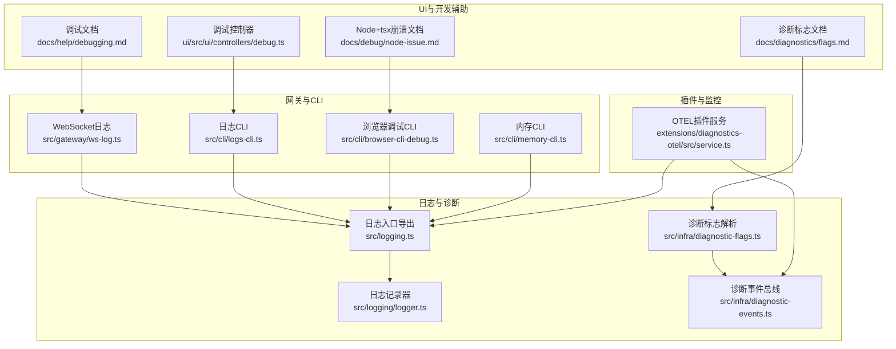
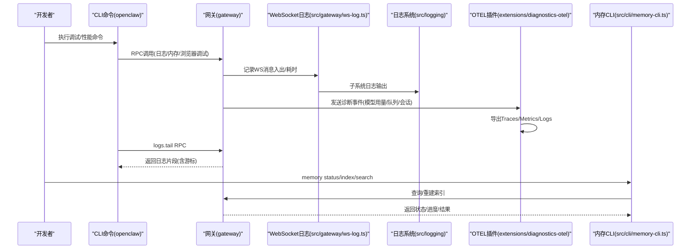
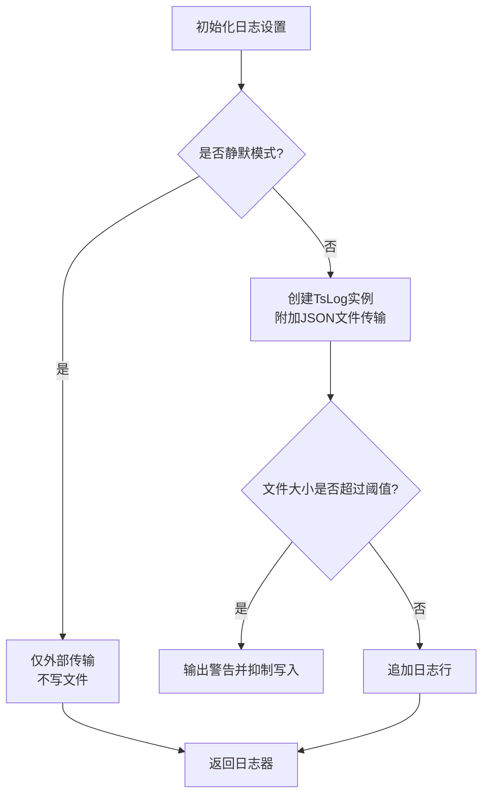
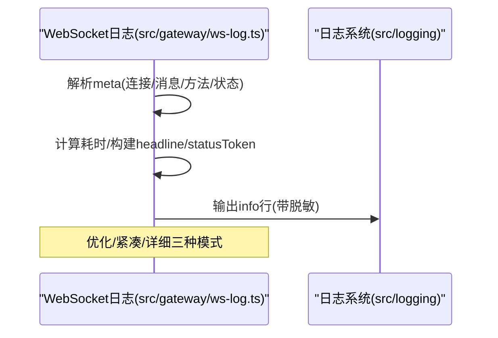
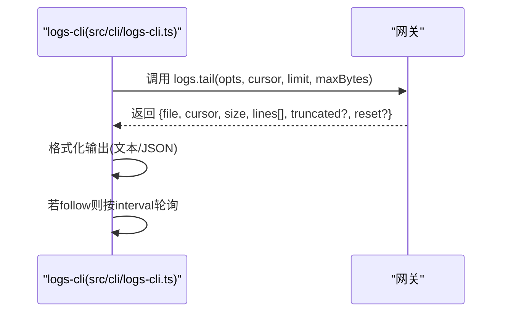
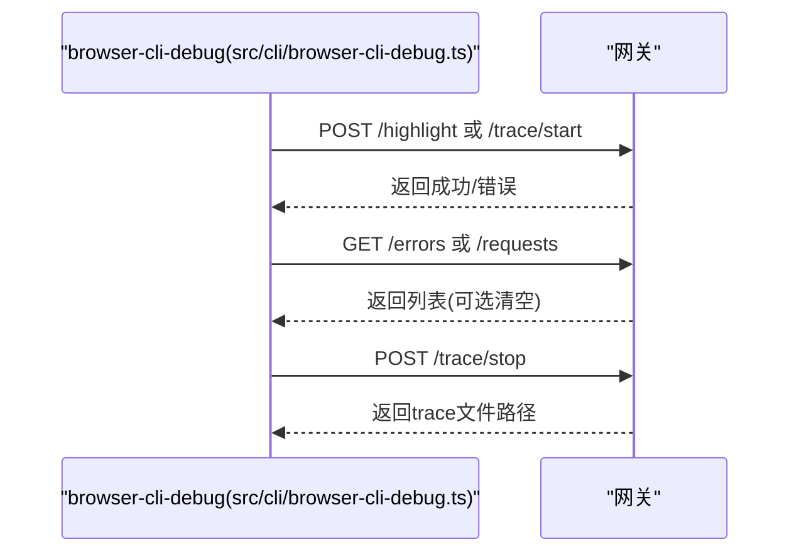
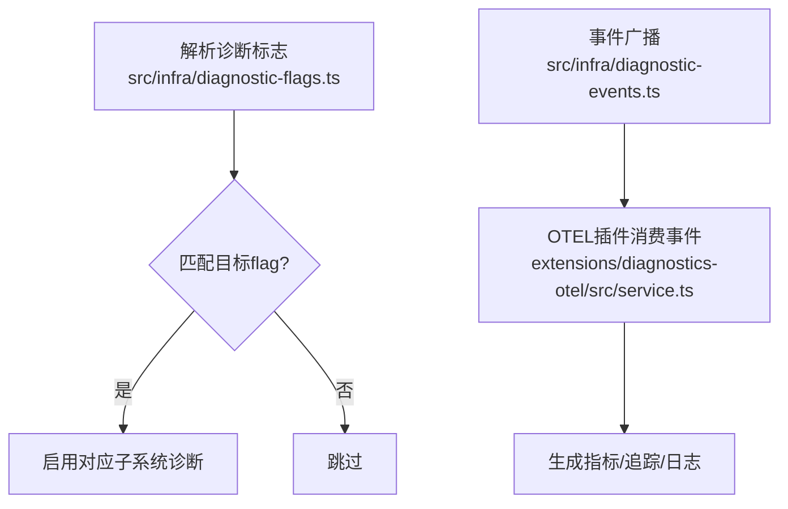
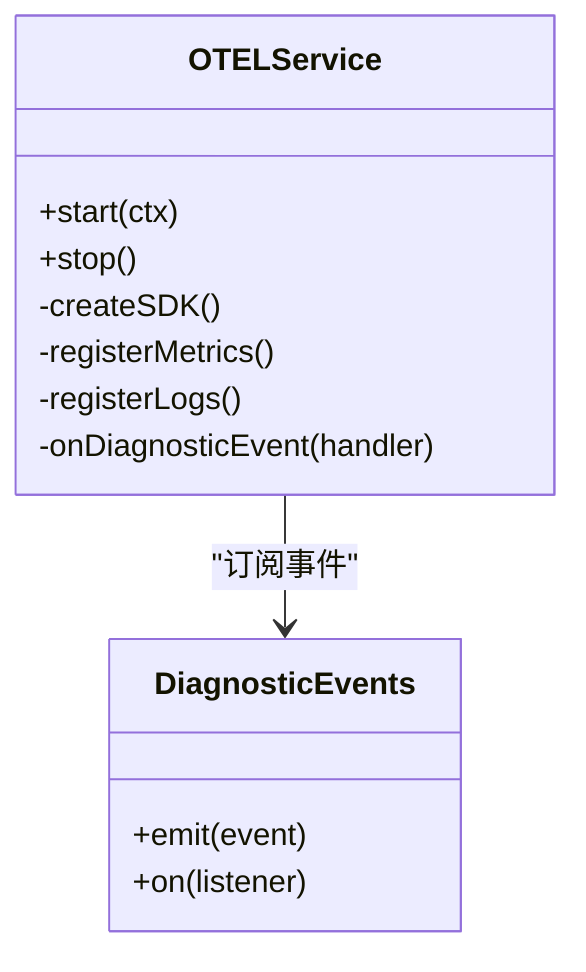
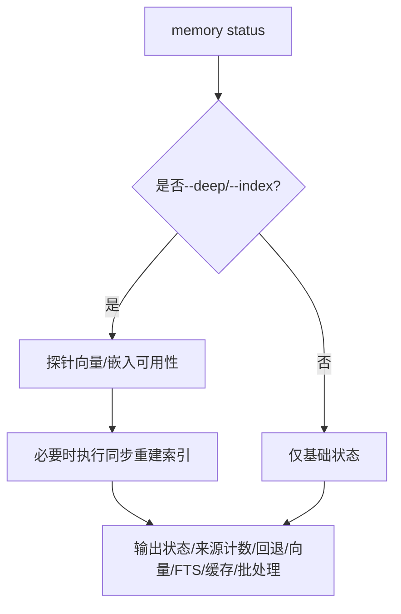
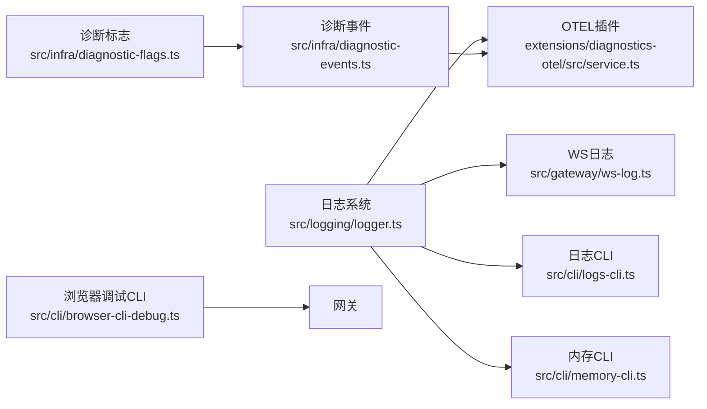

# 调试与性能分析

<cite>
**本文引用的文件**
- [src/logging/logger.ts](file://src/logging/logger.ts)
- [src/logging.ts](file://src/logging.ts)
- [src/gateway/ws-log.ts](file://src/gateway/ws-log.ts)
- [src/cli/logs-cli.ts](file://src/cli/logs-cli.ts)
- [src/cli/browser-cli-debug.ts](file://src/cli/browser-cli-debug.ts)
- [src/cli/memory-cli.ts](file://src/cli/memory-cli.ts)
- [extensions/diagnostics-otel/src/service.ts](file://extensions/diagnostics-otel/src/service.ts)
- [src/infra/diagnostic-flags.ts](file://src/infra/diagnostic-flags.ts)
- [src/infra/diagnostic-events.ts](file://src/infra/diagnostic-events.ts)
- [docs/diagnostics/flags.md](file://docs/diagnostics/flags.md)
- [docs/help/debugging.md](file://docs/help/debugging.md)
- [docs/debug/node-issue.md](file://docs/debug/node-issue.md)
- [ui/src/ui/controllers/debug.ts](file://ui/src/ui/controllers/debug.ts)
</cite>

## 目录
1. [简介](#简介)
2. [项目结构](#项目结构)
3. [核心组件](#核心组件)
4. [架构总览](#架构总览)
5. [详细组件分析](#详细组件分析)
6. [依赖关系分析](#依赖关系分析)
7. [性能考量](#性能考量)
8. [故障排查指南](#故障排查指南)
9. [结论](#结论)
10. [附录](#附录)

## 简介
本指南面向OpenClaw的调试与性能分析场景，覆盖日志系统、诊断标志、WebSocket连接调试、HTTP API调试、插件调试、性能瓶颈定位、内存与CPU分析、生产环境调试与监控告警、常见问题与优化建议等。文档以仓库内现有实现与文档为依据，提供可操作的步骤、流程图与最佳实践。

## 项目结构
围绕调试与性能分析的关键模块包括：
- 日志系统：统一的日志记录器、控制台与文件输出、子系统日志、外部传输
- WebSocket日志：网关侧WS消息入出日志、耗时统计、脱敏与格式化
- CLI日志查看：RPC拉取网关日志、分页游标、本地时间显示、JSON输出
- 浏览器调试CLI：Playwright Trace录制、网络请求与页面错误收集
- 诊断标志与事件：按需启用的诊断标志、诊断事件广播与订阅
- 插件OTEL导出：OpenTelemetry指标/追踪/日志导出，结合诊断事件
- 内存与索引：内存状态、向量化可用性探测、索引重建与进度可视化
- 开发辅助：原始流日志、watch模式、运行时调试命令

图表来源
- [src/logging/logger.ts:1-348](file://src/logging/logger.ts#L1-L348)
- [src/logging.ts:1-70](file://src/logging.ts#L1-L70)
- [src/infra/diagnostic-flags.ts:1-93](file://src/infra/diagnostic-flags.ts#L1-L93)
- [src/infra/diagnostic-events.ts:1-243](file://src/infra/diagnostic-events.ts#L1-L243)
- [src/gateway/ws-log.ts:1-439](file://src/gateway/ws-log.ts#L1-L439)
- [src/cli/logs-cli.ts:1-330](file://src/cli/logs-cli.ts#L1-L330)
- [src/cli/browser-cli-debug.ts:1-233](file://src/cli/browser-cli-debug.ts#L1-L233)
- [src/cli/memory-cli.ts:1-818](file://src/cli/memory-cli.ts#L1-L818)
- [extensions/diagnostics-otel/src/service.ts:1-686](file://extensions/diagnostics-otel/src/service.ts#L1-L686)
- [docs/diagnostics/flags.md:1-92](file://docs/diagnostics/flags.md#L1-L92)
- [docs/help/debugging.md:1-163](file://docs/help/debugging.md#L1-L163)
- [docs/debug/node-issue.md:1-86](file://docs/debug/node-issue.md#L1-L86)
- [ui/src/ui/controllers/debug.ts:45-60](file://ui/src/ui/controllers/debug.ts#L45-L60)

章节来源
- [src/logging/logger.ts:1-348](file://src/logging/logger.ts#L1-L348)
- [src/logging.ts:1-70](file://src/logging.ts#L1-L70)
- [src/gateway/ws-log.ts:1-439](file://src/gateway/ws-log.ts#L1-L439)
- [src/cli/logs-cli.ts:1-330](file://src/cli/logs-cli.ts#L1-L330)
- [src/cli/browser-cli-debug.ts:1-233](file://src/cli/browser-cli-debug.ts#L1-L233)
- [src/cli/memory-cli.ts:1-818](file://src/cli/memory-cli.ts#L1-L818)
- [extensions/diagnostics-otel/src/service.ts:1-686](file://extensions/diagnostics-otel/src/service.ts#L1-L686)
- [src/infra/diagnostic-flags.ts:1-93](file://src/infra/diagnostic-flags.ts#L1-L93)
- [src/infra/diagnostic-events.ts:1-243](file://src/infra/diagnostic-events.ts#L1-L243)
- [docs/diagnostics/flags.md:1-92](file://docs/diagnostics/flags.md#L1-L92)
- [docs/help/debugging.md:1-163](file://docs/help/debugging.md#L1-L163)
- [docs/debug/node-issue.md:1-86](file://docs/debug/node-issue.md#L1-L86)
- [ui/src/ui/controllers/debug.ts:45-60](file://ui/src/ui/controllers/debug.ts#L45-L60)

## 核心组件
- 日志系统
  - 统一TsLog适配器，支持文件滚动、大小上限、外部传输注册、子系统日志、pino风格包装
  - 控制台与文件输出分离，支持JSONL日志、敏感信息脱敏、时间戳格式化
- WebSocket日志
  - 记录请求/响应/事件，自动脱敏、耗时计算、紧凑/优化模式、连接与消息ID短ID化
- CLI日志查看
  - 通过RPC从网关拉取日志，支持分页游标、截断提示、本地时间显示、JSON输出
- 浏览器调试CLI
  - Highlight元素、获取页面错误、网络请求列表、启动/停止Playwright Trace并导出ZIP
- 诊断标志与事件
  - 通过环境变量或配置启用特定子系统诊断；事件总线广播关键运行期事件（模型用量、Webhook、消息队列、会话状态等）
- OTEL插件
  - 按配置导出Traces/Metrics/Logs至OTLP端点，结合诊断事件生成指标与span
- 内存CLI
  - 探测向量/嵌入可用性、扫描源文件、重建索引、进度与ETA展示
- 开发辅助
  - 原始流日志、watch模式、运行时调试命令、Node+tsx兼容性问题处理

章节来源
- [src/logging/logger.ts:1-348](file://src/logging/logger.ts#L1-L348)
- [src/logging.ts:1-70](file://src/logging.ts#L1-L70)
- [src/gateway/ws-log.ts:1-439](file://src/gateway/ws-log.ts#L1-L439)
- [src/cli/logs-cli.ts:1-330](file://src/cli/logs-cli.ts#L1-L330)
- [src/cli/browser-cli-debug.ts:1-233](file://src/cli/browser-cli-debug.ts#L1-L233)
- [src/infra/diagnostic-flags.ts:1-93](file://src/infra/diagnostic-flags.ts#L1-L93)
- [src/infra/diagnostic-events.ts:1-243](file://src/infra/diagnostic-events.ts#L1-L243)
- [extensions/diagnostics-otel/src/service.ts:1-686](file://extensions/diagnostics-otel/src/service.ts#L1-L686)
- [src/cli/memory-cli.ts:1-818](file://src/cli/memory-cli.ts#L1-L818)
- [docs/diagnostics/flags.md:1-92](file://docs/diagnostics/flags.md#L1-L92)
- [docs/help/debugging.md:1-163](file://docs/help/debugging.md#L1-L163)
- [docs/debug/node-issue.md:1-86](file://docs/debug/node-issue.md#L1-L86)
- [ui/src/ui/controllers/debug.ts:45-60](file://ui/src/ui/controllers/debug.ts#L45-L60)

## 架构总览
下图展示了调试与性能分析相关模块之间的交互关系，以及数据流向。

图表来源
- [src/gateway/ws-log.ts:256-314](file://src/gateway/ws-log.ts#L256-L314)
- [src/logging/logger.ts:126-184](file://src/logging/logger.ts#L126-L184)
- [extensions/diagnostics-otel/src/service.ts:137-156](file://extensions/diagnostics-otel/src/service.ts#L137-L156)
- [src/cli/logs-cli.ts:45-62](file://src/cli/logs-cli.ts#L45-L62)
- [src/cli/memory-cli.ts:335-574](file://src/cli/memory-cli.ts#L335-L574)

## 详细组件分析

### 日志系统与子系统日志
- 文件日志
  - 默认滚动文件名，按日期生成；支持最大文件大小限制，超限抑制写入并输出警告
  - 外部传输注册，便于插件或第三方系统接入
- 控制台日志
  - 子系统过滤、时间戳前缀、颜色主题、ANSI样式控制
- 敏感信息脱敏
  - 统一脱敏策略，避免在日志中泄露敏感内容
- pino风格包装
  - 兼容下游依赖，提供child logger与常用级别方法

图表来源
- [src/logging/logger.ts:73-106](file://src/logging/logger.ts#L73-L106)
- [src/logging/logger.ts:126-184](file://src/logging/logger.ts#L126-L184)
- [src/logging/logger.ts:193-208](file://src/logging/logger.ts#L193-L208)

章节来源
- [src/logging/logger.ts:1-348](file://src/logging/logger.ts#L1-L348)
- [src/logging.ts:1-70](file://src/logging.ts#L1-L70)

### WebSocket连接调试
- 记录方向、类型(kind)、方法(method)、事件(event)、耗时(ms)、连接与消息ID短ID化
- 三种日志风格：优化模式(仅慢响应/失败)、紧凑模式(按连接聚合)、详细模式(逐条)
- 自动脱敏，避免敏感字段外泄

图表来源
- [src/gateway/ws-log.ts:256-314](file://src/gateway/ws-log.ts#L256-L314)
- [src/gateway/ws-log.ts:316-378](file://src/gateway/ws-log.ts#L316-L378)
- [src/gateway/ws-log.ts:380-439](file://src/gateway/ws-log.ts#L380-L439)

章节来源
- [src/gateway/ws-log.ts:1-439](file://src/gateway/ws-log.ts#L1-L439)

### HTTP API调试（日志CLI）
- 通过RPC调用网关的logs.tail，支持limit/max-bytes、follow、interval、本地时间显示、JSON输出
- 断线/不可达时输出友好提示与连接详情

图表来源
- [src/cli/logs-cli.ts:45-62](file://src/cli/logs-cli.ts#L45-L62)
- [src/cli/logs-cli.ts:218-328](file://src/cli/logs-cli.ts#L218-L328)

章节来源
- [src/cli/logs-cli.ts:1-330](file://src/cli/logs-cli.ts#L1-L330)

### 浏览器调试（Playwright Trace与网络/错误）
- highlight：高亮元素引用
- errors：读取并可选清空最近页面错误
- requests：读取并可选清空最近网络请求（方法/状态/URL/失败原因）
- trace start/stop：启动/停止录制并导出ZIP，支持目标CDP target、截图/快照/源码开关

图表来源
- [src/cli/browser-cli-debug.ts:71-96](file://src/cli/browser-cli-debug.ts#L71-L96)
- [src/cli/browser-cli-debug.ts:98-176](file://src/cli/browser-cli-debug.ts#L98-L176)
- [src/cli/browser-cli-debug.ts:178-232](file://src/cli/browser-cli-debug.ts#L178-L232)

章节来源
- [src/cli/browser-cli-debug.ts:1-233](file://src/cli/browser-cli-debug.ts#L1-L233)

### 诊断标志与事件
- 诊断标志
  - 支持配置与环境变量覆盖，通配符匹配，多值去重
  - 文档说明启用方式、日志落盘位置、提取与过滤方法
- 诊断事件
  - 事件总线广播模型用量、Webhook收发/处理/错误、消息队列、会话状态/卡住、运行尝试、心跳等
  - 递归保护与监听器异常隔离

图表来源
- [src/infra/diagnostic-flags.ts:44-92](file://src/infra/diagnostic-flags.ts#L44-L92)
- [src/infra/diagnostic-events.ts:195-227](file://src/infra/diagnostic-events.ts#L195-L227)
- [extensions/diagnostics-otel/src/service.ts:619-664](file://extensions/diagnostics-otel/src/service.ts#L619-L664)

章节来源
- [src/infra/diagnostic-flags.ts:1-93](file://src/infra/diagnostic-flags.ts#L1-L93)
- [src/infra/diagnostic-events.ts:1-243](file://src/infra/diagnostic-events.ts#L1-L243)
- [docs/diagnostics/flags.md:1-92](file://docs/diagnostics/flags.md#L1-L92)
- [extensions/diagnostics-otel/src/service.ts:1-686](file://extensions/diagnostics-otel/src/service.ts#L1-L686)

### 插件调试（OTEL导出）
- 配置项：协议(http/protobuf)、端点、头部、服务名、采样率、flush间隔、功能开关(traces/metrics/logs)
- 指标与span：令牌用量、成本、运行时长、上下文窗口、Webhook收发/处理/错误、消息队列深度/等待、会话状态/卡住、运行尝试、心跳
- 日志脱敏：对导出属性与消息进行脱敏

图表来源
- [extensions/diagnostics-otel/src/service.ts:72-104](file://extensions/diagnostics-otel/src/service.ts#L72-L104)
- [extensions/diagnostics-otel/src/service.ts:167-242](file://extensions/diagnostics-otel/src/service.ts#L167-L242)
- [extensions/diagnostics-otel/src/service.ts:260-366](file://extensions/diagnostics-otel/src/service.ts#L260-L366)
- [src/infra/diagnostic-events.ts:195-227](file://src/infra/diagnostic-events.ts#L195-L227)

章节来源
- [extensions/diagnostics-otel/src/service.ts:1-686](file://extensions/diagnostics-otel/src/service.ts#L1-L686)
- [src/infra/diagnostic-events.ts:1-243](file://src/infra/diagnostic-events.ts#L1-L243)

### 内存与索引调试
- 状态检查：提供商、模型、源文件、向量化/全文检索可用性、缓存/批处理状态
- 深度探测：嵌入可用性探针、强制重建索引、进度与ETA展示
- 问题扫描：源文件/目录可读性、缺失项、索引文件大小校验

图表来源
- [src/cli/memory-cli.ts:335-574](file://src/cli/memory-cli.ts#L335-L574)
- [src/cli/memory-cli.ts:698-744](file://src/cli/memory-cli.ts#L698-L744)

章节来源
- [src/cli/memory-cli.ts:1-818](file://src/cli/memory-cli.ts#L1-L818)

### 开发工具链与运行时调试
- 原始流日志：OpenClaw与pi-mono分别提供原始流/块日志开关与输出路径
- Watch模式：文件监视重启网关，适合迭代调试
- 运行时调试命令：/debug动态覆盖配置（需开启），支持show/set/unset/reset
- UI调试：通过WebSocket客户端调用debug方法，传参与结果JSON化

章节来源
- [docs/help/debugging.md:1-163](file://docs/help/debugging.md#L1-L163)
- [ui/src/ui/controllers/debug.ts:45-60](file://ui/src/ui/controllers/debug.ts#L45-L60)

## 依赖关系分析
- 日志系统被多处模块依赖：WebSocket日志、CLI日志、OTEL插件、内存CLI等
- 诊断事件作为跨模块事件总线，OTEL插件订阅并转换为指标/追踪/日志
- 浏览器调试CLI与网关通信，不直接依赖日志系统但可配合日志定位问题
- 诊断标志解析为条件启用提供输入，影响日志与事件粒度

图表来源
- [src/logging/logger.ts:1-348](file://src/logging/logger.ts#L1-L348)
- [src/gateway/ws-log.ts:1-439](file://src/gateway/ws-log.ts#L1-L439)
- [src/cli/logs-cli.ts:1-330](file://src/cli/logs-cli.ts#L1-L330)
- [src/cli/browser-cli-debug.ts:1-233](file://src/cli/browser-cli-debug.ts#L1-L233)
- [src/cli/memory-cli.ts:1-818](file://src/cli/memory-cli.ts#L1-L818)
- [src/infra/diagnostic-flags.ts:1-93](file://src/infra/diagnostic-flags.ts#L1-L93)
- [src/infra/diagnostic-events.ts:1-243](file://src/infra/diagnostic-events.ts#L1-L243)
- [extensions/diagnostics-otel/src/service.ts:1-686](file://extensions/diagnostics-otel/src/service.ts#L1-L686)

章节来源
- [src/logging/logger.ts:1-348](file://src/logging/logger.ts#L1-L348)
- [src/gateway/ws-log.ts:1-439](file://src/gateway/ws-log.ts#L1-L439)
- [src/cli/logs-cli.ts:1-330](file://src/cli/logs-cli.ts#L1-L330)
- [src/cli/browser-cli-debug.ts:1-233](file://src/cli/browser-cli-debug.ts#L1-L233)
- [src/cli/memory-cli.ts:1-818](file://src/cli/memory-cli.ts#L1-L818)
- [src/infra/diagnostic-flags.ts:1-93](file://src/infra/diagnostic-flags.ts#L1-L93)
- [src/infra/diagnostic-events.ts:1-243](file://src/infra/diagnostic-events.ts#L1-L243)
- [extensions/diagnostics-otel/src/service.ts:1-686](file://extensions/diagnostics-otel/src/service.ts#L1-L686)

## 性能考量
- 日志开销控制
  - 使用子系统过滤与诊断标志，避免全局verbose导致IO放大
  - 文件大小上限与滚动清理，防止磁盘压力
- WebSocket日志
  - 优化模式仅输出慢响应/失败，降低控制台噪声
  - 紧凑模式按连接聚合，减少重复信息
- OTEL导出
  - 采样率可控，避免高吞吐场景下的导出压力
  - flush间隔配置，平衡实时性与网络负载
- 内存与索引
  - 深度探测与重建索引时启用进度与ETA，便于评估耗时
  - 批处理/缓存状态可指导优化方向

章节来源
- [src/gateway/ws-log.ts:316-378](file://src/gateway/ws-log.ts#L316-L378)
- [extensions/diagnostics-otel/src/service.ts:127-134](file://extensions/diagnostics-otel/src/service.ts#L127-L134)
- [src/cli/memory-cli.ts:661-686](file://src/cli/memory-cli.ts#L661-L686)

## 故障排查指南
- Node + tsx “__name is not a function”崩溃
  - 现象：Node 25.x + tsx 在加载某些模块时缺少 __name 辅助函数
  - 处理：使用Bun或tsc watch + 编译产物运行；确认Node LTS版本；避免在受影响版本下使用tsx
- 浏览器调试
  - 使用errors/requests命令快速定位页面错误与网络异常
  - 通过trace start/stop导出Trace，结合日志定位问题
- 日志查看
  - 使用logs --follow实时跟踪；--json便于脚本处理
  - 结合诊断标志与提取命令筛选目标子系统日志
- 诊断事件
  - 启用诊断标志后，关注模型用量、Webhook错误、消息队列积压、会话卡住等事件
  - OTEL导出可将事件转化为可观测指标与追踪

章节来源
- [docs/debug/node-issue.md:1-86](file://docs/debug/node-issue.md#L1-L86)
- [src/cli/browser-cli-debug.ts:98-176](file://src/cli/browser-cli-debug.ts#L98-L176)
- [src/cli/logs-cli.ts:218-328](file://src/cli/logs-cli.ts#L218-L328)
- [docs/diagnostics/flags.md:65-85](file://docs/diagnostics/flags.md#L65-L85)
- [src/infra/diagnostic-events.ts:195-227](file://src/infra/diagnostic-events.ts#L195-L227)
- [extensions/diagnostics-otel/src/service.ts:619-664](file://extensions/diagnostics-otel/src/service.ts#L619-L664)

## 结论
通过统一的日志系统、精细化的诊断标志、丰富的CLI调试工具与OTEL可观测能力，OpenClaw提供了从开发到生产的全链路调试与性能分析方案。建议在问题复现阶段优先启用诊断标志与原始流日志，结合WS日志与浏览器Trace定位前端/网络问题，再利用OTEL指标与事件进行根因分析与回归验证。

## 附录
- 常用命令参考
  - 日志查看：openclaw logs [--follow] [--json] [--local-time]
  - 浏览器调试：openclaw browser errors/requests/highlight/trace start/stop
  - 内存调试：openclaw memory status [--deep] [--index] [--force]
  - 开发辅助：watch模式、原始流日志开关、/debug运行时覆盖
- 生产环境建议
  - 仅启用必要的诊断标志，避免日志风暴
  - 配置OTEL采样率与flush间隔，控制导出开销
  - 使用日志CLI与OTEL指标建立告警基线