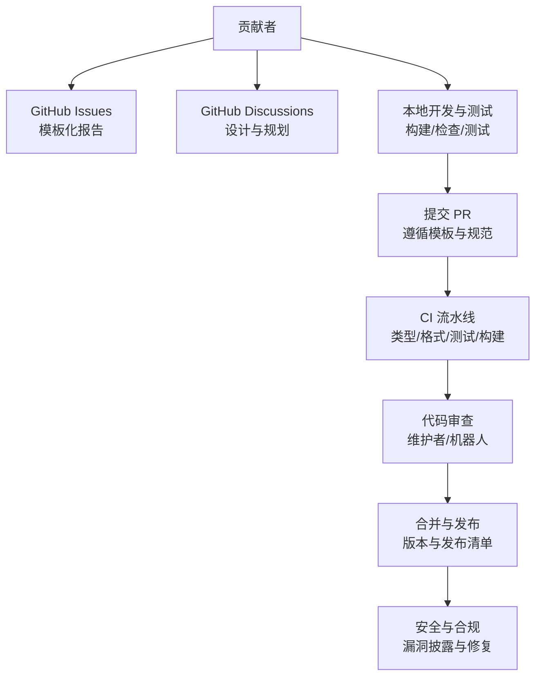
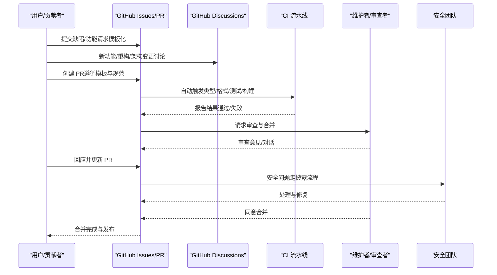
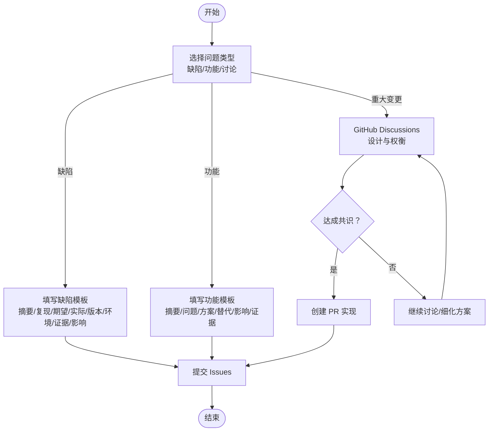
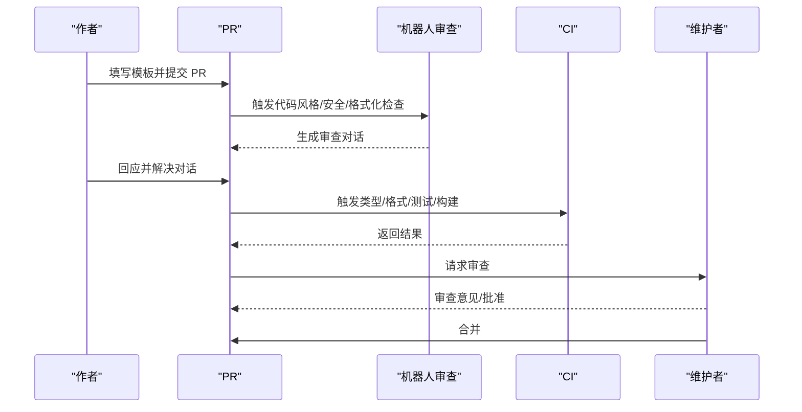
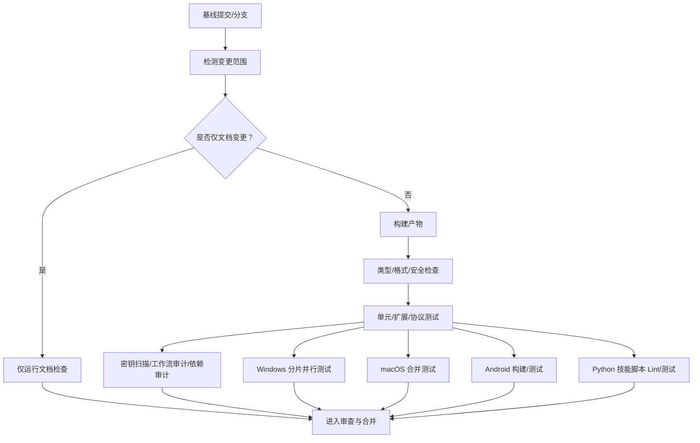
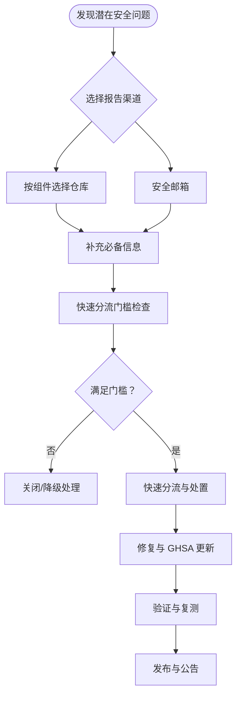
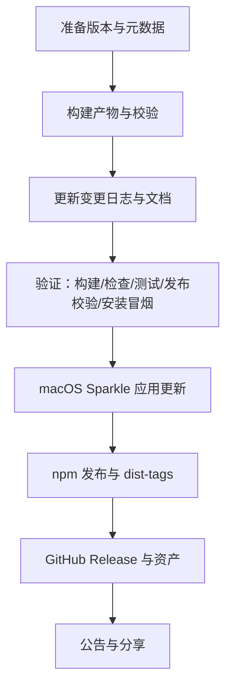
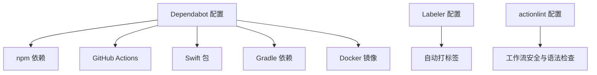

# 贡献流程与协作

<cite>
**本文引用的文件**
- [CONTRIBUTING.md](file://CONTRIBUTING.md)
- [SECURITY.md](file://SECURITY.md)
- [README.md](file://README.md)
- [.github/pull_request_template.md](file://.github/pull_request_template.md)
- [.github/dependabot.yml](file://.github/dependabot.yml)
- [.github/labeler.yml](file://.github/labeler.yml)
- [.github/workflows/ci.yml](file://.github/workflows/ci.yml)
- [.github/workflows/auto-response.yml](file://.github/workflows/auto-response.yml)
- [.github/workflows/labeler.yml](file://.github/workflows/labeler.yml)
- [.github/workflows/stale.yml](file://.github/workflows/stale.yml)
- [.github/workflows/workflow-sanity.yml](file://.github/workflows/workflow-sanity.yml)
- [.github/actionlint.yaml](file://.github/actionlint.yaml)
- [VISION.md](file://VISION.md)
- [.github/ISSUE_TEMPLATE/bug_report.yml](file://.github/ISSUE_TEMPLATE/bug_report.yml)
- [.github/ISSUE_TEMPLATE/feature_request.yml](file://.github/ISSUE_TEMPLATE/feature_request.yml)
- [.github/ISSUE_TEMPLATE/config.yml](file://.github/ISSUE_TEMPLATE/config.yml)
- [docs/reference/RELEASING.md](file://docs/reference/RELEASING.md)
</cite>

## 目录
1. [简介](#简介)
2. [项目结构](#项目结构)
3. [核心组件](#核心组件)
4. [架构总览](#架构总览)
5. [详细组件分析](#详细组件分析)
6. [依赖分析](#依赖分析)
7. [性能考虑](#性能考虑)
8. [故障排查指南](#故障排查指南)
9. [结论](#结论)
10. [附录](#附录)

## 简介
本指南面向所有希望参与 OpenClaw 的贡献者，系统阐述从问题报告到 PR 合并的完整协作流程；说明 GitHub Discussions 的使用、Discord 社区参与与问题分类方法；明确 PR 创建规范、代码审查流程与 CI 检查要求；解释实验性功能开发、重构提案与架构变更的讨论流程；提供新贡献者的入门指导、维护者职责与社区行为准则；以及漏洞报告流程、安全协作与负责任披露政策。

## 项目结构
OpenClaw 是一个多语言、多平台的个人 AI 助手系统，包含核心网关、CLI、Web 控制界面、跨平台应用（macOS/iOS/Android）、大量渠道插件与技能生态。贡献流程围绕以下关键要素展开：
- 问题报告：通过 GitHub Issues 的模板化表单收集信息，便于快速定位与复现。
- 讨论与规划：在 GitHub Discussions 中发起议题，沉淀设计与权衡，再进入实现阶段。
- 开发与测试：遵循本地测试与构建规范，确保质量门禁。
- CI/CD：自动化流水线覆盖类型检查、格式化、单元测试、跨平台构建与发布校验。
- 安全与合规：严格的安全策略与负责任披露流程，保障用户数据与系统安全。
- 发布与运维：标准化版本号与发布清单，确保可追溯与可验证。

**章节来源**
- [README.md: 1-560:1-560](file://README.md#L1-L560)
- [CONTRIBUTING.md: 1-194:1-194](file://CONTRIBUTING.md#L1-L194)
- [VISION.md: 1-111:1-111](file://VISION.md#L1-L111)

## 核心组件
- 贡献入口与角色
  - GitHub Issues：缺陷、回归、崩溃与行为异常报告，使用专用模板。
  - GitHub Discussions：新功能、重构与架构变更的前期讨论与共识建立。
  - Discord：实时帮助与社区互动，问题优先在 #help 与 #users-helping-users 解决。
- PR 规范与审查
  - 使用统一的 PR 模板，明确问题背景、变更范围、影响评估与验证步骤。
  - 遵循“一次一议题”原则，避免大而杂的 PR。
  - 作者需自行跟进机器人审查对话，直至解决或留待维护者判断。
- CI/CD 与质量门禁
  - CI 流水线按变更范围智能裁剪任务，减少不必要开销。
  - 类型检查、格式化、单元测试、跨平台构建与发布校验等多维保障。
- 安全与发布
  - 安全策略与负责任披露流程，明确报告渠道、所需信息与处理路径。
  - 发布清单与版本号规范，确保可追溯与一致性。

**章节来源**
- [CONTRIBUTING.md: 79-194:79-194](file://CONTRIBUTING.md#L79-L194)
- [.github/pull_request_template.md: 1-116:1-116](file://.github/pull_request_template.md#L1-L116)
- [.github/workflows/ci.yml: 1-737:1-737](file://.github/workflows/ci.yml#L1-L737)
- [SECURITY.md: 1-288:1-288](file://SECURITY.md#L1-L288)
- [docs/reference/RELEASING.md: 1-152:1-152](file://docs/reference/RELEASING.md#L1-L152)

## 架构总览
下图展示从问题发现到 PR 合并的关键交互与决策点，体现“先讨论、后实现、再验证”的协作闭环。

**图表来源**
- [.github/workflows/ci.yml: 1-737:1-737](file://.github/workflows/ci.yml#L1-L737)
- [CONTRIBUTING.md: 79-194:79-194](file://CONTRIBUTING.md#L79-L194)
- [SECURITY.md: 1-288:1-288](file://SECURITY.md#L1-L288)

**章节来源**
- [.github/workflows/ci.yml: 1-737:1-737](file://.github/workflows/ci.yml#L1-L737)
- [CONTRIBUTING.md: 79-194:79-194](file://CONTRIBUTING.md#L79-L194)
- [SECURITY.md: 1-288:1-288](file://SECURITY.md#L1-L288)

## 详细组件分析

### 问题报告与分类
- 缺陷报告（Bug）
  - 使用专用模板，要求提供：简要摘要、可复现实例、期望与实际行为、版本、操作系统、安装方式、模型与路由链路、配置位置与上下文、日志截图与证据、影响与严重性、附加信息（如回归场景）。
  - 该模板确保问题可追踪、可复现、可验证。
- 功能请求（Feature）
  - 使用功能请求模板，要求提供：简要摘要、待解决问题与现状不足、建议方案、替代方案、影响与证据、附加信息。
  - 该模板帮助维护者理解需求背景与权衡。
- 讨论与规划
  - 对于重大变更（重构、架构调整、实验性功能），建议先在 GitHub Discussions 中发起讨论，沉淀设计思路、兼容性与风险评估，再形成 PR。

**图表来源**
- [.github/ISSUE_TEMPLATE/bug_report.yml: 1-138:1-138](file://.github/ISSUE_TEMPLATE/bug_report.yml#L1-L138)
- [.github/ISSUE_TEMPLATE/feature_request.yml: 1-71:1-71](file://.github/ISSUE_TEMPLATE/feature_request.yml#L1-L71)
- [.github/ISSUE_TEMPLATE/config.yml: 1-9:1-9](file://.github/ISSUE_TEMPLATE/config.yml#L1-L9)

**章节来源**
- [.github/ISSUE_TEMPLATE/bug_report.yml: 1-138:1-138](file://.github/ISSUE_TEMPLATE/bug_report.yml#L1-L138)
- [.github/ISSUE_TEMPLATE/feature_request.yml: 1-71:1-71](file://.github/ISSUE_TEMPLATE/feature_request.yml#L1-L71)
- [.github/ISSUE_TEMPLATE/config.yml: 1-9:1-9](file://.github/ISSUE_TEMPLATE/config.yml#L1-L9)

### PR 创建规范与审查流程
- PR 模板要点
  - 摘要：用 2–5 条描述问题、影响、变更与边界。
  - 变更类型：缺陷修复、特性、重构、文档、安全加固、运维/杂项。
  - 影响范围：网关/工具执行/鉴权/存储/集成/API/协议/UI/DX/CI/CD/基础设施。
  - 关联问题/PR：关闭/关联编号。
  - 用户可见变化：列出默认值与配置变更。
  - 安全影响：权限/令牌/网络调用/命令/工具执行/数据访问是否变化及缓解。
  - 复现与验证：环境、步骤、预期/实际、证据（测试/日志/截图/性能）。
  - 人工验证：个人验证场景、边界用例与未验证内容。
  - 审查对话：确认已回复或解决机器人对话，仅保留需要维护者判断的问题。
  - 兼容性与迁移：向后兼容、配置/环境变更、迁移步骤。
  - 故障恢复：快速回退方法、需恢复的文件/配置、已知症状。
  - 风险与缓解：列出真实风险与缓解措施。
- 审查与作者责任
  - 作者负责跟进机器人审查对话，解决或解释，避免留给维护者清理。
  - 维护者在 CI 通过与作者确认后进行最终审查与合并。
- 合并策略
  - 一次一议题，避免超过约 5000 行的大型 PR。
  - 小而相关的改动鼓励合并到同一 PR，减少审查成本。

**图表来源**
- [.github/pull_request_template.md: 1-116:1-116](file://.github/pull_request_template.md#L1-L116)
- [CONTRIBUTING.md: 85-106:85-106](file://CONTRIBUTING.md#L85-L106)
- [.github/workflows/ci.yml: 139-212:139-212](file://.github/workflows/ci.yml#L139-L212)

**章节来源**
- [.github/pull_request_template.md: 1-116:1-116](file://.github/pull_request_template.md#L1-L116)
- [CONTRIBUTING.md: 85-106:85-106](file://CONTRIBUTING.md#L85-L106)
- [.github/workflows/ci.yml: 139-212:139-212](file://.github/workflows/ci.yml#L139-L212)

### CI 检查与质量门禁
- 变更范围检测
  - 通过脚本检测 PR 触达的目录，裁剪不必要的测试与构建任务，提升效率。
- 任务矩阵与并行
  - Node/Bun 并行运行单元测试；Windows 分片并行；macOS 合并为单一作业以提高队列利用率。
- 质量门禁
  - 类型检查、格式化、UI 安全策略（禁止原始 window.open）、Python 技能脚本 lint 与测试、密钥扫描、工作流审计、生产依赖审计。
- 文档检查
  - 仅当文档变更时运行文档检查，保证文档质量与链接有效性。
- 秘钥与工作流安全
  - 使用 pre-commit 检测私钥；对变更的工作流进行 zizmor 审计，降低供应链风险。

**图表来源**
- [.github/workflows/ci.yml: 15-78:15-78](file://.github/workflows/ci.yml#L15-L78)
- [.github/workflows/ci.yml: 139-737:139-737](file://.github/workflows/ci.yml#L139-L737)

**章节来源**
- [.github/workflows/ci.yml: 15-78:15-78](file://.github/workflows/ci.yml#L15-L78)
- [.github/workflows/ci.yml: 139-737:139-737](file://.github/workflows/ci.yml#L139-L737)

### 安全协作与负责任披露
- 报告渠道
  - 按受影响子系统选择对应仓库或通过安全邮箱路由。
- 必备信息
  - 标题、严重性评估、影响、受影响组件、技术复现步骤、已证明影响、环境、修复建议。
- 快速分流门槛
  - 包含精确脆弱路径、版本/提交 SHA、可复现 PoC、与信任边界相关的已证明影响、凭证归属证明、无操作员共用主机假设声明、不在“不在范围”内的说明、命令风险/对等差异需明确越界路径等。
- 常见误报模式
  - 仅提示注入且无越界、将显式受信任的操作视为远程注入、授权用户触发的本地动作、恶意插件在受信状态下的行为、多租户隔离假设、仅显示不同执行路径的启发式差异、依赖预置本地状态的归档/安装、替换已批准可执行路径等。
- 维护者更新 GHSA
  - 使用指定 API 版本头以确保字段持久化。
- 运营商信任模型
  - 不将单网关视为对抗性多租户边界；认证调用者被视为受信操作者；会话标识符为路由控制而非用户级授权边界；推荐每用户/每机器/每 VPS 一个网关与代理。
- 插件可信概念
  - 插件作为网关可信计算基的一部分；启用/安装插件即授予与本地代码相同的信任级别。
- 不在范围
  - 公网暴露、违背文档推荐部署、共享网关配置的互不信任操作者、仅提示注入攻击、需要写入受信本地状态的报告、仅展示受信本地技能/工作区符号链接状态的报告、仅展示同路径文件替换的报告、仅展示受信操作者启用的危险配置的报告、仅展示启发式/对等差异的报告、仅展示沙箱/工作区读取扩大的报告、仅展示主机侧执行的报告（在默认信任模型中）等。
- 运维指引
  - 本地仅回环绑定、非本地与高风险配置由 `openclaw security audit` 标记为危险；Canvas 主机仅在受信节点场景下公开；工具文件系统加固与子代理委派加固等。

**图表来源**
- [SECURITY.md: 5-46:5-46](file://SECURITY.md#L5-L46)
- [SECURITY.md: 20-46:20-46](file://SECURITY.md#L20-L46)
- [SECURITY.md: 84-102:84-102](file://SECURITY.md#L84-L102)
- [SECURITY.md: 104-131:104-131](file://SECURITY.md#L104-L131)
- [SECURITY.md: 133-152:133-152](file://SECURITY.md#L133-L152)
- [SECURITY.md: 162-171:162-171](file://SECURITY.md#L162-L171)
- [SECURITY.md: 173-180:173-180](file://SECURITY.md#L173-L180)
- [SECURITY.md: 182-188:182-188](file://SECURITY.md#L182-L188)
- [SECURITY.md: 190-205:190-205](file://SECURITY.md#L190-L205)

**章节来源**
- [SECURITY.md: 1-288:1-288](file://SECURITY.md#L1-L288)

### 发布与版本管理
- 版本号与标签
  - 稳定版：YYYY.M.D；Beta：YYYY.M.D-beta.N；Dev：main 移动头。
  - npm dist-tags：latest（稳定）、beta（预发布）。
- 发布清单
  - 版本与元数据、构建产物与校验、变更日志与文档、验证步骤（构建/检查/测试/发布校验/安装冒烟/可选端到端）、macOS Sparkle 应用更新、npm 发布与 GitHub Release、公告与分享。
- 插件发布范围
  - 仅发布已在 npm 上存在的 @openclaw 命名空间插件；未在 npm 的内置插件保持磁盘树形态。

**图表来源**
- [docs/reference/RELEASING.md: 22-121:22-121](file://docs/reference/RELEASING.md#L22-L121)

**章节来源**
- [docs/reference/RELEASING.md: 1-152:1-152](file://docs/reference/RELEASING.md#L1-L152)

### 实验性功能、重构与架构变更的讨论流程
- 建议在 GitHub Discussions 中发起议题，明确目标、范围、风险与收益。
- 与维护者与社区充分沟通，形成最小可行方案（MVP）与验收标准。
- 将讨论结果转化为 PR，遵循 PR 模板与审查流程。
- 对于可能影响安全与信任边界的变更，需在安全策略框架内进行评估与缓解。

**章节来源**
- [CONTRIBUTING.md: 81-83:81-83](file://CONTRIBUTING.md#L81-L83)
- [VISION.md: 34-40:34-40](file://VISION.md#L34-L40)

### 新贡献者入门与维护者职责
- 新贡献者
  - 从 README 的 Getting Started 入手，熟悉 CLI、网关与通道配置。
  - 遵循 Issues/PR 模板与 CI 规范，从小处着手，逐步深入。
  - 在 Discord #help 获取帮助，避免重复劳动。
- 维护者
  - 负责问题分类、审查 PR、推动合并、发布与安全响应。
  - 保持对变更范围的敏感度，利用 CI 的智能裁剪减少不必要负担。
  - 对安全问题快速响应与修复，并在必要时进行负责任披露。

**章节来源**
- [README.md: 26-31:26-31](file://README.md#L26-L31)
- [CONTRIBUTING.md: 12-78:12-78](file://CONTRIBUTING.md#L12-L78)
- [.github/workflows/ci.yml: 15-78:15-78](file://.github/workflows/ci.yml#L15-L78)

## 依赖分析
- 依赖自动更新
  - Dependabot 配置按生态（npm、GitHub Actions、Swift、Gradle、Docker）分组与冷却策略，限制同时打开的 PR 数量，避免过度打扰。
- 标签器
  - 基于变更文件自动打标签，便于跨模块问题追踪与分配。
- 工作流安全
  - actionlint 配置自托管 Runner 标签白名单与忽略规则，确保工作流语法与安全策略一致。

**图表来源**
- [.github/dependabot.yml: 1-128:1-128](file://.github/dependabot.yml#L1-L128)
- [.github/labeler.yml: 1-259:1-259](file://.github/labeler.yml#L1-L259)
- [.github/actionlint.yaml: 1-24:1-24](file://.github/actionlint.yaml#L1-L24)

**章节来源**
- [.github/dependabot.yml: 1-128:1-128](file://.github/dependabot.yml#L1-L128)
- [.github/labeler.yml: 1-259:1-259](file://.github/labeler.yml#L1-L259)
- [.github/actionlint.yaml: 1-24:1-24](file://.github/actionlint.yaml#L1-L24)

## 性能考虑
- CI 智能裁剪：根据变更范围决定运行哪些任务，减少不必要资源消耗。
- 并行与分片：Windows 测试分片并行，macOS 合并作业以提高队列利用率。
- 内存与稳定性：CI 中设置合理的堆大小与并发参数，避免 OOM 与不稳定。
- 依赖更新策略：按生态分组与冷却策略，平衡安全性与稳定性。

**章节来源**
- [.github/workflows/ci.yml: 15-78:15-78](file://.github/workflows/ci.yml#L15-L78)
- [.github/workflows/ci.yml: 329-453:329-453](file://.github/workflows/ci.yml#L329-L453)
- [.github/workflows/ci.yml: 458-530:458-530](file://.github/workflows/ci.yml#L458-L530)

## 故障排查指南
- 常见问题
  - CI 任务被跳过：确认是否仅文档变更或变更范围检测未命中。
  - Windows 测试不稳定：检查分片与并发设置，必要时降低并发或增加重试。
  - macOS 构建失败：检查 Xcode 版本与缓存，必要时重试构建。
  - 密钥扫描失败：使用 pre-commit 检测并移除私钥。
- 审查对话未解决：作者需自行解决或解释，避免留给维护者清理。
- 安全问题：遵循负责任披露流程，提供完整信息与复现步骤。

**章节来源**
- [.github/workflows/ci.yml: 15-78:15-78](file://.github/workflows/ci.yml#L15-L78)
- [.github/workflows/ci.yml: 329-453:329-453](file://.github/workflows/ci.yml#L329-L453)
- [.github/workflows/ci.yml: 458-530:458-530](file://.github/workflows/ci.yml#L458-L530)
- [CONTRIBUTING.md: 96-106:96-106](file://CONTRIBUTING.md#L96-L106)
- [SECURITY.md: 20-46:20-46](file://SECURITY.md#L20-L46)

## 结论
OpenClaw 的贡献流程以“先讨论、后实现、再验证”为核心，结合模板化的问题报告、严格的 PR 规范、智能化的 CI 流水线与完善的安全披露机制，确保高质量与高安全性的协同开发。新贡献者可通过 Issues 与 Discussions 快速入门，维护者则通过标签器与工作流安全工具提升协作效率与质量。

## 附录
- 社区与支持
  - GitHub：Issues/PR/Discussions
  - Discord：#help 与 #users-helping-users
  - X/Twitter：项目与维护者账号
- 维护者职责
  - 问题分类、审查 PR、推动合并、发布与安全响应。
- 行为准则
  - 尊重、开放、协作、透明。

**章节来源**
- [CONTRIBUTING.md: 12-78:12-78](file://CONTRIBUTING.md#L12-L78)
- [README.md: 493-496:493-496](file://README.md#L493-L496)