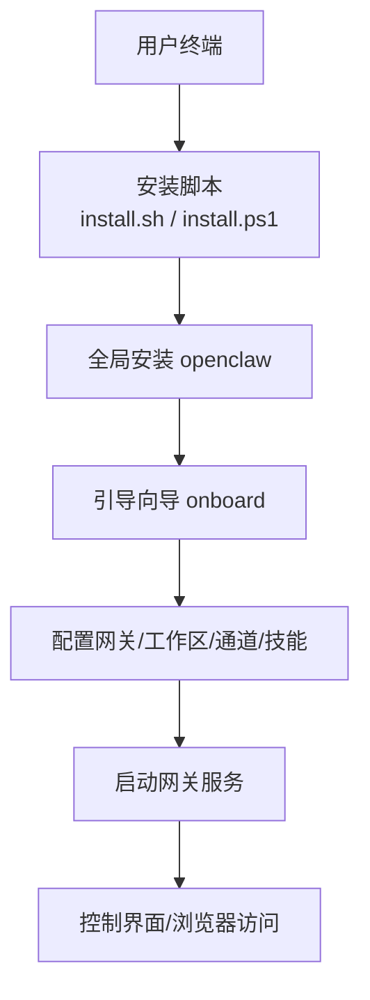
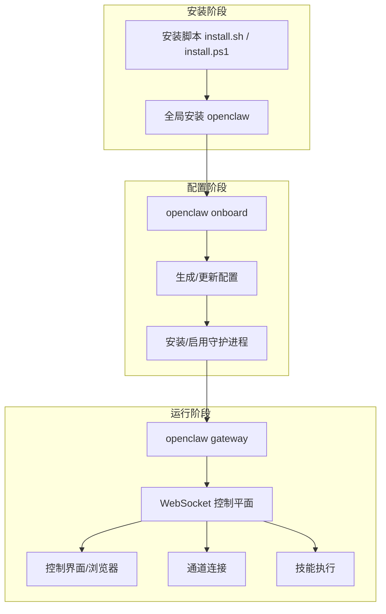

# 快速开始

<cite>
**本文引用的文件**
- [README.md](file://README.md)
- [getting-started.md](file://docs/start/getting-started.md)
- [quickstart.md](file://docs/start/quickstart.md)
- [install/index.md](file://docs/install/index.md)
- [install.sh](file://scripts/install.sh)
- [install.ps1](file://scripts/install.ps1)
- [wizard.md](file://docs/start/wizard.md)
- [onboard.md](file://docs/cli/onboard.md)
- [macos.md](file://docs/platforms/macos.md)
- [linux.md](file://docs/platforms/linux.md)
- [windows.md](file://docs/platforms/windows.md)
- [troubleshooting.md](file://docs/help/troubleshooting.md)
- [environment.md](file://docs/help/environment.md)
- [configure.md](file://docs/cli/configure.md)
</cite>

## 目录
1. [简介](#简介)
2. [项目结构](#项目结构)
3. [核心组件](#核心组件)
4. [架构总览](#架构总览)
5. [详细组件分析](#详细组件分析)
6. [依赖分析](#依赖分析)
7. [性能考虑](#性能考虑)
8. [故障排查指南](#故障排查指南)
9. [结论](#结论)
10. [附录](#附录)

## 简介
本指南面向首次接触 OpenClaw 的用户，提供从零开始的完整安装与配置流程，覆盖 macOS、Linux、Windows（WSL2）三大平台，并重点介绍基于 CLI 的“引导向导（onboarding wizard）”自动化配置路径。你将学会：
- 安装前置条件与推荐工具链
- 使用安装脚本或包管理器完成安装
- 运行引导向导以自动配置网关、工作区、通道与技能
- 验证安装是否成功
- 常见问题的诊断与修复
- 基本命令行操作与后续扩展

## 项目结构
OpenClaw 提供统一的 CLI 与多平台支持，核心安装与配置入口集中在以下位置：
- 安装与更新：docs/install/index.md、scripts/install.sh、scripts/install.ps1
- 快速开始与引导向导：docs/start/getting-started.md、docs/start/wizard.md、docs/cli/onboard.md
- 平台特定说明：docs/platforms/macos.md、docs/platforms/linux.md、docs/platforms/windows.md
- 故障排查与环境变量：docs/help/troubleshooting.md、docs/help/environment.md
- 配置与重配：docs/cli/configure.md

图表来源
- [install/index.md:34-141](file://docs/install/index.md#L34-L141)
- [install.sh:1-120](file://scripts/install.sh#L1-L120)
- [install.ps1:1-120](file://scripts/install.ps1#L1-L120)
- [getting-started.md:28-77](file://docs/start/getting-started.md#L28-L77)
- [wizard.md:10-94](file://docs/start/wizard.md#L10-L94)

章节来源
- [README.md:28-81](file://README.md#L28-L81)
- [install/index.md:14-141](file://docs/install/index.md#L14-L141)
- [getting-started.md:20-77](file://docs/start/getting-started.md#L20-L77)

## 核心组件
- CLI 命令集：openclaw onboard、openclaw gateway、openclaw dashboard、openclaw doctor、openclaw configure 等
- 引导向导（onboarding wizard）：交互式配置网关、工作区、通道与技能
- 网关（Gateway）：WebSocket 控制平面，承载会话、事件与工具
- 工作区（Workspace）：默认位于 ~/.openclaw/workspace，注入提示模板与技能
- 通道（Channels）：支持 WhatsApp、Telegram、Discord、Slack、Google Chat、Signal、iMessage、BlueBubbles、IRC、Microsoft Teams、Matrix、Feishu、LINE、Mattermost、Nextcloud Talk、Nostr、Synology Chat、Tlon、Twitch、Zalo、Zalo Personal、WebChat 等
- 技能（Skills）：可选的内置/托管/工作区技能集合

章节来源
- [README.md:318-331](file://README.md#L318-L331)
- [wizard.md:64-94](file://docs/start/wizard.md#L64-L94)
- [configure.md:8-37](file://docs/cli/configure.md#L8-L37)

## 架构总览
下图展示了从安装到首次运行的关键交互路径，以及与平台相关的差异点。

图表来源
- [install/index.md:34-141](file://docs/install/index.md#L34-L141)
- [wizard.md:10-94](file://docs/start/wizard.md#L10-L94)
- [getting-started.md:28-77](file://docs/start/getting-started.md#L28-L77)

章节来源
- [README.md:185-239](file://README.md#L185-L239)
- [getting-started.md:28-77](file://docs/start/getting-started.md#L28-L77)

## 详细组件分析

### 安装与系统要求
- 系统要求
  - Node.js 版本：≥22
  - 支持平台：macOS、Linux、Windows（强烈建议通过 WSL2）
  - 包管理器：npm、pnpm 或 bun（构建源码时推荐 pnpm）
- 推荐安装方式
  - 使用安装脚本一键安装并启动引导向导
  - 通过 npm/pnpm 全局安装后手动运行引导向导
  - 从源码构建并链接 CLI
- 平台特定注意
  - Windows：强烈建议使用 WSL2；Windows 本地安装可能遇到工具链与二进制兼容性问题
  - Linux：推荐使用 systemd 用户服务；可按需升级到系统服务
  - macOS：可选菜单栏应用作为网关代理与权限持有者

章节来源
- [install/index.md:14-141](file://docs/install/index.md#L14-L141)
- [windows.md:9-24](file://docs/platforms/windows.md#L9-L24)
- [linux.md:9-31](file://docs/platforms/linux.md#L9-L31)
- [macos.md:9-25](file://docs/platforms/macos.md#L9-L25)

### 安装脚本与包管理器安装
- 安装脚本（macOS/Linux/WSL2）
  - 自动检测/安装 Node.js（如缺失），下载并安装 openclaw，随后启动引导向导
  - 可通过参数跳过引导向导仅安装二进制
- Windows PowerShell 脚本
  - 自动检测/安装 Node.js 与 Git（如缺失），支持 npm 与 git 源两种安装模式
  - 自动将 npm 全局 bin 目录加入 PATH
- npm/pnpm 安装
  - 若已具备 Node.js，可直接全局安装 openclaw
  - pnpm 需要显式批准含构建脚本的包（例如 sharp、node-llama-cpp）

章节来源
- [install/index.md:34-141](file://docs/install/index.md#L34-L141)
- [install.sh:1-120](file://scripts/install.sh#L1-L120)
- [install.ps1:1-120](file://scripts/install.ps1#L1-L120)

### 引导向导（onboarding wizard）
- 作用
  - 交互式配置本地或远程网关、工作区、通道、守护进程与技能
  - 快速路径：QuickStart（默认值）；完整路径：Advanced（全量可选项）
- 输出内容
  - 模型与认证（API Key/OAuth/自定义提供商）
  - 工作区位置与种子文件
  - 网关端口、绑定地址、鉴权模式、Tailscale 暴露策略
  - 通道配置（允许列表/提及要求等）
  - 守护进程安装（launchd/systemd 用户服务）
  - 健康检查与技能安装
- 常用命令
  - openclaw onboard（交互式）
  - openclaw onboard --flow quickstart / manual
  - openclaw onboard --mode remote --remote-url <wss://...>
  - openclaw configure（非交互式配置）

章节来源
- [wizard.md:10-94](file://docs/start/wizard.md#L10-L94)
- [onboard.md:8-84](file://docs/cli/onboard.md#L8-L84)
- [configure.md:8-37](file://docs/cli/configure.md#L8-L37)

### 首次运行与验证
- 快速路径（无需通道）
  - openclaw dashboard 打开控制界面，即可在浏览器中发起第一次聊天
- 前台运行网关
  - openclaw gateway --port 18789
- 发送测试消息（需要已配置通道）
  - openclaw message send --target +15555550123 --message "Hello from OpenClaw"
- 状态与健康检查
  - openclaw status、openclaw gateway status、openclaw doctor、openclaw channels status --probe

章节来源
- [getting-started.md:28-102](file://docs/start/getting-started.md#L28-L102)
- [README.md:63-81](file://README.md#L63-L81)

### 平台特定安装与运行

#### macOS
- 网关服务管理
  - 通过 openclaw gateway install 启用 launchd 服务
  - 支持本地/远程模式：本地直接连接本地网关，远程通过 SSH/Tailscale 连接远端网关
- 权限与节点能力
  - 菜单栏应用负责 TCC 权限与 macOS 专属工具（Canvas、Camera、Screen、system.run）
- 状态目录建议
  - 避免放在 iCloud 或云同步目录，建议使用本地状态目录

章节来源
- [macos.md:26-49](file://docs/platforms/macos.md#L26-L49)
- [macos.md:139-145](file://docs/platforms/macos.md#L139-L145)
- [macos.md:146-164](file://docs/platforms/macos.md#L146-L164)

#### Linux
- 守护进程安装
  - openclaw onboard --install-daemon 或 openclaw gateway install
  - 推荐使用 systemd 用户服务；共享/常驻服务器可使用系统服务
- VPS 快速路径
  - 安装 Node.js → npm i -g openclaw@latest → openclaw onboard --install-daemon → ssh -N -L 18789:127.0.0.1:18789 <user>@<host> → 浏览器访问本地 127.0.0.1:18789

章节来源
- [linux.md:37-58](file://docs/platforms/linux.md#L37-L58)
- [linux.md:16-25](file://docs/platforms/linux.md#L16-L25)

#### Windows（WSL2）
- 安装建议
  - 使用 WSL2（Ubuntu 推荐），在 Linux 内部运行 CLI 与网关，获得最佳兼容性
- 自动启动链路
  - 在 WSL 中启用 linger、安装用户服务、在 Windows 中设置开机启动 WSL
- 端口转发（LAN 访问）
  - 使用 netsh portproxy 将 Windows 端口转发至 WSL IP，配合防火墙规则放通

章节来源
- [windows.md:9-24](file://docs/platforms/windows.md#L9-L24)
- [windows.md:58-101](file://docs/platforms/windows.md#L58-L101)
- [windows.md:102-146](file://docs/platforms/windows.md#L102-L146)
- [windows.md:147-199](file://docs/platforms/windows.md#L147-L199)

### 环境变量与路径
- 关键环境变量
  - OPENCLAW_HOME：覆盖内部路径解析的家目录
  - OPENCLAW_STATE_DIR：覆盖状态目录（默认 ~/.openclaw）
  - OPENCLAW_CONFIG_PATH：覆盖配置文件路径（默认 ~/.openclaw/openclaw.json）
  - OPENCLAW_LOG_LEVEL：覆盖日志级别
- 预加载顺序（从高到低）
  - 进程环境变量
  - 当前目录 .env
  - 全局 ~/.openclaw/.env
  - 配置文件中的 env 块（仅在缺失时应用）
  - 登录壳导入（可选）

章节来源
- [environment.md:104-141](file://docs/help/environment.md#L104-L141)
- [environment.md:14-23](file://docs/help/environment.md#L14-L23)

## 依赖分析
- 外部依赖
  - Node.js ≥22（安装脚本会自动处理）
  - 构建工具链（macOS：Xcode 命令行工具；Linux：build-essential、python3、make、g++、cmake 等）
  - Windows：Git、PowerShell 执行策略调整
- 组件耦合
  - 安装脚本与包管理器：安装 openclaw 后由 CLI 驱动引导向导
  - 引导向导与守护进程：向导完成后安装/启用 launchd/systemd 用户服务
  - 网关与通道：网关启动后连接各通道，通道状态影响消息流转

图表来源
- [install/index.md:34-141](file://docs/install/index.md#L34-L141)
- [wizard.md:64-94](file://docs/start/wizard.md#L64-L94)
- [linux.md:65-95](file://docs/platforms/linux.md#L65-L95)
- [macos.md:35-49](file://docs/platforms/macos.md#L35-L49)

章节来源
- [install/index.md:14-141](file://docs/install/index.md#L14-L141)
- [install.sh:568-672](file://scripts/install.sh#L568-L672)
- [install.ps1:102-149](file://scripts/install.ps1#L102-L149)

## 性能考虑
- 首次启动优化
  - 使用引导向导一次性完成配置，避免重复调试
  - 在 Linux 上优先使用 systemd 用户服务，减少启动延迟
- 日志与诊断
  - 使用 openclaw logs --follow 实时观察运行状态
  - 结合 openclaw doctor 识别阻塞性配置问题
- 远程访问
  - macOS/Tailscale：Serve/Funnel 提供安全暴露，但需保持 gateway.bind 为 loopback
  - Windows/WSL2：通过 portproxy 将 Windows 端口转发至 WSL IP，便于局域网访问

章节来源
- [README.md:213-239](file://README.md#L213-L239)
- [windows.md:102-146](file://docs/platforms/windows.md#L102-L146)

## 故障排查指南
- 三分钟快速诊断清单
  - openclaw status → openclaw status --all → openclaw gateway probe → openclaw gateway status → openclaw doctor → openclaw channels status --probe → openclaw logs --follow
- 常见问题定位
  - Dashboard/控制界面无法连接：检查网关 URL/端口、鉴权模式、是否存在设备令牌循环
  - 网关未启动/服务未运行：确认服务已安装且处于 loaded 状态，检查端口占用与鉴权绑定
  - 通道已连接但消息不流动：检查提及要求、配对/白名单、权限令牌
  - 节点已配对但工具调用失败：检查权限状态、执行审批、命令是否在允许列表
  - 浏览器工具失败：检查浏览器可执行路径、扩展附加状态、CDP 目标可达性
- 环境变量与 .env 加载顺序
  - 确保所需密钥按优先级正确注入，必要时使用 OPENCLAW_LOAD_SHELL_ENV 导入登录壳环境

章节来源
- [troubleshooting.md:13-36](file://docs/help/troubleshooting.md#L13-L36)
- [troubleshooting.md:121-148](file://docs/help/troubleshooting.md#L121-L148)
- [troubleshooting.md:151-177](file://docs/help/troubleshooting.md#L151-L177)
- [troubleshooting.md:180-205](file://docs/help/troubleshooting.md#L180-L205)
- [troubleshooting.md:208-236](file://docs/help/troubleshooting.md#L208-L236)
- [troubleshooting.md:239-266](file://docs/help/troubleshooting.md#L239-L266)
- [troubleshooting.md:269-296](file://docs/help/troubleshooting.md#L269-L296)
- [environment.md:14-23](file://docs/help/environment.md#L14-L23)

## 结论
通过安装脚本与引导向导，OpenClaw 能在三大主流平台上快速完成从安装到首次运行的全流程。建议：
- 优先使用安装脚本，自动处理 Node.js 与 openclaw 安装
- 使用引导向导完成网关、工作区、通道与守护进程的自动化配置
- 首次运行优先使用控制界面进行验证，再逐步接入各类通道
- 遇到问题时遵循“三分钟诊断清单”，结合平台特定文档与环境变量说明进行定位

## 附录

### 常用命令速查
- 安装与更新
  - curl -fsSL https://openclaw.ai/install.sh | bash
  - iwr -useb https://openclaw.ai/install.ps1 | iex
  - npm/pnpm 全局安装后运行引导向导
- 引导与配置
  - openclaw onboard
  - openclaw configure
- 首次运行
  - openclaw onboard --install-daemon
  - openclaw gateway --port 18789
  - openclaw dashboard
  - openclaw message send --target +15555550123 --message "Hello from OpenClaw"
- 健康检查
  - openclaw status
  - openclaw status --all
  - openclaw gateway status
  - openclaw doctor
  - openclaw channels status --probe
  - openclaw logs --follow

章节来源
- [install/index.md:163-180](file://docs/install/index.md#L163-L180)
- [getting-started.md:28-102](file://docs/start/getting-started.md#L28-L102)
- [onboard.md:20-84](file://docs/cli/onboard.md#L20-L84)
- [configure.md:31-37](file://docs/cli/configure.md#L31-L37)