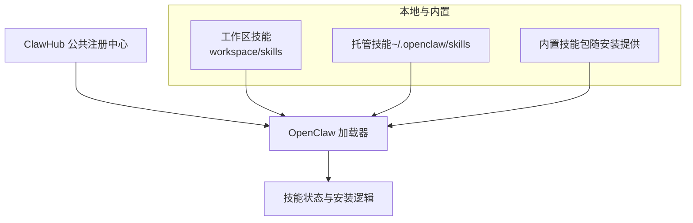
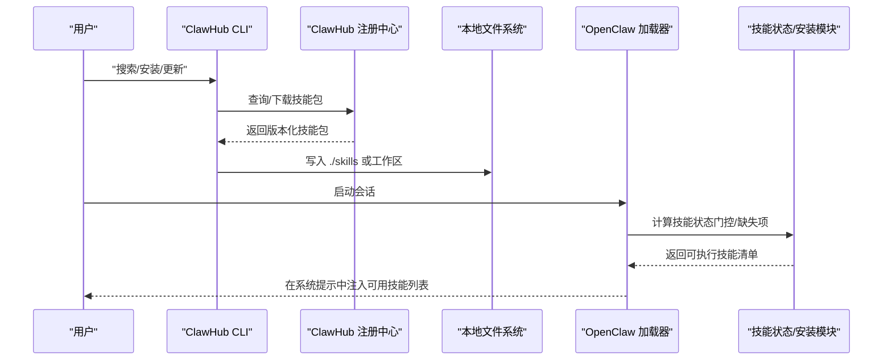
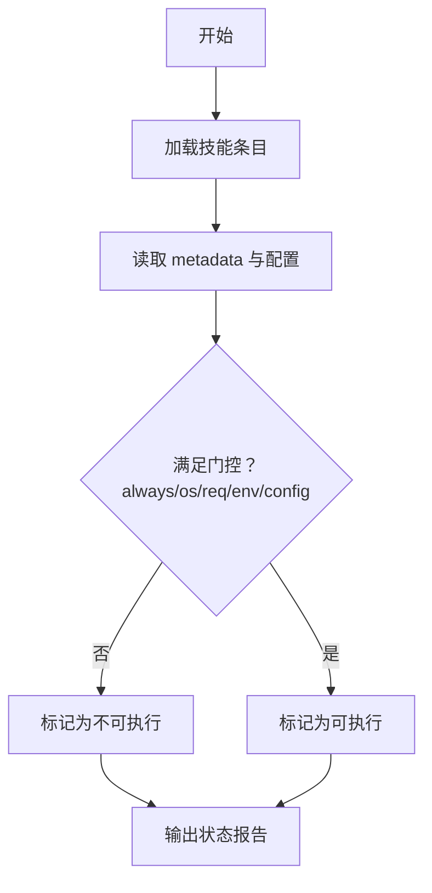
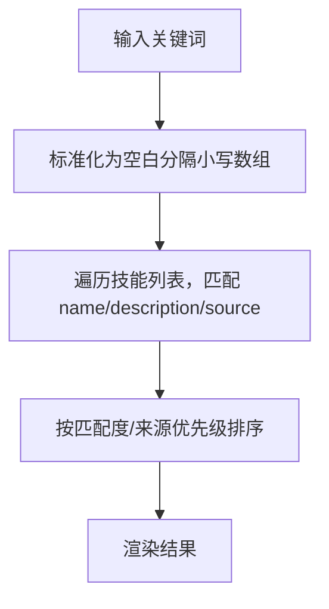
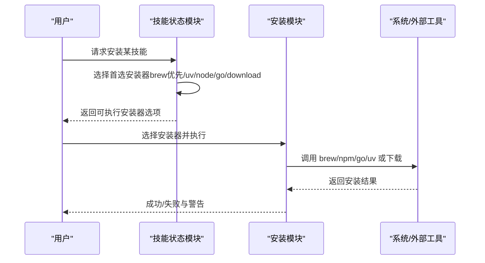
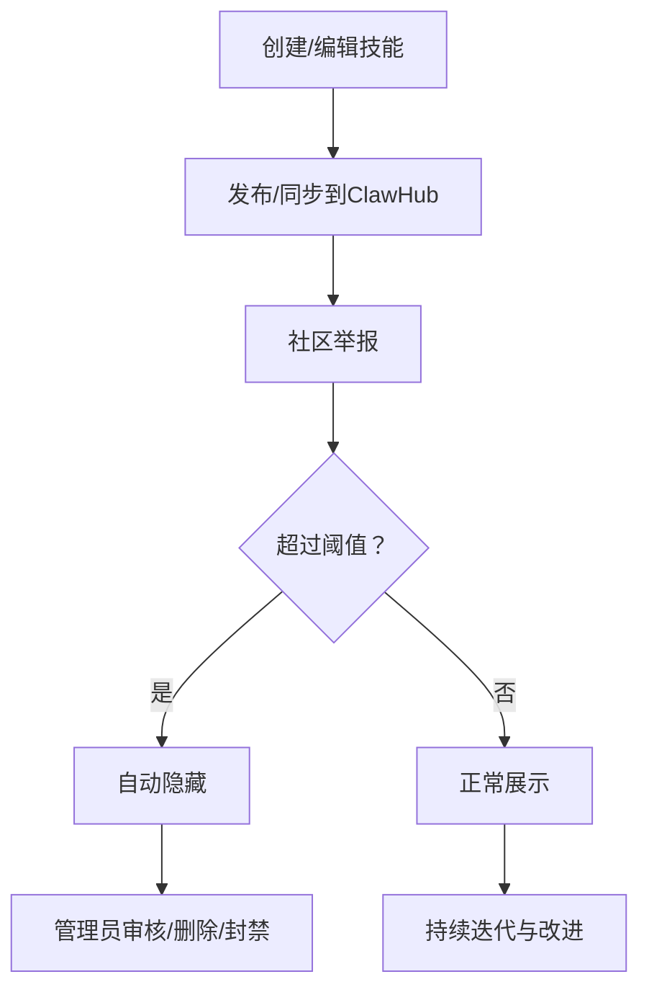
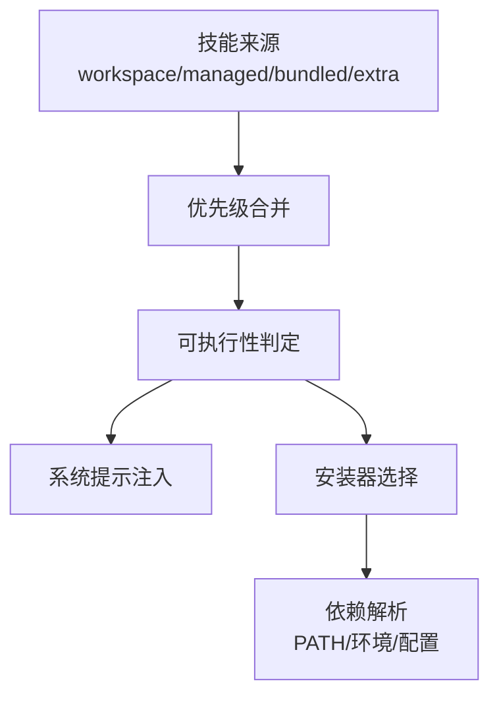

# 技能市场

<cite>
**本文引用的文件**
- [docs/tools/skills.md](file://docs/tools/skills.md)
- [docs/tools/creating-skills.md](file://docs/tools/creating-skills.md)
- [docs/tools/clawhub.md](file://docs/tools/clawhub.md)
- [docs/zh-CN/tools/clawhub.md](file://docs/zh-CN/tools/clawhub.md)
- [docs/tools/skills-config.md](file://docs/tools/skills-config.md)
- [src/agents/skills-status.ts](file://src/agents/skills-status.ts)
- [src/agents/skills-install.ts](file://src/agents/skills-install.ts)
- [src/agents/skills/filter.ts](file://src/agents/skills/filter.ts)
- [src/agents/skills/filter.test.ts](file://src/agents/skills/filter.test.ts)
- [src/agents/system-prompt.ts](file://src/agents/system-prompt.ts)
- [src/cli/skills-cli.format.ts](file://src/cli/skills-cli.format.ts)
- [ui/src/ui/views/skills.ts](file://ui/src/ui/views/skills.ts)
- [ui/src/ui/views/skills-shared.ts](file://ui/src/ui/views/skills-shared.ts)
- [skills/skill-creator/SKILL.md](file://skills/skill-creator/SKILL.md)
- [skills/](file://skills/)
</cite>

## 目录
1. [简介](#简介)
2. [项目结构](#项目结构)
3. [核心组件](#核心组件)
4. [架构总览](#架构总览)
5. [详细组件分析](#详细组件分析)
6. [依赖关系分析](#依赖关系分析)
7. [性能考量](#性能考量)
8. [故障排查指南](#故障排查指南)
9. [结论](#结论)
10. [附录](#附录)

## 简介
本指南面向OpenClaw技能市场的使用者与贡献者，系统讲解技能的发现、搜索与筛选、分类与标签、评价与审核、下载安装与版本管理、依赖解析、作者认证与质量评估、社区贡献与发布流程，以及更新通知机制。目标是帮助你在OpenClaw生态中高效地发现、安装、使用、改进并分享技能。

## 项目结构
OpenClaw的技能生态由“本地技能目录”“托管技能目录（ClawHub）”“内置技能包”三部分构成，按优先级叠加。用户可通过ClawHub进行搜索、安装、更新与发布；也可在本地工作区创建自定义技能；系统还会对技能进行加载时的环境/二进制/配置等条件过滤。

图示来源
- [docs/tools/skills.md:13-40](file://docs/tools/skills.md#L13-L40)
- [docs/tools/clawhub.md:67-72](file://docs/tools/clawhub.md#L67-L72)

章节来源
- [docs/tools/skills.md:13-40](file://docs/tools/skills.md#L13-L40)
- [docs/tools/clawhub.md:67-72](file://docs/tools/clawhub.md#L67-L72)

## 核心组件
- 技能发现与加载
  - 本地工作区、托管目录、内置包三层来源，按优先级合并。
  - 加载时基于metadata与环境/二进制/配置进行“可执行性”判定（门控）。
- 搜索与筛选
  - UI层支持按名称/描述/来源进行关键词过滤；后端提供规范化比较逻辑。
- 分类与标签
  - 技能元数据支持标签与版本；ClawHub提供语义化搜索与版本管理。
- 评价与审核
  - 星标与评论、举报与自动隐藏、管理员审核与删除。
- 下载安装与版本
  - 支持brew/npm/go/uv/download等多种安装器；支持指定版本与强制覆盖。
- 作者认证与质量评估
  - 发布需GitHub账号且有一定时长；举报阈值触发自动隐藏；维护者可审核。
- 社区贡献与发布
  - 提供发布、同步、更新等CLI命令；支持批量扫描与增量发布。
- 更新通知
  - CLI在登录状态下可上报安装统计，便于生态洞察。

章节来源
- [docs/tools/skills.md:106-188](file://docs/tools/skills.md#L106-L188)
- [docs/tools/clawhub.md:90-117](file://docs/tools/clawhub.md#L90-L117)
- [docs/tools/clawhub.md:141-221](file://docs/tools/clawhub.md#L141-L221)
- [docs/tools/skills-config.md:41-78](file://docs/tools/skills-config.md#L41-L78)

## 架构总览
下图展示从用户发起“搜索/安装/更新”，到技能被加载与执行的关键路径。

图示来源
- [docs/tools/clawhub.md:141-221](file://docs/tools/clawhub.md#L141-L221)
- [docs/tools/skills.md:287-297](file://docs/tools/skills.md#L287-L297)
- [src/agents/skills-status.ts:169-225](file://src/agents/skills-status.ts#L169-L225)
- [src/agents/system-prompt.ts:20-36](file://src/agents/system-prompt.ts#L20-L36)

## 详细组件分析

### 技能发现与门控（加载时过滤）
- 三类来源与优先级：工作区 > 托管 > 内置；额外目录最低优先级。
- 门控规则：基于metadata中的always/os/require等字段，结合PATH、环境变量、配置项进行判定。
- 可执行性：仅当满足全部要求且未被显式禁用/允许白名单限制时，技能被视为“可执行”。

图示来源
- [docs/tools/skills.md:106-188](file://docs/tools/skills.md#L106-L188)
- [src/agents/skills-status.ts:169-225](file://src/agents/skills-status.ts#L169-L225)

章节来源
- [docs/tools/skills.md:13-40](file://docs/tools/skills.md#L13-L40)
- [docs/tools/skills.md:106-188](file://docs/tools/skills.md#L106-L188)
- [src/agents/skills-status.ts:169-225](file://src/agents/skills-status.ts#L169-L225)

### 搜索、过滤与排序
- UI层支持输入关键词，按名称/描述/来源进行包含匹配。
- 后端提供规范化与去重+排序的比较函数，确保不同顺序/空白的过滤条件视为等价。

图示来源
- [ui/src/ui/views/skills.ts:28-36](file://ui/src/ui/views/skills.ts#L28-L36)
- [src/agents/skills/filter.ts:3-33](file://src/agents/skills/filter.ts#L3-L33)

章节来源
- [ui/src/ui/views/skills.ts:28-36](file://ui/src/ui/views/skills.ts#L28-L36)
- [src/agents/skills/filter.ts:3-33](file://src/agents/skills/filter.ts#L3-L33)
- [src/agents/skills/filter.test.ts:8-35](file://src/agents/skills/filter.test.ts#L8-L35)

### 分类体系、标签系统与评价机制
- 元数据与标签
  - 技能元数据支持标签、摘要、安装器等；ClawHub使用标签与版本管理。
- 语义搜索
  - 基于嵌入向量的搜索，超越关键词匹配。
- 评价与反馈
  - 星标与评论；举报触发自动隐藏；管理员审核与删除。

图示来源
- [docs/tools/clawhub.md:90-117](file://docs/tools/clawhub.md#L90-L117)
- [docs/tools/clawhub.md:141-221](file://docs/tools/clawhub.md#L141-L221)

章节来源
- [docs/tools/clawhub.md:90-117](file://docs/tools/clawhub.md#L90-L117)
- [docs/tools/clawhub.md:141-221](file://docs/tools/clawhub.md#L141-L221)

### 下载安装、版本选择与依赖解析
- 安装器类型：brew、node、go、uv、download。
- 选择策略：优先brew（若可用），否则uv、node、go，最后download；若全为download则列出全部。
- 依赖解析：检查PATH中的二进制、环境变量、配置项；远程节点可作为可执行条件之一（需允许system.run）。
- 版本管理：语义化版本、变更日志、标签（如latest）；支持指定版本安装/更新。

图示来源
- [src/agents/skills-status.ts:61-103](file://src/agents/skills-status.ts#L61-L103)
- [src/agents/skills-status.ts:105-167](file://src/agents/skills-status.ts#L105-L167)
- [src/agents/skills-install.ts:392-439](file://src/agents/skills-install.ts#L392-L439)

章节来源
- [src/agents/skills-status.ts:61-103](file://src/agents/skills-status.ts#L61-L103)
- [src/agents/skills-status.ts:105-167](file://src/agents/skills-status.ts#L105-L167)
- [src/agents/skills-install.ts:392-439](file://src/agents/skills-install.ts#L392-L439)
- [docs/tools/clawhub.md:224-237](file://docs/tools/clawhub.md#L224-L237)

### 作者认证、质量评估与社区贡献
- 认证与门槛：发布需GitHub账号且有一定时长，降低滥用风险。
- 质量评估：举报阈值触发自动隐藏；维护者可审核、删除、封禁。
- 贡献流程：发布单个技能或批量同步；支持增量更新与并发检查。

图示来源
- [docs/tools/clawhub.md:100-117](file://docs/tools/clawhub.md#L100-L117)
- [docs/tools/clawhub.md:163-186](file://docs/tools/clawhub.md#L163-L186)

章节来源
- [docs/tools/clawhub.md:100-117](file://docs/tools/clawhub.md#L100-L117)
- [docs/tools/clawhub.md:163-186](file://docs/tools/clawhub.md#L163-L186)

### 技能分享、发布审核与更新通知
- 分享与发布：支持单技能发布与批量同步；可指定slug/name/version/tags。
- 审核：管理员可见隐藏内容，可取消隐藏、删除、封禁。
- 更新通知：登录状态下，同步时可上报最小快照以统计安装次数，可禁用。

章节来源
- [docs/tools/clawhub.md:163-186](file://docs/tools/clawhub.md#L163-L186)
- [docs/tools/clawhub.md:243-258](file://docs/tools/clawhub.md#L243-L258)

### UI与CLI中的技能状态呈现
- UI层：关键词过滤、分组展示、可执行/缺失项状态提示。
- CLI层：格式化输出技能状态概览，包含可执行数、禁用数、缺失需求等。

章节来源
- [ui/src/ui/views/skills.ts:28-36](file://ui/src/ui/views/skills.ts#L28-L36)
- [ui/src/ui/views/skills-shared.ts:24-52](file://ui/src/ui/views/skills-shared.ts#L24-L52)
- [src/cli/skills-cli.format.ts:304-333](file://src/cli/skills-cli.format.ts#L304-L333)

## 依赖关系分析
- 技能来源与优先级：工作区 > 托管 > 内置 > 额外目录。
- 门控依赖：PATH二进制、环境变量、配置项；可跨平台/远程节点。
- 安装器依赖：brew/node/go/uv/download；download需URL/归档/解压参数。
- 系统提示注入：仅将“可执行”技能纳入prompt，避免上下文膨胀。

图示来源
- [docs/tools/skills.md:13-40](file://docs/tools/skills.md#L13-L40)
- [docs/tools/skills.md:106-188](file://docs/tools/skills.md#L106-L188)
- [src/agents/system-prompt.ts:20-36](file://src/agents/system-prompt.ts#L20-L36)

章节来源
- [docs/tools/skills.md:13-40](file://docs/tools/skills.md#L13-L40)
- [docs/tools/skills.md:106-188](file://docs/tools/skills.md#L106-L188)
- [src/agents/system-prompt.ts:20-36](file://src/agents/system-prompt.ts#L20-L36)

## 性能考量
- 技能列表注入成本：基础开销固定，每技能增加与字段长度相关的字符数；建议保持描述简洁。
- 热重载：启用watch后，技能变更会触发快照刷新，减少重复加载成本。
- 远程节点：在允许system.run的前提下，可将macOS-only技能在远程节点上执行，提升可用性。

章节来源
- [docs/tools/skills.md:269-286](file://docs/tools/skills.md#L269-L286)
- [docs/tools/skills.md:254-267](file://docs/tools/skills.md#L254-L267)
- [docs/tools/skills.md:248-253](file://docs/tools/skills.md#L248-L253)

## 故障排查指南
- 无法找到技能
  - 检查技能是否存在于工作区/托管/内置目录，确认优先级与命名一致。
- 无法安装
  - 查看安装器选择与缺失项（PATH/环境/配置），必要时手动安装或调整偏好。
- 未出现在系统提示中
  - 检查门控条件（always/os/require/env/config），确保满足要求。
- UI过滤无效
  - 确认关键词大小写与空格处理；参考规范化逻辑。

章节来源
- [src/agents/skills-install.ts:392-439](file://src/agents/skills-install.ts#L392-L439)
- [src/agents/skills-status.ts:169-225](file://src/agents/skills-status.ts#L169-L225)
- [src/agents/skills/filter.ts:3-33](file://src/agents/skills/filter.ts#L3-L33)

## 结论
OpenClaw技能市场通过“本地/托管/内置”的多源叠加、严格的加载门控、灵活的安装器与版本管理、完善的社区评价与审核机制，构建了安全、可扩展、易用的技能生态。用户可快速发现与安装所需能力，贡献者可便捷发布与迭代，形成良性的生态循环。

## 附录

### 快速操作清单
- 搜索与安装
  - 使用ClawHub CLI搜索并安装技能，随后启动新会话以加载。
- 自定义技能
  - 在工作区创建SKILL.md，遵循AgentSkills规范，测试后刷新加载。
- 版本与更新
  - 指定版本安装/更新；批量同步备份个人技能。
- 举报与审核
  - 发现异常技能及时举报；管理员可审核与删除。

章节来源
- [docs/tools/clawhub.md:46-72](file://docs/tools/clawhub.md#L46-L72)
- [docs/tools/creating-skills.md:17-59](file://docs/tools/creating-skills.md#L17-L59)
- [docs/tools/clawhub.md:141-221](file://docs/tools/clawhub.md#L141-L221)