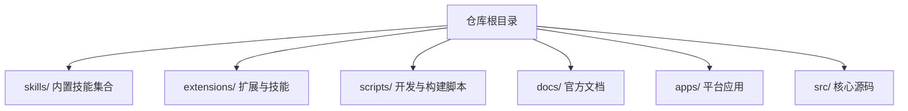
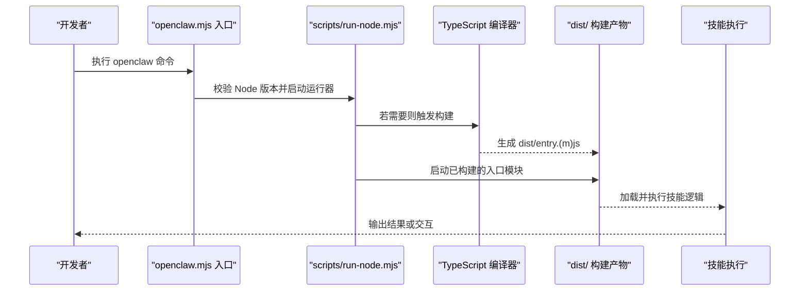
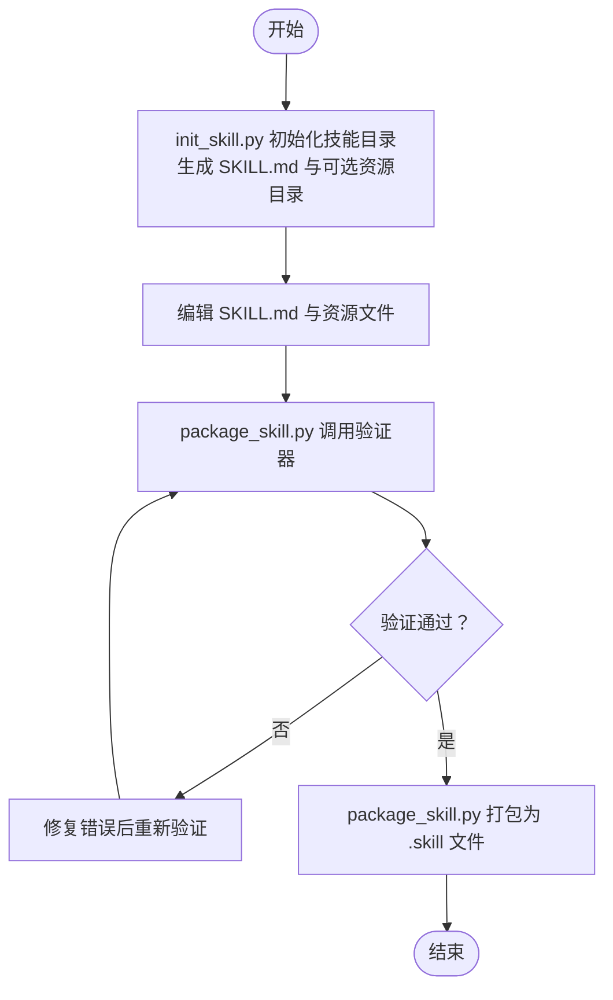
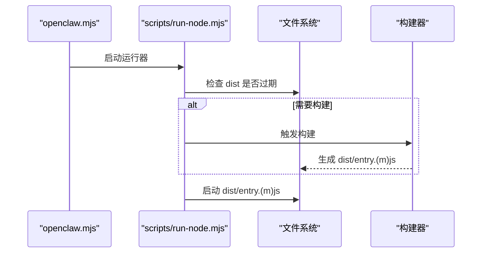
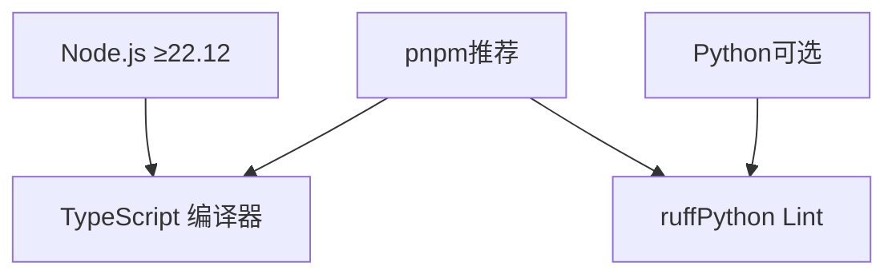

# 开发环境搭建

<cite>
**本文档引用的文件**
- [README.md](file://README.md)
- [package.json](file://package.json)
- [pyproject.toml](file://pyproject.toml)
- [openclaw.mjs](file://openclaw.mjs)
- [scripts/run-node.mjs](file://scripts/run-node.mjs)
- [skills/skill-creator/SKILL.md](file://skills/skill-creator/SKILL.md)
- [skills/skill-creator/scripts/init_skill.py](file://skills/skill-creator/scripts/init_skill.py)
- [skills/skill-creator/scripts/package_skill.py](file://skills/skill-creator/scripts/package_skill.py)
- [skills/canvas/SKILL.md](file://skills/canvas/SKILL.md)
- [skills/model-usage/scripts/model_usage.py](file://skills/model-usage/scripts/model_usage.py)
</cite>

## 目录
1. [简介](#简介)
2. [项目结构](#项目结构)
3. [核心组件](#核心组件)
4. [架构总览](#架构总览)
5. [详细组件分析](#详细组件分析)
6. [依赖关系分析](#依赖关系分析)
7. [性能考虑](#性能考虑)
8. [故障排除指南](#故障排除指南)
9. [结论](#结论)
10. [附录](#附录)

## 简介
本指南面向希望在本地搭建 OpenClaw 技能开发环境的开发者，覆盖从零开始的工具安装、环境配置、目录结构与命名规范、开发验证流程以及常见问题排查。OpenClaw 提供了统一的技能（Skill）体系，技能以模块化方式扩展 AI 助手能力，支持多种脚本语言与资源类型，并通过内置工具链实现初始化、打包与分发。

## 项目结构
OpenClaw 仓库采用多模块组织方式，核心目录与职责如下：
- 根目录：包含包管理配置、构建脚本、运行入口与文档索引
- skills/：内置技能集合，每个技能为独立目录，包含 SKILL.md 与可选的 scripts/、references/、assets/
- extensions/：扩展插件与技能（如 acpx、diffs、feishu 等）
- scripts/：开发与构建辅助脚本（如 run-node.mjs、watch-node.mjs）
- docs/：官方文档（参考链接）
- apps/、src/、extensions/ 等：平台应用与核心源码（与技能开发关系较弱）

图示来源
- [README.md](file://README.md)
- [skills/](file://skills/)
- [extensions/](file://extensions/)
- [scripts/](file://scripts/)

章节来源
- [README.md](file://README.md)
- [package.json](file://package.json)

## 核心组件
- 运行时与版本要求：Node.js ≥ 22.12（由入口脚本进行版本校验）
- 包管理器：推荐使用 pnpm（支持工作区与最小发布间隔），也兼容 npm、bun
- 构建与运行：通过 scripts/run-node.mjs 实现 TypeScript 源码的增量编译与运行；支持 watch 模式自动重载
- 技能开发工具链：技能初始化、验证与打包脚本位于 skills/skill-creator/scripts/

章节来源
- [openclaw.mjs](file://openclaw.mjs)
- [package.json](file://package.json)
- [scripts/run-node.mjs](file://scripts/run-node.mjs)
- [skills/skill-creator/SKILL.md](file://skills/skill-creator/SKILL.md)

## 架构总览
下图展示了从命令行到技能执行的关键路径，体现技能开发与运行的整体架构。

图示来源
- [openclaw.mjs](file://openclaw.mjs)
- [scripts/run-node.mjs](file://scripts/run-node.mjs)

## 详细组件分析

### 组件一：技能开发工具链
技能开发围绕以下三个脚本展开：
- 初始化：skills/skill-creator/scripts/init_skill.py
- 验证：quick_validate.py（被 package_skill.py 调用）
- 打包：skills/skill-creator/scripts/package_skill.py

图示来源
- [skills/skill-creator/scripts/init_skill.py](file://skills/skill-creator/scripts/init_skill.py)
- [skills/skill-creator/scripts/package_skill.py](file://skills/skill-creator/scripts/package_skill.py)

章节来源
- [skills/skill-creator/SKILL.md](file://skills/skill-creator/SKILL.md)
- [skills/skill-creator/scripts/init_skill.py](file://skills/skill-creator/scripts/init_skill.py)
- [skills/skill-creator/scripts/package_skill.py](file://skills/skill-creator/scripts/package_skill.py)

### 组件二：技能目录结构与命名规范
- 必备文件：每个技能必须包含 SKILL.md
- 可选资源：
  - scripts/：可执行代码（Python/Bash 等）
  - references/：按需加载的参考文档
  - assets/：输出使用的资源文件
- 命名规范：仅允许小写字母、数字与连字符，长度不超过 64 字符，建议使用动词开头的短语形式

章节来源
- [skills/skill-creator/SKILL.md](file://skills/skill-creator/SKILL.md)

### 组件三：运行与构建流程
- 入口校验：openclaw.mjs 在启动前检查 Node.js 版本（≥22.12）
- 运行器：scripts/run-node.mjs 负责增量构建与运行，监听 src、tsconfig.json、package.json 等变更
- 构建产物：dist/entry.(m)js，运行器会优先加载该文件

图示来源
- [openclaw.mjs](file://openclaw.mjs)
- [scripts/run-node.mjs](file://scripts/run-node.mjs)

章节来源
- [openclaw.mjs](file://openclaw.mjs)
- [scripts/run-node.mjs](file://scripts/run-node.mjs)

### 组件四：技能示例与实践
- Canvas 技能：演示如何在节点上展示 HTML 内容，包含架构说明、配置示例与调试要点
- Model Usage 技能：通过 Python 脚本汇总模型使用成本，展示如何在技能中集成外部 CLI 工具

章节来源
- [skills/canvas/SKILL.md](file://skills/canvas/SKILL.md)
- [skills/model-usage/scripts/model_usage.py](file://skills/model-usage/scripts/model_usage.py)

## 依赖关系分析
- 运行时依赖：Node.js ≥ 22.12（入口脚本强制校验）
- 包管理：pnpm（推荐）、npm、bun 均可
- 构建工具：TypeScript 编译器（tsdown）与相关工具链
- Python 生态：部分技能脚本使用 Python（如 model-usage），可通过 pyproject.toml 的 ruff 配置进行代码风格约束

图示来源
- [openclaw.mjs](file://openclaw.mjs)
- [package.json](file://package.json)
- [pyproject.toml](file://pyproject.toml)

章节来源
- [openclaw.mjs](file://openclaw.mjs)
- [package.json](file://package.json)
- [pyproject.toml](file://pyproject.toml)

## 性能考虑
- 使用 pnpm 作为包管理器，提升安装与缓存效率
- 利用 run-node.mjs 的增量构建与自动重载，缩短开发迭代周期
- 将大型参考文档放入 references/，避免一次性加载造成上下文膨胀
- 脚本类任务尽量放在 scripts/ 中，减少重复计算与上下文占用

## 故障排除指南
- Node.js 版本不满足要求
  - 现象：启动时报错提示需要更高版本
  - 处理：升级至 Node.js ≥22.12，或使用 nvm 切换版本
  - 参考：入口脚本对版本进行严格校验
- 缺少构建产物
  - 现象：提示缺失 dist/entry.(m)js
  - 处理：先执行构建命令，再运行 openclaw
- 构建失败或依赖缺失
  - 现象：构建阶段报错
  - 处理：检查网络与代理设置，确保 pnpm 安装完成；必要时清理缓存后重试
- 技能打包失败（.skill 文件）
  - 现象：package_skill.py 报错，如验证失败、存在符号链接等
  - 处理：修复验证错误；移除符号链接；确认输出目录安全

章节来源
- [openclaw.mjs](file://openclaw.mjs)
- [scripts/run-node.mjs](file://scripts/run-node.mjs)
- [skills/skill-creator/scripts/package_skill.py](file://skills/skill-creator/scripts/package_skill.py)

## 结论
通过遵循本指南，您可以快速完成 OpenClaw 技能开发环境的搭建与验证。建议优先使用 pnpm 与 Node.js ≥22.12，利用 init_skill.py 快速生成模板，配合 package_skill.py 完成技能打包与分发。在开发过程中，善用 references/ 与 scripts/ 的资源组织策略，有助于保持技能的模块化与可维护性。

## 附录

### A. 从零开始的开发环境搭建步骤
- 安装 Node.js（版本 ≥22.12）
- 安装包管理器（推荐 pnpm）
- 克隆仓库并安装依赖
- 首次构建与运行
- 使用 init_skill.py 创建新技能模板
- 编写 SKILL.md 与资源文件
- 使用 package_skill.py 打包技能
- 在本地测试与调试

章节来源
- [README.md](file://README.md)
- [package.json](file://package.json)
- [openclaw.mjs](file://openclaw.mjs)
- [skills/skill-creator/scripts/init_skill.py](file://skills/skill-creator/scripts/init_skill.py)
- [skills/skill-creator/scripts/package_skill.py](file://skills/skill-creator/scripts/package_skill.py)