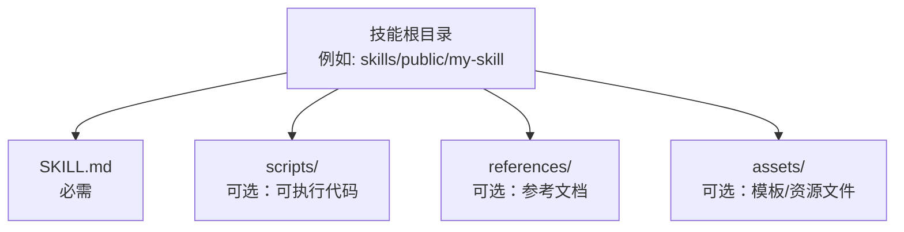
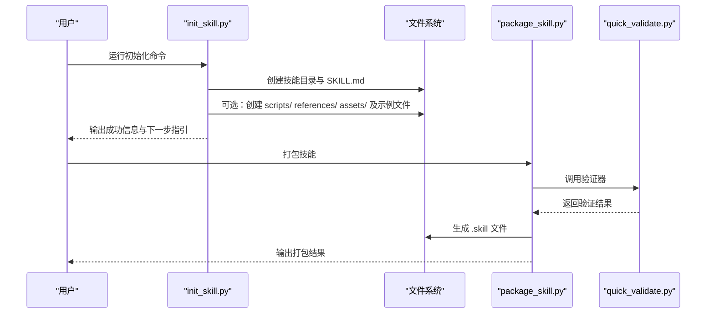
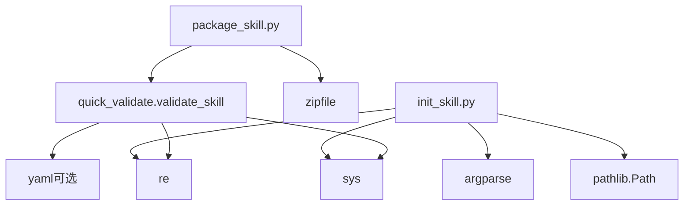

# 初始化技能项目

<cite>
**本文引用的文件**
- [init_skill.py](file://skills/skill-creator/scripts/init_skill.py)
- [SKILL.md（技能创建器）](file://skills/skill-creator/SKILL.md)
- [package_skill.py](file://skills/skill-creator/scripts/package_skill.py)
- [quick_validate.py](file://skills/skill-creator/scripts/quick_validate.py)
- [技能系统概览](file://docs/tools/skills.md)
- [1Password 技能示例](file://skills/1password/SKILL.md)
- [模型使用技能示例](file://skills/model-usage/scripts/model_usage.py)
</cite>

## 目录
1. [简介](#简介)
2. [项目结构](#项目结构)
3. [核心组件](#核心组件)
4. [架构总览](#架构总览)
5. [详细组件分析](#详细组件分析)
6. [依赖关系分析](#依赖关系分析)
7. [性能考量](#性能考量)
8. [故障排查指南](#故障排查指南)
9. [结论](#结论)
10. [附录](#附录)

## 简介
本指南面向希望在 OpenClaw 中快速创建新技能的开发者，聚焦于使用 init_skill.py 脚本初始化技能项目。内容涵盖：
- 命令行参数详解：技能名称、输出路径、资源类型选择、示例生成开关
- 完整命令行示例与参数组合
- 生成的目录结构与文件组织原则
- SKILL.md 的 frontmatter 格式与 TODO 占位符的作用
- 最佳实践：命名规范、目录结构要求、初始配置选项的选择策略

## 项目结构
OpenClaw 的技能采用“目录即技能”的结构，每个技能是一个独立目录，包含：
- 必需文件：SKILL.md（含 YAML frontmatter）
- 可选资源：scripts/、references/、assets/

图表来源
- [技能系统概览:78-101](file://docs/tools/skills.md#L78-L101)

章节来源
- [技能系统概览:78-101](file://docs/tools/skills.md#L78-L101)

## 核心组件
- init_skill.py：用于从模板创建新技能目录，支持生成 SKILL.md 模板与可选的资源目录及示例文件
- SKILL.md（技能创建器）：提供技能设计原则、命名规范、目录结构与使用流程
- package_skill.py：将技能打包为 .skill 文件，内置验证
- quick_validate.py：最小化验证器，检查 SKILL.md frontmatter 合法性

章节来源
- [init_skill.py:1-379](file://skills/skill-creator/scripts/init_skill.py#L1-L379)
- [SKILL.md（技能创建器）:1-373](file://skills/skill-creator/SKILL.md#L1-L373)
- [package_skill.py:1-140](file://skills/skill-creator/scripts/package_skill.py#L1-L140)
- [quick_validate.py:1-160](file://skills/skill-creator/scripts/quick_validate.py#L1-L160)

## 架构总览
下图展示了从命令行到文件生成再到后续流程的整体关系：

图表来源
- [init_skill.py:320-379](file://skills/skill-creator/scripts/init_skill.py#L320-L379)
- [package_skill.py:28-112](file://skills/skill-creator/scripts/package_skill.py#L28-L112)
- [quick_validate.py:67-149](file://skills/skill-creator/scripts/quick_validate.py#L67-L149)

## 详细组件分析

### init_skill.py：初始化脚本
- 功能概述
  - 接收技能名称、输出路径、资源类型列表与示例开关
  - 规范化技能名称（小写、连字符）
  - 生成 SKILL.md 模板（含 frontmatter 与 TODO 占位符）
  - 可选创建资源目录与示例文件
  - 输出下一步操作指引

- 命令行参数
  - 位置参数
    - skill-name：技能名称（将被规范化为 hyphen-case）
  - 选项参数
    - --path：技能输出目录（必填）
    - --resources：逗号分隔的资源类型列表，允许值：scripts、references、assets
    - --examples：启用时在选定资源目录中生成示例文件

- 参数校验与行为
  - 技能名称长度限制（最大 64 字符）
  - 资源类型白名单校验
  - 当启用 --examples 时，必须同时设置 --resources
  - 若目标目录已存在或创建失败，会输出错误并退出

- 示例命令
  - 创建基础技能目录：[init_skill.py 示例:279-283](file://skills/skill-creator/SKILL.md#L279-L283)
  - 创建带资源的技能目录：[init_skill.py 示例:279-283](file://skills/skill-creator/SKILL.md#L279-L283)
  - 创建带示例的技能目录：[init_skill.py 示例:279-283](file://skills/skill-creator/SKILL.md#L279-L283)

- 生成的目录结构与文件
  - 技能根目录：skills/<path>/<skill-name>
  - SKILL.md：包含 YAML frontmatter 与 TODO 占位符
  - 可选资源目录：scripts/、references/、assets/（按 --resources 选择）
  - 可选示例文件：scripts/example.py、references/api_reference.md、assets/example_asset.txt（当启用 --examples）

- TODO 占位符的作用
  - 引导作者完成描述、结构规划、内容填充与资源组织
  - 通过占位符明确“何时使用”等关键触发条件，帮助模型在合适时机调用技能

- 命名规范与目录要求
  - 技能名称仅允许小写字母、数字与连字符；长度不超过 64
  - 目录名为技能名称
  - 不要创建 README.md、INSTALLATION_GUIDE.md 等辅助文档文件

- 最佳实践
  - 先理解技能用途与触发场景，再决定是否需要 scripts/、references/、assets/
  - 使用 --examples 时，及时替换或删除示例文件
  - 编辑 SKILL.md 时，优先完善 frontmatter 的 name 与 description，确保触发准确

章节来源
- [init_skill.py:194-379](file://skills/skill-creator/scripts/init_skill.py#L194-L379)
- [SKILL.md（技能创建器）:214-221](file://skills/skill-creator/SKILL.md#L214-L221)
- [SKILL.md（技能创建器）:263-293](file://skills/skill-creator/SKILL.md#L263-L293)

### SKILL.md 模板与 frontmatter
- frontmatter 字段
  - name：技能名称（hyphen-case）
  - description：技能用途与触发条件（越具体越好）
  - 可选字段：homepage、user-invocable、disable-model-invocation、command-dispatch、command-tool、command-arg-mode、metadata（单行 JSON 对象）

- 结构与内容
  - 概述：简要说明技能能力与适用场景
  - 结构规划：引导作者选择合适的组织方式（工作流/任务/参考/能力）
  - 主体内容：按所选结构填充 TODO 区域
  - 资源说明：解释 scripts/、references/、assets/ 的用途与边界

- TODO 占位符
  - 引导作者完成“何时使用”、“结构选择”、“内容填充”和“资源组织”
  - 删除“结构规划”部分后，保留主体内容即可

章节来源
- [init_skill.py:23-108](file://skills/skill-creator/scripts/init_skill.py#L23-L108)
- [技能系统概览:82-101](file://docs/tools/skills.md#L82-L101)

### 资源目录与示例文件
- scripts/
  - 适合重复执行、确定性可靠的自动化脚本
  - 示例：PDF 处理、图像生成等
- references/
  - 需要加载到上下文中的参考文档（API 文档、Schema、流程指南等）
  - 建议避免与 SKILL.md 重复，保持 SKILL.md 精简
- assets/
  - 用于最终输出的模板、图标、字体、数据文件等
  - 不会被直接加载到上下文中

- 示例文件
  - scripts/example.py：占位示例脚本
  - references/api_reference.md：占位参考文档
  - assets/example_asset.txt：占位资产说明

章节来源
- [init_skill.py:110-191](file://skills/skill-creator/scripts/init_skill.py#L110-L191)
- [技能系统概览:70-100](file://docs/tools/skills.md#L70-L100)

### package_skill.py：打包与验证
- 功能
  - 在打包前自动运行验证器
  - 将技能目录打包为 .skill 文件（zip 格式），保持目录结构
  - 安全限制：拒绝符号链接，防止逃逸路径

- 使用
  - 基本用法：指定技能目录与可选输出目录
  - 验证失败时会输出错误并终止打包

章节来源
- [package_skill.py:28-112](file://skills/skill-creator/scripts/package_skill.py#L28-L112)
- [quick_validate.py:67-149](file://skills/skill-creator/scripts/quick_validate.py#L67-L149)

### quick_validate.py：最小化验证器
- 验证内容
  - SKILL.md 存在性
  - frontmatter 解析（支持 YAML 或简单回退解析）
  - 必填字段 name 与 description
  - name 与 description 的格式与长度约束
  - 允许的 frontmatter 键集合

- 输出
  - 成功返回“技能有效”，失败返回具体错误信息

章节来源
- [quick_validate.py:67-149](file://skills/skill-creator/scripts/quick_validate.py#L67-L149)

## 依赖关系分析
- init_skill.py 依赖
  - argparse：解析命令行参数
  - re：规范化技能名称
  - pathlib.Path：文件系统路径处理
  - sys：标准输出与退出码

- package_skill.py 依赖
  - zipfile：生成 .skill 文件
  - quick_validate.validate_skill：前置验证

- quick_validate.py 依赖
  - yaml（可选）：YAML 解析
  - re：frontmatter 正则匹配
  - sys：标准输出与退出码

图表来源
- [init_skill.py:15-18](file://skills/skill-creator/scripts/init_skill.py#L15-L18)
- [package_skill.py:13-17](file://skills/skill-creator/scripts/package_skill.py#L13-L17)
- [quick_validate.py:11-14](file://skills/skill-creator/scripts/quick_validate.py#L11-L14)

## 性能考量
- 上下文窗口与 token 成本
  - 技能列表注入系统提示的成本是确定性的，受技能数量与字段长度影响
  - 建议保持 SKILL.md 精简，将详细内容放入 references/ 并在 SKILL.md 中引用

- 资源加载策略
  - scripts/ 可在不加载到上下文的情况下执行
  - references/ 仅在需要时加载，避免占用上下文窗口

章节来源
- [技能系统概览:269-286](file://docs/tools/skills.md#L269-L286)

## 故障排查指南
- 常见问题与解决
  - 技能名称非法或过长
    - 现象：脚本报错并退出
    - 处理：使用 hyphen-case，长度不超过 64
  - 资源类型未知
    - 现象：脚本报错并退出
    - 处理：仅使用 scripts、references、assets 三类之一或组合
  - 启用示例但未指定资源
    - 现象：脚本报错并退出
    - 处理：同时设置 --resources
  - 目标目录已存在
    - 现象：脚本报错并退出
    - 处理：更换输出路径或删除已有目录
  - 打包失败
    - 现象：package_skill.py 报错
    - 处理：先运行 quick_validate.py 检查 frontmatter 与结构，修复后再打包

- 验证与调试建议
  - 使用 quick_validate.py 检查 SKILL.md frontmatter
  - 手动检查生成的目录结构与文件是否存在
  - 在编辑 SKILL.md 时，优先完善 name 与 description 的触发语义

章节来源
- [init_skill.py:340-356](file://skills/skill-creator/scripts/init_skill.py#L340-L356)
- [package_skill.py:56-63](file://skills/skill-creator/scripts/package_skill.py#L56-L63)
- [quick_validate.py:83-149](file://skills/skill-creator/scripts/quick_validate.py#L83-L149)

## 结论
通过 init_skill.py，你可以快速生成符合 OpenClaw 规范的技能项目骨架。遵循命名规范、合理选择资源类型、完善 SKILL.md frontmatter 与 TODO 内容，并在需要时使用示例文件作为起点，可以显著提升技能开发效率与质量。后续使用 package_skill.py 打包并借助 quick_validate.py 进行验证，确保技能满足发布要求。

## 附录

### 命令行示例与参数组合
- 创建基础技能目录
  - 示例：[init_skill.py 示例:279-283](file://skills/skill-creator/SKILL.md#L279-L283)
- 创建带资源的技能目录
  - 示例：[init_skill.py 示例:279-283](file://skills/skill-creator/SKILL.md#L279-L283)
- 创建带示例的技能目录
  - 示例：[init_skill.py 示例:279-283](file://skills/skill-creator/SKILL.md#L279-L283)

### 目录结构与文件组织原则
- 必需：SKILL.md（含 YAML frontmatter）
- 可选：scripts/、references/、assets/
- 不要包含：README.md、INSTALLATION_GUIDE.md 等辅助文档文件

章节来源
- [技能系统概览:78-101](file://docs/tools/skills.md#L78-L101)
- [SKILL.md（技能创建器）:101-112](file://skills/skill-creator/SKILL.md#L101-L112)

### frontmatter 字段与触发机制
- name：技能名称（hyphen-case）
- description：技能用途与触发条件（越具体越好）
- 可选字段：homepage、user-invocable、disable-model-invocation、command-dispatch、command-tool、command-arg-mode、metadata（单行 JSON 对象）

章节来源
- [技能系统概览:82-101](file://docs/tools/skills.md#L82-L101)

### 实战参考
- 1Password 技能示例：展示 frontmatter 与 references/ 的使用
  - [1Password 技能示例:1-71](file://skills/1password/SKILL.md#L1-L71)
- 模型使用技能示例：展示 scripts/ 的组织方式
  - [模型使用技能示例:1-321](file://skills/model-usage/scripts/model_usage.py#L1-L321)