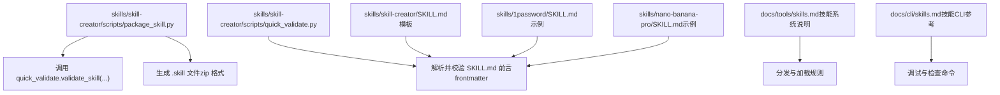
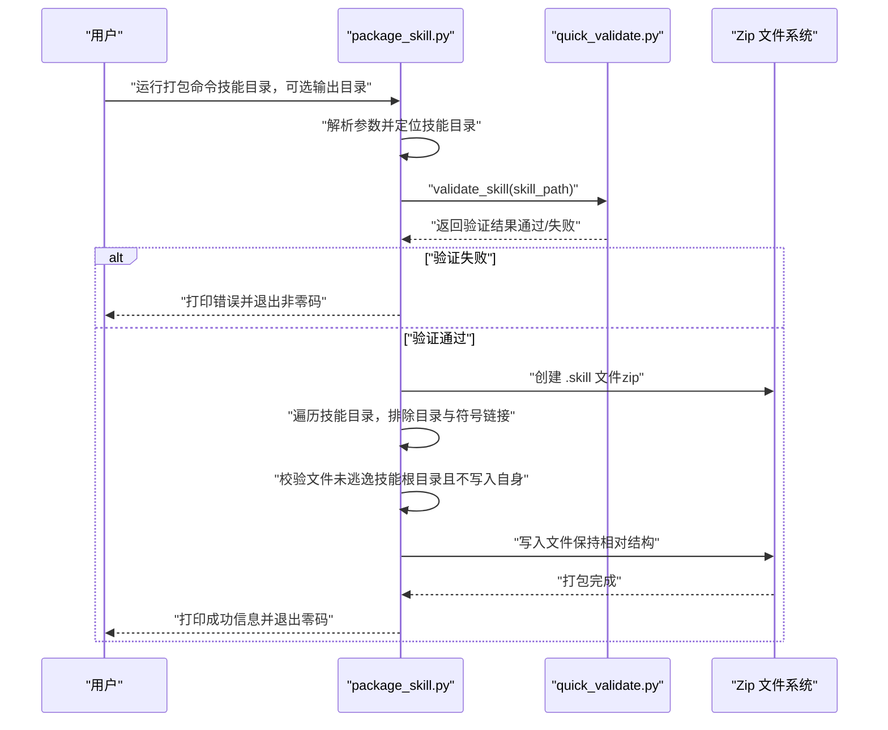
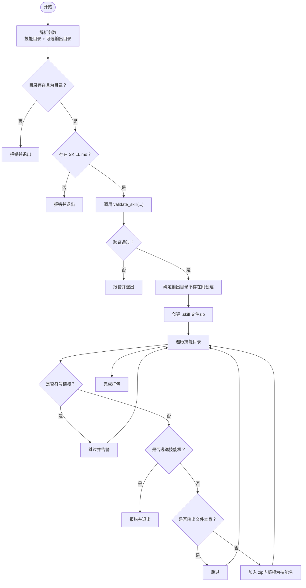
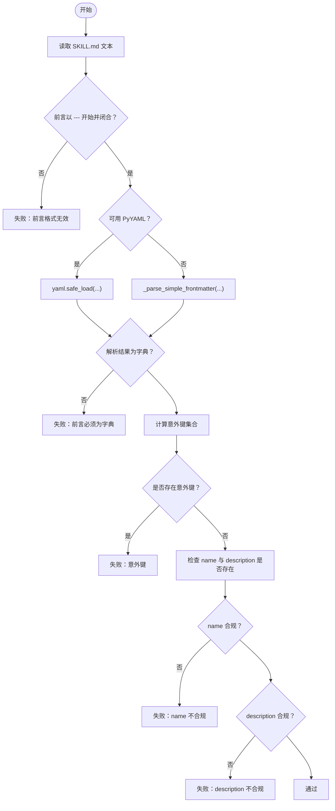
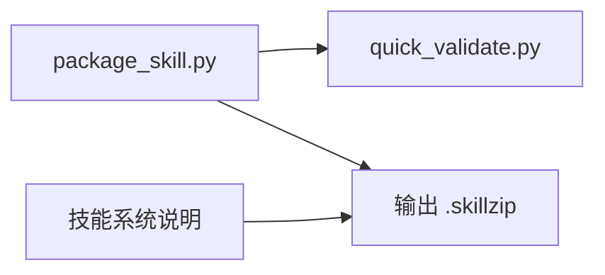

# 打包技能

<cite>
**本文引用的文件**
- [package_skill.py](file://skills/skill-creator/scripts/package_skill.py)
- [quick_validate.py](file://skills/skill-creator/scripts/quick_validate.py)
- [init_skill.py](file://skills/skill-creator/scripts/init_skill.py)
- [SKILL.md（技能模板）](file://skills/skill-creator/SKILL.md)
- [SKILL.md（示例：1password）](file://skills/1password/SKILL.md)
- [SKILL.md（示例：nano-banana-pro）](file://skills/nano-banana-pro/SKILL.md)
- [技能系统说明](file://docs/tools/skills.md)
- [创建技能指南](file://docs/tools/creating-skills.md)
- [技能CLI参考](file://docs/cli/skills.md)
</cite>

## 目录
1. [简介](#简介)
2. [项目结构](#项目结构)
3. [核心组件](#核心组件)
4. [架构总览](#架构总览)
5. [详细组件分析](#详细组件分析)
6. [依赖关系分析](#依赖关系分析)
7. [性能考量](#性能考量)
8. [故障排查指南](#故障排查指南)
9. [结论](#结论)
10. [附录](#附录)

## 简介
本指南面向希望将自研技能打包为可分发 .skill 文件的开发者。文档基于仓库内的 package_skill.py 脚本与配套验证模块，系统讲解打包流程、自动验证规则、命令行用法、常见问题与解决方案，并给出打包后文件结构与分发建议，确保技能在目标环境中正确安装与使用。

## 项目结构
与技能打包直接相关的关键位置如下：
- 打包脚本与验证模块位于 skills/skill-creator/scripts 下
- 技能模板与示例位于 skills/skill-creator 与各具体技能目录下
- 技能系统与分发说明位于 docs/tools/skills.md
- CLI 参考位于 docs/cli/skills.md
- 创建技能指南位于 docs/tools/creating-skills.md

图表来源
- [package_skill.py:1-140](file://skills/skill-creator/scripts/package_skill.py#L1-L140)
- [quick_validate.py:1-160](file://skills/skill-creator/scripts/quick_validate.py#L1-L160)
- [SKILL.md（技能模板）:1-373](file://skills/skill-creator/SKILL.md#L1-L373)
- [SKILL.md（示例：1password）:1-71](file://skills/1password/SKILL.md#L1-L71)
- [SKILL.md（示例：nano-banana-pro）:1-66](file://skills/nano-banana-pro/SKILL.md#L1-L66)
- [技能系统说明:1-303](file://docs/tools/skills.md#L1-L303)
- [技能CLI参考:1-27](file://docs/cli/skills.md#L1-L27)

章节来源
- [package_skill.py:1-140](file://skills/skill-creator/scripts/package_skill.py#L1-L140)
- [quick_validate.py:1-160](file://skills/skill-creator/scripts/quick_validate.py#L1-L160)
- [技能系统说明:1-303](file://docs/tools/skills.md#L1-L303)

## 核心组件
- 打包器（package_skill.py）
  - 输入：技能目录路径、可选输出目录
  - 行为：先执行验证，再将技能目录压缩为 .skill 文件；严格拒绝符号链接与越界文件
  - 输出：生成的 .skill 文件路径或失败返回空
- 验证器（quick_validate.py）
  - 检查：SKILL.md 存在性、前言格式、必需字段、命名规范、描述长度与字符限制
  - 支持：PyYAML 解析或简单回退解析（无 PyYAML 时）
- 初始化器（init_skill.py）
  - 用途：按模板生成新技能目录与 SKILL.md，支持选择资源目录与示例填充
  - 规范：名称归一化为小写连字符形式，长度不超过 64 字符

章节来源
- [package_skill.py:28-112](file://skills/skill-creator/scripts/package_skill.py#L28-L112)
- [quick_validate.py:67-149](file://skills/skill-creator/scripts/quick_validate.py#L67-L149)
- [init_skill.py:194-317](file://skills/skill-creator/scripts/init_skill.py#L194-L317)

## 架构总览
下面的序列图展示了从命令到打包完成的整体流程，以及关键的验证点。

图表来源
- [package_skill.py:28-112](file://skills/skill-creator/scripts/package_skill.py#L28-L112)
- [quick_validate.py:67-149](file://skills/skill-creator/scripts/quick_validate.py#L67-L149)

## 详细组件分析

### 组件A：打包器（package_skill.py）
- 功能要点
  - 参数解析：技能目录必填，输出目录可选
  - 目录存在性与类型检查：必须存在且为目录
  - 必需文件检查：必须包含 SKILL.md
  - 调用验证器：validate_skill 返回失败则终止
  - 输出确定：默认当前工作目录，或指定输出目录（不存在则创建）
  - 安全策略
    - 拒绝符号链接（跳过并告警）
    - 排除版本控制与缓存目录（如 .git、__pycache__ 等）
    - 校验文件真实路径不得“逃逸”技能根目录
    - 避免将输出 .skill 文件写入自身
  - 压缩策略：递归遍历，按技能名作为 zip 内部根目录，保持层级
- 错误处理
  - 目录不存在/非目录、缺少 SKILL.md、验证失败、打包异常等均会打印错误并返回 None

图表来源
- [package_skill.py:28-112](file://skills/skill-creator/scripts/package_skill.py#L28-L112)

章节来源
- [package_skill.py:28-112](file://skills/skill-creator/scripts/package_skill.py#L28-L112)

### 组件B：验证器（quick_validate.py）
- 前言提取与解析
  - 提取三段线界定的前言文本
  - 优先使用 PyYAML 安全解析；若不可用则使用简单回退解析
- 字段与格式校验
  - 允许键集合：name、description、license、allowed-tools、metadata
  - 缺失 name 或 description 即判失败
  - name 规范：仅允许小写字母、数字、连字符；首尾不能为连字符；不允许连续连字符；长度不超过 64
  - description 规范：仅允许字符串；不含尖括号；长度不超过 1024
- 错误提示
  - 未找到 SKILL.md、前言格式无效、YAML 解析错误、键非法、字段缺失、命名/描述不合规等

图表来源
- [quick_validate.py:67-149](file://skills/skill-creator/scripts/quick_validate.py#L67-L149)

章节来源
- [quick_validate.py:67-149](file://skills/skill-creator/scripts/quick_validate.py#L67-L149)

### 组件C：初始化器（init_skill.py）
- 名称归一化：小写、连字符、去除多余连字符、长度限制
- 目录创建：按需创建 scripts/references/assets 子目录，可选填充示例文件
- 模板生成：生成包含 TODO 的 SKILL.md 模板，便于后续编辑
- 资源类型校验：仅允许 scripts、references、assets

章节来源
- [init_skill.py:194-317](file://skills/skill-creator/scripts/init_skill.py#L194-L317)

### 组件D：技能模板与示例
- 模板 SKILL.md（技能模板）：明确技能目录结构、前言字段、资源组织方式与打包流程
- 示例 SKILL.md（1password）：展示包含 homepage 与 metadata.openclaw 的完整前言
- 示例 SKILL.md（nano-banana-pro）：展示包含 metadata.openclaw.requires、install 列表与脚本调用示例

章节来源
- [SKILL.md（技能模板）:335-362](file://skills/skill-creator/SKILL.md#L335-L362)
- [SKILL.md（示例：1password）:1-71](file://skills/1password/SKILL.md#L1-L71)
- [SKILL.md（示例：nano-banana-pro）:1-66](file://skills/nano-banana-pro/SKILL.md#L1-L66)

## 依赖关系分析
- package_skill.py 依赖 quick_validate.py 进行前置验证
- 打包产物 .skill 实际为 zip 文件，内部根目录即技能名，内容来自技能目录
- 技能系统说明定义了技能发现、加载与分发规则，影响 .skill 文件在目标环境中的安装与使用

图表来源
- [package_skill.py:17-17](file://skills/skill-creator/scripts/package_skill.py#L17-L17)
- [quick_validate.py:1-160](file://skills/skill-creator/scripts/quick_validate.py#L1-L160)
- [技能系统说明:1-303](file://docs/tools/skills.md#L1-L303)

章节来源
- [package_skill.py:17-17](file://skills/skill-creator/scripts/package_skill.py#L17-L17)
- [quick_validate.py:1-160](file://skills/skill-creator/scripts/quick_validate.py#L1-L160)
- [技能系统说明:1-303](file://docs/tools/skills.md#L1-L303)

## 性能考量
- 打包时间主要取决于技能目录大小与文件数量，zip 压缩采用默认算法
- 排除 .git、node_modules、__pycache__ 等目录可显著减少打包体积与时间
- 建议在 CI 中预构建并缓存 .skill 文件，避免重复打包

## 故障排查指南
- 缺少 SKILL.md
  - 现象：验证失败，提示未找到 SKILL.md
  - 处理：在技能根目录创建 SKILL.md，确保包含合法前言与正文
- 前言格式错误
  - 现象：验证失败，提示前言格式无效或 YAML 解析错误
  - 处理：确认前言以三段线界定，键值对书写规范；若无 PyYAML，使用简单回退解析语法
- 缺失必需字段
  - 现象：验证失败，提示缺少 name 或 description
  - 处理：在前言中添加 name 与 description，并确保 description 不含尖括号
- 命名不合规
  - 现象：验证失败，提示 name 不符合连字符命名规范或超长
  - 处理：将 name 归一化为小写连字符形式，长度不超过 64
- 描述过长或包含非法字符
  - 现象：验证失败，提示描述超长或包含尖括号
  - 处理：缩短描述并移除尖括号
- 包含符号链接
  - 现象：打包阶段跳过符号链接并告警，严重时导致打包失败
  - 处理：删除或替换为实际文件；不要使用符号链接
- 文件逃逸技能根目录
  - 现象：检测到文件真实路径逃逸技能根，打包失败
  - 处理：确保所有文件位于技能目录内，不使用 ../ 路径
- 输出文件写入自身
  - 现象：输出目录包含正在打包的 .skill 文件，打包阶段会跳过
  - 处理：将输出目录设为与技能目录不同的路径
- 未安装 PyYAML
  - 现象：YAML 解析失败，提示不支持的语法
  - 处理：安装 PyYAML 或使用简单回退解析语法

章节来源
- [package_skill.py:42-111](file://skills/skill-creator/scripts/package_skill.py#L42-L111)
- [quick_validate.py:72-149](file://skills/skill-creator/scripts/quick_validate.py#L72-L149)

## 结论
通过 package_skill.py 与 quick_validate.py 的配合，OpenClaw 为技能打包提供了严格的自动化验证与安全策略。遵循本文的命名规范、前言格式与文件组织要求，即可高效产出可分发的 .skill 文件，并在目标环境中稳定安装与使用。

## 附录

### 命令行使用示例
- 基本打包
  - 在技能根目录执行：python skills/skill-creator/scripts/package_skill.py <技能目录>
- 指定输出目录
  - 在技能根目录执行：python skills/skill-creator/scripts/package_skill.py <技能目录> <输出目录>

章节来源
- [package_skill.py:114-136](file://skills/skill-creator/scripts/package_skill.py#L114-L136)

### 自动验证机制一览
- YAML 前言格式检查
  - 三段线界定、键值对解析、字典类型校验
- 技能命名规范验证
  - 小写连字符、长度限制、首尾与连续连字符限制
- 描述完整性评估
  - 必须字段、字符集与长度限制
- 文件组织合规性检查
  - 排除目录、拒绝符号链接、禁止逃逸根目录、避免写入自身

章节来源
- [quick_validate.py:67-149](file://skills/skill-creator/scripts/quick_validate.py#L67-L149)
- [package_skill.py:75-104](file://skills/skill-creator/scripts/package_skill.py#L75-L104)

### 打包后的文件结构与分发建议
- .skill 文件结构
  - 实质为 zip 文件，内部根目录为技能名，内容与技能目录一致
  - 建议保持 scripts/、references/、assets/ 等资源目录清晰
- 分发建议
  - 使用 ClawHub 进行公开发布与同步
  - 在目标机器上通过 clawhub install 或手动放置至 ~/.openclaw/skills 并刷新技能索引
  - 注意：第三方技能视为不受信任代码，使用前请审阅 SKILL.md 与资源文件

章节来源
- [技能系统说明:50-77](file://docs/tools/skills.md#L50-L77)
- [技能系统说明:287-302](file://docs/tools/skills.md#L287-L302)