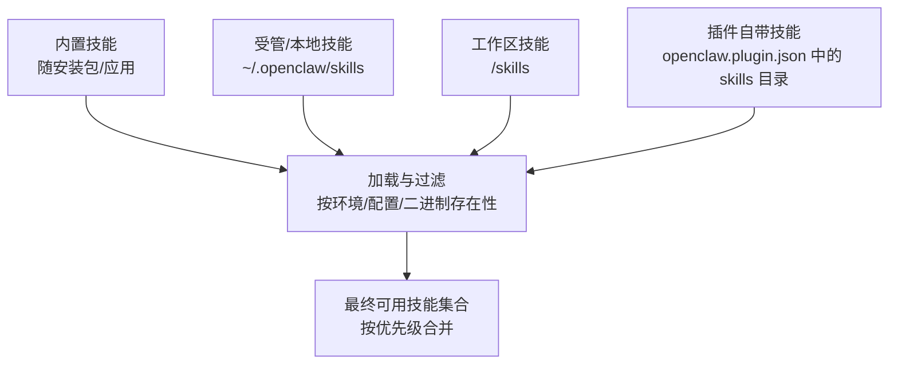
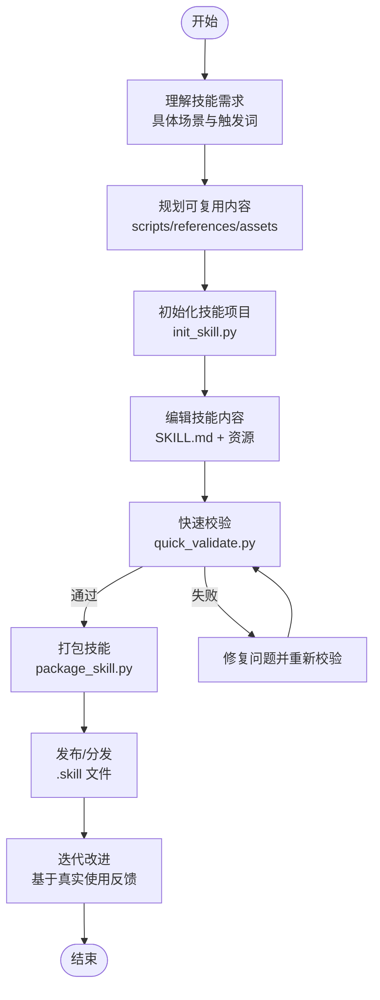
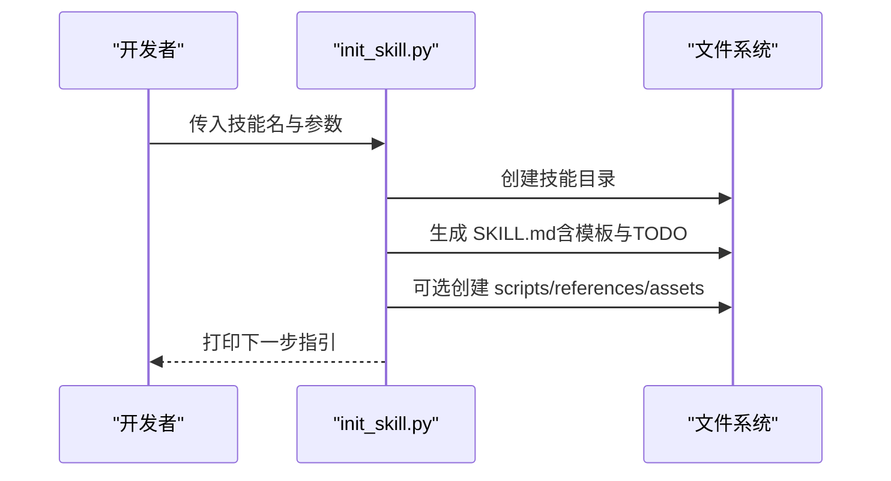
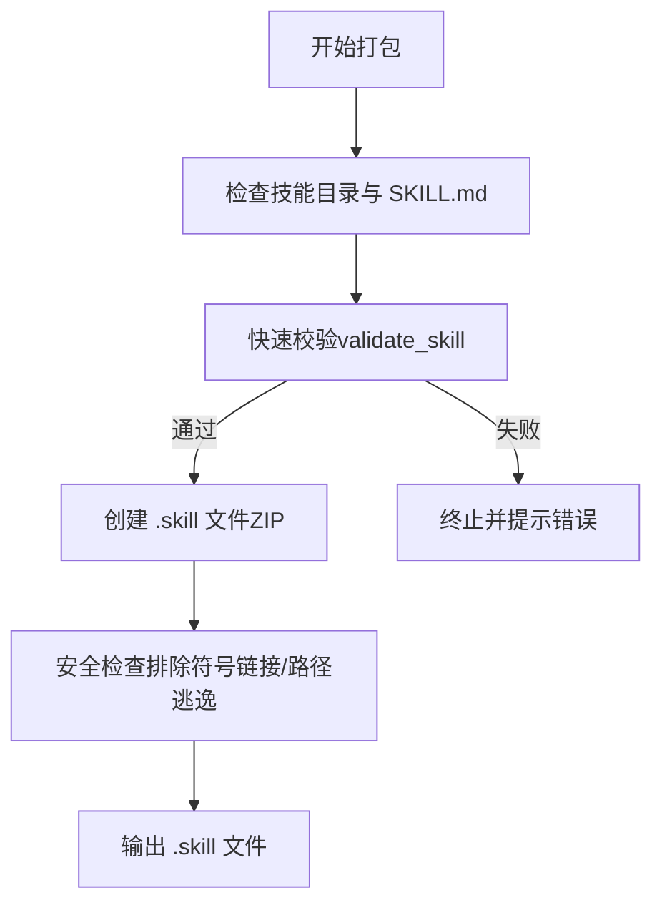
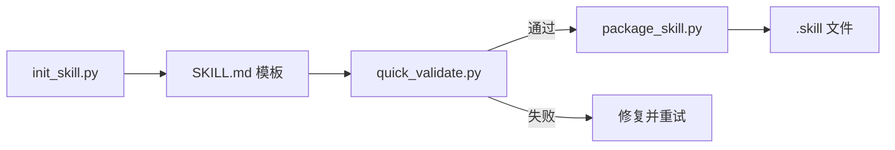

# 技能创建流程

<cite>
**本文引用的文件**
- [docs/tools/creating-skills.md](file://docs/tools/creating-skills.md)
- [docs/tools/skills.md](file://docs/tools/skills.md)
- [skills/skill-creator/SKILL.md](file://skills/skill-creator/SKILL.md)
- [skills/skill-creator/scripts/init_skill.py](file://skills/skill-creator/scripts/init_skill.py)
- [skills/skill-creator/scripts/package_skill.py](file://skills/skill-creator/scripts/package_skill.py)
- [skills/skill-creator/scripts/quick_validate.py](file://skills/skill-creator/scripts/quick_validate.py)
- [skills/skill-creator/scripts/test_package_skill.py](file://skills/skill-creator/scripts/test_package_skill.py)
- [skills/skill-creator/scripts/test_quick_validate.py](file://skills/skill-creator/scripts/test_quick_validate.py)
- [skills/coding-agent/SKILL.md](file://skills/coding-agent/SKILL.md)
- [skills/summarize/SKILL.md](file://skills/summarize/SKILL.md)
- [skills/model-usage/SKILL.md](file://skills/model-usage/SKILL.md)
- [skills/nano-banana-pro/SKILL.md](file://skills/nano-banana-pro/SKILL.md)
</cite>

## 目录
1. [引言](#引言)
2. [项目结构](#项目结构)
3. [核心组件](#核心组件)
4. [架构总览](#架构总览)
5. [详细组件分析](#详细组件分析)
6. [依赖关系分析](#依赖关系分析)
7. [性能考量](#性能考量)
8. [故障排查指南](#故障排查指南)
9. [结论](#结论)
10. [附录](#附录)

## 引言
本指南面向OpenClaw技能开发者，系统讲解“技能创建流程”的六大步骤：理解技能需求、规划可复用内容、初始化技能项目、编辑技能内容、打包技能与发布、以及基于真实使用的迭代改进。文档结合仓库中的官方技能文档、技能创建器（Skill Creator）及其自动化脚本，给出可落地的操作方法、最佳实践、注意事项与质量保障流程，并提供命名规范、目录结构与文件组织原则，帮助你从零到一构建高质量、可分发、可维护的OpenClaw技能。

## 项目结构
OpenClaw的技能生态由三类来源构成，且遵循明确的优先级与加载规则：
- 内置技能（随安装包或应用自带）
- 受管/本地技能（用户主目录下的受控位置）
- 工作区技能（当前工作空间内的私有覆盖）

此外，插件可自带技能目录；ClawHub提供公共技能注册与同步能力。技能发现与加载还支持监视自动刷新、会话快照等机制，以提升性能与开发体验。

**图表来源**
- [docs/tools/skills.md:13-48](file://docs/tools/skills.md#L13-L48)

**章节来源**
- [docs/tools/skills.md:13-48](file://docs/tools/skills.md#L13-L48)

## 核心组件
围绕技能创建流程，核心组件包括：
- 技能文档（SKILL.md）：定义元数据（name、description、metadata等）与使用说明
- 可复用资源：scripts/（脚本）、references/（参考文档）、assets/（输出资源）
- 自动化工具链：初始化脚本、快速校验脚本、打包脚本
- 官方技能示例：coding-agent、summarize、model-usage、nano-banana-pro 等

这些组件共同支撑“从需求到交付再到迭代”的完整闭环。

**章节来源**
- [skills/skill-creator/SKILL.md:46-126](file://skills/skill-creator/SKILL.md#L46-L126)
- [skills/skill-creator/scripts/init_skill.py:23-108](file://skills/skill-creator/scripts/init_skill.py#L23-L108)
- [skills/skill-creator/scripts/quick_validate.py:67-149](file://skills/skill-creator/scripts/quick_validate.py#L67-L149)
- [skills/skill-creator/scripts/package_skill.py:28-112](file://skills/skill-creator/scripts/package_skill.py#L28-L112)

## 架构总览
下图展示了技能从创建到发布的端到端流程，以及关键的自动化工具与质量控制点：

**图表来源**
- [skills/skill-creator/SKILL.md:201-213](file://skills/skill-creator/SKILL.md#L201-L213)
- [skills/skill-creator/scripts/init_skill.py:255-317](file://skills/skill-creator/scripts/init_skill.py#L255-L317)
- [skills/skill-creator/scripts/quick_validate.py:67-149](file://skills/skill-creator/scripts/quick_validate.py#L67-L149)
- [skills/skill-creator/scripts/package_skill.py:28-112](file://skills/skill-creator/scripts/package_skill.py#L28-L112)

## 详细组件分析

### 步骤一：理解技能需求
- 明确技能要解决的具体任务域与典型触发词
- 收集或生成用户可能的提问方式与上下文
- 形成对“何时使用该技能”的清晰边界与限制条件
- 建议在SKILL.md的description中直接体现触发条件与适用范围

参考示例：
- coding-agent 的描述明确了适用场景与禁用场景
- summarize 的“触发短语”清单便于模型识别
- model-usage 的“当前模型逻辑”体现了对输入输出的约束

**章节来源**
- [skills/coding-agent/SKILL.md:1-10](file://skills/coding-agent/SKILL.md#L1-L10)
- [skills/summarize/SKILL.md:29-37](file://skills/summarize/SKILL.md#L29-L37)
- [skills/model-usage/SKILL.md:44-49](file://skills/model-usage/SKILL.md#L44-L49)

### 步骤二：规划可复用内容
- scripts/：适合重复执行、需要确定性与可靠性的自动化脚本
- references/：深度文档、API参考、Schema、公司政策等，按需加载
- assets/：模板、图标、字体、样本文件等，用于最终输出而非上下文加载

设计原则：
- 将“核心流程”保留在SKILL.md，将“变体细节”放入references/或scripts/
- 避免在技能内写入README/INSTALLATION_GUIDE/CHANGELOG等辅助文档

**章节来源**
- [skills/skill-creator/SKILL.md:70-126](file://skills/skill-creator/SKILL.md#L70-L126)

### 步骤三：初始化技能项目
使用技能创建器提供的初始化脚本，一键生成符合规范的技能目录与模板SKILL.md，并可选择创建scripts/references/assets目录及示例文件。

关键特性：
- 自动规范化技能名（仅小写字母、数字、连字符）
- 生成含TODO占位符的SKILL.md模板
- 按需创建资源目录与示例文件
- 输出下一步指引

**图表来源**
- [skills/skill-creator/scripts/init_skill.py:255-317](file://skills/skill-creator/scripts/init_skill.py#L255-L317)

**章节来源**
- [skills/skill-creator/scripts/init_skill.py:5-13](file://skills/skill-creator/scripts/init_skill.py#L5-L13)
- [skills/skill-creator/scripts/init_skill.py:255-317](file://skills/skill-creator/scripts/init_skill.py#L255-L317)

### 步骤四：编辑技能内容
- 完善SKILL.md的frontmatter（name、description），确保触发条件明确
- 在正文部分编写清晰的使用说明、流程图、决策树与示例
- 合理组织scripts/references/assets，确保最小上下文开销与按需加载

参考示例：
- coding-agent 提供了CLI参数表、动作表与多场景模式
- nano-banana-pro 展示了脚本调用与API密钥注入方式
- model-usage 展示了脚本化摘要与输入输出约定

**章节来源**
- [skills/coding-agent/SKILL.md:37-102](file://skills/coding-agent/SKILL.md#L37-L102)
- [skills/nano-banana-pro/SKILL.md:28-66](file://skills/nano-banana-pro/SKILL.md#L28-L66)
- [skills/model-usage/SKILL.md:33-70](file://skills/model-usage/SKILL.md#L33-L70)

### 步骤五：打包技能与发布
在完成开发与测试后，使用打包脚本生成可分发的.zip格式“.skill”文件。打包前会先进行快速校验，拒绝不合规的技能。

安全与合规要点：
- 不打包符号链接
- 不允许路径逃逸（防止将外部文件打包进技能）
- 输出文件不包含自身（避免自引用）
- 排除.git、node_modules等无关目录

**图表来源**
- [skills/skill-creator/scripts/package_skill.py:28-112](file://skills/skill-creator/scripts/package_skill.py#L28-L112)
- [skills/skill-creator/scripts/quick_validate.py:67-149](file://skills/skill-creator/scripts/quick_validate.py#L67-L149)

**章节来源**
- [skills/skill-creator/scripts/package_skill.py:1-140](file://skills/skill-creator/scripts/package_skill.py#L1-L140)
- [skills/skill-creator/scripts/test_package_skill.py:33-157](file://skills/skill-creator/scripts/test_package_skill.py#L33-L157)

### 步骤六：迭代改进
- 基于真实使用反馈，识别SKILL.md与资源的不足
- 优化触发条件、流程与示例，必要时拆分references/或新增scripts
- 重复“校验→打包→发布→迭代”的闭环

**章节来源**
- [skills/skill-creator/SKILL.md:363-373](file://skills/skill-creator/SKILL.md#L363-L373)

## 依赖关系分析
技能创建器的三个脚本协同工作，形成“初始化→校验→打包”的依赖链：

**图表来源**
- [skills/skill-creator/scripts/init_skill.py:255-317](file://skills/skill-creator/scripts/init_skill.py#L255-L317)
- [skills/skill-creator/scripts/quick_validate.py:67-149](file://skills/skill-creator/scripts/quick_validate.py#L67-L149)
- [skills/skill-creator/scripts/package_skill.py:28-112](file://skills/skill-creator/scripts/package_skill.py#L28-L112)

**章节来源**
- [skills/skill-creator/scripts/init_skill.py:1-379](file://skills/skill-creator/scripts/init_skill.py#L1-L379)
- [skills/skill-creator/scripts/quick_validate.py:1-160](file://skills/skill-creator/scripts/quick_validate.py#L1-L160)
- [skills/skill-creator/scripts/package_skill.py:1-140](file://skills/skill-creator/scripts/package_skill.py#L1-L140)

## 性能考量
- 上下文窗口与token成本：技能列表会被注入到系统提示中，建议保持SKILL.md主体简洁，将长文档放入references/按需加载
- 会话快照：OpenClaw在会话开始时快照可用技能，变更在新会话生效
- 监视与热重载：可通过配置启用技能文件变更监视，实现技能更新的热重载

**章节来源**
- [docs/tools/skills.md:242-247](file://docs/tools/skills.md#L242-L247)
- [docs/tools/skills.md:254-267](file://docs/tools/skills.md#L254-L267)

## 故障排查指南
常见问题与处理建议：
- SKILL.md格式错误
  - 使用快速校验脚本定位frontmatter语法与字段缺失问题
  - 若未安装PyYAML，回退解析器仍可识别简单键值映射
- 名称不合规
  - 仅允许小写字母、数字、连字符；禁止首尾连字符与连续连字符；长度不超过64字符
- 路径逃逸与符号链接
  - 打包阶段会拒绝符号链接与路径逃逸文件，确保只打包技能根目录内的文件
- 输出目录与自引用
  - 当输出目录位于技能根内时，会跳过自身输出文件

**章节来源**
- [skills/skill-creator/scripts/quick_validate.py:67-149](file://skills/skill-creator/scripts/quick_validate.py#L67-L149)
- [skills/skill-creator/scripts/test_quick_validate.py:13-73](file://skills/skill-creator/scripts/test_quick_validate.py#L13-L73)
- [skills/skill-creator/scripts/package_skill.py:75-112](file://skills/skill-creator/scripts/package_skill.py#L75-L112)
- [skills/skill-creator/scripts/test_package_skill.py:111-157](file://skills/skill-creator/scripts/test_package_skill.py#L111-L157)

## 结论
通过“理解需求→规划资源→初始化→编辑→校验→打包→迭代”的标准化流程，结合技能创建器的自动化脚本与官方技能示例，你可以高效地构建高质量、可维护、可分发的OpenClaw技能。严格遵守命名规范、目录结构与安全策略，是确保技能在生产环境中稳定运行与持续演进的关键。

## 附录

### 技能命名规范与目录结构
- 命名规范
  - 仅允许小写字母、数字、连字符
  - 长度不超过64字符
  - 首尾不得为连字符，禁止连续连字符
  - 建议采用动词+名词的简短形式，必要时加工具前缀
- 目录结构
  - 必须包含 SKILL.md
  - 可选 scripts/、references/、assets/
  - 不包含README/INSTALLATION_GUIDE/CHANGELOG等辅助文档

**章节来源**
- [skills/skill-creator/SKILL.md:214-221](file://skills/skill-creator/SKILL.md#L214-L221)
- [skills/skill-creator/SKILL.md:46-126](file://skills/skill-creator/SKILL.md#L46-L126)

### 自动化工具配置与使用
- 初始化
  - 用法：init_skill.py <技能名> --path <输出目录> [--resources scripts,references,assets] [--examples]
  - 功能：创建目录、生成模板SKILL.md、可选创建资源目录与示例文件
- 快速校验
  - 用法：quick_validate.py <技能目录>
  - 功能：校验frontmatter格式、name/description合法性
- 打包
  - 用法：package_skill.py <技能目录> [输出目录]
  - 功能：校验通过后生成 .skill 文件，拒绝符号链接与路径逃逸

**章节来源**
- [skills/skill-creator/scripts/init_skill.py:5-13](file://skills/skill-creator/scripts/init_skill.py#L5-L13)
- [skills/skill-creator/scripts/quick_validate.py:152-159](file://skills/skill-creator/scripts/quick_validate.py#L152-L159)
- [skills/skill-creator/scripts/package_skill.py:114-136](file://skills/skill-creator/scripts/package_skill.py#L114-L136)

### 实际案例参考
- 编码代理（coding-agent）：展示CLI参数、动作表与背景执行模式
- 文本摘要（summarize）：展示触发短语、YouTube转录与模型配置
- 模型用量（model-usage）：展示脚本化摘要与输入输出约定
- 图像生成（nano-banana-pro）：展示脚本调用与API密钥注入

**章节来源**
- [skills/coding-agent/SKILL.md:108-296](file://skills/coding-agent/SKILL.md#L108-L296)
- [skills/summarize/SKILL.md:1-88](file://skills/summarize/SKILL.md#L1-L88)
- [skills/model-usage/SKILL.md:1-70](file://skills/model-usage/SKILL.md#L1-L70)
- [skills/nano-banana-pro/SKILL.md:1-66](file://skills/nano-banana-pro/SKILL.md#L1-L66)