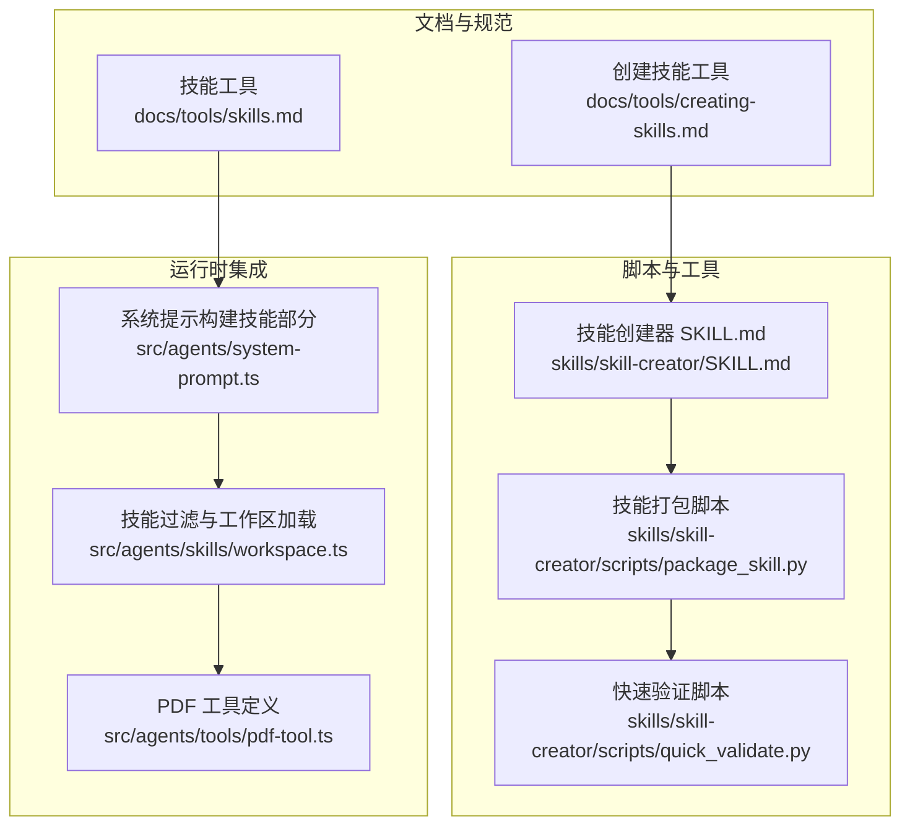
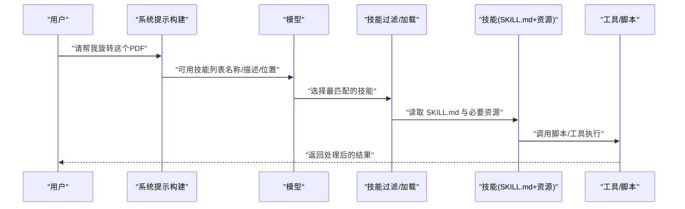
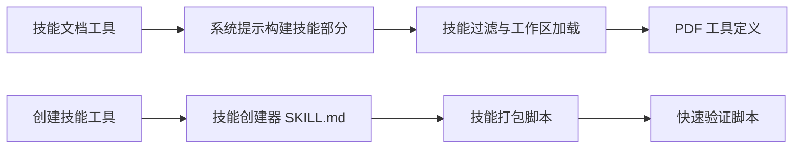

# 理解技能需求

<cite>
**本文引用的文件**
- [技能文档（工具）](file://docs/tools/skills.md)
- [创建技能（工具）](file://docs/tools/creating-skills.md)
- [技能创建器 SKILL.md](file://skills/skill-creator/SKILL.md)
- [技能打包脚本](file://skills/skill-creator/scripts/package_skill.py)
- [快速验证脚本](file://skills/skill-creator/scripts/quick_validate.py)
- [系统提示构建（技能部分）](file://src/agents/system-prompt.ts)
- [技能过滤与工作区加载](file://src/agents/skills/workspace.ts)
- [PDF 工具定义](file://src/agents/tools/pdf-tool.ts)
- [nano-pdf 技能](file://skills/nano-pdf/SKILL.md)
- [Canvas 技能](file://skills/canvas/SKILL.md)
- [OpenAI 图像生成技能](file://skills/openai-image-gen/SKILL.md)
</cite>

## 目录
1. [简介](#简介)
2. [项目结构](#项目结构)
3. [核心组件](#核心组件)
4. [架构总览](#架构总览)
5. [详细组件分析](#详细组件分析)
6. [依赖关系分析](#依赖关系分析)
7. [性能考量](#性能考量)
8. [故障排查指南](#故障排查指南)
9. [结论](#结论)
10. [附录](#附录)

## 简介
本指南面向在 OpenClaw 中设计与落地“技能”的实践者，聚焦于“理解技能需求”的实操步骤：如何通过具体示例澄清技能的功能边界、触发条件与使用场景；如何收集与分析用户需求；如何避免信息过载并逐步深入；何时可跳过该步骤；以及如何验证需求理解的正确性。文档同时给出图像编辑、PDF 处理等常见技能类型的使用场景分析，帮助你从“用户说什么”到“技能如何做”建立清晰映射。

## 项目结构
围绕“技能需求理解”，OpenClaw 提供了多处支撑：
- 文档层：技能与创建技能的官方文档，明确技能格式、加载规则、配置注入与安全注意事项。
- 脚本层：技能创建器中的 SKILL.md 指南、初始化与打包脚本，提供从“理解需求”到“产出可分发技能包”的流程化工具。
- 运行时层：系统提示中对可用技能的组织方式、技能过滤与加载策略，确保“需求理解”能被模型正确感知与选择。

图表来源
- [技能文档（工具）:1-303](file://docs/tools/skills.md#L1-L303)
- [创建技能（工具）:1-59](file://docs/tools/creating-skills.md#L1-L59)
- [技能创建器 SKILL.md:1-373](file://skills/skill-creator/SKILL.md#L1-L373)
- [技能打包脚本:1-140](file://skills/skill-creator/scripts/package_skill.py#L1-L140)
- [快速验证脚本:136-159](file://skills/skill-creator/scripts/quick_validate.py#L136-L159)
- [系统提示构建（技能部分）:20-36](file://src/agents/system-prompt.ts#L20-L36)
- [技能过滤与工作区加载:68-100](file://src/agents/skills/workspace.ts#L68-L100)
- [PDF 工具定义:337-367](file://src/agents/tools/pdf-tool.ts#L337-L367)

章节来源
- [技能文档（工具）:1-303](file://docs/tools/skills.md#L1-L303)
- [创建技能（工具）:1-59](file://docs/tools/creating-skills.md#L1-L59)
- [技能创建器 SKILL.md:1-373](file://skills/skill-creator/SKILL.md#L1-L373)
- [技能打包脚本:1-140](file://skills/skill-creator/scripts/package_skill.py#L1-L140)
- [快速验证脚本:136-159](file://skills/skill-creator/scripts/quick_validate.py#L136-L159)
- [系统提示构建（技能部分）:20-36](file://src/agents/system-prompt.ts#L20-L36)
- [技能过滤与工作区加载:68-100](file://src/agents/skills/workspace.ts#L68-L100)
- [PDF 工具定义:337-367](file://src/agents/tools/pdf-tool.ts#L337-L367)

## 核心组件
- 需求理解流程（基于技能创建器 SKILL.md）
  - 明确“具体示例”：从用户真实或生成的请求出发，提炼典型用例与边界。
  - 识别触发词与上下文：用户会怎么说、在什么场景下说，从而形成技能描述中的触发条件。
  - 限定功能范围：避免过度承诺，聚焦核心能力，减少上下文负担。
- 验证与迭代
  - 快速验证：检查 SKILL.md 前言元数据、长度与字符限制等。
  - 打包与安全：生成 .skill 文件，拒绝符号链接，确保路径不逃逸。
  - 实战反馈：上线后基于真实任务进行迭代优化。

章节来源
- [技能创建器 SKILL.md:222-267](file://skills/skill-creator/SKILL.md#L222-L267)
- [技能打包脚本:28-112](file://skills/skill-creator/scripts/package_skill.py#L28-L112)
- [快速验证脚本:136-149](file://skills/skill-creator/scripts/quick_validate.py#L136-L149)

## 架构总览
OpenClaw 的“技能需求理解”贯穿以下链路：
- 用户输入 → 系统提示（含可用技能清单）→ 模型选择最合适的技能 → 加载 SKILL.md 与资源 → 执行工具/脚本 → 输出结果。
- 技能的可用性由加载规则与环境注入决定，确保“需求理解”与“执行环境”一致。

图表来源
- [系统提示构建（技能部分）:20-36](file://src/agents/system-prompt.ts#L20-L36)
- [技能过滤与工作区加载:68-100](file://src/agents/skills/workspace.ts#L68-L100)
- [技能打包脚本:56-63](file://skills/skill-creator/scripts/package_skill.py#L56-L63)

## 详细组件分析

### 组件一：需求理解步骤（以“图像编辑”为例）
目标：通过具体示例理解“图像编辑”技能的功能边界、触发条件与使用场景，避免信息过载并逐步深入。

- 具体示例收集
  - 问法模板（建议按优先级递进）：
    - “这个技能要支持哪些图像操作？”（先定边界）
    - “你能举几个典型场景吗？”（从用户口吻出发）
    - “用户通常会怎么说来触发这个技能？”（触发词与上下文）
    - “如果遇到失败或边界情况，应该如何处理？”（异常与兜底）
  - 示例对话要点（不展示具体代码，仅示意思路）：
    - 场景A：用户说“把这张照片的红眼去掉”，应触发“去红眼”流程。
    - 场景B：用户说“把图片旋转90度”，应触发“旋转”流程。
    - 场景C：用户说“把图片裁剪成正方形”，应触发“裁剪”流程。
    - 场景D：用户说“批量处理这些图片”，应触发“批处理”流程。
  - 触发词与上下文：
    - 关键动词：旋转、裁剪、去红眼、调整亮度、批量处理、导出。
    - 上下文：图片路径/URL、目标尺寸、输出格式、质量参数。
  - 功能范围收敛：
    - 仅聚焦“常见编辑操作”，不承诺“所有图像软件功能”。
    - 将复杂流程拆分为子任务（如“旋转”、“裁剪”独立技能）。

- 何时可跳过
  - 当已有成熟技能且使用模式稳定，可直接复用其 SKILL.md 描述与资源，无需重复“从零理解”。

- 验证需求理解
  - 用“具体示例”回测：列出若干用户可能的表达，逐一对照是否能触发预期技能。
  - 用“最小可行清单”校验：只保留“必须”的功能点，删除冗余细节。

章节来源
- [技能创建器 SKILL.md（Step 1）:222-237](file://skills/skill-creator/SKILL.md#L222-L237)

### 组件二：需求理解步骤（以“PDF 处理”为例）
目标：通过具体示例理解“PDF 处理”技能的功能边界、触发条件与使用场景。

- 具体示例收集
  - 问法模板（建议按优先级递进）：
    - “这个技能要支持哪些 PDF 操作？”（先定边界）
    - “你能举几个典型场景吗？比如编辑某页内容、合并/拆分、提取文本？”
    - “用户通常会怎么说来触发这个技能？”（触发词与上下文）
    - “如果遇到密码保护/加密PDF，应该如何处理？”（异常与兜底）
  - 示例对话要点（不展示具体代码，仅示意思路）：
    - 场景A：用户说“把第一页的内容改一下”，应触发“按页编辑”流程。
    - 场景B：用户说“把两个PDF合并”，应触发“合并”流程。
    - 场景C：用户说“提取所有文字”，应触发“OCR/文本提取”流程。
    - 场景D：用户说“导出为图片”，应触发“页面转图片”流程。
  - 触发词与上下文：
    - 关键动词：编辑、合并、拆分、提取、转图片、加水印。
    - 上下文：页码范围、输入文件、输出路径、质量参数。
  - 功能范围收敛：
    - 仅聚焦“常见 PDF 操作”，不承诺“所有PDF软件功能”。
    - 将复杂流程拆分为子任务（如“编辑”“合并”“提取”独立技能）。

- 何时可跳过
  - 当已有成熟技能（如 nano-pdf）且使用模式稳定，可直接复用其 SKILL.md 描述与资源，无需重复“从零理解”。

- 验证需求理解
  - 用“具体示例”回测：列出若干用户可能的表达，逐一对照是否能触发预期技能。
  - 用“最小可行清单”校验：只保留“必须”的功能点，删除冗余细节。

章节来源
- [技能创建器 SKILL.md（Step 1）:222-237](file://skills/skill-creator/SKILL.md#L222-L237)
- [nano-pdf 技能:1-39](file://skills/nano-pdf/SKILL.md#L1-L39)

### 组件三：规划可复用内容（脚本/参考/资产）
目标：将“具体示例”转化为“可复用资源”，降低重复劳动与错误率。

- 分析方法
  - 对每个示例，思考“从零执行需要做什么”和“哪些资源可长期复用”。
  - 举例：
    - PDF 编辑：每次都需要重写相同逻辑 → 引入脚本目录（scripts/）。
    - 前端应用构建：每次都需要相同的模板 → 引入资产目录（assets/）。
    - 数据库查询：每次都需要重新查找表结构 → 引入参考目录（references/）。

- 资源类型与用途
  - scripts/：可执行代码，适合确定性高、重复性强的任务。
  - references/：文档与参考材料，按需加载，避免占用上下文窗口。
  - assets/：最终输出使用的文件（模板、图标、字体等），不加载到上下文。

- 何时可跳过
  - 当现有技能已具备所需资源，无需重复“从零规划”。

章节来源
- [技能创建器 SKILL.md（Step 2）:239-261](file://skills/skill-creator/SKILL.md#L239-L261)

### 组件四：初始化与编辑技能
目标：基于“理解与规划”，生成可执行的技能骨架并完善 SKILL.md 与资源。

- 初始化
  - 使用初始化脚本生成模板目录与 SKILL.md 框架，自动包含必要的资源目录与占位文件。
  - 可选添加示例文件，后续替换或删除。

- 编辑 SKILL.md
  - 前言元数据：name 与 description 是触发机制的核心，需清晰描述“做什么”和“何时使用”。
  - 正文：提供使用指南、流程说明与资源引用，避免在正文重复“何时使用”的信息（已在前言描述中体现）。

- 何时可跳过
  - 当技能已存在且只需迭代或打包，可跳过初始化，直接进入编辑与打包阶段。

章节来源
- [技能创建器 SKILL.md（Step 3/4）:263-314](file://skills/skill-creator/SKILL.md#L263-L314)

### 组件五：验证与打包（安全与合规）
目标：确保技能符合规范、可安全分发与安装。

- 快速验证
  - 检查前言元数据格式、描述长度与字符限制等。
  - 若验证失败，修复后再打包。

- 打包
  - 生成 .skill 文件（zip 格式），包含技能目录结构。
  - 安全限制：拒绝符号链接；禁止路径逃逸；避免将输出归档写入自身。

- 何时可跳过
  - 当技能处于开发或内部测试阶段，未对外发布，可跳过正式打包流程。

章节来源
- [快速验证脚本:136-149](file://skills/skill-creator/scripts/quick_validate.py#L136-L149)
- [技能打包脚本:28-112](file://skills/skill-creator/scripts/package_skill.py#L28-L112)

### 组件六：实战验证与迭代
目标：通过真实任务检验需求理解的正确性，并持续优化。

- 迭代流程
  - 使用技能完成真实任务 → 发现痛点与不足 → 更新 SKILL.md 或资源 → 再次测试。
- 与运行时的衔接
  - 系统提示中会列出可用技能（名称/描述/位置），模型据此选择技能。
  - 技能过滤与加载会根据环境与配置决定技能是否可用。

章节来源
- [系统提示构建（技能部分）:20-36](file://src/agents/system-prompt.ts#L20-L36)
- [技能过滤与工作区加载:68-100](file://src/agents/skills/workspace.ts#L68-L100)
- [技能创建器 SKILL.md（Step 6）:363-373](file://skills/skill-creator/SKILL.md#L363-L373)

## 依赖关系分析
- 文档与脚本的耦合
  - 技能文档（工具）定义了 SKILL.md 的格式与加载规则，技能创建器 SKILL.md 提供了“理解需求”的步骤与最佳实践。
  - 打包脚本与快速验证脚本保证技能在分发前满足规范与安全要求。
- 运行时与需求理解的耦合
  - 系统提示构建与技能过滤决定了“需求理解”能否被模型正确感知与选择。
  - 工具定义（如 PDF 工具）明确了技能可调用的具体能力边界。

图表来源
- [技能文档（工具）:78-102](file://docs/tools/skills.md#L78-L102)
- [创建技能（工具）:27-48](file://docs/tools/creating-skills.md#L27-L48)
- [技能创建器 SKILL.md:201-211](file://skills/skill-creator/SKILL.md#L201-L211)
- [技能打包脚本:28-63](file://skills/skill-creator/scripts/package_skill.py#L28-L63)
- [快速验证脚本:136-149](file://skills/skill-creator/scripts/quick_validate.py#L136-L149)
- [系统提示构建（技能部分）:20-36](file://src/agents/system-prompt.ts#L20-L36)
- [技能过滤与工作区加载:68-100](file://src/agents/skills/workspace.ts#L68-L100)
- [PDF 工具定义:337-367](file://src/agents/tools/pdf-tool.ts#L337-L367)

章节来源
- [技能文档（工具）:78-102](file://docs/tools/skills.md#L78-L102)
- [技能创建器 SKILL.md:201-211](file://skills/skill-creator/SKILL.md#L201-L211)
- [技能打包脚本:28-63](file://skills/skill-creator/scripts/package_skill.py#L28-L63)
- [系统提示构建（技能部分）:20-36](file://src/agents/system-prompt.ts#L20-L36)
- [技能过滤与工作区加载:68-100](file://src/agents/skills/workspace.ts#L68-L100)
- [PDF 工具定义:337-367](file://src/agents/tools/pdf-tool.ts#L337-L367)

## 性能考量
- 上下文窗口与成本控制
  - SKILL.md 的主体内容应保持精炼，避免无谓膨胀；将详细参考放入 references/ 并按需加载。
  - 系统提示中会注入可用技能列表，注意技能数量与描述长度对 token 的影响。
- 执行效率
  - 将重复性强、确定性高的逻辑封装为脚本，减少每次从零编写带来的误差与时间成本。
- 环境与二进制依赖
  - 在 SKILL.md 的 metadata 中声明所需的二进制与环境变量，确保加载时可正确探测与注入。

章节来源
- [技能文档（工具）:269-286](file://docs/tools/skills.md#L269-L286)
- [技能文档（工具）:106-147](file://docs/tools/skills.md#L106-L147)

## 故障排查指南
- 打包失败（符号链接/路径逃逸）
  - 症状：打包时报错，拒绝符号链接或检测到路径逃逸。
  - 排查：检查技能目录中是否存在符号链接；确认输出目录不在技能根内。
- 验证失败（描述过长/格式错误）
  - 症状：快速验证报错，提示描述长度超限或格式不符。
  - 排查：缩短描述长度，确保前言元数据为单行 JSON，且包含 name 与 description。
- 技能未被模型选择
  - 症状：用户请求与技能描述匹配，但模型未触发。
  - 排查：检查 SKILL.md 的 description 是否准确覆盖触发词与上下文；确认技能已启用且环境变量已注入。

章节来源
- [技能打包脚本:82-99](file://skills/skill-creator/scripts/package_skill.py#L82-L99)
- [快速验证脚本:136-149](file://skills/skill-creator/scripts/quick_validate.py#L136-L149)
- [系统提示构建（技能部分）:20-36](file://src/agents/system-prompt.ts#L20-L36)

## 结论
“理解技能需求”是技能设计的第一步，也是决定后续执行效率与用户体验的关键。通过“具体示例 + 触发词 + 功能边界”的三要素，结合“脚本/参考/资产”的可复用资源规划，再经由“验证与打包”的安全流程，最终实现“从用户说什么到技能怎么做”的闭环。在图像编辑、PDF 处理等常见场景中，遵循上述步骤可显著提升技能的稳定性与可维护性。

## 附录

### 实际案例分析：图像编辑
- 典型场景
  - 去红眼、旋转、裁剪、批量处理、导出为指定格式。
- 触发词与上下文
  - 关键动词：去红眼、旋转、裁剪、批量、导出。
  - 上下文：图片路径/URL、目标尺寸、输出格式、质量参数。
- 资源规划
  - scripts/：封装常见编辑操作的脚本。
  - references/：提供算法原理与参数说明。
  - assets/：模板与品牌素材。

章节来源
- [技能创建器 SKILL.md（Step 1/2）:222-261](file://skills/skill-creator/SKILL.md#L222-L261)

### 实际案例分析：PDF 处理
- 典型场景
  - 按页编辑、合并/拆分、提取文本、转图片、加水印。
- 触发词与上下文
  - 关键动词：编辑、合并、拆分、提取、转图片、加水印。
  - 上下文：页码范围、输入文件、输出路径、质量参数。
- 资源规划
  - scripts/：封装 PDF 处理脚本。
  - references/：提供 API 文档与表结构说明。
  - assets/：模板与图标。

章节来源
- [技能创建器 SKILL.md（Step 1/2）:222-261](file://skills/skill-creator/SKILL.md#L222-L261)
- [nano-pdf 技能:1-39](file://skills/nano-pdf/SKILL.md#L1-L39)

### 与运行时的衔接
- 系统提示中的技能列表
  - 系统会在提示中注入可用技能清单，模型据此选择技能。
- 技能过滤与加载
  - 根据环境、配置与二进制探测决定技能是否可用；支持按需刷新与热重载。

章节来源
- [系统提示构建（技能部分）:20-36](file://src/agents/system-prompt.ts#L20-L36)
- [技能过滤与工作区加载:68-100](file://src/agents/skills/workspace.ts#L68-L100)