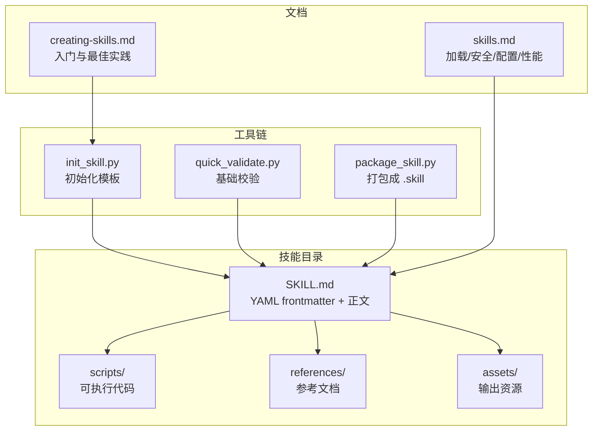
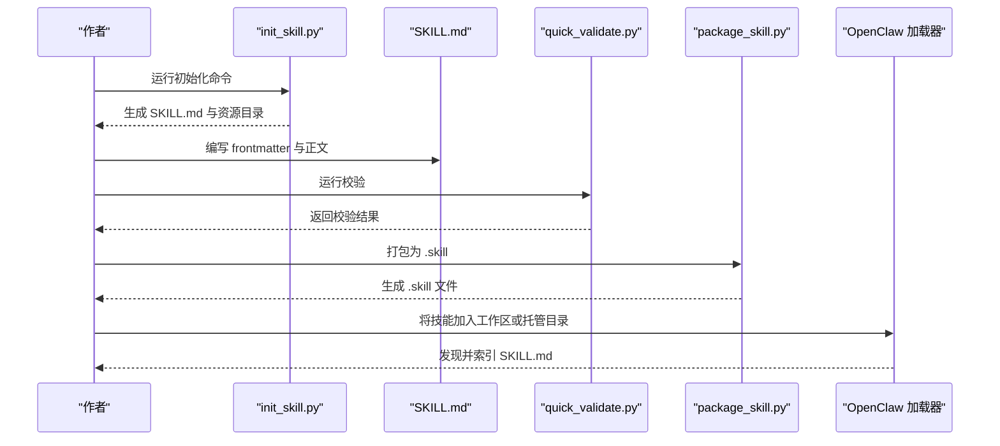
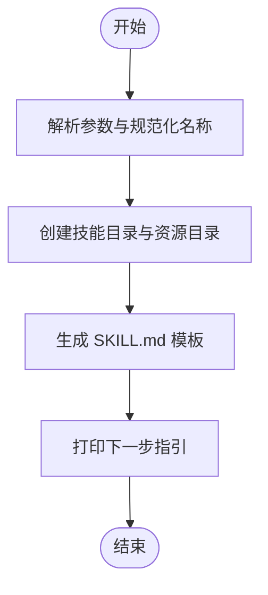
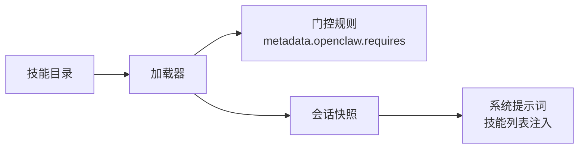

# 编辑技能内容

<cite>
**本文档引用的文件**
- [docs/tools/creating-skills.md](file://docs/tools/creating-skills.md)
- [docs/tools/skills.md](file://docs/tools/skills.md)
- [skills/skill-creator/SKILL.md](file://skills/skill-creator/SKILL.md)
- [skills/skill-creator/scripts/init_skill.py](file://skills/skill-creator/scripts/init_skill.py)
- [skills/skill-creator/scripts/package_skill.py](file://skills/skill-creator/scripts/package_skill.py)
- [skills/skill-creator/scripts/quick_validate.py](file://skills/skill-creator/scripts/quick_validate.py)
- [skills/1password/SKILL.md](file://skills/1password/SKILL.md)
- [skills/1password/references/get-started.md](file://skills/1password/references/get-started.md)
- [skills/1password/references/cli-examples.md](file://skills/1password/references/cli-examples.md)
- [skills/canvas/SKILL.md](file://skills/canvas/SKILL.md)
- [skills/discord/SKILL.md](file://skills/discord/SKILL.md)
- [skills/summarize/SKILL.md](file://skills/summarize/SKILL.md)
</cite>

## 目录
1. [简介](#简介)
2. [项目结构](#项目结构)
3. [核心组件](#核心组件)
4. [架构总览](#架构总览)
5. [详细组件分析](#详细组件分析)
6. [依赖关系分析](#依赖关系分析)
7. [性能考量](#性能考量)
8. [故障排查指南](#故障排查指南)
9. [结论](#结论)
10. [附录](#附录)

## 简介
本指南面向在 OpenClaw 中创作与维护“技能（Skill）”内容的作者，目标是帮助你系统化地实现可复用资源、编写高质量的 SKILL.md 文档，并遵循统一的写作规范与设计模式。内容覆盖：
- 如何基于模板初始化技能目录与 SKILL.md
- SKILL.md 的 YAML frontmatter 规范、正文结构与指令格式
- 如何平衡上下文窗口与功能完整性：何时将详细信息放入 references/ 或 scripts/
- 设计模式参考：工作流模式、输出格式模式等
- 实际技能示例与修改建议

## 项目结构
OpenClaw 的技能内容主要由以下部分组成：
- 技能目录：每个技能是一个独立目录，包含 SKILL.md 以及可选的 scripts/、references/、assets/ 等资源
- 技能创建工具链：提供初始化、校验、打包能力
- 官方文档：指导技能创建、加载规则、安全与性能注意事项

**图表来源**
- [docs/tools/creating-skills.md:17-48](file://docs/tools/creating-skills.md#L17-L48)
- [docs/tools/skills.md:13-26](file://docs/tools/skills.md#L13-L26)
- [skills/skill-creator/scripts/init_skill.py:255-317](file://skills/skill-creator/scripts/init_skill.py#L255-L317)
- [skills/skill-creator/scripts/quick_validate.py:67-149](file://skills/skill-creator/scripts/quick_validate.py#L67-L149)
- [skills/skill-creator/scripts/package_skill.py:28-111](file://skills/skill-creator/scripts/package_skill.py#L28-L111)

**章节来源**
- [docs/tools/creating-skills.md:17-48](file://docs/tools/creating-skills.md#L17-L48)
- [docs/tools/skills.md:13-26](file://docs/tools/skills.md#L13-L26)

## 核心组件
- SKILL.md：技能的“说明书”，包含 YAML frontmatter（name、description 等）与正文（工作流、用法、参考链接等）
- 可选资源：
  - scripts/：可执行脚本，适合重复性高、确定性强的任务
  - references/：按需加载的参考文档，避免挤占上下文
  - assets/：最终输出使用的资源（模板、图标、字体等）
- 工具链：
  - 初始化：生成模板 SKILL.md 与资源目录
  - 校验：检查 frontmatter 结构、字段合法性
  - 打包：生成 .skill 文件用于分发

**章节来源**
- [skills/skill-creator/SKILL.md:46-126](file://skills/skill-creator/SKILL.md#L46-L126)
- [skills/skill-creator/scripts/init_skill.py:255-317](file://skills/skill-creator/scripts/init_skill.py#L255-L317)
- [skills/skill-creator/scripts/quick_validate.py:67-149](file://skills/skill-creator/scripts/quick_validate.py#L67-L149)
- [skills/skill-creator/scripts/package_skill.py:28-111](file://skills/skill-creator/scripts/package_skill.py#L28-L111)

## 架构总览
技能内容的生命周期与系统集成如下：

**图表来源**
- [skills/skill-creator/scripts/init_skill.py:320-379](file://skills/skill-creator/scripts/init_skill.py#L320-L379)
- [skills/skill-creator/scripts/quick_validate.py:152-160](file://skills/skill-creator/scripts/quick_validate.py#L152-L160)
- [skills/skill-creator/scripts/package_skill.py:114-140](file://skills/skill-creator/scripts/package_skill.py#L114-L140)
- [docs/tools/creating-skills.md:27-48](file://docs/tools/creating-skills.md#L27-L48)

## 详细组件分析

### SKILL.md 写作规范与模板
- YAML frontmatter 要求
  - 必填字段：name、description
  - 其他常用字段：homepage、allowed-tools、metadata.openclaw.*
  - 注意：frontmatter 为单行键值（AgentSkills 兼容）
- 正文结构建议
  - 概述：简要说明技能用途与适用场景
  - 使用时机：明确触发条件与典型输入
  - 快速开始：最小可行示例
  - 工作流/决策树：复杂任务的步骤化说明
  - 参考与资源：指向 references/ 的链接
  - 常见问题/提示：调试要点与最佳实践
- 指令格式
  - 使用祈使句/不定式形式，简洁明确
  - 避免冗长解释，优先“做什么”而非“怎么做”

参考示例与模板路径：
- [docs/tools/creating-skills.md:29-40](file://docs/tools/creating-skills.md#L29-L40)
- [skills/skill-creator/SKILL.md:315-330](file://skills/skill-creator/SKILL.md#L315-L330)
- [skills/skill-creator/SKILL.md:331-333](file://skills/skill-creator/SKILL.md#L331-L333)

**章节来源**
- [docs/tools/creating-skills.md:29-40](file://docs/tools/creating-skills.md#L29-L40)
- [skills/skill-creator/SKILL.md:315-333](file://skills/skill-creator/SKILL.md#L315-L333)

### 可复用资源组织策略
- scripts/
  - 适合重复性高、确定性强的任务；可直接执行，减少上下文占用
  - 示例：PDF 处理、图像旋转等
- references/
  - 仅在需要时按需加载，避免挤占上下文
  - 适合长文档、API 参考、Schema、公司政策等
- assets/
  - 输出资源（模板、图标、字体等），不加载到上下文
- 分离原则
  - SKILL.md 保持精炼（建议不超过 500 行），将细节迁移到 references/

参考示例：
- [skills/1password/SKILL.md:29-33](file://skills/1password/SKILL.md#L29-L33)
- [skills/skill-creator/SKILL.md:70-100](file://skills/skill-creator/SKILL.md#L70-L100)
- [skills/skill-creator/SKILL.md:81-91](file://skills/skill-creator/SKILL.md#L81-L91)
- [skills/skill-creator/SKILL.md:92-100](file://skills/skill-creator/SKILL.md#L92-L100)

**章节来源**
- [skills/1password/SKILL.md:29-33](file://skills/1password/SKILL.md#L29-L33)
- [skills/skill-creator/SKILL.md:70-100](file://skills/skill-creator/SKILL.md#L70-L100)

### 工具链：初始化、校验与打包
- 初始化（init_skill.py）
  - 生成模板 SKILL.md 与资源目录
  - 支持选择资源类型与是否生成示例
- 校验（quick_validate.py）
  - 检查 frontmatter 格式、字段合法性
  - 名称与描述长度、字符集约束
- 打包（package_skill.py）
  - 生成 .skill 文件（zip），自动排除敏感项与符号链接

**图表来源**
- [skills/skill-creator/scripts/init_skill.py:255-317](file://skills/skill-creator/scripts/init_skill.py#L255-L317)

**章节来源**
- [skills/skill-creator/scripts/init_skill.py:320-379](file://skills/skill-creator/scripts/init_skill.py#L320-L379)
- [skills/skill-creator/scripts/quick_validate.py:67-149](file://skills/skill-creator/scripts/quick_validate.py#L67-L149)
- [skills/skill-creator/scripts/package_skill.py:28-111](file://skills/skill-creator/scripts/package_skill.py#L28-L111)

### 设计模式参考
- 工作流模式（Workflow Pattern）
  - 适用于有明确步骤的多阶段任务
  - 在 SKILL.md 中提供“决策树/流程图”式的步骤说明
  - 参考：[skills/skill-creator/SKILL.md:127-143](file://skills/skill-creator/SKILL.md#L127-L143)
- 输出格式模式（Output Pattern）
  - 为特定输出（报告、模板、清单）提供格式与质量标准
  - 参考：[skills/skill-creator/SKILL.md:302-305](file://skills/skill-creator/SKILL.md#L302-L305)
- 条件详情模式（Conditional Details Pattern）
  - 基础内容 + 链接至高级细节，按需加载
  - 参考：[skills/skill-creator/SKILL.md:175-194](file://skills/skill-creator/SKILL.md#L175-L194)

**章节来源**
- [skills/skill-creator/SKILL.md:127-143](file://skills/skill-creator/SKILL.md#L127-L143)
- [skills/skill-creator/SKILL.md:302-305](file://skills/skill-creator/SKILL.md#L302-L305)
- [skills/skill-creator/SKILL.md:175-194](file://skills/skill-creator/SKILL.md#L175-L194)

### 实际技能示例与修改建议
- 1Password 技能
  - 使用 references/ 提供安装、登录、CLI 示例
  - 强调 tmux 会话的安全约束
  - 参考：[skills/1password/SKILL.md:29-71](file://skills/1password/SKILL.md#L29-L71)
- Canvas 技能
  - 介绍架构、动作、配置与调试
  - 提供 URL 结构与开发技巧
  - 参考：[skills/canvas/SKILL.md:1-199](file://skills/canvas/SKILL.md#L1-L199)
- Discord 技能
  - 明确必须项、指南、目标与常见动作示例
  - 参考：[skills/discord/SKILL.md:1-198](file://skills/discord/SKILL.md#L1-L198)
- Summarize 技能
  - 触发短语、快速开始、YouTube 摘要/转录差异、模型与密钥设置
  - 参考：[skills/summarize/SKILL.md:1-88](file://skills/summarize/SKILL.md#L1-L88)

**章节来源**
- [skills/1password/SKILL.md:29-71](file://skills/1password/SKILL.md#L29-L71)
- [skills/canvas/SKILL.md:1-199](file://skills/canvas/SKILL.md#L1-L199)
- [skills/discord/SKILL.md:1-198](file://skills/discord/SKILL.md#L1-L198)
- [skills/summarize/SKILL.md:1-88](file://skills/summarize/SKILL.md#L1-L88)

## 依赖关系分析
- 技能加载与过滤
  - 位置与优先级：<workspace>/skills > ~/.openclaw/skills > bundled
  - 加载时门控：metadata.openclaw.requires（二进制、环境变量、配置）
- 环境注入与会话快照
  - 运行时注入 env/apiKey，会话启动时快照技能列表
- 性能与上下文开销
  - 技能列表注入 prompt 的字符成本与 token 估算

**图表来源**
- [docs/tools/skills.md:13-26](file://docs/tools/skills.md#L13-L26)
- [docs/tools/skills.md:106-187](file://docs/tools/skills.md#L106-L187)
- [docs/tools/skills.md:230-246](file://docs/tools/skills.md#L230-L246)
- [docs/tools/skills.md:269-286](file://docs/tools/skills.md#L269-L286)

**章节来源**
- [docs/tools/skills.md:13-26](file://docs/tools/skills.md#L13-L26)
- [docs/tools/skills.md:106-187](file://docs/tools/skills.md#L106-L187)
- [docs/tools/skills.md:230-246](file://docs/tools/skills.md#L230-L246)
- [docs/tools/skills.md:269-286](file://docs/tools/skills.md#L269-L286)

## 性能考量
- 上下文窗口与 token 成本
  - 技能列表注入 prompt 的字符成本与 token 估算公式
  - 建议：将长文档放入 references/，SKILL.md 保持精炼
- 会话快照
  - 启动时快照，后续轮次复用；变更在新会话生效
- 远程节点与沙箱
  - macOS-only 技能在具备必要二进制时可被远程节点执行
  - 沙箱内二进制需在容器内可用

**章节来源**
- [docs/tools/skills.md:269-286](file://docs/tools/skills.md#L269-L286)
- [docs/tools/skills.md:242-246](file://docs/tools/skills.md#L242-L246)
- [docs/tools/skills.md:248-252](file://docs/tools/skills.md#L248-L252)

## 故障排查指南
- 常见 frontmatter 错误
  - 缺少 name/description
  - 字段非法或超出长度限制
  - 角括号出现在 description 中
- 校验失败
  - 使用 quick_validate.py 获取具体错误信息
- 打包失败
  - 排除符号链接、确保输出不在技能根目录内
- 安全与权限
  - 第三方技能需审阅；敏感信息不要写入提示词与日志

**章节来源**
- [skills/skill-creator/scripts/quick_validate.py:67-149](file://skills/skill-creator/scripts/quick_validate.py#L67-L149)
- [skills/skill-creator/scripts/package_skill.py:77-111](file://skills/skill-creator/scripts/package_skill.py#L77-L111)
- [docs/tools/skills.md:69-76](file://docs/tools/skills.md#L69-L76)

## 结论
通过统一的 SKILL.md 规范、可复用资源组织与工具链支持，你可以高效地创建高质量的 OpenClaw 技能。遵循“先结构后细节”的原则，将长文档放入 references/，将可执行逻辑放入 scripts/，并在 SKILL.md 中聚焦触发条件、工作流与关键指令。配合门控、环境注入与性能估算，确保技能在安全性与效率之间取得平衡。

## 附录
- 入门与最佳实践
  - [docs/tools/creating-skills.md:17-59](file://docs/tools/creating-skills.md#L17-L59)
- 技能加载、安全与配置
  - [docs/tools/skills.md:1-303](file://docs/tools/skills.md#L1-L303)
- 1Password 技能示例与 references/
  - [skills/1password/SKILL.md:29-71](file://skills/1password/SKILL.md#L29-L71)
  - [skills/1password/references/get-started.md](file://skills/1password/references/get-started.md)
  - [skills/1password/references/cli-examples.md](file://skills/1password/references/cli-examples.md)
- Canvas 技能示例
  - [skills/canvas/SKILL.md:1-199](file://skills/canvas/SKILL.md#L1-L199)
- Discord 技能示例
  - [skills/discord/SKILL.md:1-198](file://skills/discord/SKILL.md#L1-L198)
- Summarize 技能示例
  - [skills/summarize/SKILL.md:1-88](file://skills/summarize/SKILL.md#L1-L88)
- 工具链脚本
  - [skills/skill-creator/scripts/init_skill.py:1-379](file://skills/skill-creator/scripts/init_skill.py#L1-L379)
  - [skills/skill-creator/scripts/quick_validate.py:1-160](file://skills/skill-creator/scripts/quick_validate.py#L1-L160)
  - [skills/skill-creator/scripts/package_skill.py:1-140](file://skills/skill-creator/scripts/package_skill.py#L1-L140)