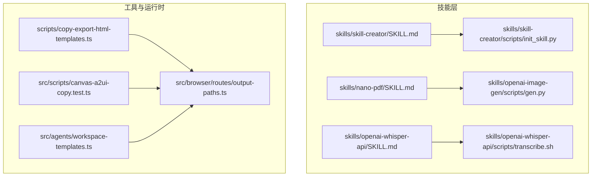
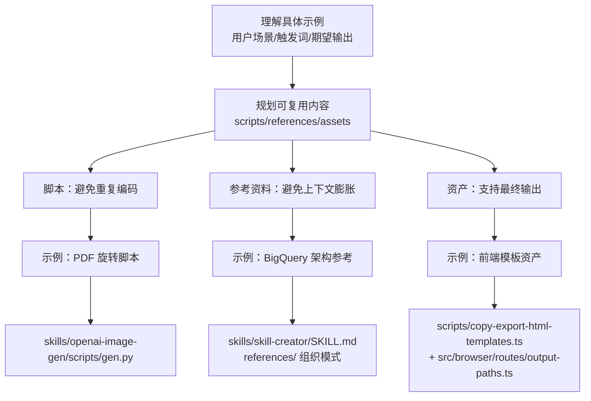
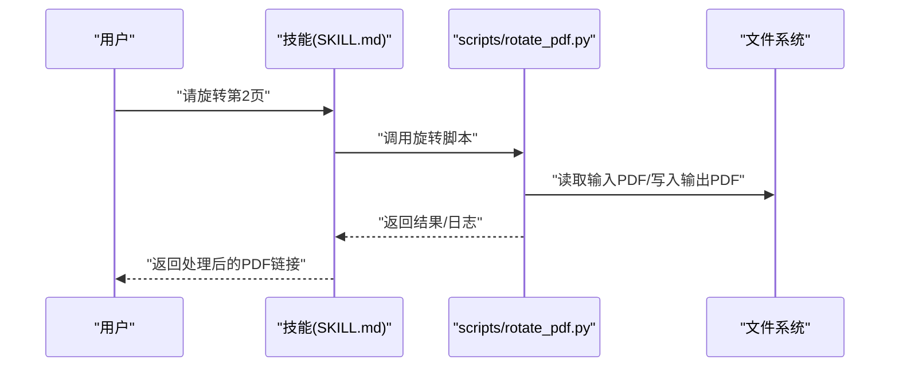
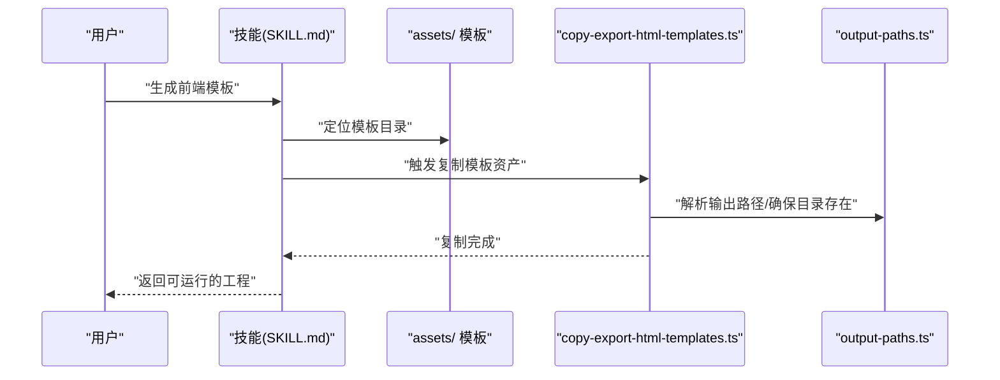
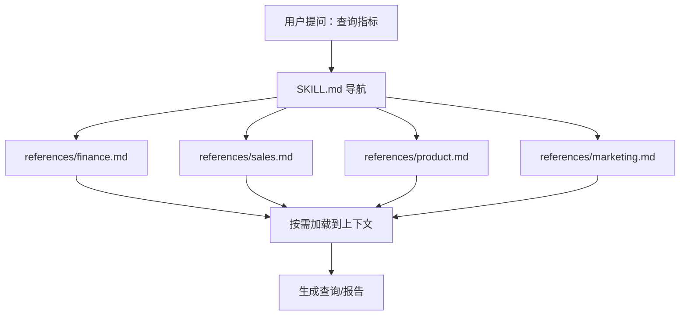
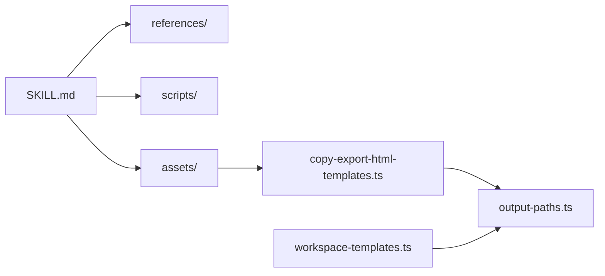

# 规划可复用内容

<cite>
**本文引用的文件**
- [skills/skill-creator/SKILL.md](file://skills/skill-creator/SKILL.md)
- [skills/skill-creator/scripts/init_skill.py](file://skills/skill-creator/scripts/init_skill.py)
- [skills/nano-pdf/SKILL.md](file://skills/nano-pdf/SKILL.md)
- [skills/openai-image-gen/scripts/gen.py](file://skills/openai-image-gen/scripts/gen.py)
- [skills/openai-image-gen/scripts/test_gen.py](file://skills/openai-image-gen/scripts/test_gen.py)
- [skills/openai-whisper-api/SKILL.md](file://skills/openai-whisper-api/SKILL.md)
- [skills/openai-whisper-api/scripts/transcribe.sh](file://skills/openai-whisper-api/scripts/transcribe.sh)
- [scripts/copy-export-html-templates.ts](file://scripts/copy-export-html-templates.ts)
- [src/browser/routes/output-paths.ts](file://src/browser/routes/output-paths.ts)
- [src/scripts/canvas-a2ui-copy.test.ts](file://src/scripts/canvas-a2ui-copy.test.ts)
- [src/agents/workspace-templates.ts](file://src/agents/workspace-templates.ts)
</cite>

## 目录
1. [引言](#引言)
2. [项目结构](#项目结构)
3. [核心组件](#核心组件)
4. [架构总览](#架构总览)
5. [详细组件分析](#详细组件分析)
6. [依赖关系分析](#依赖关系分析)
7. [性能考量](#性能考量)
8. [故障排查指南](#故障排查指南)
9. [结论](#结论)
10. [附录](#附录)

## 引言
本指南面向在 OpenClaw 中设计与复用“可执行脚本”“参考资料”“输出资产”的实践者，目标是帮助你系统化地分析具体示例，识别三类资源的边界与价值点，并给出明确的决策标准：何时添加脚本以避免重复编码、何时创建参考资料以避免上下文膨胀、何时准备资产文件以支持最终输出。文档同时提供三个真实案例，覆盖 PDF 编辑技能中的旋转脚本、前端应用构建器中的模板资产、BigQuery 技能中的架构参考。

## 项目结构
OpenClaw 的“可复用内容”主要体现在两类位置：
- 技能内的资源目录：skills/<skill>/ 下的 scripts/、references/、assets/
- 工具与运行时对“资产”的处理：scripts/ 与浏览器路由中对输出路径与资产复制的逻辑

下图展示与“可复用内容”规划直接相关的核心结构与文件映射：

图表来源
- [skills/skill-creator/SKILL.md](file://skills/skill-creator/SKILL.md)
- [skills/skill-creator/scripts/init_skill.py](file://skills/skill-creator/scripts/init_skill.py)
- [skills/nano-pdf/SKILL.md](file://skills/nano-pdf/SKILL.md)
- [skills/openai-image-gen/scripts/gen.py](file://skills/openai-image-gen/scripts/gen.py)
- [skills/openai-whisper-api/SKILL.md](file://skills/openai-whisper-api/SKILL.md)
- [skills/openai-whisper-api/scripts/transcribe.sh](file://skills/openai-whisper-api/scripts/transcribe.sh)
- [scripts/copy-export-html-templates.ts](file://scripts/copy-export-html-templates.ts)
- [src/browser/routes/output-paths.ts](file://src/browser/routes/output-paths.ts)
- [src/scripts/canvas-a2ui-copy.test.ts](file://src/scripts/canvas-a2ui-copy.test.ts)
- [src/agents/workspace-templates.ts](file://src/agents/workspace-templates.ts)

章节来源
- [skills/skill-creator/SKILL.md](file://skills/skill-creator/SKILL.md)
- [skills/skill-creator/scripts/init_skill.py](file://skills/skill-creator/scripts/init_skill.py)
- [skills/nano-pdf/SKILL.md](file://skills/nano-pdf/SKILL.md)
- [skills/openai-image-gen/scripts/gen.py](file://skills/openai-image-gen/scripts/gen.py)
- [skills/openai-whisper-api/SKILL.md](file://skills/openai-whisper-api/SKILL.md)
- [skills/openai-whisper-api/scripts/transcribe.sh](file://skills/openai-whisper-api/scripts/transcribe.sh)
- [scripts/copy-export-html-templates.ts](file://scripts/copy-export-html-templates.ts)
- [src/browser/routes/output-paths.ts](file://src/browser/routes/output-paths.ts)
- [src/scripts/canvas-a2ui-copy.test.ts](file://src/scripts/canvas-a2ui-copy.test.ts)
- [src/agents/workspace-templates.ts](file://src/agents/workspace-templates.ts)

## 核心组件
- 可执行脚本（scripts/）
  - 定义：可直接执行的自动化/数据处理代码，强调确定性与可复用性
  - 典型用途：避免每次任务重复编写相同逻辑；可在不加载到上下文的情况下执行
  - 示例：PDF 旋转脚本、图像生成脚本、音频转录脚本
- 参考资料（references/）
  - 定义：按需加载到上下文的文档与参考材料，用于指导思考与流程
  - 典型用途：API 文档、数据库模式、公司政策、工作流指南
  - 示例：BigQuery 架构参考、财务/销售/产品/营销域的参考文档
- 输出资产（assets/）
  - 定义：不在上下文中加载，而是作为最终产出使用的文件或模板
  - 典型用途：品牌素材、模板工程、字体、图标、演示文稿等
  - 示例：前端模板、画布打包产物、导出 HTML 模板

章节来源
- [skills/skill-creator/SKILL.md](file://skills/skill-creator/SKILL.md)
- [skills/skill-creator/scripts/init_skill.py](file://skills/skill-creator/scripts/init_skill.py)

## 架构总览
下图展示从“理解示例”到“规划可复用内容”的端到端流程，以及与仓库内现有实现的对应关系：

图表来源
- [skills/skill-creator/SKILL.md](file://skills/skill-creator/SKILL.md)
- [skills/openai-image-gen/scripts/gen.py](file://skills/openai-image-gen/scripts/gen.py)
- [scripts/copy-export-html-templates.ts](file://scripts/copy-export-html-templates.ts)
- [src/browser/routes/output-paths.ts](file://src/browser/routes/output-paths.ts)

## 详细组件分析

### 分析框架与决策标准
- 明确“重复性”：是否存在反复出现的同质化操作？若答案是，优先考虑 scripts/
- 明确“上下文成本”：是否需要频繁加载大量细节？若答案是，优先考虑 references/
- 明确“最终产物”：是否需要在输出中直接使用文件或模板？若答案是，优先考虑 assets/
- 明确“可执行性”：是否需要在无上下文加载的情况下可靠运行？scripts/ 更适合
- 明确“可发现性”：是否需要在 SKILL.md 中清晰指引 Codex 在何时读取 references/ 文件？
- 明确“可分发性”：是否需要打包为 .skill 文件或在 UI/导出流程中被复制/写入？

章节来源
- [skills/skill-creator/SKILL.md](file://skills/skill-creator/SKILL.md)

### 案例一：PDF 编辑技能中的旋转脚本
- 场景：用户请求“旋转 PDF”，每次都需要重写相同的页面旋转逻辑
- 决策：添加 scripts/rotate_pdf.py（或类似命名），封装旋转参数、页码处理、输出路径
- 依据：
  - 脚本可避免重复编码
  - 可在不加载到上下文的情况下执行
  - 便于测试与维护
- 实际参考：
  - 该技能的 SKILL.md 提供了“脚本”“参考资料”“资产”的定义与示例
  - openai-image-gen 的脚本展示了参数规范化、错误处理、输出组织等最佳实践

图表来源
- [skills/skill-creator/SKILL.md](file://skills/skill-creator/SKILL.md)
- [skills/openai-image-gen/scripts/gen.py](file://skills/openai-image-gen/scripts/gen.py)

章节来源
- [skills/skill-creator/SKILL.md](file://skills/skill-creator/SKILL.md)
- [skills/openai-image-gen/scripts/gen.py](file://skills/openai-image-gen/scripts/gen.py)

### 案例二：前端应用构建器中的模板资产
- 场景：用户请求“构建一个待办应用”或“构建步数追踪仪表盘”，每次都需重复搭建 HTML/React 基础结构
- 决策：在 assets/ 下提供模板目录（如 hello-world/），包含基础工程文件
- 依据：
  - 资产不进入上下文，但会被最终输出使用
  - 通过 assets/ 将“模板”与“说明”解耦
  - 可配合 UI 导出流程统一复制与写入
- 实际参考：
  - copy-export-html-templates.ts 展示了复制 vendor 等资产的流程
  - src/browser/routes/output-paths.ts 展示了输出根目录与可写路径解析
  - canvas-a2ui-copy.test.ts 展示了将打包产物复制到 dist 的测试用例

图表来源
- [scripts/copy-export-html-templates.ts](file://scripts/copy-export-html-templates.ts)
- [src/browser/routes/output-paths.ts](file://src/browser/routes/output-paths.ts)
- [src/scripts/canvas-a2ui-copy.test.ts](file://src/scripts/canvas-a2ui-copy.test.ts)

章节来源
- [scripts/copy-export-html-templates.ts](file://scripts/copy-export-html-templates.ts)
- [src/browser/routes/output-paths.ts](file://src/browser/routes/output-paths.ts)
- [src/scripts/canvas-a2ui-copy.test.ts](file://src/scripts/canvas-a2ui-copy.test.ts)

### 案例三：BigQuery 技能中的架构参考
- 场景：用户询问“今天有多少用户登录”，每次都需要重新查找表结构与字段关系
- 决策：在 references/ 下维护 schema.md 或按域拆分（finance/sales/product/marketing）
- 依据：
  - 参考资料按需加载，避免 SKILL.md 过长
  - 大型参考文件建议提供搜索模式与目录结构，便于快速定位
  - 与 SKILL.md 的导航配合，实现“高阶指南 + references/”的渐进披露
- 实际参考：
  - skill-creator 的 SKILL.md 明确了 references/ 的组织方式与最佳实践

图表来源
- [skills/skill-creator/SKILL.md](file://skills/skill-creator/SKILL.md)

章节来源
- [skills/skill-creator/SKILL.md](file://skills/skill-creator/SKILL.md)

### 初始化与验证：init_skill.py 的作用
- 作用：根据传入的资源类型与示例开关，自动生成技能目录、模板 SKILL.md 与所需资源目录
- 使用建议：新建技能时先运行 init_skill.py，再补充 SKILL.md 与资源文件
- 与“规划可复用内容”的衔接：在 init 阶段就明确是否需要 scripts/、references/、assets/

章节来源
- [skills/skill-creator/scripts/init_skill.py](file://skills/skill-creator/scripts/init_skill.py)
- [skills/skill-creator/SKILL.md](file://skills/skill-creator/SKILL.md)

### 资产复制与输出路径：运行时保障
- copy-export-html-templates.ts：负责复制 vendor 等资产，体现“assets 不进入上下文，但参与最终输出”的原则
- src/browser/routes/output-paths.ts：负责解析可写输出路径、确保根目录存在，保障资产写入安全
- src/scripts/canvas-a2ui-copy.test.ts：验证将打包产物复制到 dist 的流程，确保资产可用性

章节来源
- [scripts/copy-export-html-templates.ts](file://scripts/copy-export-html-templates.ts)
- [src/browser/routes/output-paths.ts](file://src/browser/routes/output-paths.ts)
- [src/scripts/canvas-a2ui-copy.test.ts](file://src/scripts/canvas-a2ui-copy.test.ts)

## 依赖关系分析
- 技能层内部依赖
  - SKILL.md 作为入口与导航，指引 Codex 何时加载 references/ 与如何调用 scripts/
  - scripts/ 与 assets/ 由工具链（如 copy-export-html-templates.ts）在运行时进行复制与写入
- 工具链与运行时依赖
  - output-paths.ts 保证输出路径安全与可写
  - workspace-templates.ts 提供模板目录解析能力，支撑 assets/ 的组织与分发

图表来源
- [skills/skill-creator/SKILL.md](file://skills/skill-creator/SKILL.md)
- [scripts/copy-export-html-templates.ts](file://scripts/copy-export-html-templates.ts)
- [src/browser/routes/output-paths.ts](file://src/browser/routes/output-paths.ts)
- [src/agents/workspace-templates.ts](file://src/agents/workspace-templates.ts)

章节来源
- [skills/skill-creator/SKILL.md](file://skills/skill-creator/SKILL.md)
- [scripts/copy-export-html-templates.ts](file://scripts/copy-export-html-templates.ts)
- [src/browser/routes/output-paths.ts](file://src/browser/routes/output-paths.ts)
- [src/agents/workspace-templates.ts](file://src/agents/workspace-templates.ts)

## 性能考量
- 上下文窗口管理
  - SKILL.md 保持精简，references/ 仅在需要时加载，scripts/ 可在不加载到上下文的情况下执行，降低 token 消耗
- 资产复制效率
  - 批量复制与缓存策略（如缓存模板目录解析结果）可减少重复 IO
- 输出路径解析
  - 预先确保输出根目录存在，避免多次失败重试带来的开销

## 故障排查指南
- 资产复制失败
  - 检查源目录与目标目录权限
  - 确认输出根目录已通过 output-paths.ts 解析并创建
- 输出路径异常
  - 核对请求路径与作用域标签，确保符合可写路径规则
- 脚本执行失败
  - 检查脚本参数与环境变量（如 OPENAI_API_KEY）
  - 对关键脚本增加单元测试，确保边界条件与错误处理正确
- 参考资料缺失
  - 确保 SKILL.md 中的引用路径与 references/ 结构一致
  - 对大型参考文件提供搜索模式与目录索引，提升定位效率

章节来源
- [src/browser/routes/output-paths.ts](file://src/browser/routes/output-paths.ts)
- [skills/openai-whisper-api/SKILL.md](file://skills/openai-whisper-api/SKILL.md)
- [skills/openai-whisper-api/scripts/transcribe.sh](file://skills/openai-whisper-api/scripts/transcribe.sh)
- [skills/openai-image-gen/scripts/test_gen.py](file://skills/openai-image-gen/scripts/test_gen.py)

## 结论
- 以“重复性、上下文成本、最终产物”为三大决策维度，系统化规划 scripts/、references/、assets/
- 新建技能优先使用 init_skill.py 生成骨架，再按示例补充资源
- 通过工具链保障资产复制与输出路径安全，确保最终产物可用
- 以真实案例为参照，持续迭代资源组织与引用方式，提升复用效率与可维护性

## 附录
- 快速对照表
  - 是否需要反复编写同一逻辑？→ scripts/
  - 是否需要频繁加载大量细节？→ references/
  - 是否需要在最终输出中直接使用文件/模板？→ assets/
- 参考文件清单
  - [skills/skill-creator/SKILL.md](file://skills/skill-creator/SKILL.md)
  - [skills/skill-creator/scripts/init_skill.py](file://skills/skill-creator/scripts/init_skill.py)
  - [skills/nano-pdf/SKILL.md](file://skills/nano-pdf/SKILL.md)
  - [skills/openai-image-gen/scripts/gen.py](file://skills/openai-image-gen/scripts/gen.py)
  - [skills/openai-whisper-api/SKILL.md](file://skills/openai-whisper-api/SKILL.md)
  - [skills/openai-whisper-api/scripts/transcribe.sh](file://skills/openai-whisper-api/scripts/transcribe.sh)
  - [scripts/copy-export-html-templates.ts](file://scripts/copy-export-html-templates.ts)
  - [src/browser/routes/output-paths.ts](file://src/browser/routes/output-paths.ts)
  - [src/scripts/canvas-a2ui-copy.test.ts](file://src/scripts/canvas-a2ui-copy.test.ts)
  - [src/agents/workspace-templates.ts](file://src/agents/workspace-templates.ts)