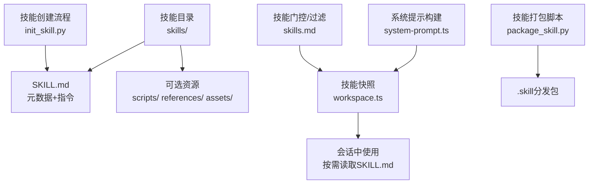
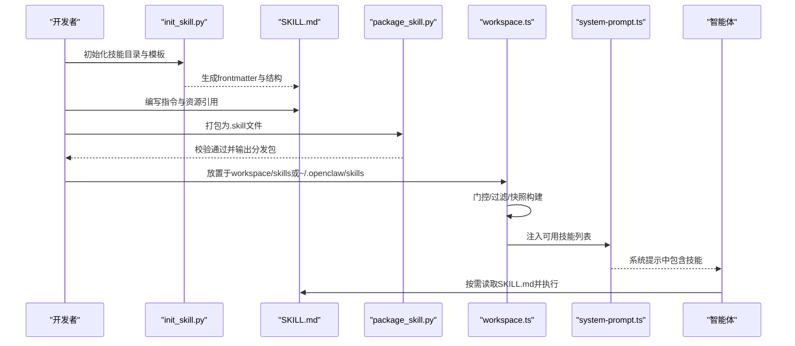
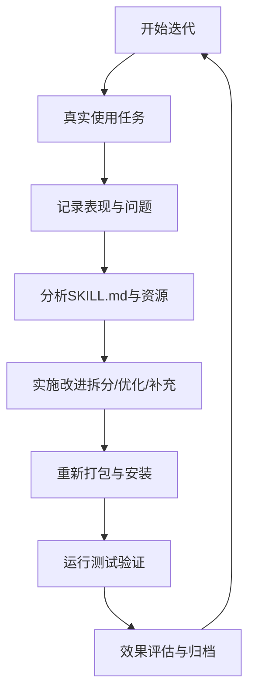
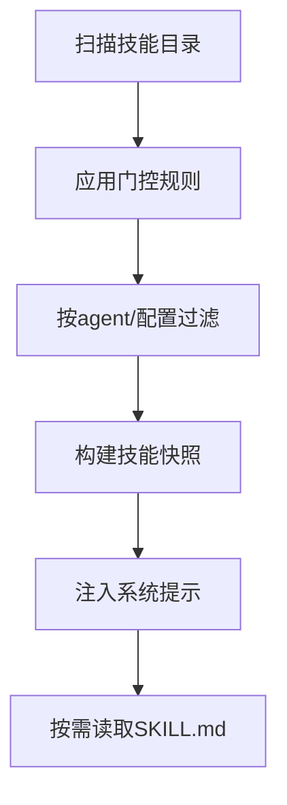
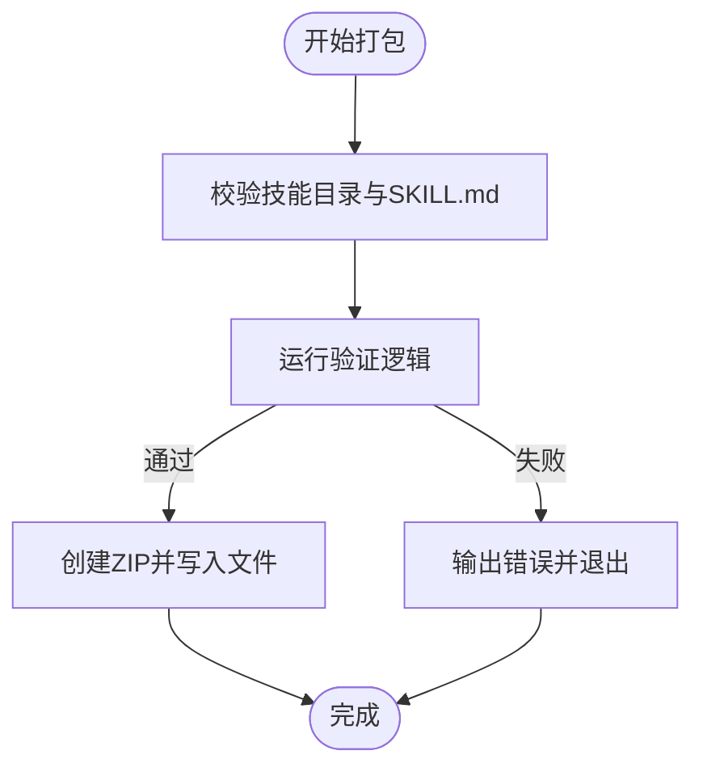
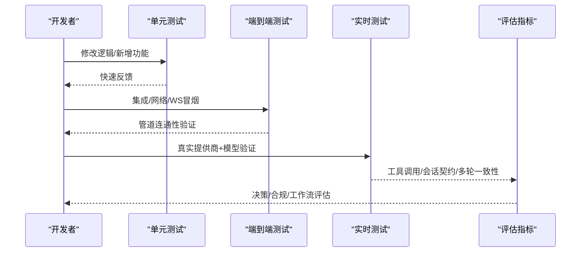
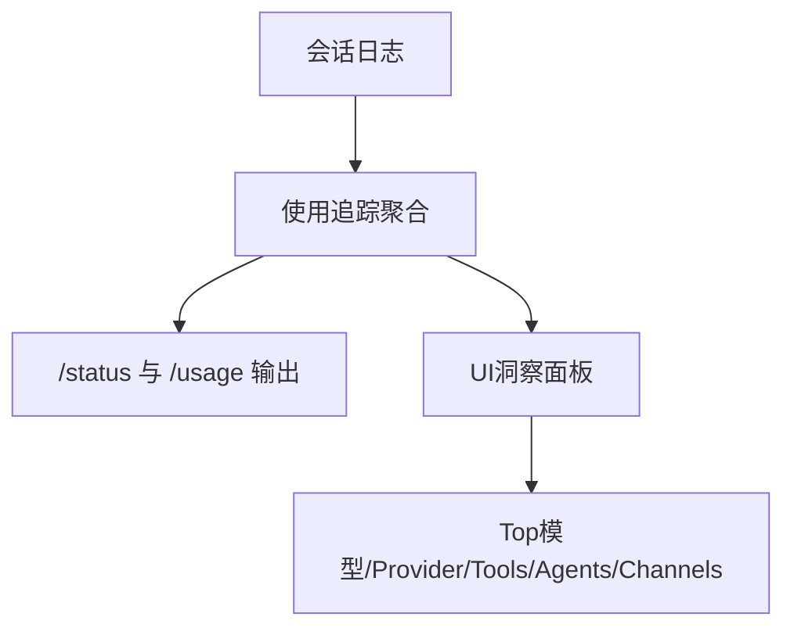
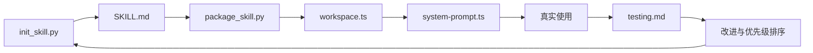

# 迭代改进

<cite>
**本文引用的文件**
- [docs/tools/creating-skills.md](file://docs/tools/creating-skills.md)
- [docs/tools/skills.md](file://docs/tools/skills.md)
- [docs/zh-CN/help/testing.md](file://docs/zh-CN/help/testing.md)
- [docs/concepts/usage-tracking.md](file://docs/concepts/usage-tracking.md)
- [skills/skill-creator/SKILL.md](file://skills/skill-creator/SKILL.md)
- [skills/skill-creator/scripts/init_skill.py](file://skills/skill-creator/scripts/init_skill.py)
- [skills/skill-creator/scripts/package_skill.py](file://skills/skill-creator/scripts/package_skill.py)
- [skills/summarize/SKILL.md](file://skills/summarize/SKILL.md)
- [skills/gh-issues/SKILL.md](file://skills/gh-issues/SKILL.md)
- [src/agents/system-prompt.ts](file://src/agents/system-prompt.ts)
- [src/agents/skills/workspace.ts](file://src/agents/skills/workspace.ts)
- [src/agents/skills/filter.ts](file://src/agents/skills/filter.ts)
- [src/agents/skills/types.ts](file://src/agents/skills/types.ts)
- [src/cron/isolated-agent/skills-snapshot.ts](file://src/cron/isolated-agent/skills-snapshot.ts)
- [ui/src/ui/views/usage-render-overview.ts](file://ui/src/ui/views/usage-render-overview.ts)
</cite>

## 目录
1. [简介](#简介)
2. [项目结构](#项目结构)
3. [核心组件](#核心组件)
4. [架构总览](#架构总览)
5. [详细组件分析](#详细组件分析)
6. [依赖分析](#依赖分析)
7. [性能考量](#性能考量)
8. [故障排查指南](#故障排查指南)
9. [结论](#结论)
10. [附录](#附录)

## 简介
本指南面向OpenClaw技能（Skill）的持续优化与迭代改进，围绕“真实使用—识别瓶颈—分析改进—实施测试”的闭环流程，系统化地给出四阶段工作法与优先级排序策略，并结合仓库内的技能模板、打包与测试机制，提供可落地的改进路径与效果评估方法。目标是帮助开发者建立技能生命周期管理的最佳实践，确保技能在真实场景中稳定、高效、可维护地演进。

## 项目结构
OpenClaw通过“技能”扩展能力边界，技能由目录中的SKILL.md与可选资源组成，系统在加载时进行门控、过滤与快照构建，最终将可用技能注入系统提示，驱动智能体决策与执行。

图示来源
- [src/agents/system-prompt.ts:20-36](file://src/agents/system-prompt.ts#L20-L36)
- [src/agents/skills/workspace.ts:567-584](file://src/agents/skills/workspace.ts#L567-L584)
- [docs/tools/skills.md:106-187](file://docs/tools/skills.md#L106-L187)
- [skills/skill-creator/scripts/package_skill.py:28-112](file://skills/skill-creator/scripts/package_skill.py#L28-L112)
- [skills/skill-creator/scripts/init_skill.py:320-357](file://skills/skill-creator/scripts/init_skill.py#L320-L357)

章节来源
- [docs/tools/creating-skills.md:1-59](file://docs/tools/creating-skills.md#L1-L59)
- [docs/tools/skills.md:1-303](file://docs/tools/skills.md#L1-L303)

## 核心组件
- 技能定义与模板
  - SKILL.md负责元数据（name/description/metadata）与使用说明，支持条件细节与领域拆分，便于按需加载与维护。
  - 技能创建脚本提供初始化模板与资源目录，规范内容组织与命名。
- 加载与门控
  - 系统根据环境、二进制、配置与远程节点能力筛选技能，构建技能快照，注入系统提示。
- 分发与打包
  - 打包脚本校验并生成.zip格式的.skill文件，支持安全规则（拒绝符号链接、限制输出目录）。
- 测试与评估
  - 提供单元/端到端/实时测试套件，支持CI安全的模拟与可选的真实提供商测试，覆盖工具调用、会话契约与多轮一致性。

章节来源
- [skills/skill-creator/SKILL.md:121-373](file://skills/skill-creator/SKILL.md#L121-L373)
- [skills/skill-creator/scripts/init_skill.py:43-70](file://skills/skill-creator/scripts/init_skill.py#L43-L70)
- [skills/skill-creator/scripts/package_skill.py:28-112](file://skills/skill-creator/scripts/package_skill.py#L28-L112)
- [docs/zh-CN/help/testing.md:45-91](file://docs/zh-CN/help/testing.md#L45-L91)

## 架构总览
技能从创建到上线的关键流转如下：

图示来源
- [skills/skill-creator/scripts/init_skill.py:320-357](file://skills/skill-creator/scripts/init_skill.py#L320-L357)
- [skills/skill-creator/scripts/package_skill.py:28-112](file://skills/skill-creator/scripts/package_skill.py#L28-L112)
- [src/agents/skills/workspace.ts:567-584](file://src/agents/skills/workspace.ts#L567-L584)
- [src/agents/system-prompt.ts:20-36](file://src/agents/system-prompt.ts#L20-L36)

## 详细组件分析

### 组件A：技能创建与迭代流程（四步法）
- 使用技能完成真实任务
  - 在真实会话中触发技能，观察是否正确选择、是否遵循步骤、是否产生预期结果。
- 识别性能瓶颈与效率问题
  - 关注token占用、提示长度、工具调用次数与顺序、外部API速率限制与重试策略。
- 分析SKILL.md与捆绑资源的改进点
  - 按需拆分长文档、减少上下文负担；补充条件细节与引用；完善触发条件与错误处理。
- 实施更改并重新测试
  - 更新SKILL.md与资源，重新打包与安装，运行测试套件验证。

图示来源
- [skills/skill-creator/SKILL.md:363-373](file://skills/skill-creator/SKILL.md#L363-L373)
- [docs/zh-CN/help/testing.md:348-376](file://docs/zh-CN/help/testing.md#L348-L376)

章节来源
- [skills/skill-creator/SKILL.md:201-211](file://skills/skill-creator/SKILL.md#L201-L211)
- [docs/tools/creating-skills.md:17-59](file://docs/tools/creating-skills.md#L17-L59)

### 组件B：技能加载与门控（workspace.ts + skills.md）
- 门控规则
  - 通过metadata.openclaw的requires.bins/env/config/os等字段控制技能可用性；支持平台过滤与安装器描述。
- 快照构建
  - 基于工作区扫描、过滤与截断策略，构建prompt文本与技能清单；支持按agent级别过滤与远程节点能力。
- 提示注入
  - 将技能列表注入系统提示，约束智能体在多技能场景下的选择与读取行为。

图示来源
- [src/agents/skills/workspace.ts:68-89](file://src/agents/skills/workspace.ts#L68-L89)
- [src/agents/skills/workspace.ts:538-565](file://src/agents/skills/workspace.ts#L538-L565)
- [src/agents/system-prompt.ts:20-36](file://src/agents/system-prompt.ts#L20-L36)
- [docs/tools/skills.md:106-187](file://docs/tools/skills.md#L106-L187)

章节来源
- [src/agents/skills/workspace.ts:567-584](file://src/agents/skills/workspace.ts#L567-L584)
- [src/agents/skills/filter.ts:1-33](file://src/agents/skills/filter.ts#L1-L33)
- [src/agents/skills/types.ts:64-89](file://src/agents/skills/types.ts#L64-L89)
- [docs/tools/skills.md:106-187](file://docs/tools/skills.md#L106-L187)

### 组件C：技能打包与分发（package_skill.py）
- 校验与打包
  - 校验SKILL.md存在与结构；遍历目录排除敏感项；压缩为.zip并命名为<skill>.skill。
- 安全限制
  - 拒绝符号链接；禁止输出文件逃逸技能根目录；避免将输出文件自身打包入自身。

图示来源
- [skills/skill-creator/scripts/package_skill.py:28-112](file://skills/skill-creator/scripts/package_skill.py#L28-L112)

章节来源
- [skills/skill-creator/scripts/package_skill.py:1-140](file://skills/skill-creator/scripts/package_skill.py#L1-L140)

### 组件D：测试与评估（testing.md）
- 测试套件
  - 单元/集成、端到端、实时三类测试；实时测试支持模型冒烟与Gateway冒烟，覆盖工具调用与图像探测。
- 评估维度
  - 决策（是否选对技能）、合规（是否先读取SKILL.md并遵循步骤）、工作流契约（工具顺序、会话延续、沙箱边界）。
- 回归与最小层优先
  - 优先在更低层捕获问题（模型请求转换→Gateway会话/历史/工具管道），CI安全的模拟优于实时测试。

图示来源
- [docs/zh-CN/help/testing.md:45-91](file://docs/zh-CN/help/testing.md#L45-L91)
- [docs/zh-CN/help/testing.md:348-376](file://docs/zh-CN/help/testing.md#L348-L376)

章节来源
- [docs/zh-CN/help/testing.md:1-376](file://docs/zh-CN/help/testing.md#L1-L376)

### 组件E：使用数据与效果评估（usage-tracking + UI）
- 使用追踪
  - 提供token用量、成本汇总与各Provider的使用快照，支持聊天/status/CLI等入口查看。
- UI洞察
  - 仪表盘展示Top模型/Provider/Tools/Agents/Channels，辅助定位热点与异常峰值。

图示来源
- [docs/concepts/usage-tracking.md:1-36](file://docs/concepts/usage-tracking.md#L1-L36)
- [ui/src/ui/views/usage-render-overview.ts:530-543](file://ui/src/ui/views/usage-render-overview.ts#L530-L543)

章节来源
- [docs/concepts/usage-tracking.md:1-36](file://docs/concepts/usage-tracking.md#L1-L36)
- [ui/src/ui/views/usage-render-overview.ts:530-543](file://ui/src/ui/views/usage-render-overview.ts#L530-L543)

## 依赖分析
- 技能生命周期依赖
  - 创建（init_skill.py）→ 编写（SKILL.md）→ 打包（package_skill.py）→ 加载（workspace.ts）→ 使用（system-prompt.ts）→ 评估（testing.md）。
- 关键耦合点
  - 门控规则与远程节点能力决定技能可用性；快照构建影响提示长度与token开销；测试覆盖度决定迭代风险。
- 循环与回路
  - 使用→评估→改进→测试→再使用，形成闭环。

图示来源
- [skills/skill-creator/scripts/init_skill.py:320-357](file://skills/skill-creator/scripts/init_skill.py#L320-L357)
- [skills/skill-creator/scripts/package_skill.py:28-112](file://skills/skill-creator/scripts/package_skill.py#L28-L112)
- [src/agents/skills/workspace.ts:567-584](file://src/agents/skills/workspace.ts#L567-L584)
- [src/agents/system-prompt.ts:20-36](file://src/agents/system-prompt.ts#L20-L36)
- [docs/zh-CN/help/testing.md:348-376](file://docs/zh-CN/help/testing.md#L348-L376)

章节来源
- [src/cron/isolated-agent/skills-snapshot.ts:1-37](file://src/cron/isolated-agent/skills-snapshot.ts#L1-L37)

## 性能考量
- 提示长度与token成本
  - 技能列表注入提示具有确定性开销，受技能数量与字段长度影响；可通过快照截断与按需加载降低负担。
- 工具调用与外部API
  - 遵循速率限制、合并请求、序列化突发，避免频繁单条调用。
- 资源组织
  - 长文档拆分为引用文件，减少一次性加载；仅在需要时读取高级细节。

章节来源
- [src/agents/skills/workspace.ts:538-565](file://src/agents/skills/workspace.ts#L538-L565)
- [src/agents/system-prompt.ts:20-36](file://src/agents/system-prompt.ts#L20-L36)
- [skills/skill-creator/SKILL.md:121-200](file://skills/skill-creator/SKILL.md#L121-L200)

## 故障排查指南
- 门控导致技能不可用
  - 检查metadata.openclaw的requires.bins/env/config/os与当前环境匹配情况；确认远程节点能力。
- 快照未更新
  - 确认技能文件变更被监听并触发快照刷新；必要时手动重启或触发刷新。
- 提示过长
  - 通过过滤与截断策略减少技能数量与字段长度；优先保留高命中率技能。
- 打包失败
  - 检查是否存在符号链接、输出目录是否逃逸技能根、是否包含输出文件自身。

章节来源
- [docs/tools/skills.md:106-187](file://docs/tools/skills.md#L106-L187)
- [src/agents/skills/workspace.ts:567-584](file://src/agents/skills/workspace.ts#L567-L584)
- [skills/skill-creator/scripts/package_skill.py:75-112](file://skills/skill-creator/scripts/package_skill.py#L75-L112)

## 结论
通过“真实使用—识别瓶颈—分析改进—实施测试”的四步法与CI安全的测试体系，结合门控、快照与提示注入机制，OpenClaw能够持续迭代技能质量。建议以使用数据与评估指标为依据，优先解决高频问题与关键路径瓶颈，采用最小可行改进与渐进式验证，确保技能在真实场景中稳定、高效、可维护地演进。

## 附录

### 实际改进案例与效果评估
- 案例1：summarize技能
  - 改进点：明确YouTube摘要与转录的区别、提供可选服务与标志位说明，减少歧义与重复调用。
  - 效果：用户触发更精准，工具调用次数下降，错误率降低。
  - 参考：[skills/summarize/SKILL.md:1-88](file://skills/summarize/SKILL.md#L1-L88)
- 案例2：gh-issues技能
  - 改进点：细化参数解析、预检与分支/PR冲突检测、审查评论处理与子代理并行策略。
  - 效果：自动化修复成功率提升，减少人工干预与重复工作。
  - 参考：[skills/gh-issues/SKILL.md:1-800](file://skills/gh-issues/SKILL.md#L1-L800)

### 优先级排序方法
- 优先级维度
  - 使用频率（高频问题优先）
  - 影响面（影响多轮或多工具调用的问题优先）
  - 成本与风险（低风险、低代价的改进优先）
  - 用户反馈强度（明确负面反馈与重复报错）
- 方法
  - 建立问题分类（bug/enhancement/support/skill-only），结合使用数据与测试结果量化收益。
  - 采用最小可行改进（MVP）策略，先做影响最大且实现最简单的改动，再逐步完善。

章节来源
- [docs/zh-CN/help/testing.md:621-635](file://docs/zh-CN/help/testing.md#L621-L635)
- [docs/concepts/usage-tracking.md:1-36](file://docs/concepts/usage-tracking.md#L1-L36)