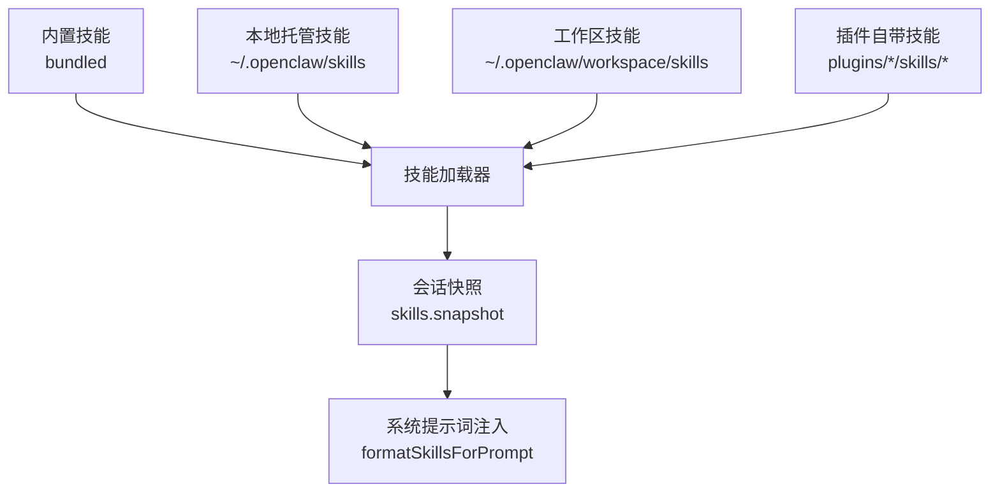
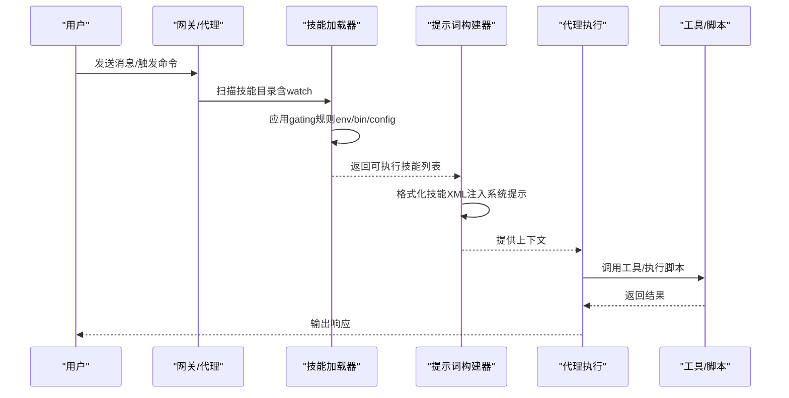
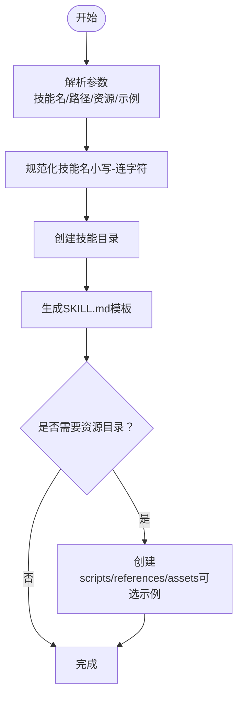
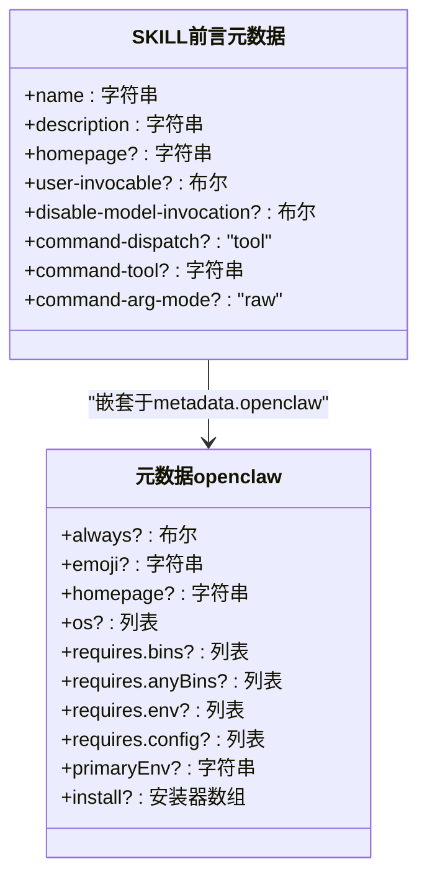
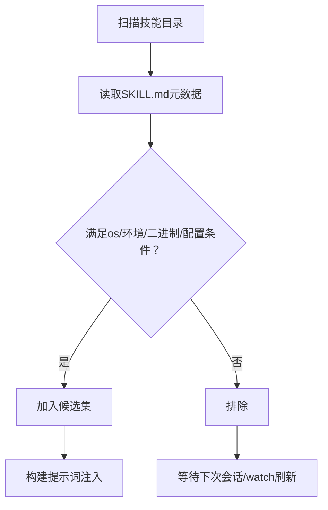
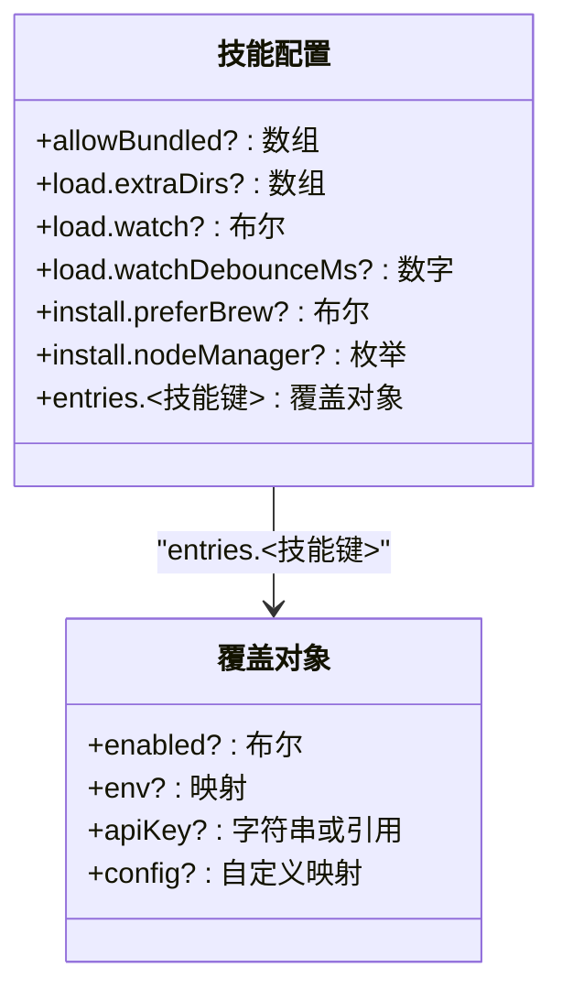
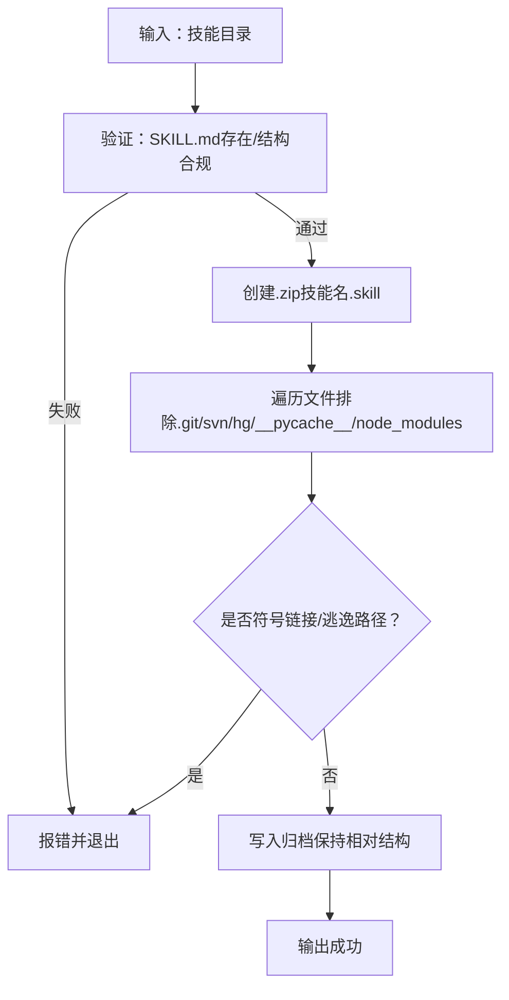
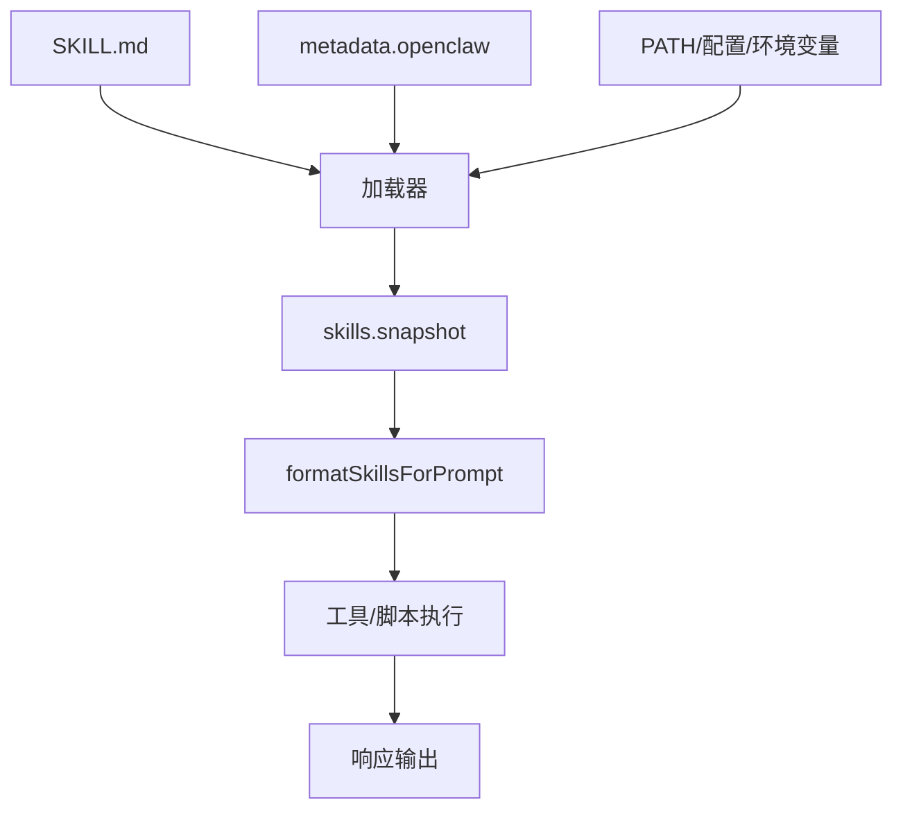

# 技能开发指南

<cite>
**本文引用的文件**
- [README.md](file://README.md)
- [docs/tools/creating-skills.md](file://docs/tools/creating-skills.md)
- [docs/tools/skills.md](file://docs/tools/skills.md)
- [docs/tools/skills-config.md](file://docs/tools/skills-config.md)
- [skills/skill-creator/SKILL.md](file://skills/skill-creator/SKILL.md)
- [skills/skill-creator/scripts/init_skill.py](file://skills/skill-creator/scripts/init_skill.py)
- [skills/skill-creator/scripts/package_skill.py](file://skills/skill-creator/scripts/package_skill.py)
- [extensions/acpx/openclaw.plugin.json](file://extensions/acpx/openclaw.plugin.json)
- [extensions/diffs/openclaw.plugin.json](file://extensions/diffs/openclaw.plugin.json)
- [extensions/lobster/openclaw.plugin.json](file://extensions/lobster/openclaw.plugin.json)
</cite>

## 目录
1. [简介](#简介)
2. [项目结构](#项目结构)
3. [核心组件](#核心组件)
4. [架构总览](#架构总览)
5. [详细组件分析](#详细组件分析)
6. [依赖关系分析](#依赖关系分析)
7. [性能考量](#性能考量)
8. [故障排查指南](#故障排查指南)
9. [结论](#结论)
10. [附录](#附录)

## 简介
本指南面向希望在 OpenClaw 平台上开发“技能（Skill）”的开发者，覆盖从项目初始化、模板使用、配置与元数据管理、API 与工具集成、测试与调试、打包与分发，到性能优化与兼容性的全流程。OpenClaw 的技能采用“AgentSkills 兼容”的目录结构与 SKILL.md 描述文件，结合可选脚本与资源，实现对多渠道、多平台、多模型的统一能力扩展。

## 项目结构
OpenClaw 将技能作为可发现、可加载、可按需注入提示词的模块化单元。技能来源包括：
- 内置技能（bundled）
- 本地托管技能（managed/local：~/.openclaw/skills）
- 工作区技能（workspace：~/.openclaw/workspace/skills）

此外，插件可自带技能目录，随插件启用而参与加载与优先级判定；ClawHub 提供公共技能注册与安装能力。

图示来源
- [docs/tools/skills.md:13-40](file://docs/tools/skills.md#L13-L40)
- [docs/tools/skills.md:254-267](file://docs/tools/skills.md#L254-L267)

章节来源
- [docs/tools/skills.md:13-40](file://docs/tools/skills.md#L13-L40)
- [docs/tools/skills.md:254-267](file://docs/tools/skills.md#L254-L267)

## 核心组件
- 技能目录与 SKILL.md：技能的最小可执行单元，包含 YAML 前言元数据与 Markdown 指令体。
- 脚本与资源：scripts/（可直接执行）、references/（按需加载的参考文档）、assets/（输出用资源）。
- 加载与过滤：基于 metadata.openclaw 的 gating 规则（环境变量、二进制、配置项等），以及 per-agent 的 env/apiKey 注入。
- 配置与覆盖：~/.openclaw/openclaw.json 下的 skills.* 配置，支持 watch、extraDirs、install 行为与 per-skill entries 覆盖。
- 打包与分发：.skill 文件（zip）便于共享与回滚。

章节来源
- [docs/tools/creating-skills.md:13-48](file://docs/tools/creating-skills.md#L13-L48)
- [docs/tools/skills.md:78-105](file://docs/tools/skills.md#L78-L105)
- [docs/tools/skills-config.md:13-39](file://docs/tools/skills-config.md#L13-L39)

## 架构总览
技能在运行时的生命周期如下：加载（扫描与 gating）、构建提示（合并元数据）、执行（工具调用或脚本执行）、快照复用（同一会话内热更新）。

图示来源
- [docs/tools/skills.md:242-247](file://docs/tools/skills.md#L242-L247)
- [docs/tools/skills.md:254-267](file://docs/tools/skills.md#L254-L267)

章节来源
- [docs/tools/skills.md:242-247](file://docs/tools/skills.md#L242-L247)
- [docs/tools/skills.md:254-267](file://docs/tools/skills.md#L254-L267)

## 详细组件分析

### 组件A：技能模板与初始化
- 使用 skill-creator 提供的 init_skill.py 快速生成符合规范的技能目录与 SKILL.md 模板，支持选择资源类型与示例文件。
- 初始化后，编辑 SKILL.md 的 YAML frontmatter（name、description）与正文内容，并按需创建 scripts/references/assets。

图示来源
- [skills/skill-creator/scripts/init_skill.py:320-379](file://skills/skill-creator/scripts/init_skill.py#L320-L379)

章节来源
- [skills/skill-creator/scripts/init_skill.py:320-379](file://skills/skill-creator/scripts/init_skill.py#L320-L379)
- [skills/skill-creator/SKILL.md:201-211](file://skills/skill-creator/SKILL.md#L201-L211)

### 组件B：技能格式与元数据
- SKILL.md 必须包含 YAML frontmatter（至少 name 与 description），metadata.openclaw 支持 gating 与 UI/安装信息。
- frontmatter 与 metadata 的单行约束、{baseDir} 占位符、用户触发开关、命令直派等字段影响技能可用性与交互方式。

图示来源
- [docs/tools/skills.md:78-105](file://docs/tools/skills.md#L78-L105)
- [docs/tools/skills.md:106-187](file://docs/tools/skills.md#L106-L187)

章节来源
- [docs/tools/skills.md:78-105](file://docs/tools/skills.md#L78-L105)
- [docs/tools/skills.md:106-187](file://docs/tools/skills.md#L106-L187)

### 组件C：加载与过滤（Gating）
- 加载阶段根据 metadata.openclaw 的条件进行筛选：操作系统、PATH 可用二进制、环境变量存在或配置项为真。
- 对沙箱场景，要求宿主与容器均满足二进制依赖；可通过 agents.defaults.sandbox.docker.setupCommand 安装。

图示来源
- [docs/tools/skills.md:106-187](file://docs/tools/skills.md#L106-L187)
- [docs/tools/skills.md:138-147](file://docs/tools/skills.md#L138-L147)

章节来源
- [docs/tools/skills.md:106-187](file://docs/tools/skills.md#L106-L187)
- [docs/tools/skills.md:138-147](file://docs/tools/skills.md#L138-L147)

### 组件D：配置与覆盖
- 在 ~/.openclaw/openclaw.json 中通过 skills.entries.<key> 对技能进行启用/禁用、env/apiKey 注入与自定义配置。
- 支持额外扫描目录（extraDirs）、watch 开关与去抖、安装偏好（preferBrew、nodeManager）。

图示来源
- [docs/tools/skills-config.md:13-39](file://docs/tools/skills-config.md#L13-L39)
- [docs/tools/skills-config.md:54-78](file://docs/tools/skills-config.md#L54-L78)

章节来源
- [docs/tools/skills-config.md:13-39](file://docs/tools/skills-config.md#L13-L39)
- [docs/tools/skills-config.md:54-78](file://docs/tools/skills-config.md#L54-L78)

### 组件E：打包与分发
- package_skill.py 将技能目录打包为 .skill 文件（zip），自动校验并拒绝符号链接与逃逸路径。
- .skill 文件可用于分享、备份与回滚，确保安全与一致性。

图示来源
- [skills/skill-creator/scripts/package_skill.py:28-112](file://skills/skill-creator/scripts/package_skill.py#L28-L112)

章节来源
- [skills/skill-creator/scripts/package_skill.py:28-112](file://skills/skill-creator/scripts/package_skill.py#L28-L112)

### 组件F：插件与技能集成
- 插件可在 openclaw.plugin.json 中声明 skills 目录，随插件启用而被技能加载器发现。
- 示例：acpx、diffs、lobster 等插件通过该机制提供技能与 UI/配置提示。

图示来源
- [extensions/acpx/openclaw.plugin.json:1-106](file://extensions/acpx/openclaw.plugin.json#L1-L106)
- [extensions/diffs/openclaw.plugin.json:1-183](file://extensions/diffs/openclaw.plugin.json#L1-L183)
- [extensions/lobster/openclaw.plugin.json:1-11](file://extensions/lobster/openclaw.plugin.json#L1-L11)

章节来源
- [extensions/acpx/openclaw.plugin.json:1-106](file://extensions/acpx/openclaw.plugin.json#L1-L106)
- [extensions/diffs/openclaw.plugin.json:1-183](file://extensions/diffs/openclaw.plugin.json#L1-L183)
- [extensions/lobster/openclaw.plugin.json:1-11](file://extensions/lobster/openclaw.plugin.json#L1-L11)

## 依赖关系分析
- 技能加载器依赖：
  - 技能目录结构与 SKILL.md 规范
  - metadata.openclaw gating 条件
  - 运行环境（PATH、配置、进程环境）
- 提示词构建器依赖：
  - skills.snapshot（会话快照）
  - formatSkillsForPrompt（XML 注入）
- 执行层依赖：
  - 工具/脚本（bash、browser、nodes 等）
  - 沙箱环境（Docker）与二进制准备

图示来源
- [docs/tools/skills.md:106-187](file://docs/tools/skills.md#L106-L187)
- [docs/tools/skills.md:242-247](file://docs/tools/skills.md#L242-L247)

章节来源
- [docs/tools/skills.md:106-187](file://docs/tools/skills.md#L106-L187)
- [docs/tools/skills.md:242-247](file://docs/tools/skills.md#L242-L247)

## 性能考量
- 上下文开销估算：当存在技能时，系统提示中注入紧凑的 XML 列表，基础开销约 195 字符，每技能约 97+字段长度（XML 实体转义会放大长度）。
- 令牌估算：按约 4 字符≈1 令牌估算，每技能约 24 令牌左右，具体取决于字段长度与转义程度。
- 会话快照：首次会话构建后缓存技能列表，后续回合复用；watch 启用时变更生效于下一回合。

章节来源
- [docs/tools/skills.md:269-286](file://docs/tools/skills.md#L269-L286)
- [docs/tools/skills.md:242-247](file://docs/tools/skills.md#L242-L247)

## 故障排查指南
- 安全与信任
  - 第三方技能视为不受信代码，启用前务必审阅。
  - 沙箱运行优先，避免高风险工具与任意命令注入。
- 环境与二进制
  - 若使用 requires.bins 或 requires.anyBins，请确保 PATH 与容器内可用。
  - 沙箱内二进制需通过 agents.defaults.sandbox.docker.setupCommand 安装。
- 配置与覆盖
  - 检查 skills.entries.<key> 是否正确匹配技能名（含连字符时需引号）。
  - 沙箱场景下，process.env 不继承宿主，需通过 agents.defaults.sandbox.docker.env 或自定义镜像注入。
- 监控与刷新
  - 启用 skills.load.watch 并设置 watchDebounceMs，以获得更及时的热重载体验。
- 常见问题定位
  - 未触发：检查 SKILL.md frontmatter 的 name/description 与触发语句。
  - 工具不可用：确认工具二进制存在、权限正确、沙箱内已安装。
  - 性能异常：减少技能数量、缩短描述长度、避免大体积 references。

章节来源
- [docs/tools/skills.md:69-77](file://docs/tools/skills.md#L69-L77)
- [docs/tools/skills.md:138-147](file://docs/tools/skills.md#L138-L147)
- [docs/tools/skills-config.md:67-78](file://docs/tools/skills-config.md#L67-L78)
- [docs/tools/skills.md:254-267](file://docs/tools/skills.md#L254-L267)

## 结论
通过标准化的 SKILL.md、严格的 gating 与配置覆盖、完善的打包与分发机制，OpenClaw 为技能开发提供了清晰、可维护且可扩展的框架。遵循本指南的流程与最佳实践，开发者可以高效地从零到一完成技能设计、实现、测试、发布与迭代，并在多平台、多渠道环境中稳定运行。

## 附录

### 从入门到精通的学习路径
- 入门
  - 阅读 README 与技能概览，理解技能定位与加载机制。
  - 使用 skill-creator 的 init_skill.py 初始化第一个技能。
- 进阶
  - 编写 SKILL.md，完善 frontmatter 与正文，组织 scripts/references/assets。
  - 配置 ~/.openclaw/openclaw.json，启用/禁用与注入 env/apiKey。
  - 使用 watch 与 extraDirs 提升开发效率。
- 专家
  - 设计 gating（os/env/bin/config），适配沙箱与远程节点。
  - 使用 package_skill.py 打包与分发 .skill 文件。
  - 探索插件自带技能与 UI/配置提示，提升用户体验。

章节来源
- [README.md:312-317](file://README.md#L312-L317)
- [docs/tools/creating-skills.md:17-48](file://docs/tools/creating-skills.md#L17-L48)
- [docs/tools/skills-config.md:13-39](file://docs/tools/skills-config.md#L13-L39)
- [skills/skill-creator/scripts/package_skill.py:28-112](file://skills/skill-creator/scripts/package_skill.py#L28-L112)