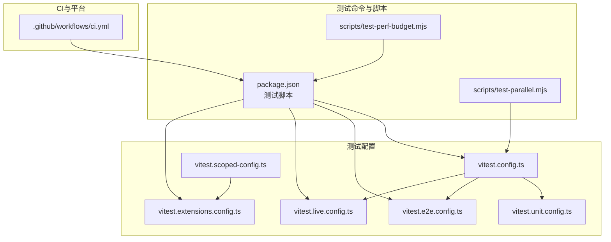
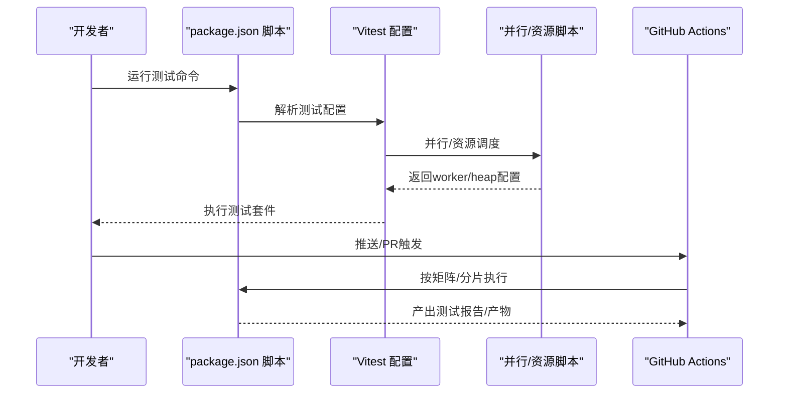
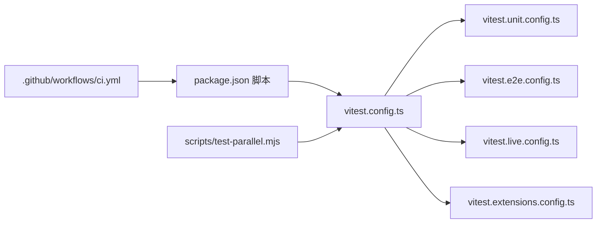

# 技能测试与调试

<cite>
**本文引用的文件**
- [docs/help/testing.md](file://docs/help/testing.md)
- [docs/zh-CN/help/testing.md](file://docs/zh-CN/help/testing.md)
- [vitest.config.ts](file://vitest.config.ts)
- [vitest.unit.config.ts](file://vitest.unit.config.ts)
- [vitest.e2e.config.ts](file://vitest.e2e.config.ts)
- [vitest.live.config.ts](file://vitest.live.config.ts)
- [vitest.extensions.config.ts](file://vitest.extensions.config.ts)
- [vitest.scoped-config.ts](file://vitest.scoped-config.ts)
- [package.json](file://package.json)
- [scripts/test-parallel.mjs](file://scripts/test-parallel.mjs)
- [scripts/test-perf-budget.mjs](file://scripts/test-perf-budget.mjs)
- [test/test-env.ts](file://test/test-env.ts)
- [src/test-utils/env.test.ts](file://src/test-utils/env.test.ts)
- [src/auto-reply/reply.test-harness.ts](file://src/auto-reply/reply.test-harness.ts)
- [.github/workflows/ci.yml](file://.github/workflows/ci.yml)
- [docs/logging.md](file://docs/logging.md)
- [docs/help/debugging.md](file://docs/help/debugging.md)
- [docs/debug/node-issue.md](file://docs/debug/node-issue.md)
- [docs/automation/troubleshooting.md](file://docs/automation/troubleshooting.md)
- [extensions/open-prose/skills/prose/guidance/patterns.md](file://extensions/open-prose/skills/prose/guidance/patterns.md)
- [extensions/open-prose/skills/prose/examples/35-feature-factory.prose](file://extensions/open-prose/skills/prose/examples/35-feature-factory.prose)
- [extensions/open-prose/skills/prose/examples/45-run-endpoint-ux-test-with-remediation.prose](file://extensions/open-prose/skills/prose/examples/45-run-endpoint-ux-test-with-remediation.prose)
</cite>

## 目录
1. [引言](#引言)
2. [项目结构](#项目结构)
3. [核心组件](#核心组件)
4. [架构总览](#架构总览)
5. [详细组件分析](#详细组件分析)
6. [依赖分析](#依赖分析)
7. [性能考虑](#性能考虑)
8. [故障排查指南](#故障排查指南)
9. [结论](#结论)
10. [附录](#附录)

## 引言
本指南面向OpenClaw技能开发者与质量保障工程师，系统化阐述技能测试与调试的工作流程与最佳实践。内容覆盖单元测试、集成测试、端到端测试与实时测试的策略与实施要点，结合日志记录、错误追踪与性能分析工具，帮助你在多平台环境下（操作系统、浏览器、设备）进行兼容性验证，并建立可重复、可扩展的自动化测试与持续集成流程。

## 项目结构
OpenClaw采用多语言混合工程：TypeScript/Node用于核心逻辑与CLI，Swift用于macOS应用，Android使用Gradle构建，同时提供大量技能脚本与插件生态。测试体系基于Vitest，配合CI工作流实现跨平台、分层的测试覆盖。

图示来源
- [vitest.config.ts:1-203](file://vitest.config.ts#L1-L203)
- [vitest.unit.config.ts:1-31](file://vitest.unit.config.ts#L1-L31)
- [vitest.e2e.config.ts:1-33](file://vitest.e2e.config.ts#L1-L33)
- [vitest.live.config.ts:1-16](file://vitest.live.config.ts#L1-L16)
- [vitest.scoped-config.ts:1-17](file://vitest.scoped-config.ts#L1-L17)
- [vitest.extensions.config.ts:1-3](file://vitest.extensions.config.ts#L1-L3)
- [package.json:306-322](file://package.json#L306-L322)
- [scripts/test-parallel.mjs:302-345](file://scripts/test-parallel.mjs#L302-L345)
- [scripts/test-perf-budget.mjs:98-127](file://scripts/test-perf-budget.mjs#L98-L127)
- [.github/workflows/ci.yml:1-737](file://.github/workflows/ci.yml#L1-L737)

章节来源
- [vitest.config.ts:1-203](file://vitest.config.ts#L1-L203)
- [package.json:306-322](file://package.json#L306-L322)

## 核心组件
- 测试套件与命令
  - 单元/集成测试：默认Vitest套件，适合快速、稳定的纯函数与进程内集成验证。
  - 端到端测试：多实例网关冒烟与网络交互验证，强调WS/HTTP表面与配对流程。
  - 实时测试：对接真实提供商与模型，捕获真实凭证、速率限制与格式变更等不稳定因素。
  - 扩展测试：针对插件生态的独立测试集合。
- 测试配置
  - 基础配置统一管理别名、超时、并发、覆盖率阈值与排除范围。
  - 分层配置按需限定include/exclude，隔离不同测试域。
- CI与平台
  - CI按变更范围智能跳过昂贵任务，支持Windows/macOS/Android分层执行与分片。
  - Node测试通过并行脚本与内存参数优化稳定性与吞吐。

章节来源
- [docs/help/testing.md:12-78](file://docs/help/testing.md#L12-L78)
- [docs/zh-CN/help/testing.md:49-90](file://docs/zh-CN/help/testing.md#L49-L90)
- [vitest.config.ts:71-200](file://vitest.config.ts#L71-L200)
- [vitest.unit.config.ts:6-29](file://vitest.unit.config.ts#L6-L29)
- [vitest.e2e.config.ts:17-31](file://vitest.e2e.config.ts#L17-L31)
- [vitest.live.config.ts:4-15](file://vitest.live.config.ts#L4-L15)
- [vitest.extensions.config.ts:1-3](file://vitest.extensions.config.ts#L1-L3)
- [.github/workflows/ci.yml:13-737](file://.github/workflows/ci.yml#L13-L737)

## 架构总览
下图展示测试从命令到执行再到CI的整体流转，以及关键配置与脚本的作用点。

图示来源
- [package.json:306-322](file://package.json#L306-L322)
- [vitest.config.ts:71-200](file://vitest.config.ts#L71-L200)
- [scripts/test-parallel.mjs:302-345](file://scripts/test-parallel.mjs#L302-L345)
- [.github/workflows/ci.yml:140-188](file://.github/workflows/ci.yml#L140-L188)

## 详细组件分析

### 测试套件与策略
- 单元/集成测试（默认）
  - 覆盖纯单元、进程内集成（网关鉴权、路由、工具、解析、配置）与已知问题的确定性回归。
  - 无需真实密钥，适合本地与CI快速门禁。
- 端到端测试（Gateway冒烟）
  - 多实例网关行为、WS/HTTP表面、节点配对与重网络交互。
  - 支持worker数与静默模式控制，便于CI稳定运行。
- 实时测试（真实提供商+模型）
  - 针对真实凭证、速率限制、提供商格式变化的脆弱场景。
  - 可加载用户profile注入密钥，支持Anthropic密钥轮换与重试策略。
- 扩展测试
  - 面向插件生态的独立测试集合，按路径范围隔离执行。

章节来源
- [docs/help/testing.md:38-78](file://docs/help/testing.md#L38-L78)
- [docs/zh-CN/help/testing.md:49-90](file://docs/zh-CN/help/testing.md#L49-L90)
- [vitest.e2e.config.ts:17-31](file://vitest.e2e.config.ts#L17-L31)
- [vitest.live.config.ts:4-15](file://vitest.live.config.ts#L4-L15)
- [test/test-env.ts:54-65](file://test/test-env.ts#L54-L65)

### 测试配置与隔离
- 基础配置
  - 统一别名映射openclaw/plugin-sdk子路径，避免手写长路径。
  - 全局超时、钩子超时、vmForks下的环境/全局解桩策略，防止跨文件污染。
  - include/exclude明确覆盖范围，避免将应用/入口等非核心模块纳入覆盖率统计。
- 分层配置
  - 单元套件剔除大面集成模块，聚焦可单元化的代码。
  - E2E套件强制fork隔离，避免vmForks导致的状态泄漏。
  - Live套件仅包含live测试文件，限制并发与include范围。
  - 扩展套件按路径范围限定，便于独立CI分流。
- 覆盖率
  - 仅统计被实际执行的源码，阈值与排除清单平衡稳定性与覆盖面。

章节来源
- [vitest.config.ts:57-200](file://vitest.config.ts#L57-L200)
- [vitest.unit.config.ts:6-29](file://vitest.unit.config.ts#L6-L29)
- [vitest.e2e.config.ts:17-31](file://vitest.e2e.config.ts#L17-L31)
- [vitest.live.config.ts:4-15](file://vitest.live.config.ts#L4-L15)
- [vitest.extensions.config.ts:1-3](file://vitest.extensions.config.ts#L1-L3)
- [vitest.scoped-config.ts:4-16](file://vitest.scoped-config.ts#L4-L16)

### CI与平台执行
- 文档变更检测与跳过
  - 仅文档改动时跳过重型测试与构建，提升PR效率。
- 变更范围检测
  - 按Node/Windows/macOS/Android/技能Python等维度决定是否执行对应Job。
- 并行与分片
  - Node测试通过并行脚本与worker/heap参数优化稳定性。
  - Windows使用分片矩阵，macOS合并TS+Swift检查，减少队列饥饿。
- 资源与缓存
  - pnpm store缓存、SwiftPM缓存、Xcode/Java工具链预装，缩短冷启动时间。

章节来源
- [.github/workflows/ci.yml:13-737](file://.github/workflows/ci.yml#L13-L737)
- [scripts/test-parallel.mjs:302-345](file://scripts/test-parallel.mjs#L302-L345)

### 日志记录与可观测性
- 日志位置与读取
  - 文件日志（JSONL）与终端输出，支持CLI实时跟踪、Control UI查看与通道过滤。
- 日志级别与格式
  - 可通过配置与环境变量动态调整，支持pretty/compact/json三种控制台样式。
- 敏感信息脱敏
  - 控制台输出可按策略脱敏，不影响文件日志。
- 诊断事件与OpenTelemetry
  - 结构化诊断事件，支持OTLP导出至Collector/后端，涵盖指标、追踪与日志。
  - 提供诊断标志位与采样/刷新策略，便于目标化调试。

章节来源
- [docs/logging.md:20-353](file://docs/logging.md#L20-L353)

### 错误追踪与调试
- 调试开关与运行时覆盖
  - 支持聊天中临时覆盖配置，便于快速复现与验证。
- 网关热更新与开发态
  - 支持watch模式与开发态配置，隔离状态目录，快速迭代。
- 原始流日志
  - 记录原始助手流与pi-mono原始块，辅助识别推理泄漏与响应结构异常。
- 安全提示
  - 原始日志可能包含敏感信息，建议本地留存并及时清理。

章节来源
- [docs/help/debugging.md:15-163](file://docs/help/debugging.md#L15-L163)

### 性能分析与预算
- 性能预算脚本
  - 以wall time与文件时长为指标，支持基线回归阈值与最大耗时限制。
- 测试并行与资源上限
  - CI中根据平台与runner能力设置worker数与堆内存上限，避免OOM与不稳定。

章节来源
- [scripts/test-perf-budget.mjs:98-127](file://scripts/test-perf-budget.mjs#L98-L127)
- [scripts/test-parallel.mjs:333-345](file://scripts/test-parallel.mjs#L333-L345)

### 自动化测试流程与CI设置
- 命令与门禁
  - 常规门禁：构建、类型检查、测试；覆盖率门禁；端到端套件；实时套件。
- CI矩阵与分层
  - Node测试、类型/Lint/格式、文档检查、Windows/macOS/Android分层执行。
  - 技能Python脚本单独Job，使用Python工具链与pytest。
- 资源与缓存
  - pnpm store、SwiftPM缓存、Xcode/Java工具链缓存，提升命中率。

章节来源
- [docs/help/testing.md:21-36](file://docs/help/testing.md#L21-L36)
- [.github/workflows/ci.yml:139-737](file://.github/workflows/ci.yml#L139-L737)

### 测试用例设计原则与规范
- 原则
  - 可重复：固定环境、隔离状态、可控输入。
  - 可观测：清晰断言、上下文信息、日志与诊断事件。
  - 可维护：小步提交、明确职责、结构化输出。
- 规范
  - 使用环境快照与临时HOME夹具，避免污染真实状态。
  - 对外部进程/网络进行mock或队列化模拟，确保确定性。
  - 为关键路径添加诊断标志位与日志级别提升，便于定位。

章节来源
- [src/test-utils/env.test.ts:12-49](file://src/test-utils/env.test.ts#L12-L49)
- [src/auto-reply/reply.test-harness.ts:38-51](file://src/auto-reply/reply.test-harness.ts#L38-L51)
- [docs/logging.md:199-222](file://docs/logging.md#L199-L222)

### 兼容性测试方法
- 操作系统
  - Windows/macOS/Android分别在CI中执行，注意平台差异与工具链版本。
- 浏览器与Web
  - 通过端到端套件覆盖WS/HTTP表面与配对流程，必要时开启verbose输出。
- 设备与通道
  - 通道类测试可通过CLI过滤与探针检查，定位认证/权限问题。

章节来源
- [.github/workflows/ci.yml:329-737](file://.github/workflows/ci.yml#L329-L737)
- [docs/automation/troubleshooting.md:14-123](file://docs/automation/troubleshooting.md#L14-L123)

### 技能调试工作流（实战参考）
- 快速定位
  - 使用原始流日志与诊断标志位，缩小问题范围。
- 回归与修复
  - 依据OpenProse模式库选择稳健模式（如bounded-iteration、graceful-degradation、retry-with-backoff），并以示例工作流驱动修复闭环。
- 验证与交付
  - 通过测试套件与CI矩阵确认修复，必要时补充用例与文档。

章节来源
- [docs/help/debugging.md:107-163](file://docs/help/debugging.md#L107-L163)
- [extensions/open-prose/skills/prose/guidance/patterns.md:115-701](file://extensions/open-prose/skills/prose/guidance/patterns.md#L115-L701)
- [extensions/open-prose/skills/prose/examples/35-feature-factory.prose:205-253](file://extensions/open-prose/skills/prose/examples/35-feature-factory.prose#L205-L253)
- [extensions/open-prose/skills/prose/examples/45-run-endpoint-ux-test-with-remediation.prose:331-393](file://extensions/open-prose/skills/prose/examples/45-run-endpoint-ux-test-with-remediation.prose#L331-L393)

## 依赖分析
- 组件耦合
  - 测试配置通过分层定义降低耦合，unit/e2e/live/extension各自独立，避免相互干扰。
  - CI按变更范围解耦不同平台与语言栈，减少不必要的执行。
- 外部依赖
  - Node/Vitest/平台工具链版本在CI中受控，Windows/macOS/Android分别采用不同策略。
- 循环依赖
  - 配置间通过include/exclude与范围限定避免循环导入。

图示来源
- [package.json:306-322](file://package.json#L306-L322)
- [vitest.config.ts:57-200](file://vitest.config.ts#L57-L200)
- [scripts/test-parallel.mjs:302-345](file://scripts/test-parallel.mjs#L302-L345)
- [.github/workflows/ci.yml:139-188](file://.github/workflows/ci.yml#L139-L188)

章节来源
- [vitest.config.ts:57-200](file://vitest.config.ts#L57-L200)
- [.github/workflows/ci.yml:139-188](file://.github/workflows/ci.yml#L139-L188)

## 性能考虑
- 并发与内存
  - CI中为Node测试设置worker数与堆内存上限，Windows/macOS/Android分别优化。
- 覆盖率与稳定性
  - 仅统计被实际执行的源码，避免过度排除导致阈值漂移。
- 端到端稳定性
  - E2E默认fork隔离与静默模式，必要时通过环境变量提升可见性。

章节来源
- [scripts/test-parallel.mjs:333-345](file://scripts/test-parallel.mjs#L333-L345)
- [vitest.config.ts:101-115](file://vitest.config.ts#L101-L115)
- [vitest.e2e.config.ts:24-28](file://vitest.e2e.config.ts#L24-L28)

## 故障排查指南
- Node+tsx崩溃
  - 症状：运行时“__name is not a function”，与Node 25及tsx/esbuild keepNames相关。
  - 处理：回退Bun或使用tsc watch+编译输出；在Node LTS上验证；必要时禁用keepNames或升级tsx。
- 网关不可达/日志为空
  - 使用doctor/status/logs命令定位；检查配置文件路径与日志级别。
- Cron/心跳异常
  - 通过status/list/runs与通道探针检查调度与投递状态；核对时区与activeHours配置。
- 开发态隔离
  - 使用--dev与OPENCLAW_PROFILE=dev隔离状态；必要时重置开发环境。

章节来源
- [docs/debug/node-issue.md:11-86](file://docs/debug/node-issue.md#L11-L86)
- [docs/help/debugging.md:15-163](file://docs/help/debugging.md#L15-L163)
- [docs/automation/troubleshooting.md:14-123](file://docs/automation/troubleshooting.md#L14-L123)

## 结论
通过分层测试策略、完善的配置与CI矩阵、可观测的日志与诊断体系，以及稳健的调试与性能预算机制，OpenClaw为技能开发者提供了可重复、可扩展的质量保障方案。建议在日常开发中遵循“先单元/集成，再端到端，最后实时”的顺序，结合诊断标志位与原始流日志，快速定位并修复问题，确保技能在多平台环境中的稳定性与一致性。

## 附录
- 常用命令速查
  - 全量门禁：构建+检查+测试
  - 覆盖率门禁：测试+覆盖率
  - 端到端套件：端到端测试
  - 实时套件：实时测试（含真实凭证）
- 关键环境变量
  - OPENCLAW_TEST_VM_FORKS、OPENCLAW_E2E_WORKERS、OPENCLAW_E2E_VERBOSE、OPENCLAW_LIVE_TEST等
- 诊断与日志
  - 通过CLI/Control UI查看日志；启用诊断标志位与OTLP导出；必要时提升日志级别

章节来源
- [docs/help/testing.md:21-36](file://docs/help/testing.md#L21-L36)
- [vitest.config.ts:74-78](file://vitest.config.ts#L74-L78)
- [vitest.e2e.config.ts:10-15](file://vitest.e2e.config.ts#L10-L15)
- [docs/logging.md:116-124](file://docs/logging.md#L116-L124)