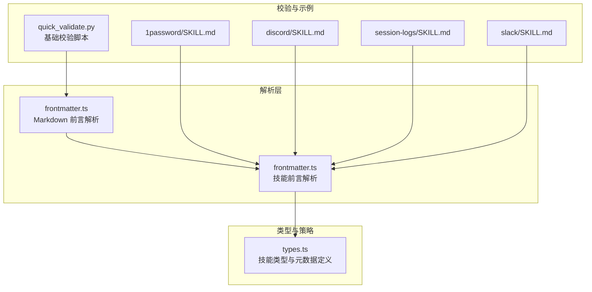
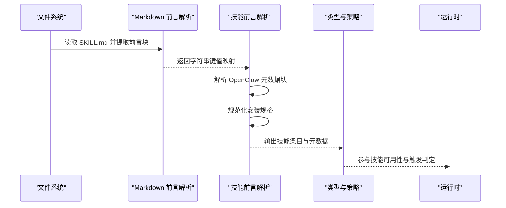
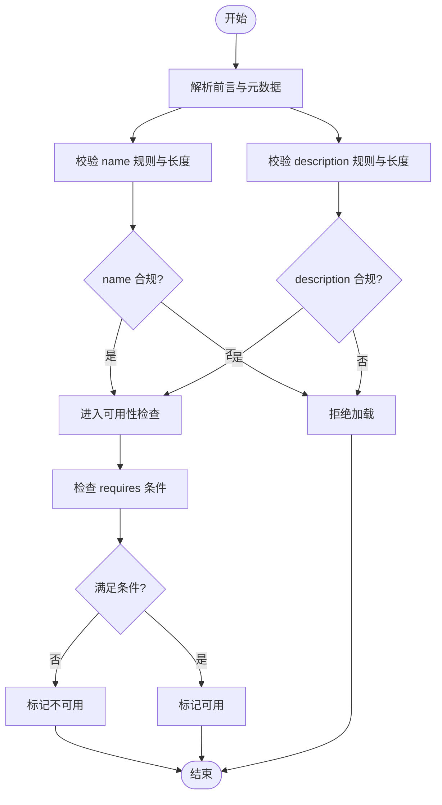
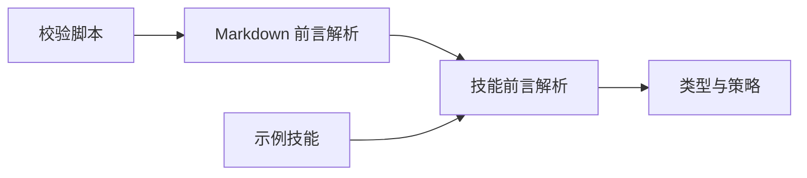
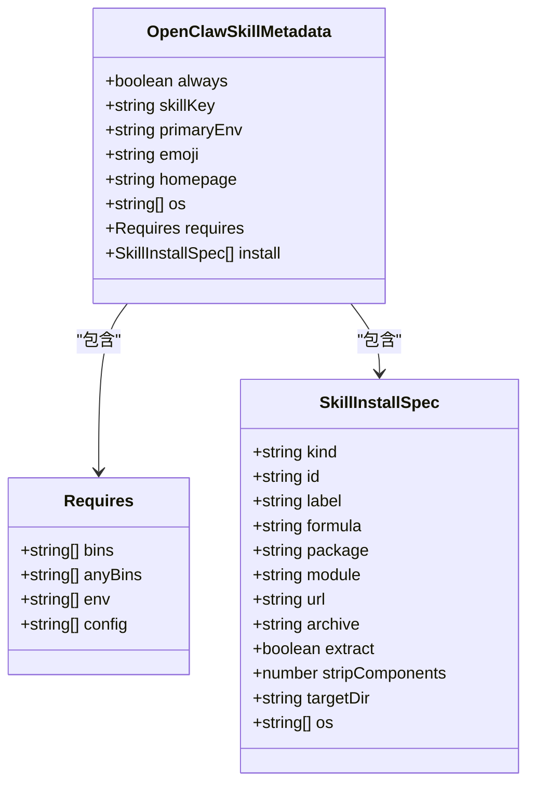

# 技能元数据结构

<cite>
**本文档引用的文件**
- [quick_validate.py](file://skills/skill-creator/scripts/quick_validate.py)
- [frontmatter.ts](file://src/markdown/frontmatter.ts)
- [frontmatter.ts](file://src/agents/skills/frontmatter.ts)
- [types.ts](file://src/agents/skills/types.ts)
- [skills.e2e-test-helpers.ts](file://src/agents/skills.e2e-test-helpers.ts)
- [1password/SKILL.md](file://skills/1password/SKILL.md)
- [discord/SKILL.md](file://skills/discord/SKILL.md)
- [session-logs/SKILL.md](file://skills/session-logs/SKILL.md)
- [slack/SKILL.md](file://skills/slack/SKILL.md)
</cite>

## 目录
1. [简介](#简介)
2. [项目结构](#项目结构)
3. [核心组件](#核心组件)
4. [架构总览](#架构总览)
5. [详细组件分析](#详细组件分析)
6. [依赖关系分析](#依赖关系分析)
7. [性能考量](#性能考量)
8. [故障排查指南](#故障排查指南)
9. [结论](#结论)
10. [附录](#附录)

## 简介
本文件系统性阐述 OpenClaw 技能元数据结构，聚焦 SKILL.md 文件中 YAML 前言（frontmatter）的元数据格式与解析流程。重点覆盖以下方面：
- 必需字段 name 与 description 的规范与校验规则
- 元数据字段的命名规则、长度限制与触发机制
- 元数据如何影响技能选择与可用性判定
- 描述字段在技能触发中的关键作用
- 编写最佳实践、常见错误示例与验证规则
- 具体元数据示例与解析实现映射

## 项目结构
围绕技能元数据的关键代码与示例文件分布如下：
- 解析与合并：Markdown 前言块解析器与技能前言解析器
- 类型定义：技能条目、元数据类型与安装规格
- 校验脚本：Python 脚本对 SKILL.md 进行基础校验
- 示例技能：多份 SKILL.md 展示元数据的实际用法

**图表来源**
- [frontmatter.ts:195-226](file://src/markdown/frontmatter.ts#L195-L226)
- [frontmatter.ts:23-25](file://src/agents/skills/frontmatter.ts#L23-L25)
- [types.ts:19-33](file://src/agents/skills/types.ts#L19-L33)
- [quick_validate.py:67-149](file://skills/skill-creator/scripts/quick_validate.py#L67-L149)
- [1password/SKILL.md:1-23](file://skills/1password/SKILL.md#L1-L23)
- [discord/SKILL.md:1-6](file://skills/discord/SKILL.md#L1-L6)
- [session-logs/SKILL.md:1-5](file://skills/session-logs/SKILL.md#L1-L5)
- [slack/SKILL.md:1-5](file://skills/slack/SKILL.md#L1-L5)

**章节来源**
- [frontmatter.ts:1-227](file://src/markdown/frontmatter.ts#L1-L227)
- [frontmatter.ts:1-223](file://src/agents/skills/frontmatter.ts#L1-L223)
- [types.ts:1-89](file://src/agents/skills/types.ts#L1-L89)
- [quick_validate.py:1-160](file://skills/skill-creator/scripts/quick_validate.py#L1-L160)
- [1password/SKILL.md:1-71](file://skills/1password/SKILL.md#L1-L71)
- [discord/SKILL.md:1-198](file://skills/discord/SKILL.md#L1-L198)
- [session-logs/SKILL.md:1-116](file://skills/session-logs/SKILL.md#L1-L116)
- [slack/SKILL.md:1-145](file://skills/slack/SKILL.md#L1-L145)

## 核心组件
- 前言块提取与解析
  - 提取三短横线界定的前言块
  - 优先使用 YAML 解析；若失败则回退到逐行解析
  - 合并策略：当 YAML 结构化值与行内值冲突时，遵循特定偏好逻辑
- 技能前言解析与元数据提取
  - 将前言解析结果转换为字符串键值映射
  - 提取 OpenClaw 特定元数据块（如 requires、install、os 等）
  - 规范化安装规格（brew/node/go/uv/download 等）
- 类型与策略
  - 定义技能条目、元数据结构与安装规格
  - 提供技能可用性判定上下文（平台、二进制、环境变量、配置）

**章节来源**
- [frontmatter.ts:183-226](file://src/markdown/frontmatter.ts#L183-L226)
- [frontmatter.ts:23-25](file://src/agents/skills/frontmatter.ts#L23-L25)
- [frontmatter.ts:186-206](file://src/agents/skills/frontmatter.ts#L186-L206)
- [types.ts:19-33](file://src/agents/skills/types.ts#L19-L33)

## 架构总览
下图展示从 SKILL.md 到运行时可用元数据的端到端流程。

**图表来源**
- [frontmatter.ts:195-226](file://src/markdown/frontmatter.ts#L195-L226)
- [frontmatter.ts:186-206](file://src/agents/skills/frontmatter.ts#L186-L206)
- [types.ts:64-89](file://src/agents/skills/types.ts#L64-L89)

## 详细组件分析

### YAML 前言元数据格式与字段规范
- 基本结构
  - 使用三短横线界定的前言块，键值对形式
  - 支持行内值与多行缩进值
- 允许的顶级属性
  - name、description、license、allowed-tools、metadata
- 必填字段
  - name：字符串，小写字母、数字、连字符组成，不以连字符开头或结尾，不允许连续连字符
  - description：字符串，不含尖括号，建议长度不超过 1024 字符
- 元数据块（metadata.openclaw）
  - 常见键：emoji、homepage、requires、install、os、always、skillKey、primaryEnv
  - requires：声明运行前置条件（二进制、环境变量、配置项等）
  - install：声明可选安装方案（brew/node/go/uv/download 等）
  - os：限定适用操作系统列表
  - always：布尔值，用于控制是否始终可用
  - skillKey/primaryEnv：用于标识与主环境变量

**章节来源**
- [quick_validate.py:98-149](file://skills/skill-creator/scripts/quick_validate.py#L98-L149)
- [frontmatter.ts:102-150](file://src/markdown/frontmatter.ts#L102-L150)
- [frontmatter.ts:186-206](file://src/agents/skills/frontmatter.ts#L186-L206)
- [types.ts:19-33](file://src/agents/skills/types.ts#L19-L33)

### 字段命名规则、长度限制与触发机制
- 命名规则
  - name：仅允许小写字母、数字、连字符；不可单独为连字符；不可以连字符开头或结尾；不可出现连续连字符
  - description：禁止包含角括号（< 或 >）
  - 元数据键：遵循 YAML 键规则，但 OpenClaw 仅消费已知键（如 openclaw）
- 长度限制
  - name：最大长度限制（示例脚本中为 64）
  - description：最大长度限制（示例脚本中为 1024）
- 触发机制
  - 元数据通过运行时解析后参与技能可用性判定
  - requires/install/os/always 等键直接影响技能是否被纳入候选集与是否可执行
  - description 作为用户界面与提示信息的一部分，间接影响用户选择与触发意图表达

**章节来源**
- [quick_validate.py:114-149](file://skills/skill-creator/scripts/quick_validate.py#L114-L149)
- [frontmatter.ts:186-206](file://src/agents/skills/frontmatter.ts#L186-L206)

### 元数据如何影响技能选择算法
- 可用性判定
  - 检查平台与二进制依赖（requires.bins/anyBins）
  - 检查环境变量与配置项（requires.env/config）
  - 应用 os 与 always 等约束
- 选择与排序
  - 在满足可用性的前提下，结合用户意图与上下文进行选择
  - 元数据中的 emoji/homepage/skillKey 等用于增强用户体验与管理

**图表来源**
- [quick_validate.py:109-149](file://skills/skill-creator/scripts/quick_validate.py#L109-L149)
- [frontmatter.ts:186-206](file://src/agents/skills/frontmatter.ts#L186-L206)

### 描述字段在技能触发中的关键作用
- 用户界面呈现
  - description 用于技能列表与状态面板的简要说明
- 触发意图表达
  - 良好的描述有助于用户准确表达需求，提升触发命中率
- 内容质量
  - 避免包含尖括号等特殊字符，保持简洁明确

**章节来源**
- [quick_validate.py:136-147](file://skills/skill-creator/scripts/quick_validate.py#L136-L147)
- [session-logs/SKILL.md:3-13](file://skills/session-logs/SKILL.md#L3-L13)

### 元数据编写最佳实践
- 命名与描述
  - name 使用 hyphen-case（小写、数字、连字符），避免首尾连字符与连续连字符
  - description 避免尖括号，尽量在 1024 字符以内
- 元数据块
  - 仅使用受支持的键（如 emoji、homepage、requires、install、os、always、skillKey、primaryEnv）
  - requires 中的二进制、环境变量、配置项应与实际工具链一致
  - install 仅填写合法且必要的安装规格
- 示例参考
  - 参考内置技能示例，确保结构与键值正确

**章节来源**
- [quick_validate.py:98-149](file://skills/skill-creator/scripts/quick_validate.py#L98-L149)
- [1password/SKILL.md:5-22](file://skills/1password/SKILL.md#L5-L22)
- [discord/SKILL.md:4-4](file://skills/discord/SKILL.md#L4-L4)
- [session-logs/SKILL.md:4-4](file://skills/session-logs/SKILL.md#L4-L4)
- [slack/SKILL.md:4-4](file://skills/slack/SKILL.md#L4-L4)

### 常见错误示例
- 缺失必填字段
  - 未包含 name 或 description
- 命名违规
  - name 包含大写字母、下划线、空格或连续连字符
  - name 以连字符开头或结尾
- 描述违规
  - description 包含 < 或 >
- 元数据键错误
  - 出现未支持的顶级键（除 name/description/license/allowed-tools/metadata 外）
- 安装规格不完整
  - brew/node/go/uv/download 缺少必要字段（如 formula/package/module/url）

**章节来源**
- [quick_validate.py:109-149](file://skills/skill-creator/scripts/quick_validate.py#L109-L149)

### 具体元数据示例与验证规则
- 示例一：1Password 技能
  - 使用了 metadata.openclaw.emoji、requires.bins、install 列表
- 示例二：Discord 技能
  - 使用了 metadata.openclaw.emoji、requires.config
- 示例三：Session Logs 技能
  - 使用了 metadata.openclaw.emoji、requires.bins
- 示例四：Slack 技能
  - 使用了 metadata.openclaw.emoji、requires.config

验证规则要点
- 前言块必须以三短横线界定
- 顶级键集合受限
- name/description 的类型与内容校验
- 元数据块的结构化解析与回退策略

**章节来源**
- [1password/SKILL.md:1-23](file://skills/1password/SKILL.md#L1-L23)
- [discord/SKILL.md:1-6](file://skills/discord/SKILL.md#L1-L6)
- [session-logs/SKILL.md:1-5](file://skills/session-logs/SKILL.md#L1-L5)
- [slack/SKILL.md:1-5](file://skills/slack/SKILL.md#L1-L5)
- [quick_validate.py:67-149](file://skills/skill-creator/scripts/quick_validate.py#L67-L149)
- [frontmatter.ts:195-226](file://src/markdown/frontmatter.ts#L195-L226)

## 依赖关系分析
- 组件耦合
  - Markdown 前言解析器独立于技能解析器，二者通过字符串键值映射衔接
  - 技能解析器依赖类型定义与共享的元数据解析工具
- 外部依赖
  - YAML 解析库用于结构化解析；若缺失则回退到行内解析
- 潜在循环依赖
  - 当前模块间为单向依赖，无明显循环

**图表来源**
- [frontmatter.ts:195-226](file://src/markdown/frontmatter.ts#L195-L226)
- [frontmatter.ts:23-25](file://src/agents/skills/frontmatter.ts#L23-L25)
- [types.ts:19-33](file://src/agents/skills/types.ts#L19-L33)
- [quick_validate.py:67-96](file://skills/skill-creator/scripts/quick_validate.py#L67-L96)

**章节来源**
- [frontmatter.ts:1-227](file://src/markdown/frontmatter.ts#L1-L227)
- [frontmatter.ts:1-223](file://src/agents/skills/frontmatter.ts#L1-L223)
- [types.ts:1-89](file://src/agents/skills/types.ts#L1-L89)
- [quick_validate.py:1-160](file://skills/skill-creator/scripts/quick_validate.py#L1-L160)

## 性能考量
- 解析路径
  - 优先使用 YAML 解析，失败时回退行内解析，整体开销可控
- 数据结构
  - 前言解析返回字符串映射，减少不必要的类型转换
- 扩展性
  - 元数据键集合受控，便于后续扩展与兼容

[本节为通用指导，无需具体文件来源]

## 故障排查指南
- 前言块格式错误
  - 确认三短横线界定前后无多余字符
- YAML 解析失败
  - 检查缩进与引号使用；必要时移除复杂结构改用行内值
- 键名或键值不合规
  - 对照允许的顶级键集合与元数据键集合
- name/description 校验失败
  - 修正命名规则与长度限制
- 安装规格不完整
  - 补充必要字段或删除无效条目

**章节来源**
- [quick_validate.py:80-107](file://skills/skill-creator/scripts/quick_validate.py#L80-L107)
- [frontmatter.ts:195-226](file://src/markdown/frontmatter.ts#L195-L226)

## 结论
OpenClaw 的技能元数据以 SKILL.md 的 YAML 前言为核心载体，通过严格的解析与校验流程，将结构化元数据转化为运行时可用的技能条目与策略依据。遵循本文档的命名规则、长度限制与最佳实践，可显著提升技能的可用性、可维护性与触发准确性。

[本节为总结性内容，无需具体文件来源]

## 附录

### 类型与安装规格定义概览

**图表来源**
- [types.ts:19-33](file://src/agents/skills/types.ts#L19-L33)