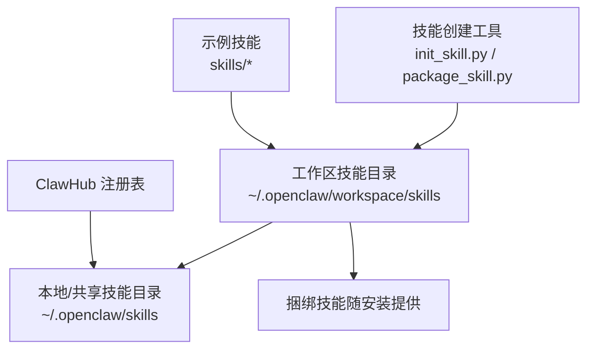
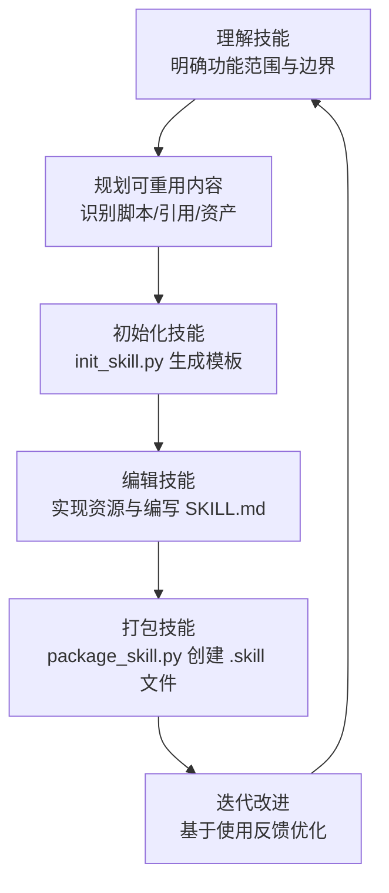
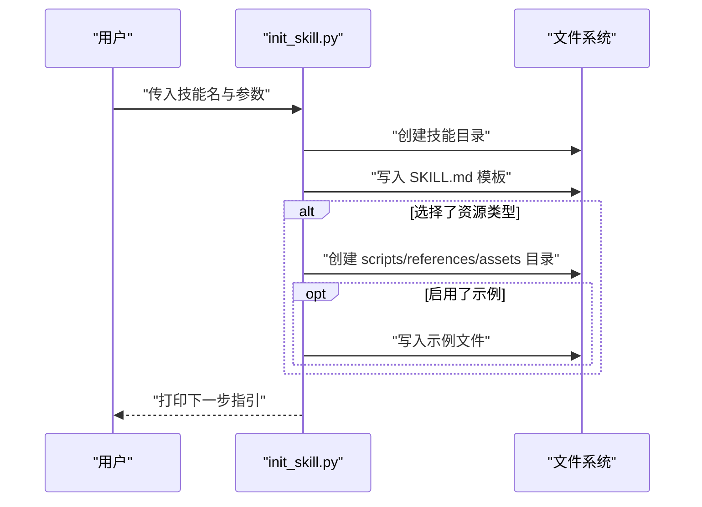
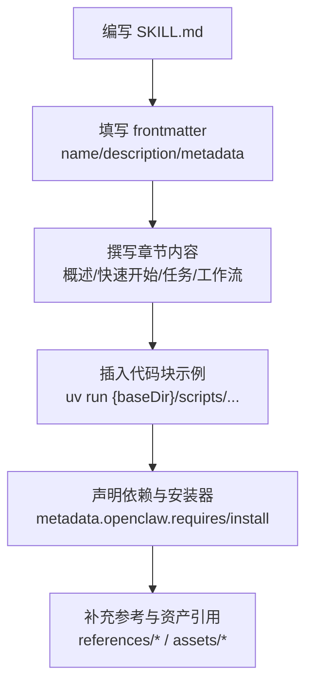
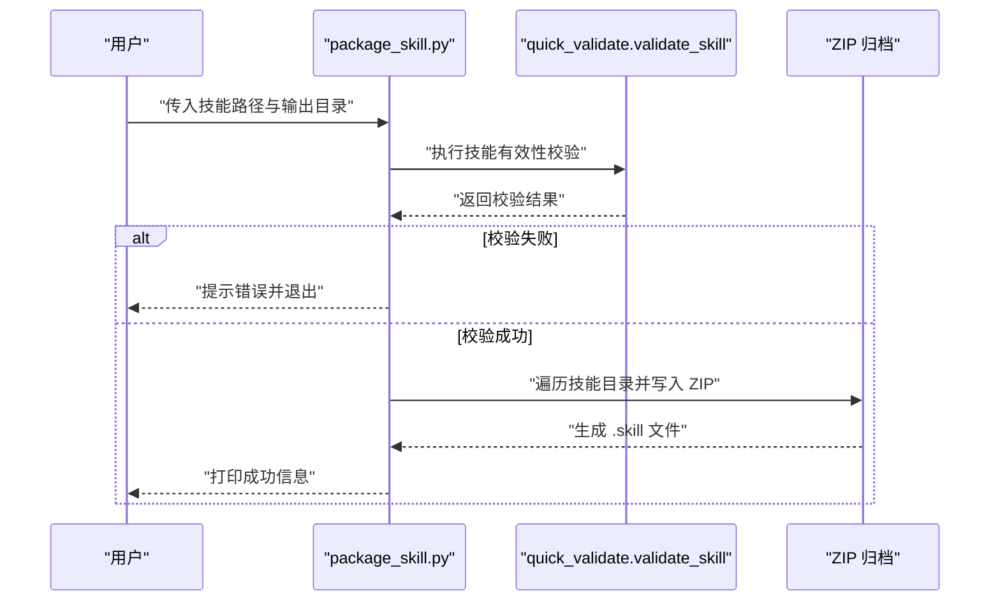
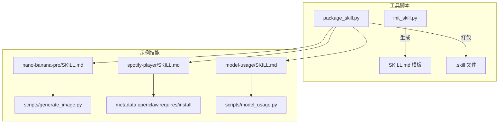

# 技能创建流程

<cite>
**本文档引用的文件**
- [docs/tools/creating-skills.md](file://docs/tools/creating-skills.md)
- [docs/tools/skills.md](file://docs/tools/skills.md)
- [skills/skill-creator/scripts/init_skill.py](file://skills/skill-creator/scripts/init_skill.py)
- [skills/skill-creator/scripts/package_skill.py](file://skills/skill-creator/scripts/package_skill.py)
- [skills/skill-creator/scripts/test_package_skill.py](file://skills/skill-creator/scripts/test_package_skill.py)
- [skills/nano-banana-pro/SKILL.md](file://skills/nano-banana-pro/SKILL.md)
- [skills/gh-issues/SKILL.md](file://skills/gh-issues/SKILL.md)
- [skills/spotify-player/SKILL.md](file://skills/spotify-player/SKILL.md)
- [skills/model-usage/SKILL.md](file://skills/model-usage/SKILL.md)
- [skills/nano-banana-pro/scripts/generate_image.py](file://skills/nano-banana-pro/scripts/generate_image.py)
- [skills/model-usage/scripts/model_usage.py](file://skills/model-usage/scripts/model_usage.py)
</cite>

## 目录
1. [简介](#简介)
2. [项目结构](#项目结构)
3. [核心组件](#核心组件)
4. [架构总览](#架构总览)
5. [详细组件分析](#详细组件分析)
6. [依赖关系分析](#依赖关系分析)
7. [性能考虑](#性能考虑)
8. [故障排除指南](#故障排除指南)
9. [结论](#结论)
10. [附录](#附录)

## 简介
本指南面向希望在 OpenClaw 工作区中创建自定义技能的开发者与使用者。OpenClaw 使用“技能（Skill）”作为扩展能力的主要方式：每个技能是一个包含 SKILL.md 的目录，并可选地包含脚本或资源。技能支持本地覆盖、工作区隔离与共享，且可通过 ClawHub 进行安装与同步。

本指南围绕“六个步骤”的完整技能开发流程展开：理解技能、规划可重用内容、初始化技能、编辑技能、打包技能、迭代改进。同时提供 init_skill.py 与 package_skill.py 的使用示例与参数说明，帮助你快速上手并规范化技能交付。

## 项目结构
OpenClaw 的技能相关文件主要分布在以下位置：
- 文档与规范：docs/tools 下的技能与创建指南
- 技能模板与工具：skills/skill-creator/scripts 中的初始化与打包脚本
- 示例技能：skills 目录下的多个真实技能，包含 SKILL.md、脚本与参考材料
- 配置与加载规则：docs/tools/skills.md 对技能位置、优先级、安全与元数据要求有详细说明

**图表来源**
- [docs/tools/skills.md:13-40](file://docs/tools/skills.md#L13-L40)
- [docs/tools/creating-skills.md:17-59](file://docs/tools/creating-skills.md#L17-L59)

**章节来源**
- [docs/tools/skills.md:13-40](file://docs/tools/skills.md#L13-L40)
- [docs/tools/creating-skills.md:17-59](file://docs/tools/creating-skills.md#L17-L59)

## 核心组件
- 技能规范与格式：SKILL.md 必须包含 YAML frontmatter（name、description 等），并遵循 AgentSkills 规范；可选 metadata.openclaw 定义加载条件、安装器与平台限制等。
- 初始化工具：init_skill.py 可一键生成带模板的 SKILL.md，并按需创建 scripts/references/assets 资源目录，支持示例文件填充。
- 打包工具：package_skill.py 将技能目录打包为 .skill 文件（zip 格式），内置安全校验（排除符号链接、防止路径逃逸、忽略特定目录等）。
- 示例技能：通过现有技能（如 nano-banana-pro、gh-issues、spotify-player、model-usage）学习最佳实践与结构组织。

**章节来源**
- [docs/tools/skills.md:78-187](file://docs/tools/skills.md#L78-L187)
- [skills/skill-creator/scripts/init_skill.py:1-379](file://skills/skill-creator/scripts/init_skill.py#L1-L379)
- [skills/skill-creator/scripts/package_skill.py:1-140](file://skills/skill-creator/scripts/package_skill.py#L1-L140)

## 架构总览
下图展示了从“理解技能”到“迭代改进”的端到端流程，以及 init_skill.py 与 package_skill.py 在其中的角色。

[此图为概念性流程图，不直接映射具体源码文件，故无图表来源]

## 详细组件分析

### 步骤一：理解技能（通过具体示例明确功能范围）
- 目标：确定技能要解决的问题域、触发场景、输入输出与边界条件。
- 方法：参考现有技能的 SKILL.md 结构与元数据，理解其“何时使用”“如何调用”“需要哪些前置条件”。
- 建议清单：
  - 明确技能名称与描述（name、description）
  - 列出适用场景与限制（如平台、二进制依赖、环境变量）
  - 设计最小可用功能（MVP），避免一次性过度设计
  - 评估是否需要脚本、参考文档或资产文件

**章节来源**
- [docs/tools/skills.md:78-187](file://docs/tools/skills.md#L78-L187)
- [skills/nano-banana-pro/SKILL.md:1-66](file://skills/nano-banana-pro/SKILL.md#L1-L66)
- [skills/spotify-player/SKILL.md:1-65](file://skills/spotify-player/SKILL.md#L1-L65)
- [skills/gh-issues/SKILL.md:1-800](file://skills/gh-issues/SKILL.md#L1-L800)

### 步骤二：规划可重用内容（识别脚本、引用、资产）
- 脚本（scripts）：可直接执行的自动化逻辑，适合处理数据转换、API 调用、系统命令等。
- 引用（references）：深度文档、API 参考、流程指南等，供上下文加载以指导思考。
- 资产（assets）：模板、图标、字体、样本数据等，用于最终输出而非上下文加载。
- 建议清单：
  - 按需创建资源目录，避免冗余
  - 为脚本提供示例入口，便于后续替换
  - 为引用与资产命名清晰、结构化

**章节来源**
- [skills/skill-creator/scripts/init_skill.py:70-108](file://skills/skill-creator/scripts/init_skill.py#L70-L108)
- [skills/model-usage/SKILL.md:67-70](file://skills/model-usage/SKILL.md#L67-L70)

### 步骤三：初始化技能（使用 init_skill.py 生成模板）
- 功能：创建技能目录、生成 SKILL.md 模板、按需创建资源目录与示例文件。
- 关键点：
  - 名称归一化（小写连字符）
  - 支持选择资源类型（scripts、references、assets）
  - 可选生成示例文件（脚本、参考、资产占位符）

**图表来源**
- [skills/skill-creator/scripts/init_skill.py:255-317](file://skills/skill-creator/scripts/init_skill.py#L255-L317)

- 参数说明（来自脚本帮助信息）：
  - skill_name：技能名称（将被归一化为小写连字符）
  - --path：技能输出目录
  - --resources：逗号分隔的资源类型列表（scripts、references、assets）
  - --examples：仅在设置了 --resources 时生效，表示在所选资源目录中创建示例文件

- 使用示例（来自脚本注释）：
  - 创建公共技能并包含脚本与引用：init_skill.py my-new-skill --path skills/public --resources scripts,references
  - 创建私有技能并包含脚本与示例：init_skill.py my-api-helper --path skills/private --resources scripts --examples
  - 指定自定义路径：init_skill.py custom-skill --path /custom/location

**章节来源**
- [skills/skill-creator/scripts/init_skill.py:5-13](file://skills/skill-creator/scripts/init_skill.py#L5-L13)
- [skills/skill-creator/scripts/init_skill.py:320-379](file://skills/skill-creator/scripts/init_skill.py#L320-L379)

### 步骤四：编辑技能（实现资源与编写 SKILL.md）
- SKILL.md 要求：
  - 必填：name、description
  - 可选：homepage、user-invocable、disable-model-invocation、command-dispatch、command-tool、command-arg-mode 等
  - 元数据：metadata.openclaw 可定义 os、requires（bins/env/config）、install、primaryEnv 等
- 内容建议：
  - 清晰概述、结构化章节（如“概述”“快速开始”“任务/工作流/能力”等）
  - 提供可运行的命令示例与注意事项
  - 如需脚本，使用 {baseDir} 引用技能根路径
- 示例参考：
  - nano-banana-pro：展示脚本调用、API Key 注入与分辨率/比例参数
  - gh-issues：复杂多阶段工作流与子代理协作
  - spotify-player：二进制选择与安装器配置
  - model-usage：CLI 输入/输出与参考文档引用

**图表来源**
- [docs/tools/skills.md:78-187](file://docs/tools/skills.md#L78-L187)
- [skills/nano-banana-pro/SKILL.md:1-66](file://skills/nano-banana-pro/SKILL.md#L1-L66)
- [skills/spotify-player/SKILL.md:1-65](file://skills/spotify-player/SKILL.md#L1-L65)
- [skills/model-usage/SKILL.md:67-70](file://skills/model-usage/SKILL.md#L67-L70)

**章节来源**
- [docs/tools/skills.md:78-187](file://docs/tools/skills.md#L78-L187)
- [skills/nano-banana-pro/SKILL.md:1-66](file://skills/nano-banana-pro/SKILL.md#L1-L66)
- [skills/gh-issues/SKILL.md:1-800](file://skills/gh-issues/SKILL.md#L1-L800)
- [skills/spotify-player/SKILL.md:1-65](file://skills/spotify-player/SKILL.md#L1-L65)
- [skills/model-usage/SKILL.md:67-70](file://skills/model-usage/SKILL.md#L67-L70)

### 步骤五：打包技能（使用 package_skill.py 创建分发文件）
- 功能：将技能目录打包为 .skill 文件（zip），内置安全校验与验证。
- 安全与验证要点：
  - 仅打包普通文件，跳过符号链接
  - 排除 .git、node_modules 等目录
  - 校验路径不得逃逸技能根目录
  - 输出文件不会被写入自身（避免自引用）
  - 打包前先进行技能有效性校验（依赖 quick_validate.validate_skill）
- 使用示例（来自脚本注释）：
  - 将 skills/public/my-skill 打包到当前目录：package_skill.py skills/public/my-skill
  - 指定输出目录：package_skill.py skills/public/my-skill ./dist

**图表来源**
- [skills/skill-creator/scripts/package_skill.py:28-112](file://skills/skill-creator/scripts/package_skill.py#L28-L112)

- 参数说明（来自脚本帮助信息）：
  - 第一个参数：技能目录路径
  - 第二个参数（可选）：输出目录，默认为当前目录

- 安全行为测试参考：
  - 符号链接与外部目录跳过
  - 路径逃逸检测
  - 自引用输出文件跳过
  - 嵌套常规文件打包

**章节来源**
- [skills/skill-creator/scripts/package_skill.py:1-140](file://skills/skill-creator/scripts/package_skill.py#L1-L140)
- [skills/skill-creator/scripts/test_package_skill.py:1-161](file://skills/skill-creator/scripts/test_package_skill.py#L1-L161)

### 步骤六：迭代改进（基于实际使用反馈优化）
- 基于用户反馈与日志，持续优化 SKILL.md 的结构与示例、完善脚本健壮性与错误处理、更新依赖与安装器。
- 建议清单：
  - 收集典型失败场景，补充错误处理与回退策略
  - 优化命令示例与参数组合，提升易用性
  - 更新 metadata.openclaw 以适配新版本二进制或配置
  - 重新打包并发布至 ClawHub 或内部仓库

**章节来源**
- [docs/tools/skills.md:287-303](file://docs/tools/skills.md#L287-L303)

## 依赖关系分析
- init_skill.py 依赖 Python 标准库（argparse、pathlib、re 等），用于解析参数、规范化名称与生成模板。
- package_skill.py 依赖 zipfile 与外部验证模块 quick_validate（validate_skill），负责打包与安全校验。
- 示例技能依赖各自声明的二进制与环境变量（如 codexbar、uv、gh 等），并通过 metadata.openclaw.install 提供安装器。

**图表来源**
- [skills/skill-creator/scripts/init_skill.py:15-21](file://skills/skill-creator/scripts/init_skill.py#L15-L21)
- [skills/skill-creator/scripts/package_skill.py:13-17](file://skills/skill-creator/scripts/package_skill.py#L13-L17)
- [skills/nano-banana-pro/SKILL.md:1-66](file://skills/nano-banana-pro/SKILL.md#L1-L66)
- [skills/spotify-player/SKILL.md:1-65](file://skills/spotify-player/SKILL.md#L1-L65)
- [skills/model-usage/SKILL.md:67-70](file://skills/model-usage/SKILL.md#L67-L70)

**章节来源**
- [skills/skill-creator/scripts/init_skill.py:15-21](file://skills/skill-creator/scripts/init_skill.py#L15-L21)
- [skills/skill-creator/scripts/package_skill.py:13-17](file://skills/skill-creator/scripts/package_skill.py#L13-L17)

## 性能考虑
- 技能数量与提示词长度：OpenClaw 会在系统提示中注入技能列表，字符数与 XML 转义会增加开销。技能越多、字段越长，成本越高。
- 建议：
  - 控制 SKILL.md 字段简洁，避免冗长描述
  - 合理拆分复杂技能为多个小型技能
  - 使用 references 将长文档移出主 SKILL.md，减少提示词负担

**章节来源**
- [docs/tools/skills.md:269-286](file://docs/tools/skills.md#L269-L286)

## 故障排除指南
- init_skill.py 常见问题
  - 技能名为空或过长：确保名称包含字母或数字，长度不超过最大值
  - --examples 未设置 --resources：需先指定资源类型
  - 目录已存在：请更换名称或删除旧目录
- package_skill.py 常见问题
  - SKILL.md 缺失：确保技能根目录包含 SKILL.md
  - 路径逃逸：确认输出目录不在技能根内，避免自引用
  - 符号链接：打包时会跳过符号链接，避免泄露外部文件
  - 权限不足：确保对目标目录具有读写权限

**章节来源**
- [skills/skill-creator/scripts/init_skill.py:338-379](file://skills/skill-creator/scripts/init_skill.py#L338-L379)
- [skills/skill-creator/scripts/package_skill.py:40-112](file://skills/skill-creator/scripts/package_skill.py#L40-L112)
- [skills/skill-creator/scripts/test_package_skill.py:65-157](file://skills/skill-creator/scripts/test_package_skill.py#L65-L157)

## 结论
通过“理解—规划—初始化—编辑—打包—迭代”的闭环流程，你可以高效地在 OpenClaw 中创建高质量、可维护、可分发的技能。借助 init_skill.py 与 package_skill.py，既能快速生成标准化模板，又能保证打包过程的安全与合规。结合现有示例技能与官方规范文档，可以进一步提升技能的可用性与可扩展性。

## 附录
- 技能位置与优先级
  - 工作区技能（最高优先级）→ 本地/共享技能 → 捆绑技能（最低优先级）
  - 可通过配置添加额外技能目录
- 安全与配置
  - 第三方技能应谨慎启用，注意敏感信息注入与沙箱限制
  - 通过 openclaw.json 对技能进行开关、密钥与环境变量注入

**章节来源**
- [docs/tools/skills.md:13-40](file://docs/tools/skills.md#L13-L40)
- [docs/tools/skills.md:69-76](file://docs/tools/skills.md#L69-L76)
- [docs/tools/skills.md:189-229](file://docs/tools/skills.md#L189-L229)