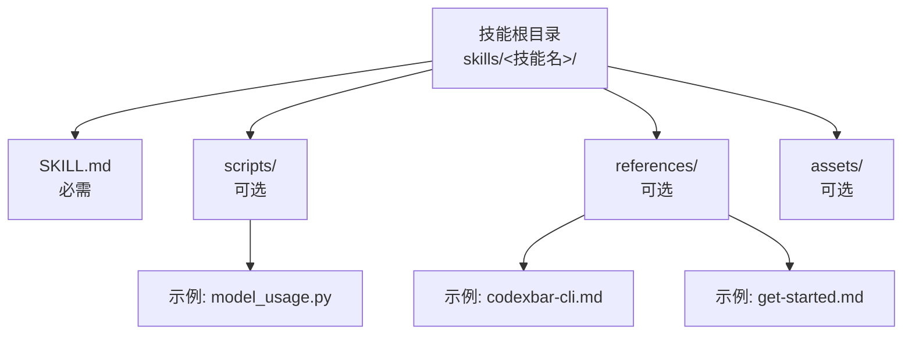
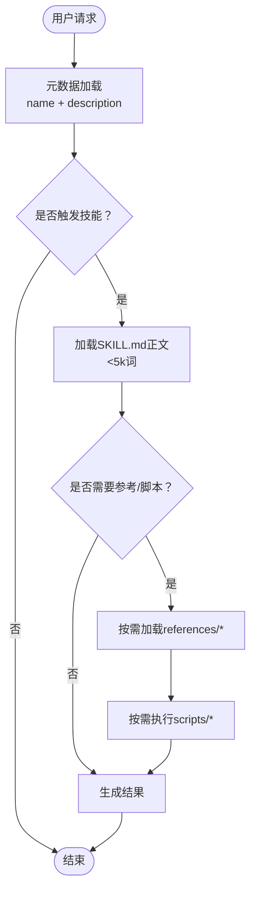
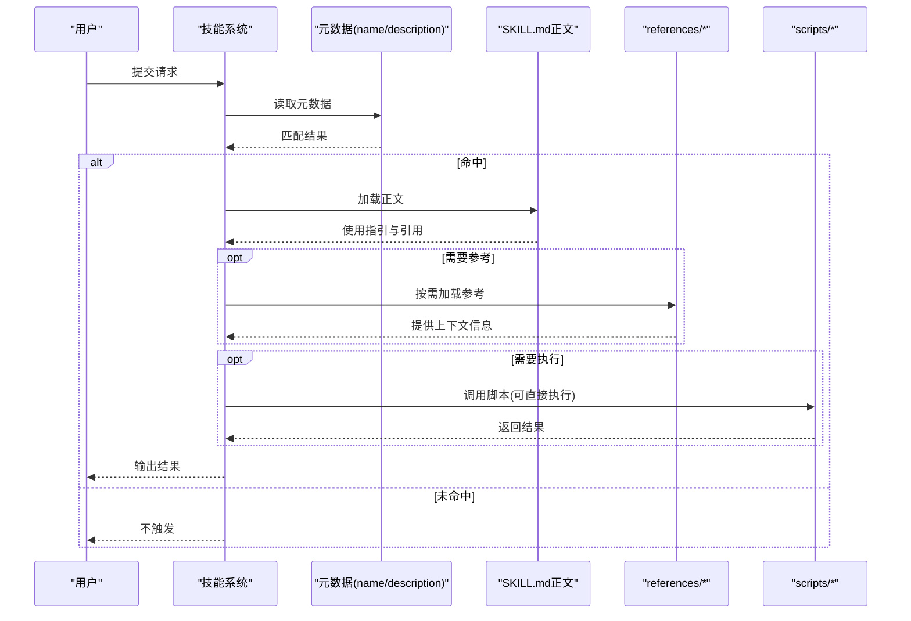
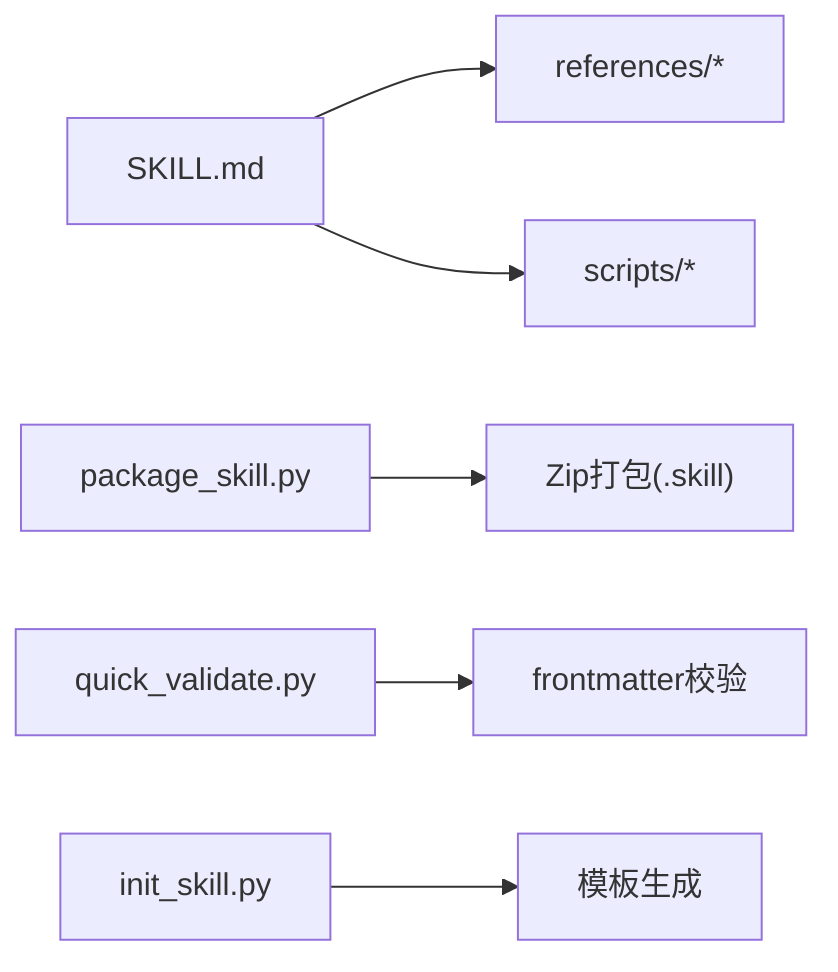

# 技能结构设计

<cite>
**本文档引用的文件**
- [skills/skill-creator/SKILL.md](file://skills/skill-creator/SKILL.md)
- [skills/model-usage/SKILL.md](file://skills/model-usage/SKILL.md)
- [skills/nano-banana-pro/SKILL.md](file://skills/nano-banana-pro/SKILL.md)
- [skills/openai-image-gen/SKILL.md](file://skills/openai-image-gen/SKILL.md)
- [skills/1password/SKILL.md](file://skills/1password/SKILL.md)
- [skills/model-usage/scripts/model_usage.py](file://skills/model-usage/scripts/model_usage.py)
- [skills/skill-creator/scripts/init_skill.py](file://skills/skill-creator/scripts/init_skill.py)
- [skills/skill-creator/scripts/package_skill.py](file://skills/skill-creator/scripts/package_skill.py)
- [skills/skill-creator/scripts/quick_validate.py](file://skills/skill-creator/scripts/quick_validate.py)
- [skills/1password/references/get-started.md](file://skills/1password/references/get-started.md)
- [skills/model-usage/references/codexbar-cli.md](file://skills/model-usage/references/codexbar-cli.md)
</cite>

## 目录
1. 引言
2. 项目结构
3. 核心组件
4. 架构总览
5. 详细组件分析
6. 依赖关系分析
7. 性能考量
8. 故障排查指南
9. 结论
10. 附录

## 引言
本设计指南面向OpenClaw技能开发者，系统阐述技能的结构规范、分层加载机制与组织模式，帮助你在有限上下文窗口内高效表达复杂能力，并通过可复用的脚本、参考与资源实现“渐进式披露”。文档基于仓库中现有技能与工具链的实际实现，总结出可操作的设计原则与最佳实践。

## 项目结构
OpenClaw的技能位于skills目录下，每个技能是一个独立子目录，至少包含一个SKILL.md文件；根据需要可包含scripts/、references/、assets/等捆绑资源目录。仓库提供了技能初始化、打包与快速校验的工具脚本，确保技能在命名、结构与内容上保持一致性和可分发性。

图表来源
- [skills/model-usage/SKILL.md:1-70](file://skills/model-usage/SKILL.md#L1-L70)
- [skills/nano-banana-pro/SKILL.md:1-66](file://skills/nano-banana-pro/SKILL.md#L1-L66)
- [skills/openai-image-gen/SKILL.md:1-93](file://skills/openai-image-gen/SKILL.md#L1-L93)
- [skills/1password/SKILL.md:1-71](file://skills/1password/SKILL.md#L1-L71)

章节来源
- [skills/model-usage/SKILL.md:1-70](file://skills/model-usage/SKILL.md#L1-L70)
- [skills/nano-banana-pro/SKILL.md:1-66](file://skills/nano-banana-pro/SKILL.md#L1-L66)
- [skills/openai-image-gen/SKILL.md:1-93](file://skills/openai-image-gen/SKILL.md#L1-L93)
- [skills/1password/SKILL.md:1-71](file://skills/1password/SKILL.md#L1-L71)

## 核心组件
- SKILL.md：技能的“元数据+正文”，元数据用于触发与识别，正文用于指导使用与引用资源。
- 捆绑资源：
  - scripts/：可执行代码，适合重复性高或需要确定性的任务。
  - references/：按需加载的参考材料，避免正文膨胀。
  - assets/：输出使用的模板、图标、字体等文件，不进入上下文。
- 工具链：
  - 初始化：生成标准化模板与目录骨架。
  - 打包：将技能目录打包为.zip格式的.skill文件，内置安全校验。
  - 快速校验：对SKILL.md的元数据进行基础合法性检查。

章节来源
- [skills/skill-creator/SKILL.md:46-126](file://skills/skill-creator/SKILL.md#L46-L126)
- [skills/skill-creator/scripts/init_skill.py:1-200](file://skills/skill-creator/scripts/init_skill.py#L1-L200)
- [skills/skill-creator/scripts/package_skill.py:1-140](file://skills/skill-creator/scripts/package_skill.py#L1-L140)
- [skills/skill-creator/scripts/quick_validate.py:1-160](file://skills/skill-creator/scripts/quick_validate.py#L1-L160)

## 架构总览
技能的三层加载机制与渐进式披露设计，确保在不同阶段仅加载必要信息，最大化上下文利用效率。

图表来源
- [skills/skill-creator/SKILL.md:113-126](file://skills/skill-creator/SKILL.md#L113-L126)
- [skills/model-usage/SKILL.md:1-70](file://skills/model-usage/SKILL.md#L1-L70)
- [skills/nano-banana-pro/SKILL.md:1-66](file://skills/nano-banana-pro/SKILL.md#L1-L66)

## 详细组件分析

### SKILL.md结构与内容要求
- 元数据（YAML前言）
  - 必填字段：name、description。前者用于命名与匹配，后者决定触发时机与使用场景。
  - 可选扩展：license、allowed-tools、metadata（含平台、二进制依赖、安装指引等）。
  - 长度与字符限制：描述文本长度上限、禁止尖括号等。
- 正文（Markdown）
  - 触发后才加载，建议控制在500行以内，必要时拆分为references/*并在SKILL.md中明确引用。
  - 写作采用祈使句/动词不定式，聚焦“如何使用”和“何时使用”。

章节来源
- [skills/skill-creator/SKILL.md:63-69](file://skills/skill-creator/SKILL.md#L63-L69)
- [skills/skill-creator/SKILL.md:319-330](file://skills/skill-creator/SKILL.md#L319-L330)
- [skills/skill-creator/SKILL.md:113-126](file://skills/skill-creator/SKILL.md#L113-L126)
- [skills/skill-creator/scripts/quick_validate.py:98-148](file://skills/skill-creator/scripts/quick_validate.py#L98-L148)

### 捆绑资源：scripts/、references/、assets/
- scripts/
  - 适用：重复性高、需要确定性或频繁调用的任务。
  - 示例：模型用量统计、图像生成、批量处理等。
  - 最佳实践：脚本可直接执行，无需读入上下文；仍可在需要时被阅读以做调整。
- references/
  - 适用：API参考、Schema、政策、流程细节等长篇资料。
  - 最佳实践：超过100行建议添加目录索引；避免与SKILL.md重复；仅在需要时加载。
- assets/
  - 适用：模板、图标、字体、样本文件等输出素材。
  - 最佳实践：不进入上下文，仅在产物中使用。

章节来源
- [skills/skill-creator/SKILL.md:70-100](file://skills/skill-creator/SKILL.md#L70-L100)
- [skills/skill-creator/SKILL.md:81-91](file://skills/skill-creator/SKILL.md#L81-L91)
- [skills/skill-creator/SKILL.md:92-100](file://skills/skill-creator/SKILL.md#L92-L100)
- [skills/model-usage/SKILL.md:1-70](file://skills/model-usage/SKILL.md#L1-L70)
- [skills/nano-banana-pro/SKILL.md:1-66](file://skills/nano-banana-pro/SKILL.md#L1-L66)
- [skills/openai-image-gen/SKILL.md:1-93](file://skills/openai-image-gen/SKILL.md#L1-L93)

### 三层加载机制与渐进式披露
- 元数据（name + description）：始终在上下文中，约100词量级，用于快速筛选与触发。
- SKILL.md正文：仅在触发后加载，建议<5k词；长内容拆分到references/*并给出明确引用路径。
- 捆绑资源：按需加载或执行，scripts可不经上下文直接运行，避免挤占上下文。

图表来源
- [skills/skill-creator/SKILL.md:113-126](file://skills/skill-creator/SKILL.md#L113-L126)
- [skills/model-usage/SKILL.md:67-70](file://skills/model-usage/SKILL.md#L67-L70)
- [skills/1password/SKILL.md:29-33](file://skills/1password/SKILL.md#L29-L33)

### 技能组织的三种模式
- 高层指南与引用结合
  - 在SKILL.md给出概览与快速开始，将细节放入references/*并通过链接引导。
  - 适用：通用型工作流、多步骤过程。
- 领域特定组织
  - 将不同业务域的内容按域划分到references/子目录，按需只读取相关域。
  - 适用：多域技能（如财务、销售、产品、营销）。
- 条件详情展示
  - 基础内容放在SKILL.md，高级/可选细节通过链接指向references/*。
  - 适用：支持多种框架/变体的技能。

章节来源
- [skills/skill-creator/SKILL.md:127-195](file://skills/skill-creator/SKILL.md#L127-L195)

### 渐进式披露设计原则
- 控制SKILL.md正文长度，避免上下文浪费；长内容拆分到references/*。
- 对长参考文件提供目录索引，便于预览与导航。
- 严格避免深层嵌套引用，所有引用应直接从SKILL.md发起。
- 为variants/多框架场景提供清晰的导航与选择逻辑。

章节来源
- [skills/skill-creator/SKILL.md:196-200](file://skills/skill-creator/SKILL.md#L196-L200)

### 实用设计模式与结构化思路
- 以“触发条件+使用场景”为核心编写description，确保元数据驱动的精准触发。
- 先规划scripts/references/assets，再填充SKILL.md正文，保证资源与文档的一致性。
- 使用工具链：
  - 初始化：生成模板与目录骨架，减少手工配置错误。
  - 打包：产出可分发的.skill文件，内置安全校验（拒绝符号链接、排除敏感目录）。
  - 快速校验：对SKILL.md元数据进行基础合法性检查，提前发现命名与格式问题。

章节来源
- [skills/skill-creator/scripts/init_skill.py:1-200](file://skills/skill-creator/scripts/init_skill.py#L1-L200)
- [skills/skill-creator/scripts/package_skill.py:28-112](file://skills/skill-creator/scripts/package_skill.py#L28-L112)
- [skills/skill-creator/scripts/quick_validate.py:67-149](file://skills/skill-creator/scripts/quick_validate.py#L67-L149)

## 依赖关系分析
- 技能内部依赖
  - SKILL.md依赖references/*与scripts/*的存在与正确命名。
  - references/*与assets/*的使用需在SKILL.md中明示。
- 工具链依赖
  - 打包器依赖Zip压缩与路径解析，拒绝符号链接以保障安全性。
  - 快速校验器依赖YAML解析（若不可用则使用简单回退解析器）。

图表来源
- [skills/skill-creator/scripts/package_skill.py:28-112](file://skills/skill-creator/scripts/package_skill.py#L28-L112)
- [skills/skill-creator/scripts/quick_validate.py:67-149](file://skills/skill-creator/scripts/quick_validate.py#L67-L149)
- [skills/skill-creator/scripts/init_skill.py:23-108](file://skills/skill-creator/scripts/init_skill.py#L23-L108)

章节来源
- [skills/skill-creator/scripts/package_skill.py:75-112](file://skills/skill-creator/scripts/package_skill.py#L75-L112)
- [skills/skill-creator/scripts/quick_validate.py:83-148](file://skills/skill-creator/scripts/quick_validate.py#L83-L148)

## 性能考量
- 上下文窗口管理
  - 元数据常驻，正文按需加载，参考与脚本按需访问，避免不必要的上下文占用。
- 文件大小与加载策略
  - SKILL.md正文建议控制在500行以内；长文档拆分至references/*并提供目录索引。
  - 脚本可直接执行，无需读入上下文，显著降低token成本。
- 平台与环境
  - 通过metadata声明二进制依赖与安装指引，减少运行期失败与重试开销。

章节来源
- [skills/skill-creator/SKILL.md:113-126](file://skills/skill-creator/SKILL.md#L113-L126)
- [skills/skill-creator/SKILL.md:196-200](file://skills/skill-creator/SKILL.md#L196-L200)
- [skills/model-usage/SKILL.md:1-70](file://skills/model-usage/SKILL.md#L1-L70)
- [skills/nano-banana-pro/SKILL.md:1-66](file://skills/nano-banana-pro/SKILL.md#L1-L66)

## 故障排查指南
- 打包失败
  - 症状：提示存在符号链接或打包失败。
  - 处理：移除符号链接；确认输出目录不在技能根目录内。
- 校验失败
  - 症状：frontmatter格式错误、缺少name/description、名称不符合规则、描述过长或包含非法字符。
  - 处理：修正YAML格式与字段；遵循命名规范与长度限制。
- 运行期错误
  - 症状：脚本执行失败或找不到外部命令。
  - 处理：检查metadata中声明的二进制依赖与环境变量；确保安装路径与权限正确。

章节来源
- [skills/skill-creator/scripts/package_skill.py:82-99](file://skills/skill-creator/scripts/package_skill.py#L82-L99)
- [skills/skill-creator/scripts/quick_validate.py:83-148](file://skills/skill-creator/scripts/quick_validate.py#L83-L148)
- [skills/model-usage/scripts/model_usage.py:34-48](file://skills/model-usage/scripts/model_usage.py#L34-L48)

## 结论
通过规范化的SKILL.md结构、合理的捆绑资源组织与三层加载机制，OpenClaw技能能够在有限上下文内高效表达复杂能力。配合初始化、打包与快速校验工具链，开发者可以构建高质量、可维护、可分发的技能模块，并以渐进式披露提升用户体验与性能表现。

## 附录
- 参考示例
  - 模型用量统计：展示scripts/与references/的协同使用。
  - 图像生成：展示metadata声明与脚本调用。
  - 1Password CLI：展示references/的使用与tmux会话约束。
- 相关文件
  - [skills/model-usage/references/codexbar-cli.md:1-34](file://skills/model-usage/references/codexbar-cli.md#L1-L34)
  - [skills/1password/references/get-started.md:1-18](file://skills/1password/references/get-started.md#L1-L18)