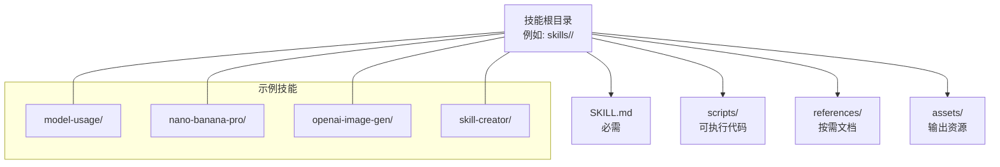
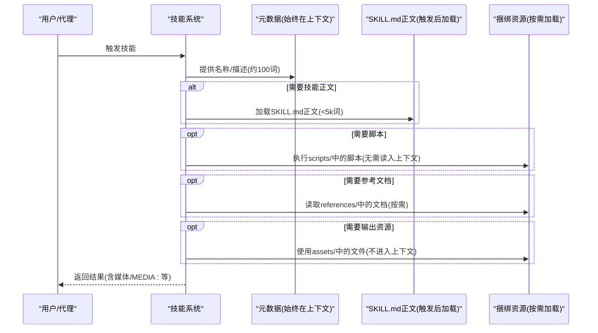
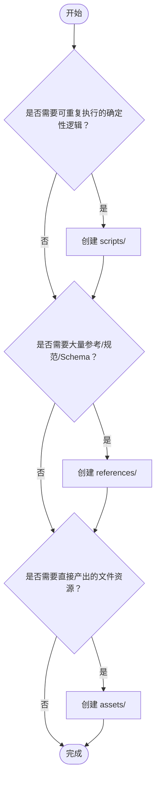
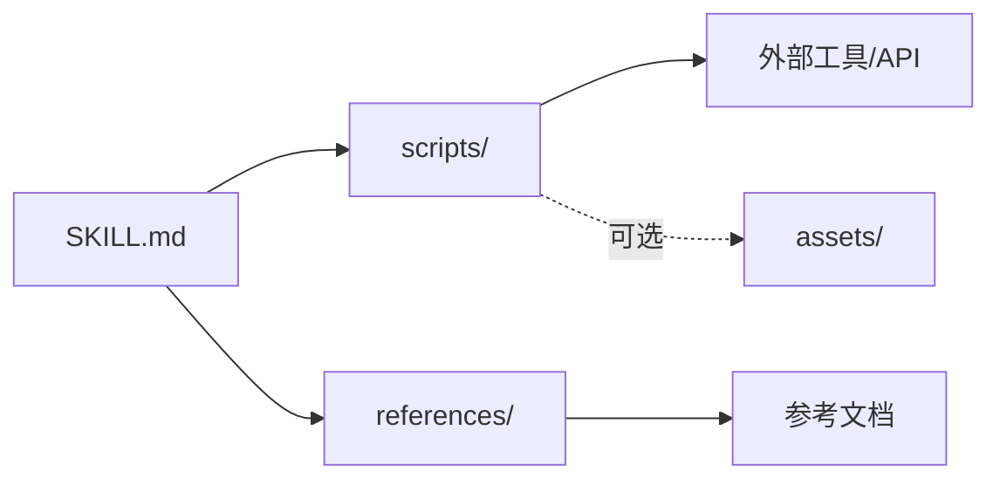

# 捆绑资源组织

<cite>
**本文引用的文件**
- [skills/model-usage/SKILL.md](file://skills/model-usage/SKILL.md)
- [skills/model-usage/scripts/model_usage.py](file://skills/model-usage/scripts/model_usage.py)
- [skills/model-usage/references/codexbar-cli.md](file://skills/model-usage/references/codexbar-cli.md)
- [skills/nano-banana-pro/SKILL.md](file://skills/nano-banana-pro/SKILL.md)
- [skills/nano-banana-pro/scripts/generate_image.py](file://skills/nano-banana-pro/scripts/generate_image.py)
- [skills/openai-image-gen/SKILL.md](file://skills/openai-image-gen/SKILL.md)
- [skills/openai-image-gen/scripts/gen.py](file://skills/openai-image-gen/scripts/gen.py)
- [skills/skill-creator/SKILL.md](file://skills/skill-creator/SKILL.md)
- [skills/skill-creator/scripts/init_skill.py](file://skills/skill-creator/scripts/init_skill.py)
- [skills/tmux/scripts/find-sessions.sh](file://skills/tmux/scripts/find-sessions.sh)
</cite>

## 目录
1. [简介](#简介)
2. [项目结构](#项目结构)
3. [核心组件](#核心组件)
4. [架构总览](#架构总览)
5. [详细组件分析](#详细组件分析)
6. [依赖关系分析](#依赖关系分析)
7. [性能考量](#性能考量)
8. [故障排查指南](#故障排查指南)
9. [结论](#结论)
10. [附录](#附录)

## 简介
本指南面向OpenClaw技能（Skill）的“捆绑资源组织”，聚焦三类资源的用途与最佳实践：
- scripts/：可执行代码（Python/Bash等），强调确定性与可重复使用
- references/：按需加载的文档资料，用于在需要时进入上下文
- assets/：输出使用的文件资源，不进入上下文，直接参与最终产出

我们将结合仓库中的真实技能示例，系统阐述适用场景、文件组织原则、命名约定、按需加载机制与上下文窗口优化策略，并提供资源选择决策树与案例分析。

## 项目结构
OpenClaw采用“技能即包”的组织方式：每个技能是一个独立目录，包含必需的SKILL.md与可选的捆绑资源（scripts/、references/、assets/）。该结构确保技能功能自包含、可分发且易于维护。

图示来源
- [skills/model-usage/SKILL.md](file://skills/model-usage/SKILL.md)
- [skills/nano-banana-pro/SKILL.md](file://skills/nano-banana-pro/SKILL.md)
- [skills/openai-image-gen/SKILL.md](file://skills/openai-image-gen/SKILL.md)
- [skills/skill-creator/SKILL.md](file://skills/skill-creator/SKILL.md)

章节来源
- [skills/model-usage/SKILL.md](file://skills/model-usage/SKILL.md)
- [skills/nano-banana-pro/SKILL.md](file://skills/nano-banana-pro/SKILL.md)
- [skills/openai-image-gen/SKILL.md](file://skills/openai-image-gen/SKILL.md)
- [skills/skill-creator/SKILL.md](file://skills/skill-creator/SKILL.md)

## 核心组件
- scripts/（可执行代码）
  - 适用场景：需要确定性、可重复执行的任务；避免在每次调用中重写相同逻辑
  - 组织原则：单一职责、参数化、健壮错误处理、最小化外部依赖
  - 命名约定：动宾短语或领域动作，如gen.py、find-sessions.sh、generate_image.py
  - 示例：模型用量统计脚本、图像生成脚本、会话查询脚本
- references/（按需文档）
  - 适用场景：API参考、Schema、流程规范、政策与模板等，仅在需要时加载
  - 组织原则：清晰标题、简明索引、避免与SKILL.md重复；长文档建议提供搜索提示
  - 命名约定：语义化文件名，如codexbar-cli.md、configuration.md
  - 示例：CLI快速参考、配置说明、工作流指南
- assets/（输出资源）
  - 适用场景：模板、图标、字体、样本文档等，直接参与最终产物
  - 组织原则：与技能目标强相关；避免冗余；便于复制/修改
  - 命名约定：描述性名称，如logo.png、slides.pptx、frontend-template/
  - 示例：品牌素材、前端模板、字体文件

章节来源
- [skills/skill-creator/SKILL.md](file://skills/skill-creator/SKILL.md)
- [skills/model-usage/references/codexbar-cli.md](file://skills/model-usage/references/codexbar-cli.md)
- [skills/tmux/scripts/find-sessions.sh](file://skills/tmux/scripts/find-sessions.sh)

## 架构总览
OpenClaw的技能资源加载遵循“渐进披露”设计：优先以元数据（名称+描述）进入上下文，触发后再按需加载SKILL.md正文与捆绑资源。scripts/可在无需读入上下文的情况下执行，从而显著节省token。

图示来源
- [skills/skill-creator/SKILL.md](file://skills/skill-creator/SKILL.md)

## 详细组件分析

### 资源类型与最佳实践详解
- scripts/
  - 可执行性：支持Python/Bash等，具备命令行接口与参数解析
  - 错误处理：对外部工具缺失、网络请求失败、输入格式异常进行明确报错
  - 环境适配：通过环境变量或显式参数注入密钥、路径等
  - 示例要点：
    - 模型用量统计：自动发现本地成本日志、聚合按模型费用、支持当前模型与全量模式
    - 图像生成：统一API密钥来源、分辨率与宽高比推断、批量生成与画廊输出
    - tmux会话查询：多socket扫描、过滤与格式化输出
- references/
  - 结构化内容：提供CLI命令速查、字段定义、注意事项等
  - 与SKILL.md互补：避免重复，SKILL.md保留核心流程，细节下沉至references
  - 示例要点：成本JSON字段说明、安装指引、使用限制
- assets/
  - 直接产出：模板、图标、字体、样本文档等
  - 不进入上下文：减少token占用，提升响应效率
  - 示例要点：品牌素材、前端模板目录、字体文件

章节来源
- [skills/model-usage/scripts/model_usage.py](file://skills/model-usage/scripts/model_usage.py)
- [skills/nano-banana-pro/scripts/generate_image.py](file://skills/nano-banana-pro/scripts/generate_image.py)
- [skills/openai-image-gen/scripts/gen.py](file://skills/openai-image-gen/scripts/gen.py)
- [skills/model-usage/references/codexbar-cli.md](file://skills/model-usage/references/codexbar-cli.md)
- [skills/tmux/scripts/find-sessions.sh](file://skills/tmux/scripts/find-sessions.sh)

### 资源选择决策树
以下决策树帮助你在创建技能时决定是否添加某类资源以及如何组织：

图示来源
- [skills/skill-creator/SKILL.md](file://skills/skill-creator/SKILL.md)

### 实际案例分析

#### 案例一：模型用量统计（model-usage）
- 适用场景：从本地成本日志汇总按模型的消费情况，支持当前模型与全量模式
- 资源组织：
  - scripts/model_usage.py：参数化脚本，支持stdin、文件输入与默认调用本地CLI
  - references/codexbar-cli.md：CLI命令与JSON字段说明
  - SKILL.md：触发条件、运行示例、输入输出说明
- 上下文窗口优化：
  - SKILL.md正文简洁，核心逻辑下沉到脚本
  - 参考文档仅在需要时按需加载
- 关键点：
  - 自动识别最新模型与最近日期
  - 支持按天过滤与多种输出格式

章节来源
- [skills/model-usage/SKILL.md](file://skills/model-usage/SKILL.md)
- [skills/model-usage/scripts/model_usage.py](file://skills/model-usage/scripts/model_usage.py)
- [skills/model-usage/references/codexbar-cli.md](file://skills/model-usage/references/codexbar-cli.md)

#### 案例二：图像生成（nano-banana-pro）
- 适用场景：通过Google Gemini 3 Pro Image批量生成或编辑图片
- 资源组织：
  - scripts/generate_image.py：统一API密钥来源、分辨率与宽高比推断、批量输入与输出
  - SKILL.md：运行示例、参数说明、注意事项
- 上下文窗口优化：
  - 通过脚本执行避免在上下文中携带大段实现细节
  - 输出包含MEDIA:标记以便自动附加
- 关键点：
  - 输入图片数量上限与自动分辨率推断
  - 多种输出格式与风格控制

章节来源
- [skills/nano-banana-pro/SKILL.md](file://skills/nano-banana-pro/SKILL.md)
- [skills/nano-banana-pro/scripts/generate_image.py](file://skills/nano-banana-pro/scripts/generate_image.py)

#### 案例三：批量图像生成（openai-image-gen）
- 适用场景：OpenAI Images API批量生成，输出画廊与映射文件
- 资源组织：
  - scripts/gen.py：随机提示生成、模型参数归一化、输出目录与画廊生成
  - SKILL.md：运行示例、模型差异与参数说明
- 上下文窗口优化：
  - 脚本执行无需读入上下文，长文档放入references或SKILL.md的链接
- 关键点：
  - 模型特定参数校验与默认值
  - 输出目录时间戳命名与HTML画廊

章节来源
- [skills/openai-image-gen/SKILL.md](file://skills/openai-image-gen/SKILL.md)
- [skills/openai-image-gen/scripts/gen.py](file://skills/openai-image-gen/scripts/gen.py)

#### 案例四：技能初始化（skill-creator）
- 适用场景：标准化创建新技能，生成模板与资源目录
- 资源组织：
  - scripts/init_skill.py：根据参数创建SKILL.md与scripts/references/assets目录
  - SKILL.md：技能设计原则、渐进披露、命名规范、打包流程
- 关键点：
  - 资源目录按需创建，避免冗余
  - 强调“只包含与任务直接相关的必要信息”

章节来源
- [skills/skill-creator/SKILL.md](file://skills/skill-creator/SKILL.md)
- [skills/skill-creator/scripts/init_skill.py](file://skills/skill-creator/scripts/init_skill.py)

#### 案例五：tmux会话查询（tmux）
- 适用场景：跨socket扫描并列出会话，支持过滤与多环境
- 资源组织：
  - scripts/find-sessions.sh：多socket扫描、查询过滤、错误处理
- 关键点：
  - 环境变量驱动socket目录
  - 参数化socket名称/路径与查询字符串

章节来源
- [skills/tmux/scripts/find-sessions.sh](file://skills/tmux/scripts/find-sessions.sh)

## 依赖关系分析
- 技能内部依赖
  - SKILL.md作为入口与导航，引用scripts/与references/中的具体实现与文档
  - scripts/通常依赖外部工具或API（如codexbar、OpenAI、Google GenAI），需在环境准备阶段满足依赖
- 资源间耦合
  - scripts/与references/存在“文档驱动的实现”关系：脚本参数与行为由参考文档约束
  - assets/与scripts/可能形成“模板+生成”的协作关系（如前端模板与生成脚本）

图示来源
- [skills/model-usage/SKILL.md](file://skills/model-usage/SKILL.md)
- [skills/nano-banana-pro/SKILL.md](file://skills/nano-banana-pro/SKILL.md)
- [skills/openai-image-gen/SKILL.md](file://skills/openai-image-gen/SKILL.md)
- [skills/skill-creator/SKILL.md](file://skills/skill-creator/SKILL.md)

## 性能考量
- 上下文窗口优化
  - 元数据（名称+描述）常驻，SKILL.md正文触发后加载，捆绑资源按需加载
  - scripts/可直接执行，无需读入上下文，显著降低token消耗
- I/O与执行效率
  - 将大文档拆分为references/，避免一次性加载
  - 脚本内进行参数校验与早失败，减少无效调用
- 输出与缓存
  - 生成结果尽量复用中间文件，避免重复计算
  - 对于可复用的静态资源，放入assets/以减少上下文传输

## 故障排查指南
- 依赖缺失
  - 外部工具未安装：检查SKILL.md中的安装指引与metadata中的依赖声明
  - 环境变量未设置：确认API密钥、路径等是否正确注入
- 输入格式问题
  - JSON解析失败：核对输入来源与格式，必要时在SKILL.md中提供示例
  - 参数非法：脚本通常提供明确错误信息，按提示修正
- 资源访问问题
  - references/文档未被加载：确认触发条件与引用链接
  - assets/文件未找到：检查相对路径与打包后的资源定位

章节来源
- [skills/model-usage/SKILL.md](file://skills/model-usage/SKILL.md)
- [skills/nano-banana-pro/SKILL.md](file://skills/nano-banana-pro/SKILL.md)
- [skills/openai-image-gen/SKILL.md](file://skills/openai-image-gen/SKILL.md)
- [skills/model-usage/scripts/model_usage.py](file://skills/model-usage/scripts/model_usage.py)
- [skills/nano-banana-pro/scripts/generate_image.py](file://skills/nano-banana-pro/scripts/generate_image.py)
- [skills/openai-image-gen/scripts/gen.py](file://skills/openai-image-gen/scripts/gen.py)

## 结论
通过将技能资源划分为scripts/、references/、assets/三类，并遵循“渐进披露”与“按需加载”，OpenClaw实现了高效、可维护、可扩展的技能体系。scripts/承担确定性执行，references/承载按需知识，assets/支撑最终产出。配合清晰的命名约定与组织原则，开发者可以快速构建高质量的Agent技能包。

## 附录

### 文件组织与命名约定清单
- scripts/
  - 动宾短语命名，如gen.py、find-sessions.sh、generate_image.py
  - 明确入口与参数，提供错误提示
- references/
  - 语义化文件名，如codexbar-cli.md、configuration.md
  - 避免与SKILL.md重复，提供索引与搜索提示
- assets/
  - 描述性命名，如logo.png、slides.pptx、frontend-template/
  - 与技能目标强相关，避免冗余

### 按需加载机制与上下文窗口优化策略
- 渐进披露三层结构：元数据（始终）、SKILL.md正文（触发后）、捆绑资源（按需）
- scripts/执行无需读入上下文，适合复杂逻辑与外部集成
- references/仅在需要时加载，保持SKILL.md正文简洁
- assets/直接参与输出，不进入上下文，减少token占用

章节来源
- [skills/skill-creator/SKILL.md](file://skills/skill-creator/SKILL.md)