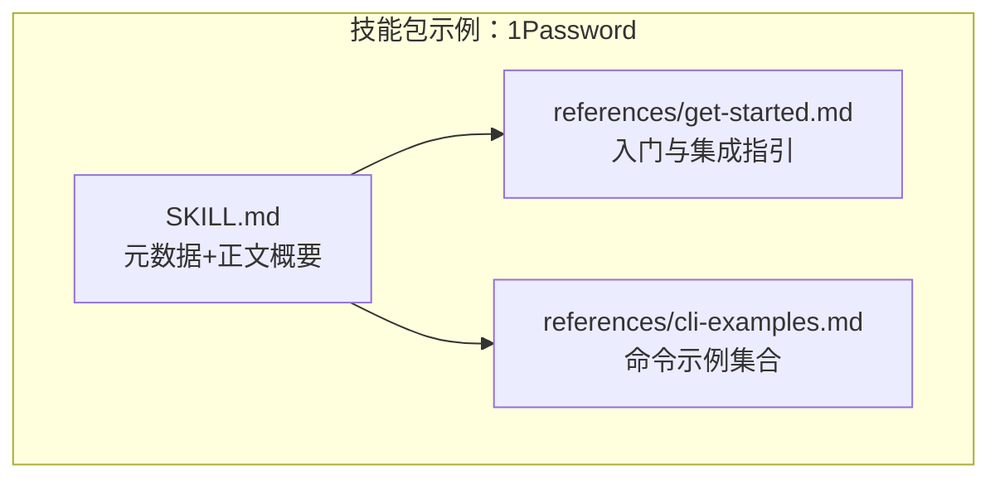
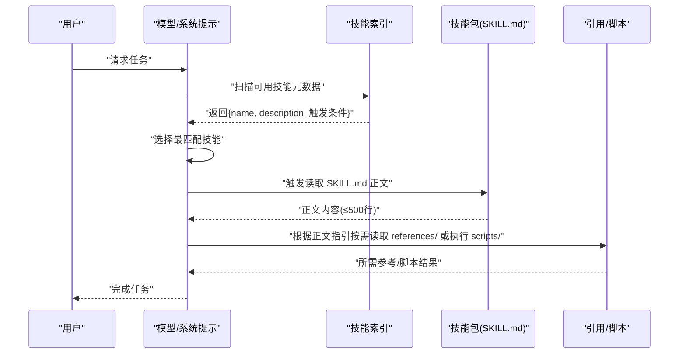
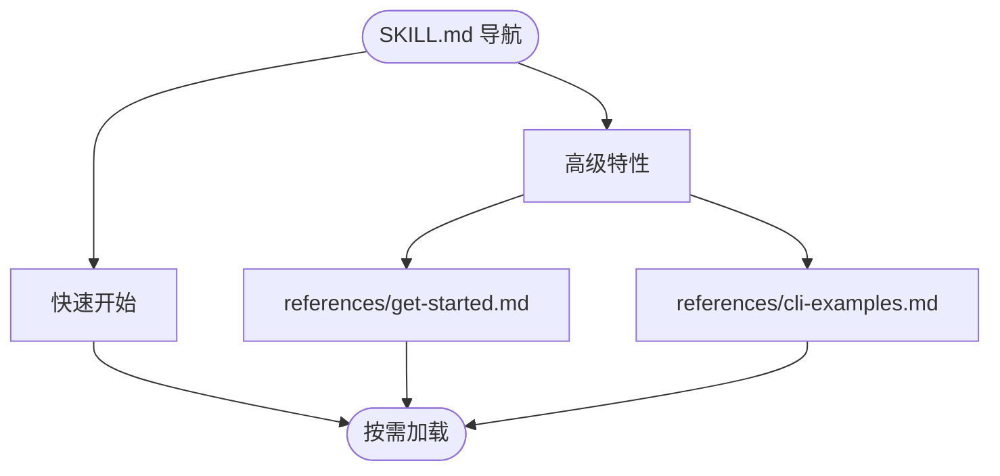
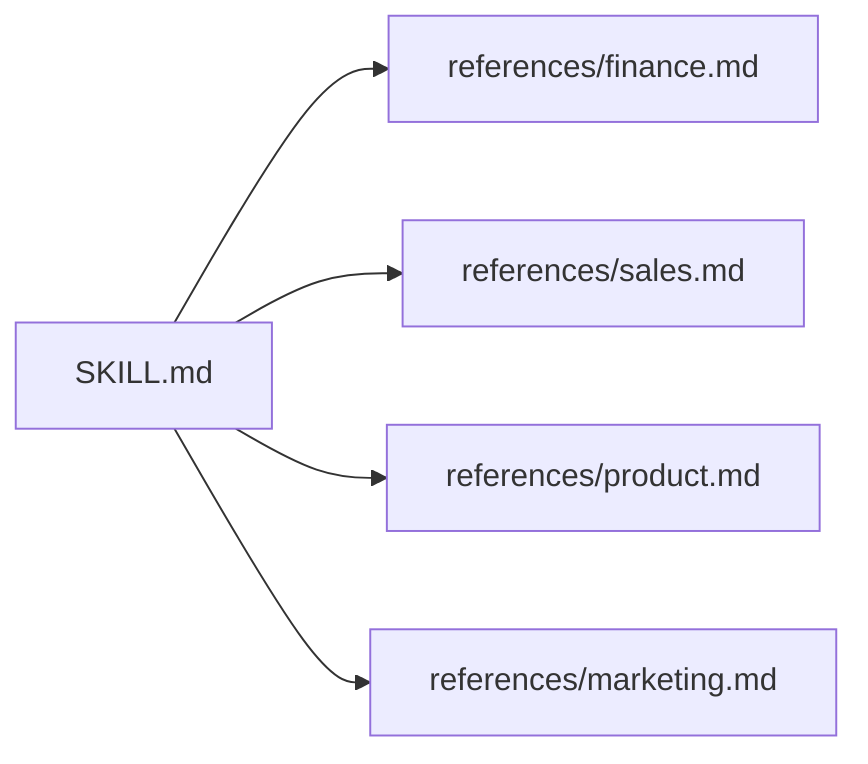
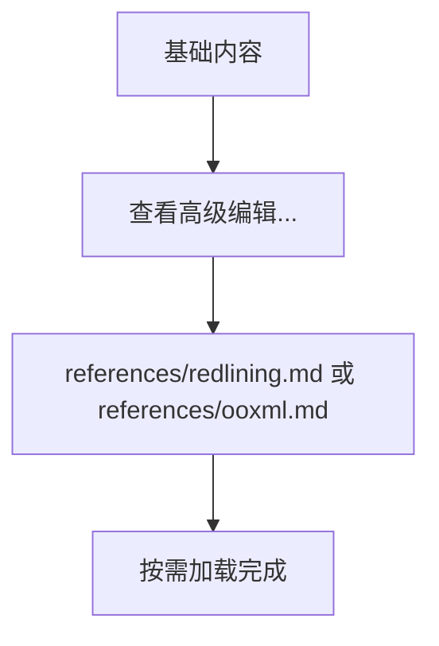
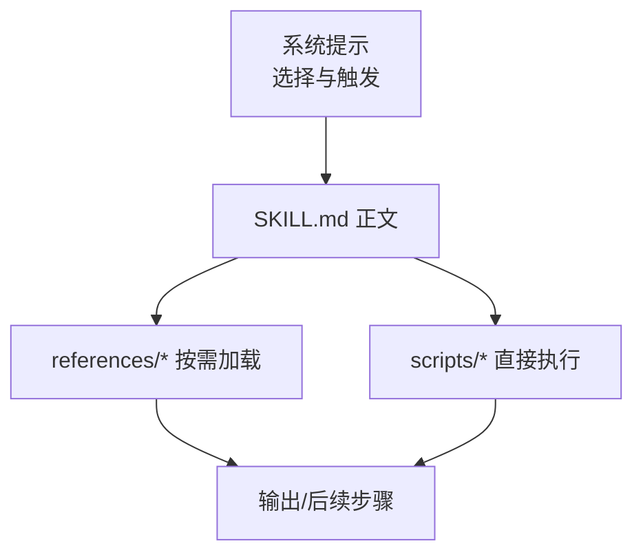

# 渐进式披露模式

<cite>
**本文档引用的文件**
- [skills/skill-creator/SKILL.md](file://skills/skill-creator/SKILL.md)
- [src/agents/system-prompt.ts](file://src/agents/system-prompt.ts)
- [skills/1password/SKILL.md](file://skills/1password/SKILL.md)
- [skills/1password/references/get-started.md](file://skills/1password/references/get-started.md)
- [skills/1password/references/cli-examples.md](file://skills/1password/references/cli-examples.md)
- [skills/discord/SKILL.md](file://skills/discord/SKILL.md)
- [skills/github/SKILL.md](file://skills/github/SKILL.md)
- [skills/model-usage/SKILL.md](file://skills/model-usage/SKILL.md)
- [skills/nano-pdf/SKILL.md](file://skills/nano-pdf/SKILL.md)
- [skills/tmux/SKILL.md](file://skills/tmux/SKILL.md)
- [src/agents/skills.e2e-test-helpers.ts](file://src/agents/skills.e2e-test-helpers.ts)
- [src/agents/skills.e2e-test-helpers.test.ts](file://src/agents/skills.e2e-test-helpers.test.ts)
- [skills/skill-creator/scripts/quick_validate.py](file://skills/skill-creator/scripts/quick_validate.py)
- [skills/skill-creator/scripts/test_quick_validate.py](file://skills/skill-creator/scripts/test_quick_validate.py)
</cite>

## 目录
1. [引言](#引言)
2. [项目结构](#项目结构)
3. [核心组件](#核心组件)
4. [架构总览](#架构总览)
5. [详细组件分析](#详细组件分析)
6. [依赖关系分析](#依赖关系分析)
7. [性能考量](#性能考量)
8. [故障排查指南](#故障排查指南)
9. [结论](#结论)
10. [附录](#附录)

## 引言
本设计指南围绕 OpenClaw 技能的“渐进式披露”模式展开，目标是通过三层次加载系统与三种设计模式，实现“元数据始终在上下文、SKILL.md 正文按触发加载、捆绑资源按需加载”的高效知识交付。该模式确保模型在需要时才读取更详细的资料，从而最大化上下文窗口利用率，并降低无关信息对推理路径的干扰。

## 项目结构
OpenClaw 的技能以“技能包”形式组织，每个技能包含一个必需的 SKILL.md 文件与可选的捆绑资源（scripts/、references/、assets/）。技能包内的引用组织遵循“浅平化、导航清晰、按需加载”的原则，避免深层嵌套与冗余上下文。

图表来源
- [skills/1password/SKILL.md:1-71](file://skills/1password/SKILL.md#L1-L71)
- [skills/1password/references/get-started.md:1-18](file://skills/1password/references/get-started.md#L1-L18)
- [skills/1password/references/cli-examples.md:1-30](file://skills/1password/references/cli-examples.md#L1-L30)

章节来源
- [skills/1password/SKILL.md:1-71](file://skills/1password/SKILL.md#L1-L71)
- [skills/1password/references/get-started.md:1-18](file://skills/1password/references/get-started.md#L1-L18)
- [skills/1password/references/cli-examples.md:1-30](file://skills/1password/references/cli-examples.md#L1-L30)

## 核心组件
- 元数据（name + description）：始终在上下文中，用于快速筛选与匹配技能触发条件。系统提示会引导模型在多个候选技能中选择最合适的那个再加载其正文。
- SKILL.md 正文：仅在技能被选中后加载，建议控制在 500 行以内，避免上下文膨胀。
- 捆绑资源（scripts/、references/、assets/）：scripts 可直接执行无需加载到上下文；references 作为参考材料按需加载；assets 用于输出而非上下文。

章节来源
- [skills/skill-creator/SKILL.md:113-120](file://skills/skill-creator/SKILL.md#L113-L120)
- [src/agents/system-prompt.ts:20-36](file://src/agents/system-prompt.ts#L20-L36)

## 架构总览
下图展示了从用户请求到技能正文与资源加载的端到端流程，体现“先元数据筛选、再正文触发、最后资源按需”的渐进式披露。

图表来源
- [src/agents/system-prompt.ts:20-36](file://src/agents/system-prompt.ts#L20-L36)
- [skills/skill-creator/SKILL.md:113-120](file://skills/skill-creator/SKILL.md#L113-L120)

## 详细组件分析

### 三层次加载系统
- 元数据（name + description）：始终在上下文中，用于技能匹配与选择。
- SKILL.md 正文：仅当模型判定适用时才加载，正文长度建议不超过 500 行。
- 捆绑资源：scripts 可直接执行；references 仅在正文指引下按需加载；assets 用于最终输出。

章节来源
- [skills/skill-creator/SKILL.md:113-120](file://skills/skill-creator/SKILL.md#L113-L120)
- [skills/skill-creator/SKILL.md:121-125](file://skills/skill-creator/SKILL.md#L121-L125)

### 设计模式一：高层指南与引用结合
- 在 SKILL.md 中提供“快速开始”和“高级特性”的导航，将具体细节放入 references/ 子文件，仅在需要时加载。
- 示例：1Password 技能在 SKILL.md 中列出 references/ 下的入门与命令示例链接，正文不堆砌细节。

图表来源
- [skills/1password/SKILL.md:29-33](file://skills/1password/SKILL.md#L29-L33)
- [skills/1password/references/get-started.md:1-18](file://skills/1password/references/get-started.md#L1-L18)
- [skills/1password/references/cli-examples.md:1-30](file://skills/1password/references/cli-examples.md#L1-L30)

章节来源
- [skills/1password/SKILL.md:29-33](file://skills/1password/SKILL.md#L29-L33)
- [skills/1password/references/get-started.md:1-18](file://skills/1password/references/get-started.md#L1-L18)
- [skills/1password/references/cli-examples.md:1-30](file://skills/1password/references/cli-examples.md#L1-L30)

### 设计模式二：领域特定组织
- 将多领域或多种变体的内容按域/变体划分到 references/ 子目录，避免无关上下文进入。
- 示例：多域组织（finance/sales/product/marketing），或多提供商组织（aws/gcp/azure）。

图表来源
- [skills/skill-creator/SKILL.md:146-174](file://skills/skill-creator/SKILL.md#L146-L174)

章节来源
- [skills/skill-creator/SKILL.md:146-174](file://skills/skill-creator/SKILL.md#L146-L174)

### 设计模式三：条件详情展示
- 基础内容在 SKILL.md，针对特定场景提供“点击查看详情”的链接，仅在需要时加载对应文件。
- 示例：基础编辑与高级编辑分别指向不同参考文件。

图表来源
- [skills/skill-creator/SKILL.md:175-194](file://skills/skill-creator/SKILL.md#L175-L194)

章节来源
- [skills/skill-creator/SKILL.md:175-194](file://skills/skill-creator/SKILL.md#L175-L194)

### 内容长度限制与文件分割策略
- SKILL.md 正文建议不超过 500 行，接近阈值时应拆分为 references/ 子文件并在 SKILL.md 中明确指引何时阅读。
- 对于较长参考文件（如超过 100 行），建议在顶部提供目录以便预览全貌。

章节来源
- [skills/skill-creator/SKILL.md:121-125](file://skills/skill-creator/SKILL.md#L121-L125)
- [skills/skill-creator/SKILL.md:198-200](file://skills/skill-creator/SKILL.md#L198-L200)

### 引用组织最佳实践
- 避免深层嵌套引用：所有引用文件应直接从 SKILL.md 引用，保持一层深度。
- 结构化长文件：对超过 100 行的参考文件，在顶部提供目录，便于模型预览与选择。
- 明确触发时机：在 SKILL.md 中清晰说明何时阅读某份参考文件，提升模型决策效率。

章节来源
- [skills/skill-creator/SKILL.md:198-200](file://skills/skill-creator/SKILL.md#L198-L200)

### 元数据与触发机制
- 元数据（name + description）由系统提示用于技能筛选与选择，随后才触发正文加载。
- 系统提示约束每次仅加载一个技能的正文，避免上下文碎片化。

章节来源
- [src/agents/system-prompt.ts:20-36](file://src/agents/system-prompt.ts#L20-L36)

### 技能包样例与资源组织
- 1Password 技能：在 SKILL.md 中提供 references/ 引用，并给出 tmux 使用的必要性与安全守则。
- Discord/GitHub 技能：在 SKILL.md 中给出使用指南、注意事项与示例，正文长度均在合理范围内。
- model-usage 技能：通过 references/ 提供 CLI 字段说明，正文聚焦使用方式与脚本调用。
- nano-pdf/tmux 技能：正文简洁，示例驱动，减少上下文负担。

章节来源
- [skills/1password/SKILL.md:1-71](file://skills/1password/SKILL.md#L1-L71)
- [skills/discord/SKILL.md:1-198](file://skills/discord/SKILL.md#L1-L198)
- [skills/github/SKILL.md:1-164](file://skills/github/SKILL.md#L1-L164)
- [skills/model-usage/SKILL.md:1-70](file://skills/model-usage/SKILL.md#L1-L70)
- [skills/nano-pdf/SKILL.md:1-39](file://skills/nano-pdf/SKILL.md#L1-L39)
- [skills/tmux/SKILL.md:1-154](file://skills/tmux/SKILL.md#L1-L154)

## 依赖关系分析
- 技能正文加载依赖于系统提示中的“选择与触发”逻辑，确保只加载一个技能的正文。
- 引用文件的加载依赖于 SKILL.md 中的明确指引，避免模型自行猜测加载顺序。
- 脚本资源可直接执行，不占用上下文窗口，适合重复性与确定性任务。

图表来源
- [src/agents/system-prompt.ts:20-36](file://src/agents/system-prompt.ts#L20-L36)
- [skills/skill-creator/SKILL.md:113-120](file://skills/skill-creator/SKILL.md#L113-L120)

章节来源
- [src/agents/system-prompt.ts:20-36](file://src/agents/system-prompt.ts#L20-L36)
- [skills/skill-creator/SKILL.md:113-120](file://skills/skill-creator/SKILL.md#L113-L120)

## 性能考量
- 控制 SKILL.md 正文长度，避免超过 500 行，减少上下文开销。
- 将复杂细节移至 references/，仅在需要时加载，降低无关信息对推理的影响。
- 使用 scripts/ 执行重复性任务，减少上下文占用。
- 通过明确的引用指引，帮助模型快速定位所需信息，缩短决策链路。

## 故障排查指南
- 验证 SKILL.md 前言格式与字段：name、description 必须存在且符合规范；其他字段不在允许列表内会导致校验失败。
- 名称与描述长度限制：名称最长 64 字符，仅允许小写字母、数字与连字符；描述最长 1024 字符，不得包含尖括号。
- 引用文件加载失败：检查 SKILL.md 中的引用路径是否正确，避免深层嵌套与相对路径越界。
- 正文过长：若正文接近 500 行，应拆分至 references/ 并在 SKILL.md 中明确何时阅读。

章节来源
- [skills/skill-creator/scripts/quick_validate.py:67-149](file://skills/skill-creator/scripts/quick_validate.py#L67-L149)
- [skills/skill-creator/scripts/test_quick_validate.py:1-72](file://skills/skill-creator/scripts/test_quick_validate.py#L1-L72)
- [skills/skill-creator/SKILL.md:121-125](file://skills/skill-creator/SKILL.md#L121-L125)
- [skills/skill-creator/SKILL.md:198-200](file://skills/skill-creator/SKILL.md#L198-L200)

## 结论
通过三层次加载系统与三种渐进式披露设计模式，OpenClaw 技能能够在保证功能完整性的同时，最大化上下文窗口的利用效率。遵循本文档的组织原则与最佳实践，可显著提升模型在复杂任务中的决策质量与执行稳定性。

## 附录
- 示例技能包结构与引用组织可参考 1Password、Discord、GitHub、model-usage、nano-pdf、tmux 等技能的实际实现。
- 端到端测试辅助工具可用于生成与校验技能包，确保 frontmatter 与正文结构符合预期。

章节来源
- [src/agents/skills.e2e-test-helpers.ts:1-30](file://src/agents/skills.e2e-test-helpers.ts#L1-L30)
- [src/agents/skills.e2e-test-helpers.test.ts:41-76](file://src/agents/skills.e2e-test-helpers.test.ts#L41-L76)