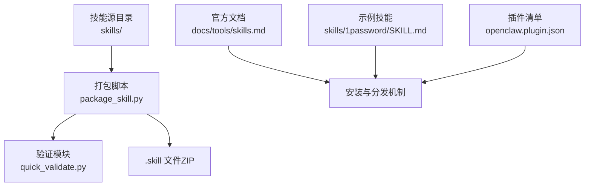
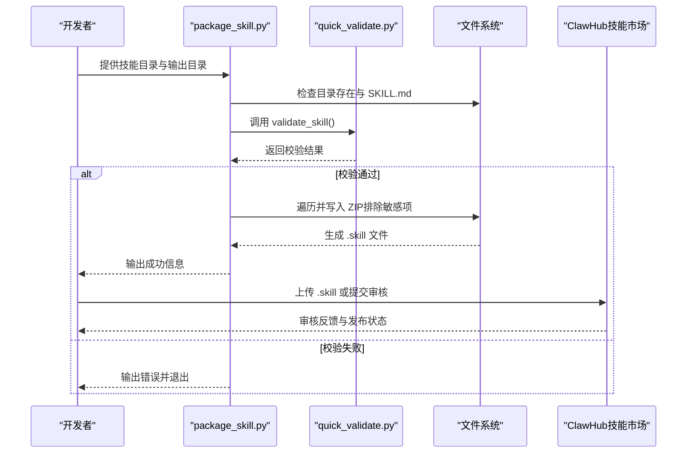
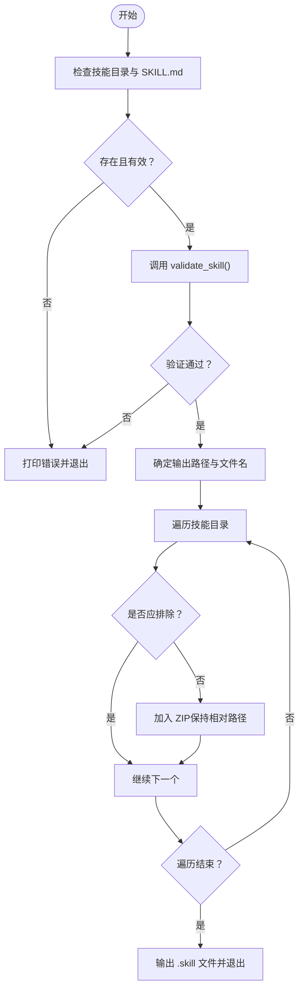
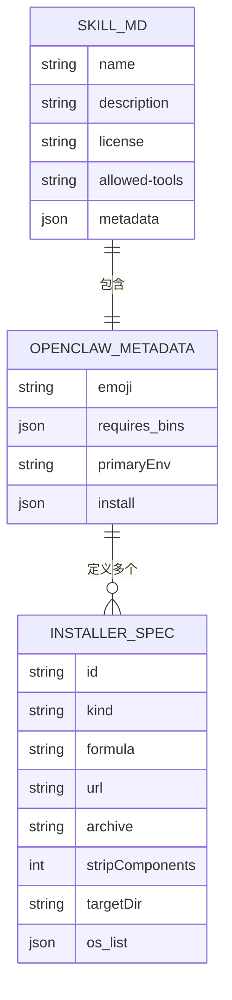
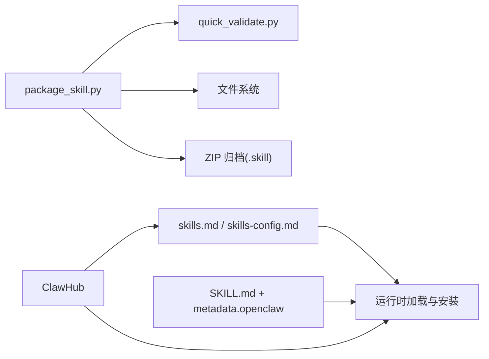
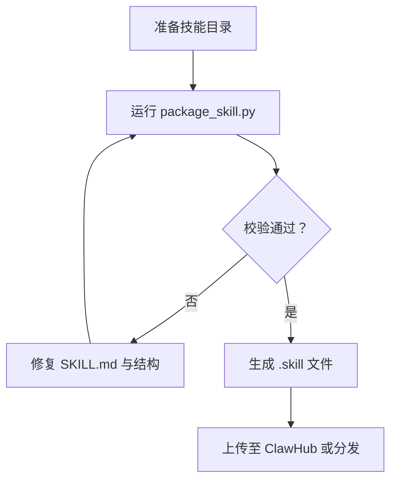

# 技能部署与发布

<cite>
**本文引用的文件**
- [package_skill.py](file://skills/skill-creator/scripts/package_skill.py)
- [quick_validate.py](file://skills/skill-creator/scripts/quick_validate.py)
- [test_package_skill.py](file://skills/skill-creator/scripts/test_package_skill.py)
- [SKILL.md（技能创建器）](file://skills/skill-creator/SKILL.md)
- [SKILL.md（示例：1Password）](file://skills/1password/SKILL.md)
- [skills.md（官方文档）](file://docs/tools/skills.md)
- [skills-config.md（官方文档）](file://docs/tools/skills-config.md)
- [openclaw.plugin.json（示例：Lobster 插件）](file://extensions/lobster/openclaw.plugin.json)
</cite>

## 目录
1. [简介](#简介)
2. [项目结构](#项目结构)
3. [核心组件](#核心组件)
4. [架构总览](#架构总览)
5. [详细组件分析](#详细组件分析)
6. [依赖关系分析](#依赖关系分析)
7. [性能考量](#性能考量)
8. [故障排查指南](#故障排查指南)
9. [结论](#结论)
10. [附录](#附录)

## 简介
本指南面向技能开发者，提供从开发完成到用户使用的完整“OpenClaw 技能部署与发布”流程说明。内容覆盖：
- 技能打包脚本 package_skill.py 的使用方法与参数
- 打包前后的验证步骤与安全限制
- 输出文件 .skill 的生成与结构
- 技能分发与安装机制（含元数据、版本控制、安装器）
- 发布最佳实践（命名、描述、分类标签）
- 更新与维护（版本升级、向后兼容、废弃处理）
- 技能市场提交与审核要点
- 从开发到上线的端到端流程

## 项目结构
围绕技能打包与发布的相关文件主要位于以下位置：
- 技能打包与验证脚本：skills/skill-creator/scripts/
- 技能模板与流程说明：skills/skill-creator/SKILL.md
- 官方技能使用与安装说明：docs/tools/skills.md、docs/tools/skills-config.md
- 示例技能与插件：skills/...、extensions/...

**图表来源**
- [package_skill.py:1-140](file://skills/skill-creator/scripts/package_skill.py#L1-L140)
- [quick_validate.py:1-160](file://skills/skill-creator/scripts/quick_validate.py#L1-L160)
- [skills.md:1-303](file://docs/tools/skills.md#L1-L303)
- [SKILL.md（示例：1Password）:1-71](file://skills/1password/SKILL.md#L1-L71)
- [openclaw.plugin.json:1-11](file://extensions/lobster/openclaw.plugin.json#L1-L11)

**章节来源**
- [package_skill.py:1-140](file://skills/skill-creator/scripts/package_skill.py#L1-L140)
- [quick_validate.py:1-160](file://skills/skill-creator/scripts/quick_validate.py#L1-L160)
- [SKILL.md（技能创建器）:335-362](file://skills/skill-creator/SKILL.md#L335-L362)
- [skills.md:50-68](file://docs/tools/skills.md#L50-L68)

## 核心组件
- 打包脚本 package_skill.py
  - 功能：将技能目录打包为 .skill 文件（ZIP），内置安全校验与排除规则
  - 输入：技能目录路径、可选输出目录
  - 输出：.skill 文件（与技能同名）
- 验证模块 quick_validate.py
  - 功能：对 SKILL.md 进行最小化但关键的格式与字段校验
  - 覆盖：必需字段、命名规范、描述长度与字符限制等
- 测试用例 test_package_skill.py
  - 功能：回归测试打包的安全行为（如跳过符号链接、拒绝越界路径等）

**章节来源**
- [package_skill.py:28-112](file://skills/skill-creator/scripts/package_skill.py#L28-L112)
- [quick_validate.py:67-149](file://skills/skill-creator/scripts/quick_validate.py#L67-L149)
- [test_package_skill.py:50-157](file://skills/skill-creator/scripts/test_package_skill.py#L50-L157)

## 架构总览
下图展示技能从开发到分发的核心流程与交互点。

**图表来源**
- [package_skill.py:56-112](file://skills/skill-creator/scripts/package_skill.py#L56-L112)
- [quick_validate.py:67-149](file://skills/skill-creator/scripts/quick_validate.py#L67-L149)
- [skills.md:50-68](file://docs/tools/skills.md#L50-L68)

## 详细组件分析

### 组件一：打包脚本 package_skill.py
- 主要职责
  - 校验输入目录与 SKILL.md 存在性
  - 调用验证模块进行前置检查
  - 安全地遍历目录，排除隐藏/缓存/版本控制目录与符号链接
  - 将技能目录压缩为 .skill 文件（ZIP），保持相对路径结构
- 关键行为
  - 安全限制：拒绝符号链接；禁止打包越出技能根目录的文件；避免将输出文件自身写入归档
  - 排除列表：.git、.svn、.hg、__pycache__、node_modules
  - 输出命名：以技能名命名 .skill 文件
- 使用方式
  - 基本用法：指定技能目录
  - 指定输出目录：可选参数
- 错误处理
  - 目录不存在或非目录、缺少 SKILL.md、验证失败、打包异常等均会打印错误并退出非零码

**图表来源**
- [package_skill.py:28-112](file://skills/skill-creator/scripts/package_skill.py#L28-L112)

**章节来源**
- [package_skill.py:28-112](file://skills/skill-creator/scripts/package_skill.py#L28-L112)
- [package_skill.py:114-140](file://skills/skill-creator/scripts/package_skill.py#L114-L140)

### 组件二：验证模块 quick_validate.py
- 校验范围
  - 必需字段：name、description
  - 字段类型：name、description 必须为字符串
  - 命名规范：仅允许小写字母、数字与连字符，长度不超过 64，不可开头/结尾或包含连续连字符
  - 描述规范：不可包含尖括号，长度不超过 1024
  - 允许的 frontmatter 键：name、description、license、allowed-tools、metadata
- 备注
  - 若未安装 PyYAML，则采用简化解析器，但仍要求单行 frontmatter 键值格式
  - 该模块被打包脚本直接调用，确保发布前质量门槛

**章节来源**
- [quick_validate.py:67-149](file://skills/skill-creator/scripts/quick_validate.py#L67-L149)

### 组件三：测试用例 test_package_skill.py
- 测试目标
  - 正常文件打包：确认 .skill 包含预期文件
  - 符号链接处理：跳过外部符号链接与目录链接
  - 路径逃逸检测：当解析路径越出技能根时拒绝打包
  - 自输出保护：若输出目录为技能目录，避免将 .skill 写入归档自身
- 方法论
  - 使用临时目录模拟技能结构
  - 通过 mock 与 patch 控制内部行为（如 _is_within）

**章节来源**
- [test_package_skill.py:50-157](file://skills/skill-creator/scripts/test_package_skill.py#L50-L157)

### 组件四：技能元数据与安装机制
- 元数据位置与作用
  - SKILL.md frontmatter：name、description 等基础信息
  - metadata.openclaw：用于运行期筛选与安装器配置
- 安装器类型
  - brew、node（npm/pnpm/yarn/bun）、go、download（tar.gz/tar.bz2/zip）
  - 可按平台过滤（darwin/linux/win32）
- 示例参考
  - 1Password 技能：定义 emoji、requires.bins、install 列表
  - 插件清单 openclaw.plugin.json：声明插件 ID、名称、描述与配置模式

**图表来源**
- [SKILL.md（示例：1Password）:5-22](file://skills/1password/SKILL.md#L5-L22)
- [skills.md:106-185](file://docs/tools/skills.md#L106-L185)
- [openclaw.plugin.json:1-11](file://extensions/lobster/openclaw.plugin.json#L1-L11)

**章节来源**
- [SKILL.md（示例：1Password）:1-71](file://skills/1password/SKILL.md#L1-L71)
- [skills.md:106-185](file://docs/tools/skills.md#L106-L185)
- [openclaw.plugin.json:1-11](file://extensions/lobster/openclaw.plugin.json#L1-L11)

### 组件五：技能分发与安装（ClawHub）
- 分发渠道
  - ClawHub 是公开技能注册表，支持浏览、安装、更新与同步
- 常见操作
  - 安装：clawhub install <skill-slug>
  - 更新：clawhub update --all
  - 同步：clawhub sync --all
- 安装位置
  - 默认安装到当前工作目录下的 ./skills 或配置的工作区
  - OpenClaw 将其识别为 <workspace>/skills 并参与优先级与热重载

**章节来源**
- [skills.md:50-68](file://docs/tools/skills.md#L50-L68)

## 依赖关系分析
- 打包脚本依赖验证模块进行前置校验
- 打包脚本与测试用例共同保障安全边界（符号链接、路径逃逸、自输出保护）
- 官方文档定义了技能格式、元数据与安装器规范，作为发布与消费的契约

**图表来源**
- [package_skill.py:17-112](file://skills/skill-creator/scripts/package_skill.py#L17-L112)
- [quick_validate.py:67-149](file://skills/skill-creator/scripts/quick_validate.py#L67-L149)
- [skills.md:50-185](file://docs/tools/skills.md#L50-L185)

**章节来源**
- [package_skill.py:17-112](file://skills/skill-creator/scripts/package_skill.py#L17-L112)
- [quick_validate.py:67-149](file://skills/skill-creator/scripts/quick_validate.py#L67-L149)
- [skills.md:50-185](file://docs/tools/skills.md#L50-L185)

## 性能考量
- 打包体积与传输效率
  - .skill 为 ZIP 压缩，建议在技能中排除不必要的大文件或缓存目录（脚本已内置排除）
- 运行期加载成本
  - 运行时仅加载匹配的技能元数据与必要资源，避免上下文窗口膨胀
- 安装器选择
  - 优先 brew（可配置 preferBrew），减少网络与编译开销

[本节为通用建议，不直接分析具体文件]

## 故障排查指南
- 常见错误与定位
  - 缺少 SKILL.md：检查技能根目录是否存在并命名正确
  - 前置校验失败：检查 frontmatter 字段、命名与描述长度限制
  - 打包失败：查看是否包含符号链接、是否尝试打包越界路径、输出目录是否与技能目录相同导致自引用
- 回归测试参考
  - 使用 test_package_skill.py 的测试用例思路，验证安全边界与路径行为

**章节来源**
- [package_skill.py:42-48](file://skills/skill-creator/scripts/package_skill.py#L42-L48)
- [package_skill.py:82-99](file://skills/skill-creator/scripts/package_skill.py#L82-L99)
- [test_package_skill.py:65-110](file://skills/skill-creator/scripts/test_package_skill.py#L65-L110)

## 结论
通过 package_skill.py 与 quick_validate.py 的组合，OpenClaw 为技能发布提供了标准化、安全可控的打包与验证流程。结合官方文档定义的元数据与安装器规范，开发者可以高效地完成技能的开发、测试、打包、分发与安装。建议在发布前严格遵循命名与描述规范，合理组织资源目录，并在 ClawHub 上提交审核，以获得更广泛的用户覆盖与长期维护支持。

[本节为总结性内容，不直接分析具体文件]

## 附录

### A. 技能打包与验证流程（端到端）

**图表来源**
- [package_skill.py:56-112](file://skills/skill-creator/scripts/package_skill.py#L56-L112)
- [SKILL.md（技能创建器）:335-362](file://skills/skill-creator/SKILL.md#L335-L362)

### B. 最佳实践清单
- 命名规范
  - 使用小写字母、数字与连字符；长度不超过 64；避免开头/结尾与连续连字符
- 描述优化
  - 清晰表达“何时使用此技能”，长度不超过 1024；避免尖括号
- 分类与标签
  - 在 metadata.openclaw 中设置 emoji、homepage、os 等，便于 UI 展示与筛选
- 版本与兼容
  - 通过 metadata.openclaw.requires 配置依赖（bins/env/config），确保跨平台可用
- 安装器配置
  - 提供 brew/node/go/download 等安装选项，按平台过滤，提升安装成功率

**章节来源**
- [quick_validate.py:114-147](file://skills/skill-creator/scripts/quick_validate.py#L114-L147)
- [SKILL.md（示例：1Password）:5-22](file://skills/1password/SKILL.md#L5-L22)
- [skills.md:106-185](file://docs/tools/skills.md#L106-L185)

### C. 更新与维护流程
- 版本升级
  - 通过 ClawHub 同步与更新，或在本地覆盖 ~/.openclaw/skills 实现降级/补丁
- 向后兼容
  - 保持 metadata.openclaw.requires 的兼容性，避免破坏性变更
- 废弃处理
  - 在 SKILL.md 中标注废弃信息，或通过 ClawHub 下架

**章节来源**
- [skills.md:287-293](file://docs/tools/skills.md#L287-L293)

### D. 技能市场提交与审核
- 提交流程
  - 准备 .skill 文件与清晰的 SKILL.md frontmatter
  - 在 ClawHub 提交审核
- 审核标准
  - 内容合规、命名与描述规范、无敏感信息、安装器可用
  - 通过 package_skill.py 与 quick_validate.py 的前置校验是基础门槛

**章节来源**
- [skills.md:50-68](file://docs/tools/skills.md#L50-L68)
- [package_skill.py:56-63](file://skills/skill-creator/scripts/package_skill.py#L56-L63)