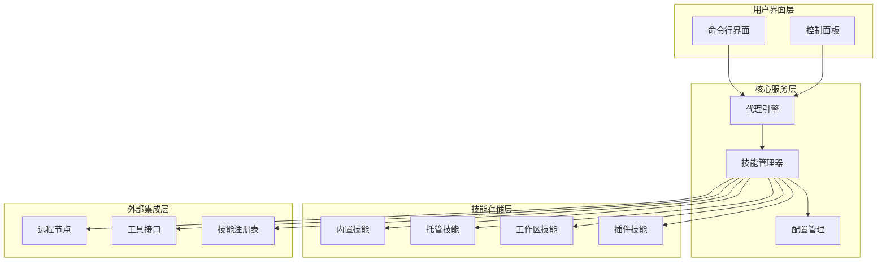
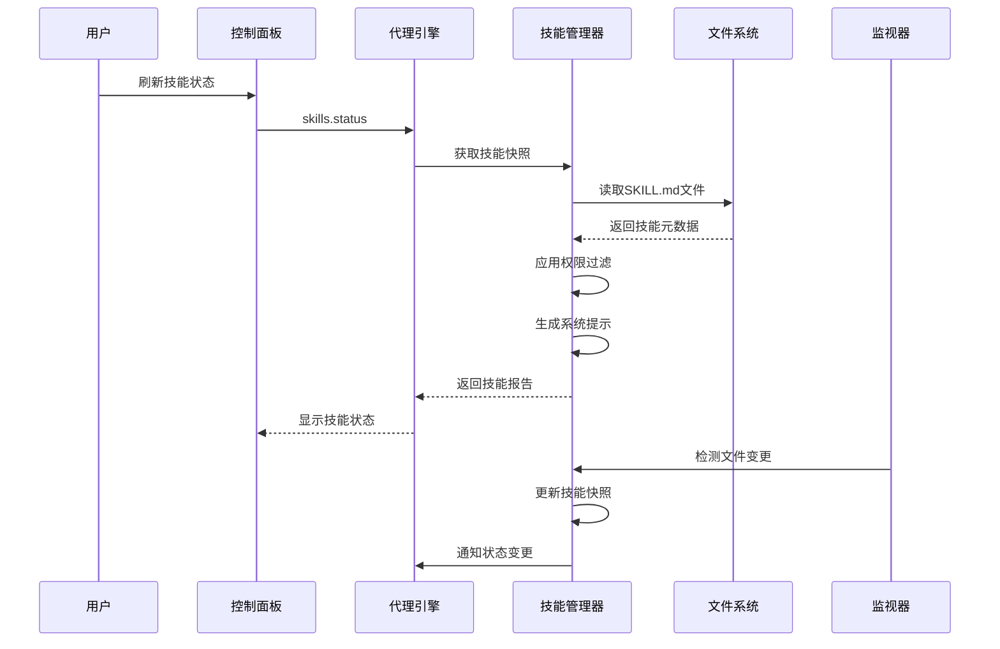
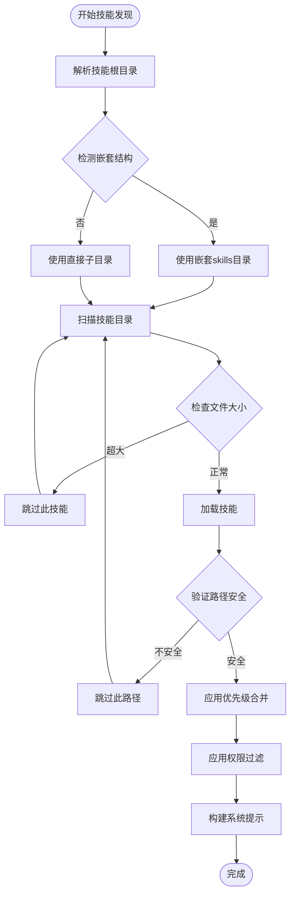
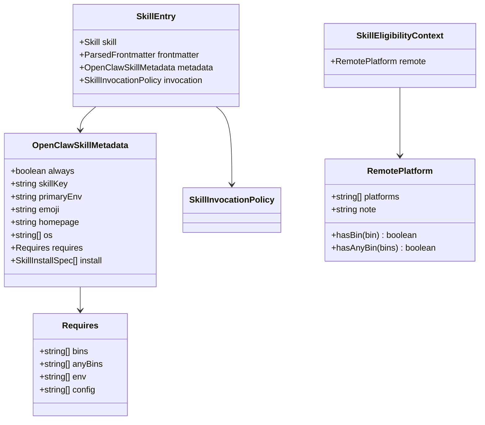
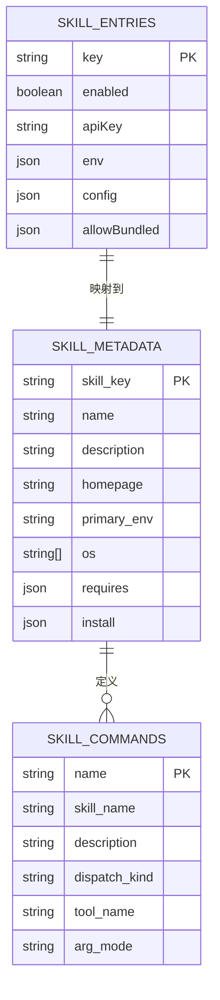
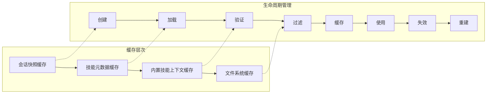
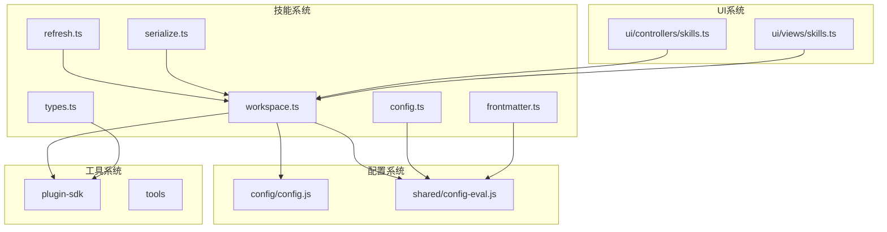

# 技能架构设计

<cite>
**本文档引用的文件**
- [README.md](file://README.md)
- [skills.md](file://docs/tools/skills.md)
- [skills-config.md](file://docs/tools/skills-config.md)
- [workspace.ts](file://src/agents/skills/workspace.ts)
- [config.ts](file://src/agents/skills/config.ts)
- [frontmatter.ts](file://src/agents/skills/frontmatter.ts)
- [types.ts](file://src/agents/skills/types.ts)
- [serialize.ts](file://src/agents/skills/serialize.ts)
- [refresh.ts](file://src/agents/skills/refresh.ts)
- [bundled-context.ts](file://src/agents/skills/bundled-context.ts)
- [SKILL.md](file://skills/skill-creator/SKILL.md)
- [SKILL.md](file://extensions/open-prose/skills/prose/examples/39-architect-by-simulation.prose)
</cite>

## 目录
1. [简介](#简介)
2. [项目结构](#项目结构)
3. [核心组件](#核心组件)
4. [架构总览](#架构总览)
5. [详细组件分析](#详细组件分析)
6. [依赖关系分析](#依赖关系分析)
7. [性能考虑](#性能考虑)
8. [故障排除指南](#故障排除指南)
9. [结论](#结论)

## 简介

OpenClaw技能架构是一个基于AgentSkills规范的模块化技能系统，旨在为AI代理提供可扩展、可管理的工具集。该系统支持三种技能来源：内置技能（bundled）、托管技能（managed/local）和工作区技能（workspace），并通过严格的权限模型和安全边界确保系统的安全性。

技能系统的核心设计理念是"渐进式披露"（Progressive Disclosure），通过三阶段加载机制来优化上下文窗口使用效率：元数据（始终在上下文中）、技能主体（触发时加载）和捆绑资源（按需执行）。这种设计既保证了技能的完整性，又避免了不必要的上下文膨胀。

## 项目结构

OpenClaw技能架构采用分层模块化设计，主要包含以下层次：

**图表来源**
- [workspace.ts:1-800](file://src/agents/skills/workspace.ts#L1-L800)
- [config.ts:1-104](file://src/agents/skills/config.ts#L1-L104)

**章节来源**
- [README.md:1-560](file://README.md#L1-L560)
- [skills.md:1-303](file://docs/tools/skills.md#L1-L303)

## 核心组件

### 技能加载器（Skill Loader）

技能加载器负责从多个来源发现、加载和合并技能定义。它实现了智能的优先级排序和冲突解决机制：

- **来源优先级**：工作区技能（最高）→ 托管技能 → 内置技能（最低）
- **路径安全验证**：确保所有技能路径都在配置的根目录范围内
- **大小限制**：防止过大SKILL.md文件影响性能
- **并发控制**：使用序列化队列避免重复加载

### 权限评估器（Permission Evaluator）

权限评估器基于多维度条件判断技能是否可用：

- **二进制依赖**：检查PATH中的必需程序
- **环境变量**：验证配置或进程环境变量
- **配置路径**：评估openclaw.json中的布尔配置项
- **平台兼容性**：根据操作系统过滤技能
- **沙箱支持**：处理容器内二进制的可用性

### 前端元数据解析器（Frontmatter Parser）

前端元数据解析器负责提取和验证技能的元数据信息：

- **YAML前端数据**：解析name和description字段
- **OpenClaw元数据**：处理安装规格、依赖要求等
- **调用策略**：确定技能的用户可调用性和模型调用禁用状态
- **安全验证**：对安装规格进行安全检查

**章节来源**
- [workspace.ts:292-527](file://src/agents/skills/workspace.ts#L292-L527)
- [config.ts:71-103](file://src/agents/skills/config.ts#L71-L103)
- [frontmatter.ts:186-223](file://src/agents/skills/frontmatter.ts#L186-L223)

## 架构总览

OpenClaw技能系统采用事件驱动的架构模式，通过观察者模式实现技能状态的实时更新：

**图表来源**
- [workspace.ts:567-638](file://src/agents/skills/workspace.ts#L567-L638)
- [refresh.ts:84-207](file://src/agents/skills/refresh.ts#L84-L207)

系统的关键特性包括：

1. **热重载机制**：通过文件监视器实现实时技能更新
2. **会话快照**：为每个会话缓存技能状态，避免重复计算
3. **并发安全**：使用序列化队列确保技能同步操作的原子性
4. **性能优化**：限制最大技能数量和字符数，优化上下文窗口使用

## 详细组件分析

### 技能发现与加载流程

技能发现过程遵循严格的优先级和安全检查机制：

**图表来源**
- [workspace.ts:249-443](file://src/agents/skills/workspace.ts#L249-L443)

### 权限模型与安全边界

权限评估采用多层过滤机制，确保技能的安全使用：

**图表来源**
- [types.ts:19-80](file://src/agents/skills/types.ts#L19-L80)
- [config.ts:71-103](file://src/agents/skills/config.ts#L71-L103)

### 技能注册表设计

技能注册表采用键值对存储结构，支持灵活的配置覆盖：

**图表来源**
- [types.ts:66-90](file://src/agents/skills/types.ts#L66-L90)
- [skills-config.md:26-38](file://docs/tools/skills-config.md#L26-L38)

### 缓存策略与生命周期管理

系统实现了多层次的缓存策略来优化性能：

**图表来源**
- [workspace.ts:567-584](file://src/agents/skills/workspace.ts#L567-L584)
- [bundled-context.ts:14-40](file://src/agents/skills/bundled-context.ts#L14-L40)

**章节来源**
- [workspace.ts:1-800](file://src/agents/skills/workspace.ts#L1-L800)
- [serialize.ts:1-14](file://src/agents/skills/serialize.ts#L1-L14)
- [bundled-context.ts:1-40](file://src/agents/skills/bundled-context.ts#L1-L40)

## 依赖关系分析

技能系统与其他OpenClaw组件的依赖关系如下：

**图表来源**
- [workspace.ts:1-31](file://src/agents/skills/workspace.ts#L1-L31)
- [refresh.ts:1-207](file://src/agents/skills/refresh.ts#L1-L207)

**章节来源**
- [workspace.ts:1-31](file://src/agents/skills/workspace.ts#L1-L31)
- [refresh.ts:1-207](file://src/agents/skills/refresh.ts#L1-L207)

## 性能考虑

技能系统在设计时充分考虑了性能优化：

### 上下文窗口优化
- **路径压缩**：使用"~"符号替代完整用户目录路径，节省400-600个令牌
- **字符预算**：限制技能列表的字符数（默认30,000字符）
- **数量限制**：最多显示150个技能，超出部分截断

### 并发控制
- **序列化队列**：使用Map维护每个工作区的加载队列
- **防抖机制**：文件监视器使用250ms防抖，避免频繁刷新
- **内存缓存**：内置技能上下文结果缓存，减少重复解析

### 资源限制
- **文件大小限制**：单个SKILL.md最大256KB
- **目录扫描限制**：每个根目录最多扫描300个条目
- **技能加载限制**：每源最多加载200个技能

**章节来源**
- [workspace.ts:46-54](file://src/agents/skills/workspace.ts#L46-L54)
- [workspace.ts:139-149](file://src/agents/skills/workspace.ts#L139-L149)
- [refresh.ts:139-142](file://src/agents/skills/refresh.ts#L139-L142)

## 故障排除指南

### 常见问题诊断

1. **技能未显示**
   - 检查技能名称是否正确（区分大小写）
   - 验证权限要求是否满足
   - 确认技能不在禁用列表中

2. **权限错误**
   - 检查必需的二进制文件是否在PATH中
   - 验证环境变量是否正确设置
   - 确认配置路径的布尔值为真

3. **性能问题**
   - 检查技能数量是否超过限制
   - 验证SKILL.md文件大小
   - 确认没有过多的嵌套目录

### 调试技巧

使用以下命令获取详细的技能状态信息：
- `openclaw skills status` - 查看当前技能状态
- `openclaw skills check` - 检查技能配置和权限
- `openclaw skills list` - 列出所有可用技能

**章节来源**
- [skills.md:287-303](file://docs/tools/skills.md#L287-L303)

## 结论

OpenClaw技能架构通过模块化设计、严格的权限模型和智能的缓存策略，为AI代理提供了强大而安全的技能扩展能力。系统的核心优势包括：

1. **灵活性**：支持多种技能来源和动态加载机制
2. **安全性**：多层次的权限验证和路径安全检查
3. **性能**：优化的上下文窗口使用和缓存策略
4. **可维护性**：清晰的模块边界和扩展点设计

该架构为开发者提供了丰富的扩展机会，同时确保了系统的稳定性和安全性。通过遵循渐进式披露原则和严格的权限管理，OpenClaw技能系统能够有效支持复杂的AI代理应用场景。