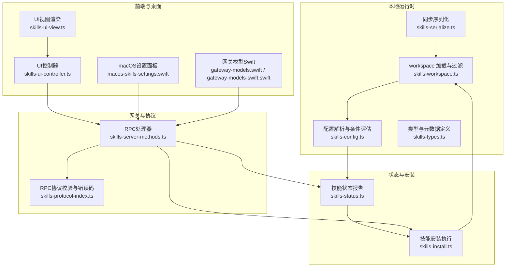
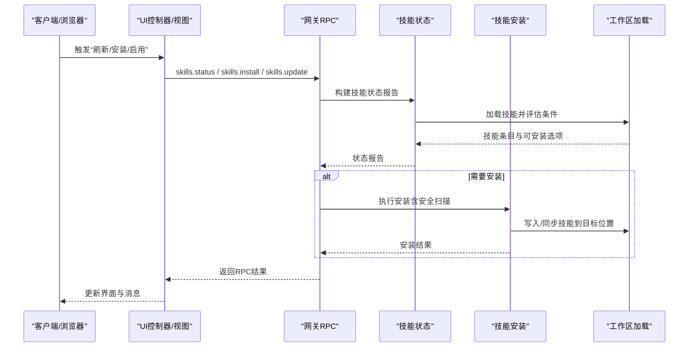
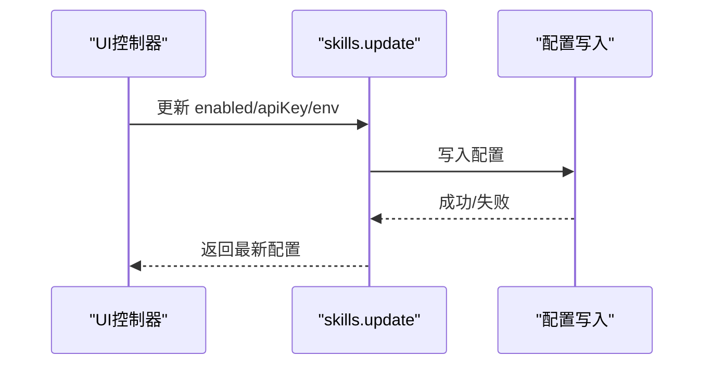
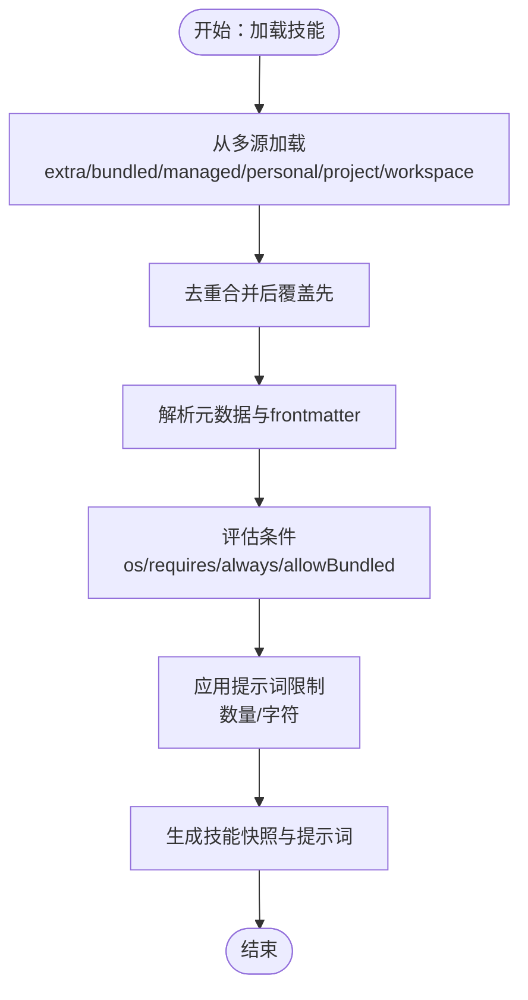
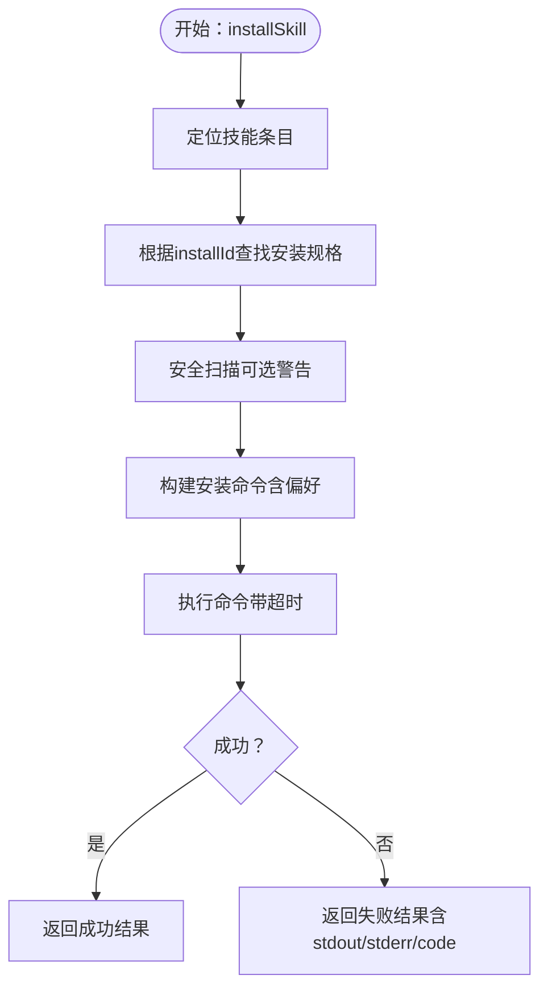
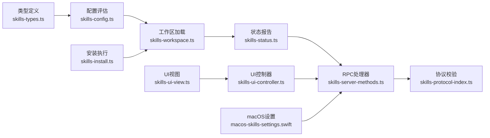

# 技能管理

<cite>
**本文引用的文件**
- [skills.ts](file://src/agents/skills.ts)
- [skills-install.ts](file://src/agents/skills-install.ts)
- [skills-status.ts](file://src/agents/skills-status.ts)
- [skills-config.ts](file://src/agents/skills/config.ts)
- [skills-types.ts](file://src/agents/skills/types.ts)
- [skills-workspace.ts](file://src/agents/skills/workspace.ts)
- [skills-protocol-index.ts](file://src/gateway/protocol/index.ts)
- [skills-server-methods.ts](file://src/gateway/server-methods/skills.ts)
- [skills-ui-controller.ts](file://ui/src/ui/controllers/skills.ts)
- [skills-ui-view.ts](file://ui/src/ui/views/skills.ts)
- [macos-skills-settings.swift](file://apps/macos/Sources/OpenClaw/SkillsSettings.swift)
- [gateway-models.swift](file://apps/macos/Sources/OpenClawProtocol/GatewayModels.swift)
- [gateway-models-swift.swift](file://apps/shared/OpenClawKit/Sources/OpenClawProtocol/GatewayModels.swift)
- [skills-doc-zh-cn.md](file://docs/tools/skills.md)
- [skills-cli-doc.md](file://docs/cli/skills.md)
- [skills-serialize.ts](file://src/agents/skills/serialize.ts)
</cite>

## 目录
1. [简介](#简介)
2. [项目结构](#项目结构)
3. [核心组件](#核心组件)
4. [架构总览](#架构总览)
5. [详细组件分析](#详细组件分析)
6. [依赖关系分析](#依赖关系分析)
7. [性能考量](#性能考量)
8. [故障排查指南](#故障排查指南)
9. [结论](#结论)
10. [附录](#附录)

## 简介
本文件面向OpenClaw技能管理功能，提供从安装、卸载、更新到删除的全生命周期操作说明，涵盖状态监控、健康检查、故障诊断、启用禁用控制、优先级管理与冲突解决策略，并介绍批量操作、自动化管理与配置同步能力。同时给出命令行接口、Web界面与API调用方法，帮助用户构建完整的技能维护工具集与最佳实践。

## 项目结构
OpenClaw的技能系统由“加载与过滤（workspace）—状态与安装（status/install）—协议与服务端（gateway）—UI控制器与视图（web/macos）”四层构成，形成从本地/远程技能发现、条件评估、安装执行到可视化管理的闭环。

**图表来源**
- [skills-workspace.ts:1-882](file://src/agents/skills/workspace.ts#L1-L882)
- [skills-config.ts:1-104](file://src/agents/skills/config.ts#L1-L104)
- [skills-types.ts:1-90](file://src/agents/skills/types.ts#L1-L90)
- [skills-status.ts:1-254](file://src/agents/skills/status.ts#L1-L254)
- [skills-install.ts:1-471](file://src/agents/skills-install.ts#L1-L471)
- [skills-protocol-index.ts:1-673](file://src/gateway/protocol/index.ts#L1-L673)
- [skills-server-methods.ts:1-205](file://src/gateway/server-methods/skills.ts#L1-L205)
- [skills-ui-controller.ts:1-158](file://ui/src/ui/controllers/skills.ts#L1-L158)
- [skills-ui-view.ts:1-193](file://ui/src/ui/views/skills.ts#L1-L193)
- [macos-skills-settings.swift:75-519](file://apps/macos/Sources/OpenClaw/SkillsSettings.swift#L75-L519)
- [gateway-models.swift:2576-2625](file://apps/macos/Sources/OpenClawProtocol/GatewayModels.swift#L2576-L2625)
- [gateway-models-swift.swift:2576-2625](file://apps/shared/OpenClawKit/Sources/OpenClawProtocol/GatewayModels.swift#L2576-L2625)
- [skills-serialize.ts:1-14](file://src/agents/skills/serialize.ts#L1-L14)

**章节来源**
- [skills-workspace.ts:1-882](file://src/agents/skills/workspace.ts#L1-L882)
- [skills-config.ts:1-104](file://src/agents/skills/config.ts#L1-L104)
- [skills-types.ts:1-90](file://src/agents/skills/types.ts#L1-L90)
- [skills-status.ts:1-254](file://src/agents/skills/status.ts#L1-L254)
- [skills-install.ts:1-471](file://src/agents/skills-install.ts#L1-L471)
- [skills-protocol-index.ts:1-673](file://src/gateway/protocol/index.ts#L1-L673)
- [skills-server-methods.ts:1-205](file://src/gateway/server-methods/skills.ts#L1-L205)
- [skills-ui-controller.ts:1-158](file://ui/src/ui/controllers/skills.ts#L1-L158)
- [skills-ui-view.ts:1-193](file://ui/src/ui/views/skills.ts#L1-L193)
- [macos-skills-settings.swift:75-519](file://apps/macos/Sources/OpenClaw/SkillsSettings.swift#L75-L519)
- [gateway-models.swift:2576-2625](file://apps/macos/Sources/OpenClawProtocol/GatewayModels.swift#L2576-L2625)
- [gateway-models-swift.swift:2576-2625](file://apps/shared/OpenClawKit/Sources/OpenClawProtocol/GatewayModels.swift#L2576-L2625)
- [skills-serialize.ts:1-14](file://src/agents/skills/serialize.ts#L1-L14)

## 核心组件
- 技能加载与过滤（workspace）
  - 负责从多源目录加载技能、解析元数据、应用条件过滤与限制，生成可执行的技能快照与提示词。
- 技能状态与安装（status/install）
  - 提供技能状态报告、安装器选择与执行、安全扫描与失败处理。
- 网关协议与服务端（gateway）
  - 定义RPC方法（skills.status、skills.install、skills.update等）、参数校验、错误码与响应格式。
- 前端与桌面（UI/桌面）
  - 提供Web界面与macOS设置面板，支持筛选、刷新、启用/禁用、保存密钥、安装等交互。

**章节来源**
- [skills-workspace.ts:1-882](file://src/agents/skills/workspace.ts#L1-L882)
- [skills-status.ts:1-254](file://src/agents/skills/status.ts#L1-L254)
- [skills-install.ts:1-471](file://src/agents/skills-install.ts#L1-L471)
- [skills-server-methods.ts:1-205](file://src/gateway/server-methods/skills.ts#L1-L205)
- [skills-ui-controller.ts:1-158](file://ui/src/ui/controllers/skills.ts#L1-L158)
- [skills-ui-view.ts:1-193](file://ui/src/ui/views/skills.ts#L1-L193)

## 架构总览
技能管理的端到端流程包括：状态查询、条件评估、安装执行、配置更新与UI反馈。RPC层负责参数校验与错误处理，workspace层负责技能发现与过滤，install层负责安装执行与安全扫描。

**图表来源**
- [skills-server-methods.ts:57-204](file://src/gateway/server-methods/skills.ts#L57-L204)
- [skills-status.ts:227-253](file://src/agents/skills/status.ts#L227-L253)
- [skills-install.ts:392-470](file://src/agents/skills-install.ts#L392-L470)
- [skills-workspace.ts:660-766](file://src/agents/skills/workspace.ts#L660-L766)
- [skills-ui-controller.ts:46-157](file://ui/src/ui/controllers/skills.ts#L46-L157)

**章节来源**
- [skills-server-methods.ts:1-205](file://src/gateway/server-methods/skills.ts#L1-L205)
- [skills-status.ts:1-254](file://src/agents/skills/status.ts#L1-L254)
- [skills-install.ts:1-471](file://src/agents/skills-install.ts#L1-L471)
- [skills-workspace.ts:1-882](file://src/agents/skills/workspace.ts#L1-L882)
- [skills-ui-controller.ts:1-158](file://ui/src/ui/controllers/skills.ts#L1-L158)

## 详细组件分析

### 组件A：技能状态与安装（skills.status / skills.install / skills.update）
- skills.status
  - 支持按agentId查询指定工作区的技能状态，返回技能名称、描述、来源、是否可用、缺失条件、可安装选项等。
  - 参数校验与错误处理由协议层完成，未知agentId会返回明确错误。
- skills.install
  - 根据installId选择安装器（brew/node/go/uv/download），执行安装命令，记录stdout/stderr/code并返回结果。
  - 包含安全扫描与警告收集，失败时提供可读的错误信息。
- skills.update
  - 更新技能配置（enabled/apiKey/env），写回配置文件并返回最新配置。

**图表来源**
- [skills-server-methods.ts:146-203](file://src/gateway/server-methods/skills.ts#L146-L203)
- [skills-protocol-index.ts:364-369](file://src/gateway/protocol/index.ts#L364-L369)

**章节来源**
- [skills-server-methods.ts:57-204](file://src/gateway/server-methods/skills.ts#L57-L204)
- [skills-protocol-index.ts:364-369](file://src/gateway/protocol/index.ts#L364-L369)

### 组件B：技能加载与过滤（workspace）
- 多源加载与优先级
  - 源顺序：extraDirs < bundled < managed < agents-skills-personal < agents-skills-project < workspace（后者覆盖前者）。
- 条件评估
  - 基于metadata.openclaw（os、requires.bins/anyBins/env/config、always）与运行时环境判断是否“可用”。
- 提示词与限制
  - 生成适合模型的技能提示词，受最大数量与字符数限制，必要时截断并给出提示。
- 同步到工作区
  - 提供跨工作区同步能力，保证复制过程的安全性与幂等性。

**图表来源**
- [skills-workspace.ts:445-527](file://src/agents/skills/workspace.ts#L445-L527)
- [skills-config.ts:71-103](file://src/agents/skills/config.ts#L71-L103)

**章节来源**
- [skills-workspace.ts:292-527](file://src/agents/skills/workspace.ts#L292-L527)
- [skills-config.ts:1-104](file://src/agents/skills/config.ts#L1-L104)

### 组件C：安装执行与安全扫描（skills-install）
- 安装器选择
  - 支持brew/node/go/uv/download，优先级与平台适配由偏好设置决定。
- 安全扫描
  - 对技能目录进行代码模式扫描，输出危险/可疑模式警告，失败不影响安装但建议后续审计。
- 失败处理
  - 格式化失败信息，包含命令返回码与标准输出/错误输出。

**图表来源**
- [skills-install.ts:392-470](file://src/agents/skills-install.ts#L392-L470)

**章节来源**
- [skills-install.ts:1-471](file://src/agents/skills-install.ts#L1-L471)

### 组件D：状态报告与安装选项（skills-status）
- 状态字段
  - 包括名称、描述、来源、是否打包、是否禁用、是否被允许列表阻断、是否可用、缺失条件、可安装选项等。
- 安装选项选择
  - 根据平台与偏好选择最优安装器，若全部为download则列出所有选项。

**章节来源**
- [skills-status.ts:30-55](file://src/agents/skills/status.ts#L30-L55)
- [skills-status.ts:61-167](file://src/agents/skills/status.ts#L61-L167)

### 组件E：Web与桌面界面（UI/桌面）
- Web界面
  - 支持搜索过滤、刷新、启用/禁用、保存API密钥、一键安装等。
- macOS设置面板
  - 提供过滤器（全部/就绪/待设置/已禁用）、安装目标（网关/本地）、状态切换与安装流程。

**章节来源**
- [skills-ui-controller.ts:1-158](file://ui/src/ui/controllers/skills.ts#L1-L158)
- [skills-ui-view.ts:1-193](file://ui/src/ui/views/skills.ts#L1-L193)
- [macos-skills-settings.swift:75-519](file://apps/macos/Sources/OpenClaw/SkillsSettings.swift#L75-L519)

## 依赖关系分析
- 组件耦合
  - workspace依赖config与types，status依赖workspace与config，install依赖workspace与安全扫描模块，UI依赖网关RPC。
- 关键依赖链
  - workspace → config → status → server-methods → protocol
  - UI/controller → server-methods → status/install → workspace
- 并发与一致性
  - 使用序列化队列确保同一目标的并发安装不会互相干扰。

**图表来源**
- [skills-types.ts:1-90](file://src/agents/skills/types.ts#L1-L90)
- [skills-config.ts:1-104](file://src/agents/skills/config.ts#L1-L104)
- [skills-workspace.ts:1-882](file://src/agents/skills/workspace.ts#L1-L882)
- [skills-status.ts:1-254](file://src/agents/skills/status.ts#L1-L254)
- [skills-server-methods.ts:1-205](file://src/gateway/server-methods/skills.ts#L1-L205)
- [skills-protocol-index.ts:1-673](file://src/gateway/protocol/index.ts#L1-L673)
- [skills-install.ts:1-471](file://src/agents/skills-install.ts#L1-L471)
- [skills-ui-controller.ts:1-158](file://ui/src/ui/controllers/skills.ts#L1-L158)
- [skills-ui-view.ts:1-193](file://ui/src/ui/views/skills.ts#L1-L193)
- [macos-skills-settings.swift:75-519](file://apps/macos/Sources/OpenClaw/SkillsSettings.swift#L75-L519)

**章节来源**
- [skills-types.ts:1-90](file://src/agents/skills/types.ts#L1-L90)
- [skills-config.ts:1-104](file://src/agents/skills/config.ts#L1-L104)
- [skills-workspace.ts:1-882](file://src/agents/skills/workspace.ts#L1-L882)
- [skills-status.ts:1-254](file://src/agents/skills/status.ts#L1-L254)
- [skills-server-methods.ts:1-205](file://src/gateway/server-methods/skills.ts#L1-L205)
- [skills-protocol-index.ts:1-673](file://src/gateway/protocol/index.ts#L1-L673)
- [skills-install.ts:1-471](file://src/agents/skills-install.ts#L1-L471)
- [skills-ui-controller.ts:1-158](file://ui/src/ui/controllers/skills.ts#L1-L158)
- [skills-ui-view.ts:1-193](file://ui/src/ui/views/skills.ts#L1-L193)
- [macos-skills-settings.swift:75-519](file://apps/macos/Sources/OpenClaw/SkillsSettings.swift#L75-L519)

## 性能考量
- 提示词成本
  - 技能列表注入系统提示词具有确定性开销，字符数与XML转义会影响token消耗，建议合理设置最大技能数量与字符上限。
- 加载与过滤
  - 限制每个来源的最大候选数与技能数量，避免路径过大导致扫描膨胀。
- 并发安装
  - 通过序列化队列避免重复安装任务竞争，减少无效IO与资源浪费。

**章节来源**
- [skills-workspace.ts:139-149](file://src/agents/skills/workspace.ts#L139-L149)
- [skills-workspace.ts:529-565](file://src/agents/skills/workspace.ts#L529-L565)
- [skills-serialize.ts:1-14](file://src/agents/skills/serialize.ts#L1-L14)

## 故障排查指南
- 常见问题与定位
  - 未知agentId：确认agentId是否在已知列表中。
  - 缺少二进制/环境变量/配置项：查看状态报告中的缺失条件与原因。
  - 安装失败：检查安装命令返回码与stderr，关注网络、权限与包管理器版本。
  - 安全扫描警告：运行深度审计命令，修复高危/可疑模式后再启用。
- 建议流程
  - 使用“检查”命令查看技能可用性与缺失项。
  - 通过UI/桌面面板查看状态与安装选项，逐步补齐条件。
  - 对第三方技能保持谨慎，优先沙箱运行。

**章节来源**
- [skills-server-methods.ts:57-113](file://src/gateway/server-methods/skills.ts#L57-L113)
- [skills-status.ts:169-225](file://src/agents/skills/status.ts#L169-L225)
- [skills-install.ts:46-85](file://src/agents/skills-install.ts#L46-L85)
- [skills-doc-zh-cn.md:1-303](file://docs/tools/skills.md#L1-L303)

## 结论
OpenClaw的技能管理以“多源加载—条件评估—安装执行—可视化管理”为核心闭环，结合严格的配置与安全扫描机制，既满足灵活性也保障安全性。通过RPC协议与UI/桌面界面，用户可高效完成技能的安装、更新、启用/禁用与批量同步，实现自动化与可观测性的统一。

## 附录

### 操作流程速查
- 安装
  - 通过UI/桌面面板选择安装器并执行；或使用RPC skills.install传入name与installId。
- 卸载/删除
  - 通过UI/桌面面板禁用技能；删除工作区中的技能目录以移除。
- 更新
  - 通过RPC skills.update更新enabled/apiKey/env；或在UI中保存密钥。
- 删除
  - 通过UI/桌面面板禁用并清理工作区技能目录。
- 批量操作
  - 使用RPC批量更新配置；通过工作区同步功能在多工作区间复制技能。
- 自动化管理
  - 结合定时任务与网关健康检查，定期刷新技能状态与执行安装。
- 配置同步
  - 使用同步函数将源工作区技能复制到目标工作区，确保一致性。

**章节来源**
- [skills-server-methods.ts:114-203](file://src/gateway/server-methods/skills.ts#L114-L203)
- [skills-ui-view.ts:125-157](file://ui/src/ui/views/skills.ts#L125-L157)
- [skills-workspace.ts:710-766](file://src/agents/skills/workspace.ts#L710-L766)

### 命令行与API参考
- CLI
  - openclaw skills list/info/check：查看技能清单、详情与可用性检查。
- API
  - skills.status：获取技能状态报告。
  - skills.install：执行技能安装。
  - skills.update：更新技能配置。

**章节来源**
- [skills-cli-doc.md:1-27](file://docs/cli/skills.md#L1-L27)
- [skills-server-methods.ts:57-204](file://src/gateway/server-methods/skills.ts#L57-L204)
- [skills-protocol-index.ts:364-369](file://src/gateway/protocol/index.ts#L364-L369)