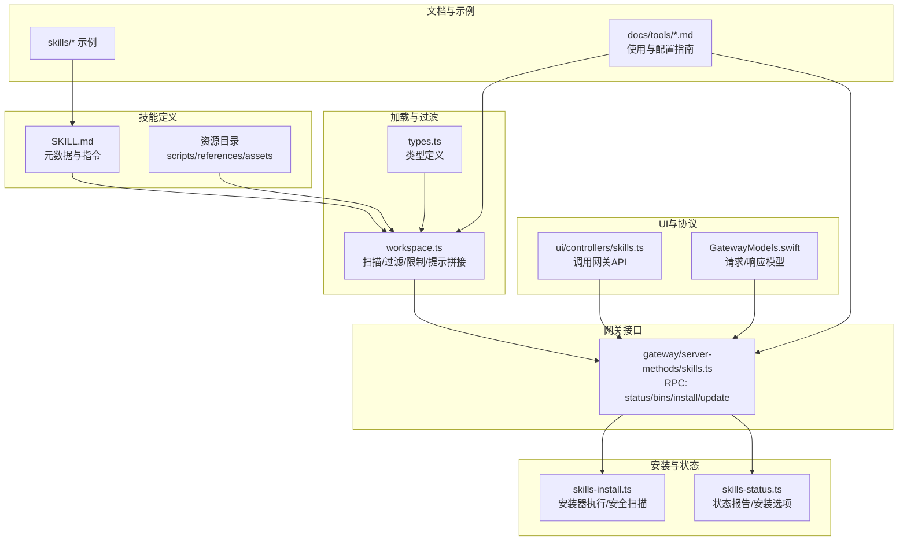
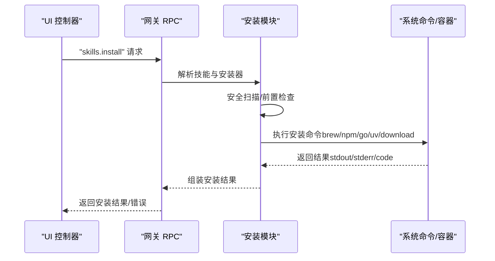
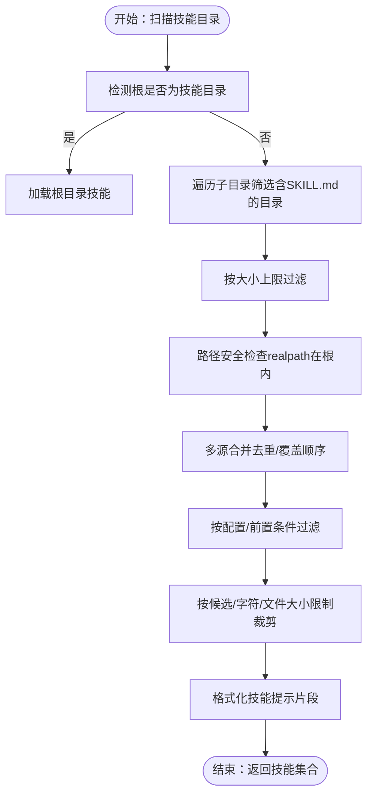
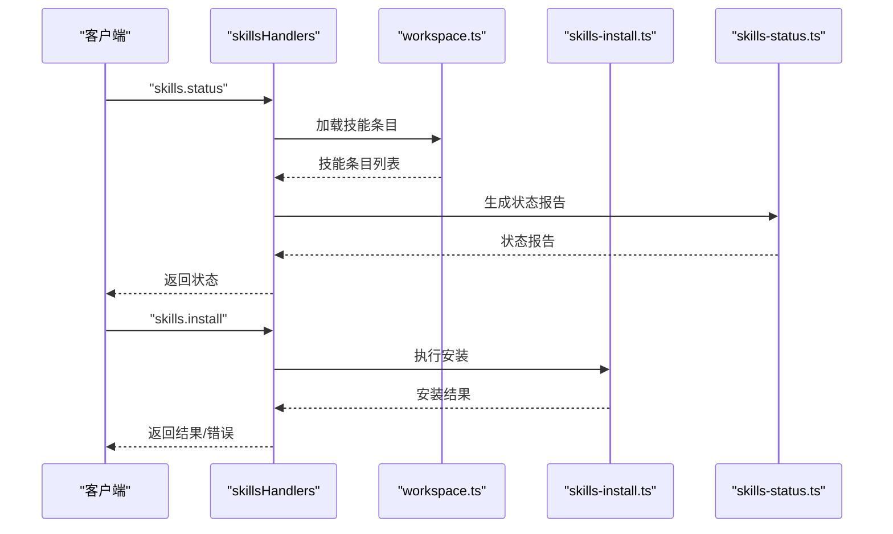
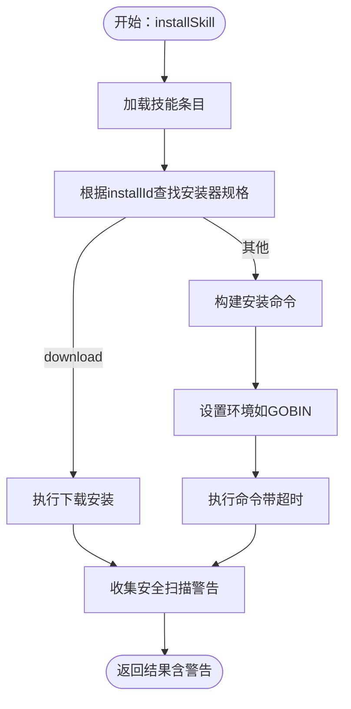
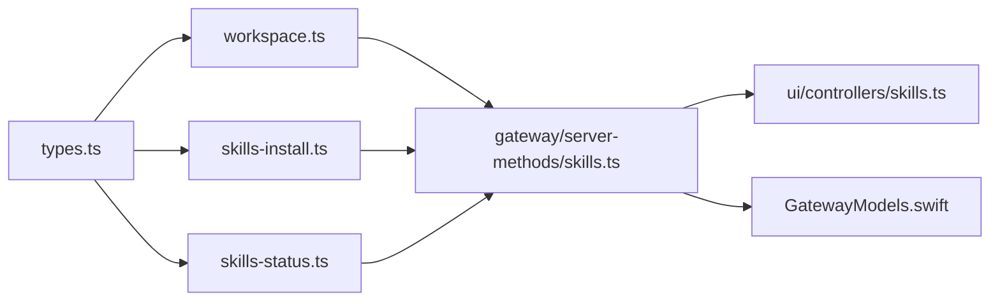

# 技能系统

<cite>
**本文引用的文件**
- [skills.ts](file://src/agents/skills/workspace.ts)
- [types.ts](file://src/agents/skills/types.ts)
- [skills.ts](file://src/gateway/server-methods/skills.ts)
- [skills-install.ts](file://src/agents/skills-install.ts)
- [skills-status.ts](file://src/agents/skills-status.ts)
- [skills.md](file://docs/tools/skills.md)
- [skills-config.md](file://docs/tools/skills-config.md)
- [clawhub.md](file://docs/tools/clawhub.md)
- [SKILL.md](file://skills/skill-creator/SKILL.md)
- [SKILL.md](file://skills/summarize/SKILL.md)
- [SKILL.md](file://skills/gemini/SKILL.md)
- [skills.ts](file://ui/src/ui/controllers/skills.ts)
- [GatewayModels.swift](file://apps/macos/Sources/OpenClawProtocol/GatewayModels.swift)
- [GatewayModels.swift](file://apps/shared/OpenClawKit/Sources/OpenClawProtocol/GatewayModels.swift)
- [SkillsSettingsSmokeTests.swift](file://apps/macos/Tests/OpenClawIPCTests/SkillsSettingsSmokeTests.swift)
</cite>

## 目录
1. [简介](#简介)
2. [项目结构](#项目结构)
3. [核心组件](#核心组件)
4. [架构总览](#架构总览)
5. [详细组件分析](#详细组件分析)
6. [依赖关系分析](#依赖关系分析)
7. [性能考量](#性能考量)
8. [故障排除指南](#故障排除指南)
9. [结论](#结论)
10. [附录](#附录)

## 简介
本文件面向OpenClaw技能系统的开发者与使用者，系统性阐述技能架构设计、开发流程、生命周期管理、安装验证、权限控制与依赖处理，提供从模板到发布的完整指南，并解释技能分类、搜索与分发平台（ClawHub）的使用方法与最佳实践。

## 项目结构
OpenClaw的技能系统由“技能定义（SKILL.md + 元数据）+ 加载与过滤（workspace.ts）+ 网关接口（gateway server-methods）+ 安装与状态（skills-install/status）+ UI与协议（UI控制器/协议模型）+ 文档与示例（docs + skills/*）”构成。核心职责划分如下：
- 技能定义与元数据：位于skills目录中的每个技能包包含SKILL.md与可选资源（scripts/references/assets），并通过metadata字段声明依赖与安装器。
- 加载与过滤：workspace.ts负责扫描多源技能目录、解析前置条件、限制数量与大小、构建提示词片段与命令规范。
- 网关接口：gateway/server-methods/skills.ts提供skills.status、skills.bins、skills.install、skills.update等RPC方法。
- 安装与状态：skills-install.ts执行安装器（brew/npm/go/uv/download），并进行安全扫描；skills-status.ts生成技能状态报告。
- UI与协议：UI控制器调用网关API；Swift协议模型定义请求/响应结构。
- 文档与示例：docs/tools/skills.md、docs/tools/skills-config.md、docs/tools/clawhub.md及skills/*示例共同构成使用与开发指南。

**图表来源**
- [skills.ts:292-527](file://src/agents/skills/workspace.ts#L292-L527)
- [types.ts:1-90](file://src/agents/skills/types.ts#L1-L90)
- [skills.ts:57-205](file://src/gateway/server-methods/skills.ts#L57-L205)
- [skills-install.ts:392-471](file://src/agents/skills-install.ts#L392-L471)
- [skills-status.ts:227-254](file://src/agents/skills-status.ts#L227-L254)
- [skills.ts:125-157](file://ui/src/ui/controllers/skills.ts#L125-L157)
- [GatewayModels.swift:2561-2581](file://apps/macos/Sources/OpenClawProtocol/GatewayModels.swift#L2561-L2581)
- [GatewayModels.swift:2561-2581](file://apps/shared/OpenClawKit/Sources/OpenClawProtocol/GatewayModels.swift#L2561-L2581)
- [skills.md:1-303](file://docs/tools/skills.md#L1-L303)
- [SKILL.md:1-88](file://skills/summarize/SKILL.md#L1-L88)

**章节来源**
- [skills.ts:1-882](file://src/agents/skills/workspace.ts#L1-L882)
- [skills.md:1-303](file://docs/tools/skills.md#L1-L303)

## 核心组件
- 技能条目与元数据
  - SkillEntry：封装Skill对象、解析的YAML前置信息、OpenClaw元数据与调用策略。
  - OpenClawSkillMetadata：声明依赖（bins/env/config/os）、安装器规格、主环境变量、主页、是否始终可用等。
  - SkillInvocationPolicy：控制是否允许用户触发与模型直接调用。
- 加载与过滤
  - 多源扫描：bundled、managed（~/.openclaw/skills）、workspace（<workspace>/skills）、extraDirs、插件技能。
  - 过滤规则：按config开关、允许清单、前置二进制、环境变量、配置路径、远程节点能力等判定。
  - 限制策略：候选上限、每源加载上限、提示字符上限、单文件大小上限。
- 网关RPC
  - skills.status：返回技能状态报告（含缺失项、安装选项、配置检查）。
  - skills.bins：汇总各工作区技能所需的二进制。
  - skills.install：执行安装器并返回结果。
  - skills.update：更新技能配置（启用/禁用、apiKey、env）。
- 安装与状态
  - 安装器：brew、node（npm/pnpm/yarn/bun）、go、uv、download。
  - 安全扫描：对技能目录进行代码模式扫描，输出警告。
  - 状态报告：评估满足度、生成安装建议、标注bundled/禁用/拦截原因。
- UI与协议
  - UI控制器封装skills.install请求，处理错误与成功消息。
  - Swift协议模型定义SkillsInstallParams等结构。

**章节来源**
- [types.ts:1-90](file://src/agents/skills/types.ts#L1-L90)
- [skills.ts:68-89](file://src/agents/skills/workspace.ts#L68-L89)
- [skills.ts:57-205](file://src/gateway/server-methods/skills.ts#L57-L205)
- [skills-install.ts:19-471](file://src/agents/skills-install.ts#L19-L471)
- [skills-status.ts:30-254](file://src/agents/skills-status.ts#L30-L254)
- [skills.ts:125-157](file://ui/src/ui/controllers/skills.ts#L125-L157)
- [GatewayModels.swift:2561-2581](file://apps/macos/Sources/OpenClawProtocol/GatewayModels.swift#L2561-L2581)

## 架构总览
技能系统采用“多源扫描 + 条件过滤 + 提示注入 + RPC驱动”的分层架构。前端通过UI控制器发起安装请求，网关侧解析参数并调用安装模块；安装模块根据技能元数据选择合适的安装器，执行命令并返回结果；状态模块生成技能可用性报告供UI展示与诊断。

**图表来源**
- [skills.ts:114-145](file://src/gateway/server-methods/skills.ts#L114-L145)
- [skills-install.ts:392-471](file://src/agents/skills-install.ts#L392-L471)
- [skills.ts:125-157](file://ui/src/ui/controllers/skills.ts#L125-L157)

## 详细组件分析

### 组件A：技能加载与过滤（workspace.ts）
- 扫描策略
  - 自检根：若根目录包含SKILL.md则作为单一技能加载；否则遍历子目录，仅接受含SKILL.md且符合大小限制的目录。
  - 多源合并：extraDirs < bundled < managed < agents-personal < agents-project < workspace，后者覆盖前者。
  - 路径安全：严格限定realpath必须在配置根内，防止逃逸。
- 过滤与限制
  - 过滤：按config.enabled、allowBundled、requirement满足度（二进制/环境/配置/OS）与远程节点能力。
  - 限制：候选数量、每源加载数量、提示字符上限、单文件大小上限。
- 提示注入
  - 将技能摘要（名称/描述/位置）格式化为紧凑XML片段注入系统提示，避免上下文膨胀。
- 命令规范
  - 为用户可触发的技能生成唯一命令名与描述，避免冲突并限制长度。

**图表来源**
- [skills.ts:292-527](file://src/agents/skills/workspace.ts#L292-L527)
- [skills.ts:529-565](file://src/agents/skills/workspace.ts#L529-L565)

**章节来源**
- [skills.ts:68-89](file://src/agents/skills/workspace.ts#L68-L89)
- [skills.ts:292-527](file://src/agents/skills/workspace.ts#L292-L527)
- [skills.ts:529-565](file://src/agents/skills/workspace.ts#L529-L565)

### 组件B：网关RPC接口（gateway/server-methods/skills.ts）
- 方法概览
  - skills.status：构建技能状态报告，包含缺失项、安装选项、配置检查与远程节点提示。
  - skills.bins：聚合各工作区技能所需二进制列表。
  - skills.install：解析参数，调用安装模块，返回结果或UNAVAILABLE错误。
  - skills.update：更新技能entries配置（enabled/apiKey/env），写回配置文件。
- 参数校验与错误处理
  - 对每个RPC方法进行参数校验，格式化错误信息并返回标准错误码。

**图表来源**
- [skills.ts:57-205](file://src/gateway/server-methods/skills.ts#L57-L205)
- [skills-install.ts:392-471](file://src/agents/skills-install.ts#L392-L471)
- [skills-status.ts:227-254](file://src/agents/skills-status.ts#L227-L254)

**章节来源**
- [skills.ts:57-205](file://src/gateway/server-methods/skills.ts#L57-L205)

### 组件C：安装与安全（skills-install.ts）
- 安装器选择
  - 优先级：preferBrew（当brew可用时优先）> uv > node > brew（兜底）> go > download > 其他。
  - 平台适配：download类型列出全部选项供用户选择；其他类型按平台过滤。
- 安装执行
  - brew：支持自定义brew可执行路径；失败时给出平台化指引。
  - node：根据偏好选择npm/pnpm/yarn/bun，忽略脚本执行。
  - go：优先brew安装，否则尝试apt（需sudo），否则报错。
  - uv：若缺失则通过brew安装uv。
  - download：单独处理下载与解压逻辑。
- 安全扫描
  - 对技能目录进行扫描，标记危险/可疑模式，安装时输出警告。
- 结果封装
  - 成功/失败均返回stdout/stderr/code与人类可读message。

**图表来源**
- [skills-install.ts:392-471](file://src/agents/skills-install.ts#L392-L471)
- [skills-install.ts:114-154](file://src/agents/skills-install.ts#L114-L154)

**章节来源**
- [skills-install.ts:19-471](file://src/agents/skills-install.ts#L19-L471)

### 组件D：状态与安装选项（skills-status.ts）
- 状态计算
  - disabled：来自config.entries.<key>.enabled=false。
  - blockedByAllowlist：bundled技能受allowBundled限制。
  - eligible：未禁用且满足always或requirements。
  - missing：二进制/环境/配置/OS缺失集合。
- 安装选项
  - 过滤：仅展示当前平台支持的安装器。
  - 优先：preferBrew优先；若不可用则按uv/node/brew/go/download顺序选择。
  - 标签：根据类型生成易读标签（如“Install gemini (brew)”）。

**章节来源**
- [skills-status.ts:169-225](file://src/agents/skills-status.ts#L169-L225)
- [skills-status.ts:227-254](file://src/agents/skills-status.ts#L227-L254)

### 组件E：UI与协议（UI控制器 + Swift协议模型）
- UI控制器
  - 调用skills.install，设置loading/error状态，刷新技能列表并展示消息。
- 协议模型
  - SkillsInstallParams：name/installId/timeoutMs。
  - SkillsBinsParams/SkillsBinsResult：查询所需二进制列表。
- macOS测试
  - SkillsSettingsSmokeTests验证状态构建与缺失项渲染。

**章节来源**
- [skills.ts:125-157](file://ui/src/ui/controllers/skills.ts#L125-L157)
- [GatewayModels.swift:2561-2581](file://apps/macos/Sources/OpenClawProtocol/GatewayModels.swift#L2561-L2581)
- [GatewayModels.swift:2561-2581](file://apps/shared/OpenClawKit/Sources/OpenClawProtocol/GatewayModels.swift#L2561-L2581)
- [SkillsSettingsSmokeTests.swift:41-73](file://apps/macos/Tests/OpenClawIPCTests/SkillsSettingsSmokeTests.swift#L41-L73)

## 依赖关系分析
- 类型与数据结构
  - types.ts定义了技能元数据、安装器规格、调用策略与入口点类型，被workspace.ts、skills-install.ts、skills-status.ts广泛引用。
- 加载与过滤对安装/状态的影响
  - workspace.ts的过滤与限制直接影响skills-status.ts的状态计算与UI展示；安装器规格来源于workspace.ts解析的metadata。
- 网关对安装/状态的编排
  - gateway/server-methods/skills.ts将UI请求转发至安装/状态模块，并统一错误处理与返回格式。
- UI与协议的契约
  - UI控制器与Swift协议模型保持一致的字段命名与类型约束，确保跨平台一致性。

**图表来源**
- [types.ts:1-90](file://src/agents/skills/types.ts#L1-L90)
- [skills.ts:292-527](file://src/agents/skills/workspace.ts#L292-L527)
- [skills-install.ts:392-471](file://src/agents/skills-install.ts#L392-L471)
- [skills-status.ts:227-254](file://src/agents/skills-status.ts#L227-L254)
- [skills.ts:57-205](file://src/gateway/server-methods/skills.ts#L57-L205)
- [skills.ts:125-157](file://ui/src/ui/controllers/skills.ts#L125-L157)
- [GatewayModels.swift:2561-2581](file://apps/macos/Sources/OpenClawProtocol/GatewayModels.swift#L2561-L2581)

**章节来源**
- [types.ts:1-90](file://src/agents/skills/types.ts#L1-L90)
- [skills.ts:292-527](file://src/agents/skills/workspace.ts#L292-L527)
- [skills-install.ts:392-471](file://src/agents/skills-install.ts#L392-L471)
- [skills-status.ts:227-254](file://src/agents/skills-status.ts#L227-L254)
- [skills.ts:57-205](file://src/gateway/server-methods/skills.ts#L57-L205)

## 性能考量
- 上下文窗口成本
  - 技能提示片段采用紧凑XML格式，基础开销约195字符，每技能约97字符+字段长度；建议控制技能数量与提示长度。
- 加载限制
  - 候选上限、每源加载上限、提示字符上限、单文件大小上限，避免扫描与注入带来的性能问题。
- 热更新与快照
  - 会话启动时缓存技能快照，后续轮次复用；支持文件监控热更新，减少重复扫描。

**章节来源**
- [skills.md:269-286](file://docs/tools/skills.md#L269-L286)
- [skills.ts:139-149](file://src/agents/skills/workspace.ts#L139-L149)
- [skills.ts:529-565](file://src/agents/skills/workspace.ts#L529-L565)

## 故障排除指南
- 安装失败
  - brew缺失：在Linux/Docker环境下提示手动安装或使用系统包管理器。
  - go缺失：尝试apt-get安装（需sudo），否则提示手动安装。
  - uv缺失：通过brew安装uv。
  - download安装：检查url/archive/extract/stripComponents/targetDir配置。
- 安全扫描告警
  - 出现危险/可疑模式时，安装仍继续但会输出警告；建议运行深度安全审计。
- 状态异常
  - disabled：检查config.entries.<key>.enabled=false。
  - blockedByAllowlist：检查allowBundled配置。
  - missing：检查二进制/环境变量/配置路径/OS支持。
- 远程节点
  - 若Gateway在Linux运行且macOS节点允许system.run，可在节点具备所需二进制时将macOS技能视为可用。

**章节来源**
- [skills-install.ts:247-367](file://src/agents/skills-install.ts#L247-L367)
- [skills-install.ts:58-85](file://src/agents/skills-install.ts#L58-L85)
- [skills-status.ts:169-225](file://src/agents/skills-status.ts#L169-L225)
- [skills.md:248-253](file://docs/tools/skills.md#L248-L253)

## 结论
OpenClaw技能系统通过清晰的多源扫描、严格的前置条件过滤、可配置的安装器与安全扫描、以及统一的RPC接口与UI协议，实现了高扩展、可审计、跨平台的技能生态。开发者可基于模板快速创建高质量技能，使用者可通过ClawHub便捷发现与安装技能，同时借助状态报告与监控实现稳健运维。

## 附录

### 技能开发完整指南
- 模板与脚手架
  - 使用skill-creator提供的初始化脚本生成模板，包含SKILL.md与可选资源目录。
- 触发与描述
  - 在YAML frontmatter中明确name与description，作为触发与排序依据。
- 结构化内容
  - 采用渐进披露：metadata常驻、SKILL.md按需加载、references按需读取。
- 安装器与依赖
  - 在metadata.openclaw中声明requires（bins/env/config/os）与install数组，支持brew/node/go/uv/download。
- 包装与分发
  - 使用package脚本验证并打包为.zip（.skill文件），遵循安全限制（拒绝符号链接）。

**章节来源**
- [SKILL.md:201-373](file://skills/skill-creator/SKILL.md#L201-L373)
- [skills.md:78-187](file://docs/tools/skills.md#L78-L187)

### 技能分类与搜索机制
- 分类体系
  - 通过metadata.openclaw的os、requires、install等字段实现平台与依赖维度的分类。
- 搜索与发现
  - 通过ClawHub进行语义化搜索与标签筛选，支持版本管理与使用信号（星标/下载）提升可见性。

**章节来源**
- [clawhub.md:90-117](file://docs/tools/clawhub.md#L90-L117)
- [clawhub.md:177-187](file://docs/tools/clawhub.md#L177-L187)

### 技能市场（ClawHub）使用指南
- 安装与更新
  - clawhub install <slug>、clawhub update --all、clawhub sync --all。
- 发布与备份
  - clawhub publish ./my-skill --slug ...、clawhub sync --all。
- CLI参数与环境变量
  - 支持workdir/dir/site/registry/no-input/cli-version等全局选项与认证、遥测控制。

**章节来源**
- [clawhub.md:118-258](file://docs/tools/clawhub.md#L118-L258)

### 技能示例参考
- summarize：演示二进制依赖与brew安装器。
- gemini：演示CLI使用与安装器。
- skill-creator：演示模板生成与最佳实践。

**章节来源**
- [SKILL.md:1-88](file://skills/summarize/SKILL.md#L1-L88)
- [SKILL.md:1-44](file://skills/gemini/SKILL.md#L1-L44)
- [SKILL.md:201-373](file://skills/skill-creator/SKILL.md#L201-L373)