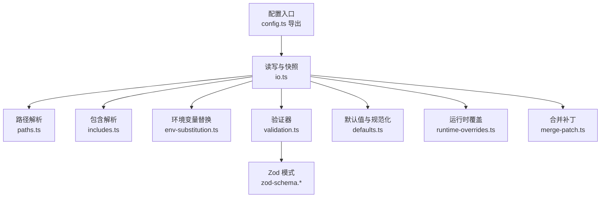
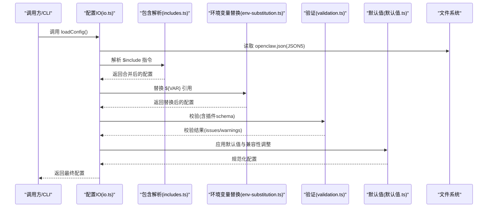
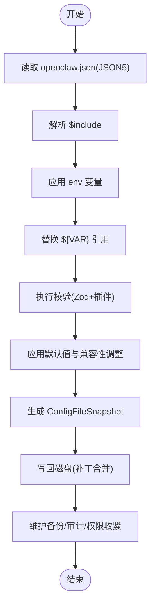
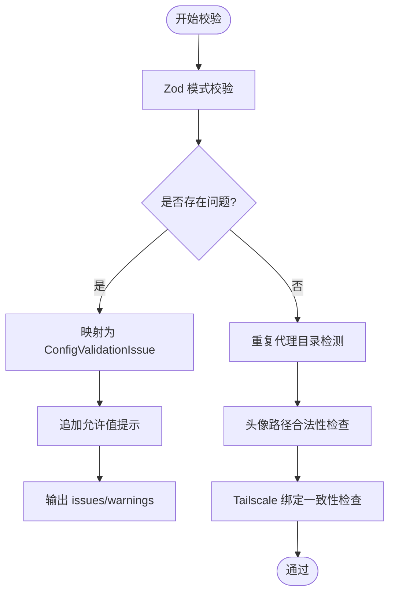
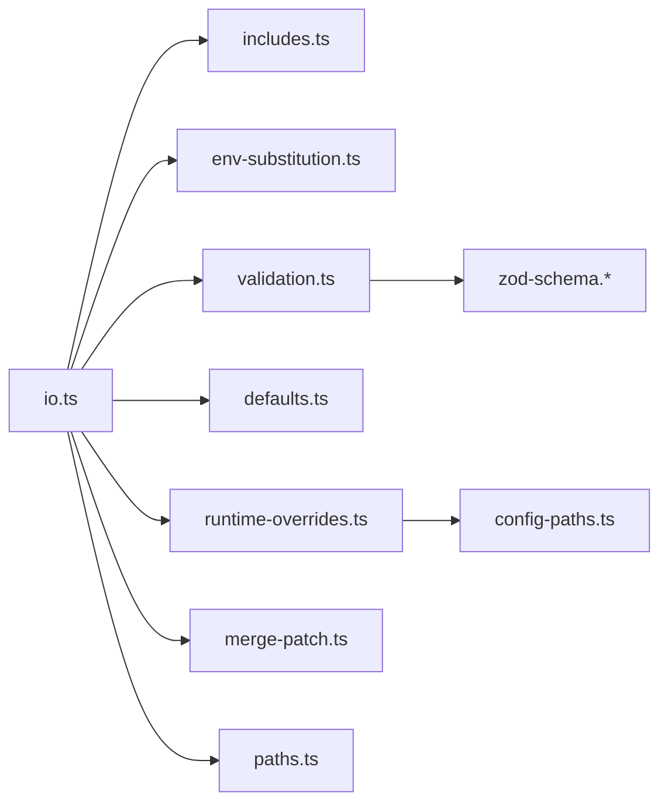

# 技能配置

<cite>
**本文引用的文件**
- [src/config/config.ts](file://src/config/config.ts)
- [src/config/io.ts](file://src/config/io.ts)
- [src/config/types.ts](file://src/config/types.ts)
- [src/config/types.openclaw.ts](file://src/config/types.openclaw.ts)
- [src/config/validation.ts](file://src/config/validation.ts)
- [src/config/defaults.ts](file://src/config/defaults.ts)
- [src/config/paths.ts](file://src/config/paths.ts)
- [src/config/includes.ts](file://src/config/includes.ts)
- [src/config/env-substitution.ts](file://src/config/env-substitution.ts)
- [src/config/runtime-overrides.ts](file://src/config/runtime-overrides.ts)
- [src/config/config-paths.ts](file://src/config/config-paths.ts)
- [src/config/merge-patch.ts](file://src/config/merge-patch.ts)
</cite>

## 目录
1. [简介](#简介)
2. [项目结构](#项目结构)
3. [核心组件](#核心组件)
4. [架构总览](#架构总览)
5. [详细组件分析](#详细组件分析)
6. [依赖分析](#依赖分析)
7. [性能考虑](#性能考虑)
8. [故障排查指南](#故障排查指南)
9. [结论](#结论)
10. [附录](#附录)

## 简介
本文件面向技能开发者与系统管理员，系统性说明 OpenClaw 技能配置系统的结构、字段定义、验证规则、层次关系（全局/用户/会话）、继承与优先级、动态更新策略、配置模板与默认值管理、配置迁移、以及验证与调试工具的使用方法。目标是帮助你在不深入源码的情况下，也能高效地编写、维护与排障配置。

## 项目结构
OpenClaw 的配置系统以“可读、可写、可验证、可合并”的设计为核心，围绕以下模块协同工作：
- 配置读写与快照：io.ts 提供加载、快照、写回、审计日志等能力
- 类型与模式：types.* 定义配置结构；validation.ts 使用 Zod 模式进行强约束校验
- 默认值与规范化：defaults.ts 应用模型、代理、会话、日志等默认值与兼容性调整
- 路径与包含：paths.ts 解析状态目录与配置路径；includes.ts 支持 $include 模块化
- 环境变量替换：env-substitution.ts 在加载阶段解析 ${VAR} 引用
- 运行时覆盖：runtime-overrides.ts 允许在内存中临时覆盖配置片段
- 合并补丁：merge-patch.ts 实现“补丁式”合并，用于写回与增量更新

图示来源
- [src/config/config.ts:1-29](file://src/config/config.ts#L1-L29)
- [src/config/io.ts:1-120](file://src/config/io.ts#L1-L120)
- [src/config/paths.ts:118-194](file://src/config/paths.ts#L118-L194)
- [src/config/includes.ts:340-347](file://src/config/includes.ts#L340-L347)
- [src/config/env-substitution.ts:188-204](file://src/config/env-substitution.ts#L188-L204)
- [src/config/validation.ts:229-286](file://src/config/validation.ts#L229-L286)
- [src/config/defaults.ts:209-211](file://src/config/defaults.ts#L209-L211)
- [src/config/runtime-overrides.ts:86-92](file://src/config/runtime-overrides.ts#L86-L92)
- [src/config/merge-patch.ts:62-98](file://src/config/merge-patch.ts#L62-L98)

章节来源
- [src/config/config.ts:1-29](file://src/config/config.ts#L1-L29)
- [src/config/io.ts:1-1560](file://src/config/io.ts#L1-L1560)
- [src/config/paths.ts:118-194](file://src/config/paths.ts#L118-L194)
- [src/config/includes.ts:340-347](file://src/config/includes.ts#L340-L347)
- [src/config/env-substitution.ts:188-204](file://src/config/env-substitution.ts#L188-L204)
- [src/config/validation.ts:229-286](file://src/config/validation.ts#L229-L286)
- [src/config/defaults.ts:209-211](file://src/config/defaults.ts#L209-L211)
- [src/config/runtime-overrides.ts:86-92](file://src/config/runtime-overrides.ts#L86-L92)
- [src/config/merge-patch.ts:62-98](file://src/config/merge-patch.ts#L62-L98)

## 核心组件
- 配置对象与快照
  - OpenClawConfig：顶层配置结构，涵盖 auth、env、skills、plugins、models、agents、tools、bindings、messages、commands、approvals、session、web、channels、cron、hooks、discovery、canvasHost、talk、gateway、memory 等子系统
  - ConfigFileSnapshot：描述一次读取的完整状态（原始/解析/已替换/规范化/校验结果/问题/警告/遗留问题）
- 加载与写回
  - loadConfig/readConfigFileSnapshot：从磁盘加载并返回规范化后的配置或快照
  - writeConfigFile：将变更写回磁盘，支持补丁合并、环境变量恢复、备份与审计
- 验证与默认值
  - validateConfigObject/validateConfigObjectRaw：基于 Zod 模式与自定义规则的强校验
  - apply*Defaults：按需注入默认值与兼容性调整
- 包含与路径
  - $include：支持多文件合并，带深度限制与安全检查
  - 路径解析：支持 OPENCLAW_STATE_DIR、OPENCLAW_CONFIG_PATH 等环境变量覆盖
- 环境变量替换
  - ${VAR} 语法在加载阶段解析；缺失时可转为警告而非致命错误
- 运行时覆盖
  - 内存中的覆盖树，最终与磁盘配置合并后生效

章节来源
- [src/config/types.openclaw.ts:31-155](file://src/config/types.openclaw.ts#L31-L155)
- [src/config/io.ts:734-883](file://src/config/io.ts#L734-L883)
- [src/config/io.ts:1070-1068](file://src/config/io.ts#L1070-L1068)
- [src/config/io.ts:1086-1333](file://src/config/io.ts#L1086-L1333)
- [src/config/validation.ts:229-286](file://src/config/validation.ts#L229-L286)
- [src/config/defaults.ts:209-211](file://src/config/defaults.ts#L209-L211)
- [src/config/includes.ts:340-347](file://src/config/includes.ts#L340-L347)
- [src/config/paths.ts:118-194](file://src/config/paths.ts#L118-L194)
- [src/config/env-substitution.ts:188-204](file://src/config/env-substitution.ts#L188-L204)
- [src/config/runtime-overrides.ts:86-92](file://src/config/runtime-overrides.ts#L86-L92)

## 架构总览
下图展示配置从磁盘到内存、再到写回磁盘的关键流程与组件交互。

图示来源
- [src/config/io.ts:734-883](file://src/config/io.ts#L734-L883)
- [src/config/includes.ts:340-347](file://src/config/includes.ts#L340-L347)
- [src/config/env-substitution.ts:188-204](file://src/config/env-substitution.ts#L188-L204)
- [src/config/validation.ts:229-286](file://src/config/validation.ts#L229-L286)
- [src/config/defaults.ts:209-211](file://src/config/defaults.ts#L209-L211)

## 详细组件分析

### 组件A：配置加载与快照（io.ts）
- 关键职责
  - 读取、解析、包含展开、环境变量替换、校验、默认值应用、去重检测、Shell 环境回退、快照生成、写回与审计
- 核心流程
  - 读取 openclaw.json（JSON5），解析 $include，应用 env 变量后再做 ${VAR} 替换
  - 校验前先检测重复代理工作区目录，避免冲突
  - 使用 validateConfigObjectWithPlugins 执行 Zod 模式与插件 schema 校验
  - 应用默认值与兼容性调整（消息、会话、模型、代理、日志、上下文修剪、压缩等）
  - Shell 环境回退：当启用或显式开启时，从登录 shell 注入缺失的密钥
  - 生成 ConfigFileSnapshot，区分 valid/invalid、issues/warnings、legacyIssues
- 写回策略
  - 基于“补丁式合并”，仅写回实际变更，保留未变更的 ${VAR} 引用
  - 写回前进行二次校验，失败时格式化错误信息并抛出
  - 写回时维护备份、收紧权限、记录审计日志，并支持“复制回退”以适配 Windows

图示来源
- [src/config/io.ts:734-883](file://src/config/io.ts#L734-L883)
- [src/config/io.ts:1070-1068](file://src/config/io.ts#L1070-L1068)
- [src/config/io.ts:1086-1333](file://src/config/io.ts#L1086-L1333)

章节来源
- [src/config/io.ts:734-883](file://src/config/io.ts#L734-L883)
- [src/config/io.ts:1070-1068](file://src/config/io.ts#L1070-L1068)
- [src/config/io.ts:1086-1333](file://src/config/io.ts#L1086-L1333)

### 组件B：配置验证与错误处理（validation.ts）
- 校验内容
  - Zod 模式校验（OpenClawSchema）
  - 插件清单与 schema 校验（含未知插件、禁用但有配置等）
  - 代理工作区头像路径合法性
  - Tailscale 绑定与 gateway.bind 的一致性
  - 重复代理工作区目录检测
- 错误与提示
  - 将 Zod 问题映射为可读的 ConfigValidationIssue
  - 自动追加允许值提示，便于修复
  - 对“未知通道/心跳目标”等场景给出建议

图示来源
- [src/config/validation.ts:229-286](file://src/config/validation.ts#L229-L286)
- [src/config/validation.ts:117-140](file://src/config/validation.ts#L117-L140)
- [src/config/validation.ts:148-196](file://src/config/validation.ts#L148-L196)
- [src/config/validation.ts:198-223](file://src/config/validation.ts#L198-L223)

章节来源
- [src/config/validation.ts:229-286](file://src/config/validation.ts#L229-L286)
- [src/config/validation.ts:117-140](file://src/config/validation.ts#L117-L140)
- [src/config/validation.ts:148-196](file://src/config/validation.ts#L148-L196)
- [src/config/validation.ts:198-223](file://src/config/validation.ts#L198-L223)

### 组件C：默认值与规范化（defaults.ts）
- 默认值应用顺序
  - 消息默认、会话主键规范化、Talk API Key 自动注入、模型默认、代理并发默认、日志敏感信息脱敏默认、上下文修剪与心跳默认、压缩模式默认
- 关键点
  - Talk API Key 注入遵循“仅在必要时注入且不覆盖已有配置”
  - 代理默认并发数根据环境与版本自动设定
  - Anthropic 认证模式影响缓存保留参数与心跳周期

章节来源
- [src/config/defaults.ts:131-170](file://src/config/defaults.ts#L131-L170)
- [src/config/defaults.ts:172-207](file://src/config/defaults.ts#L172-L207)
- [src/config/defaults.ts:209-211](file://src/config/defaults.ts#L209-L211)
- [src/config/defaults.ts:213-347](file://src/config/defaults.ts#L213-L347)
- [src/config/defaults.ts:349-388](file://src/config/defaults.ts#L349-L388)
- [src/config/defaults.ts:390-405](file://src/config/defaults.ts#L390-L405)
- [src/config/defaults.ts:407-507](file://src/config/defaults.ts#L407-L507)
- [src/config/defaults.ts:509-532](file://src/config/defaults.ts#L509-L532)

### 组件D：包含与路径（includes.ts、paths.ts）
- $include
  - 支持字符串或数组形式；深度限制与最大文件大小限制；禁止路径逃逸与符号链接绕过
  - 合并策略：数组拼接，对象递归合并，原始值覆盖
- 路径解析
  - 支持 OPENCLAW_STATE_DIR、OPENCLAW_CONFIG_PATH 等环境变量覆盖
  - 兼容历史状态目录与配置文件名

章节来源
- [src/config/includes.ts:340-347](file://src/config/includes.ts#L340-L347)
- [src/config/includes.ts:69-85](file://src/config/includes.ts#L69-L85)
- [src/config/paths.ts:118-194](file://src/config/paths.ts#L118-L194)
- [src/config/paths.ts:200-224](file://src/config/paths.ts#L200-L224)

### 组件E：环境变量替换（env-substitution.ts）
- 支持 ${VAR} 语法；仅匹配大写命名规范
- 缺失时可选择抛出异常或发出警告并保留占位符
- 用于非关键字段的可选密钥注入

章节来源
- [src/config/env-substitution.ts:188-204](file://src/config/env-substitution.ts#L188-L204)

### 组件F：运行时覆盖（runtime-overrides.ts、config-paths.ts）
- 运行时覆盖
  - 通过 setConfigOverride/unsetConfigOverride 设置/移除内存中的覆盖树
  - applyConfigOverrides 将覆盖树与磁盘配置合并
- 路径解析
  - parseConfigPath 将点号路径解析为数组
  - setConfigValueAtPath/unsetConfigValueAtPath 支持安全插入/删除

章节来源
- [src/config/runtime-overrides.ts:54-92](file://src/config/runtime-overrides.ts#L54-L92)
- [src/config/config-paths.ts:6-83](file://src/config/config-paths.ts#L6-L83)

### 组件G：合并补丁（merge-patch.ts）
- 补丁式合并
  - 对象深合并；数组默认直接覆盖
  - 支持按 id 合并对象数组（适用于某些列表场景）

章节来源
- [src/config/merge-patch.ts:62-98](file://src/config/merge-patch.ts#L62-L98)

## 依赖分析
- 模块耦合
  - io.ts 作为中枢，依赖 includes.ts、env-substitution.ts、validation.ts、defaults.ts、runtime-overrides.ts、merge-patch.ts、paths.ts
  - validation.ts 依赖 zod-schema.* 与插件注册表
  - runtime-overrides.ts 依赖 config-paths.ts
- 外部依赖
  - JSON5 解析、Node 文件系统、边界文件读取（安全扫描）、进程环境变量

图示来源
- [src/config/io.ts:1-120](file://src/config/io.ts#L1-L120)
- [src/config/validation.ts:25-25](file://src/config/validation.ts#L25-L25)
- [src/config/runtime-overrides.ts:1-92](file://src/config/runtime-overrides.ts#L1-L92)
- [src/config/config-paths.ts:1-83](file://src/config/config-paths.ts#L1-L83)

章节来源
- [src/config/io.ts:1-120](file://src/config/io.ts#L1-L120)
- [src/config/validation.ts:25-25](file://src/config/validation.ts#L25-L25)
- [src/config/runtime-overrides.ts:1-92](file://src/config/runtime-overrides.ts#L1-L92)
- [src/config/config-paths.ts:1-83](file://src/config/config-paths.ts#L1-L83)

## 性能考虑
- 缓存策略
  - 支持配置缓存时间（OPENCLAW_CONFIG_CACHE_MS），默认 200ms；可通过环境变量禁用
- 写回优化
  - 仅写回变更路径，减少 I/O 与覆盖次数
  - 临时文件 + 原子重命名（Windows 回退为复制+删除）
- 安全与健壮性
  - 包含文件大小限制、深度限制、路径逃逸与符号链接防护
  - 权限收紧与审计日志，避免意外暴露

## 故障排查指南
- 常见错误与定位
  - INVALID_CONFIG：配置结构或值不符合 Zod 模式；检查 issues/warnings 输出
  - 缺失环境变量：${VAR} 未设置；使用 onMissing 回调收集警告，或在启动前注入
  - 重复代理工作区目录：修改 agents.list 中的工作区路径
  - $include 循环/越界：检查包含链与深度限制
- 调试建议
  - 使用 readConfigFileSnapshot 获取完整快照，观察 issues/warnings/legacyIssues
  - 使用 setRuntimeConfigSnapshotRefreshHandler 在写回后刷新运行时快照
  - 查看配置审计日志（config-audit.jsonl）定位异常写回

章节来源
- [src/config/io.ts:193-212](file://src/config/io.ts#L193-L212)
- [src/config/io.ts:772-788](file://src/config/io.ts#L772-L788)
- [src/config/io.ts:1269-1286](file://src/config/io.ts#L1269-L1286)

## 结论
OpenClaw 的技能配置系统以“可读、可写、可验证、可合并”为核心理念，通过模块化的包含、严格的校验、完善的默认值与兼容性调整、安全的写回与审计，为技能开发与运维提供了稳健的配置管理基础。遵循本文档的层次关系、优先级与动态更新策略，可有效降低配置复杂度并提升稳定性。

## 附录

### 配置层次与继承、优先级
- 层次关系
  - 全局配置：位于状态目录下的 openclaw.json（或历史文件名兼容）
  - 用户配置：通过 OPENCLAW_CONFIG_PATH 或 OPENCLAW_STATE_DIR 覆盖
  - 会话配置：由 session 子系统控制（如 mainKey 归一化为主会话）
- 继承与优先级
  - 磁盘配置优先于默认值；运行时覆盖优先于磁盘配置；$include 合并后参与最终校验
  - 环境变量替换发生在校验之前，确保后续流程使用真实值

章节来源
- [src/config/paths.ts:118-194](file://src/config/paths.ts#L118-L194)
- [src/config/defaults.ts:146-170](file://src/config/defaults.ts#L146-L170)
- [src/config/runtime-overrides.ts:86-92](file://src/config/runtime-overrides.ts#L86-L92)

### 动态更新策略
- 写回流程
  - 生成补丁（差异路径），应用补丁，二次校验，写回磁盘，维护备份与审计
  - 若存在运行时快照刷新处理器，写回后尝试刷新，失败则抛出 ConfigRuntimeRefreshError
- 运行时投影
  - projectConfigOntoRuntimeSourceSnapshot 将当前配置投影回运行时源快照，保持一致性

章节来源
- [src/config/io.ts:1086-1333](file://src/config/io.ts#L1086-L1333)
- [src/config/io.ts:1438-1459](file://src/config/io.ts#L1438-L1459)

### 配置模板与默认值管理
- 模板建议
  - 使用 $include 将通用配置拆分为 base.json5、channels.json5、plugins.json5 等模块
  - 在 env.vars 中声明可选密钥，配合 ${VAR} 语法按需注入
- 默认值管理
  - 通过 defaults.ts 的 apply*Defaults 函数统一注入；避免在磁盘文件中冗余声明

章节来源
- [src/config/includes.ts:340-347](file://src/config/includes.ts#L340-L347)
- [src/config/env-substitution.ts:188-204](file://src/config/env-substitution.ts#L188-L204)
- [src/config/defaults.ts:209-211](file://src/config/defaults.ts#L209-L211)

### 配置迁移与兼容性
- 迁移策略
  - 通过 findLegacyConfigIssues 识别遗留键并在快照中标注 legacyIssues
  - defaults.ts 中对模型、代理、会话等进行兼容性调整
- 版本感知
  - stampConfigVersion 记录最后写入版本；warnIfConfigFromFuture 提示跨版本风险

章节来源
- [src/config/validation.ts:229-241](file://src/config/validation.ts#L229-L241)
- [src/config/defaults.ts:607-633](file://src/config/defaults.ts#L607-L633)