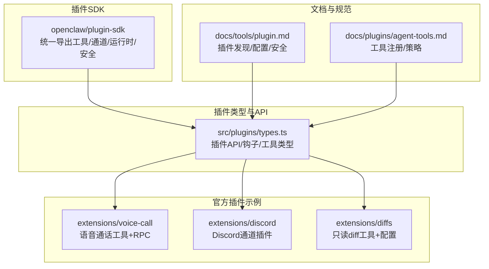
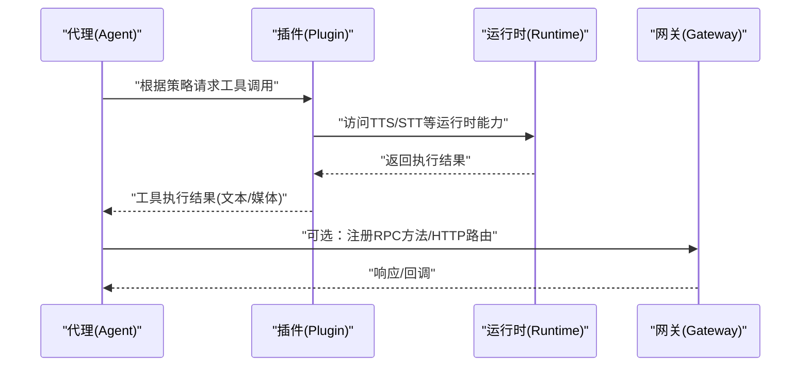
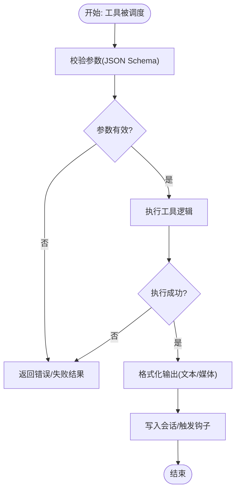
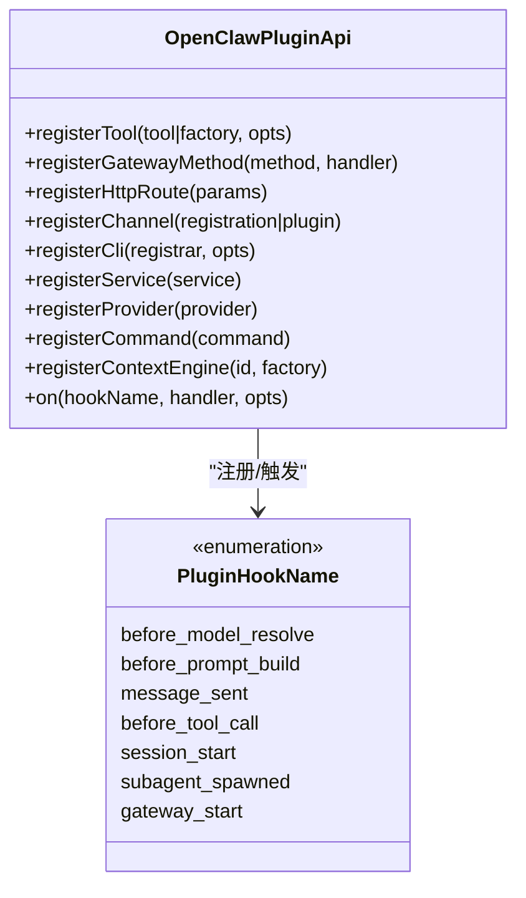
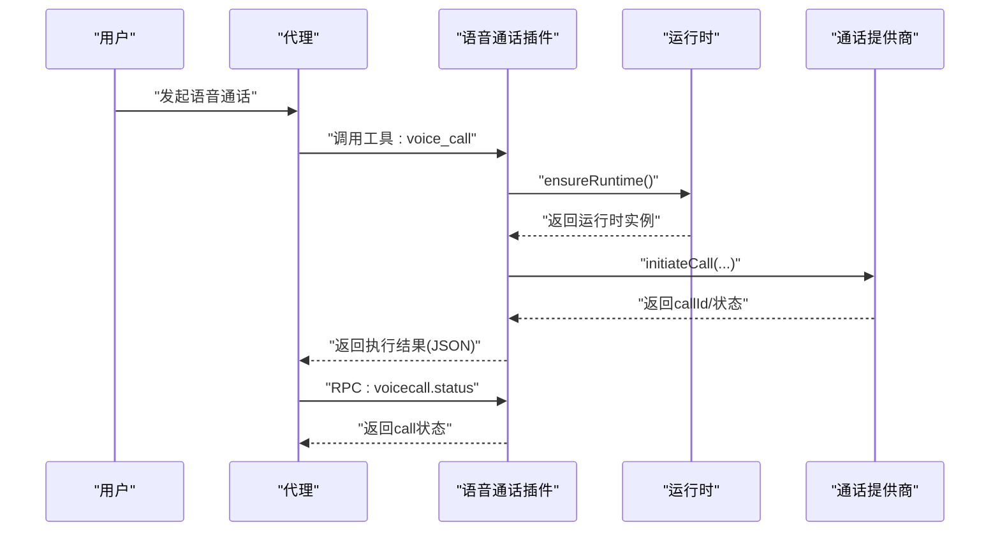
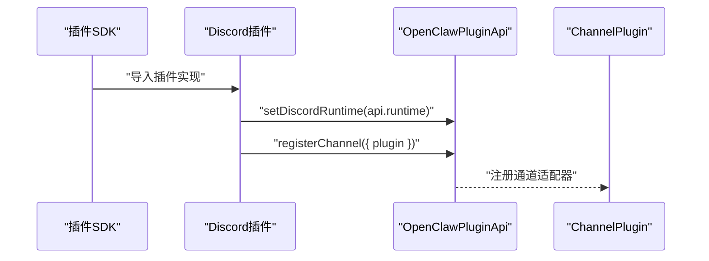
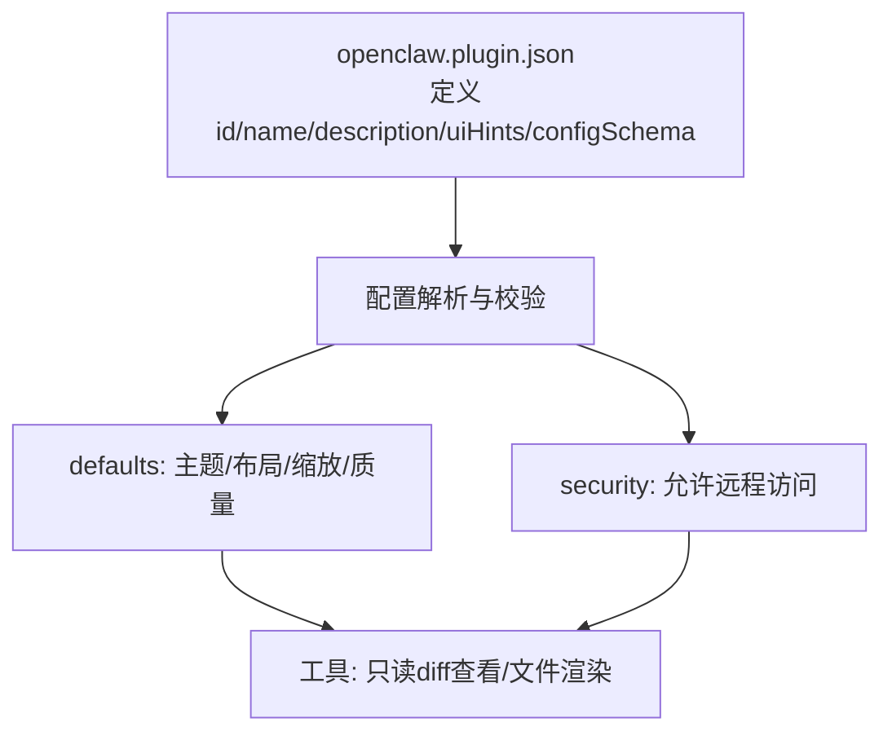
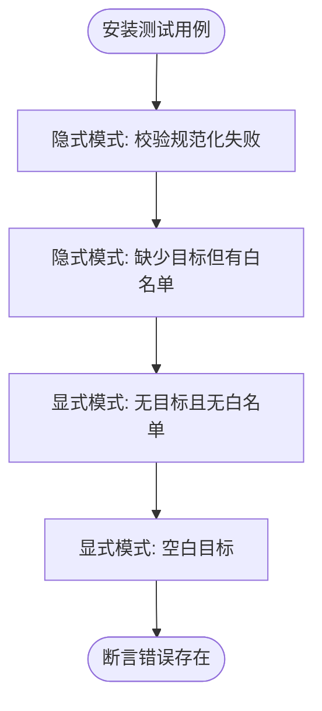
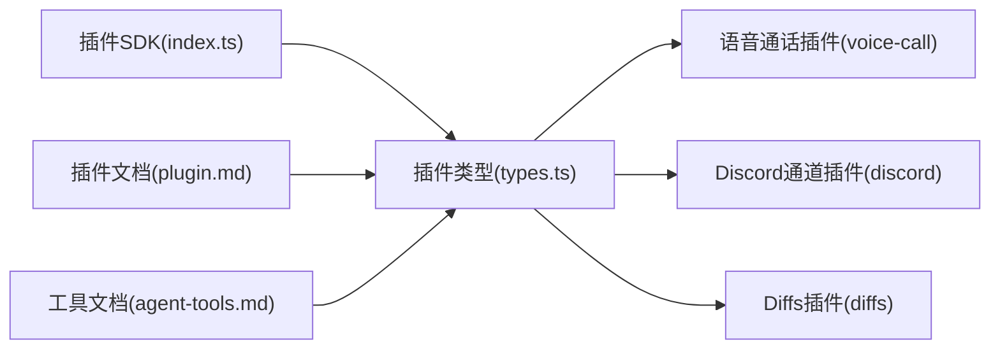

# 工具插件开发

<cite>
**本文档引用的文件**
- [index.ts](file://src/plugin-sdk/index.ts)
- [types.ts](file://src/plugins/types.ts)
- [plugin.md](file://docs/tools/plugin.md)
- [agent-tools.md](file://docs/plugins/agent-tools.md)
- [voice-call/index.ts](file://extensions/voice-call/index.ts)
- [voice-call/openclaw.plugin.json](file://extensions/voice-call/openclaw.plugin.json)
- [discord/index.ts](file://extensions/discord/index.ts)
- [diffs/openclaw.plugin.json](file://extensions/diffs/openclaw.plugin.json)
- [resolve-target-test-helpers.ts](file://extensions/shared/resolve-target-test-helpers.ts)
</cite>

## 目录
1. [简介](#简介)
2. [项目结构](#项目结构)
3. [核心组件](#核心组件)
4. [架构总览](#架构总览)
5. [详细组件分析](#详细组件分析)
6. [依赖关系分析](#依赖关系分析)
7. [性能考虑](#性能考虑)
8. [故障排查指南](#故障排查指南)
9. [结论](#结论)
10. [附录](#附录)

## 简介
本指南面向希望在 OpenClaw 中开发“工具插件”的工程师，系统讲解插件的设计理念、接口规范、执行模型与生命周期；深入说明工具的定义格式、参数校验、结果处理与错误恢复；并提供从工具注册、权限声明、安全检查到资源管理的完整开发流程。文档同时覆盖插件与代理系统的交互方式、会话绑定与状态同步，以及测试策略、调试方法与性能优化技巧，并给出可复用的开发模板与示例。

## 项目结构
OpenClaw 的插件体系由“插件 SDK”“插件类型与 API”“官方插件示例”“文档与规范”四部分组成：
- 插件 SDK：统一导出各类工具、通道适配器、运行时与安全辅助能力，供插件作者按需引入。
- 插件类型与 API：定义插件生命周期、工具接口、HTTP 路由、CLI 命令、服务等注册点与上下文。
- 官方插件示例：如语音通话插件、Discord 通道插件、差异查看插件等，展示真实实现与配置模式。
- 文档与规范：涵盖插件发现与加载、Manifest 结构、工具注册与策略、安全与缓存等。

图示来源
- [index.ts:1-826](file://src/plugin-sdk/index.ts#L1-L826)
- [types.ts:1-893](file://src/plugins/types.ts#L1-L893)
- [plugin.md:1-963](file://docs/tools/plugin.md#L1-L963)
- [agent-tools.md:1-100](file://docs/plugins/agent-tools.md#L1-L100)
- [voice-call/index.ts:1-543](file://extensions/voice-call/index.ts#L1-L543)
- [discord/index.ts:1-20](file://extensions/discord/index.ts#L1-L20)
- [diffs/openclaw.plugin.json:1-183](file://extensions/diffs/openclaw.plugin.json#L1-L183)

章节来源
- [index.ts:1-826](file://src/plugin-sdk/index.ts#L1-L826)
- [types.ts:1-893](file://src/plugins/types.ts#L1-L893)
- [plugin.md:1-963](file://docs/tools/plugin.md#L1-L963)
- [agent-tools.md:1-100](file://docs/plugins/agent-tools.md#L1-L100)

## 核心组件
- 插件 API（OpenClawPluginApi）：提供 registerTool、registerGatewayMethod、registerHttpRoute、registerChannel、registerCli、registerService、registerProvider、registerCommand、registerContextEngine、on 等注册与钩子能力。
- 工具类型（AnyAgentTool）：以 JSON Schema 定义参数，支持必选/可选工具与会话上下文注入。
- 运行时（PluginRuntime）：桥接核心运行环境，提供 TTS/STT 等能力。
- 钩子系统（PluginHookName）：贯穿代理生命周期，允许修改提示词、拦截消息、控制工具调用、管理会话与子代理。
- 通道插件（ChannelPlugin）：扩展新的聊天通道，统一配置、鉴权、发送与状态诊断。

章节来源
- [types.ts:263-306](file://src/plugins/types.ts#L263-L306)
- [types.ts:321-394](file://src/plugins/types.ts#L321-L394)
- [types.ts:593-620](file://src/plugins/types.ts#L593-L620)
- [types.ts:671-691](file://src/plugins/types.ts#L671-L691)
- [types.ts:693-770](file://src/plugins/types.ts#L693-L770)

## 架构总览
下图展示了工具插件在 OpenClaw 中的典型工作流：插件通过 API 注册工具与 RPC 方法；代理在推理过程中根据策略选择工具；工具执行后写入会话并触发相关钩子；插件还可注册 HTTP 路由、CLI 命令与后台服务。

图示来源
- [types.ts:263-306](file://src/plugins/types.ts#L263-L306)
- [types.ts:48-56](file://src/plugins/types.ts#L48-L56)
- [plugin.md:114-145](file://docs/tools/plugin.md#L114-L145)

## 详细组件分析

### 组件A：工具注册与执行模型
- 工具注册：通过 api.registerTool 或工厂函数 api.registerTool(factory, { optional: true }) 注册；可选工具需在配置中显式允许。
- 参数校验：使用 JSON Schema（TypeBox 或原生对象）定义参数结构，确保输入合法性。
- 执行上下文：工具执行时可访问会话键、请求者身份、沙箱标记等上下文信息。
- 结果处理：工具返回内容应符合 ReplyPayload 规范，支持文本与多模态内容。
- 错误恢复：工具抛出异常或返回错误字段时，框架负责捕获并记录，避免中断代理流程。

图示来源
- [agent-tools.md:19-36](file://docs/plugins/agent-tools.md#L19-L36)
- [agent-tools.md:38-63](file://docs/plugins/agent-tools.md#L38-L63)
- [types.ts:58-73](file://src/plugins/types.ts#L58-L73)
- [types.ts:174-182](file://src/plugins/types.ts#L174-L182)

章节来源
- [agent-tools.md:1-100](file://docs/plugins/agent-tools.md#L1-L100)
- [types.ts:58-73](file://src/plugins/types.ts#L58-L73)
- [types.ts:174-182](file://src/plugins/types.ts#L174-L182)

### 组件B：插件 API 与生命周期钩子
- 注册点：工具、RPC、HTTP、通道、CLI、服务、提供者、命令、上下文引擎等。
- 生命周期钩子：before_model_resolve、before_prompt_build、before_agent_start、llm_input/llm_output、message_*、tool_*、session_*、subagent_*、gateway_* 等。
- 钩子结果：可修改系统提示、拼接上下文、阻断工具调用、拦截消息写入、控制会话与子代理行为。

图示来源
- [types.ts:263-306](file://src/plugins/types.ts#L263-L306)
- [types.ts:321-394](file://src/plugins/types.ts#L321-L394)

章节来源
- [types.ts:263-306](file://src/plugins/types.ts#L263-L306)
- [types.ts:321-394](file://src/plugins/types.ts#L321-L394)

### 组件C：语音通话插件（示例）
该插件展示了：
- 配置 Schema 与 UI 提示：通过 openclaw.plugin.json 定义配置项与敏感字段标注。
- 工具与 RPC：注册 voice_call 工具与多个 Gateway RPC 方法（initiate、continue、speak、end、status、start）。
- CLI 与服务：注册 voicecall CLI 子命令与后台服务生命周期。
- 运行时与错误处理：延迟初始化运行时，失败时重置缓存并上报错误。

图示来源
- [voice-call/index.ts:146-375](file://extensions/voice-call/index.ts#L146-L375)
- [voice-call/index.ts:377-497](file://extensions/voice-call/index.ts#L377-L497)
- [voice-call/openclaw.plugin.json:162-611](file://extensions/voice-call/openclaw.plugin.json#L162-L611)

章节来源
- [voice-call/index.ts:1-543](file://extensions/voice-call/index.ts#L1-L543)
- [voice-call/openclaw.plugin.json:1-612](file://extensions/voice-call/openclaw.plugin.json#L1-L612)

### 组件D：通道插件（Discord 示例）
- 通道注册：通过 api.registerChannel({ plugin }) 注册通道插件。
- 运行时设置：setDiscordRuntime(api.runtime) 将运行时注入通道实现。
- 子代理钩子：注册与线程绑定相关的子代理钩子，支撑跨会话的状态同步。

图示来源
- [discord/index.ts:1-20](file://extensions/discord/index.ts#L1-L20)

章节来源
- [discord/index.ts:1-20](file://extensions/discord/index.ts#L1-L20)

### 组件E：只读工具插件（Diffs 示例）
- 插件 Manifest：通过 openclaw.plugin.json 定义 id、name、description、uiHints 与 configSchema。
- 配置策略：defaults 与 security 两组配置，支持主题、布局、远程访问等选项。
- 工具能力：提供只读 diff 查看与文件渲染能力，适合非侵入式工具集成。

图示来源
- [diffs/openclaw.plugin.json:1-183](file://extensions/diffs/openclaw.plugin.json#L1-L183)

章节来源
- [diffs/openclaw.plugin.json:1-183](file://extensions/diffs/openclaw.plugin.json#L1-L183)

### 组件F：目标解析与测试辅助（resolve-target）
- 测试辅助：installCommonResolveTargetErrorCases 提供常见目标解析错误用例，覆盖空值、空白、无白名单等边界场景。
- 实践建议：在编写通道适配器或工具时，优先使用该辅助函数快速覆盖边界条件，减少回归风险。

图示来源
- [resolve-target-test-helpers.ts:17-66](file://extensions/shared/resolve-target-test-helpers.ts#L17-L66)

章节来源
- [resolve-target-test-helpers.ts:1-67](file://extensions/shared/resolve-target-test-helpers.ts#L1-L67)

## 依赖关系分析
- 插件 SDK 作为统一入口，聚合了工具、通道、运行时与安全能力，供插件作者按需导入。
- 插件类型与 API 定义了插件的契约与生命周期，确保不同插件的一致性与可组合性。
- 官方插件示例展示了最佳实践：配置 Schema 与 UI 提示、工具注册与 RPC 模式、CLI 与服务生命周期、错误处理与资源清理。
- 文档与规范明确了插件发现、加载、安全与缓存策略，保障生产环境的稳定性与可审计性。

图示来源
- [index.ts:1-826](file://src/plugin-sdk/index.ts#L1-L826)
- [types.ts:1-893](file://src/plugins/types.ts#L1-L893)
- [plugin.md:1-963](file://docs/tools/plugin.md#L1-L963)
- [agent-tools.md:1-100](file://docs/plugins/agent-tools.md#L1-L100)
- [voice-call/index.ts:1-543](file://extensions/voice-call/index.ts#L1-L543)
- [discord/index.ts:1-20](file://extensions/discord/index.ts#L1-L20)
- [diffs/openclaw.plugin.json:1-183](file://extensions/diffs/openclaw.plugin.json#L1-L183)

章节来源
- [index.ts:1-826](file://src/plugin-sdk/index.ts#L1-L826)
- [types.ts:1-893](file://src/plugins/types.ts#L1-L893)
- [plugin.md:1-963](file://docs/tools/plugin.md#L1-L963)
- [agent-tools.md:1-100](file://docs/plugins/agent-tools.md#L1-L100)

## 性能考虑
- 配置 Schema 校验：在加载阶段进行，不执行插件代码，避免启动时的额外开销。
- 缓存与并发：插件发现与清单元数据采用短时进程内缓存；可通过环境变量禁用或调整缓存窗口。
- 工具执行：尽量将耗时操作异步化，避免阻塞代理主循环；必要时使用队列与限流。
- 资源管理：服务型插件应在 stop 阶段释放端口、连接与临时文件；运行时实例失败时及时重置缓存。
- 网络与安全：HTTP 路由与 Webhook 应启用签名验证与主机白名单，限制请求体大小与并发连接数。

## 故障排查指南
- 工具未生效
  - 检查工具是否注册为 optional，且已在 agents.tools.allow 中显式允许。
  - 确认工具名称与核心工具无冲突。
- RPC/HTTP 无法访问
  - 核对路径、匹配模式与认证级别；exact 与 prefix 冲突会被拒绝。
  - 确认插件路由未被替换或与其他插件冲突。
- 通道适配器问题
  - 使用 resolve-target 测试辅助覆盖常见边界；检查目标规范化与白名单匹配。
  - 对于 Discord 等通道，确认已正确设置运行时并注册子代理钩子。
- 运行时异常
  - 语音通话插件在失败时会重置运行时缓存，确保下次调用可重试。
  - 记录并上报错误，避免端口或资源泄漏。

章节来源
- [agent-tools.md:86-100](file://docs/plugins/agent-tools.md#L86-L100)
- [plugin.md:114-145](file://docs/tools/plugin.md#L114-L145)
- [voice-call/index.ts:169-197](file://extensions/voice-call/index.ts#L169-L197)
- [resolve-target-test-helpers.ts:17-66](file://extensions/shared/resolve-target-test-helpers.ts#L17-L66)

## 结论
OpenClaw 的工具插件体系以清晰的 API 契约、完善的生命周期钩子与严格的配置 Schema 为基础，既保证了扩展性，又兼顾了安全性与可维护性。通过官方示例与文档规范，开发者可以快速构建高质量的工具插件，并将其无缝集成到代理系统中，实现从简单只读工具到复杂通道与服务的全栈能力。

## 附录
- 开发模板
  - 工具注册模板：参考 [agent-tools.md:19-36](file://docs/plugins/agent-tools.md#L19-L36)
  - RPC 方法模板：参考 [voice-call/index.ts:230-375](file://extensions/voice-call/index.ts#L230-L375)
  - 通道插件模板：参考 [discord/index.ts:7-17](file://extensions/discord/index.ts#L7-L17)
  - 配置 Schema 模板：参考 [voice-call/openclaw.plugin.json:162-611](file://extensions/voice-call/openclaw.plugin.json#L162-L611) 与 [diffs/openclaw.plugin.json:68-181](file://extensions/diffs/openclaw.plugin.json#L68-L181)
- 最佳实践
  - 工具参数使用 JSON Schema 明确约束；对敏感字段标注 uiHints.sensitive。
  - 可选工具默认关闭，通过 agents.tools.allow 显式启用。
  - 在 registerService 的 stop 中清理资源，避免悬挂进程或端口占用。
  - 使用钩子系统拦截与增强代理行为，而非直接修改核心逻辑。