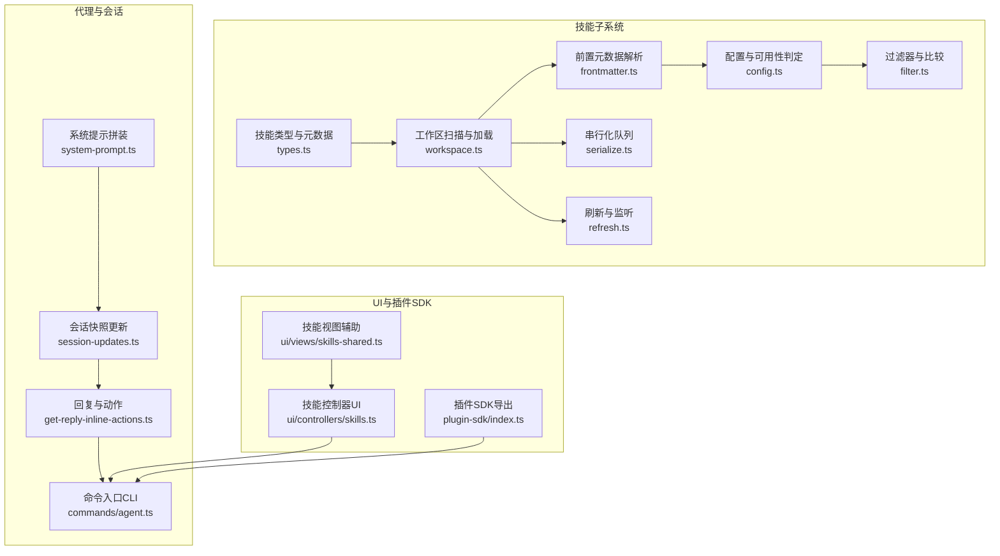
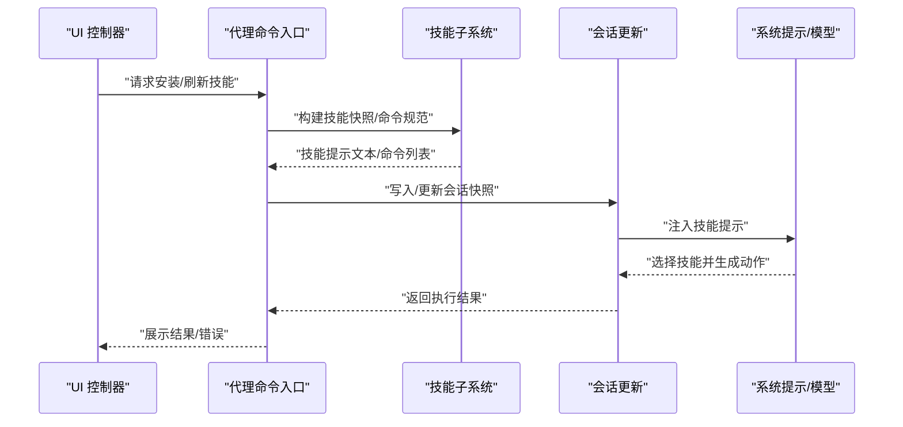
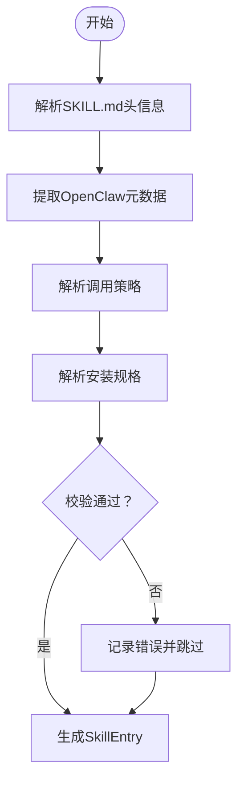
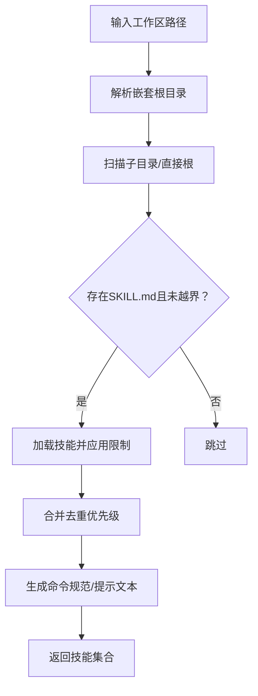
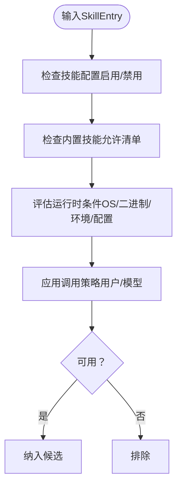
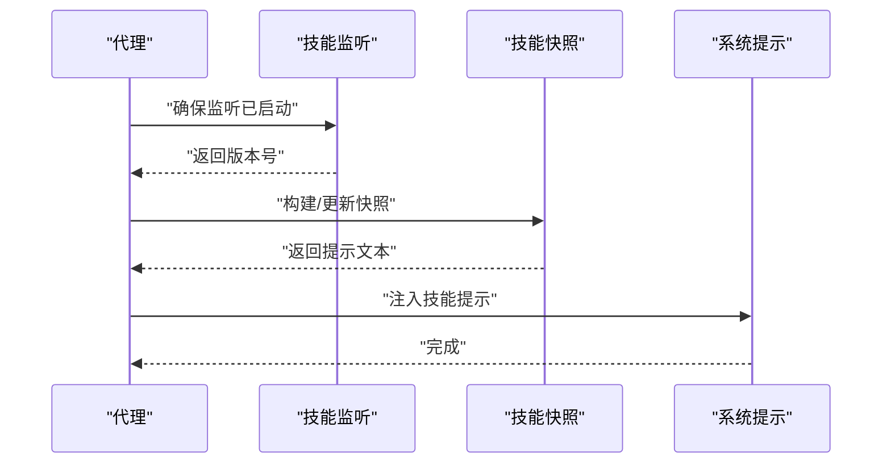
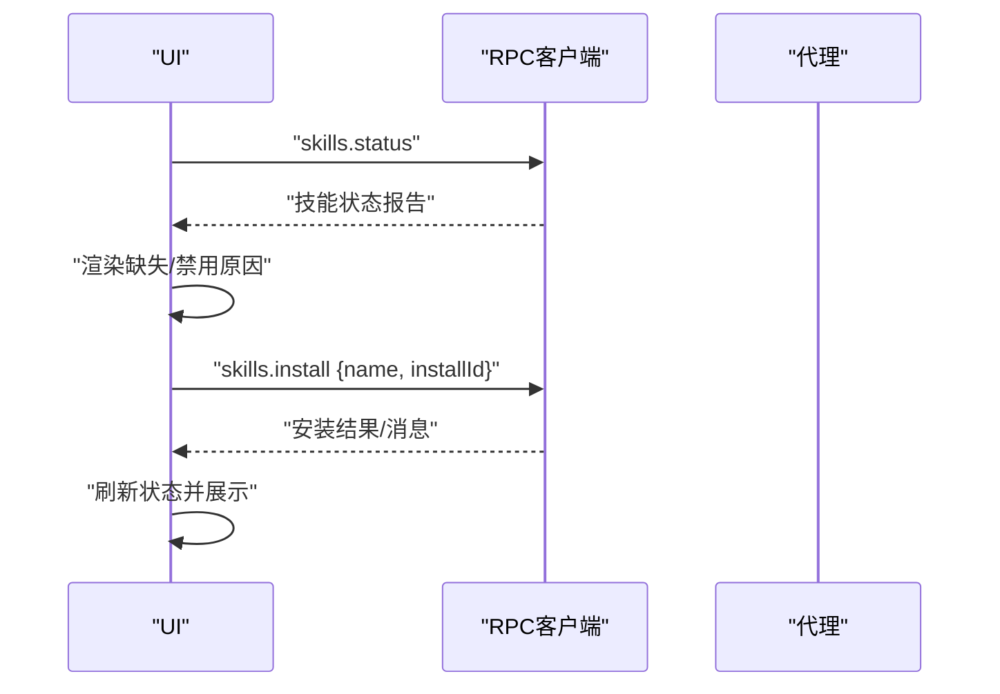
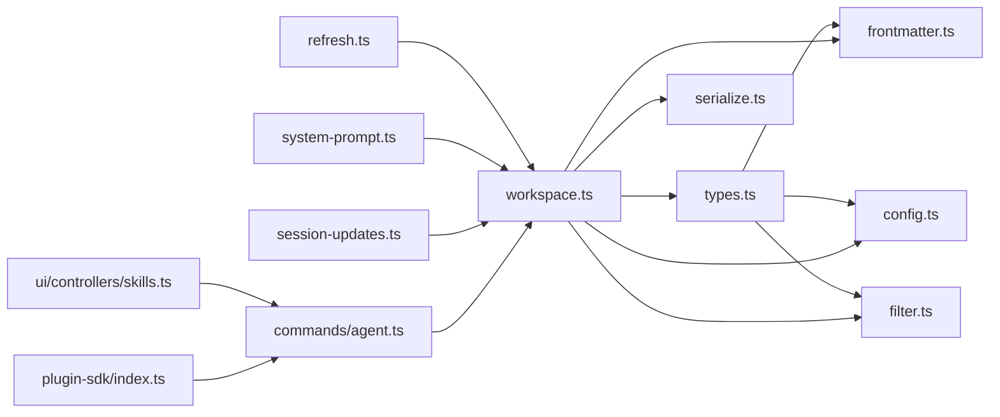

# 技能插件开发

<cite>
**本文引用的文件**   
- [src/agents/skills/types.ts](file://src/agents/skills/types.ts)
- [src/agents/skills/workspace.ts](file://src/agents/skills/workspace.ts)
- [src/agents/skills/frontmatter.ts](file://src/agents/skills/frontmatter.ts)
- [src/agents/skills/config.ts](file://src/agents/skills/config.ts)
- [src/agents/skills/filter.ts](file://src/agents/skills/filter.ts)
- [src/agents/skills/serialize.ts](file://src/agents/skills/serialize.ts)
- [src/agents/skills/refresh.ts](file://src/agents/skills/refresh.ts)
- [src/agents/skills/workspace.ts](file://src/agents/skills/workspace.ts)
- [src/agents/system-prompt.ts](file://src/agents/system-prompt.ts)
- [src/auto-reply/reply/session-updates.ts](file://src/auto-reply/reply/session-updates.ts)
- [src/auto-reply/reply/get-reply-inline-actions.ts](file://src/auto-reply/reply/get-reply-inline-actions.ts)
- [src/commands/agent.ts](file://src/commands/agent.ts)
- [ui/src/ui/controllers/skills.ts](file://ui/src/ui/controllers/skills.ts)
- [ui/src/ui/views/skills-shared.ts](file://ui/src/ui/views/skills-shared.ts)
- [skills/skill-creator/SKILL.md](file://skills/skill-creator/SKILL.md)
- [src/plugin-sdk/index.ts](file://src/plugin-sdk/index.ts)
</cite>

## 目录
1. [简介](#简介)
2. [项目结构](#项目结构)
3. [核心组件](#核心组件)
4. [架构总览](#架构总览)
5. [详细组件分析](#详细组件分析)
6. [依赖关系分析](#依赖关系分析)
7. [性能考量](#性能考量)
8. [故障排查指南](#故障排查指南)
9. [结论](#结论)
10. [附录](#附录)

## 简介
本文件面向OpenClaw技能插件开发者，系统性阐述技能插件的架构设计、生命周期管理、执行机制与系统集成方式。内容覆盖技能定义格式、配置Schema、参数传递、注册与依赖声明、权限控制、错误处理、与代理系统的会话与结果处理、测试与调试方法以及性能监控建议。文中所有技术细节均基于仓库源码进行解析，并通过图示帮助不同背景的读者快速理解。

## 项目结构
OpenClaw将“技能”抽象为可被代理识别、筛选、加载并按需执行的单元。技能由前端UI触发或由代理在对话上下文中自动选择，执行后返回结果供后续推理或输出使用。技能的发现、过滤、命令生成、快照构建与持久化、会话集成等能力由核心模块提供。

**图表来源**
- [src/agents/skills/types.ts:1-90](file://src/agents/skills/types.ts#L1-L90)
- [src/agents/skills/workspace.ts:1-120](file://src/agents/skills/workspace.ts#L1-L120)
- [src/agents/skills/frontmatter.ts:1-60](file://src/agents/skills/frontmatter.ts#L1-L60)
- [src/agents/skills/config.ts:1-60](file://src/agents/skills/config.ts#L1-L60)
- [src/agents/skills/filter.ts:1-34](file://src/agents/skills/filter.ts#L1-L34)
- [src/agents/skills/serialize.ts:1-14](file://src/agents/skills/serialize.ts#L1-L14)
- [src/agents/skills/refresh.ts:44-82](file://src/agents/skills/refresh.ts#L44-L82)
- [src/agents/system-prompt.ts:20-36](file://src/agents/system-prompt.ts#L20-L36)
- [src/auto-reply/reply/session-updates.ts:120-239](file://src/auto-reply/reply/session-updates.ts#L120-L239)
- [src/auto-reply/reply/get-reply-inline-actions.ts:116-156](file://src/auto-reply/reply/get-reply-inline-actions.ts#L116-L156)
- [src/commands/agent.ts:865-906](file://src/commands/agent.ts#L865-L906)
- [ui/src/ui/controllers/skills.ts:39-157](file://ui/src/ui/controllers/skills.ts#L39-L157)
- [ui/src/ui/views/skills-shared.ts:1-52](file://ui/src/ui/views/skills-shared.ts#L1-L52)
- [src/plugin-sdk/index.ts:645-646](file://src/plugin-sdk/index.ts#L645-L646)

**章节来源**
- [src/agents/skills/workspace.ts:1-120](file://src/agents/skills/workspace.ts#L1-L120)
- [src/agents/skills/types.ts:1-90](file://src/agents/skills/types.ts#L1-L90)
- [src/plugin-sdk/index.ts:645-646](file://src/plugin-sdk/index.ts#L645-L646)

## 核心组件
- 技能类型与元数据：定义技能安装规格、调用策略、命令分发、快照结构等。
- 工作区扫描与加载：从多源目录加载技能，去重合并，限制数量与大小，生成命令规范与提示文本。
- 前置元数据解析：解析SKILL.md的YAML头信息，提取OpenClaw元数据与调用策略。
- 配置与可用性判定：结合运行时平台、环境变量、配置项与允许清单决定技能是否可用。
- 过滤器与比较：对技能名称列表进行标准化与比较，用于快照版本判断与增量更新。
- 串行化队列：确保同一目标的并发同步任务串行执行，避免竞态。
- 刷新与监听：监听工作区变化，计算版本号，触发快照重建。
- 系统提示拼装：将技能列表注入系统提示，指导模型选择合适的技能。
- 会话与回复：在会话中构建/更新技能快照，驱动后续动作与输出。
- UI与插件SDK：提供技能安装、状态查询、消息展示与命令分发接口。

**章节来源**
- [src/agents/skills/types.ts:1-90](file://src/agents/skills/types.ts#L1-L90)
- [src/agents/skills/workspace.ts:292-527](file://src/agents/skills/workspace.ts#L292-L527)
- [src/agents/skills/frontmatter.ts:186-223](file://src/agents/skills/frontmatter.ts#L186-L223)
- [src/agents/skills/config.ts:71-104](file://src/agents/skills/config.ts#L71-L104)
- [src/agents/skills/filter.ts:1-34](file://src/agents/skills/filter.ts#L1-L34)
- [src/agents/skills/serialize.ts:1-14](file://src/agents/skills/serialize.ts#L1-L14)
- [src/agents/skills/refresh.ts:44-82](file://src/agents/skills/refresh.ts#L44-L82)
- [src/agents/system-prompt.ts:20-36](file://src/agents/system-prompt.ts#L20-L36)
- [src/auto-reply/reply/session-updates.ts:120-239](file://src/auto-reply/reply/session-updates.ts#L120-L239)
- [src/auto-reply/reply/get-reply-inline-actions.ts:116-156](file://src/auto-reply/reply/get-reply-inline-actions.ts#L116-L156)
- [src/commands/agent.ts:865-906](file://src/commands/agent.ts#L865-L906)
- [ui/src/ui/controllers/skills.ts:39-157](file://ui/src/ui/controllers/skills.ts#L39-L157)
- [ui/src/ui/views/skills-shared.ts:1-52](file://ui/src/ui/views/skills-shared.ts#L1-L52)

## 架构总览
技能插件体系围绕“发现—评估—构建—执行—反馈”的闭环展开。UI负责触发安装与状态查询；核心模块负责扫描与构建技能快照；代理在会话中读取快照，按策略选择技能并执行；执行结果回传到会话，参与后续推理与输出。

**图表来源**
- [ui/src/ui/controllers/skills.ts:125-157](file://ui/src/ui/controllers/skills.ts#L125-L157)
- [src/commands/agent.ts:865-906](file://src/commands/agent.ts#L865-L906)
- [src/agents/skills/workspace.ts:567-584](file://src/agents/skills/workspace.ts#L567-L584)
- [src/auto-reply/reply/session-updates.ts:120-239](file://src/auto-reply/reply/session-updates.ts#L120-L239)
- [src/agents/system-prompt.ts:20-36](file://src/agents/system-prompt.ts#L20-L36)

## 详细组件分析

### 组件A：技能定义与元数据（SKILL.md 与元数据）
- 定义格式：每个技能目录包含必需的SKILL.md与可选资源（scripts、references、assets）。SKILL.md包含YAML头信息（name、description）与正文说明。
- 元数据解析：解析OpenClaw特定字段（如requires、install、os、primaryEnv、skillKey等），并推导调用策略（是否允许用户触发、是否允许模型触发）。
- 安装规格：支持brew、node、go、uv、download等多种安装方式，包含校验与归一化逻辑，确保安全与一致性。

**图表来源**
- [skills/skill-creator/SKILL.md:42-68](file://skills/skill-creator/SKILL.md#L42-L68)
- [src/agents/skills/frontmatter.ts:186-223](file://src/agents/skills/frontmatter.ts#L186-L223)
- [src/agents/skills/types.ts:19-38](file://src/agents/skills/types.ts#L19-L38)

**章节来源**
- [skills/skill-creator/SKILL.md:42-68](file://skills/skill-creator/SKILL.md#L42-L68)
- [src/agents/skills/frontmatter.ts:186-223](file://src/agents/skills/frontmatter.ts#L186-L223)
- [src/agents/skills/types.ts:19-38](file://src/agents/skills/types.ts#L19-L38)

### 组件B：技能加载与工作区扫描
- 多源加载：从内置、额外目录、托管、个人与项目级、工作区等多处目录加载技能，按优先级合并，去重保留最新。
- 路径安全：严格检查路径逃逸风险，仅保留真实存在于根目录内的条目。
- 数量与大小限制：对候选数量、单文件大小、提示文本长度进行限制，防止资源滥用。
- 命令规范生成：为用户可触发的技能生成命令名、描述与可选的工具分发策略。

**图表来源**
- [src/agents/skills/workspace.ts:292-527](file://src/agents/skills/workspace.ts#L292-L527)
- [src/agents/skills/workspace.ts:567-591](file://src/agents/skills/workspace.ts#L567-L591)
- [src/agents/skills/workspace.ts:775-882](file://src/agents/skills/workspace.ts#L775-L882)

**章节来源**
- [src/agents/skills/workspace.ts:292-527](file://src/agents/skills/workspace.ts#L292-L527)
- [src/agents/skills/workspace.ts:567-591](file://src/agents/skills/workspace.ts#L567-L591)
- [src/agents/skills/workspace.ts:775-882](file://src/agents/skills/workspace.ts#L775-L882)

### 组件C：配置与可用性判定
- 允许清单：支持对“内置技能”设置允许清单，仅允许白名单中的技能生效。
- 运行时评估：根据OS、二进制依赖、环境变量、配置项与远程平台能力综合判定技能是否可用。
- 策略开关：支持禁用模型触发与用户触发，便于精细化控制。

**图表来源**
- [src/agents/skills/config.ts:71-104](file://src/agents/skills/config.ts#L71-L104)
- [src/agents/skills/frontmatter.ts:208-218](file://src/agents/skills/frontmatter.ts#L208-L218)

**章节来源**
- [src/agents/skills/config.ts:71-104](file://src/agents/skills/config.ts#L71-L104)
- [src/agents/skills/frontmatter.ts:208-218](file://src/agents/skills/frontmatter.ts#L208-L218)

### 组件D：会话与技能快照
- 快照版本：通过版本号与变更监听，判断是否需要重建技能快照。
- 会话集成：在首次回合或需要时构建快照，必要时写入会话存储，保证后续推理可见。
- 提示注入：将技能提示文本注入系统提示，指导模型选择合适技能。

**图表来源**
- [src/auto-reply/reply/session-updates.ts:120-239](file://src/auto-reply/reply/session-updates.ts#L120-L239)
- [src/agents/system-prompt.ts:20-36](file://src/agents/system-prompt.ts#L20-L36)
- [src/agents/skills/refresh.ts:44-82](file://src/agents/skills/refresh.ts#L44-L82)

**章节来源**
- [src/auto-reply/reply/session-updates.ts:120-239](file://src/auto-reply/reply/session-updates.ts#L120-L239)
- [src/agents/system-prompt.ts:20-36](file://src/agents/system-prompt.ts#L20-L36)
- [src/agents/skills/refresh.ts:44-82](file://src/agents/skills/refresh.ts#L44-L82)

### 组件E：UI与安装流程
- 状态查询：通过RPC请求获取技能状态报告，渲染缺失依赖、禁用原因等。
- 安装流程：发起安装请求，等待完成并刷新状态，展示成功或错误消息。
- 错误处理：统一捕获异常，区分网络、超时与业务错误，向用户反馈。

**图表来源**
- [ui/src/ui/controllers/skills.ts:46-68](file://ui/src/ui/controllers/skills.ts#L46-L68)
- [ui/src/ui/controllers/skills.ts:125-157](file://ui/src/ui/controllers/skills.ts#L125-L157)
- [ui/src/ui/views/skills-shared.ts:1-52](file://ui/src/ui/views/skills-shared.ts#L1-L52)

**章节来源**
- [ui/src/ui/controllers/skills.ts:46-68](file://ui/src/ui/controllers/skills.ts#L46-L68)
- [ui/src/ui/controllers/skills.ts:125-157](file://ui/src/ui/controllers/skills.ts#L125-L157)
- [ui/src/ui/views/skills-shared.ts:1-52](file://ui/src/ui/views/skills-shared.ts#L1-L52)

## 依赖关系分析
- 模块内聚：技能类型、加载、解析、配置与过滤紧密耦合，共同构成“技能实体”的完整生命周期。
- 外部依赖：依赖外部库进行Markdown解析、路径安全检查、配置评估与运行时平台检测。
- 并发控制：通过串行化队列避免并发复制/同步导致的竞态。
- 监听与缓存：通过版本号与监听器减少不必要的全量扫描，提升性能。

**图表来源**
- [src/agents/skills/types.ts:1-90](file://src/agents/skills/types.ts#L1-L90)
- [src/agents/skills/workspace.ts:1-120](file://src/agents/skills/workspace.ts#L1-L120)
- [src/agents/skills/frontmatter.ts:1-60](file://src/agents/skills/frontmatter.ts#L1-L60)
- [src/agents/skills/config.ts:1-60](file://src/agents/skills/config.ts#L1-L60)
- [src/agents/skills/filter.ts:1-34](file://src/agents/skills/filter.ts#L1-L34)
- [src/agents/skills/serialize.ts:1-14](file://src/agents/skills/serialize.ts#L1-L14)
- [src/agents/skills/refresh.ts:44-82](file://src/agents/skills/refresh.ts#L44-L82)
- [src/agents/system-prompt.ts:20-36](file://src/agents/system-prompt.ts#L20-L36)
- [src/auto-reply/reply/session-updates.ts:120-239](file://src/auto-reply/reply/session-updates.ts#L120-L239)
- [src/commands/agent.ts:865-906](file://src/commands/agent.ts#L865-L906)
- [ui/src/ui/controllers/skills.ts:39-157](file://ui/src/ui/controllers/skills.ts#L39-L157)
- [src/plugin-sdk/index.ts:645-646](file://src/plugin-sdk/index.ts#L645-L646)

**章节来源**
- [src/agents/skills/workspace.ts:1-120](file://src/agents/skills/workspace.ts#L1-L120)
- [src/agents/skills/serialize.ts:1-14](file://src/agents/skills/serialize.ts#L1-L14)
- [src/agents/skills/refresh.ts:44-82](file://src/agents/skills/refresh.ts#L44-L82)
- [src/agents/system-prompt.ts:20-36](file://src/agents/system-prompt.ts#L20-L36)
- [src/auto-reply/reply/session-updates.ts:120-239](file://src/auto-reply/reply/session-updates.ts#L120-L239)
- [src/commands/agent.ts:865-906](file://src/commands/agent.ts#L865-L906)
- [ui/src/ui/controllers/skills.ts:39-157](file://ui/src/ui/controllers/skills.ts#L39-L157)
- [src/plugin-sdk/index.ts:645-646](file://src/plugin-sdk/index.ts#L645-L646)

## 性能考量
- 扫描限制：对候选数量、单文件大小与提示文本长度设定上限，避免大体量技能影响响应时间。
- 路径安全：严格限制扫描范围，避免越界与恶意路径导致的I/O开销。
- 版本化与增量：通过版本号与监听器避免全量扫描，仅在变更时重建快照。
- 串行化：对高成本操作（如复制/同步）使用串行化队列，降低并发冲突与磁盘争用。
- 提示压缩：对路径进行紧凑化处理，减少系统提示token占用。

**章节来源**
- [src/agents/skills/workspace.ts:91-149](file://src/agents/skills/workspace.ts#L91-L149)
- [src/agents/skills/workspace.ts:187-221](file://src/agents/skills/workspace.ts#L187-L221)
- [src/agents/skills/workspace.ts:529-565](file://src/agents/skills/workspace.ts#L529-L565)
- [src/agents/skills/serialize.ts:1-14](file://src/agents/skills/serialize.ts#L1-L14)
- [src/agents/skills/refresh.ts:44-82](file://src/agents/skills/refresh.ts#L44-L82)

## 故障排查指南
- 安装失败：检查安装规格合法性（包名、URL、模块等），确认平台与依赖满足要求。
- 可见性问题：确认技能未被禁用、不在允许清单之外、未被过滤器排除。
- 会话未更新：检查监听是否启动、版本号是否递增、会话存储是否写入成功。
- UI无响应：检查RPC连接状态、请求超时与错误消息，关注网络与权限问题。
- 权限与沙箱：注意路径安全与跨源访问限制，确保资源位于受控目录内。

**章节来源**
- [src/agents/skills/frontmatter.ts:111-184](file://src/agents/skills/frontmatter.ts#L111-L184)
- [src/agents/skills/config.ts:71-104](file://src/agents/skills/config.ts#L71-L104)
- [src/agents/skills/refresh.ts:44-82](file://src/agents/skills/refresh.ts#L44-L82)
- [ui/src/ui/controllers/skills.ts:125-157](file://ui/src/ui/controllers/skills.ts#L125-L157)

## 结论
OpenClaw的技能插件体系以“安全、可控、可观测”为核心设计原则，通过严格的元数据解析、运行时评估与路径安全检查，确保技能在多源环境下稳定加载；通过版本化与监听机制，实现高效增量更新；通过系统提示注入与会话快照，使技能在代理推理链路中自然融入。开发者遵循本文档的定义格式、配置Schema与开发流程，即可快速构建高质量的技能插件并顺利集成到OpenClaw生态中。

## 附录

### 技能定义格式与Schema要点
- 必需文件：SKILL.md（含YAML头信息与正文说明）
- 可选资源：scripts（脚本）、references（参考文档）、assets（输出资源）
- OpenClaw元数据字段：name、description、emoji、homepage、os、always、skillKey、primaryEnv、requires、install
- 调用策略：user-invocable（是否允许用户触发）、disable-model-invocation（是否允许模型触发）

**章节来源**
- [skills/skill-creator/SKILL.md:42-68](file://skills/skill-creator/SKILL.md#L42-L68)
- [src/agents/skills/frontmatter.ts:186-223](file://src/agents/skills/frontmatter.ts#L186-L223)
- [src/agents/skills/types.ts:19-38](file://src/agents/skills/types.ts#L19-L38)

### 开发流程与最佳实践
- 注册与依赖声明：在SKILL.md中声明依赖（二进制、环境变量、配置项），必要时提供install规格。
- 权限控制：合理使用允许清单与运行时评估，避免内置技能被滥用。
- 参数传递：若采用工具分发，确保命令参数模式与工具签名一致。
- 错误处理：在UI层统一捕获并展示错误，提供清晰的修复建议。
- 测试与调试：利用UI的安装与状态查询功能验证技能可用性；结合日志与诊断事件定位问题。

**章节来源**
- [src/agents/skills/frontmatter.ts:111-184](file://src/agents/skills/frontmatter.ts#L111-L184)
- [src/agents/skills/config.ts:71-104](file://src/agents/skills/config.ts#L71-L104)
- [ui/src/ui/controllers/skills.ts:125-157](file://ui/src/ui/controllers/skills.ts#L125-L157)
- [src/plugin-sdk/index.ts:645-646](file://src/plugin-sdk/index.ts#L645-L646)