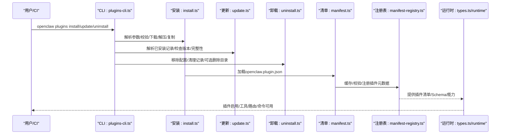
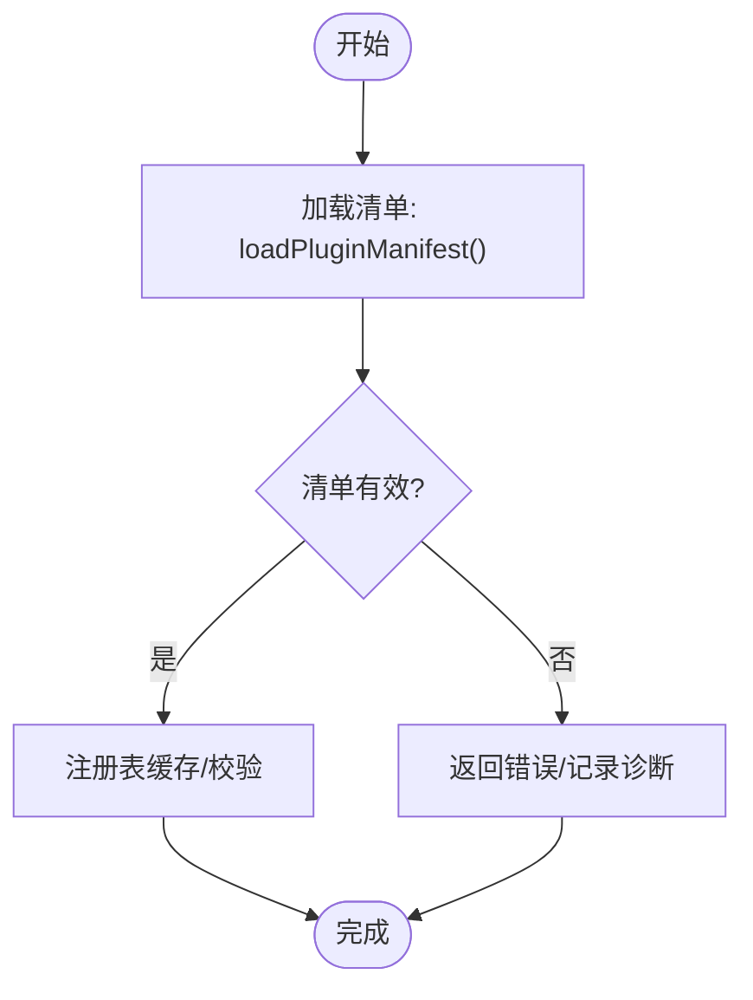
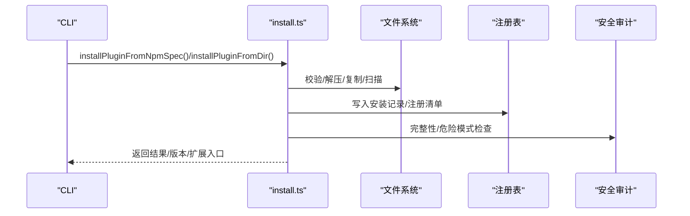
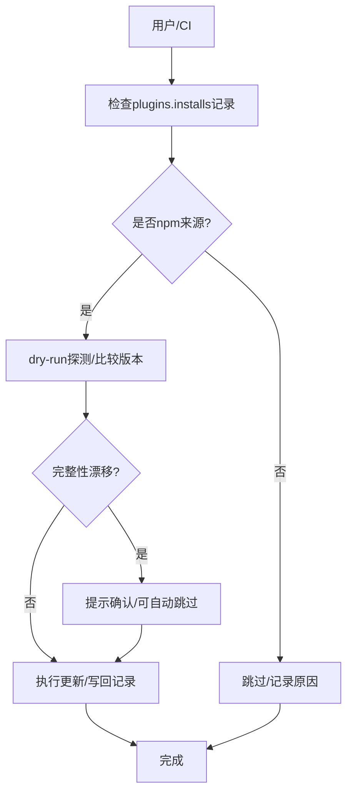
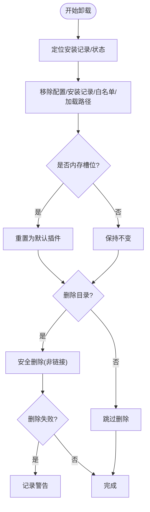
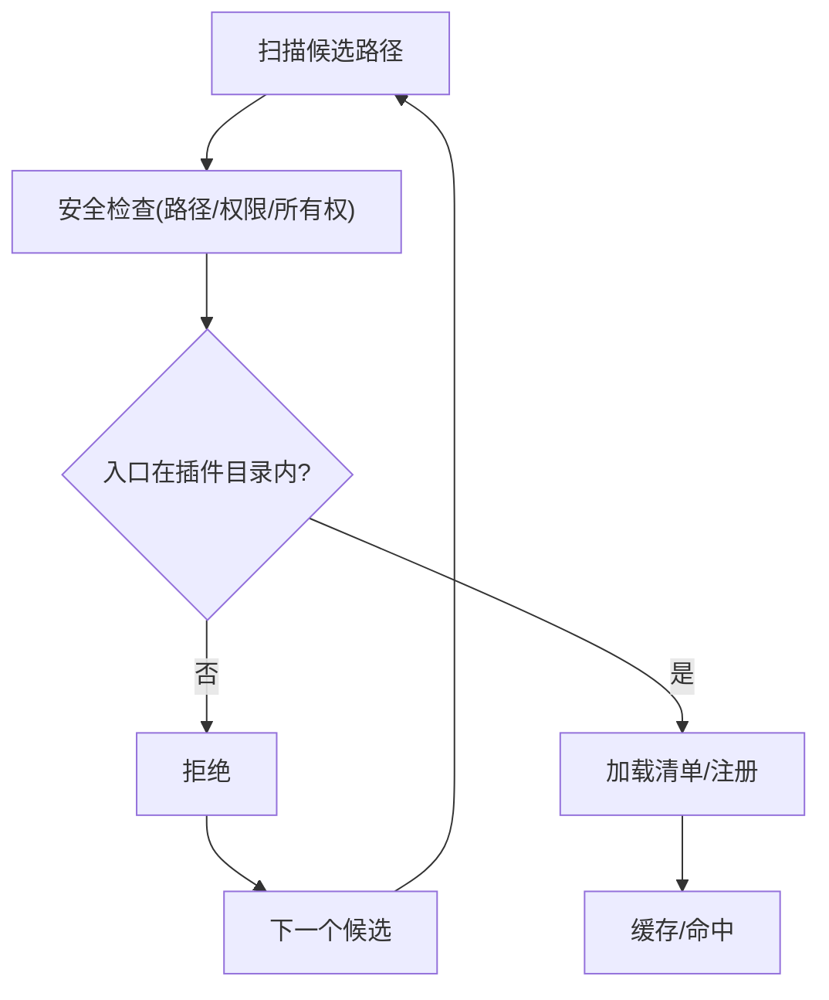
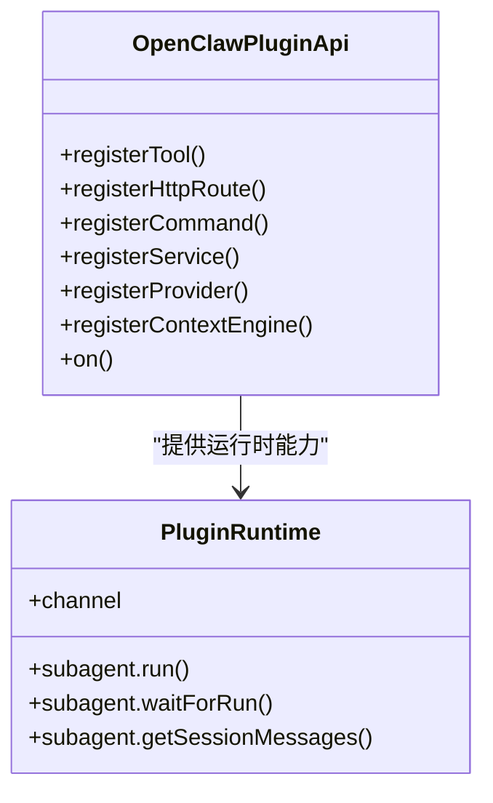
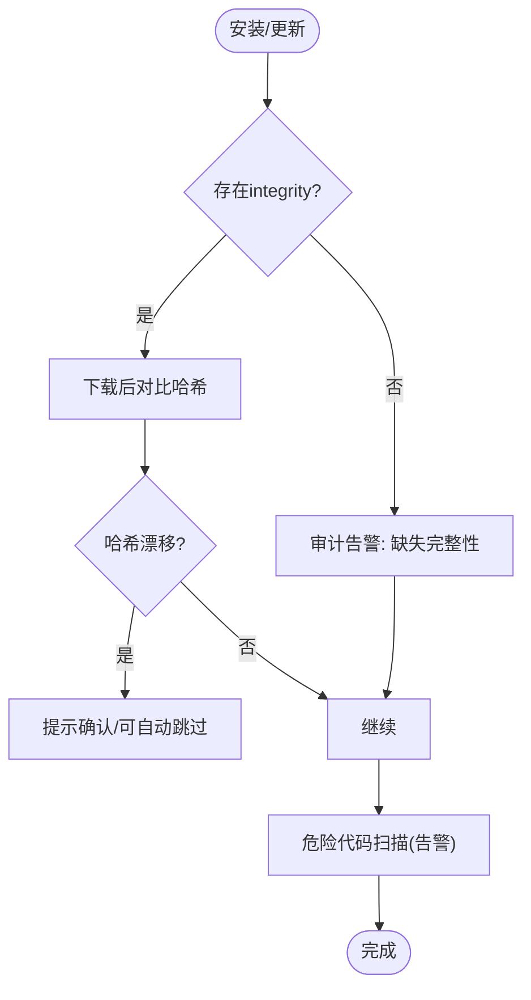
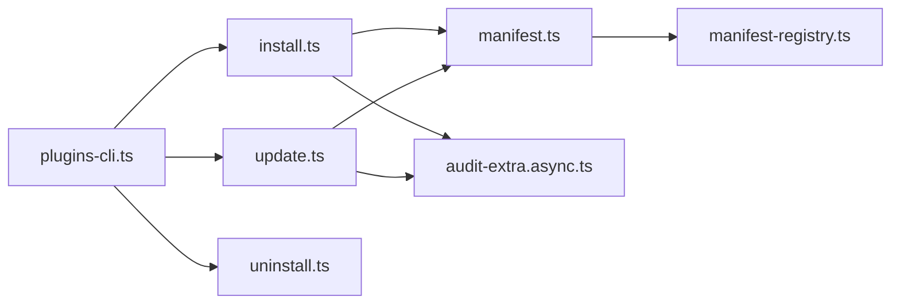

# 插件分发与管理

<cite>
**本文档引用的文件**
- [docs/plugins/manifest.md](file://docs/plugins/manifest.md)
- [docs/cli/plugins.md](file://docs/cli/plugins.md)
- [docs/tools/plugin.md](file://docs/tools/plugin.md)
- [src/plugin-sdk/index.ts](file://src/plugin-sdk/index.ts)
- [src/plugins/types.ts](file://src/plugins/types.ts)
- [src/plugins/runtime/types.ts](file://src/plugins/runtime/types.ts)
- [src/plugins/install.ts](file://src/plugins/install.ts)
- [src/plugins/update.ts](file://src/plugins/update.ts)
- [src/plugins/uninstall.ts](file://src/plugins/uninstall.ts)
- [src/plugins/manifest.ts](file://src/plugins/manifest.ts)
- [src/plugins/manifest-registry.ts](file://src/plugins/manifest-registry.ts)
- [src/cli/plugins-cli.ts](file://src/cli/plugins-cli.ts)
- [src/security/audit.test.ts](file://src/security/audit.test.ts)
- [src/security/audit-extra.async.ts](file://src/security/audit-extra.async.ts)
- [extensions/acpx/openclaw.plugin.json](file://extensions/acpx/openclaw.plugin.json)
- [extensions/diffs/openclaw.plugin.json](file://extensions/diffs/openclaw.plugin.json)
</cite>

## 目录
1. [简介](#简介)
2. [项目结构](#项目结构)
3. [核心组件](#核心组件)
4. [架构总览](#架构总览)
5. [详细组件分析](#详细组件分析)
6. [依赖关系分析](#依赖关系分析)
7. [性能考量](#性能考量)
8. [故障排查指南](#故障排查指南)
9. [结论](#结论)
10. [附录](#附录)

## 简介
本文件面向OpenClaw插件分发与管理的运营与技术读者，系统化阐述插件的分发机制、版本管理与更新策略、插件注册表与元数据管理、依赖解析、安装/卸载/升级流程、安全验证与信任模型、插件市场运营模式与质量保障、合规与最佳实践，以及插件生命周期与废弃处理策略。内容基于仓库中的官方文档与源码实现，确保可操作性与可追溯性。

## 项目结构
OpenClaw通过“清单驱动 + 配置验证 + 安全扫描”的方式管理插件生态：
- 文档层：提供插件清单规范、CLI命令参考与插件系统概览
- 核心层：插件类型定义、运行时接口、安装/更新/卸载逻辑
- 安全层：完整性校验、审计告警、路径与权限安全检查
- 扩展层：官方扩展示例与清单样例

```mermaid
graph TB
subgraph "文档"
D1["docs/plugins/manifest.md"]
D2["docs/cli/plugins.md"]
D3["docs/tools/plugin.md"]
end
subgraph "核心实现"
C1["src/plugins/types.ts"]
C2["src/plugins/runtime/types.ts"]
C3["src/plugin-sdk/index.ts"]
C4["src/plugins/manifest.ts"]
C5["src/plugins/manifest-registry.ts"]
C6["src/plugins/install.ts"]
C7["src/plugins/update.ts"]
C8["src/plugins/uninstall.ts"]
end
subgraph "CLI"
CLI["src/cli/plugins-cli.ts"]
end
subgraph "安全审计"
S1["src/security/audit.test.ts"]
S2["src/security/audit-extra.async.ts"]
end
subgraph "扩展示例"
E1["extensions/acpx/openclaw.plugin.json"]
E2["extensions/diffs/openclaw.plugin.json"]
end
D1 --> C4
D2 --> CLI
D3 --> C1
C1 --> C6
C1 --> C7
C1 --> C8
C4 --> C5
C6 --> S2
C7 --> S2
CLI --> C6
CLI --> C7
CLI --> C8
S1 --> S2
E1 --> C4
E2 --> C4
```

图表来源
- [docs/plugins/manifest.md:1-76](file://docs/plugins/manifest.md#L1-L76)
- [docs/cli/plugins.md:1-103](file://docs/cli/plugins.md#L1-L103)
- [docs/tools/plugin.md:1-800](file://docs/tools/plugin.md#L1-L800)
- [src/plugins/types.ts:1-893](file://src/plugins/types.ts#L1-L893)
- [src/plugins/runtime/types.ts:1-64](file://src/plugins/runtime/types.ts#L1-L64)
- [src/plugin-sdk/index.ts:1-826](file://src/plugin-sdk/index.ts#L1-L826)
- [src/plugins/manifest.ts:45-88](file://src/plugins/manifest.ts#L45-L88)
- [src/plugins/manifest-registry.ts:170-201](file://src/plugins/manifest-registry.ts#L170-L201)
- [src/plugins/install.ts:1-573](file://src/plugins/install.ts#L1-L573)
- [src/plugins/update.ts:1-501](file://src/plugins/update.ts#L1-L501)
- [src/plugins/uninstall.ts:1-237](file://src/plugins/uninstall.ts#L1-L237)
- [src/cli/plugins-cli.ts:584-691](file://src/cli/plugins-cli.ts#L584-L691)
- [src/security/audit.test.ts:2873-2961](file://src/security/audit.test.ts#L2873-L2961)
- [src/security/audit-extra.async.ts:713-727](file://src/security/audit-extra.async.ts#L713-L727)
- [extensions/acpx/openclaw.plugin.json:1-106](file://extensions/acpx/openclaw.plugin.json#L1-L106)
- [extensions/diffs/openclaw.plugin.json:1-183](file://extensions/diffs/openclaw.plugin.json#L1-L183)

章节来源
- [docs/plugins/manifest.md:1-76](file://docs/plugins/manifest.md#L1-L76)
- [docs/cli/plugins.md:1-103](file://docs/cli/plugins.md#L1-L103)
- [docs/tools/plugin.md:1-800](file://docs/tools/plugin.md#L1-L800)

## 核心组件
- 插件清单与Schema：每个插件必须提供openclaw.plugin.json，包含id与configSchema；清单用于发现与严格配置验证，不执行插件代码。
- 插件类型与运行时：定义插件API、工具、HTTP路由、命令、服务、上下文引擎等能力边界与生命周期钩子。
- 安装/更新/卸载：支持npm/spec安装、本地目录/归档/文件安装、链接开发模式、完整性校验与审计提示。
- 注册表与发现：按优先级扫描配置路径、工作区、全局、内置扩展；支持包打包与入口白名单；缓存加速发现。
- 安全与信任：完整性哈希、审计告警、路径安全检查、权限与脚本安全策略。

章节来源
- [src/plugins/types.ts:1-893](file://src/plugins/types.ts#L1-L893)
- [src/plugins/runtime/types.ts:1-64](file://src/plugins/runtime/types.ts#L1-L64)
- [src/plugin-sdk/index.ts:1-826](file://src/plugin-sdk/index.ts#L1-L826)
- [src/plugins/install.ts:1-573](file://src/plugins/install.ts#L1-L573)
- [src/plugins/update.ts:1-501](file://src/plugins/update.ts#L1-L501)
- [src/plugins/uninstall.ts:1-237](file://src/plugins/uninstall.ts#L1-L237)
- [src/plugins/manifest.ts:45-88](file://src/plugins/manifest.ts#L45-L88)
- [src/plugins/manifest-registry.ts:170-201](file://src/plugins/manifest-registry.ts#L170-L201)

## 架构总览
下图展示插件从“安装/更新/卸载”到“运行时加载与验证”的端到端流程。



图表来源
- [src/cli/plugins-cli.ts:584-691](file://src/cli/plugins-cli.ts#L584-L691)
- [src/plugins/install.ts:1-573](file://src/plugins/install.ts#L1-L573)
- [src/plugins/update.ts:1-501](file://src/plugins/update.ts#L1-L501)
- [src/plugins/uninstall.ts:1-237](file://src/plugins/uninstall.ts#L1-L237)
- [src/plugins/manifest.ts:45-88](file://src/plugins/manifest.ts#L45-L88)
- [src/plugins/manifest-registry.ts:170-201](file://src/plugins/manifest-registry.ts#L170-L201)
- [src/plugins/types.ts:1-893](file://src/plugins/types.ts#L1-L893)

## 详细组件分析

### 插件清单与元数据管理
- 清单要求：必须包含id与configSchema；未知channels键或未知插件id在配置验证阶段即报错；禁用插件的配置会保留并告警。
- 元数据注册：按优先级扫描候选根目录，加载openclaw.plugin.json，校验路径安全性与硬链接限制，缓存以提升启动性能。
- UI提示：支持uiHints增强控制界面体验（标签、占位符、敏感字段标记）。



图表来源
- [src/plugins/manifest.ts:45-88](file://src/plugins/manifest.ts#L45-L88)
- [src/plugins/manifest-registry.ts:170-201](file://src/plugins/manifest-registry.ts#L170-L201)
- [docs/plugins/manifest.md:53-76](file://docs/plugins/manifest.md#L53-L76)

章节来源
- [docs/plugins/manifest.md:1-76](file://docs/plugins/manifest.md#L1-L76)
- [src/plugins/manifest.ts:45-88](file://src/plugins/manifest.ts#L45-L88)
- [src/plugins/manifest-registry.ts:170-201](file://src/plugins/manifest-registry.ts#L170-L201)

### 插件安装与依赖解析
- 支持多种来源：本地目录/归档/文件、npm包、链接开发模式；归档支持.zip/.tgz/.tar/.tar.gz。
- 依赖安装：npm安装时忽略脚本，避免潜在风险；扫描dangerous代码模式（仅告警，不阻断）。
- 完整性与版本：若存在integrity元数据，更新时进行完整性漂移检测；未固定版本或缺少integrity会触发审计告警。
- 安装路径：根据插件id生成安全目标目录，拒绝路径穿越；链接模式不删除源目录。



图表来源
- [src/plugins/install.ts:1-573](file://src/plugins/install.ts#L1-L573)
- [src/security/audit-extra.async.ts:713-727](file://src/security/audit-extra.async.ts#L713-L727)
- [src/security/audit.test.ts:2902-2937](file://src/security/audit.test.ts#L2902-L2937)

章节来源
- [docs/cli/plugins.md:39-71](file://docs/cli/plugins.md#L39-L71)
- [src/plugins/install.ts:1-573](file://src/plugins/install.ts#L1-L573)
- [src/security/audit.test.ts:2902-2937](file://src/security/audit.test.ts#L2902-L2937)
- [src/security/audit-extra.async.ts:713-727](file://src/security/audit-extra.async.ts#L713-L727)

### 插件更新策略与版本管理
- 更新范围：仅对受跟踪的npm安装生效；支持dry-run预检。
- 版本与完整性：当存储的integrity哈希存在且拉取产物哈希变化时，提示确认；可通过全局参数跳过交互。
- 通道同步：dev通道可切换为捆绑源；release通道保持显式捆绑安装以防重复与漂移。



图表来源
- [src/plugins/update.ts:197-394](file://src/plugins/update.ts#L197-L394)
- [src/plugins/install.ts:487-539](file://src/plugins/install.ts#L487-L539)

章节来源
- [docs/cli/plugins.md:90-103](file://docs/cli/plugins.md#L90-L103)
- [src/plugins/update.ts:1-501](file://src/plugins/update.ts#L1-L501)

### 插件卸载与回收
- 卸载范围：移除配置条目、安装记录、白名单、加载路径、内存槽位；对链接模式不删除源目录。
- 文件删除：仅在明确删除且安全的前提下删除安装目录；失败不致命，配置为唯一真相。
- 审计与告警：对意外删除失败给出警告；对未固定版本与缺失完整性发出审计告警。



图表来源
- [src/plugins/uninstall.ts:1-237](file://src/plugins/uninstall.ts#L1-L237)
- [src/cli/plugins-cli.ts:584-691](file://src/cli/plugins-cli.ts#L584-L691)
- [src/security/audit.test.ts:2902-2937](file://src/security/audit.test.ts#L2902-L2937)

章节来源
- [docs/cli/plugins.md:72-89](file://docs/cli/plugins.md#L72-L89)
- [src/plugins/uninstall.ts:1-237](file://src/plugins/uninstall.ts#L1-L237)
- [src/cli/plugins-cli.ts:584-691](file://src/cli/plugins-cli.ts#L584-L691)

### 插件注册表与发现
- 发现顺序：配置路径 > 工作区 > 全局 > 内置扩展；首个匹配获胜。
- 包打包：支持package.json中openclaw.extensions声明多个入口；入口需位于插件目录内。
- 缓存与性能：支持禁用/调整清单与发现缓存窗口；减少启动/重载抖动。



图表来源
- [docs/tools/plugin.md:228-304](file://docs/tools/plugin.md#L228-L304)
- [src/plugins/manifest.ts:45-88](file://src/plugins/manifest.ts#L45-L88)
- [src/plugins/manifest-registry.ts:170-201](file://src/plugins/manifest-registry.ts#L170-L201)

章节来源
- [docs/tools/plugin.md:228-304](file://docs/tools/plugin.md#L228-L304)
- [src/plugins/manifest-registry.ts:170-201](file://src/plugins/manifest-registry.ts#L170-L201)

### 插件API与运行时
- 插件API：注册工具、HTTP路由、命令、服务、提供者、上下文引擎、生命周期钩子等。
- 运行时：提供子代理运行、等待、消息查询、通道适配等能力。
- 插件SDK：按功能域导出子路径，鼓励使用core/compat与特定渠道子包。



图表来源
- [src/plugins/types.ts:248-306](file://src/plugins/types.ts#L248-L306)
- [src/plugins/runtime/types.ts:51-63](file://src/plugins/runtime/types.ts#L51-L63)
- [src/plugin-sdk/index.ts:1-826](file://src/plugin-sdk/index.ts#L1-L826)

章节来源
- [src/plugins/types.ts:1-893](file://src/plugins/types.ts#L1-L893)
- [src/plugins/runtime/types.ts:1-64](file://src/plugins/runtime/types.ts#L1-L64)
- [src/plugin-sdk/index.ts:1-826](file://src/plugin-sdk/index.ts#L1-L826)

### 安全验证与信任模型
- 完整性：npm安装记录支持integrity字段；更新时检测哈希漂移并提示确认。
- 审计：未固定版本与缺失完整性会触发审计告警；危险代码扫描仅告警不阻断。
- 权限与脚本：npm安装忽略脚本；路径安全检查与所有权检查降低风险。
- 信任边界：非捆绑插件无安装/加载路径溯源将发出警告，建议加入白名单或安装追踪。



图表来源
- [src/plugins/install.ts:1-573](file://src/plugins/install.ts#L1-L573)
- [src/plugins/update.ts:1-501](file://src/plugins/update.ts#L1-L501)
- [src/security/audit.test.ts:2902-2937](file://src/security/audit.test.ts#L2902-L2937)
- [src/security/audit-extra.async.ts:713-727](file://src/security/audit-extra.async.ts#L713-L727)

章节来源
- [docs/tools/plugin.md:262-270](file://docs/tools/plugin.md#L262-L270)
- [src/plugins/install.ts:1-573](file://src/plugins/install.ts#L1-L573)
- [src/plugins/update.ts:1-501](file://src/plugins/update.ts#L1-L501)
- [src/security/audit.test.ts:2902-2937](file://src/security/audit.test.ts#L2902-L2937)
- [src/security/audit-extra.async.ts:713-727](file://src/security/audit-extra.async.ts#L713-L727)

### 插件市场运营模式与质量保证
- 市场模式：官方扩展通过npm发布；支持捆绑与可选启用；提供安装提示与默认选择。
- 审核标准：清单必填、Schema必填；未知插件id/频道键为错误；禁用插件配置保留并告警。
- 质量保证：清单缓存、危险代码扫描、完整性校验、审计告警；CLI提供doctor与安全审计命令。

章节来源
- [docs/tools/plugin.md:46-64](file://docs/tools/plugin.md#L46-L64)
- [docs/plugins/manifest.md:53-76](file://docs/plugins/manifest.md#L53-L76)
- [src/security/audit.test.ts:2902-2937](file://src/security/audit.test.ts#L2902-L2937)

### 合规指导与最佳实践
- 使用固定版本或精确版本号；在安装时使用pin保存解析后的spec；避免裸spec与latest。
- 为插件提供完整的openclaw.plugin.json与JSON Schema；必要时提供uiHints改善用户体验。
- 对依赖原生模块的插件，明确构建步骤与包管理器允许列表要求。
- 将非捆绑插件纳入白名单或安装追踪，避免无溯源的信任问题。

章节来源
- [docs/cli/plugins.md:46-56](file://docs/cli/plugins.md#L46-L56)
- [docs/plugins/manifest.md:64-76](file://docs/plugins/manifest.md#L64-L76)
- [src/plugins/install.ts:1-573](file://src/plugins/install.ts#L1-L573)

### 插件生命周期与废弃处理
- 生命周期：安装/启用/运行/更新/停用/卸载；禁用插件保留配置并告警。
- 废弃处理：建议在新版本中迁移至替代插件；对不再维护的插件，提供迁移指引与时间线。

章节来源
- [docs/plugins/manifest.md:53-63](file://docs/plugins/manifest.md#L53-L63)
- [docs/tools/plugin.md:384-392](file://docs/tools/plugin.md#L384-L392)

## 依赖关系分析
- 组件耦合：CLI依赖安装/更新/卸载模块；安装/更新/卸载依赖清单加载与注册表；注册表依赖清单解析；安全审计贯穿安装/更新。
- 外部依赖：npm包解析、归档解压、文件系统操作、边界文件读取、缓存策略。
- 循环依赖：未见循环导入；各模块职责清晰。



图表来源
- [src/cli/plugins-cli.ts:584-691](file://src/cli/plugins-cli.ts#L584-L691)
- [src/plugins/install.ts:1-573](file://src/plugins/install.ts#L1-L573)
- [src/plugins/update.ts:1-501](file://src/plugins/update.ts#L1-L501)
- [src/plugins/uninstall.ts:1-237](file://src/plugins/uninstall.ts#L1-L237)
- [src/plugins/manifest.ts:45-88](file://src/plugins/manifest.ts#L45-L88)
- [src/plugins/manifest-registry.ts:170-201](file://src/plugins/manifest-registry.ts#L170-L201)
- [src/security/audit-extra.async.ts:713-727](file://src/security/audit-extra.async.ts#L713-L727)

章节来源
- [src/cli/plugins-cli.ts:584-691](file://src/cli/plugins-cli.ts#L584-L691)
- [src/plugins/install.ts:1-573](file://src/plugins/install.ts#L1-L573)
- [src/plugins/update.ts:1-501](file://src/plugins/update.ts#L1-L501)
- [src/plugins/uninstall.ts:1-237](file://src/plugins/uninstall.ts#L1-L237)
- [src/plugins/manifest.ts:45-88](file://src/plugins/manifest.ts#L45-L88)
- [src/plugins/manifest-registry.ts:170-201](file://src/plugins/manifest-registry.ts#L170-L201)
- [src/security/audit-extra.async.ts:713-727](file://src/security/audit-extra.async.ts#L713-L727)

## 性能考量
- 缓存：清单与发现缓存可显著降低启动/重载开销；可通过环境变量禁用或调整窗口。
- 并发：安装/更新采用异步流与超时控制；扫描与完整性校验在后台进行。
- I/O：避免不必要的文件系统遍历；使用边界文件读取与安全路径解析。

章节来源
- [docs/tools/plugin.md:219-227](file://docs/tools/plugin.md#L219-L227)
- [src/plugins/install.ts:1-573](file://src/plugins/install.ts#L1-L573)
- [src/plugins/update.ts:1-501](file://src/plugins/update.ts#L1-L501)

## 故障排查指南
- 清单缺失/非法：检查openclaw.plugin.json是否存在、id与configSchema是否齐全；查看注册表诊断输出。
- 未知插件id/频道键：确认plugins.entries/allow/deny/slots引用的id是否可发现；检查清单声明。
- 安装失败：查看npm spec合法性、归档格式、依赖安装策略；关注危险代码扫描告警。
- 更新冲突：若完整性漂移，按提示确认或回滚；固定版本避免漂移。
- 卸载残留：确认是否为链接模式；检查删除权限与路径有效性。

章节来源
- [src/plugins/manifest.ts:45-88](file://src/plugins/manifest.ts#L45-L88)
- [src/plugins/manifest-registry.ts:170-201](file://src/plugins/manifest-registry.ts#L170-L201)
- [src/plugins/install.ts:1-573](file://src/plugins/install.ts#L1-L573)
- [src/plugins/update.ts:1-501](file://src/plugins/update.ts#L1-L501)
- [src/plugins/uninstall.ts:1-237](file://src/plugins/uninstall.ts#L1-L237)
- [src/security/audit.test.ts:2902-2937](file://src/security/audit.test.ts#L2902-L2937)

## 结论
OpenClaw通过“清单驱动 + 配置验证 + 安全扫描 + 完整性校验”的体系，实现了插件的可发现、可审计、可更新与可信任。运营侧应坚持固定版本、完善清单与Schema、纳入白名单与安装追踪，并结合审计告警与doctor工具持续优化插件质量与安全性。

## 附录
- 示例清单字段参考：参见acpx与diffs插件清单，了解id、configSchema、uiHints、技能目录等字段的实际应用。

章节来源
- [extensions/acpx/openclaw.plugin.json:1-106](file://extensions/acpx/openclaw.plugin.json#L1-L106)
- [extensions/diffs/openclaw.plugin.json:1-183](file://extensions/diffs/openclaw.plugin.json#L1-L183)