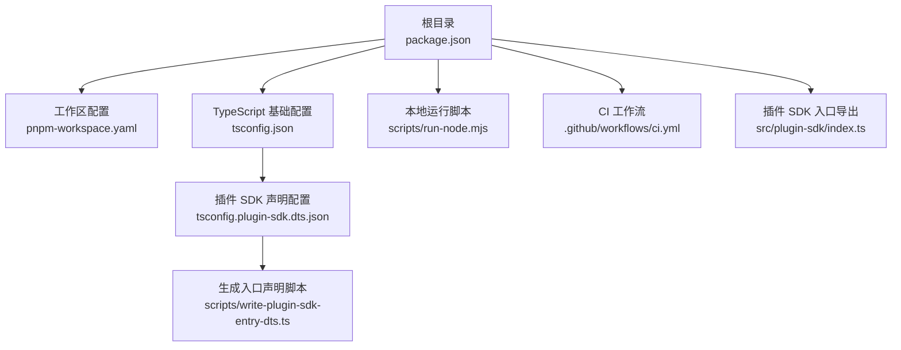
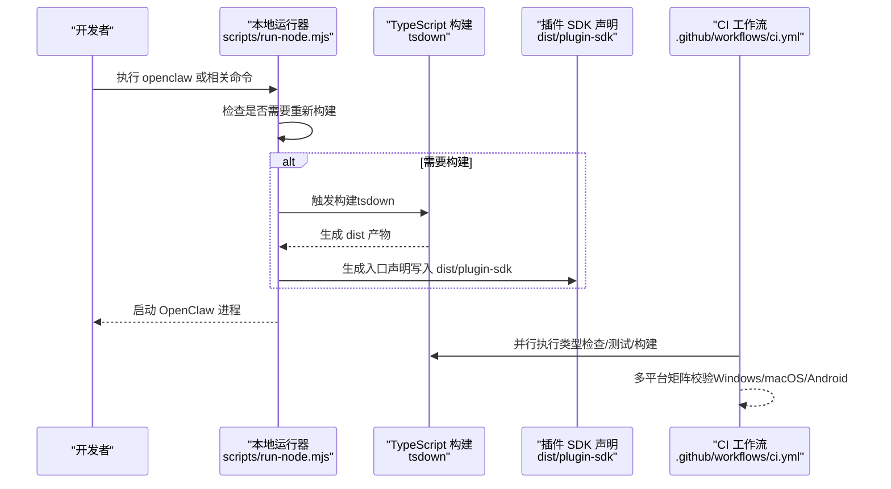
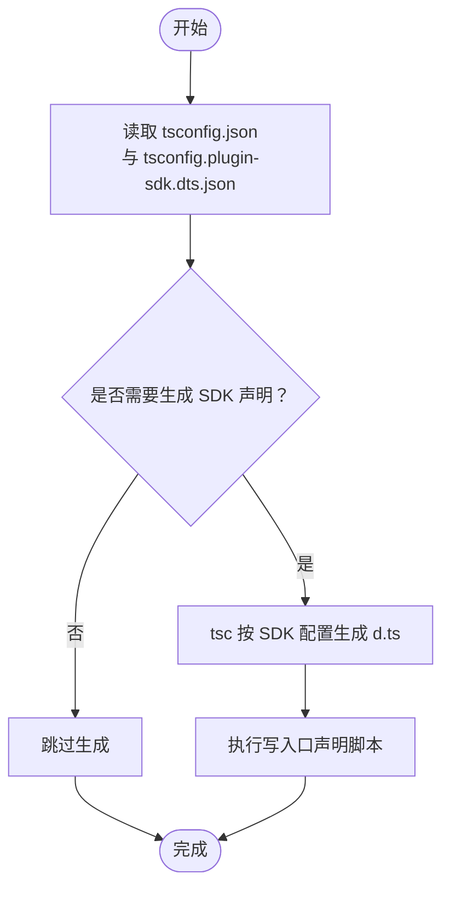
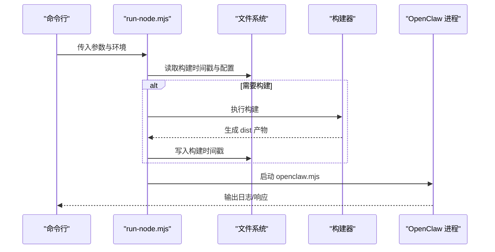
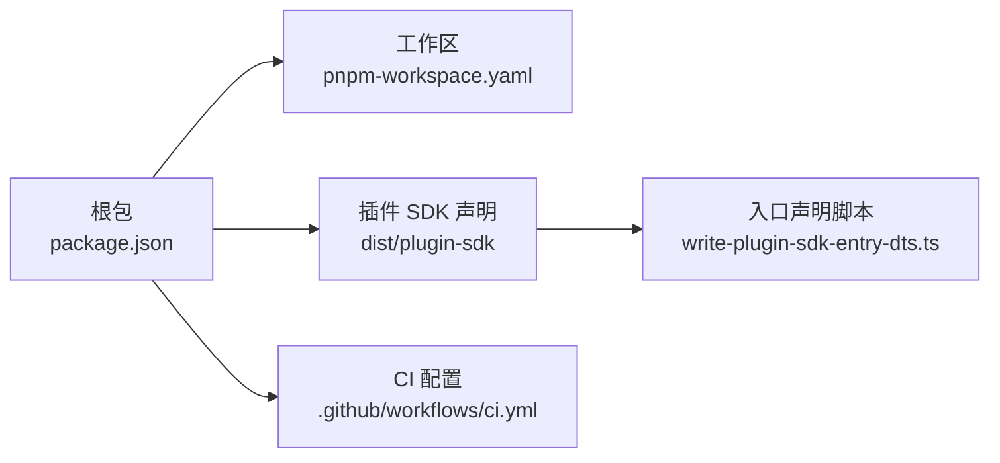

# 开发环境搭建

<cite>
**本文引用的文件**
- [package.json](file://package.json)
- [tsconfig.json](file://tsconfig.json)
- [tsconfig.plugin-sdk.dts.json](file://tsconfig.plugin-sdk.dts.json)
- [pnpm-workspace.yaml](file://pnpm-workspace.yaml)
- [scripts/write-plugin-sdk-entry-dts.ts](file://scripts/write-plugin-sdk-entry-dts.ts)
- [scripts/run-node.mjs](file://scripts/run-node.mjs)
- [docs/install/node.md](file://docs/install/node.md)
- [docs/start/getting-started.md](file://docs/start/getting-started.md)
- [.github/workflows/ci.yml](file://.github/workflows/ci.yml)
- [src/plugin-sdk/index.ts](file://src/plugin-sdk/index.ts)
</cite>

## 目录
1. [简介](#简介)
2. [项目结构](#项目结构)
3. [核心组件](#核心组件)
4. [架构总览](#架构总览)
5. [详细组件分析](#详细组件分析)
6. [依赖关系分析](#依赖关系分析)
7. [性能考虑](#性能考虑)
8. [故障排查指南](#故障排查指南)
9. [结论](#结论)
10. [附录](#附录)

## 简介
本指南面向希望在 OpenClaw 上进行插件开发的工程师，目标是帮助你从零开始搭建可复现且高效的本地开发环境。内容覆盖：
- Node.js 版本与工具链要求
- TypeScript 编译器与构建配置
- 插件 SDK 的生成与发布流程
- IDE 配置建议（含 VS Code 推荐）
- 环境验证方法与常见问题排查

## 项目结构
OpenClaw 采用多包工作区（pnpm workspace）组织，核心源码位于 src，插件 SDK 通过独立的 TypeScript 配置生成声明文件并随包导出。根目录脚本负责本地开发运行与构建。

图表来源
- [package.json](file://package.json)
- [pnpm-workspace.yaml](file://pnpm-workspace.yaml)
- [tsconfig.json](file://tsconfig.json)
- [tsconfig.plugin-sdk.dts.json](file://tsconfig.plugin-sdk.dts.json)
- [scripts/write-plugin-sdk-entry-dts.ts](file://scripts/write-plugin-sdk-entry-dts.ts)
- [scripts/run-node.mjs](file://scripts/run-node.mjs)
- [.github/workflows/ci.yml](file://.github/workflows/ci.yml)
- [src/plugin-sdk/index.ts](file://src/plugin-sdk/index.ts)

章节来源
- [package.json](file://package.json)
- [pnpm-workspace.yaml](file://pnpm-workspace.yaml)
- [tsconfig.json](file://tsconfig.json)
- [tsconfig.plugin-sdk.dts.json](file://tsconfig.plugin-sdk.dts.json)
- [scripts/write-plugin-sdk-entry-dts.ts](file://scripts/write-plugin-sdk-entry-dts.ts)
- [scripts/run-node.mjs](file://scripts/run-node.mjs)
- [.github/workflows/ci.yml](file://.github/workflows/ci.yml)
- [src/plugin-sdk/index.ts](file://src/plugin-sdk/index.ts)

## 核心组件
- Node.js 运行时与包管理：要求 Node >= 22.12.0；使用 pnpm 作为包管理器与工作区工具。
- TypeScript 构建系统：基础 tsconfig 启用严格模式与 NodeNext 模块解析；插件 SDK 使用独立的 d.ts 生成配置。
- 插件 SDK：通过入口导出聚合类型与工具函数，并由脚本生成稳定入口声明文件，供外部消费。
- 本地开发运行器：run-node.mjs 在启动时按需触发构建，支持热更新与增量编译。
- CI 流水线：在多平台矩阵中执行类型检查、测试与构建任务，保证跨平台一致性。

章节来源
- [package.json](file://package.json)
- [tsconfig.json](file://tsconfig.json)
- [tsconfig.plugin-sdk.dts.json](file://tsconfig.plugin-sdk.dts.json)
- [scripts/write-plugin-sdk-entry-dts.ts](file://scripts/write-plugin-sdk-entry-dts.ts)
- [scripts/run-node.mjs](file://scripts/run-node.mjs)
- [.github/workflows/ci.yml](file://.github/workflows/ci.yml)

## 架构总览
下图展示了从源码到可消费 SDK 的关键路径，以及本地运行与 CI 的交互：

图表来源
- [scripts/run-node.mjs](file://scripts/run-node.mjs)
- [tsconfig.json](file://tsconfig.json)
- [tsconfig.plugin-sdk.dts.json](file://tsconfig.plugin-sdk.dts.json)
- [scripts/write-plugin-sdk-entry-dts.ts](file://scripts/write-plugin-sdk-entry-dts.ts)
- [.github/workflows/ci.yml](file://.github/workflows/ci.yml)

## 详细组件分析

### Node.js 与工具链
- 版本要求：Node >= 22.12.0，CI 中固定使用 22.x。
- 包管理：pnpm 作为默认包管理器，版本在 package.json 中声明。
- 路径与全局安装：如遇到命令未找到，需确保 npm prefix -g 对应的 bin 目录已加入 PATH。

章节来源
- [package.json](file://package.json)
- [docs/install/node.md](file://docs/install/node.md)
- [.github/workflows/ci.yml](file://.github/workflows/ci.yml)

### TypeScript 编译器与配置
- 基础配置（tsconfig.json）：
  - 模块与解析：NodeNext
  - 目标与库：ES2023 + DOM/ScriptHost
  - 严格模式：启用
  - 路径映射：对 openclaw/plugin-sdk 提供别名
- 插件 SDK 声明配置（tsconfig.plugin-sdk.dts.json）：
  - 仅输出 d.ts，输出目录 dist/plugin-sdk
  - rootDir 指向 src，便于稳定入口声明生成
- 构建脚本：
  - pnpm build: 触发一系列构建步骤，包含打包 Canvas A2UI、生成 SDK 声明、写入入口声明等
  - pnpm build:plugin-sdk:dts：调用 tsc 按 SDK 配置生成声明
  - scripts/write-plugin-sdk-entry-dts.ts：为每个 SDK 入口生成稳定入口声明文件

图表来源
- [tsconfig.json](file://tsconfig.json)
- [tsconfig.plugin-sdk.dts.json](file://tsconfig.plugin-sdk.dts.json)
- [scripts/write-plugin-sdk-entry-dts.ts](file://scripts/write-plugin-sdk-entry-dts.ts)

章节来源
- [tsconfig.json](file://tsconfig.json)
- [tsconfig.plugin-sdk.dts.json](file://tsconfig.plugin-sdk.dts.json)
- [scripts/write-plugin-sdk-entry-dts.ts](file://scripts/write-plugin-sdk-entry-dts.ts)
- [package.json](file://package.json)

### 插件 SDK 下载与安装
- SDK 产物位置：dist/plugin-sdk 下包含各入口的 .d.ts 与 .js 文件，入口声明由脚本生成。
- 导出映射：package.json 的 exports 字段为各子路径提供 types/default 映射，便于外部直接引用。
- 安装方式：可通过包管理器安装发布包，或在本地工作区内通过 pnpm link/workspace 使用。

章节来源
- [package.json](file://package.json)
- [scripts/write-plugin-sdk-entry-dts.ts](file://scripts/write-plugin-sdk-entry-dts.ts)
- [src/plugin-sdk/index.ts](file://src/plugin-sdk/index.ts)

### 本地开发运行器
- 自动构建：首次或源码变更后自动触发构建；构建产物写入 dist，同时记录构建时间戳。
- 进程启动：以 openclaw.mjs 为入口启动主进程，继承当前环境变量。
- 变更检测：监控 src、tsconfig.json、package.json 等文件，判断是否需要重建。

图表来源
- [scripts/run-node.mjs](file://scripts/run-node.mjs)

章节来源
- [scripts/run-node.mjs](file://scripts/run-node.mjs)

### CI 与跨平台验证
- Windows/macOS/Android 等矩阵任务：在不同平台上分别执行测试、构建与协议校验。
- Node 版本与 pnpm 固定：CI 中明确指定 Node 22.x 与 pnpm 版本，确保一致性。
- 并行与分片：Windows 场景通过分片减少单次资源压力。

章节来源
- [.github/workflows/ci.yml](file://.github/workflows/ci.yml)
- [package.json](file://package.json)

## 依赖关系分析
- 工作区与包管理：pnpm-workspace.yaml 声明了根、ui、packages、extensions 等包范围；onlyBuiltDependencies 列表用于控制原生依赖的安装策略。
- 依赖覆盖与最小发布年龄：package.json 的 overrides 与 minimumReleaseAge 有助于在 CI 与本地保持一致的依赖树。
- 插件 SDK 与主包：SDK 的导出映射与入口声明脚本确保外部消费者能稳定引用。

图表来源
- [package.json](file://package.json)
- [pnpm-workspace.yaml](file://pnpm-workspace.yaml)
- [scripts/write-plugin-sdk-entry-dts.ts](file://scripts/write-plugin-sdk-entry-dts.ts)
- [.github/workflows/ci.yml](file://.github/workflows/ci.yml)

章节来源
- [package.json](file://package.json)
- [pnpm-workspace.yaml](file://pnpm-workspace.yaml)
- [scripts/write-plugin-sdk-entry-dts.ts](file://scripts/write-plugin-sdk-entry-dts.ts)
- [.github/workflows/ci.yml](file://.github/workflows/ci.yml)

## 性能考虑
- 构建缓存与增量：run-node.mjs 基于文件时间戳与 Git HEAD 判断是否需要重建，避免不必要的全量构建。
- CI 分片与并发：Windows 场景通过分片降低单次负载；macOS 任务合并为单一作业以提升队列利用率。
- 严格 TS 构建：CI 中包含“严格烟雾测试”，提前暴露潜在类型问题。

章节来源
- [scripts/run-node.mjs](file://scripts/run-node.mjs)
- [.github/workflows/ci.yml](file://.github/workflows/ci.yml)

## 故障排查指南
- Node 版本不匹配
  - 现象：命令不可用或运行时报错
  - 处理：确认 Node >= 22.12.0；参考文档中的安装与 PATH 设置
- PATH 未包含全局 npm bin
  - 现象：openclaw 命令未找到
  - 处理：使用 npm prefix -g 获取前缀，将其加入 PATH，并在新终端生效
- 依赖安装失败（权限或网络）
  - 处理：调整 npm prefix 到用户可写目录，或使用代理；在 CI 中固定 pnpm 版本与缓存键
- 插件 SDK 类型缺失或入口声明异常
  - 处理：执行 pnpm build:plugin-sdk:dts 与写入口声明脚本，确保 dist/plugin-sdk 下存在对应入口声明
- 本地运行卡顿或频繁重建
  - 处理：检查 run-node.mjs 的变更检测逻辑；必要时设置 OPENCLAW_FORCE_BUILD=1 强制重建

章节来源
- [docs/install/node.md](file://docs/install/node.md)
- [package.json](file://package.json)
- [scripts/write-plugin-sdk-entry-dts.ts](file://scripts/write-plugin-sdk-entry-dts.ts)
- [scripts/run-node.mjs](file://scripts/run-node.mjs)

## 结论
通过遵循本指南，你可以快速搭建一个与 CI 一致的 OpenClaw 插件开发环境。重点在于：
- 使用满足要求的 Node.js 与 pnpm
- 正确配置 TypeScript 与插件 SDK 声明生成
- 利用本地运行器与 CI 的一致性策略保障开发体验
- 遇到问题时依据故障排查清单逐项定位

## 附录

### IDE 配置建议（VS Code）
- 扩展推荐
  - TypeScript Importer：自动导入模块
  - ESLint / OXlint：统一代码风格与静态检查
  - EditorConfig：统一缩进与换行
  - Prettier：格式化（结合项目 oxfmt/oxlint）
- 调试配置
  - 使用 VS Code 的 Node 调试器，指向 openclaw.mjs 或 run-node.mjs
  - 在 launch.json 中设置 env，注入 OPENCLAW_HOME、OPENCLAW_STATE_DIR 等变量
- 代码格式化
  - 优先使用项目提供的格式化工具（oxfmt、swiftformat），避免 IDE 默认格式化破坏统一风格

### 开发环境验证清单
- Node.js 版本：node -v 输出 22.x
- 包管理器：pnpm -v 输出与 package.json 一致
- 构建产物：dist 存在且包含插件 SDK 声明
- 本地运行：openclaw dashboard 可访问
- 类型检查：pnpm check 无错误
- 插件 SDK：外部项目可正确引用 openclaw/plugin-sdk/* 入口

章节来源
- [docs/start/getting-started.md](file://docs/start/getting-started.md)
- [package.json](file://package.json)
- [tsconfig.json](file://tsconfig.json)
- [tsconfig.plugin-sdk.dts.json](file://tsconfig.plugin-sdk.dts.json)
- [scripts/write-plugin-sdk-entry-dts.ts](file://scripts/write-plugin-sdk-entry-dts.ts)