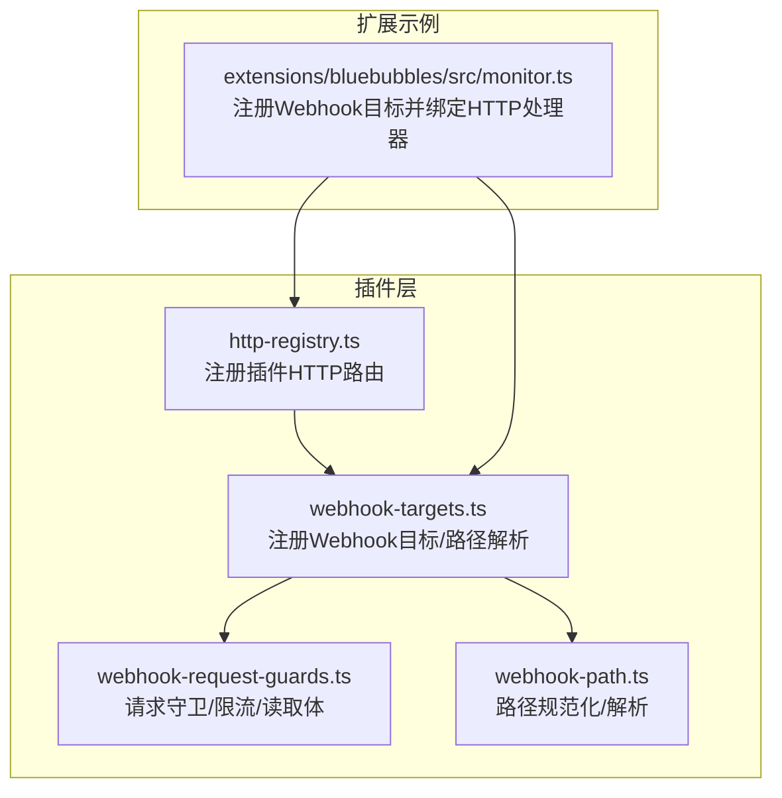
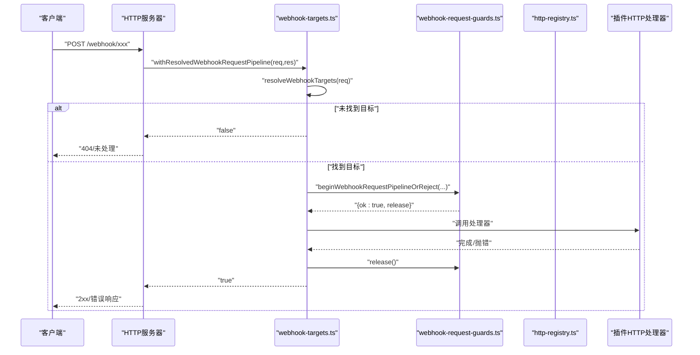
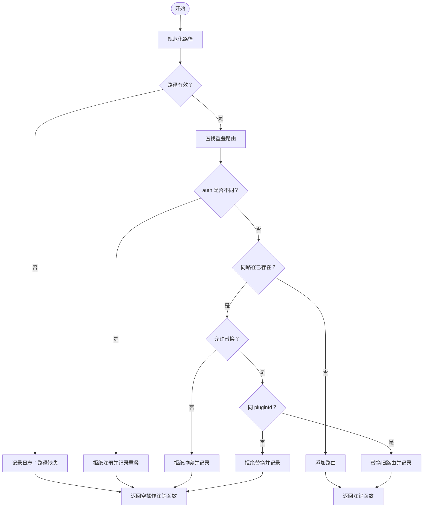
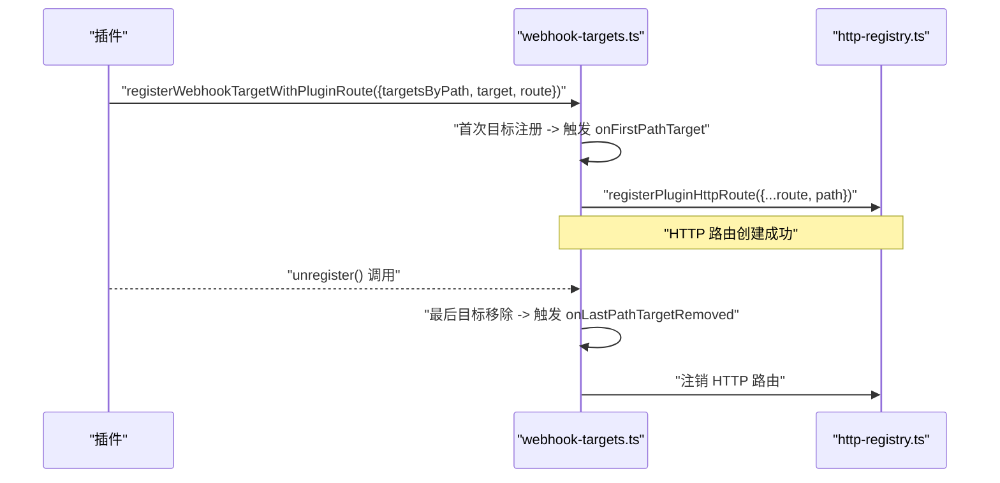
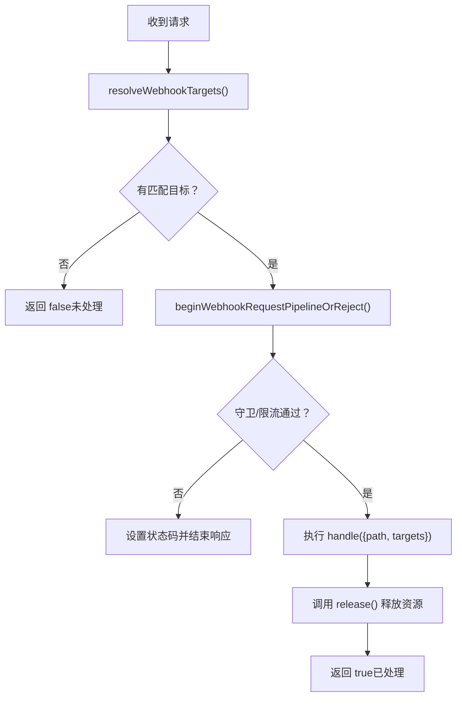
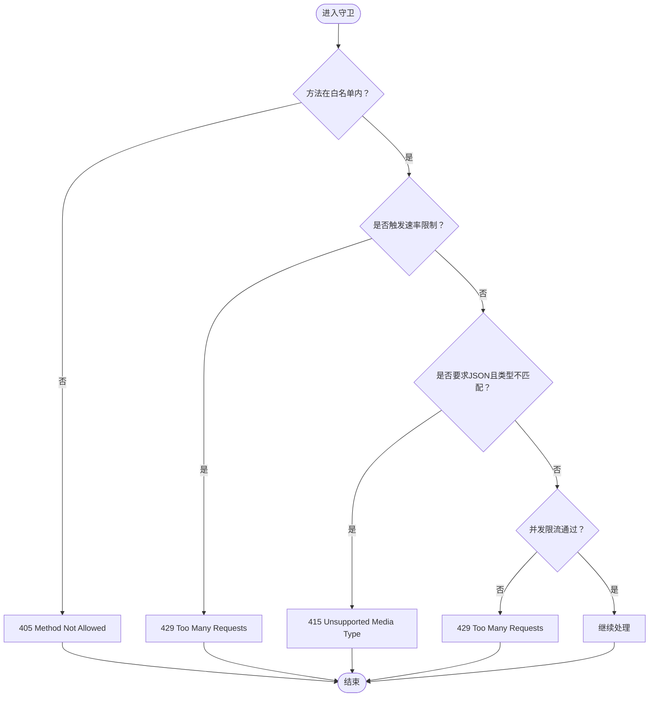
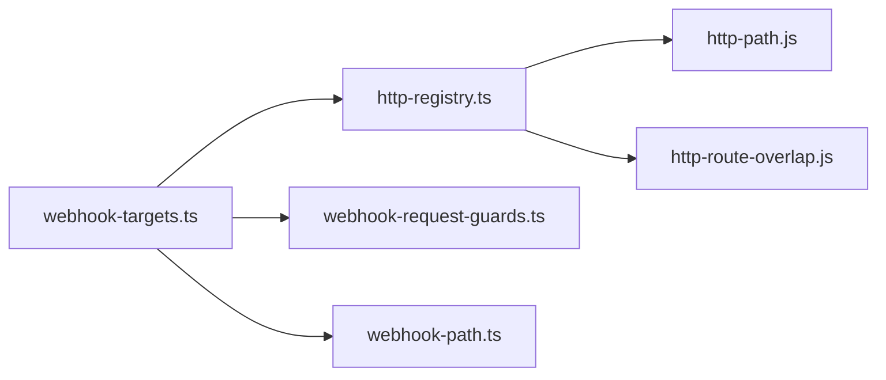

# HTTP/Webhook API

<cite>
**本文引用的文件**
- [http-registry.ts](file://src/plugins/http-registry.ts)
- [webhook-targets.ts](file://src/plugin-sdk/webhook-targets.ts)
- [webhook-request-guards.ts](file://src/plugin-sdk/webhook-request-guards.ts)
- [webhook-path.ts](file://src/plugin-sdk/webhook-path.ts)
- [http-registry.test.ts](file://src/plugins/http-registry.test.ts)
- [webhook-targets.test.ts](file://src/plugin-sdk/webhook-targets.test.ts)
- [webhook-request-guards.test.ts](file://src/plugin-sdk/webhook-request-guards.test.ts)
- [monitor.ts](file://extensions/bluebubbles/src/monitor.ts)
- [webhook.md](file://docs/automation/webhook.md)
- [webhooks.md](file://docs/cli/webhooks.md)
</cite>

## 目录
1. [简介](#简介)
2. [项目结构](#项目结构)
3. [核心组件](#核心组件)
4. [架构总览](#架构总览)
5. [详细组件分析](#详细组件分析)
6. [依赖关系分析](#依赖关系分析)
7. [性能考量](#性能考量)
8. [故障排查指南](#故障排查指南)
9. [结论](#结论)
10. [附录](#附录)

## 简介
本文件为 OpenClaw 的 HTTP/Webhook API 参考文档，聚焦以下能力与流程：
- 如何通过 registerPluginHttpRoute() 注册 HTTP 路由并处理请求
- 如何通过 registerWebhookTarget()/registerWebhookTargetWithPluginRoute() 注册 Webhook 目标与关联的 HTTP 路由
- Webhook 请求处理的完整 API：请求验证、身份认证、数据解析与响应
- 请求守卫机制：applyBasicWebhookRequestGuards() 与 createWebhookInFlightLimiter() 的安全防护
- HTTP 状态码、错误处理与重试最佳实践
- 具体实现示例：如何创建 HTTP 端点与 Webhook 处理器

## 项目结构
围绕 HTTP/Webhook 的关键文件组织如下：
- 插件 HTTP 路由注册与冲突检测：src/plugins/http-registry.ts
- Webhook 目标注册与路径解析：src/plugin-sdk/webhook-targets.ts
- Webhook 请求守卫与限流：src/plugin-sdk/webhook-request-guards.ts
- Webhook 路径规范化：src/plugin-sdk/webhook-path.ts
- 示例：扩展 BlueBubbles 的 Webhook 监听器：extensions/bluebubbles/src/monitor.ts
- 文档：自动化 Webhook 使用说明与 CLI 集成

图表来源
- [http-registry.ts:12-92](file://src/plugins/http-registry.ts#L12-L92)
- [webhook-targets.ts:57-100](file://src/plugin-sdk/webhook-targets.ts#L57-L100)
- [webhook-request-guards.ts:179-227](file://src/plugin-sdk/webhook-request-guards.ts#L179-L227)
- [webhook-path.ts:1-32](file://src/plugin-sdk/webhook-path.ts#L1-L32)
- [monitor.ts:31-57](file://extensions/bluebubbles/src/monitor.ts#L31-L57)

章节来源
- [http-registry.ts:12-92](file://src/plugins/http-registry.ts#L12-L92)
- [webhook-targets.ts:57-100](file://src/plugin-sdk/webhook-targets.ts#L57-L100)
- [webhook-request-guards.ts:179-227](file://src/plugin-sdk/webhook-request-guards.ts#L179-L227)
- [webhook-path.ts:1-32](file://src/plugin-sdk/webhook-path.ts#L1-L32)
- [monitor.ts:31-57](file://extensions/bluebubbles/src/monitor.ts#L31-L57)

## 核心组件
- registerPluginHttpRoute()
  - 功能：向活跃插件注册表注册一条 HTTP 路由，支持精确匹配与前缀匹配、重复替换、跨插件冲突检测与日志记录。
  - 关键参数：path/fallbackPath、handler、auth、match、replaceExisting、pluginId、source、accountId、log、registry。
  - 返回：注销函数，用于移除已注册路由。
- registerWebhookTarget()/registerWebhookTargetWithPluginRoute()
  - 功能：将 Webhook 目标按规范化路径聚合；当首个目标被注册时，自动调用 onFirstPathTarget 生命周期钩子；当最后一条目标被移除时，调用 onLastPathTargetRemoved 生命周期钩子。
  - registerWebhookTargetWithPluginRoute() 在首次注册时通过 registerPluginHttpRoute() 自动创建对应 HTTP 路由。
- resolveWebhookTargets()/withResolvedWebhookRequestPipeline()
  - 功能：根据请求 URL 解析目标集合；封装完整的请求处理流水线，包含方法校验、速率限制、JSON 内容类型校验、并发限流、请求体读取与异常处理。
- applyBasicWebhookRequestGuards()/beginWebhookRequestPipelineOrReject()
  - 功能：基础守卫（方法白名单、速率限制、JSON 类型要求）与并发请求限流；返回 release 回调以确保资源释放。
- createWebhookInFlightLimiter()
  - 功能：基于键的并发请求数量控制，防止过载；支持最大并发与键数量上限配置。

章节来源
- [http-registry.ts:12-92](file://src/plugins/http-registry.ts#L12-L92)
- [webhook-targets.ts:57-100](file://src/plugin-sdk/webhook-targets.ts#L57-L100)
- [webhook-targets.ts:102-162](file://src/plugin-sdk/webhook-targets.ts#L102-L162)
- [webhook-request-guards.ts:139-177](file://src/plugin-sdk/webhook-request-guards.ts#L139-L177)
- [webhook-request-guards.ts:179-227](file://src/plugin-sdk/webhook-request-guards.ts#L179-L227)
- [webhook-request-guards.ts:84-128](file://src/plugin-sdk/webhook-request-guards.ts#L84-L128)

## 架构总览
下面的序列图展示了从请求到达、路由解析、守卫校验到处理器执行与资源释放的整体流程。

图表来源
- [webhook-targets.ts:115-162](file://src/plugin-sdk/webhook-targets.ts#L115-L162)
- [webhook-request-guards.ts:179-227](file://src/plugin-sdk/webhook-request-guards.ts#L179-L227)
- [http-registry.ts:12-92](file://src/plugins/http-registry.ts#L12-L92)

## 详细组件分析

### registerPluginHttpRoute() 使用指南
- 用途
  - 向活跃插件注册表注册一条 HTTP 路由，支持精确匹配与前缀匹配；当路径冲突且 auth 不同时拒绝注册；支持 replaceExisting 替换旧路由。
- 关键行为
  - 路径标准化：使用 normalizePluginHttpPath() 规范化 path/fallbackPath。
  - 冲突检测：若存在重叠且 auth 不同的路由，记录日志并拒绝注册。
  - 替换策略：当 replaceExisting 为真且归属相同 pluginId 时，替换旧路由并记录日志。
  - 注销：返回的注销函数可移除已注册路由。
- 参数要点
  - auth：路由鉴权类型（如 plugin/gateway 等），影响冲突检测。
  - match：匹配模式（exact/prefix）。
  - replaceExisting：是否允许替换同路径已有路由。
  - pluginId/source/accountId/log：用于审计与日志输出。
- 返回值
  - 注销函数，调用后移除该路由条目。

图表来源
- [http-registry.ts:29-74](file://src/plugins/http-registry.ts#L29-L74)

章节来源
- [http-registry.ts:12-92](file://src/plugins/http-registry.ts#L12-L92)
- [http-registry.test.ts:40-167](file://src/plugins/http-registry.test.ts#L40-L167)

### Webhook 目标注册与路由联动
- registerWebhookTarget()
  - 将目标按规范化路径聚合至 Map；首次注册时调用 onFirstPathTarget；最后一条目标移除时调用 onLastPathTargetRemoved。
  - 返回 RegisteredWebhookTarget，包含 target 与 unregister。
- registerWebhookTargetWithPluginRoute()
  - 在首次注册时自动通过 registerPluginHttpRoute() 创建对应 HTTP 路由；最后移除时自动注销路由。
- 生命周期钩子
  - onFirstPathTarget：返回 teardown 函数，用于清理副作用。
  - onLastPathTargetRemoved：在路径上最后一条目标移除时回调。

图表来源
- [webhook-targets.ts:27-42](file://src/plugin-sdk/webhook-targets.ts#L27-L42)
- [webhook-targets.ts:57-100](file://src/plugin-sdk/webhook-targets.ts#L57-L100)
- [http-registry.ts:12-92](file://src/plugins/http-registry.ts#L12-L92)

章节来源
- [webhook-targets.ts:27-100](file://src/plugin-sdk/webhook-targets.ts#L27-L100)
- [webhook-targets.test.ts:100-141](file://src/plugin-sdk/webhook-targets.test.ts#L100-L141)

### Webhook 请求处理完整 API
- resolveWebhookTargets()
  - 根据请求 URL 解析规范化路径与目标数组；无匹配返回 null。
- withResolvedWebhookRequestPipeline()
  - 完整处理流水线：解析目标 → 守卫校验 → 并发限流 → 执行 handle → 释放资源。
  - 支持自定义 inFlightKey（字符串或函数），默认使用 path + 远端 IP 组合键。
- resolveSingleWebhookTarget()/resolveSingleWebhookTargetAsync()
  - 单目标匹配工具，支持同步与异步匹配条件；返回 none/single/ambiguous 三种结果。
- resolveWebhookTargetWithAuthOrReject()/resolveWebhookTargetWithAuthOrRejectSync()
  - 基于匹配结果返回目标或设置相应状态码（默认 401/409）并结束响应。

图表来源
- [webhook-targets.ts:102-162](file://src/plugin-sdk/webhook-targets.ts#L102-L162)
- [webhook-request-guards.ts:179-227](file://src/plugin-sdk/webhook-request-guards.ts#L179-L227)

章节来源
- [webhook-targets.ts:102-281](file://src/plugin-sdk/webhook-targets.ts#L102-L281)
- [webhook-targets.test.ts:160-200](file://src/plugin-sdk/webhook-targets.test.ts#L160-L200)
- [webhook-targets.test.ts:202-249](file://src/plugin-sdk/webhook-targets.test.ts#L202-L249)

### 请求守卫与安全防护
- applyBasicWebhookRequestGuards()
  - 方法白名单校验（405）。
  - 速率限制（429），需提供 rateLimiter 与 rateLimitKey。
  - JSON 内容类型要求（415），仅对 POST 生效。
- beginWebhookRequestPipelineOrReject()
  - 在基础守卫之上增加并发请求限流（默认 429），并返回 release 回调。
- createWebhookInFlightLimiter()
  - 基于键的并发计数，支持 maxInFlightPerKey 与 maxTrackedKeys 配置。
- readWebhookBodyOrReject()/readJsonWebhookBodyOrReject()
  - 按配置读取请求体，超时/过大/连接关闭等错误映射为 408/413/400；JSON 解析失败映射为 400。

图表来源
- [webhook-request-guards.ts:139-177](file://src/plugin-sdk/webhook-request-guards.ts#L139-L177)
- [webhook-request-guards.ts:179-227](file://src/plugin-sdk/webhook-request-guards.ts#L179-L227)

章节来源
- [webhook-request-guards.ts:139-291](file://src/plugin-sdk/webhook-request-guards.ts#L139-L291)
- [webhook-request-guards.test.ts:46-120](file://src/plugin-sdk/webhook-request-guards.test.ts#L46-L120)

### 路径规范化与解析
- normalizeWebhookPath()
  - 去除空白、保证以 / 开头、去除末尾多余斜杠。
- resolveWebhookPath()
  - 支持从 webhookPath/webhookUrl/defaultPath 解析最终路径，URL 解析失败返回 null。

章节来源
- [webhook-path.ts:1-32](file://src/plugin-sdk/webhook-path.ts#L1-L32)

### 实现示例：创建 HTTP 端点与 Webhook 处理器
- 扩展 BlueBubbles 的监听器示例
  - 使用 registerWebhookTargetWithPluginRoute() 注册目标与 HTTP 路由，处理器中优先处理业务逻辑，未处理时回退 404。
  - 注销时清理去抖动器。

章节来源
- [monitor.ts:31-57](file://extensions/bluebubbles/src/monitor.ts#L31-L57)

## 依赖关系分析
- 组件耦合
  - webhook-targets.ts 依赖 http-registry.ts（注册/注销 HTTP 路由）、webhook-request-guards.ts（守卫/限流）、webhook-path.ts（路径规范化）。
  - http-registry.ts 依赖 http-path.js 与 http-route-overlap.js（路径与重叠检测）。
- 外部集成
  - CLI 文档与自动化文档提供 Webhook 使用场景与命令入口。

图表来源
- [webhook-targets.ts:1-8](file://src/plugin-sdk/webhook-targets.ts#L1-L8)
- [http-registry.ts:1-5](file://src/plugins/http-registry.ts#L1-L5)

章节来源
- [webhook-targets.ts:1-8](file://src/plugin-sdk/webhook-targets.ts#L1-L8)
- [http-registry.ts:1-5](file://src/plugins/http-registry.ts#L1-L5)

## 性能考量
- 并发限流
  - 默认每键最大并发 8，最多跟踪 4096 个键；可通过 createWebhookInFlightLimiter() 调整。
- 请求体读取
  - pre-auth 与 post-auth 分档限制：字节数与超时时间不同，避免阻塞与资源滥用。
- 路由冲突与替换
  - 合理使用 replaceExisting 与 pluginId 归属，减少无效重建与日志噪声。
- 建议
  - 对高并发场景设置合理的 inFlightKey（如按来源 IP 或业务标识分组）。
  - 对外部 JSON Webhook 设置 requireJsonContentType 与速率限制，降低无效流量。

[本节为通用建议，无需特定文件来源]

## 故障排查指南
- 常见状态码
  - 405 Method Not Allowed：方法不在白名单内。
  - 415 Unsupported Media Type：POST 但 Content-Type 不是 application/json 或 +json。
  - 413 Payload Too Large / 408 Request Timeout / 400 Bad Request：请求体读取错误。
  - 429 Too Many Requests：速率限制或并发限流触发。
  - 401 Unauthorized / 409 Ambiguous：单目标匹配失败（未授权/歧义）。
- 排查步骤
  - 检查 registerPluginHttpRoute() 是否正确注册且未被其他 auth 路由重叠。
  - 确认守卫参数（allowMethods、rateLimiter、requireJsonContentType）与实际请求一致。
  - 使用 withResolvedWebhookRequestPipeline() 的 handle 返回值判断是否已处理。
  - 若 inFlightLimiter 报 429，检查 inFlightKey 是否合理以及 release() 是否被调用。
- 测试参考
  - 单元测试覆盖了守卫、速率限制、JSON 类型、非 POST 拒绝、并发释放等场景。

章节来源
- [webhook-request-guards.ts:139-291](file://src/plugin-sdk/webhook-request-guards.ts#L139-L291)
- [webhook-request-guards.test.ts:46-120](file://src/plugin-sdk/webhook-request-guards.test.ts#L46-L120)
- [webhook-targets.test.ts:202-249](file://src/plugin-sdk/webhook-targets.test.ts#L202-L249)

## 结论
OpenClaw 的 HTTP/Webhook API 通过“目标注册 + 路由联动 + 守卫与限流”的组合，提供了安全、可扩展且易于使用的 Webhook 处理能力。开发者只需关注业务目标与处理器逻辑，其余的路径规范化、路由冲突检测、并发与速率控制、请求体读取与错误映射均由 SDK 统一处理。

[本节为总结性内容，无需特定文件来源]

## 附录

### API 参考速查
- registerPluginHttpRoute()
  - 输入：path/fallbackPath、handler、auth、match、replaceExisting、pluginId、source、accountId、log、registry
  - 输出：注销函数
- registerWebhookTarget()/registerWebhookTargetWithPluginRoute()
  - 输入：targetsByPath、target、onFirstPathTarget/onLastPathTargetRemoved、route（含 auth/match/pluginId/source/handler 等）
  - 输出：RegisteredWebhookTarget
- withResolvedWebhookRequestPipeline()
  - 输入：req/res、targetsByPath、allowMethods/rateLimiter/rateLimitKey/requireJsonContentType/inFlightLimiter/inFlightKey/handle
  - 输出：Promise<boolean>（是否已处理）
- applyBasicWebhookRequestGuards()/beginWebhookRequestPipelineOrReject()
  - 输入：req/res、allowMethods/rateLimiter/rateLimitKey/requireJsonContentType/inFlightLimiter/inFlightKey
  - 输出：boolean 或 {ok:true, release}
- createWebhookInFlightLimiter()
  - 输入：maxInFlightPerKey/maxTrackedKeys
  - 输出：{tryAcquire/release/size/clear}

章节来源
- [http-registry.ts:12-92](file://src/plugins/http-registry.ts#L12-L92)
- [webhook-targets.ts:57-162](file://src/plugin-sdk/webhook-targets.ts#L57-L162)
- [webhook-request-guards.ts:84-227](file://src/plugin-sdk/webhook-request-guards.ts#L84-L227)

### 使用场景与最佳实践
- Webhook 目标注册
  - 使用 registerWebhookTarget() 聚合多个目标；需要自动创建 HTTP 路由时使用 registerWebhookTargetWithPluginRoute()。
- 身份认证与权限
  - 通过 http-registry 的 auth 字段与冲突检测，确保不同来源的路由不会互相覆盖。
- 数据解析
  - 对于 JSON Webhook，启用 requireJsonContentType；必要时使用 readJsonWebhookBodyOrReject() 获取解析后的对象。
- 错误与重试
  - 对 429/408/413 等错误采用指数退避重试；对 400/401/409 等错误应检查请求格式与目标匹配逻辑。

章节来源
- [webhook.md:82-97](file://docs/automation/webhook.md#L82-L97)
- [webhooks.md:1-26](file://docs/cli/webhooks.md#L1-L26)