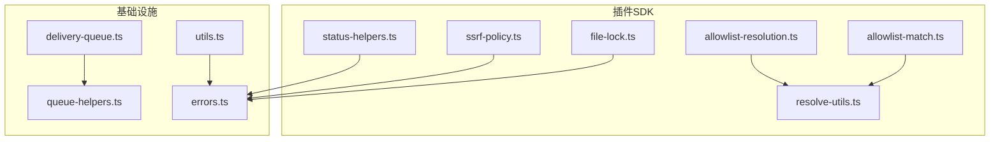
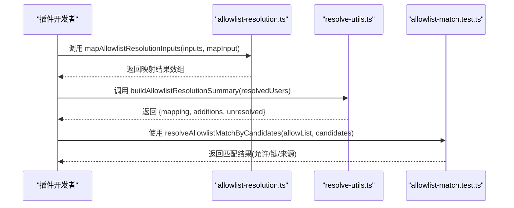
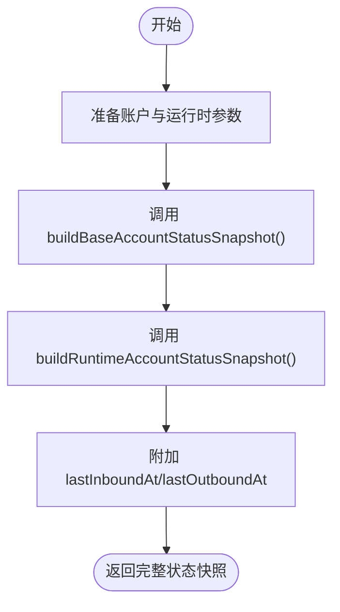
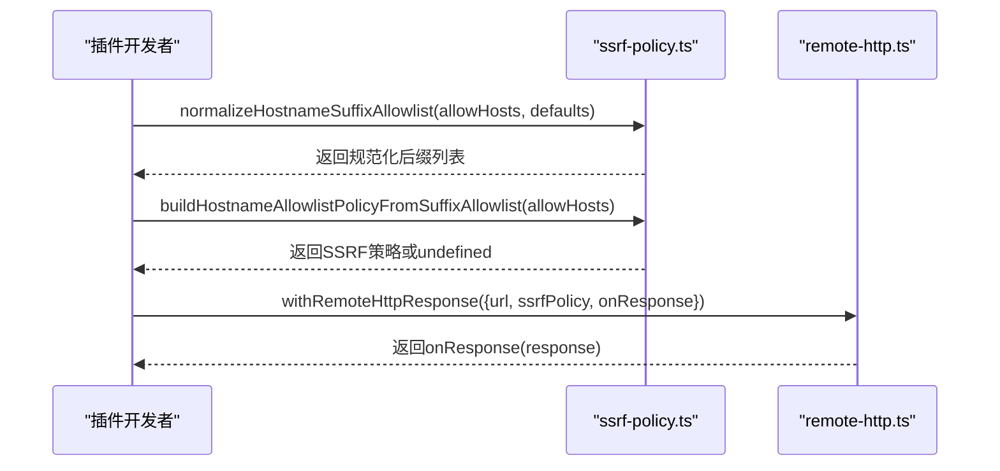
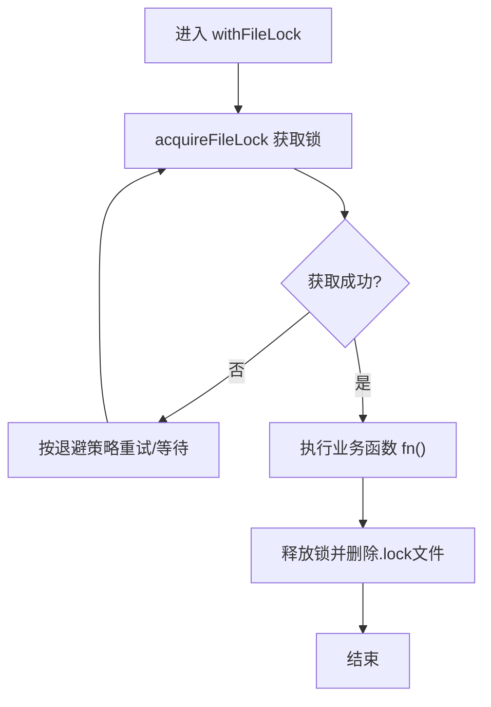
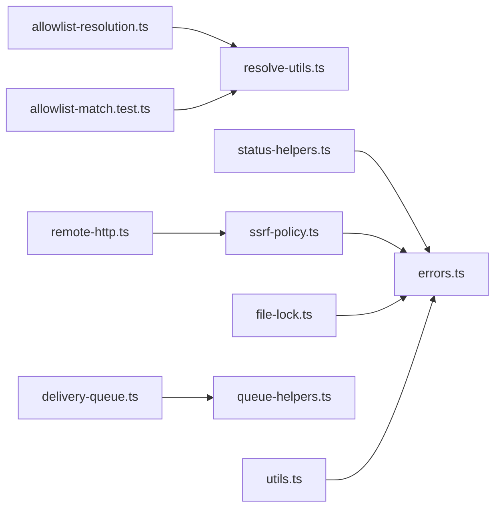

# 工具函数API

<cite>
**本文引用的文件**
- [allowlist-resolution.ts](file://src/plugin-sdk/allowlist-resolution.ts)
- [allowlist-resolution.test.ts](file://src/plugin-sdk/allowlist-resolution.test.ts)
- [allowlist-match.ts](file://src/channels/plugins/allowlist-match.ts)
- [allowlist-match.test.ts](file://src/channels/allowlist-match.test.ts)
- [resolve-utils.ts](file://src/channels/allowlists/resolve-utils.ts)
- [resolve-utils.test.ts](file://src/channels/allowlists/resolve-utils.test.ts)
- [status-helpers.ts](file://src/plugin-sdk/status-helpers.ts)
- [status-helpers.test.ts](file://src/plugin-sdk/status-helpers.test.ts)
- [ssrf-policy.ts](file://src/plugin-sdk/ssrf-policy.ts)
- [ssrf-policy.test.ts](file://src/plugin-sdk/ssrf-policy.test.ts)
- [remote-http.ts](file://src/memory/remote-http.ts)
- [web-guarded-fetch.ts](file://src/agents/tools/web-guarded-fetch.ts)
- [file-lock.ts](file://src/plugin-sdk/file-lock.ts)
- [delivery-queue.ts](file://src/infra/outbound/delivery-queue.ts)
- [queue-helpers.ts](file://src/utils/queue-helpers.ts)
- [errors.ts](file://src/infra/errors.ts)
- [utils.ts](file://src/utils.ts)
- [poll.ts](file://test/helpers/poll.ts)
</cite>

## 目录
1. [简介](#简介)
2. [项目结构](#项目结构)
3. [核心组件](#核心组件)
4. [架构总览](#架构总览)
5. [详细组件分析](#详细组件分析)
6. [依赖分析](#依赖分析)
7. [性能考量](#性能考量)
8. [故障排查指南](#故障排查指南)
9. [结论](#结论)
10. [附录](#附录)

## 简介
本文件为 OpenClaw 工具函数API的权威参考，覆盖以下主题：
- 允许列表解析与匹配：包括输入映射、候选匹配、解析摘要与补丁等工具。
- 状态助手：账户与通道运行时状态快照构建与汇总。
- 安全相关：SSRF主机后缀白名单策略、受控HTTP访问、浏览器SSRF策略解析。
- 基础设施工具：文件锁、队列辅助、错误格式化与提取、通用工具集。
- 实用示例与最佳实践：帮助插件开发者正确使用这些工具。

## 项目结构
围绕工具函数API的关键模块分布如下：
- 插件SDK工具：允许列表解析、状态助手、SSRF策略、文件锁。
- 队列与基础设施：出站投递队列、队列辅助、错误处理。
- 通用工具：路径解析、JSON安全解析、字符串与数值裁剪、超时轮询等。

**图表来源**
- [allowlist-resolution.ts:1-31](file://src/plugin-sdk/allowlist-resolution.ts#L1-L31)
- [allowlist-match.ts:1-2](file://src/channels/plugins/allowlist-match.ts#L1-L2)
- [resolve-utils.ts:36-71](file://src/channels/allowlists/resolve-utils.ts#L36-L71)
- [status-helpers.ts:68-123](file://src/plugin-sdk/status-helpers.ts#L68-L123)
- [ssrf-policy.ts:65-85](file://src/plugin-sdk/ssrf-policy.ts#L65-L85)
- [file-lock.ts:103-161](file://src/plugin-sdk/file-lock.ts#L103-L161)
- [delivery-queue.ts:204-242](file://src/infra/outbound/delivery-queue.ts#L204-L242)
- [queue-helpers.ts:84-133](file://src/utils/queue-helpers.ts#L84-L133)
- [errors.ts:1-97](file://src/infra/errors.ts#L1-L97)
- [utils.ts:1-395](file://src/utils.ts#L1-L395)

**章节来源**
- [allowlist-resolution.ts:1-31](file://src/plugin-sdk/allowlist-resolution.ts#L1-L31)
- [status-helpers.ts:1-173](file://src/plugin-sdk/status-helpers.ts#L1-L173)
- [ssrf-policy.ts:1-86](file://src/plugin-sdk/ssrf-policy.ts#L1-L86)
- [file-lock.ts:1-162](file://src/plugin-sdk/file-lock.ts#L1-L162)
- [delivery-queue.ts:204-242](file://src/infra/outbound/delivery-queue.ts#L204-L242)
- [queue-helpers.ts:84-133](file://src/utils/queue-helpers.ts#L84-L133)
- [errors.ts:1-97](file://src/infra/errors.ts#L1-L97)
- [utils.ts:1-395](file://src/utils.ts#L1-L395)

## 核心组件
- 允许列表解析与匹配
  - 输入映射：顺序映射字符串输入并保持顺序。
  - 候选匹配：基于候选集合重新计算匹配结果，支持动态变更。
  - 解析摘要与补丁：生成映射、新增项与未解析项，并将解析结果补丁到配置条目。
- 状态助手
  - 构建账户与通道状态快照：默认值、运行时字段、探针信息、最后入/出站时间。
  - 收集运行时错误为状态问题。
- 安全工具
  - 主机名后缀白名单规范化与HTTPS校验。
  - 将后缀白名单转换为共享SSRF策略。
  - 受控HTTP访问与远程响应处理。
  - 浏览器端SSRF策略解析（私有网络、主机白名单）。
- 基础设施工具
  - 文件锁：进程内重入计数、退避重试、过期检测、释放。
  - 队列辅助：丢弃策略、去抖动等待、失败迁移。
  - 错误处理：错误码提取、错误名读取、图遍历收集、格式化与脱敏。
  - 通用工具：路径解析、JSON安全解析、E164/WhatsApp JID互转、UTF-16安全截断、超时轮询等。

**章节来源**
- [allowlist-resolution.ts:9-30](file://src/plugin-sdk/allowlist-resolution.ts#L9-L30)
- [allowlist-match.test.ts:50-85](file://src/channels/allowlist-match.test.ts#L50-L85)
- [resolve-utils.ts:36-71](file://src/channels/allowlists/resolve-utils.ts#L36-L71)
- [status-helpers.ts:68-173](file://src/plugin-sdk/status-helpers.ts#L68-L173)
- [ssrf-policy.ts:27-85](file://src/plugin-sdk/ssrf-policy.ts#L27-L85)
- [remote-http.ts:22-40](file://src/memory/remote-http.ts#L22-L40)
- [file-lock.ts:103-161](file://src/plugin-sdk/file-lock.ts#L103-L161)
- [queue-helpers.ts:84-133](file://src/utils/queue-helpers.ts#L84-L133)
- [errors.ts:3-97](file://src/infra/errors.ts#L3-L97)
- [utils.ts:13-395](file://src/utils.ts#L13-L395)

## 架构总览
下图展示工具函数在系统中的交互关系与职责边界。

```mermaid
graph TB
subgraph "允许列表解析"
MIRI["mapAllowlistResolutionInputs()"]
RMBC["resolveAllowlistMatchByCandidates()"]
SUMM["buildAllowlistResolutionSummary()"]
PATCH["patchAllowlistUsersInConfigEntries()"]
end
subgraph "状态助手"
BAS["buildBaseAccountStatusSnapshot()"]
RAS["buildRuntimeAccountStatusSnapshot()"]
CAS["buildComputedAccountStatusSnapshot()"]
end
subgraph "安全"
NHA["normalizeHostnameSuffixAllowlist()"]
HTTPSCHK["isHttpsUrlAllowedByHostnameSuffixAllowlist()"]
POLY["buildHostnameAllowlistPolicyFromSuffixAllowlist()"]
REMOTE["withRemoteHttpResponse()"]
end
subgraph "基础设施"
FLOCK["acquireFileLock()/withFileLock()"]
DQ["moveToFailed()"]
QDROP["applyQueueDropPolicy()"]
QDEBOUNCE["waitForQueueDebounce()"]
ERR["formatErrorMessage()/formatUncaughtError()"]
end
MIRI --> SUMM
RMBC --> SUMM
SUMM --> PATCH
BAS --> RAS
CAS --> BAS
NHA --> HTTPSCHK
HTTPSCHK --> POLY
POLY --> REMOTE
FLOCK --> ERR
DQ --> ERR
QDROP --> ERR
QDEBOUNCE --> ERR
```

**图表来源**
- [allowlist-resolution.ts:21-30](file://src/plugin-sdk/allowlist-resolution.ts#L21-L30)
- [allowlist-match.test.ts:50-85](file://src/channels/allowlist-match.test.ts#L50-L85)
- [resolve-utils.ts:36-71](file://src/channels/allowlists/resolve-utils.ts#L36-L71)
- [status-helpers.ts:68-123](file://src/plugin-sdk/status-helpers.ts#L68-L123)
- [ssrf-policy.ts:27-85](file://src/plugin-sdk/ssrf-policy.ts#L27-L85)
- [remote-http.ts:22-40](file://src/memory/remote-http.ts#L22-L40)
- [file-lock.ts:103-161](file://src/plugin-sdk/file-lock.ts#L103-L161)
- [delivery-queue.ts:235-242](file://src/infra/outbound/delivery-queue.ts#L235-L242)
- [queue-helpers.ts:84-133](file://src/utils/queue-helpers.ts#L84-L133)
- [errors.ts:68-97](file://src/infra/errors.ts#L68-L97)

## 详细组件分析

### 允许列表解析与匹配API
- mapAllowlistResolutionInputs(inputs, mapInput)
  - 作用：顺序映射输入数组，保持顺序不变；适合串行依赖或幂等映射。
  - 返回：映射后的结果数组。
  - 使用场景：将用户输入映射为具体资源标识或实体对象。
  - 示例参考：[mapAllowlistResolutionInputs 测试:5-17](file://src/plugin-sdk/allowlist-resolution.test.ts#L5-L17)
- resolveAllowlistMatchByCandidates(allowList, candidates)
  - 作用：根据候选集合进行匹配，支持动态变更 allowList 后重新计算。
  - 返回：匹配结果对象，包含是否允许、匹配键与来源。
  - 示例参考：[候选匹配测试:50-85](file://src/channels/allowlist-match.test.ts#L50-L85)
- buildAllowlistResolutionSummary(resolvedUsers, opts?)
  - 作用：生成解析摘要，包含映射、新增项与未解析项；支持自定义格式化。
  - 返回：{ resolvedMap, mapping, unresolved, additions }。
  - 示例参考：[摘要构建测试:11-31](file://src/channels/allowlists/resolve-utils.test.ts#L11-L31)
- resolveAllowlistIdAdditions(existing, resolvedMap)
  - 作用：从现有条目中解析出新增ID，用于合并到目标集合。
  - 返回：新增ID数组。
- patchAllowlistUsersInConfigEntries(...)
  - 作用：将解析结果补丁到配置条目，更新用户映射。
  - 说明：该函数在解析工具集中导出，便于配置写回。

**图表来源**
- [allowlist-resolution.ts:21-30](file://src/plugin-sdk/allowlist-resolution.ts#L21-L30)
- [resolve-utils.ts:36-56](file://src/channels/allowlists/resolve-utils.ts#L36-L56)
- [allowlist-match.test.ts:50-85](file://src/channels/allowlist-match.test.ts#L50-L85)

**章节来源**
- [allowlist-resolution.ts:9-30](file://src/plugin-sdk/allowlist-resolution.ts#L9-L30)
- [allowlist-resolution.test.ts:1-18](file://src/plugin-sdk/allowlist-resolution.test.ts#L1-L18)
- [allowlist-match.test.ts:50-85](file://src/channels/allowlist-match.test.ts#L50-L85)
- [resolve-utils.ts:36-71](file://src/channels/allowlists/resolve-utils.ts#L36-L71)
- [resolve-utils.test.ts:1-31](file://src/channels/allowlists/resolve-utils.test.ts#L1-L31)

### 状态助手API
- buildBaseChannelStatusSummary(snapshot)
  - 作用：标准化通道状态摘要，填充默认布尔与时间戳字段。
- buildProbeChannelStatusSummary(snapshot, extra?)
  - 作用：在基础摘要上附加探针与最后探测时间。
- buildBaseAccountStatusSnapshot(params)
  - 作用：构建账户状态快照，包含运行时与探针信息，以及最后入/出站时间。
- buildComputedAccountStatusSnapshot(params)
  - 作用：便捷版本，直接传入账户字段与运行时参数。
- buildRuntimeAccountStatusSnapshot(params)
  - 作用：抽取运行时生命周期字段，作为运行态摘要。
- collectStatusIssuesFromLastError(channel, accounts)
  - 作用：将最后错误转换为状态问题列表，便于上报。

**图表来源**
- [status-helpers.ts:68-123](file://src/plugin-sdk/status-helpers.ts#L68-L123)

**章节来源**
- [status-helpers.ts:32-173](file://src/plugin-sdk/status-helpers.ts#L32-L173)
- [status-helpers.test.ts:52-91](file://src/plugin-sdk/status-helpers.test.ts#L52-L91)

### 安全工具API
- normalizeHostnameSuffixAllowlist(input?, defaults?)
  - 作用：规范化主机名后缀白名单，支持通配符“*”。
- isHttpsUrlAllowedByHostnameSuffixAllowlist(url, allowlist)
  - 作用：要求URL为HTTPS且主机名满足后缀白名单。
- buildHostnameAllowlistPolicyFromSuffixAllowlist(allowHosts?)
  - 作用：将后缀白名单转换为共享SSRF策略(hostnameAllowlist)。
- withRemoteHttpResponse(params)
  - 作用：在受控SSRF策略下发起HTTP请求，回调处理响应并确保释放资源。
- resolveBrowserSsrFPolicy(cfg)
  - 作用：解析浏览器端SSRF策略，支持私有网络、主机白名单与主机名后缀白名单。

**图表来源**
- [ssrf-policy.ts:27-85](file://src/plugin-sdk/ssrf-policy.ts#L27-L85)
- [remote-http.ts:22-40](file://src/memory/remote-http.ts#L22-L40)

**章节来源**
- [ssrf-policy.ts:1-86](file://src/plugin-sdk/ssrf-policy.ts#L1-L86)
- [ssrf-policy.test.ts:1-44](file://src/plugin-sdk/ssrf-policy.test.ts#L1-L44)
- [remote-http.ts:1-40](file://src/memory/remote-http.ts#L1-L40)
- [browser/config.ts:101-128](file://src/browser/config.ts#L101-L128)

### 基础设施工具API
- 文件锁
  - acquireFileLock(filePath, options)
  - withFileLock(filePath, options, fn)
  - 作用：跨进程文件锁，支持重试、抖动、过期检测与进程存活判断。
  - 选项：retries(次数、因子、最小/最大超时、随机抖动)、stale(过期阈值)。
- 出站队列
  - moveToFailed(id, stateDir?)
  - 作用：将队列条目移动到失败目录，便于后续重试或审计。
- 队列辅助
  - applyQueueDropPolicy(params)
  - waitForQueueDebounce(queue)
  - 作用：丢弃策略控制、去抖动等待，支持汇总丢弃日志。
- 错误处理
  - extractErrorCode(err)/readErrorName(err)
  - collectErrorGraphCandidates(err, resolveNested?)
  - formatErrorMessage(err)/formatUncaughtError(err)
  - isErrno(err)/hasErrnoCode(err, code)
  - 作用：统一错误提取、格式化与脱敏，支持图遍历收集。
- 通用工具
  - ensureDir/dirExists/sleep/pollUntil(fn, opts)
  - safeParseJson/raw JSON解析
  - normalizePath/resolveUserPath/shortenHomePath
  - clampNumber/clampInt/clamp/sliceUtf16Safe/truncateUtf16Safe
  - escapeRegExp/isRecord/isPlainObject
  - jidToE164/resolveJidToE164/normalizeE164/withWhatsAppPrefix
  - displayPath/displayString/formatTerminalLink

**图表来源**
- [file-lock.ts:103-161](file://src/plugin-sdk/file-lock.ts#L103-L161)

**章节来源**
- [file-lock.ts:1-162](file://src/plugin-sdk/file-lock.ts#L1-L162)
- [delivery-queue.ts:235-242](file://src/infra/outbound/delivery-queue.ts#L235-L242)
- [queue-helpers.ts:84-133](file://src/utils/queue-helpers.ts#L84-L133)
- [errors.ts:1-97](file://src/infra/errors.ts#L1-L97)
- [utils.ts:1-395](file://src/utils.ts#L1-L395)
- [poll.ts:8-25](file://test/helpers/poll.ts#L8-L25)

## 依赖分析
- 允许列表解析与匹配
  - 依赖：解析摘要工具用于生成映射与未解析项；候选匹配用于动态校验。
- 状态助手
  - 依赖：运行时生命周期快照；错误收集用于状态问题聚合。
- 安全工具
  - 依赖：共享SSRF策略类型；受控HTTP访问封装；浏览器端策略解析。
- 基础设施工具
  - 依赖：错误处理与通用工具；队列辅助用于批量处理与去抖动。

**图表来源**
- [allowlist-resolution.ts:1-31](file://src/plugin-sdk/allowlist-resolution.ts#L1-L31)
- [resolve-utils.ts:36-71](file://src/channels/allowlists/resolve-utils.ts#L36-L71)
- [allowlist-match.test.ts:50-85](file://src/channels/allowlist-match.test.ts#L50-L85)
- [status-helpers.ts:68-123](file://src/plugin-sdk/status-helpers.ts#L68-L123)
- [errors.ts:1-97](file://src/infra/errors.ts#L1-L97)
- [ssrf-policy.ts:1-86](file://src/plugin-sdk/ssrf-policy.ts#L1-L86)
- [remote-http.ts:1-40](file://src/memory/remote-http.ts#L1-L40)
- [file-lock.ts:1-162](file://src/plugin-sdk/file-lock.ts#L1-L162)
- [delivery-queue.ts:204-242](file://src/infra/outbound/delivery-queue.ts#L204-L242)
- [queue-helpers.ts:84-133](file://src/utils/queue-helpers.ts#L84-L133)
- [utils.ts:1-395](file://src/utils.ts#L1-L395)

**章节来源**
- [allowlist-resolution.ts:1-31](file://src/plugin-sdk/allowlist-resolution.ts#L1-L31)
- [resolve-utils.ts:36-71](file://src/channels/allowlists/resolve-utils.ts#L36-L71)
- [status-helpers.ts:68-123](file://src/plugin-sdk/status-helpers.ts#L68-L123)
- [ssrf-policy.ts:1-86](file://src/plugin-sdk/ssrf-policy.ts#L1-L86)
- [remote-http.ts:1-40](file://src/memory/remote-http.ts#L1-L40)
- [file-lock.ts:1-162](file://src/plugin-sdk/file-lock.ts#L1-L162)
- [delivery-queue.ts:204-242](file://src/infra/outbound/delivery-queue.ts#L204-L242)
- [queue-helpers.ts:84-133](file://src/utils/queue-helpers.ts#L84-L133)
- [errors.ts:1-97](file://src/infra/errors.ts#L1-L97)
- [utils.ts:1-395](file://src/utils.ts#L1-L395)

## 性能考量
- 允许列表解析
  - mapAllowlistResolutionInputs 采用顺序映射，避免并发竞争，适合串行依赖场景。
  - 建议：对大量输入使用分批处理与缓存中间结果。
- 状态构建
  - 快照构建为纯内存操作，注意避免频繁重复构建；可结合缓存策略。
- SSRF策略
  - 后缀白名单规范化与集合去重为O(n)；建议预热常用域名列表。
- 文件锁
  - 指数退避与抖动降低争用；合理设置stale阈值避免僵尸锁。
- 队列辅助
  - 丢弃策略与去抖动可显著降低系统负载；根据吞吐量调整容量与去抖动时间。

[本节为通用指导，不直接分析具体文件]

## 故障排查指南
- 错误提取与格式化
  - 使用 extractErrorCode/readErrorName 获取错误元信息。
  - 使用 formatErrorMessage/formatUncaughtError 统一输出并脱敏敏感信息。
  - 使用 collectErrorGraphCandidates 遍历嵌套对象以收集上下文。
- 超时与轮询
  - 使用 pollUntil(fn, {timeoutMs,intervalMs}) 进行条件轮询，避免忙等。
- 文件锁
  - 若出现“file lock timeout”，检查stale阈值与进程存活；确认磁盘权限与路径解析。
- 队列失败
  - 使用 moveToFailed 将失败项移至失败目录，便于离线重试与审计。
- SSRF
  - 确认URL为HTTPS；核对主机名后缀白名单；必要时禁用严格策略进行调试。

**章节来源**
- [errors.ts:3-97](file://src/infra/errors.ts#L3-L97)
- [poll.ts:8-25](file://test/helpers/poll.ts#L8-L25)
- [file-lock.ts:103-161](file://src/plugin-sdk/file-lock.ts#L103-L161)
- [delivery-queue.ts:235-242](file://src/infra/outbound/delivery-queue.ts#L235-L242)
- [ssrf-policy.ts:42-55](file://src/plugin-sdk/ssrf-policy.ts#L42-L55)

## 结论
本文档系统梳理了 OpenClaw 的工具函数API，涵盖允许列表解析、状态管理、安全防护与基础设施工具。通过遵循本文的接口语义、使用示例与最佳实践，插件开发者可以更稳健地实现功能扩展与集成。

[本节为总结性内容，不直接分析具体文件]

## 附录
- 最佳实践清单
  - 允许列表：优先使用候选匹配与解析摘要，确保动态变更后重新计算。
  - 状态：统一使用状态助手构建快照，避免遗漏运行时字段。
  - 安全：始终启用HTTPS与主机后缀白名单；在浏览器端明确私有网络策略。
  - 基础设施：对高争用资源使用文件锁；对高吞吐消息使用队列辅助与去抖动。
  - 错误：统一错误格式化与脱敏；对复杂错误使用图遍历收集上下文。

[本节为通用指导，不直接分析具体文件]