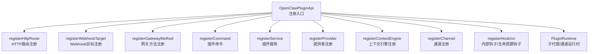
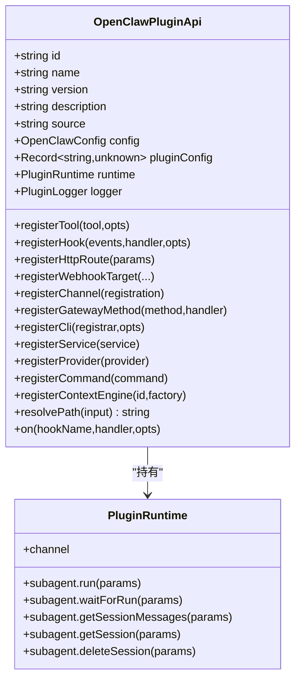
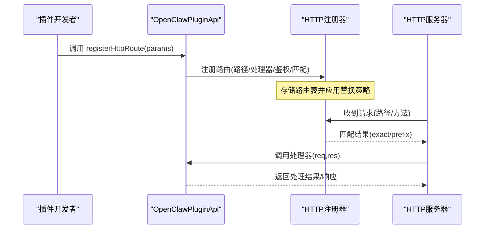
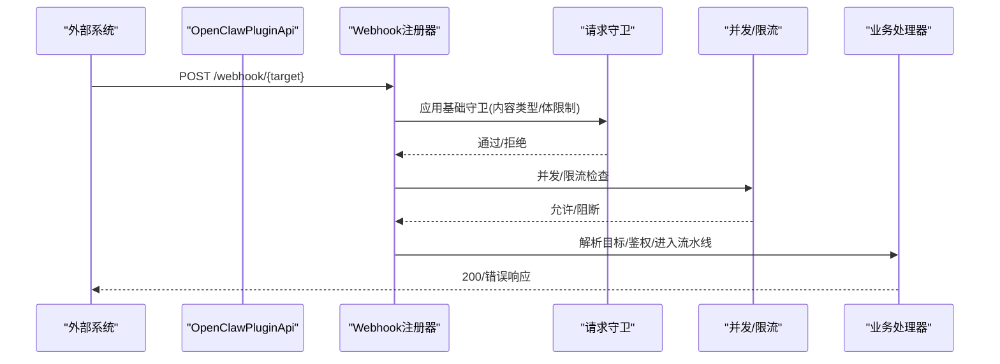
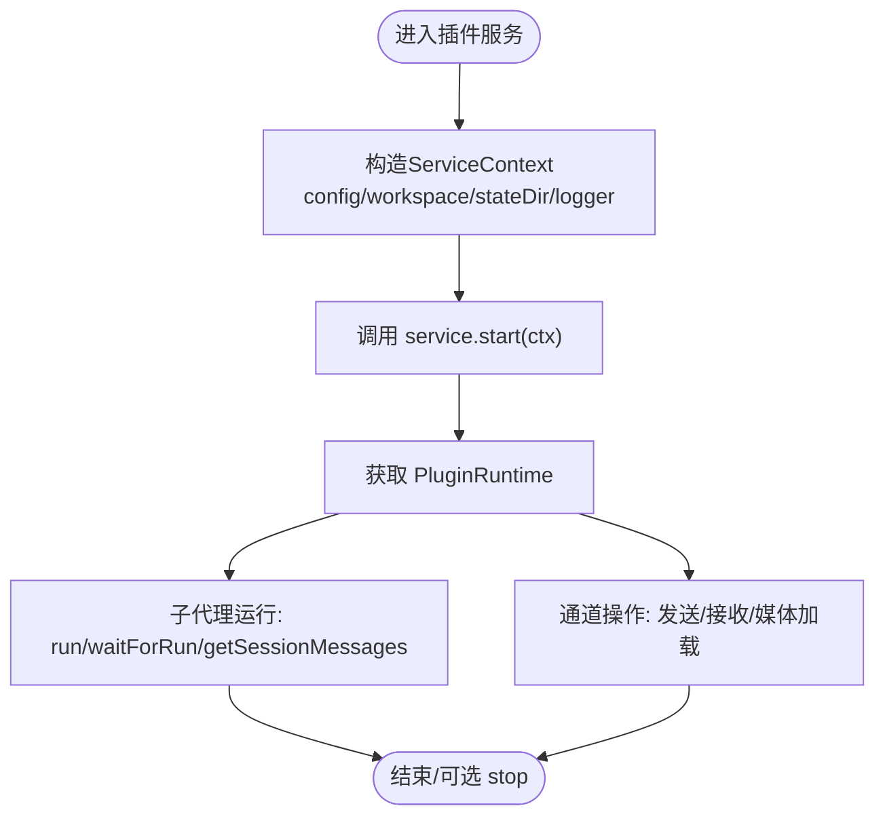
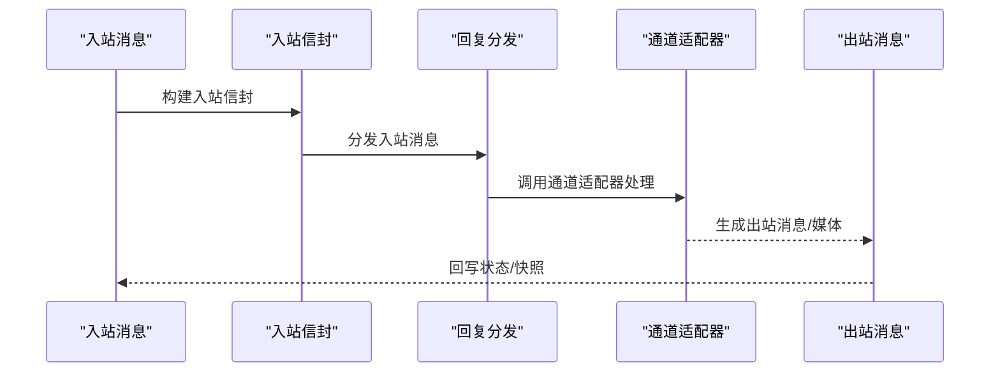
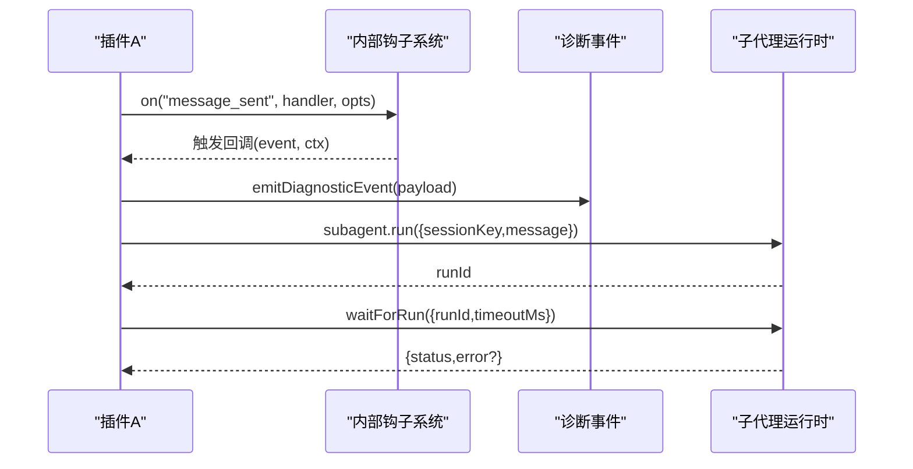
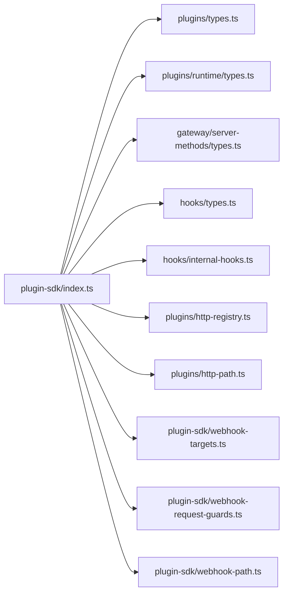

# 插件API参考

<cite>
**本文引用的文件**
- [src/plugin-sdk/index.ts](file://src/plugin-sdk/index.ts)
- [src/plugin-sdk/runtime.ts](file://src/plugin-sdk/runtime.ts)
- [src/plugins/types.ts](file://src/plugins/types.ts)
- [src/plugins/runtime/types.ts](file://src/plugins/runtime/types.ts)
- [src/channels/plugins/types.ts](file://src/channels/plugins/types.ts)
- [src/channels/plugins/types.plugin.ts](file://src/channels/plugins/types.plugin.ts)
- [src/gateway/server-methods/types.ts](file://src/gateway/server-methods/types.ts)
- [src/hooks/types.ts](file://src/hooks/types.ts)
- [src/hooks/internal-hooks.ts](file://src/hooks/internal-hooks.ts)
- [src/plugins/http-registry.ts](file://src/plugins/http-registry.ts)
- [src/plugins/http-path.ts](file://src/plugins/http-path.ts)
- [src/plugin-sdk/webhook-targets.ts](file://src/plugin-sdk/webhook-targets.ts)
- [src/plugin-sdk/webhook-request-guards.ts](file://src/plugin-sdk/webhook-request-guards.ts)
- [src/plugin-sdk/webhook-path.ts](file://src/plugin-sdk/webhook-path.ts)
- [src/plugin-sdk/provider-auth-result.ts](file://src/plugin-sdk/provider-auth-result.ts)
- [src/plugin-sdk/channel-lifecycle.ts](file://src/plugin-sdk/channel-lifecycle.ts)
- [src/plugin-sdk/status-helpers.ts](file://src/plugin-sdk/status-helpers.ts)
- [src/plugin-sdk/inbound-envelope.ts](file://src/plugin-sdk/inbound-envelope.ts)
- [src/plugin-sdk/inbound-reply-dispatch.ts](file://src/plugin-sdk/inbound-reply-dispatch.ts)
- [src/plugin-sdk/reply-payload.ts](file://src/plugin-sdk/reply-payload.ts)
- [src/plugin-sdk/outbound-media.ts](file://src/plugin-sdk/outbound-media.ts)
- [src/plugin-sdk/media-payload.ts](file://src/plugin-sdk/media-payload.ts)
- [src/plugin-sdk/tool-send.ts](file://src/plugin-sdk/tool-send.ts)
- [src/plugin-sdk/run-command.ts](file://src/plugin-sdk/run-command.ts)
- [src/plugin-sdk/windows-spawn.ts](file://src/plugin-sdk/windows-spawn.ts)
- [src/plugin-sdk/json-store.ts](file://src/plugin-sdk/json-store.ts)
- [src/plugin-sdk/temp-path.ts](file://src/plugin-sdk/temp-path.ts)
- [src/plugin-sdk/text-chunking.ts](file://src/plugin-sdk/text-chunking.ts)
- [src/plugin-sdk/boolean-param.ts](file://src/plugin-sdk/boolean-param.ts)
- [src/plugin-sdk/request-url.ts](file://src/plugin-sdk/request-url.ts)
- [src/plugin-sdk/allow-from.ts](file://src/plugin-sdk/allow-from.ts)
- [src/plugin-sdk/group-access.ts](file://src/plugin-sdk/group-access.ts)
- [src/plugin-sdk/command-auth.ts](file://src/plugin-sdk/command-auth.ts)
- [src/plugin-sdk/channel-config-helpers.ts](file://src/plugin-sdk/channel-config-helpers.ts)
- [src/plugin-sdk/config-paths.ts](file://src/plugin-sdk/config-paths.ts)
- [src/plugin-sdk/agent-media-payload.ts](file://src/plugin-sdk/agent-media-payload.ts)
- [src/plugin-sdk/channel-send-result.ts](file://src/plugin-sdk/channel-send-result.ts)
- [src/plugin-sdk/keyed-async-queue.ts](file://src/plugin-sdk/keyed-async-queue.ts)
- [src/plugin-sdk/file-lock.ts](file://src/plugin-sdk/file-lock.ts)
- [src/plugin-sdk/ssrf-policy.ts](file://src/plugin-sdk/ssrf-policy.ts)
- [src/plugin-sdk/fetch-auth.ts](file://src/plugin-sdk/fetch-auth.ts)
- [src/plugin-sdk/webhook-memory-guards.ts](file://src/plugin-sdk/webhook-memory-guards.ts)
- [src/plugin-sdk/persistent-dedupe.ts](file://src/plugin-sdk/persistent-dedupe.ts)
- [src/plugin-sdk/diagnostics-otel.ts](file://src/plugin-sdk/diagnostics-otel.ts)
- [src/plugin-sdk/device-pair.ts](file://src/plugin-sdk/device-pair.ts)
- [src/plugin-sdk/discord.ts](file://src/plugin-sdk/discord.ts)
- [src/plugin-sdk/telegram.ts](file://src/plugin-sdk/telegram.ts)
- [src/plugin-sdk/slack.ts](file://src/plugin-sdk/slack.ts)
- [src/plugin-sdk/whatsapp.ts](file://src/plugin-sdk/whatsapp.ts)
- [src/plugin-sdk/line.ts](file://src/plugin-sdk/line.ts)
- [src/plugin-sdk/irc.ts](file://src/plugin-sdk/irc.ts)
- [src/plugin-sdk/matrix.ts](file://src/plugin-sdk/matrix.ts)
- [src/plugin-sdk/mattermost.ts](file://src/plugin-sdk/mattermost.ts)
- [src/plugin-sdk/nextcloud-talk.ts](file://src/plugin-sdk/nextcloud-talk.ts)
- [src/plugin-sdk/nostr.ts](file://src/plugin-sdk/nostr.ts)
- [src/plugin-sdk/zalo.ts](file://src/plugin-sdk/zalo.ts)
- [src/plugin-sdk/zalouser.ts](file://src/plugin-sdk/zalouser.ts)
- [src/plugin-sdk/memory-core.ts](file://src/plugin-sdk/memory-core.ts)
- [src/plugin-sdk/memory-lancedb.ts](file://src/plugin-sdk/memory-lancedb.ts)
- [src/plugin-sdk/llm-task.ts](file://src/plugin-sdk/llm-task.ts)
- [src/plugin-sdk/lobster.ts](file://src/plugin-sdk/lobster.ts)
- [src/plugin-sdk/phone-control.ts](file://src/plugin-sdk/phone-control.ts)
- [src/plugin-sdk/talk-voice.ts](file://src/plugin-sdk/talk-voice.ts)
- [src/plugin-sdk/voice-call.ts](file://src/plugin-sdk/voice-call.ts)
- [src/plugin-sdk/twitch.ts](file://src/plugin-sdk/twitch.ts)
- [src/plugin-sdk/copilot-proxy.ts](file://src/plugin-sdk/copilot-proxy.ts)
- [src/plugin-sdk/google-gemini-cli-auth.ts](file://src/plugin-sdk/google-gemini-cli-auth.ts)
- [src/plugin-sdk/minimax-portal-auth.ts](file://src/plugin-sdk/minimax-portal-auth.ts)
- [src/plugin-sdk/qwen-portal-auth.ts](file://src/plugin-sdk/qwen-portal-auth.ts)
- [src/plugin-sdk/open-prose.ts](file://src/plugin-sdk/open-prose.ts)
- [src/plugin-sdk/thread-ownership.ts](file://src/plugin-sdk/thread-ownership.ts)
- [src/plugin-sdk/tlon.ts](file://src/plugin-sdk/tlon.ts)
- [src/plugin-sdk/acpx.ts](file://src/plugin-sdk/acpx.ts)
- [src/plugin-sdk/onboarding.ts](file://src/plugin-sdk/onboarding.ts)
- [src/plugin-sdk/bluebubbles.ts](file://src/plugin-sdk/bluebubbles.ts)
- [src/plugin-sdk/feishu.ts](file://src/plugin-sdk/feishu.ts)
- [src/plugin-sdk/googlechat.ts](file://src/plugin-sdk/googlechat.ts)
- [src/plugin-sdk/imessage.ts](file://src/plugin-sdk/imessage.ts)
- [src/plugin-sdk/signal.ts](file://src/plugin-sdk/signal.ts)
- [src/plugin-sdk/synology-chat.ts](file://src/plugin-sdk/synology-chat.ts)
- [src/plugin-sdk/compat.ts](file://src/plugin-sdk/compat.ts)
- [src/plugin-sdk/test-utils.ts](file://src/plugin-sdk/test-utils.ts)
- [src/plugin-sdk/subpaths.test.ts](file://src/plugin-sdk/subpaths.test.ts)
- [src/plugin-sdk/index.test.ts](file://src/plugin-sdk/index.test.ts)
- [src/plugin-sdk/runtime.test.ts](file://src/plugin-sdk/runtime.test.ts)
- [src/plugin-sdk/webhook-targets.test.ts](file://src/plugin-sdk/webhook-targets.test.ts)
- [src/plugin-sdk/webhook-request-guards.test.ts](file://src/plugin-sdk/webhook-request-guards.test.ts)
- [src/plugin-sdk/webhook-memory-guards.test.ts](file://src/plugin-sdk/webhook-memory-guards.test.ts)
- [src/plugin-sdk/persistent-dedupe.test.ts](file://src/plugin-sdk/persistent-dedupe.test.ts)
- [src/plugin-sdk/group-access.test.ts](file://src/plugin-sdk/group-access.test.ts)
- [src/plugin-sdk/command-auth.test.ts](file://src/plugin-sdk/command-auth.test.ts)
- [src/plugin-sdk/allowlist-resolution.test.ts](file://src/plugin-sdk/allowlist-resolution.test.ts)
- [src/plugin-sdk/channel-lifecycle.test.ts](file://src/plugin-sdk/channel-lifecycle.test.ts)
- [src/plugin-sdk/status-helpers.test.ts](file://src/plugin-sdk/status-helpers.test.ts)
- [src/plugin-sdk/text-chunking.test.ts](file://src/plugin-sdk/text-chunking.test.ts)
- [src/plugin-sdk/boolean-param.test.ts](file://src/plugin-sdk/boolean-param.test.ts)
- [src/plugin-sdk/request-url.test.ts](file://src/plugin-sdk/request-url.test.ts)
- [src/plugin-sdk/allow-from.test.ts](file://src/plugin-sdk/allow-from.test.ts)
- [src/plugin-sdk/channel-config-helpers.test.ts](file://src/plugin-sdk/channel-config-helpers.test.ts)
- [src/plugin-sdk/agent-media-payload.test.ts](file://src/plugin-sdk/agent-media-payload.test.ts)
- [src/plugin-sdk/channel-send-result.test.ts](file://src/plugin-sdk/channel-send-result.test.ts)
- [src/plugin-sdk/keyed-async-queue.test.ts](file://src/plugin-sdk/keyed-async-queue.test.ts)
- [src/plugin-sdk/file-lock.test.ts](file://src/plugin-sdk/file-lock.test.ts)
- [src/plugin-sdk/ssrf-policy.test.ts](file://src/plugin-sdk/ssrf-policy.test.ts)
- [src/plugin-sdk/fetch-auth.test.ts](file://src/plugin-sdk/fetch-auth.test.ts)
- [src/plugin-sdk/discord-send.ts](file://src/plugin-sdk/discord-send.ts)
- [src/plugin-sdk/discord.ts](file://src/plugin-sdk/discord.ts)
- [src/plugin-sdk/telegram.ts](file://src/plugin-sdk/telegram.ts)
- [src/plugin-sdk/slack.ts](file://src/plugin-sdk/slack.ts)
- [src/plugin-sdk/whatsapp.ts](file://src/plugin-sdk/whatsapp.ts)
- [src/plugin-sdk/line.ts](file://src/plugin-sdk/line.ts)
- [src/plugin-sdk/irc.ts](file://src/plugin-sdk/irc.ts)
- [src/plugin-sdk/matrix.ts](file://src/plugin-sdk/matrix.ts)
- [src/plugin-sdk/mattermost.ts](file://src/plugin-sdk/mattermost.ts)
- [src/plugin-sdk/nextcloud-talk.ts](file://src/plugin-sdk/nextcloud-talk.ts)
- [src/plugin-sdk/nostr.ts](file://src/plugin-sdk/nostr.ts)
- [src/plugin-sdk/zalo.ts](file://src/plugin-sdk/zalo.ts)
- [src/plugin-sdk/zalouser.ts](file://src/plugin-sdk/zalouser.ts)
- [src/plugin-sdk/memory-core.ts](file://src/plugin-sdk/memory-core.ts)
- [src/plugin-sdk/memory-lancedb.ts](file://src/plugin-sdk/memory-lancedb.ts)
- [src/plugin-sdk/llm-task.ts](file://src/plugin-sdk/llm-task.ts)
- [src/plugin-sdk/lobster.ts](file://src/plugin-sdk/lobster.ts)
- [src/plugin-sdk/phone-control.ts](file://src/plugin-sdk/phone-control.ts)
- [src/plugin-sdk/talk-voice.ts](file://src/plugin-sdk/talk-voice.ts)
- [src/plugin-sdk/voice-call.ts](file://src/plugin-sdk/voice-call.ts)
- [src/plugin-sdk/twitch.ts](file://src/plugin-sdk/twitch.ts)
- [src/plugin-sdk/copilot-proxy.ts](file://src/plugin-sdk/copilot-proxy.ts)
- [src/plugin-sdk/google-gemini-cli-auth.ts](file://src/plugin-sdk/google-gemini-cli-auth.ts)
- [src/plugin-sdk/minimax-portal-auth.ts](file://src/plugin-sdk/minimax-portal-auth.ts)
- [src/plugin-sdk/qwen-portal-auth.ts](file://src/plugin-sdk/qwen-portal-auth.ts)
- [src/plugin-sdk/open-prose.ts](file://src/plugin-sdk/open-prose.ts)
- [src/plugin-sdk/thread-ownership.ts](file://src/plugin-sdk/thread-ownership.ts)
- [src/plugin-sdk/tlon.ts](file://src/plugin-sdk/tlon.ts)
- [src/plugin-sdk/acpx.ts](file://src/plugin-sdk/acpx.ts)
- [src/plugin-sdk/onboarding.ts](file://src/plugin-sdk/onboarding.ts)
- [src/plugin-sdk/bluebubbles.ts](file://src/plugin-sdk/bluebubbles.ts)
- [src/plugin-sdk/feishu.ts](file://src/plugin-sdk/feishu.ts)
- [src/plugin-sdk/googlechat.ts](file://src/plugin-sdk/googlechat.ts)
- [src/plugin-sdk/imessage.ts](file://src/plugin-sdk/imessage.ts)
- [src/plugin-sdk/signal.ts](file://src/plugin-sdk/signal.ts)
- [src/plugin-sdk/synology-chat.ts](file://src/plugin-sdk/synology-chat.ts)
- [src/plugin-sdk/compat.ts](file://src/plugin-sdk/compat.ts)
- [src/plugin-sdk/test-utils.ts](file://src/plugin-sdk/test-utils.ts)
- [src/plugin-sdk/subpaths.test.ts](file://src/plugin-sdk/subpaths.test.ts)
- [src/plugin-sdk/index.test.ts](file://src/plugin-sdk/index.test.ts)
- [src/plugin-sdk/runtime.test.ts](file://src/plugin-sdk/runtime.test.ts)
- [src/plugin-sdk/webhook-targets.test.ts](file://src/plugin-sdk/webhook-targets.test.ts)
- [src/plugin-sdk/webhook-request-guards.test.ts](file://src/plugin-sdk/webhook-request-guards.test.ts)
- [src/plugin-sdk/webhook-memory-guards.test.ts](file://src/plugin-sdk/webhook-memory-guards.test.ts)
- [src/plugin-sdk/persistent-dedupe.test.ts](file://src/plugin-sdk/persistent-dedupe.test.ts)
- [src/plugin-sdk/group-access.test.ts](file://src/plugin-sdk/group-access.test.ts)
- [src/plugin-sdk/command-auth.test.ts](file://src/plugin-sdk/command-auth.test.ts)
- [src/plugin-sdk/allowlist-resolution.test.ts](file://src/plugin-sdk/allowlist-resolution.test.ts)
- [src/plugin-sdk/channel-lifecycle.test.ts](file://src/plugin-sdk/channel-lifecycle.test.ts)
- [src/plugin-sdk/status-helpers.test.ts](file://src/plugin-sdk/status-helpers.test.ts)
- [src/plugin-sdk/text-chunking.test.ts](file://src/plugin-sdk/text-chunking.test.ts)
- [src/plugin-sdk/boolean-param.test.ts](file://src/plugin-sdk/boolean-param.test.ts)
- [src/plugin-sdk/request-url.test.ts](file://src/plugin-sdk/request-url.test.ts)
- [src/plugin-sdk/allow-from.test.ts](file://src/plugin-sdk/allow-from.test.ts)
- [src/plugin-sdk/channel-config-helpers.test.ts](file://src/plugin-sdk/channel-config-helpers.test.ts)
- [src/plugin-sdk/agent-media-payload.test.ts](file://src/plugin-sdk/agent-media-payload.test.ts)
- [src/plugin-sdk/channel-send-result.test.ts](file://src/plugin-sdk/channel-send-result.test.ts)
- [src/plugin-sdk/keyed-async-queue.test.ts](file://src/plugin-sdk/keyed-async-queue.test.ts)
- [src/plugin-sdk/file-lock.test.ts](file://src/plugin-sdk/file-lock.test.ts)
- [src/plugin-sdk/ssrf-policy.test.ts](file://src/plugin-sdk/ssrf-policy.test.ts)
- [src/plugin-sdk/fetch-auth.test.ts](file://src/plugin-sdk/fetch-auth.test.ts)
</cite>

## 目录
1. [简介](#简介)
2. [项目结构](#项目结构)
3. [核心组件](#核心组件)
4. [架构总览](#架构总览)
5. [详细组件分析](#详细组件分析)
6. [依赖关系分析](#依赖关系分析)
7. [性能考量](#性能考量)
8. [故障排查指南](#故障排查指南)
9. [结论](#结论)
10. [附录](#附录)

## 简介
本参考文档面向使用 OpenClaw 插件 SDK 的开发者，系统性梳理插件API的公共接口与运行时能力，覆盖以下主题：
- 核心类型：ChannelPlugin、OpenClawPluginApi、PluginRuntime 等
- 生命周期与钩子：initialize、shutdown、配置变更回调、消息与工具链路钩子
- 插件上下文对象：日志、配置访问、会话与通道交互
- 注册机制：HTTP 路由、Webhook 目标、CLI 命令、服务、提供者、上下文引擎
- 插件间通信与事件系统：内部钩子、诊断事件、子代理运行时
- 类型定义与接口规范，并通过“章节来源”定位到具体实现文件

## 项目结构
OpenClaw 将插件API集中于 src/plugin-sdk 与 src/plugins 两个目录：
- src/plugin-sdk：通用插件开发工具集与导出入口（如 HTTP/Webhook 注册、路径与锁、SSRF 策略、媒体与文本处理、命令执行、Windows Spawn 等）
- src/plugins：插件框架核心类型与运行时（OpenClawPluginApi、PluginRuntime、钩子事件模型、HTTP 路由注册器等）

**图表来源**
- [src/plugin-sdk/index.ts:1-826](file://src/plugin-sdk/index.ts#L1-L826)
- [src/plugins/types.ts:1-893](file://src/plugins/types.ts#L1-L893)
- [src/plugins/runtime/types.ts:1-64](file://src/plugins/runtime/types.ts#L1-L64)

**章节来源**
- [src/plugin-sdk/index.ts:1-826](file://src/plugin-sdk/index.ts#L1-L826)
- [src/plugins/types.ts:1-893](file://src/plugins/types.ts#L1-L893)
- [src/plugins/runtime/types.ts:1-64](file://src/plugins/runtime/types.ts#L1-L64)

## 核心组件
本节聚焦插件API的关键类型与职责边界。

- OpenClawPluginApi：插件对外暴露的统一入口，提供注册工具、钩子、HTTP 路由、通道、网关方法、CLI、服务、提供者、命令与上下文引擎的能力，并携带插件标识、名称、版本、描述、来源、配置、运行时与日志器。
- PluginRuntime：插件在运行时可调用的子代理运行时与通道运行时，支持运行子代理、等待运行、查询会话消息、删除会话等。
- ChannelPlugin：通道插件类型，用于对接具体消息通道（Discord、Telegram、Slack 等）。
- OpenClawPluginConfigSchema：插件配置模式，支持 Zod 风格的解析与 UI 提示。
- ProviderPlugin：第三方模型或服务提供者的认证与模型声明。
- OpenClawPluginCommandDefinition：插件自定义命令定义，绕过 LLM，优先于内置命令与代理执行。
- OpenClawPluginService：插件服务生命周期（start/stop），与工作区/状态目录/日志集成。
- OpenClawPluginHttpRouteParams：HTTP 路由注册参数（路径、处理器、鉴权方式、匹配策略、替换行为）。
- OpenClawPluginGatewayMethod：网关方法注册（方法名与处理器）。
- 内部钩子与诊断事件：涵盖模型解析、提示构建、代理运行、消息收发、工具调用、会话管理、子代理生命周期、网关启停等。

**章节来源**
- [src/plugins/types.ts:263-306](file://src/plugins/types.ts#L263-L306)
- [src/plugins/runtime/types.ts:51-63](file://src/plugins/runtime/types.ts#L51-L63)
- [src/channels/plugins/types.ts](file://src/channels/plugins/types.ts)
- [src/channels/plugins/types.plugin.ts](file://src/channels/plugins/types.plugin.ts)
- [src/plugins/types.ts:44-56](file://src/plugins/types.ts#L44-L56)
- [src/plugins/types.ts:122-132](file://src/plugins/types.ts#L122-L132)
- [src/plugins/types.ts:186-203](file://src/plugins/types.ts#L186-L203)
- [src/plugins/types.ts:237-241](file://src/plugins/types.ts#L237-L241)
- [src/plugins/types.ts:213-219](file://src/plugins/types.ts#L213-L219)
- [src/plugins/types.ts:134-137](file://src/plugins/types.ts#L134-L137)
- [src/hooks/types.ts](file://src/hooks/types.ts)
- [src/hooks/internal-hooks.ts](file://src/hooks/internal-hooks.ts)

## 架构总览
下图展示插件API在运行时的整体交互：插件通过 OpenClawPluginApi 注册能力；运行时通过 PluginRuntime 访问子代理与通道；HTTP/Webhook 作为外部入口；通道插件负责消息编解码与发送；提供者插件负责认证与模型声明；内部钩子贯穿消息与工具链路。

**图表来源**
- [src/plugins/types.ts:273-306](file://src/plugins/types.ts#L273-L306)
- [src/plugins/runtime/types.ts:51-63](file://src/plugins/runtime/types.ts#L51-L63)
- [src/plugin-sdk/webhook-targets.ts](file://src/plugin-sdk/webhook-targets.ts)
- [src/plugin-sdk/webhook-path.ts](file://src/plugin-sdk/webhook-path.ts)
- [src/plugins/http-registry.ts](file://src/plugins/http-registry.ts)
- [src/plugins/http-path.ts](file://src/plugins/http-path.ts)
- [src/gateway/server-methods/types.ts](file://src/gateway/server-methods/types.ts)
- [src/hooks/types.ts](file://src/hooks/types.ts)
- [src/hooks/internal-hooks.ts](file://src/hooks/internal-hooks.ts)

## 详细组件分析

### 组件A：OpenClawPluginApi 与生命周期钩子
- 能力清单
  - 工具注册：registerTool（支持工厂函数）
  - 钩子注册：registerHook（事件名、处理器、选项）
  - 生命周期钩子：on（带优先级）
  - HTTP 路由注册：registerHttpRoute（路径、处理器、鉴权、匹配策略）
  - Webhook 目标注册：registerWebhookTarget/registerWebhookTargetWithPluginRoute
  - 通道注册：registerChannel（支持 ChannelPlugin 与 Dock）
  - 网关方法注册：registerGatewayMethod（方法名与处理器）
  - CLI 注册：registerCli（program、config、logger）
  - 服务注册：registerService（start/stop）
  - 提供者注册：registerProvider（模型、认证方法）
  - 自定义命令：registerCommand（绕过代理）
  - 上下文引擎注册：registerContextEngine（独占槽位）
  - 路径解析：resolvePath
- 生命周期钩子
  - 消息链路：message_received → message_sending → message_sent
  - 代理链路：before_model_resolve → before_prompt_build → before_agent_start → llm_input → llm_output → agent_end
  - 工具链路：before_tool_call → after_tool_call → tool_result_persist
  - 会话链路：session_start → session_end
  - 子代理链路：subagent_spawning → subagent_delivery_target → subagent_spawned → subagent_ended
  - 网关链路：gateway_start → gateway_stop
  - 其他：before_compaction → after_compaction、before_reset、before_message_write

**图表来源**
- [src/plugins/types.ts:263-306](file://src/plugins/types.ts#L263-L306)
- [src/plugins/runtime/types.ts:51-63](file://src/plugins/runtime/types.ts#L51-L63)

**章节来源**
- [src/plugins/types.ts:263-306](file://src/plugins/types.ts#L263-L306)
- [src/plugins/types.ts:321-394](file://src/plugins/types.ts#L321-L394)
- [src/plugins/types.ts:559-591](file://src/plugins/types.ts#L559-L591)
- [src/plugins/types.ts:594-641](file://src/plugins/types.ts#L594-L641)
- [src/plugins/types.ts:660-669](file://src/plugins/types.ts#L660-L669)
- [src/plugins/types.ts:672-691](file://src/plugins/types.ts#L672-L691)
- [src/plugins/types.ts:694-769](file://src/plugins/types.ts#L694-L769)
- [src/plugins/types.ts:771-784](file://src/plugins/types.ts#L771-L784)

### 组件B：HTTP 路由注册与鉴权
- 注册入口：registerHttpRoute（路径、处理器、鉴权方式、匹配策略、替换行为）
- 路径处理：normalizePluginHttpPath（规范化）、plugins/http-path（路径工具）
- 鉴权策略：OpenClawPluginHttpRouteAuth（gateway/plugin）
- 匹配策略：OpenClawPluginHttpRouteMatch（exact/prefix）
- 处理器签名：OpenClawPluginHttpRouteHandler（Node http.IncomingMessage/ServerResponse）

**图表来源**
- [src/plugins/types.ts:213-219](file://src/plugins/types.ts#L213-L219)
- [src/plugins/http-registry.ts](file://src/plugins/http-registry.ts)
- [src/plugins/http-path.ts](file://src/plugins/http-path.ts)

**章节来源**
- [src/plugins/types.ts:213-219](file://src/plugins/types.ts#L213-L219)
- [src/plugins/http-registry.ts](file://src/plugins/http-registry.ts)
- [src/plugins/http-path.ts](file://src/plugins/http-path.ts)

### 组件C：Webhook 目标注册与请求守卫
- 注册目标：registerWebhookTarget/registerWebhookTargetWithPluginRoute
- 路径解析：normalizeWebhookPath/resolveWebhookPath
- 请求守卫：applyBasicWebhookRequestGuards/beginWebhookRequestPipelineOrReject/readJsonBodyWithLimit
- 并发与限流：WebhookInFlightLimiter/BoundedCounter/FixedWindowRateLimiter/WebhookAnomalyTracker
- 安全校验：SSRF 策略与主机白名单

**图表来源**
- [src/plugin-sdk/webhook-targets.ts](file://src/plugin-sdk/webhook-targets.ts)
- [src/plugin-sdk/webhook-request-guards.ts](file://src/plugin-sdk/webhook-request-guards.ts)
- [src/plugin-sdk/webhook-memory-guards.ts](file://src/plugin-sdk/webhook-memory-guards.ts)
- [src/plugin-sdk/webhook-path.ts](file://src/plugin-sdk/webhook-path.ts)

**章节来源**
- [src/plugin-sdk/webhook-targets.ts](file://src/plugin-sdk/webhook-targets.ts)
- [src/plugin-sdk/webhook-request-guards.ts](file://src/plugin-sdk/webhook-request-guards.ts)
- [src/plugin-sdk/webhook-memory-guards.ts](file://src/plugin-sdk/webhook-memory-guards.ts)
- [src/plugin-sdk/webhook-path.ts](file://src/plugin-sdk/webhook-path.ts)

### 组件D：插件上下文对象与运行时
- OpenClawPluginServiceContext：包含 config/workspace/stateDir/logger
- OpenClawPluginToolContext：包含会话、代理、消息通道、请求者身份、沙箱标记等
- PluginRuntime：子代理运行时（run/waitForRun/getSessionMessages/getSession/deleteSession）与通道运行时
- 运行时环境适配：createLoggerBackedRuntime/resolveRuntimeEnv/resolveRuntimeEnvWithUnavailableExit

**图表来源**
- [src/plugins/types.ts:230-235](file://src/plugins/types.ts#L230-L235)
- [src/plugins/types.ts:58-73](file://src/plugins/types.ts#L58-L73)
- [src/plugins/runtime/types.ts:51-63](file://src/plugins/runtime/types.ts#L51-L63)
- [src/plugin-sdk/runtime.ts:9-44](file://src/plugin-sdk/runtime.ts#L9-L44)

**章节来源**
- [src/plugins/types.ts:230-235](file://src/plugins/types.ts#L230-L235)
- [src/plugins/types.ts:58-73](file://src/plugins/types.ts#L58-L73)
- [src/plugins/runtime/types.ts:51-63](file://src/plugins/runtime/types.ts#L51-L63)
- [src/plugin-sdk/runtime.ts:9-44](file://src/plugin-sdk/runtime.ts#L9-L44)

### 组件E：通道插件与消息生命周期
- ChannelPlugin：通道插件类型定义
- ChannelLifecycle：被动账户生命周期、保持HTTP任务存活、等待中断
- InboundEnvelope/InboundReplyDispatch：入站信封与回复分发
- ReplyPayload/OutboundMedia/MediaPayload：回复载荷与出站媒体
- StatusHelpers：构建账户/通道/令牌/运行时状态快照与问题收集

**图表来源**
- [src/channels/plugins/types.ts](file://src/channels/plugins/types.ts)
- [src/plugin-sdk/inbound-envelope.ts](file://src/plugin-sdk/inbound-envelope.ts)
- [src/plugin-sdk/inbound-reply-dispatch.ts](file://src/plugin-sdk/inbound-reply-dispatch.ts)
- [src/plugin-sdk/reply-payload.ts](file://src/plugin-sdk/reply-payload.ts)
- [src/plugin-sdk/outbound-media.ts](file://src/plugin-sdk/outbound-media.ts)
- [src/plugin-sdk/media-payload.ts](file://src/plugin-sdk/media-payload.ts)
- [src/plugin-sdk/status-helpers.ts](file://src/plugin-sdk/status-helpers.ts)
- [src/plugin-sdk/channel-lifecycle.ts](file://src/plugin-sdk/channel-lifecycle.ts)

**章节来源**
- [src/channels/plugins/types.ts](file://src/channels/plugins/types.ts)
- [src/plugin-sdk/inbound-envelope.ts](file://src/plugin-sdk/inbound-envelope.ts)
- [src/plugin-sdk/inbound-reply-dispatch.ts](file://src/plugin-sdk/inbound-reply-dispatch.ts)
- [src/plugin-sdk/reply-payload.ts](file://src/plugin-sdk/reply-payload.ts)
- [src/plugin-sdk/outbound-media.ts](file://src/plugin-sdk/outbound-media.ts)
- [src/plugin-sdk/media-payload.ts](file://src/plugin-sdk/media-payload.ts)
- [src/plugin-sdk/status-helpers.ts](file://src/plugin-sdk/status-helpers.ts)
- [src/plugin-sdk/channel-lifecycle.ts](file://src/plugin-sdk/channel-lifecycle.ts)

### 组件F：插件间通信与事件系统
- 内部钩子：InternalHookHandler 与 HookEntry，支持事件名数组注册
- 诊断事件：emitDiagnosticEvent/onDiagnosticEvent/isDiagnosticsEnabled
- 子代理运行时：run/waitForRun/getSessionMessages/deleteSession
- 线程绑定与会话键：resolveThreadSessionKeys/DEFAULT_ACCOUNT_ID/normalizeAccountId/normalizeAgentId

**图表来源**
- [src/hooks/internal-hooks.ts](file://src/hooks/internal-hooks.ts)
- [src/hooks/types.ts](file://src/hooks/types.ts)
- [src/plugins/types.ts:300-305](file://src/plugins/types.ts#L300-L305)
- [src/plugins/runtime/types.ts:8-29](file://src/plugins/runtime/types.ts#L8-L29)
- [src/plugin-sdk/index.ts:623-626](file://src/plugin-sdk/index.ts#L623-L626)

**章节来源**
- [src/hooks/internal-hooks.ts](file://src/hooks/internal-hooks.ts)
- [src/hooks/types.ts](file://src/hooks/types.ts)
- [src/plugins/types.ts:300-305](file://src/plugins/types.ts#L300-L305)
- [src/plugins/runtime/types.ts:8-29](file://src/plugins/runtime/types.ts#L8-L29)
- [src/plugin-sdk/index.ts:623-626](file://src/plugin-sdk/index.ts#L623-L626)

### 组件G：配置与安全工具
- 配置模式：OpenClawPluginConfigSchema（safeParse/parse/validate/uiHints/jsonSchema）
- 配置路径：resolveChannelAccountConfigBasePath/resolveRuntimeGroupPolicy
- 允许来源与群组访问：normalizeAllowFrom/requireOpenAllowFrom/evaluateGroupRouteAccessForPolicy
- 命令授权：resolveSenderCommandAuthorization/WithRuntime
- SSRF 策略：buildHostnameAllowlistPolicyFromSuffixAllowlist/isHttpsUrlAllowedByHostnameSuffixAllowlist
- 去重与幂等：createPersistentDedupe/PersistentDedupe
- 文件锁与并发队列：withFileLock/KeyedAsyncQueue

**章节来源**
- [src/plugins/types.ts:44-56](file://src/plugins/types.ts#L44-L56)
- [src/plugin-sdk/config-paths.ts](file://src/plugin-sdk/config-paths.ts)
- [src/plugin-sdk/allow-from.ts](file://src/plugin-sdk/allow-from.ts)
- [src/plugin-sdk/group-access.ts](file://src/plugin-sdk/group-access.ts)
- [src/plugin-sdk/command-auth.ts](file://src/plugin-sdk/command-auth.ts)
- [src/plugin-sdk/ssrf-policy.ts](file://src/plugin-sdk/ssrf-policy.ts)
- [src/plugin-sdk/persistent-dedupe.ts](file://src/plugin-sdk/persistent-dedupe.ts)
- [src/plugin-sdk/file-lock.ts](file://src/plugin-sdk/file-lock.ts)
- [src/plugin-sdk/keyed-async-queue.ts](file://src/plugin-sdk/keyed-async-queue.ts)

### 组件H：工具与媒体处理
- 工具发送提取：extractToolSend
- 文本分块：chunkTextForOutbound
- 布尔参数读取：readBooleanParam
- 请求URL解析：resolveRequestUrl
- 出站媒体加载：loadOutboundMediaFromUrl
- 代理媒体载荷：buildAgentMediaPayload/AgentMediaPayload
- 发送结果：buildChannelSendResult/ChannelSendRawResult

**章节来源**
- [src/plugin-sdk/tool-send.ts](file://src/plugin-sdk/tool-send.ts)
- [src/plugin-sdk/text-chunking.ts](file://src/plugin-sdk/text-chunking.ts)
- [src/plugin-sdk/boolean-param.ts](file://src/plugin-sdk/boolean-param.ts)
- [src/plugin-sdk/request-url.ts](file://src/plugin-sdk/request-url.ts)
- [src/plugin-sdk/outbound-media.ts](file://src/plugin-sdk/outbound-media.ts)
- [src/plugin-sdk/agent-media-payload.ts](file://src/plugin-sdk/agent-media-payload.ts)
- [src/plugin-sdk/channel-send-result.ts](file://src/plugin-sdk/channel-send-result.ts)

### 组件I：平台通道适配（示例）
- Discord/Telegram/Slack/WhatsApp/LINE/IRC/Matrix/Mattermost/Nextcloud Talk/Nostr/Zalo/ZaloUser
- 提供账户解析、消息标准化、状态问题收集、线程工具上下文等

**章节来源**
- [src/plugin-sdk/discord.ts](file://src/plugin-sdk/discord.ts)
- [src/plugin-sdk/telegram.ts](file://src/plugin-sdk/telegram.ts)
- [src/plugin-sdk/slack.ts](file://src/plugin-sdk/slack.ts)
- [src/plugin-sdk/whatsapp.ts](file://src/plugin-sdk/whatsapp.ts)
- [src/plugin-sdk/line.ts](file://src/plugin-sdk/line.ts)
- [src/plugin-sdk/irc.ts](file://src/plugin-sdk/irc.ts)
- [src/plugin-sdk/matrix.ts](file://src/plugin-sdk/matrix.ts)
- [src/plugin-sdk/mattermost.ts](file://src/plugin-sdk/mattermost.ts)
- [src/plugin-sdk/nextcloud-talk.ts](file://src/plugin-sdk/nextcloud-talk.ts)
- [src/plugin-sdk/nostr.ts](file://src/plugin-sdk/nostr.ts)
- [src/plugin-sdk/zalo.ts](file://src/plugin-sdk/zalo.ts)
- [src/plugin-sdk/zalouser.ts](file://src/plugin-sdk/zalouser.ts)

## 依赖关系分析
- 聚合导出：src/plugin-sdk/index.ts 将大量工具与注册器导出，形成统一入口
- 运行时耦合：OpenClawPluginApi 依赖 PluginRuntime；PluginRuntime 依赖子代理与通道运行时
- 注册器耦合：HTTP/Webhook 注册器与路径工具紧密协作
- 钩子系统：内部钩子与诊断事件相互补充，覆盖消息、工具、会话、子代理、网关生命周期

**图表来源**
- [src/plugin-sdk/index.ts:1-826](file://src/plugin-sdk/index.ts#L1-L826)
- [src/plugins/types.ts:1-893](file://src/plugins/types.ts#L1-L893)
- [src/plugins/runtime/types.ts:1-64](file://src/plugins/runtime/types.ts#L1-L64)
- [src/gateway/server-methods/types.ts](file://src/gateway/server-methods/types.ts)
- [src/hooks/types.ts](file://src/hooks/types.ts)
- [src/hooks/internal-hooks.ts](file://src/hooks/internal-hooks.ts)
- [src/plugins/http-registry.ts](file://src/plugins/http-registry.ts)
- [src/plugins/http-path.ts](file://src/plugins/http-path.ts)
- [src/plugin-sdk/webhook-targets.ts](file://src/plugin-sdk/webhook-targets.ts)
- [src/plugin-sdk/webhook-request-guards.ts](file://src/plugin-sdk/webhook-request-guards.ts)
- [src/plugin-sdk/webhook-path.ts](file://src/plugin-sdk/webhook-path.ts)

**章节来源**
- [src/plugin-sdk/index.ts:1-826](file://src/plugin-sdk/index.ts#L1-L826)

## 性能考量
- 并发与限流：WebhookInFlightLimiter/BoundedCounter/FixedWindowRateLimiter 可有效防止突发流量
- 去重与幂等：PersistentDedupe 降低重复处理成本
- 键控异步队列：KeyedAsyncQueue 保证同键任务串行，避免资源竞争
- 文本分块：chunkTextForOutbound 控制单次发送大小，提升稳定性
- SSRF 与请求体限制：SSRF 策略与请求体限制可减少恶意请求带来的资源消耗

[本节为通用指导，无需特定文件来源]

## 故障排查指南
- Webhook 请求失败
  - 检查内容类型与体大小限制：isJsonContentType/readJsonBodyWithLimit
  - 并发/限流触发：WEBHOOK_IN_FLIGHT_DEFAULTS/WEBHOOK_RATE_LIMIT_DEFAULTS
  - 异常计数器：WEBHOOK_ANOMALY_COUNTER_DEFAULTS
- HTTP 路由冲突
  - 使用 replaceExisting 参数或精确匹配策略
  - 路径规范化：normalizePluginHttpPath
- 运行时退出不可用
  - 使用 resolveRuntimeEnvWithUnavailableExit 提供不可用消息
- 配置校验失败
  - 使用 OpenClawPluginConfigSchema.safeParse/validate 获取详细错误
- 诊断事件
  - 启用诊断事件：isDiagnosticsEnabled/onDiagnosticEvent/emitDiagnosticEvent

**章节来源**
- [src/plugin-sdk/webhook-request-guards.ts:431-439](file://src/plugin-sdk/webhook-request-guards.ts#L431-L439)
- [src/plugin-sdk/webhook-memory-guards.ts:441-447](file://src/plugin-sdk/webhook-memory-guards.ts#L441-L447)
- [src/plugin-sdk/runtime.ts:34-44](file://src/plugin-sdk/runtime.ts#L34-L44)
- [src/plugins/types.ts:44-56](file://src/plugins/types.ts#L44-L56)
- [src/plugin-sdk/index.ts:623-626](file://src/plugin-sdk/index.ts#L623-L626)

## 结论
OpenClaw 插件API以 OpenClawPluginApi 为核心，结合 PluginRuntime 与丰富的注册器、工具集，提供了从 HTTP/Webhook 入口、通道适配、消息与工具链路钩子、子代理运行时到诊断事件的完整能力谱系。通过标准化的配置模式、安全策略与并发控制，插件可在多通道场景中稳定扩展。

[本节为总结，无需特定文件来源]

## 附录
- 实际代码示例请参考各章节“章节来源”所标注的文件路径，避免直接粘贴源码内容
- 测试用例可参考 src/plugin-sdk/*test.ts 文件，验证各模块行为

[本节为补充说明，无需特定文件来源]