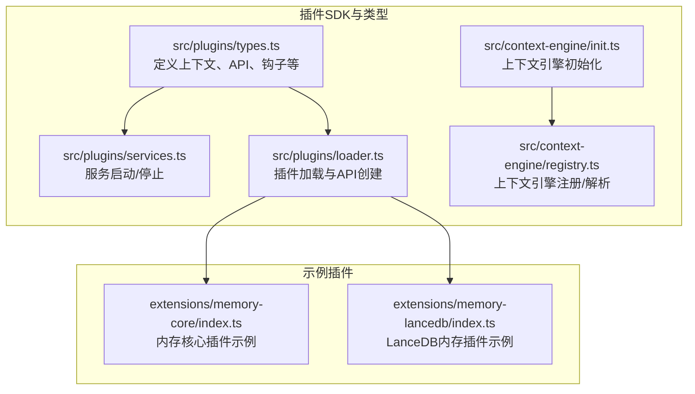
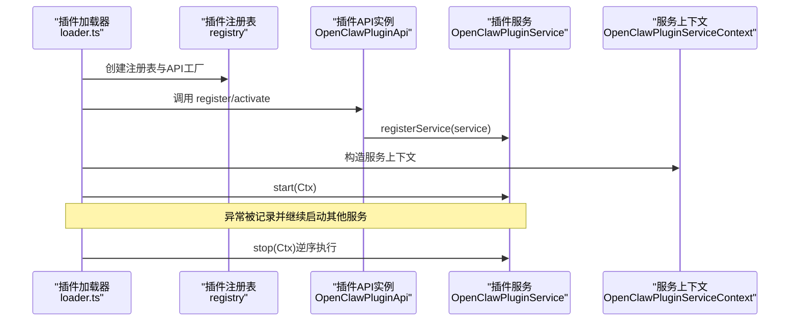
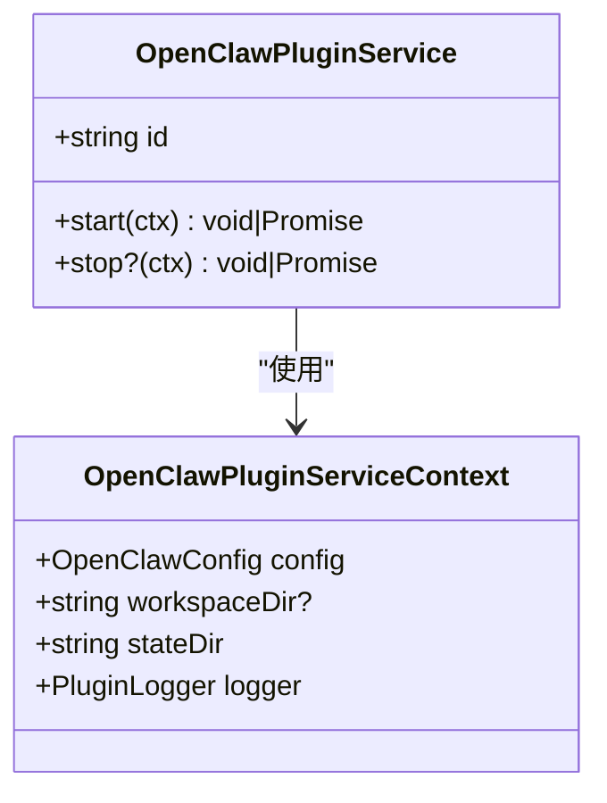
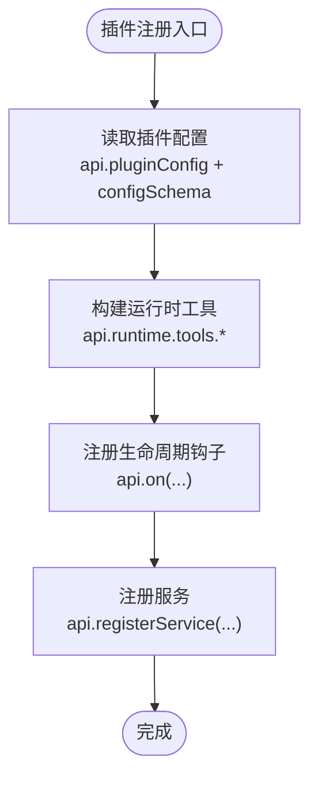
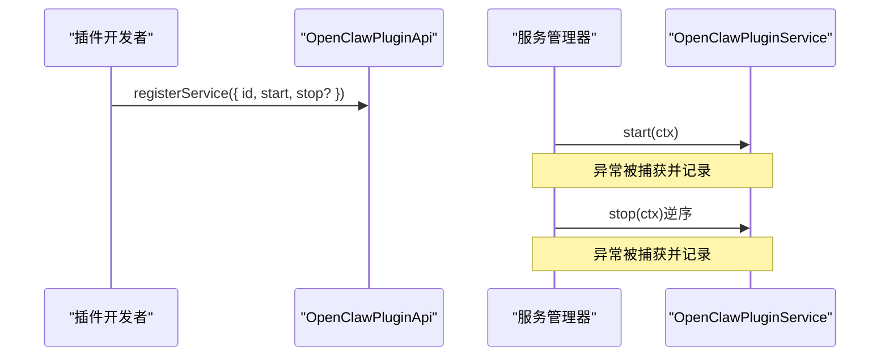
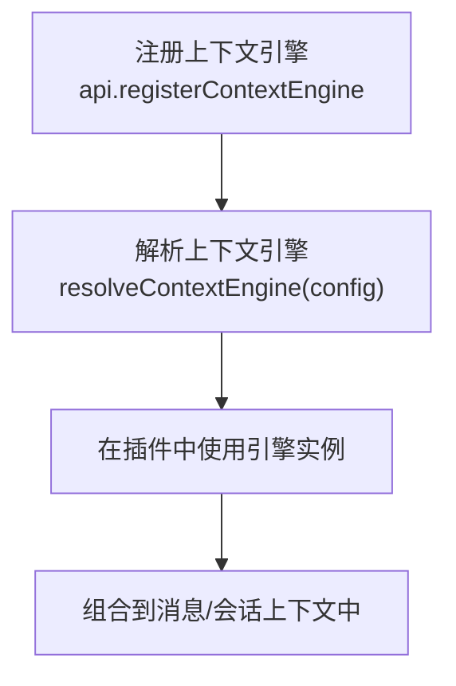
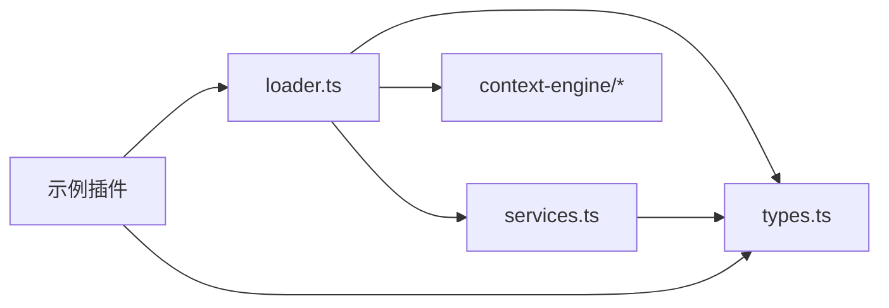

# 插件上下文API

<cite>
**本文引用的文件**
- [src/plugins/types.ts](file://src/plugins/types.ts)
- [src/plugins/services.ts](file://src/plugins/services.ts)
- [src/plugins/loader.ts](file://src/plugins/loader.ts)
- [src/context-engine/registry.ts](file://src/context-engine/registry.ts)
- [src/context-engine/init.ts](file://src/context-engine/init.ts)
- [extensions/memory-core/index.ts](file://extensions/memory-core/index.ts)
- [extensions/memory-lancedb/index.ts](file://extensions/memory-lancedb/index.ts)
- [src/plugins/logger.ts](file://src/plugins/logger.ts)
- [src/plugins/services.test.ts](file://src/plugins/services.test.ts)
</cite>

## 目录
1. [简介](#简介)
2. [项目结构](#项目结构)
3. [核心组件](#核心组件)
4. [架构总览](#架构总览)
5. [详细组件分析](#详细组件分析)
6. [依赖关系分析](#依赖关系分析)
7. [性能考量](#性能考量)
8. [故障排查指南](#故障排查指南)
9. [结论](#结论)
10. [附录](#附录)

## 简介
本文件面向OpenClaw插件开发者，系统化梳理“插件上下文API”的设计与用法，重点覆盖以下方面：
- OpenClawPluginServiceContext接口的字段与职责：日志记录、配置访问、状态目录、运行时工具等
- 插件运行时上下文的完整API：getLogger()、getConfig()、getGateway()、getRuntime()等方法的使用方式与最佳实践
- 插件服务接口：服务注册、生命周期管理、资源清理
- 插件间通信上下文API：事件发布订阅、消息传递与状态共享
- 具体示例路径：如何在插件中正确使用上下文API，并进行错误处理与资源管理

## 项目结构
围绕插件上下文API的关键模块与文件如下：
- 类型与接口定义：OpenClawPluginServiceContext、OpenClawPluginApi、插件钩子类型等
- 服务启动与停止：插件服务的统一启动流程与资源回收
- 插件加载器：插件注册API的创建、生命周期调用与错误诊断
- 上下文引擎：上下文解析与注册机制（用于扩展上下文能力）
- 示例插件：内存插件对上下文API的实际使用示范

**图表来源**
- [src/plugins/types.ts:230-306](file://src/plugins/types.ts#L230-L306)
- [src/plugins/services.ts:18-75](file://src/plugins/services.ts#L18-L75)
- [src/plugins/loader.ts:470-502](file://src/plugins/loader.ts#L470-L502)
- [src/context-engine/init.ts:15-23](file://src/context-engine/init.ts#L15-L23)
- [src/context-engine/registry.ts:38-85](file://src/context-engine/registry.ts#L38-L85)
- [extensions/memory-core/index.ts:10-35](file://extensions/memory-core/index.ts#L10-L35)
- [extensions/memory-lancedb/index.ts:292-675](file://extensions/memory-lancedb/index.ts#L292-L675)

**章节来源**
- [src/plugins/types.ts:230-306](file://src/plugins/types.ts#L230-L306)
- [src/plugins/services.ts:18-75](file://src/plugins/services.ts#L18-L75)
- [src/plugins/loader.ts:470-502](file://src/plugins/loader.ts#L470-L502)
- [src/context-engine/registry.ts:38-85](file://src/context-engine/registry.ts#L38-L85)
- [extensions/memory-core/index.ts:10-35](file://extensions/memory-core/index.ts#L10-L35)
- [extensions/memory-lancedb/index.ts:292-675](file://extensions/memory-lancedb/index.ts#L292-L675)

## 核心组件
本节聚焦OpenClawPluginServiceContext接口及其相关API，帮助你理解插件上下文的核心能力。

- OpenClawPluginServiceContext
  - 字段
    - config: OpenClawConfig（插件可读取全局配置）
    - workspaceDir?: string（工作区目录，可选）
    - stateDir: string（状态存储目录，固定值）
    - logger: PluginLogger（插件日志接口）
  - 用途
    - 作为插件服务的最小上下文载体，贯穿服务的start/stop生命周期
    - 提供日志、配置与状态目录访问，便于服务进行资源初始化与清理

- OpenClawPluginApi（插件API）
  - 能力概览
    - 注册工具、钩子、HTTP路由、通道、网关方法、CLI命令、服务、提供者、上下文引擎等
    - 生命周期钩子注册：on(...)
    - 路径解析：resolvePath(input)
  - 关键方法（与上下文API直接相关）
    - logger: PluginLogger（日志）
    - config: OpenClawConfig（配置）
    - runtime: PluginRuntime（运行时工具集合）
    - registerService(service): 注册插件服务
    - on(hookName, handler, opts?): 注册生命周期钩子

- 插件服务生命周期
  - start(ctx: OpenClawPluginServiceContext): 启动服务
  - stop?(ctx: OpenClawPluginServiceContext): 可选停止服务
  - 统一由服务管理器按顺序启动，逆序停止并处理异常

**章节来源**
- [src/plugins/types.ts:230-241](file://src/plugins/types.ts#L230-L241)
- [src/plugins/types.ts:263-306](file://src/plugins/types.ts#L263-L306)
- [src/plugins/services.ts:18-75](file://src/plugins/services.ts#L18-L75)

## 架构总览
下图展示了插件上下文API在系统中的位置与交互关系：

**图表来源**
- [src/plugins/loader.ts:470-502](file://src/plugins/loader.ts#L470-L502)
- [src/plugins/loader.ts:769-784](file://src/plugins/loader.ts#L769-L784)
- [src/plugins/services.ts:18-75](file://src/plugins/services.ts#L18-L75)

## 详细组件分析

### OpenClawPluginServiceContext 接口详解
- 字段与语义
  - config: 插件可读取全局配置，用于决定行为与参数
  - workspaceDir: 工作区目录，插件可据此定位会话、缓存等数据
  - stateDir: 固定的状态目录，用于持久化插件内部状态
  - logger: 插件日志接口，支持info/warn/error/debug
- 使用场景
  - 在服务start阶段初始化资源（数据库连接、外部客户端等）
  - 在服务stop阶段释放资源（关闭连接、清理临时文件等）

**图表来源**
- [src/plugins/types.ts:230-241](file://src/plugins/types.ts#L230-L241)

**章节来源**
- [src/plugins/types.ts:230-241](file://src/plugins/types.ts#L230-L241)

### 插件API与上下文的使用模式
- 日志记录（getLogger）
  - 通过api.logger.info/warn/error/debug输出插件运行信息
  - 建议在服务启动/停止、关键流程节点、异常分支记录日志
- 配置访问（getConfig）
  - 通过api.config读取全局配置；通过api.pluginConfig读取插件自身配置
  - 使用configSchema进行校验，避免运行期异常
- 运行时工具（getRuntime）
  - 通过api.runtime访问运行时工具集合，如工具构造器、CLI命令等
  - 示例：内存插件使用runtime.tools创建搜索/获取工具
- 网关通信（registerGatewayMethod）
  - 通过api.registerGatewayMethod(method, handler)注册网关方法，供外部调用
  - 适用于需要暴露HTTP或RPC接口的插件

**图表来源**
- [extensions/memory-core/index.ts:10-35](file://extensions/memory-core/index.ts#L10-L35)
- [extensions/memory-lancedb/index.ts:292-675](file://extensions/memory-lancedb/index.ts#L292-L675)

**章节来源**
- [extensions/memory-core/index.ts:10-35](file://extensions/memory-core/index.ts#L10-L35)
- [extensions/memory-lancedb/index.ts:292-675](file://extensions/memory-lancedb/index.ts#L292-L675)

### 插件服务注册与生命周期管理
- 服务注册
  - 使用api.registerService注册OpenClawPluginService对象
  - 服务需提供start与可选stop方法
- 服务启动
  - 由服务管理器统一创建OpenClawPluginServiceContext并调用start
  - 所有服务启动失败会被记录，但不影响其他服务启动
- 服务停止
  - 以逆序方式调用stop，失败会被记录但不中断其他服务停止

**图表来源**
- [src/plugins/services.ts:18-75](file://src/plugins/services.ts#L18-L75)
- [src/plugins/services.test.ts:32-126](file://src/plugins/services.test.ts#L32-L126)

**章节来源**
- [src/plugins/services.ts:18-75](file://src/plugins/services.ts#L18-L75)
- [src/plugins/services.test.ts:32-126](file://src/plugins/services.test.ts#L32-L126)

### 插件间通信与上下文引擎
- 上下文引擎注册与解析
  - 通过api.registerContextEngine(id, factory)注册自定义上下文引擎
  - 通过resolveContextEngine(config)解析具体引擎实例
  - 默认引擎“legacy”始终可用，确保兼容性
- 插件间通信建议
  - 使用生命周期钩子（如before_agent_start、agent_end）在消息流转前后注入/提取上下文
  - 使用registerGatewayMethod暴露方法，配合网关进行跨插件RPC调用
  - 使用registerHttpRoute暴露HTTP端点，便于外部系统集成

**图表来源**
- [src/context-engine/registry.ts:38-85](file://src/context-engine/registry.ts#L38-L85)
- [src/context-engine/init.ts:15-23](file://src/context-engine/init.ts#L15-L23)

**章节来源**
- [src/context-engine/registry.ts:38-85](file://src/context-engine/registry.ts#L38-L85)
- [src/context-engine/init.ts:15-23](file://src/context-engine/init.ts#L15-L23)

### 实战示例与最佳实践
- 内存插件（memory-core）
  - 使用api.registerTool注册搜索/获取工具
  - 使用api.registerCli注册命令行子命令
  - 使用api.logger输出状态信息
  - 使用api.resolvePath解析相对路径
- LanceDB内存插件（memory-lancedb）
  - 使用api.pluginConfig读取配置并解析
  - 使用api.on注册生命周期钩子（自动召回/自动捕获）
  - 使用api.registerService注册后台服务
  - 使用api.registerGatewayMethod暴露查询/统计接口
- 错误处理与健壮性
  - 在服务start/stop中捕获异常并记录日志
  - 对外部依赖（如数据库、网络）进行降级与重试策略
  - 对用户输入与配置进行严格校验

**章节来源**
- [extensions/memory-core/index.ts:10-35](file://extensions/memory-core/index.ts#L10-L35)
- [extensions/memory-lancedb/index.ts:292-675](file://extensions/memory-lancedb/index.ts#L292-L675)
- [src/plugins/services.ts:48-75](file://src/plugins/services.ts#L48-L75)

## 依赖关系分析
- 模块耦合
  - 插件加载器依赖类型定义与服务管理器，负责创建API并调用插件注册函数
  - 服务管理器依赖类型定义与日志子系统，负责服务生命周期管理
  - 上下文引擎注册与解析独立于插件加载流程，但可通过API在插件加载时注册
- 外部依赖
  - 插件可访问运行时工具（runtime.tools）、网关方法、HTTP路由等
  - 插件配置通过configSchema进行校验，避免运行期异常

**图表来源**
- [src/plugins/loader.ts:470-502](file://src/plugins/loader.ts#L470-L502)
- [src/plugins/types.ts:230-306](file://src/plugins/types.ts#L230-L306)
- [src/plugins/services.ts:18-75](file://src/plugins/services.ts#L18-L75)
- [src/context-engine/registry.ts:38-85](file://src/context-engine/registry.ts#L38-L85)

**章节来源**
- [src/plugins/loader.ts:470-502](file://src/plugins/loader.ts#L470-L502)
- [src/plugins/types.ts:230-306](file://src/plugins/types.ts#L230-L306)
- [src/plugins/services.ts:18-75](file://src/plugins/services.ts#L18-L75)
- [src/context-engine/registry.ts:38-85](file://src/context-engine/registry.ts#L38-L85)

## 性能考量
- 启动延迟控制
  - 使用懒加载运行时（loader.ts中对runtime采用Proxy延迟初始化），避免未启用插件的依赖加载
- 资源管理
  - 服务start阶段尽量做轻量初始化；重资源在首次使用时按需创建
  - stop阶段确保幂等，避免重复释放导致的异常
- 日志开销
  - 将debug日志仅在开发环境开启，生产环境使用info/warn/error
- 配置校验
  - 在插件注册阶段尽早发现配置问题，减少运行期开销

[本节为通用指导，无需特定文件引用]

## 故障排查指南
- 服务启动失败
  - 现象：某服务start抛出异常，但其他服务仍可启动
  - 处理：检查服务日志，确认异常被捕获并记录；修复后重新启动
- 服务停止失败
  - 现象：stop阶段抛出异常，但不影响其他服务停止
  - 处理：在stop中增加幂等判断与异常捕获，确保资源安全释放
- 插件加载错误
  - 现象：插件注册函数抛错或缺少register导出
  - 处理：检查插件导出是否符合规范；查看诊断信息与日志
- 日志不可见
  - 现象：插件日志未输出
  - 处理：确认使用api.logger而非原生console；检查日志级别与输出配置

**章节来源**
- [src/plugins/services.ts:48-75](file://src/plugins/services.ts#L48-L75)
- [src/plugins/services.test.ts:87-126](file://src/plugins/services.test.ts#L87-L126)
- [src/plugins/loader.ts:769-799](file://src/plugins/loader.ts#L769-L799)
- [src/plugins/logger.ts:10-17](file://src/plugins/logger.ts#L10-L17)

## 结论
OpenClaw插件上下文API提供了清晰、一致的插件开发体验：
- OpenClawPluginServiceContext为服务生命周期提供稳定的上下文
- OpenClawPluginApi将日志、配置、运行时工具、服务注册、生命周期钩子等能力集中在一个接口中
- 通过服务管理器与插件加载器，系统实现了健壮的服务启动/停止与错误隔离
- 上下文引擎与生命周期钩子为插件间通信与状态共享提供了扩展点

遵循本文的最佳实践，可在保证稳定性的同时快速实现复杂功能。

[本节为总结性内容，无需特定文件引用]

## 附录
- 快速参考
  - 获取日志：api.logger.info/warn/error/debug
  - 访问配置：api.config（全局）、api.pluginConfig（插件）
  - 使用运行时：api.runtime.tools、api.runtime.cli等
  - 注册服务：api.registerService({ id, start, stop? })
  - 注册钩子：api.on("hookName", handler, { priority? })
  - 解析路径：api.resolvePath(input)
  - 注册上下文引擎：api.registerContextEngine(id, factory)
  - 注册网关方法：api.registerGatewayMethod(method, handler)

[本节为补充说明，无需特定文件引用]