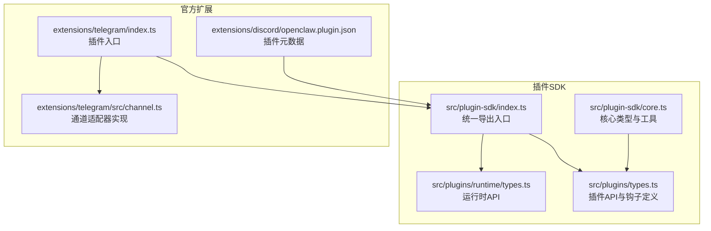
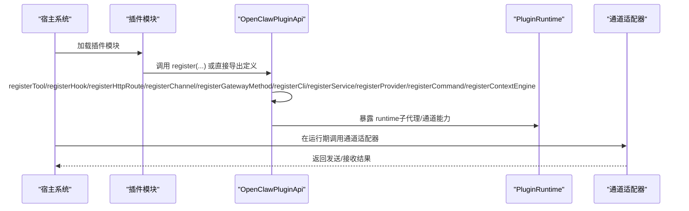
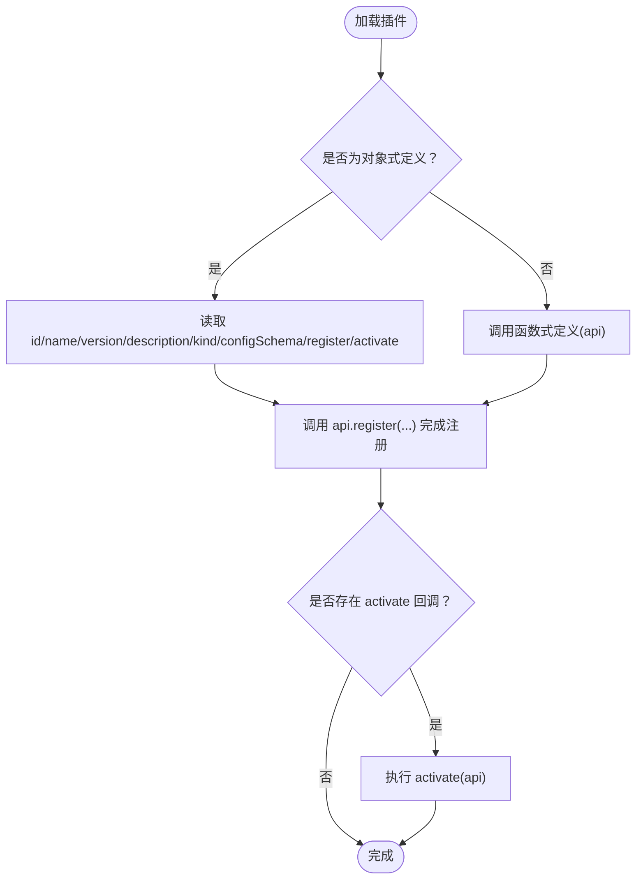
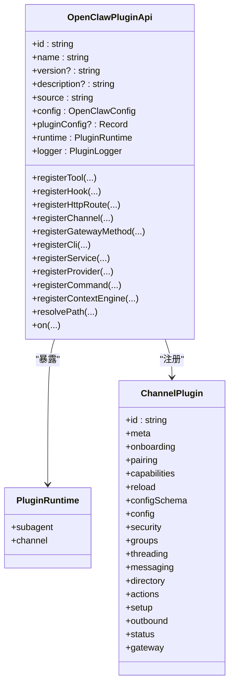
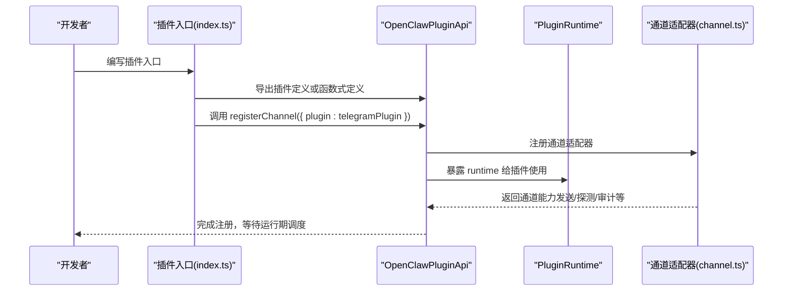
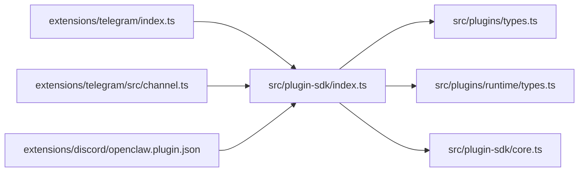

# 插件接口API

<cite>
**本文引用的文件**
- [src/plugin-sdk/index.ts](file://src/plugin-sdk/index.ts)
- [src/plugin-sdk/core.ts](file://src/plugin-sdk/core.ts)
- [src/plugins/types.ts](file://src/plugins/types.ts)
- [src/plugins/runtime/types.ts](file://src/plugins/runtime/types.ts)
- [extensions/telegram/index.ts](file://extensions/telegram/index.ts)
- [extensions/telegram/src/channel.ts](file://extensions/telegram/src/channel.ts)
- [extensions/discord/openclaw.plugin.json](file://extensions/discord/openclaw.plugin.json)
</cite>

## 目录
1. [简介](#简介)
2. [项目结构](#项目结构)
3. [核心组件](#核心组件)
4. [架构总览](#架构总览)
5. [详细组件分析](#详细组件分析)
6. [依赖关系分析](#依赖关系分析)
7. [性能考量](#性能考量)
8. [故障排查指南](#故障排查指南)
9. [结论](#结论)
10. [附录](#附录)

## 简介
本文件为 OpenClaw 插件接口 API 的权威参考文档，面向插件开发者与集成工程师，系统阐述以下内容：
- OpenClawPluginApi 接口的全部方法与属性，覆盖插件初始化、配置管理、生命周期控制、HTTP 路由注册、通道适配器注册、CLI 扩展、服务注册、提供商认证、命令注册、上下文引擎注册等。
- 插件上下文对象（PluginRuntime）的完整 API，包括子代理运行、会话查询与删除、通道能力访问等。
- 插件注册机制：插件元数据定义、版本与来源、激活回调、通道注册、HTTP 路由与网关方法注册等。
- 插件间通信与协作：钩子（Hook）系统、命令处理、工具工厂、服务生命周期等。
- 实战示例：基于官方扩展的实现路径，展示类型定义、初始化流程与错误处理。

本参考文档严格依据仓库源码进行归纳与可视化，避免臆测，确保技术准确性与可操作性。

## 项目结构
OpenClaw 插件生态由“插件SDK”和“官方扩展”两部分组成：
- 插件SDK：位于 src/plugin-sdk 与 src/plugins，提供 OpenClawPluginApi、PluginRuntime、钩子系统、HTTP 路由、通道适配器、提供商认证等核心能力的类型与导出。
- 官方扩展：位于 extensions/*，是具体插件实现的范例，例如 Telegram、Discord 等，展示了如何通过 OpenClawPluginApi 完成注册与运行。

**图表来源**
- [src/plugin-sdk/index.ts:1-131](file://src/plugin-sdk/index.ts#L1-L131)
- [src/plugin-sdk/core.ts:1-44](file://src/plugin-sdk/core.ts#L1-L44)
- [src/plugins/types.ts:263-306](file://src/plugins/types.ts#L263-L306)
- [src/plugins/runtime/types.ts:51-63](file://src/plugins/runtime/types.ts#L51-L63)
- [extensions/telegram/index.ts:1-18](file://extensions/telegram/index.ts#L1-L18)
- [extensions/telegram/src/channel.ts:120-586](file://extensions/telegram/src/channel.ts#L120-L586)
- [extensions/discord/openclaw.plugin.json:1-10](file://extensions/discord/openclaw.plugin.json#L1-L10)

**章节来源**
- [src/plugin-sdk/index.ts:1-131](file://src/plugin-sdk/index.ts#L1-L131)
- [src/plugin-sdk/core.ts:1-44](file://src/plugin-sdk/core.ts#L1-L44)
- [extensions/telegram/index.ts:1-18](file://extensions/telegram/index.ts#L1-L18)
- [extensions/telegram/src/channel.ts:120-586](file://extensions/telegram/src/channel.ts#L120-L586)
- [extensions/discord/openclaw.plugin.json:1-10](file://extensions/discord/openclaw.plugin.json#L1-L10)

## 核心组件
本节聚焦 OpenClawPluginApi 与 PluginRuntime 的职责边界与能力清单。

- OpenClawPluginApi（插件对外API）
  - 基础信息：id、name、version、description、source、config、pluginConfig、runtime、logger。
  - 注册类：registerTool、registerHook、registerHttpRoute、registerChannel、registerGatewayMethod、registerCli、registerService、registerProvider、registerCommand、registerContextEngine。
  - 生命周期：on（生命周期钩子注册）。
  - 工具函数：resolvePath（路径解析）。
  - 作用：作为插件在加载与激活阶段与宿主交互的唯一入口，负责声明式地注册各类能力与扩展点。

- PluginRuntime（插件运行时）
  - 子代理能力：run、waitForRun、getSessionMessages、getSession（已废弃）、deleteSession。
  - 通道能力：channel（各通道适配器的运行时入口）。
  - 作用：为插件提供与底层通道、会话、子代理生命周期交互的能力。

**章节来源**
- [src/plugins/types.ts:263-306](file://src/plugins/types.ts#L263-L306)
- [src/plugins/runtime/types.ts:51-63](file://src/plugins/runtime/types.ts#L51-L63)

## 架构总览
下图展示插件从加载到运行的关键交互：插件模块通过 OpenClawPluginApi 完成注册；通道适配器在注册后被宿主调度；运行时通过 PluginRuntime 提供子代理与通道能力。

**图表来源**
- [src/plugins/types.ts:263-306](file://src/plugins/types.ts#L263-L306)
- [src/plugins/runtime/types.ts:51-63](file://src/plugins/runtime/types.ts#L51-L63)
- [extensions/telegram/src/channel.ts:120-586](file://extensions/telegram/src/channel.ts#L120-L586)

## 详细组件分析

### OpenClawPluginApi 接口详解
- 基础字段
  - id/name/version/description/source：插件标识与元信息。
  - config/pluginConfig/runtime/logger：当前工作区配置、插件私有配置、运行时环境与日志器。
- 注册方法
  - registerTool(tool, opts?)：注册工具或工具工厂，支持按名称或工厂模式注入。
  - registerHook(events, handler, opts?)：注册内部钩子处理器，支持事件名或数组。
  - registerHttpRoute(params)：注册 HTTP 路由（路径、处理器、鉴权、匹配策略、替换行为）。
  - registerChannel(registration|ChannelPlugin)：注册通道适配器，可附带 Dock。
  - registerGatewayMethod(method, handler)：注册网关方法处理器。
  - registerCli(registrar, opts?)：注册 CLI 子命令或增强现有命令。
  - registerService(service)：注册服务（含 start/stop），由宿主生命周期托管。
  - registerProvider(provider)：注册提供商（认证方式、模型、文档等）。
  - registerCommand(command)：注册自定义命令（绕过LLM，优先于内置命令）。
  - registerContextEngine(id, factory)：注册上下文引擎（独占槽位）。
- 生命周期
  - on(hookName, handler, opts?)：注册生命周期钩子（支持优先级）。
- 其他
  - resolvePath(input)：将相对路径解析为绝对路径。
  - 注意：registerChannel 支持两种形式：传入 registration 对象或直接传入 ChannelPlugin。

**章节来源**
- [src/plugins/types.ts:248-306](file://src/plugins/types.ts#L248-L306)

### 插件上下文对象（PluginRuntime）
- 子代理运行
  - run(params)：启动子代理任务，返回 runId。
  - waitForRun(params)：等待指定 runId 完成，返回状态与错误信息。
  - getSessionMessages(params)：查询会话消息列表。
  - getSession(params)/deleteSession(params)：会话查询与删除（部分方法已废弃）。
- 通道能力
  - channel：各通道适配器的运行时入口，用于发送消息、解析目标、执行动作等。

**章节来源**
- [src/plugins/runtime/types.ts:8-63](file://src/plugins/runtime/types.ts#L8-L63)

### 插件注册机制
- 插件定义与导出
  - 支持两种形式：对象式定义（包含 id/name/description/version/kind/configSchema/register/activate 等）或函数式定义（接收 OpenClawPluginApi 并完成注册）。
  - activate 回调在插件被启用后触发，适合执行一次性初始化。
- 插件元数据
  - openclaw.plugin.json 中包含 id、channels、configSchema 等元信息，用于声明支持的通道与配置约束。
- 版本与来源
  - 插件来源（bundled/global/workspace/config）由宿主解析并标注，便于诊断与回溯。
- 依赖与兼容
  - 通过 channels 列表声明所依赖的通道；configSchema 限制配置合法性；register/activate 阶段可做兼容性检查与迁移。

**图表来源**
- [src/plugins/types.ts:248-261](file://src/plugins/types.ts#L248-L261)
- [extensions/discord/openclaw.plugin.json:1-10](file://extensions/discord/openclaw.plugin.json#L1-L10)

**章节来源**
- [src/plugins/types.ts:248-261](file://src/plugins/types.ts#L248-L261)
- [extensions/discord/openclaw.plugin.json:1-10](file://extensions/discord/openclaw.plugin.json#L1-L10)

### 通道适配器（ChannelPlugin）与注册
- 通道适配器是插件对特定渠道（如 Telegram、Discord）的实现，包含：
  - 元信息（meta）、引导（onboarding）、配对（pairing）、能力（capabilities）、配置（config）、安全（security）、群组策略（groups）、线程（threading）、消息（messaging）、目录（directory）、动作（actions）、设置（setup）、出站（outbound）、状态（status）、网关（gateway）等。
- 注册方式
  - 通过 api.registerChannel({ plugin }) 或直接传入 ChannelPlugin。
  - 通道适配器通常依赖运行时提供的通道能力（如 sendMessage、probe、audit 等）。

**图表来源**
- [src/plugins/types.ts:263-306](file://src/plugins/types.ts#L263-L306)
- [src/plugins/runtime/types.ts:51-63](file://src/plugins/runtime/types.ts#L51-L63)
- [extensions/telegram/src/channel.ts:120-586](file://extensions/telegram/src/channel.ts#L120-L586)

**章节来源**
- [extensions/telegram/src/channel.ts:120-586](file://extensions/telegram/src/channel.ts#L120-L586)

### 插件间通信与协作
- 钩子（Hook）系统
  - 支持的钩子名称涵盖模型解析前、提示构建前、代理开始、LLM 输入/输出、工具调用前后、消息收发、会话开始/结束、子代理派生/交付/结束、网关启停等。
  - 可通过 api.on 注册钩子处理器，并指定优先级。
- 自定义命令
  - 通过 registerCommand 注册命令，优先于内置命令与代理调用，适合状态切换、快速查询等场景。
- 工具与服务
  - registerTool 注册工具或工厂；registerService 注册服务，由宿主生命周期托管 start/stop。

**章节来源**
- [src/plugins/types.ts:321-377](file://src/plugins/types.ts#L321-L377)
- [src/plugins/types.ts:186-203](file://src/plugins/types.ts#L186-L203)

### 实战示例：实现一个完整插件
以下示例基于官方 Telegram 插件，展示如何实现一个最小可用插件：

- 类型与入口
  - 导入 OpenClawPluginApi 与 ChannelPlugin 类型，导入空配置模式。
  - 定义插件对象，包含 id、name、description、configSchema 与 register 回调。
- 初始化流程
  - 在 register 回调中：设置运行时、注册通道适配器。
- 错误处理
  - 在通道启动或注销过程中，捕获异常并记录日志，必要时抛出错误以阻止不安全状态。

**图表来源**
- [extensions/telegram/index.ts:1-18](file://extensions/telegram/index.ts#L1-L18)
- [extensions/telegram/src/channel.ts:120-586](file://extensions/telegram/src/channel.ts#L120-L586)

**章节来源**
- [extensions/telegram/index.ts:1-18](file://extensions/telegram/index.ts#L1-L18)
- [extensions/telegram/src/channel.ts:120-586](file://extensions/telegram/src/channel.ts#L120-L586)

## 依赖关系分析
- 插件SDK导出
  - index.ts 将插件API、运行时、通道适配器、HTTP路由、Webhook、状态辅助、SSRF防护、临时路径、命令执行、网关绑定、Tailnet主机解析等能力统一导出，供插件与宿主使用。
- 插件与通道适配器
  - 插件通过 OpenClawPluginApi.registerChannel 注册 ChannelPlugin；通道适配器内部再依赖运行时能力（如发送、探测、审计）。
- 插件与宿主
  - 插件通过 registerService、registerCli、registerProvider、registerCommand 等扩展宿主能力；通过 on 注册生命周期钩子参与系统编排。

**图表来源**
- [src/plugin-sdk/index.ts:1-131](file://src/plugin-sdk/index.ts#L1-L131)
- [src/plugin-sdk/core.ts:1-44](file://src/plugin-sdk/core.ts#L1-L44)
- [src/plugins/types.ts:263-306](file://src/plugins/types.ts#L263-L306)
- [src/plugins/runtime/types.ts:51-63](file://src/plugins/runtime/types.ts#L51-L63)
- [extensions/telegram/index.ts:1-18](file://extensions/telegram/index.ts#L1-L18)
- [extensions/telegram/src/channel.ts:120-586](file://extensions/telegram/src/channel.ts#L120-L586)
- [extensions/discord/openclaw.plugin.json:1-10](file://extensions/discord/openclaw.plugin.json#L1-L10)

**章节来源**
- [src/plugin-sdk/index.ts:1-131](file://src/plugin-sdk/index.ts#L1-L131)
- [src/plugin-sdk/core.ts:1-44](file://src/plugin-sdk/core.ts#L1-L44)
- [extensions/telegram/index.ts:1-18](file://extensions/telegram/index.ts#L1-L18)
- [extensions/telegram/src/channel.ts:120-586](file://extensions/telegram/src/channel.ts#L120-L586)
- [extensions/discord/openclaw.plugin.json:1-10](file://extensions/discord/openclaw.plugin.json#L1-L10)

## 性能考量
- 钩子链路
  - 钩子处理应尽量轻量，避免阻塞代理主流程；复杂逻辑建议异步化或延迟执行。
- 子代理与会话
  - 使用 getSessionMessages 获取会话片段，避免全量读取；合理设置 limit 与 idempotencyKey。
- 通道能力
  - 合理利用通道的分块、媒体上传、轮询/Webhook 模式选择，降低网络与资源开销。
- HTTP 路由
  - 路由匹配采用精确或前缀策略，避免重复注册与冲突；鉴权策略明确区分 gateway 与 plugin。

## 故障排查指南
- 配置校验失败
  - 使用 OpenClawPluginConfigSchema.validate 或 safeParse 进行显式校验，结合 uiHints 提示用户修正。
- 通道未就绪
  - 通过通道 status.collectStatusIssues 与 probe/audit 结果定位问题；检查 webhook/token/proxy/network 等参数。
- 运行时异常
  - 在 registerService.start 与通道 gateway.start 中捕获异常并记录；必要时抛出错误阻止继续运行。
- 权限与白名单
  - 检查 allowFrom、dmPolicy、groupPolicy 等策略配置，确保发送者与目标符合要求。

**章节来源**
- [src/plugins/types.ts:44-56](file://src/plugins/types.ts#L44-L56)
- [extensions/telegram/src/channel.ts:398-483](file://extensions/telegram/src/channel.ts#L398-L483)

## 结论
OpenClaw 插件接口以 OpenClawPluginApi 为核心，配合 PluginRuntime 与丰富的通道适配器、钩子系统、HTTP/Webhook 能力，构建了开放而可控的扩展生态。通过规范化的插件元数据、注册流程与生命周期钩子，开发者可以稳定地实现从消息通道接入到业务命令、工具与服务的全栈能力。建议在实现中遵循配置校验、错误处理与性能优化的最佳实践，确保插件在生产环境中的可靠性与可维护性。

## 附录
- 关键类型与导出位置
  - OpenClawPluginApi、PluginRuntime、钩子系统、HTTP/Webhook、通道适配器、提供商认证等均在 src/plugins/types.ts 与 src/plugin-sdk/index.ts 中集中定义与导出。
- 示例插件
  - Telegram 与 Discord 等官方扩展提供了完整的实现范例，可作为开发起点。

**章节来源**
- [src/plugins/types.ts:263-306](file://src/plugins/types.ts#L263-L306)
- [src/plugin-sdk/index.ts:1-131](file://src/plugin-sdk/index.ts#L1-L131)
- [extensions/telegram/index.ts:1-18](file://extensions/telegram/index.ts#L1-L18)
- [extensions/discord/openclaw.plugin.json:1-10](file://extensions/discord/openclaw.plugin.json#L1-L10)