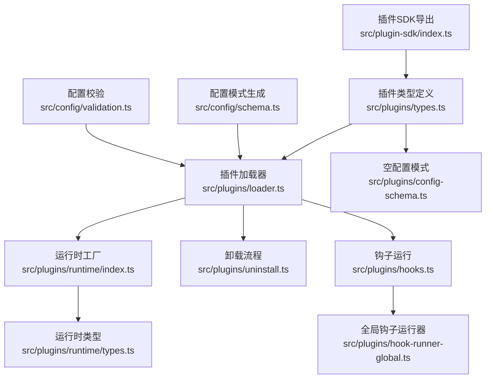
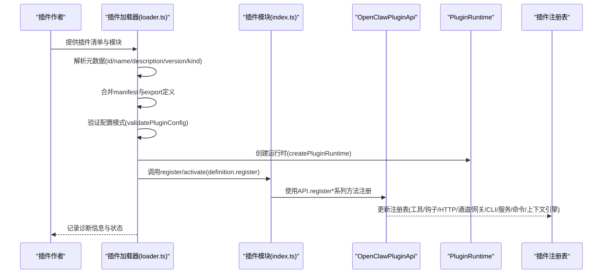
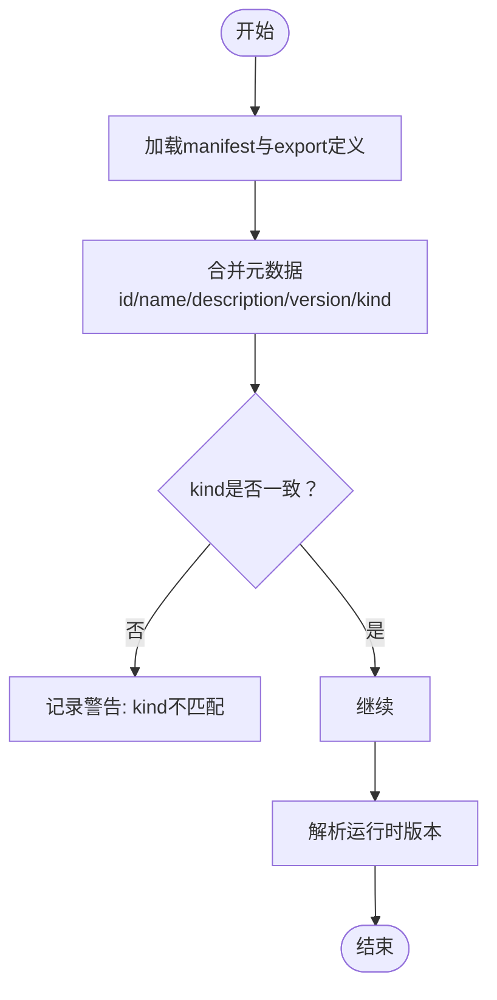
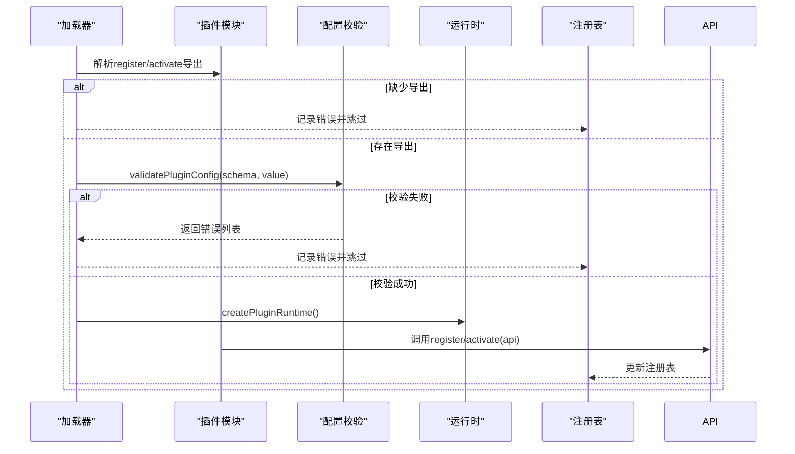
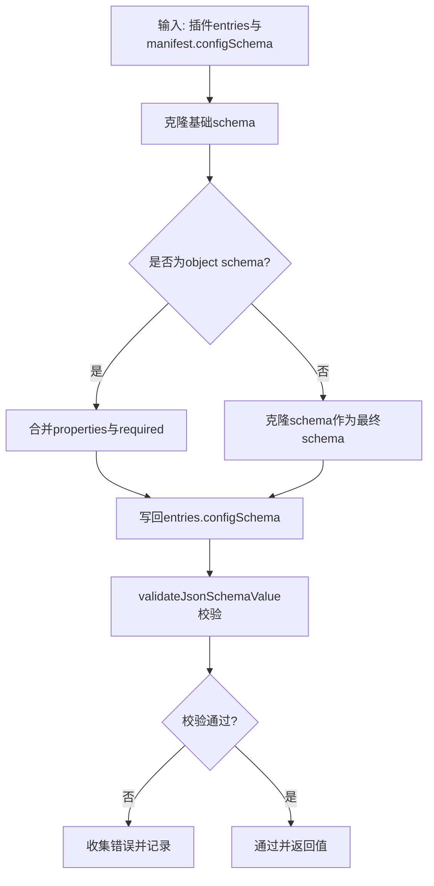
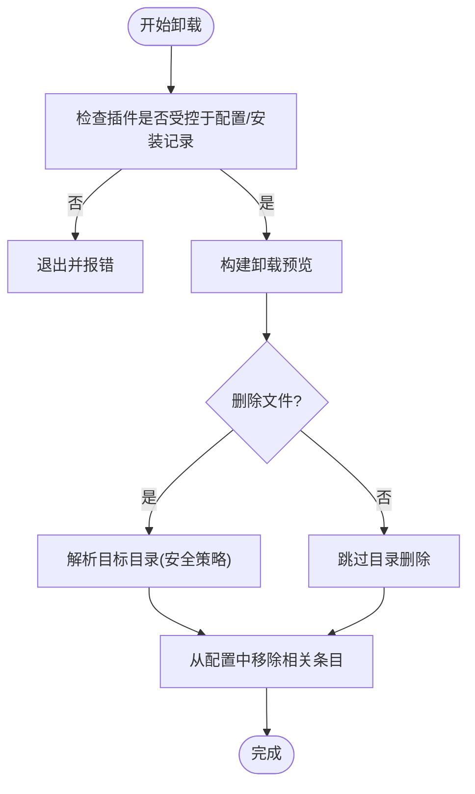
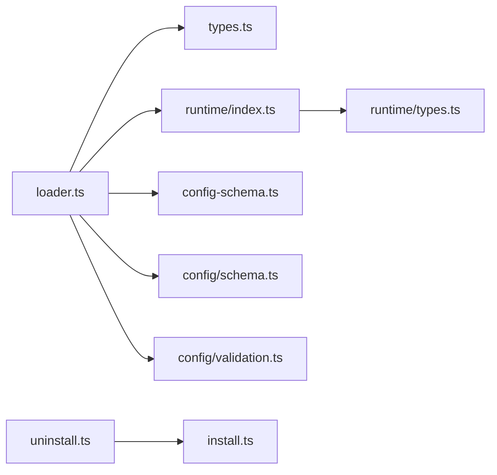

# 插件注册API

<cite>
**本文档引用的文件**
- [src/plugins/types.ts](file://src/plugins/types.ts)
- [src/plugins/loader.ts](file://src/plugins/loader.ts)
- [src/plugins/runtime/types.ts](file://src/plugins/runtime/types.ts)
- [src/plugins/runtime/index.ts](file://src/plugins/runtime/index.ts)
- [src/plugins/config-schema.ts](file://src/plugins/config-schema.ts)
- [src/config/schema.ts](file://src/config/schema.ts)
- [src/config/validation.ts](file://src/config/validation.ts)
- [src/plugins/uninstall.ts](file://src/plugins/uninstall.ts)
- [src/plugins/uninstall.test.ts](file://src/plugins/uninstall.test.ts)
- [src/plugins/hooks.ts](file://src/plugins/hooks.ts)
- [src/plugins/hook-runner-global.ts](file://src/plugins/hook-runner-global.ts)
- [src/plugin-sdk/index.ts](file://src/plugin-sdk/index.ts)
- [extensions/discord/openclaw.plugin.json](file://extensions/discord/openclaw.plugin.json)
- [extensions/memory-core/openclaw.plugin.json](file://extensions/memory-core/openclaw.plugin.json)
</cite>

## 目录
1. [简介](#简介)
2. [项目结构](#项目结构)
3. [核心组件](#核心组件)
4. [架构总览](#架构总览)
5. [详细组件分析](#详细组件分析)
6. [依赖关系分析](#依赖关系分析)
7. [性能考虑](#性能考虑)
8. [故障排除指南](#故障排除指南)
9. [结论](#结论)
10. [附录](#附录)

## 简介
本文件为 OpenClaw 插件注册API的权威参考文档，覆盖插件元数据定义、版本与兼容性检查、依赖声明、注册流程、生命周期管理、配置验证与迁移等关键主题。文档面向插件开发者与维护者，提供从概念到实现细节的完整视图，并通过图示与路径引用帮助快速定位源码位置。

## 项目结构
OpenClaw 的插件系统由“插件SDK导出”“插件加载器”“运行时环境”“配置与校验”“卸载与清理”等多个模块协同组成。下图展示了与插件注册API相关的核心文件与职责映射：



**图表来源**
- [src/plugin-sdk/index.ts:1-800](file://src/plugin-sdk/index.ts#L1-L800)
- [src/plugins/types.ts:1-800](file://src/plugins/types.ts#L1-L800)
- [src/plugins/loader.ts:1-200](file://src/plugins/loader.ts#L1-L200)
- [src/plugins/runtime/types.ts:1-64](file://src/plugins/runtime/types.ts#L1-L64)
- [src/plugins/runtime/index.ts:1-90](file://src/plugins/runtime/index.ts#L1-L90)
- [src/plugins/config-schema.ts:1-34](file://src/plugins/config-schema.ts#L1-L34)
- [src/config/schema.ts:81-334](file://src/config/schema.ts#L81-L334)
- [src/config/validation.ts:549-604](file://src/config/validation.ts#L549-L604)
- [src/plugins/uninstall.ts:1-104](file://src/plugins/uninstall.ts#L1-L104)
- [src/plugins/hooks.ts:685-723](file://src/plugins/hooks.ts#L685-L723)
- [src/plugins/hook-runner-global.ts:48-104](file://src/plugins/hook-runner-global.ts#L48-L104)

**章节来源**
- [src/plugin-sdk/index.ts:1-800](file://src/plugin-sdk/index.ts#L1-L800)
- [src/plugins/types.ts:1-800](file://src/plugins/types.ts#L1-L800)
- [src/plugins/loader.ts:1-200](file://src/plugins/loader.ts#L1-L200)

## 核心组件
本节概述插件注册API的关键类型与职责边界，帮助理解插件如何向 OpenClaw 注册并参与运行时生命周期。

- 插件定义与API
  - OpenClawPluginDefinition：插件元数据与入口点（register/activate）
  - OpenClawPluginApi：插件在运行时可使用的API集合（工具、钩子、HTTP路由、通道、网关方法、CLI、服务、提供商、命令、上下文引擎、路径解析、生命周期钩子）
- 运行时环境
  - PluginRuntime：插件可用的运行时能力（版本、配置、子代理、系统、媒体、TTS/STT、工具、通道、事件、日志、状态目录、模型认证）
- 配置与校验
  - OpenClawPluginConfigSchema：插件配置的模式接口（safeParse/parse/validate/uiHints/jsonSchema）
  - emptyPluginConfigSchema：空配置模式的实现
  - 配置合并与UI提示：基于JsonSchema的合并与提示生成
- 卸载与清理
  - 卸载动作与配置清理：移除entries、installs、allow、load.paths、slots等
  - 目录删除策略：安全路径解析与递归删除限制

**章节来源**
- [src/plugins/types.ts:248-306](file://src/plugins/types.ts#L248-L306)
- [src/plugins/runtime/types.ts:51-64](file://src/plugins/runtime/types.ts#L51-L64)
- [src/plugins/runtime/index.ts:52-87](file://src/plugins/runtime/index.ts#L52-L87)
- [src/plugins/config-schema.ts:13-33](file://src/plugins/config-schema.ts#L13-L33)
- [src/config/schema.ts:298-324](file://src/config/schema.ts#L298-L324)
- [src/plugins/uninstall.ts:65-104](file://src/plugins/uninstall.ts#L65-L104)

## 架构总览
下图展示插件注册与激活的端到端流程，包括元数据解析、配置校验、运行时创建、注册函数调用与错误诊断。



**图表来源**
- [src/plugins/loader.ts:175-194](file://src/plugins/loader.ts#L175-L194)
- [src/plugins/loader.ts:200-217](file://src/plugins/loader.ts#L200-L217)
- [src/plugins/loader.ts:763-773](file://src/plugins/loader.ts#L763-L773)
- [src/plugins/runtime/index.ts:52-87](file://src/plugins/runtime/index.ts#L52-L87)

**章节来源**
- [src/plugins/loader.ts:175-194](file://src/plugins/loader.ts#L175-L194)
- [src/plugins/loader.ts:200-217](file://src/plugins/loader.ts#L200-L217)
- [src/plugins/loader.ts:763-773](file://src/plugins/loader.ts#L763-L773)
- [src/plugins/runtime/index.ts:52-87](file://src/plugins/runtime/index.ts#L52-L87)

## 详细组件分析

### 插件元数据与版本兼容性
- 元数据字段
  - id、name、description、version、kind（如 memory/context-engine）、configSchema
  - manifest与export定义的合并与冲突检测（kind不一致会记录警告）
- 版本与兼容性
  - 加载器根据manifest与export的差异进行比对，若存在冲突，将记录诊断信息
  - 运行时版本通过包版本解析，确保插件可感知宿主版本



**图表来源**
- [src/plugins/loader.ts:706-718](file://src/plugins/loader.ts#L706-L718)
- [src/plugins/runtime/index.ts:20-33](file://src/plugins/runtime/index.ts#L20-L33)

**章节来源**
- [src/plugins/loader.ts:706-718](file://src/plugins/loader.ts#L706-L718)
- [src/plugins/runtime/index.ts:20-33](file://src/plugins/runtime/index.ts#L20-L33)

### 插件注册流程与参数验证
- 注册函数调用
  - 支持两种导出形式：definition.register 或 definition.activate
  - 若未找到注册函数，记录缺失错误并跳过该插件
- 参数验证
  - validatePluginConfig：基于JsonSchema对插件配置进行校验
  - 配置为空对象或符合schema则通过；否则收集错误并记录
- 注册结果处理
  - 成功：创建PluginRecord，填充工具、钩子、HTTP路由、通道、网关方法、CLI、服务、命令、上下文引擎等统计
  - 失败：记录错误状态与诊断信息



**图表来源**
- [src/plugins/loader.ts:200-217](file://src/plugins/loader.ts#L200-L217)
- [src/plugins/loader.ts:175-194](file://src/plugins/loader.ts#L175-L194)
- [src/plugins/loader.ts:763-773](file://src/plugins/loader.ts#L763-L773)

**章节来源**
- [src/plugins/loader.ts:200-217](file://src/plugins/loader.ts#L200-L217)
- [src/plugins/loader.ts:175-194](file://src/plugins/loader.ts#L175-L194)
- [src/plugins/loader.ts:763-773](file://src/plugins/loader.ts#L763-L773)

### 插件生命周期管理API
- 生命周期钩子
  - 定义了丰富的钩子名称（如 before_model_resolve、before_prompt_build、before_agent_start、llm_input、llm_output、agent_end、before_compaction、after_compaction、before_reset、message_*、tool_*、session_*、subagent_*、gateway_start、gateway_stop）
  - 提供 on(hookName, handler, opts?) 用于注册生命周期钩子处理器
- 网关生命周期
  - hooks.ts 中提供 runGatewayStart/runGatewayStop 异步钩子
  - hook-runner-global.ts 提供全局钩子运行器与安全停止逻辑
- 服务生命周期
  - 通过 registerService 注册服务，由 services 管理启动/停止顺序（先启动后停止）

```mermaid
classDiagram
class OpenClawPluginApi {
+on(hookName, handler, opts)
+registerTool(tool, opts)
+registerHook(events, handler, opts)
+registerHttpRoute(params)
+registerChannel(registration)
+registerGatewayMethod(method, handler)
+registerCli(registrar, opts)
+registerService(service)
+registerProvider(provider)
+registerCommand(command)
+registerContextEngine(id, factory)
+resolvePath(input)
}
class PluginHookName {
<<enumeration>>
"before_model_resolve"
"before_prompt_build"
"before_agent_start"
"llm_input"
"llm_output"
"agent_end"
"before_compaction"
"after_compaction"
"before_reset"
"message_received"
"message_sending"
"message_sent"
"before_tool_call"
"after_tool_call"
"tool_result_persist"
"before_message_write"
"session_start"
"session_end"
"subagent_spawning"
"subagent_delivery_target"
"subagent_spawned"
"subagent_ended"
"gateway_start"
"gateway_stop"
}
OpenClawPluginApi --> PluginHookName : "使用"
```

**图表来源**
- [src/plugins/types.ts:321-372](file://src/plugins/types.ts#L321-L372)
- [src/plugins/types.ts:301-305](file://src/plugins/types.ts#L301-L305)
- [src/plugins/hooks.ts:685-723](file://src/plugins/hooks.ts#L685-L723)
- [src/plugins/hook-runner-global.ts:77-95](file://src/plugins/hook-runner-global.ts#L77-L95)

**章节来源**
- [src/plugins/types.ts:321-372](file://src/plugins/types.ts#L321-L372)
- [src/plugins/types.ts:301-305](file://src/plugins/types.ts#L301-L305)
- [src/plugins/hooks.ts:685-723](file://src/plugins/hooks.ts#L685-L723)
- [src/plugins/hook-runner-global.ts:77-95](file://src/plugins/hook-runner-global.ts#L77-L95)

### 插件配置验证API
- 配置模式匹配
  - emptyPluginConfigSchema：返回仅允许空对象的配置模式
  - 配置合并：当多个插件的configSchema均为object时，按属性合并并保留required与additionalProperties
- 默认值与迁移
  - 配置校验在加载阶段执行，若schema缺失则记录问题；禁用但有配置时发出警告
  - 升级/迁移建议：通过UI提示与schema版本控制实现（见schema.ts中的版本与生成时间戳字段）
- 配置UI提示
  - 通过configSchema.uiHints为字段提供标签、帮助、敏感标记等



**图表来源**
- [src/config/schema.ts:298-324](file://src/config/schema.ts#L298-L324)
- [src/config/validation.ts:565-589](file://src/config/validation.ts#L565-L589)

**章节来源**
- [src/plugins/config-schema.ts:13-33](file://src/plugins/config-schema.ts#L13-L33)
- [src/config/schema.ts:298-324](file://src/config/schema.ts#L298-L324)
- [src/config/validation.ts:565-589](file://src/config/validation.ts#L565-L589)

### 卸载与清理流程
- 动作范围
  - 移除entries、installs、allow、load.paths、slots（含memory slot重置）
  - 删除安装目录（受安全策略约束，避免误删非默认路径）
- 预览与确认
  - CLI中提供卸载预览，列出将被移除的条目与目录
- 测试覆盖
  - 单测覆盖了多种场景：删除文件、保留链接插件目录、清理空slots等



**图表来源**
- [src/plugins/uninstall.ts:65-104](file://src/plugins/uninstall.ts#L65-L104)
- [src/plugins/uninstall.ts:27-59](file://src/plugins/uninstall.ts#L27-L59)
- [src/plugins/uninstall.test.ts:338-377](file://src/plugins/uninstall.test.ts#L338-L377)

**章节来源**
- [src/plugins/uninstall.ts:65-104](file://src/plugins/uninstall.ts#L65-L104)
- [src/plugins/uninstall.ts:27-59](file://src/plugins/uninstall.ts#L27-L59)
- [src/plugins/uninstall.test.ts:338-377](file://src/plugins/uninstall.test.ts#L338-L377)

## 依赖关系分析
- 模块耦合
  - loader.ts 依赖 types.ts（定义API与类型）、runtime/index.ts（运行时工厂）、config-schema.ts（空配置模式）、config/schema.ts（模式合并）、config/validation.ts（配置校验）
  - runtime/index.ts 依赖 runtime/types.ts（类型）、runtime-* 模块（系统、媒体、工具、通道、事件、日志、状态目录）
  - uninstall.ts 依赖 install.ts（安装目录解析）与配置类型
- 外部依赖
  - jiti（动态导入）、Node fs/path/url、OpenClaw根路径解析、边界文件读取、安装流工具、安全扫描与归档工具



**图表来源**
- [src/plugins/loader.ts:1-28](file://src/plugins/loader.ts#L1-L28)
- [src/plugins/runtime/index.ts:1-16](file://src/plugins/runtime/index.ts#L1-L16)
- [src/plugins/uninstall.ts:1-7](file://src/plugins/uninstall.ts#L1-L7)

**章节来源**
- [src/plugins/loader.ts:1-28](file://src/plugins/loader.ts#L1-L28)
- [src/plugins/runtime/index.ts:1-16](file://src/plugins/runtime/index.ts#L1-L16)
- [src/plugins/uninstall.ts:1-7](file://src/plugins/uninstall.ts#L1-L7)

## 性能考虑
- 缓存与复用
  - 插件SDK别名候选与导出子路径缓存，减少重复计算
  - 配置校验结果可结合cacheKey进行缓存（validateJsonSchemaValue）
- 并发与异步
  - 网关生命周期钩子以并行方式触发（fire-and-forget），避免阻塞主流程
- 资源释放
  - 服务按逆序停止，确保资源有序释放
  - 子代理运行时在非请求期间不可用，防止误用导致的资源泄漏

[本节为通用指导，无需特定文件分析]

## 故障排除指南
- 常见错误与诊断
  - 缺失register/activate导出：记录“缺少注册导出”
  - 配置无效：记录“配置无效”及具体错误列表
  - kind不一致：记录“manifest与export的kind不匹配”的警告
  - 卸载失败：检查插件是否受控于配置/安装记录，确认目录解析策略
- 日志与诊断
  - 插件加载器记录详细错误与诊断消息，便于定位问题
  - 全局钩子运行器在gateway_stop失败时提供降级日志

**章节来源**
- [src/plugins/loader.ts:256-284](file://src/plugins/loader.ts#L256-L284)
- [src/plugins/loader.ts:751-755](file://src/plugins/loader.ts#L751-L755)
- [src/plugins/loader.ts:711-718](file://src/plugins/loader.ts#L711-L718)
- [src/plugins/hook-runner-global.ts:77-95](file://src/plugins/hook-runner-global.ts#L77-L95)

## 结论
OpenClaw 的插件注册API通过清晰的类型定义、严格的配置校验、完善的生命周期钩子与安全的卸载流程，为插件生态提供了稳健的基础设施。开发者只需遵循元数据规范、提供正确的注册函数与配置模式，即可无缝接入运行时并享受统一的生命周期管理与诊断支持。

[本节为总结性内容，无需特定文件分析]

## 附录

### 插件清单示例与字段说明
- 示例清单（Discord插件）
  - 字段：id、channels、configSchema
  - 参考路径：[extensions/discord/openclaw.plugin.json:1-10](file://extensions/discord/openclaw.plugin.json#L1-L10)
- 示例清单（内存插件）
  - 字段：id、kind、configSchema
  - 参考路径：[extensions/memory-core/openclaw.plugin.json:1-10](file://extensions/memory-core/openclaw.plugin.json#L1-L10)

### 插件注册API速查
- 元数据与入口
  - OpenClawPluginDefinition：id/name/description/version/kind/configSchema/register/activate
  - 参考路径：[src/plugins/types.ts:248-257](file://src/plugins/types.ts#L248-L257)
- 运行时API
  - OpenClawPluginApi：registerTool/registerHook/registerHttpRoute/registerChannel/registerGatewayMethod/registerCli/registerService/registerProvider/registerCommand/registerContextEngine/resolvePath/on
  - 参考路径：[src/plugins/types.ts:263-306](file://src/plugins/types.ts#L263-L306)
- 运行时能力
  - PluginRuntime：version/config/subagent/system/media/tts/stt/tools/channel/events/logging/state/modelAuth
  - 参考路径：[src/plugins/runtime/types.ts:51-64](file://src/plugins/runtime/types.ts#L51-L64)
- 配置模式
  - OpenClawPluginConfigSchema：safeParse/parse/validate/uiHints/jsonSchema
  - emptyPluginConfigSchema：空配置模式
  - 参考路径：[src/plugins/config-schema.ts:13-33](file://src/plugins/config-schema.ts#L13-L33)